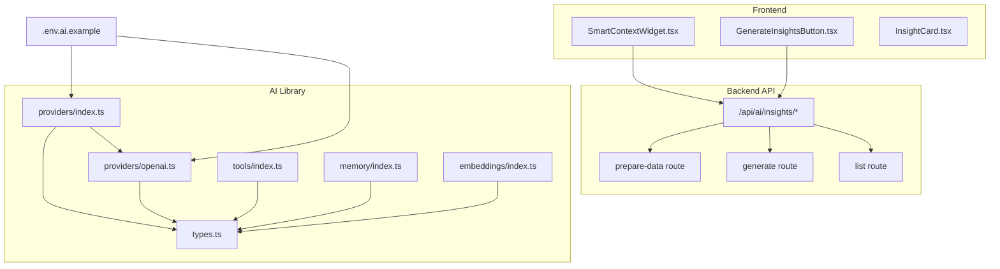
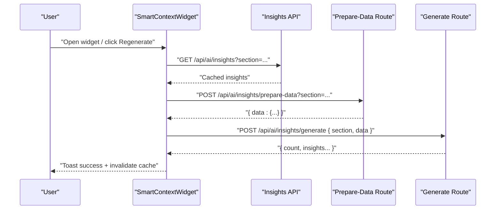
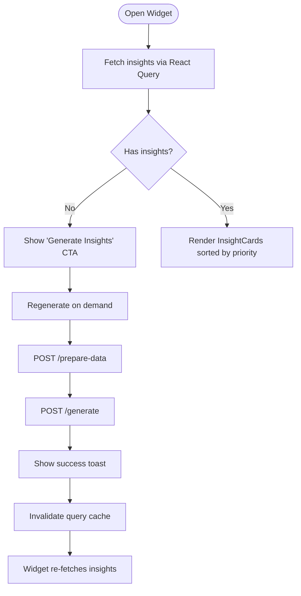
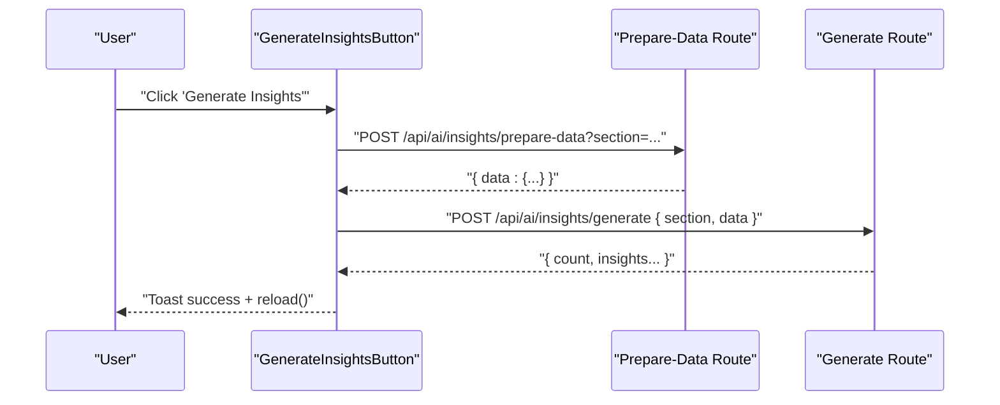
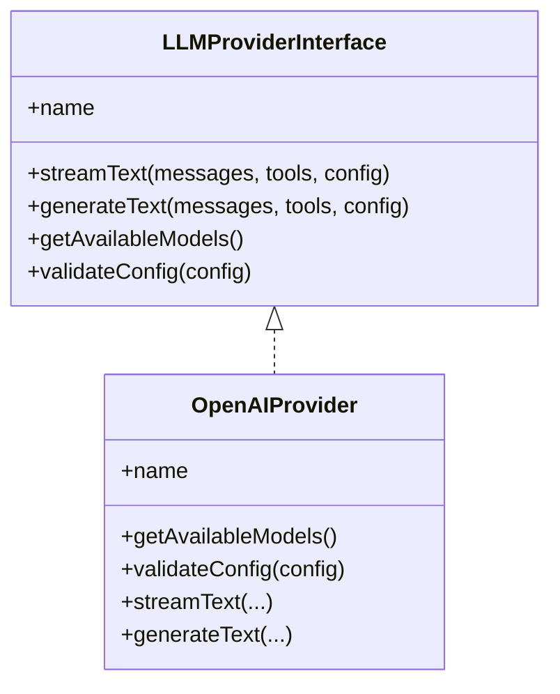
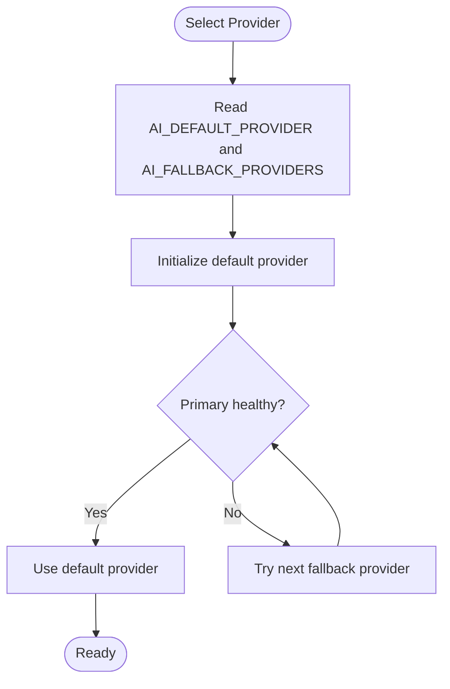
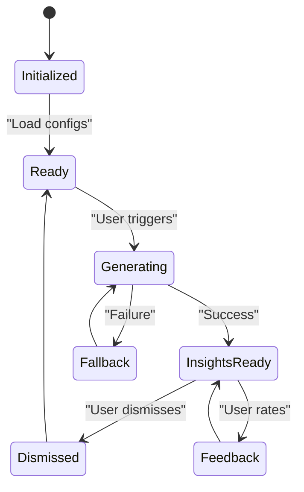
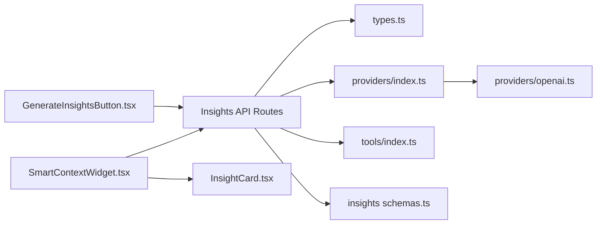

# AI Agent Configuration & Management

<cite>
**Referenced Files in This Document**
- [SmartContextWidget.tsx](file://src/components/ai/SmartContextWidget.tsx)
- [GenerateInsightsButton.tsx](file://src/components/ai/GenerateInsightsButton.tsx)
- [.env.ai.example](file://.env.ai.example)
- [types.ts](file://src/lib/ai/types.ts)
- [index.ts (providers)](file://src/lib/ai/providers/index.ts)
- [openai.ts](file://src/lib/ai/providers/openai.ts)
- [index.ts (tools)](file://src/lib/ai/tools/index.ts)
- [index.ts (memory)](file://src/lib/ai/memory/index.ts)
- [index.ts (embeddings)](file://src/lib/ai/embeddings/index.ts)
- [route.ts (insights API)](file://src/app/api/ai/insights/route.ts)
- [route.ts (prepare-data API)](file://src/app/api/ai/insights/prepare-data/route.ts)
- [route.ts (generate API)](file://src/app/api/ai/insights/generate/route.ts)
- [schemas.ts (insights schemas)](file://src/lib/ai/insights/schemas.ts)
- [InsightCard.tsx](file://src/components/ai/InsightCard.tsx)
</cite>

## Table of Contents

1. [Introduction](#introduction)
2. [Project Structure](#project-structure)
3. [Core Components](#core-components)
4. [Architecture Overview](#architecture-overview)
5. [Detailed Component Analysis](#detailed-component-analysis)
6. [Dependency Analysis](#dependency-analysis)
7. [Performance Considerations](#performance-considerations)
8. [Troubleshooting Guide](#troubleshooting-guide)
9. [Conclusion](#conclusion)
10. [Appendices](#appendices)

## Introduction

This document explains the AI agent configuration and management system in Opttius. It covers the multi-provider architecture supporting OpenAI, Anthropic, Google Gemini, DeepSeek, OpenRouter, Kilocode, and Minimax with automatic fallback. It documents agent initialization, provider selection and dynamic switching, configuration parameters (API keys, models, temperature, timeouts), and the lifecycle of AI insights generation. It also details the SmartContextWidget component for AI interaction management and the GenerateInsightsButton for triggering insight generation, along with health monitoring and failover strategies.

## Project Structure

The AI system is organized around:

- Frontend UI components for insight display and generation
- Backend API routes orchestrating data preparation and insight generation
- AI library modules for providers, tools, memory, embeddings, and types
- Environment configuration for provider credentials and defaults

**Diagram sources**

- [SmartContextWidget.tsx](file://src/components/ai/SmartContextWidget.tsx#L1-L340)
- [GenerateInsightsButton.tsx](file://src/components/ai/GenerateInsightsButton.tsx#L1-L93)
- [route.ts (insights API)](file://src/app/api/ai/insights/route.ts)
- [route.ts (prepare-data API)](file://src/app/api/ai/insights/prepare-data/route.ts)
- [route.ts (generate API)](file://src/app/api/ai/insights/generate/route.ts)
- [types.ts](file://src/lib/ai/types.ts#L1-L92)
- [index.ts (providers)](file://src/lib/ai/providers/index.ts#L1-L34)
- [openai.ts](file://src/lib/ai/providers/openai.ts#L1-L227)
- [index.ts (tools)](file://src/lib/ai/tools/index.ts#L1-L75)
- [index.ts (memory)](file://src/lib/ai/memory/index.ts#L1-L19)
- [index.ts (embeddings)](file://src/lib/ai/embeddings/index.ts#L1-L16)
- [.env.ai.example](file://.env.ai.example#L1-L61)

**Section sources**

- [SmartContextWidget.tsx](file://src/components/ai/SmartContextWidget.tsx#L1-L340)
- [GenerateInsightsButton.tsx](file://src/components/ai/GenerateInsightsButton.tsx#L1-L93)
- [route.ts (insights API)](file://src/app/api/ai/insights/route.ts)
- [route.ts (prepare-data API)](file://src/app/api/ai/insights/prepare-data/route.ts)
- [route.ts (generate API)](file://src/app/api/ai/insights/generate/route.ts)
- [types.ts](file://src/lib/ai/types.ts#L1-L92)
- [index.ts (providers)](file://src/lib/ai/providers/index.ts#L1-L34)
- [openai.ts](file://src/lib/ai/providers/openai.ts#L1-L227)
- [index.ts (tools)](file://src/lib/ai/tools/index.ts#L1-L75)
- [index.ts (memory)](file://src/lib/ai/memory/index.ts#L1-L19)
- [index.ts (embeddings)](file://src/lib/ai/embeddings/index.ts#L1-L16)
- [.env.ai.example](file://.env.ai.example#L1-L61)

## Core Components

- SmartContextWidget: A floating popover or embedded panel that displays AI insights for a given section, supports regenerating insights, dismissing, and providing feedback. It fetches cached insights and orchestrates the prepare-data and generate flows via API.
- GenerateInsightsButton: A trigger component that prepares real-time system data and requests insight generation, then refreshes the UI to reflect new insights.
- AI Types: Defines provider types, model metadata, configuration, messages, tool calls, streaming chunks, and provider interface contracts.
- Providers Registry: Central registry mapping provider identifiers to factory functions, enabling dynamic provider selection and fallback.
- Provider Implementations: Concrete provider classes implementing the provider interface, including OpenAI provider as a reference implementation.
- Tools: Aggregates domain-specific tools (products, orders, customers, analytics, etc.) and exposes validation and conversion utilities.
- Memory and Embeddings: Modules exposing memory managers and embedding factories for semantic search and persistent context.
- Environment Configuration: Example environment file defining provider credentials, base URLs, default models, fallback providers, and application URL.

**Section sources**

- [SmartContextWidget.tsx](file://src/components/ai/SmartContextWidget.tsx#L1-L340)
- [GenerateInsightsButton.tsx](file://src/components/ai/GenerateInsightsButton.tsx#L1-L93)
- [types.ts](file://src/lib/ai/types.ts#L1-L92)
- [index.ts (providers)](file://src/lib/ai/providers/index.ts#L1-L34)
- [openai.ts](file://src/lib/ai/providers/openai.ts#L1-L227)
- [index.ts (tools)](file://src/lib/ai/tools/index.ts#L1-L75)
- [index.ts (memory)](file://src/lib/ai/memory/index.ts#L1-L19)
- [index.ts (embeddings)](file://src/lib/ai/embeddings/index.ts#L1-L16)
- [.env.ai.example](file://.env.ai.example#L1-L61)

## Architecture Overview

The AI architecture follows a client-driven UI pattern with server-side orchestration:

- Frontend components call backend APIs to prepare data and generate insights.
- The backend routes coordinate data extraction, model selection, and provider invocation.
- Providers implement standardized streaming and non-streaming text generation with function/tool calling support.
- Fallback providers are configured via environment variables for resilience.

**Diagram sources**

- [SmartContextWidget.tsx](file://src/components/ai/SmartContextWidget.tsx#L104-L151)
- [route.ts (insights API)](file://src/app/api/ai/insights/route.ts)
- [route.ts (prepare-data API)](file://src/app/api/ai/insights/prepare-data/route.ts)
- [route.ts (generate API)](file://src/app/api/ai/insights/generate/route.ts)

## Detailed Component Analysis

### SmartContextWidget Component

SmartContextWidget renders a floating popover or embedded panel containing AI insights for a selected section. It:

- Fetches insights with caching and retry behavior.
- Supports regenerating insights by preparing live data and invoking the generation endpoint.
- Allows dismissing insights and sending feedback.
- Sorts insights by priority and displays a badge indicating the count.

**Diagram sources**

- [SmartContextWidget.tsx](file://src/components/ai/SmartContextWidget.tsx#L44-L151)

**Section sources**

- [SmartContextWidget.tsx](file://src/components/ai/SmartContextWidget.tsx#L1-L340)

### GenerateInsightsButton Component

GenerateInsightsButton initiates insight generation by:

- Preparing real-time system data from the prepare-data endpoint.
- Submitting the prepared payload to the generate endpoint.
- Showing a success toast and reloading the page to reflect new insights.

**Diagram sources**

- [GenerateInsightsButton.tsx](file://src/components/ai/GenerateInsightsButton.tsx#L20-L69)

**Section sources**

- [GenerateInsightsButton.tsx](file://src/components/ai/GenerateInsightsButton.tsx#L1-L93)

### Multi-Provider Architecture and Fallback

The system supports multiple LLM providers and automatic fallback:

- Provider registry maps provider identifiers to factory functions.
- The default provider and fallback providers are configured via environment variables.
- Provider implementations expose standardized methods for streaming and non-streaming text generation, model discovery, and configuration validation.

**Diagram sources**

- [types.ts](file://src/lib/ai/types.ts#L77-L91)
- [openai.ts](file://src/lib/ai/providers/openai.ts#L13-L227)

**Section sources**

- [index.ts (providers)](file://src/lib/ai/providers/index.ts#L1-L34)
- [openai.ts](file://src/lib/ai/providers/openai.ts#L1-L227)
- [types.ts](file://src/lib/ai/types.ts#L1-L92)
- [.env.ai.example](file://.env.ai.example#L50-L57)

### Configuration Parameters

Environment variables define provider credentials, base URLs, default models, and fallback chains:

- Provider credentials: OPENAI_API_KEY, ANTHROPIC_API_KEY, GOOGLE_API_KEY, DEEPSEEK_API_KEY, KILOCODE_API_KEY, MINIMAX_API_KEY.
- Base URLs and default models per provider.
- AI_DEFAULT_PROVIDER and AI_FALLBACK_PROVIDERS.
- NEXT_PUBLIC_APP_URL for tracking.

These values are consumed by provider implementations and configuration utilities to initialize clients and select models.

**Section sources**

- [.env.ai.example](file://.env.ai.example#L1-L61)

### Provider Selection and Dynamic Switching

Provider selection is driven by:

- Environment configuration for default and fallback providers.
- Model availability and capability checks via provider interfaces.
- Runtime configuration overrides passed to provider methods.

[No sources needed since this diagram shows conceptual workflow, not actual code structure]

### Agent Initialization and Lifecycle

Agent lifecycle management involves:

- Initializing provider instances using environment variables and configuration.
- Preparing context and data for insight generation.
- Executing generation and updating caches.
- Handling feedback and dismissal to refine future insights.

[No sources needed since this diagram shows conceptual workflow, not actual code structure]

### Safety Filters and Validation

Safety and correctness are ensured through:

- Tool call validation utilities to verify function names and parameters.
- Provider configuration validation to enforce required keys and supported models.
- Error handling in frontend components to surface actionable messages.

**Section sources**

- [index.ts (tools)](file://src/lib/ai/tools/index.ts#L52-L70)
- [openai.ts](file://src/lib/ai/providers/openai.ts#L50-L53)

### Practical Examples

- Agent setup: Configure .env.ai.example with desired provider credentials and defaults; ensure AI_FALLBACK_PROVIDERS lists providers in preference order.
- Provider health monitoring: Implement periodic health checks against provider endpoints and update availability flags; route requests to healthy providers first.
- Failover scenarios: On API errors, iterate through AI_FALLBACK_PROVIDERS until successful; log failures and reasons for diagnostics.

[No sources needed since this section provides general guidance]

## Dependency Analysis

The AI system exhibits clear module boundaries:

- UI components depend on API routes for data and actions.
- API routes depend on provider implementations and tooling.
- Provider implementations depend on shared types and environment configuration.
- Memory and embeddings modules provide foundational capabilities used by higher-level components.

**Diagram sources**

- [SmartContextWidget.tsx](file://src/components/ai/SmartContextWidget.tsx#L1-L340)
- [GenerateInsightsButton.tsx](file://src/components/ai/GenerateInsightsButton.tsx#L1-L93)
- [route.ts (insights API)](file://src/app/api/ai/insights/route.ts)
- [route.ts (prepare-data API)](file://src/app/api/ai/insights/prepare-data/route.ts)
- [route.ts (generate API)](file://src/app/api/ai/insights/generate/route.ts)
- [types.ts](file://src/lib/ai/types.ts#L1-L92)
- [index.ts (providers)](file://src/lib/ai/providers/index.ts#L1-L34)
- [openai.ts](file://src/lib/ai/providers/openai.ts#L1-L227)
- [index.ts (tools)](file://src/lib/ai/tools/index.ts#L1-L75)
- [schemas.ts (insights schemas)](file://src/lib/ai/insights/schemas.ts)

**Section sources**

- [index.ts (providers)](file://src/lib/ai/providers/index.ts#L1-L34)
- [openai.ts](file://src/lib/ai/providers/openai.ts#L1-L227)
- [types.ts](file://src/lib/ai/types.ts#L1-L92)
- [index.ts (tools)](file://src/lib/ai/tools/index.ts#L1-L75)
- [index.ts (memory)](file://src/lib/ai/memory/index.ts#L1-L19)
- [index.ts (embeddings)](file://src/lib/ai/embeddings/index.ts#L1-L16)

## Performance Considerations

- Caching: SmartContextWidget uses a 5-minute stale threshold for insights queries to reduce latency and API costs.
- Streaming: Provider implementations support streaming text generation for responsive UI updates.
- Model selection: Prefer smaller, efficient models for routine tasks and reserve larger models for complex reasoning.
- Retry and backoff: Implement exponential backoff on transient errors during insight generation.
- Resource allocation: Limit concurrent insight generations and batch tool calls where possible.

[No sources needed since this section provides general guidance]

## Troubleshooting Guide

Common issues and resolutions:

- Missing API keys: Ensure OPENAI_API_KEY, ANTHROPIC_API_KEY, GOOGLE_API_KEY, DEEPSEEK_API_KEY, KILOCODE_API_KEY, MINIMAX_API_KEY are set in the environment.
- Provider errors: Inspect provider-specific error messages returned from API responses; verify base URLs and model IDs.
- Fallback not triggered: Confirm AI_FALLBACK_PROVIDERS is configured and that primary provider health is monitored.
- Tool call validation failures: Validate tool names and parameters using the tool validation utilities.
- UI not refreshing: SmartContextWidget invalidates query cache after regeneration; ensure React Query cache is cleared.

**Section sources**

- [openai.ts](file://src/lib/ai/providers/openai.ts#L84-L87)
- [index.ts (tools)](file://src/lib/ai/tools/index.ts#L52-L70)
- [SmartContextWidget.tsx](file://src/components/ai/SmartContextWidget.tsx#L76-L79)

## Conclusion

Opttius implements a robust, multi-provider AI system with automatic fallback, standardized provider interfaces, and user-centric insight delivery. The SmartContextWidget and GenerateInsightsButton provide intuitive controls for insight generation and management, while backend routes coordinate data preparation and model execution. Proper configuration of environment variables and health monitoring ensures reliable operation and optimal performance.

## Appendices

### API Definitions

- GET /api/ai/insights?section=...
  - Purpose: Retrieve cached insights for a section.
  - Response: { insights: DatabaseInsight[] }
- POST /api/ai/insights/prepare-data?section=...
  - Purpose: Prepare real-time system data for insight generation.
  - Response: { data: Record<string, any> }
- POST /api/ai/insights/generate
  - Purpose: Generate insights using prepared data.
  - Request Body: { section: string, data: any }
  - Response: { count: number, insights: any[] }
- POST /api/ai/insights/{id}/dismiss
  - Purpose: Dismiss a specific insight.
- POST /api/ai/insights/{id}/feedback
  - Purpose: Submit feedback score for an insight.

**Section sources**

- [route.ts (insights API)](file://src/app/api/ai/insights/route.ts)
- [route.ts (prepare-data API)](file://src/app/api/ai/insights/prepare-data/route.ts)
- [route.ts (generate API)](file://src/app/api/ai/insights/generate/route.ts)
