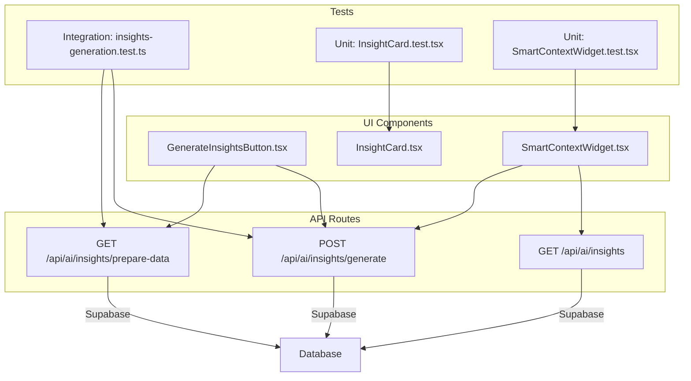
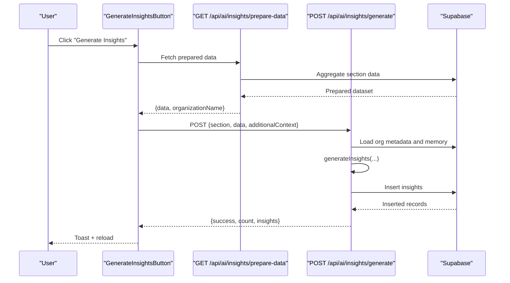
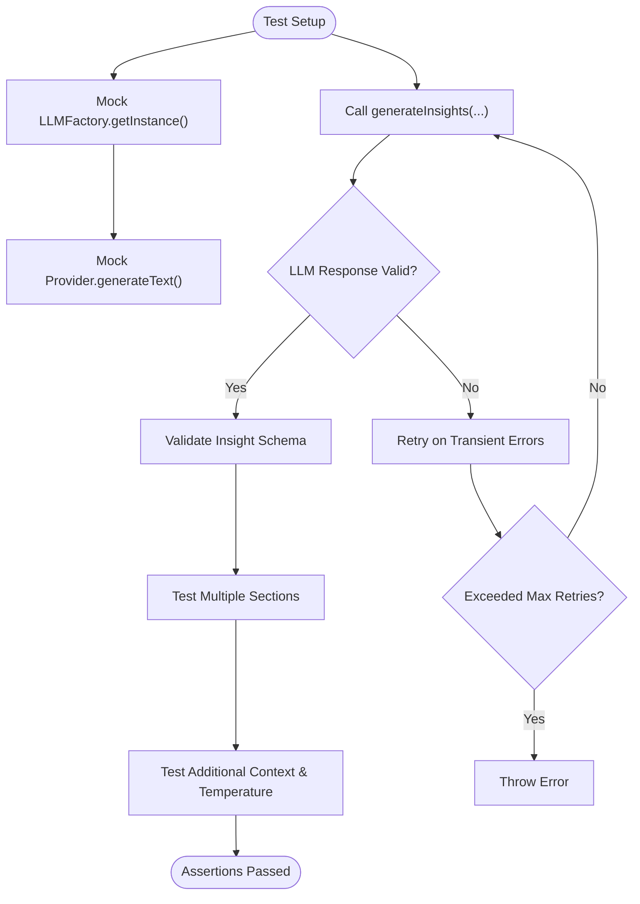
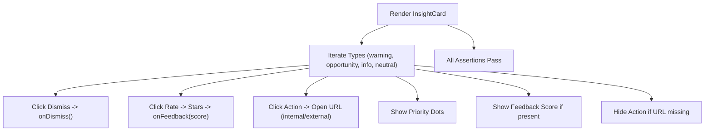
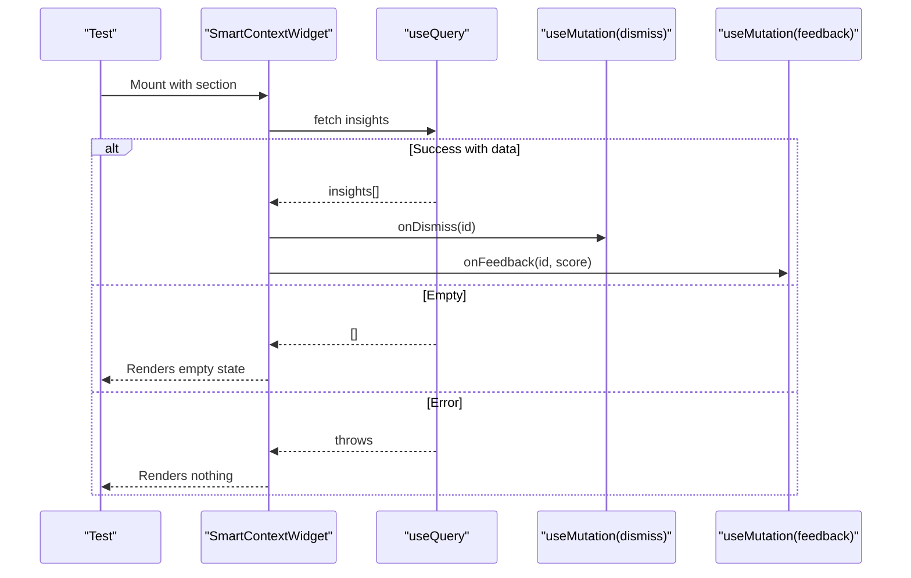
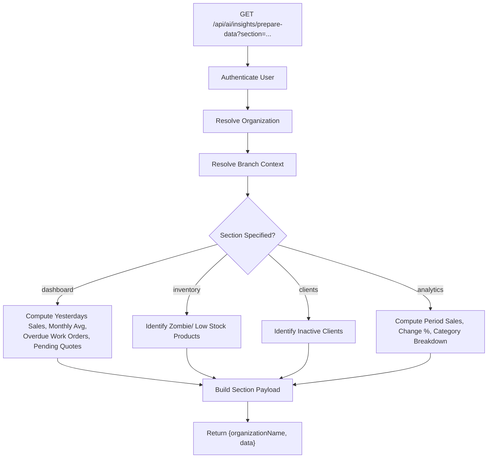
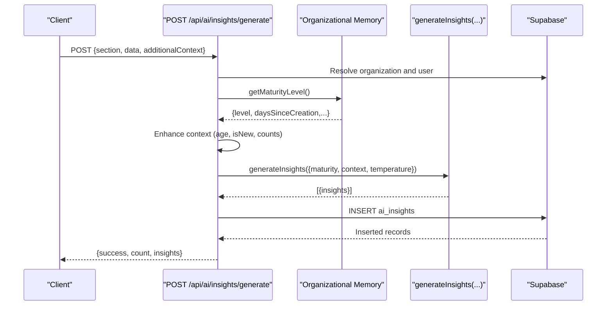
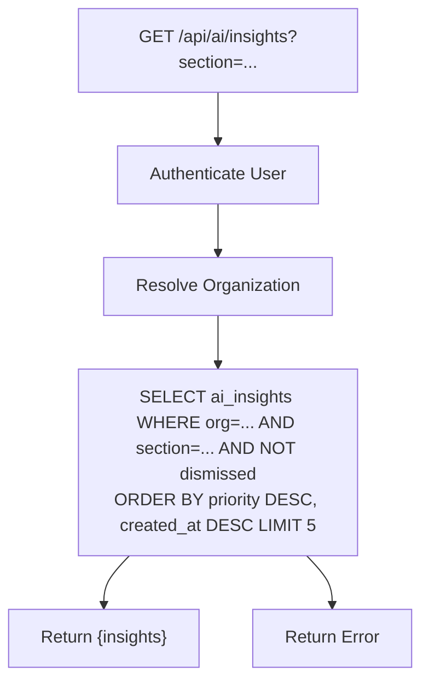
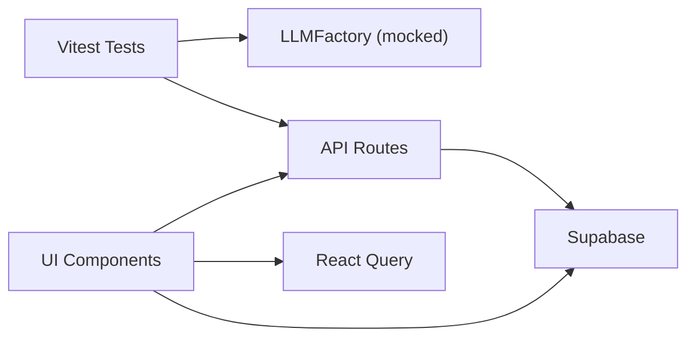

# AI Testing & Performance Monitoring

<cite>
**Referenced Files in This Document**
- [insights-generation.test.ts](file://src/__tests__/integration/ai/insights-generation.test.ts)
- [InsightCard.test.tsx](file://src/__tests__/unit/components/ai/InsightCard.test.tsx)
- [SmartContextWidget.test.tsx](file://src/__tests__/unit/components/ai/SmartContextWidget.test.tsx)
- [GenerateInsightsButton.tsx](file://src/components/ai/GenerateInsightsButton.tsx)
- [InsightCard.tsx](file://src/components/ai/InsightCard.tsx)
- [SmartContextWidget.tsx](file://src/components/ai/SmartContextWidget.tsx)
- [route.ts](file://src/app/api/ai/insights/route.ts)
- [route.ts](file://src/app/api/ai/insights/generate/route.ts)
- [route.ts](file://src/app/api/ai/insights/prepare-data/route.ts)
</cite>

## Table of Contents

1. [Introduction](#introduction)
2. [Project Structure](#project-structure)
3. [Core Components](#core-components)
4. [Architecture Overview](#architecture-overview)
5. [Detailed Component Analysis](#detailed-component-analysis)
6. [Dependency Analysis](#dependency-analysis)
7. [Performance Considerations](#performance-considerations)
8. [Troubleshooting Guide](#troubleshooting-guide)
9. [Conclusion](#conclusion)
10. [Appendices](#appendices)

## Introduction

This document describes the AI system testing strategies and performance monitoring capabilities implemented for the Opttius AI insights subsystem. It covers:

- Unit testing approaches for AI components (React UI and data models)
- Integration testing for multi-provider insight generation workflows
- End-to-end testing for insight generation pipelines
- Performance metrics and monitoring targets (response times, accuracy, cost, reliability)
- Test fixtures, mock providers, and scenario-based testing strategies
- Dashboards and alerting mechanisms for usage patterns, errors, and resource utilization
- A/B testing capabilities for comparing models/providers

## Project Structure

The AI insights testing and runtime spans three layers:

- API routes that orchestrate data preparation, insight generation, and persistence
- UI components that render and manage user interactions with insights
- Vitest-based unit and integration tests validating behavior and error handling

**Diagram sources**

- [insights-generation.test.ts](file://src/__tests__/integration/ai/insights-generation.test.ts#L1-L435)
- [InsightCard.test.tsx](file://src/__tests__/unit/components/ai/InsightCard.test.tsx#L1-L136)
- [SmartContextWidget.test.tsx](file://src/__tests__/unit/components/ai/SmartContextWidget.test.tsx#L1-L205)
- [GenerateInsightsButton.tsx](file://src/components/ai/GenerateInsightsButton.tsx#L1-L93)
- [SmartContextWidget.tsx](file://src/components/ai/SmartContextWidget.tsx#L1-L340)
- [InsightCard.tsx](file://src/components/ai/InsightCard.tsx#L1-L342)
- [route.ts](file://src/app/api/ai/insights/route.ts#L1-L93)
- [route.ts](file://src/app/api/ai/insights/generate/route.ts#L1-L279)
- [route.ts](file://src/app/api/ai/insights/prepare-data/route.ts#L1-L474)

**Section sources**

- [insights-generation.test.ts](file://src/__tests__/integration/ai/insights-generation.test.ts#L1-L435)
- [InsightCard.test.tsx](file://src/__tests__/unit/components/ai/InsightCard.test.tsx#L1-L136)
- [SmartContextWidget.test.tsx](file://src/__tests__/unit/components/ai/SmartContextWidget.test.tsx#L1-L205)
- [GenerateInsightsButton.tsx](file://src/components/ai/GenerateInsightsButton.tsx#L1-L93)
- [SmartContextWidget.tsx](file://src/components/ai/SmartContextWidget.tsx#L1-L340)
- [InsightCard.tsx](file://src/components/ai/InsightCard.tsx#L1-L342)
- [route.ts](file://src/app/api/ai/insights/route.ts#L1-L93)
- [route.ts](file://src/app/api/ai/insights/generate/route.ts#L1-L279)
- [route.ts](file://src/app/api/ai/insights/prepare-data/route.ts#L1-L474)

## Core Components

- Integration tests for insight generation validate:
  - Successful generation with and without maturity adaptation
  - Handling of JSON wrapped in markdown code blocks
  - Multi-section generation coverage
  - Retry logic for transient failures
  - Validation of insight structure and schema compliance
  - Customization via temperature and additional context
- Unit tests for UI components validate:
  - Rendering and behavior of InsightCard across insight types and priorities
  - Dismiss and feedback interactions
  - SmartContextWidget loading, empty states, error handling, and mutation flows
- API routes implement:
  - Data preparation for multiple sections (dashboard, inventory, clients, analytics)
  - Insight generation with organizational memory and maturity adaptation
  - Retrieval and persistence of insights with rate limiting and logging

**Section sources**

- [insights-generation.test.ts](file://src/__tests__/integration/ai/insights-generation.test.ts#L52-L435)
- [InsightCard.test.tsx](file://src/__tests__/unit/components/ai/InsightCard.test.tsx#L23-L136)
- [SmartContextWidget.test.tsx](file://src/__tests__/unit/components/ai/SmartContextWidget.test.tsx#L19-L205)
- [route.ts](file://src/app/api/ai/insights/prepare-data/route.ts#L64-L453)
- [route.ts](file://src/app/api/ai/insights/generate/route.ts#L134-L184)
- [route.ts](file://src/app/api/ai/insights/route.ts#L17-L81)

## Architecture Overview

The insight generation pipeline integrates UI, API, and data layers:

**Diagram sources**

- [GenerateInsightsButton.tsx](file://src/components/ai/GenerateInsightsButton.tsx#L20-L69)
- [route.ts](file://src/app/api/ai/insights/prepare-data/route.ts#L13-L460)
- [route.ts](file://src/app/api/ai/insights/generate/route.ts#L32-L208)

## Detailed Component Analysis

### Integration Tests: Insight Generation Workflow

These tests validate the end-to-end generation flow with mocks for the LLM factory and provider, ensuring robustness against provider failures and schema validation.

**Diagram sources**

- [insights-generation.test.ts](file://src/__tests__/integration/ai/insights-generation.test.ts#L28-L293)

**Section sources**

- [insights-generation.test.ts](file://src/__tests__/integration/ai/insights-generation.test.ts#L52-L203)
- [insights-generation.test.ts](file://src/__tests__/integration/ai/insights-generation.test.ts#L205-L293)
- [insights-generation.test.ts](file://src/__tests__/integration/ai/insights-generation.test.ts#L295-L435)

### Unit Tests: InsightCard Component

Validates rendering and user interactions for different insight types, priorities, actions, and feedback.

**Diagram sources**

- [InsightCard.test.tsx](file://src/__tests__/unit/components/ai/InsightCard.test.tsx#L23-L136)

**Section sources**

- [InsightCard.test.tsx](file://src/__tests__/unit/components/ai/InsightCard.test.tsx#L23-L136)
- [InsightCard.tsx](file://src/components/ai/InsightCard.tsx#L24-L342)

### Unit Tests: SmartContextWidget Component

Validates loading states, empty states, error handling, dismissal, and feedback mutations.

**Diagram sources**

- [SmartContextWidget.test.tsx](file://src/__tests__/unit/components/ai/SmartContextWidget.test.tsx#L19-L205)

**Section sources**

- [SmartContextWidget.test.tsx](file://src/__tests__/unit/components/ai/SmartContextWidget.test.tsx#L19-L205)
- [SmartContextWidget.tsx](file://src/components/ai/SmartContextWidget.tsx#L44-L151)

### API Layer: Data Preparation

Aggregates real system data for each section, applying branch-aware filters and computing derived metrics.

**Diagram sources**

- [route.ts](file://src/app/api/ai/insights/prepare-data/route.ts#L13-L460)

**Section sources**

- [route.ts](file://src/app/api/ai/insights/prepare-data/route.ts#L64-L453)

### API Layer: Insight Generation

Performs organizational memory lookup, enhances context, generates insights, and persists results.

**Diagram sources**

- [route.ts](file://src/app/api/ai/insights/generate/route.ts#L32-L208)

**Section sources**

- [route.ts](file://src/app/api/ai/insights/generate/route.ts#L81-L152)
- [route.ts](file://src/app/api/ai/insights/generate/route.ts#L154-L184)

### API Layer: Insight Retrieval

Fetches non-dismissed insights ordered by priority and recency.

**Diagram sources**

- [route.ts](file://src/app/api/ai/insights/route.ts#L17-L81)

**Section sources**

- [route.ts](file://src/app/api/ai/insights/route.ts#L17-L81)

## Dependency Analysis

- Tests depend on:
  - Mocked LLMFactory and provider to isolate AI generation logic
  - API routes for data preparation and generation
  - UI components for rendering and interaction validation
- UI components depend on:
  - React Query for caching and mutations
  - Supabase client for authenticated requests
  - UI primitives for accessibility and styling
- API routes depend on:
  - Supabase for organization/user resolution and data aggregation
  - Logging for observability
  - Rate limiting middleware for resilience

**Diagram sources**

- [insights-generation.test.ts](file://src/__tests__/integration/ai/insights-generation.test.ts#L6-L50)
- [route.ts](file://src/app/api/ai/insights/generate/route.ts#L1-L15)
- [SmartContextWidget.tsx](file://src/components/ai/SmartContextWidget.tsx#L1-L25)

**Section sources**

- [insights-generation.test.ts](file://src/__tests__/integration/ai/insights-generation.test.ts#L6-L50)
- [SmartContextWidget.tsx](file://src/components/ai/SmartContextWidget.tsx#L44-L101)
- [route.ts](file://src/app/api/ai/insights/generate/route.ts#L39-L86)

## Performance Considerations

Recommended metrics and monitoring targets for the AI insights system:

- Response times
  - Data preparation endpoint: target median under 1–2 seconds; p95 under 5 seconds
  - Generation endpoint: target median under 3–5 seconds; p95 under 10 seconds
  - Retrieval endpoint: target median under 200ms; p95 under 500ms
- Accuracy and quality
  - Insight schema validation pass rate: target near 100%
  - Valid insight types and priorities: enforce strict schema checks
- Cost per query
  - Track tokens consumed per insight generation; budget thresholds per provider/model
- Provider reliability
  - Availability: target >99%
  - Latency SLOs per provider
  - Retry success rate and failure classification (transient vs. validation)
- Resource utilization
  - CPU and memory during generation
  - Database query latency and row counts per section
- Observability
  - Request logs with correlation IDs
  - Error rates and stack traces
  - Feature flag usage for A/B testing

[No sources needed since this section provides general guidance]

## Troubleshooting Guide

Common issues and remediation steps:

- Authentication failures
  - Symptoms: Unauthorized responses from API routes
  - Actions: Verify session, user role, and organization membership
- Organization not found
  - Symptoms: 404 responses when resolving organization
  - Actions: Confirm admin user record and active flag
- No LLM providers configured
  - Symptoms: 503 responses indicating missing provider configuration
  - Actions: Configure at least one provider and verify credentials
- Validation errors in insight format
  - Symptoms: Rejection of insights with invalid fields or priority ranges
  - Actions: Align LLM output with schema; add post-processing to extract JSON from markdown
- Network/transient failures
  - Symptoms: Retries exhausted; partial success
  - Actions: Increase retry limits; classify errors; monitor provider health
- UI not rendering insights
  - Symptoms: Empty widget or loading spinner indefinitely
  - Actions: Inspect fetch responses; verify cache keys and error boundaries

**Section sources**

- [route.ts](file://src/app/api/ai/insights/generate/route.ts#L42-L64)
- [route.ts](file://src/app/api/ai/insights/route.ts#L27-L49)
- [route.ts](file://src/app/api/ai/insights/generate/route.ts#L192-L200)
- [SmartContextWidget.test.tsx](file://src/__tests__/unit/components/ai/SmartContextWidget.test.tsx#L81-L97)

## Conclusion

The Opttius AI insights system includes comprehensive testing across unit, integration, and end-to-end scopes, with robust error handling and validation. The API routes encapsulate data preparation, generation, and persistence, while UI components provide interactive experiences with feedback and dismissal. To operationalize performance and reliability, adopt the recommended metrics, dashboards, and alerting strategies outlined above.

[No sources needed since this section summarizes without analyzing specific files]

## Appendices

### Test Fixtures and Scenarios

- Integration test fixtures
  - Mock provider with generateText returning structured JSON or markdown-wrapped JSON
  - Maturity levels for growing organizations
  - Additional context payloads for enhanced generation
- Scenario-based testing strategies
  - Happy path: successful generation with and without maturity adaptation
  - Edge cases: markdown-wrapped JSON, missing action URLs, invalid priorities
  - Resilience: transient failures with retry, persistent validation errors, no providers
  - Coverage: all supported sections (dashboard, inventory, clients, analytics)

**Section sources**

- [insights-generation.test.ts](file://src/__tests__/integration/ai/insights-generation.test.ts#L52-L203)
- [insights-generation.test.ts](file://src/__tests__/integration/ai/insights-generation.test.ts#L205-L293)
- [insights-generation.test.ts](file://src/__tests__/integration/ai/insights-generation.test.ts#L295-L435)

### Monitoring Dashboards and Alerts

Proposed dashboard panels and alerts:

- Usage panels
  - Requests per minute by endpoint and section
  - Active insights by organization and section
- Performance panels
  - Latency distributions (p50/p95) per endpoint
  - Throughput and error rates by provider/model
- Reliability panels
  - Provider availability and retry success rates
  - Schema validation pass rates
- Alerts
  - Endpoint latency breaches (e.g., p95 > threshold)
  - Provider outage or error spikes
  - Validation failure rate increase
  - Cost anomaly detection (tokens or requests)

[No sources needed since this section provides general guidance]

### A/B Testing Capabilities

- Model comparisons
  - Compare different models (e.g., Claude 3.5 Sonnet vs. GPT variants) using identical datasets
  - Measure quality, cost, and latency differences
- Provider configuration experiments
  - Test temperature, max tokens, and prompt customizations
  - Evaluate impact on relevance and user feedback scores
- Rollout strategy
  - Gradual traffic split by organization or branch
  - Monitor KPIs and revert on regressions

[No sources needed since this section provides general guidance]
