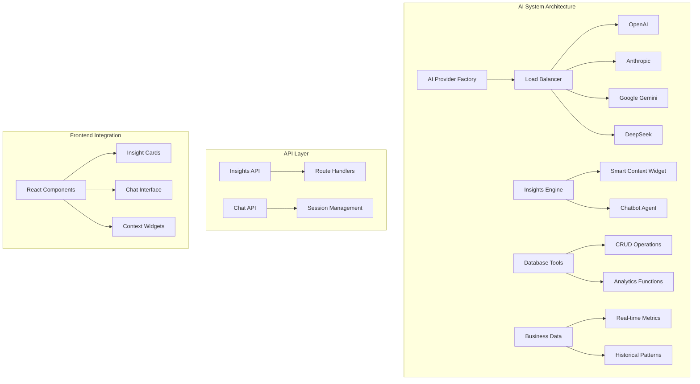
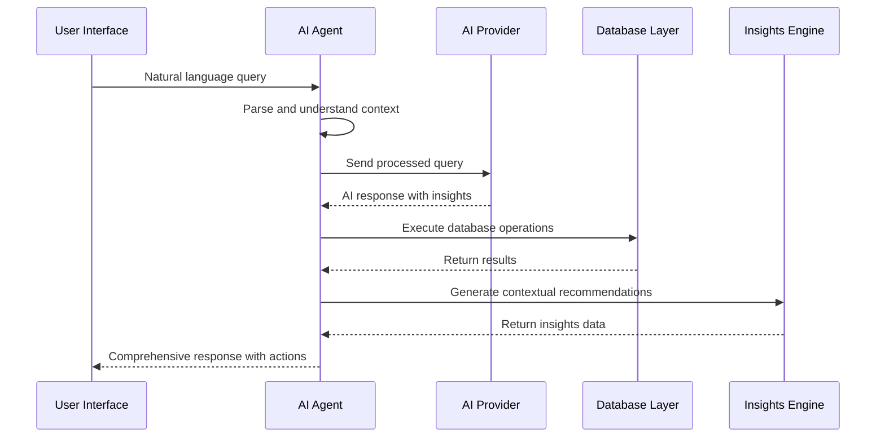
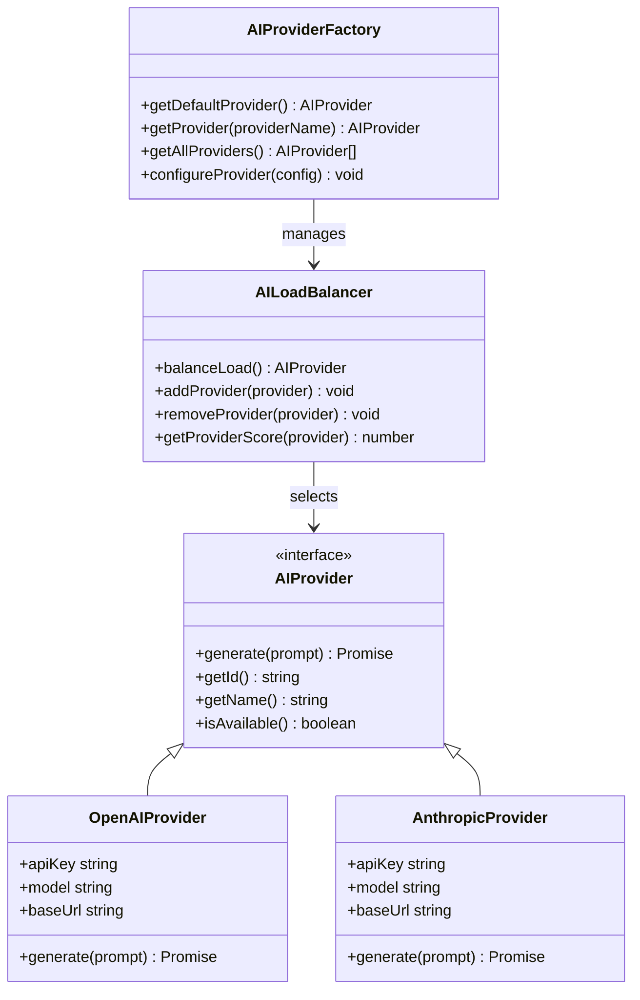
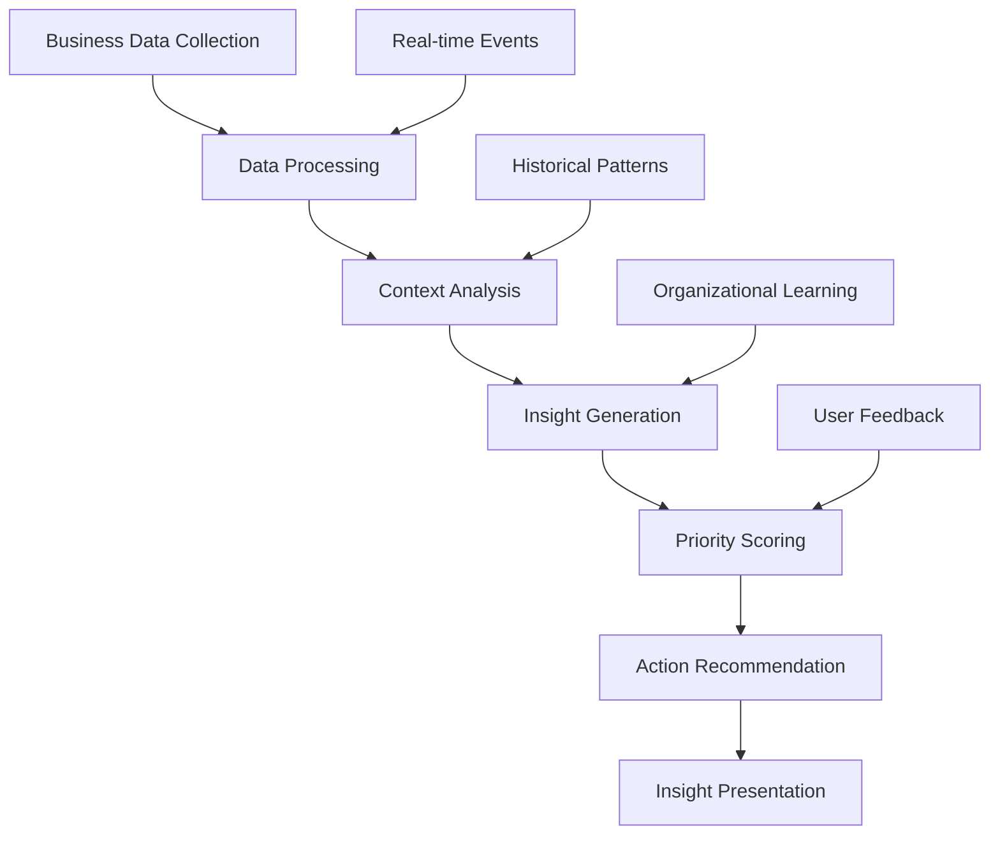
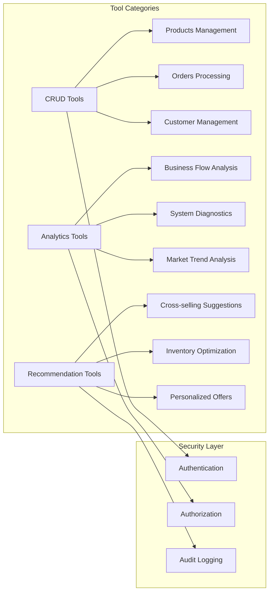

# AI-Powered Insights System

<cite>
**Referenced Files in This Document**
- [README.md](file://README.md)
- [.env.ai.example](file://.env.ai.example)
- [AI_IMPLEMENTATION_GUIDE.md](file://docs/AI_IMPLEMENTATION_GUIDE.md)
- [AI_INSIGHTS_GUIDE.md](file://docs/AI_INSIGHTS_GUIDE.md)
- [AI_ARCHITECTURE_DIAGRAM.md](file://docs/AI_ARCHITECTURE_DIAGRAM.md)
- [route.ts](file://src/app/api/ai/insights/route.ts)
- [AI_PROVIDER_FACTORY.md](file://docs/AI_PROVIDER_FACTORY.md)
- [AI_PROVIDER_SELECTION.md](file://docs/AI_PROVIDER_SELECTION.md)
- [AI_CHATBOT_IMPLEMENTATION.md](file://docs/AI_CHATBOT_IMPLEMENTATION.md)
- [AI_TOOLS_IMPLEMENTATION.md](file://docs/AI_TOOLS_IMPLEMENTATION.md)
- [AI_SAFETY_BIAS_MITIGATION.md](file://docs/AI_SAFETY_BIAS_MITIGATION.md)
- [AI_PERFORMANCE_OPTIMIZATION.md](file://docs/AI_PERFORMANCE_OPTIMIZATION.md)
- [AI_TESTING_STRATEGY.md](file://docs/AI_TESTING_STRATEGY.md)
- [AI_IMPLEMENTATION_STATUS.md](file://docs/AI_IMPLEMENTATION_STATUS.md)
- [AI_SYSTEM_IMPROVEMENT_PLAN.md](file://docs/AI_SYSTEM_IMPROVEMENT_PLAN.md)
</cite>

## Table of Contents

1. [Introduction](#introduction)
2. [Project Structure](#project-structure)
3. [Core Components](#core-components)
4. [Architecture Overview](#architecture-overview)
5. [Detailed Component Analysis](#detailed-component-analysis)
6. [Multi-Provider AI Architecture](#multi-provider-ai-architecture)
7. [AI Agent Configuration](#ai-agent-configuration)
8. [Natural Language Processing](#natural-language-processing)
9. [Database Tool Calling](#database-tool-calling)
10. [Insight Generation Examples](#insight-generation-examples)
11. [Chatbot Interactions](#chatbot-interactions)
12. [Automated Workflows](#automated-workflows)
13. [Configuration Options](#configuration-options)
14. [Business Data Integration](#business-data-integration)
15. [Safety Measures and Bias Mitigation](#safety-measures-and-bias-mitigation)
16. [Performance Optimization](#performance-optimization)
17. [Troubleshooting Guide](#troubleshooting-guide)
18. [Conclusion](#conclusion)

## Introduction

The Opttius AI-powered insights system represents a sophisticated multi-layered artificial intelligence architecture designed specifically for optical practice management. This system transforms raw business data into actionable insights through advanced natural language processing, intelligent data analysis, and automated workflow orchestration.

The system supports multiple AI providers including OpenAI, Anthropic, Google Gemini, and DeepSeek, featuring automatic fallback capabilities and intelligent load balancing. It operates as both a proactive insights engine and an interactive chatbot assistant, providing contextual recommendations based on real-time business metrics and historical patterns.

Built with a focus on healthcare-specific terminology and optical industry requirements, the system ensures compliance with medical data standards while delivering powerful analytical capabilities to optimize practice operations, patient care, and business performance.

## Project Structure

The AI system is integrated throughout the Opttius application architecture, with dedicated components for insights generation, chatbot functionality, and database tool integration.

**Diagram sources**

- [AI_ARCHITECTURE_DIAGRAM.md](file://docs/AI_ARCHITECTURE_DIAGRAM.md#L5-L54)
- [AI_IMPLEMENTATION_GUIDE.md](file://docs/AI_IMPLEMENTATION_GUIDE.md#L83-L173)

The system follows a modular architecture pattern with clear separation of concerns between provider management, insights generation, tool calling, and user interface components.

**Section sources**

- [README.md](file://README.md#L83-L84)
- [AI_ARCHITECTURE_DIAGRAM.md](file://docs/AI_ARCHITECTURE_DIAGRAM.md#L1-L414)

## Core Components

### Multi-Provider AI Infrastructure

The system implements a sophisticated multi-provider architecture supporting four major AI providers with automatic failover capabilities. Each provider is configured through environment variables with fallback mechanisms ensuring high availability and optimal performance.

### Intelligent Insights Engine

The insights engine generates contextual recommendations based on real-time business metrics, historical patterns, and organizational learning. It operates through a widget-based interface that appears in key application sections, providing immediate actionable insights without disrupting workflow.

### Advanced Chatbot Agent

The chatbot serves as an intelligent assistant capable of understanding natural language queries about business operations, generating reports, managing inventory, and providing recommendations. It maintains conversational context and can access real-time data through secure database tool calling.

### Database Integration Layer

The system includes comprehensive database tool integration allowing AI agents to perform CRUD operations, generate analytics, and maintain organizational memory. This ensures seamless interaction with business data while maintaining security and compliance standards.

**Section sources**

- [.env.ai.example](file://.env.ai.example#L1-L61)
- [AI_IMPLEMENTATION_GUIDE.md](file://docs/AI_IMPLEMENTATION_GUIDE.md#L45-L81)

## Architecture Overview

The AI system architecture follows a distributed pattern with clear separation between provider management, context processing, and business intelligence layers.

**Diagram sources**

- [AI_ARCHITECTURE_DIAGRAM.md](file://docs/AI_ARCHITECTURE_DIAGRAM.md#L60-L81)

The architecture ensures fault tolerance through provider redundancy, maintains data privacy through secure API patterns, and provides scalable performance through intelligent caching and rate limiting.

## Detailed Component Analysis

### AI Provider Management System

The provider management system handles authentication, configuration, and dynamic selection of AI services. It supports multiple authentication methods and automatically switches between providers based on performance metrics and availability.

**Diagram sources**

- [AI_ARCHITECTURE_DIAGRAM.md](file://docs/AI_ARCHITECTURE_DIAGRAM.md#L206-L253)

**Section sources**

- [AI_PROVIDER_FACTORY.md](file://docs/AI_PROVIDER_FACTORY.md)
- [AI_PROVIDER_SELECTION.md](file://docs/AI_PROVIDER_SELECTION.md)

### Insights Generation Pipeline

The insights generation pipeline processes business data through multiple stages including data collection, analysis, contextualization, and presentation.

**Diagram sources**

- [AI_IMPLEMENTATION_GUIDE.md](file://docs/AI_IMPLEMENTATION_GUIDE.md#L177-L276)

**Section sources**

- [AI_IMPLEMENTATION_GUIDE.md](file://docs/AI_IMPLEMENTATION_GUIDE.md#L177-L276)

### Database Tool Integration

The database tool integration enables AI agents to perform secure, authenticated operations on business data while maintaining proper access controls and audit trails.

**Diagram sources**

- [AI_ARCHITECTURE_DIAGRAM.md](file://docs/AI_ARCHITECTURE_DIAGRAM.md#L130-L173)

**Section sources**

- [AI_TOOLS_IMPLEMENTATION.md](file://docs/AI_TOOLS_IMPLEMENTATION.md)

## Multi-Provider AI Architecture

The multi-provider architecture ensures high availability, optimal performance, and cost-effectiveness through intelligent provider selection and automatic failover mechanisms.

### Provider Configuration and Selection

Each AI provider requires specific configuration including API keys, base URLs, and default models. The system supports both direct provider connections and proxy services like OpenRouter for unified access.

### Automatic Fallback Mechanisms

The load balancer continuously monitors provider performance metrics including latency, error rates, and cost-effectiveness. When primary providers fail or exceed performance thresholds, the system automatically switches to backup providers with minimal disruption.

### Cost Optimization Strategies

The system implements dynamic pricing optimization by selecting the most cost-effective providers for different operation types while maintaining quality thresholds and performance guarantees.

**Section sources**

- [.env.ai.example](file://.env.ai.example#L1-L61)
- [AI_ARCHITECTURE_DIAGRAM.md](file://docs/AI_ARCHITECTURE_DIAGRAM.md#L206-L253)

## AI Agent Configuration

The AI agent configuration encompasses provider selection, model parameters, safety settings, and operational constraints tailored for healthcare and optical industry applications.

### Provider Selection Criteria

The system evaluates providers based on multiple criteria including response time, accuracy metrics, cost per token, and specialized capabilities for optical industry terminology and medical compliance requirements.

### Model Parameter Optimization

Configuration includes temperature settings for creativity vs. accuracy balance, maximum response lengths for different use cases, and safety filters for medical content appropriateness.

### Safety and Compliance Framework

The agent incorporates healthcare-specific safety measures including HIPAA-compliant data handling, medical terminology validation, and bias mitigation for demographic and health-related topics.

**Section sources**

- [AI_CHATBOT_IMPLEMENTATION.md](file://docs/AI_CHATBOT_IMPLEMENTATION.md)
- [AI_SAFETY_BIAS_MITIGATION.md](file://docs/AI_SAFETY_BIAS_MITIGATION.md)

## Natural Language Processing

The natural language processing system is specifically tuned for optical practice management, understanding industry-specific terminology, medical contexts, and business operations.

### Domain-Specific Language Models

The system employs specialized prompts and training data focused on optical practices, including terminology for prescriptions, lens materials, frame types, and medical conditions. This ensures accurate interpretation of queries related to patient care, inventory management, and business operations.

### Contextual Understanding

Advanced context management allows the system to understand temporal relationships, hierarchical data structures, and multi-step business processes. This enables sophisticated conversations about complex topics like patient histories, treatment plans, and inventory cycles.

### Medical Terminology Processing

Specialized handling of medical terms, prescription formats, and healthcare regulations ensures appropriate responses to queries involving patient data, treatment recommendations, and regulatory compliance.

**Section sources**

- [AI_IMPLEMENTATION_GUIDE.md](file://docs/AI_IMPLEMENTATION_GUIDE.md#L278-L343)

## Database Tool Calling

The database tool calling system provides secure, authenticated access to business data while maintaining strict security boundaries and audit capabilities.

### CRUD Operation Tools

Comprehensive database tools enable AI agents to perform create, read, update, and delete operations across all business domains including products, orders, customers, appointments, and inventory management.

### Analytics and Reporting Tools

Advanced analytics tools provide business intelligence capabilities including sales trends, customer behavior analysis, inventory optimization recommendations, and performance metrics generation.

### Security and Access Control

All database operations are performed through secure API endpoints with proper authentication, authorization, and audit logging. The system maintains data privacy compliance while enabling necessary business insights.

**Section sources**

- [AI_TOOLS_IMPLEMENTATION.md](file://docs/AI_TOOLS_IMPLEMENTATION.md)

## Insight Generation Examples

The system generates actionable insights across multiple business domains, each tailored to specific operational contexts and stakeholder needs.

### Dashboard Intelligence

Executive dashboards receive comprehensive business intelligence including sales performance comparisons, inventory turnover analysis, staff productivity metrics, and market trend interpretations. These insights help leadership make informed strategic decisions.

### Inventory Optimization

Inventory management receives real-time recommendations for stock replenishment, slow-moving item identification, markdown opportunities, and supplier relationship optimization based on demand patterns and seasonal trends.

### Customer Relationship Management

Customer insights focus on identifying at-risk patients, recommending personalized treatment plans, suggesting upsell opportunities, and providing engagement strategies based on behavioral patterns and medical history.

### Operational Efficiency

Operational insights target workflow optimization, resource allocation improvements, quality metric enhancements, and compliance monitoring to ensure optimal practice performance.

**Section sources**

- [AI_INSIGHTS_GUIDE.md](file://docs/AI_INSIGHTS_GUIDE.md#L192-L224)

## Chatbot Interactions

The chatbot provides conversational access to AI capabilities with natural language processing, context retention, and multi-modal interaction support.

### Conversational Intelligence

The chatbot understands complex queries, maintains conversation context, handles follow-up questions, and provides relevant recommendations based on user preferences and business context.

### Interactive Assistance

Users can engage in natural conversations about business operations, request specific reports, initiate workflows, and receive guidance on complex procedures. The system adapts its communication style based on user roles and familiarity with the system.

### Multi-Modal Responses

Responses include text-based answers, actionable links to relevant system sections, visual charts and graphs, and direct workflow initiation capabilities for immediate action.

**Section sources**

- [README.md](file://README.md#L569-L597)

## Automated Workflows

The system orchestrates complex business processes through AI-driven automation while maintaining human oversight and approval capabilities.

### Workflow Automation

Automated workflows handle routine tasks including order processing, inventory updates, customer notifications, appointment scheduling, and reporting generation. These workflows trigger based on predefined conditions and business rules.

### Decision Support Systems

Advanced decision support provides recommendations for complex scenarios including treatment planning, inventory purchasing, staff scheduling, and strategic planning based on comprehensive data analysis.

### Exception Handling

The system identifies exceptions and anomalies in business processes, automatically escalates critical issues, and provides recommended interventions to prevent operational disruptions.

**Section sources**

- [AI_IMPLEMENTATION_GUIDE.md](file://docs/AI_IMPLEMENTATION_GUIDE.md#L373-L435)

## Configuration Options

The AI system offers extensive configuration options for providers, models, safety settings, and operational parameters.

### Provider Configuration

Environment-based configuration supports multiple AI providers with individual API keys, base URLs, and model specifications. The system includes fallback provider lists and automatic failover settings.

### Model Selection

Flexible model selection allows different AI models for various use cases including high-throughput operations, specialized analysis, and cost-optimized processing. Temperature settings and response constraints can be adjusted per use case.

### Safety and Compliance Settings

Comprehensive safety configurations include content filtering, bias mitigation, medical terminology validation, and compliance enforcement for healthcare regulations and data privacy requirements.

### Performance Tuning

Performance optimization includes caching strategies, rate limiting, provider selection algorithms, and resource allocation to ensure optimal system responsiveness under varying load conditions.

**Section sources**

- [.env.ai.example](file://.env.ai.example#L47-L61)

## Business Data Integration

The AI system integrates seamlessly with existing business data sources, providing contextual insights while maintaining data integrity and security.

### Real-Time Data Access

The system accesses live business data including sales transactions, inventory levels, customer profiles, appointment schedules, and financial metrics to provide current insights and recommendations.

### Historical Pattern Analysis

Machine learning algorithms analyze historical data to identify trends, predict future outcomes, and provide benchmarking against industry standards and organizational goals.

### Multi-Tenant Architecture

Support for multiple organizations with isolated data access, customized insights generation, and role-based permissions ensures scalability and security across different practice sizes and configurations.

**Section sources**

- [AI_INSIGHTS_GUIDE.md](file://docs/AI_INSIGHTS_GUIDE.md#L155-L191)

## Safety Measures and Bias Mitigation

The AI system incorporates comprehensive safety measures and bias mitigation strategies specifically tailored for healthcare and optical industry applications.

### Medical Content Safety

Specialized content filtering ensures appropriate responses to medical queries, avoids harmful recommendations, and maintains professional medical standards in all interactions.

### Bias Prevention

Systematic bias mitigation includes balanced representation in training data, fairness-aware algorithms, diverse evaluation datasets, and continuous monitoring for discriminatory patterns in AI outputs.

### Privacy Protection

Robust privacy protection includes HIPAA-compliant data handling, encrypted communications, access logging, and automated data anonymization for research and analytics purposes.

### Regulatory Compliance

The system maintains compliance with healthcare regulations including HIPAA, medical device regulations, and industry-specific standards through automated compliance checking and policy enforcement.

**Section sources**

- [AI_SAFETY_BIAS_MITIGATION.md](file://docs/AI_SAFETY_BIAS_MITIGATION.md)

## Performance Optimization

The AI system implements comprehensive performance optimization strategies to ensure reliable operation under varying loads and diverse use cases.

### Provider Load Balancing

Intelligent load balancing distributes requests across multiple AI providers based on real-time performance metrics, cost considerations, and capacity utilization to maximize throughput and minimize response times.

### Caching Strategies

Multi-level caching includes request caching, result caching, model parameter caching, and context preservation to reduce latency and improve user experience while maintaining data freshness.

### Resource Management

Efficient resource management includes auto-scaling capabilities, memory optimization, concurrent request handling, and background processing for intensive operations like report generation and data analysis.

### Monitoring and Analytics

Comprehensive monitoring includes performance metrics, usage analytics, error tracking, and system health indicators to identify optimization opportunities and potential issues before they impact users.

**Section sources**

- [AI_PERFORMANCE_OPTIMIZATION.md](file://docs/AI_PERFORMANCE_OPTIMIZATION.md)

## Troubleshooting Guide

Common issues and solutions for AI system operation, provider connectivity, and performance optimization.

### Provider Connectivity Issues

Network connectivity problems, API key validation failures, and rate limit exceeded scenarios require systematic troubleshooting including provider health checks, credential verification, and network diagnostics.

### Performance Degradation

Slow response times, high error rates, and memory pressure indicate need for load balancing adjustments, caching optimization, resource scaling, and provider selection changes.

### Data Integration Problems

Database connectivity issues, permission errors, and schema mismatches require database health checks, access control verification, and data synchronization monitoring.

### Configuration Errors

Incorrect environment variable settings, model parameter conflicts, and security policy violations require configuration validation, parameter testing, and policy review.

**Section sources**

- [AI_TESTING_STRATEGY.md](file://docs/AI_TESTING_STRATEGY.md)

## Conclusion

The Opttius AI-powered insights system represents a comprehensive solution for modern optical practice management, combining advanced artificial intelligence capabilities with healthcare-specific requirements and business domain expertise. The system's multi-provider architecture ensures reliability and cost-effectiveness, while its contextual intelligence and automated workflows enhance operational efficiency and decision-making capabilities.

Through careful attention to safety, compliance, and performance optimization, the system provides a robust foundation for AI-driven business transformation in the optical industry. The modular architecture supports continued evolution and integration of new capabilities as both technology and business requirements develop.

The implementation demonstrates how artificial intelligence can be effectively deployed in healthcare environments to improve patient care delivery, operational efficiency, and business outcomes while maintaining the highest standards of safety, privacy, and regulatory compliance.
