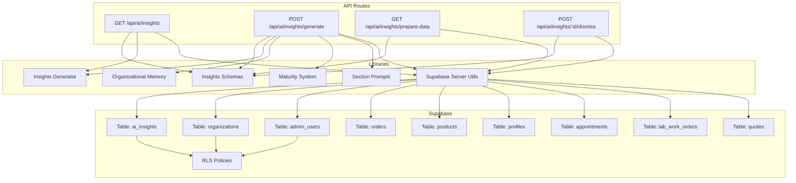
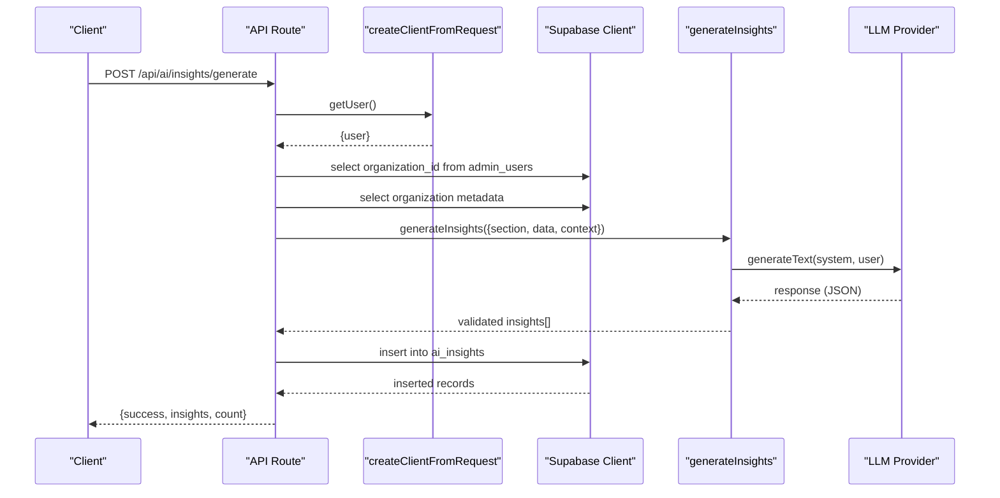
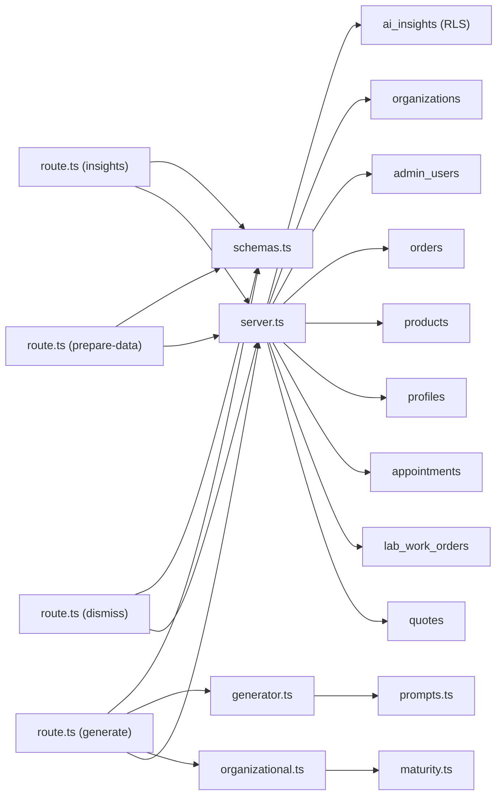

# Database Tool Calling & Data Retrieval

<cite>
**Referenced Files in This Document**
- [route.ts](file://src/app/api/ai/insights/route.ts)
- [route.ts](file://src/app/api/ai/insights/generate/route.ts)
- [route.ts](file://src/app/api/ai/insights/prepare-data/route.ts)
- [route.ts](file://src/app/api/ai/insights/[id]/dismiss/route.ts)
- [schemas.ts](file://src/lib/ai/insights/schemas.ts)
- [generator.ts](file://src/lib/ai/insights/generator.ts)
- [prompts.ts](file://src/lib/ai/insights/prompts.ts)
- [maturity.ts](file://src/lib/ai/insights/maturity.ts)
- [organizational.ts](file://src/lib/ai/memory/organizational.ts)
- [server.ts](file://src/utils/supabase/server.ts)
- [20260131000004_create_ai_insights.sql](file://supabase/migrations/20260131000004_create_ai_insights.sql)
</cite>

## Table of Contents

1. [Introduction](#introduction)
2. [Project Structure](#project-structure)
3. [Core Components](#core-components)
4. [Architecture Overview](#architecture-overview)
5. [Detailed Component Analysis](#detailed-component-analysis)
6. [Dependency Analysis](#dependency-analysis)
7. [Performance Considerations](#performance-considerations)
8. [Security & Access Control](#security--access-control)
9. [Troubleshooting Guide](#troubleshooting-guide)
10. [Conclusion](#conclusion)

## Introduction

This document explains how the AI insights system interacts with Supabase to execute structured queries, retrieve business data, and generate actionable insights. It covers the tool calling interface, parameter validation, result formatting, security controls (RLS), and performance characteristics. It also documents the prepare-data endpoint for data aggregation and the generate endpoint for insight synthesis, with examples of common retrieval patterns, aggregations, and cross-table joins.

## Project Structure

The AI insights system is implemented as a set of Next.js API routes backed by Supabase for data access and Row Level Security (RLS). Supporting libraries provide schema validation, prompt engineering, organizational maturity modeling, and LLM orchestration.

**Diagram sources**

- [route.ts](file://src/app/api/ai/insights/route.ts#L1-L93)
- [route.ts](file://src/app/api/ai/insights/generate/route.ts#L1-L279)
- [route.ts](file://src/app/api/ai/insights/prepare-data/route.ts#L1-L474)
- [route.ts](file://src/app/api/ai/insights/[id]/dismiss/route.ts#L1-L84)
- [schemas.ts](file://src/lib/ai/insights/schemas.ts#L1-L133)
- [prompts.ts](file://src/lib/ai/insights/prompts.ts#L1-L425)
- [maturity.ts](file://src/lib/ai/insights/maturity.ts#L1-L84)
- [organizational.ts](file://src/lib/ai/memory/organizational.ts#L1-L379)
- [server.ts](file://src/utils/supabase/server.ts#L1-L110)
- [20260131000004_create_ai_insights.sql](file://supabase/migrations/20260131000004_create_ai_insights.sql#L1-L131)

**Section sources**

- [route.ts](file://src/app/api/ai/insights/route.ts#L1-L93)
- [route.ts](file://src/app/api/ai/insights/generate/route.ts#L1-L279)
- [route.ts](file://src/app/api/ai/insights/prepare-data/route.ts#L1-L474)
- [route.ts](file://src/app/api/ai/insights/[id]/dismiss/route.ts#L1-L84)
- [schemas.ts](file://src/lib/ai/insights/schemas.ts#L1-L133)
- [prompts.ts](file://src/lib/ai/insights/prompts.ts#L1-L425)
- [maturity.ts](file://src/lib/ai/insights/maturity.ts#L1-L84)
- [organizational.ts](file://src/lib/ai/memory/organizational.ts#L1-L379)
- [server.ts](file://src/utils/supabase/server.ts#L1-L110)
- [20260131000004_create_ai_insights.sql](file://supabase/migrations/20260131000004_create_ai_insights.sql#L1-L131)

## Core Components

- Authentication and client creation: The API routes use a helper that supports both cookie-based and Bearer-token authentication for server-side Supabase client creation.
- Parameter validation: Zod schemas validate query and body parameters for all endpoints.
- Data preparation: The prepare-data endpoint aggregates data across multiple tables and applies branch-aware filters.
- Insight generation: The generator orchestrates LLM calls, response parsing, and schema validation.
- Persistence: Insights are stored in the ai_insights table with RLS policies ensuring tenant isolation.

**Section sources**

- [server.ts](file://src/utils/supabase/server.ts#L43-L92)
- [schemas.ts](file://src/lib/ai/insights/schemas.ts#L25-L89)
- [route.ts](file://src/app/api/ai/insights/prepare-data/route.ts#L13-L474)
- [generator.ts](file://src/lib/ai/insights/generator.ts#L41-L224)
- [20260131000004_create_ai_insights.sql](file://supabase/migrations/20260131000004_create_ai_insights.sql#L6-L50)

## Architecture Overview

The system follows a layered pattern:

- API routes handle HTTP requests, enforce rate limits, and validate inputs.
- Business logic resides in libraries for prompts, maturity modeling, and insight generation.
- Supabase provides data access with RLS policies and indexes for performance.

**Diagram sources**

- [route.ts](file://src/app/api/ai/insights/generate/route.ts#L32-L208)
- [server.ts](file://src/utils/supabase/server.ts#L43-L92)
- [generator.ts](file://src/lib/ai/insights/generator.ts#L41-L191)

## Detailed Component Analysis

### Endpoint: GET /api/ai/insights

Purpose: Retrieve active, non-dismissed insights for a given section, ordered by priority and recency.

Key behaviors:

- Validates query parameter section against a predefined enum.
- Authenticates via createClientFromRequest and resolves organization from admin_users.
- Queries ai_insights with filters for organization_id, section, and is_dismissed=false.
- Orders by priority desc, then created_at desc, with a limit of 5.

Common retrieval pattern:

- Single-table filter with ordering and limit.

Security:

- RLS ensures users only see their organization’s insights.

**Section sources**

- [route.ts](file://src/app/api/ai/insights/route.ts#L17-L91)
- [20260131000004_create_ai_insights.sql](file://supabase/migrations/20260131000004_create_ai_insights.sql#L56-L107)

### Endpoint: POST /api/ai/insights/generate

Purpose: Generate insights for a section using aggregated data and organizational context.

Key behaviors:

- Validates request body with section, data, and optional additionalContext.
- Resolves organization and enriches context with organization age, newness flag, and counts.
- Uses organizational memory to compute maturity level and enhance prompts.
- Calls LLM provider with adaptive prompts and parses validated JSON response.
- Inserts generated insights into ai_insights.

Common retrieval patterns:

- Count queries across customers, products, orders.
- Organization metadata lookup.

Security:

- RLS enforced during insert/update operations.

**Section sources**

- [route.ts](file://src/app/api/ai/insights/generate/route.ts#L32-L208)
- [organizational.ts](file://src/lib/ai/memory/organizational.ts#L176-L206)
- [maturity.ts](file://src/lib/ai/insights/maturity.ts#L15-L40)
- [prompts.ts](file://src/lib/ai/insights/prompts.ts#L45-L60)
- [generator.ts](file://src/lib/ai/insights/generator.ts#L41-L191)

### Endpoint: GET /api/ai/insights/prepare-data

Purpose: Aggregate business data for insight generation across multiple sections.

Key behaviors:

- Authentication and organization resolution.
- Branch-aware filtering using addBranchFilter.
- Aggregations per section:
  - Dashboard: revenue metrics, overdue work orders, pending quotes.
  - Inventory: zombie products and low-stock counts.
  - Clients: inactive clients with days since last visit.
  - Analytics: sales comparison and category breakdown.

Cross-table joins and aggregations:

- order_items joined with orders to derive last sale dates.
- Multiple count(\*) queries for organization-wide metrics.

Result formatting:

- Returns a structured payload keyed by section.

**Section sources**

- [route.ts](file://src/app/api/ai/insights/prepare-data/route.ts#L13-L474)

### Endpoint: POST /api/ai/insights/:id/dismiss

Purpose: Dismiss a specific insight by marking is_dismissed=true.

Key behaviors:

- Validates authentication and organization membership.
- Updates ai_insights with organization scoping.

**Section sources**

- [route.ts](file://src/app/api/ai/insights/[id]/dismiss/route.ts#L10-L83)

### Validation and Schemas

- InsightSectionSchema restricts sections to dashboard, inventory, clients, pos, analytics.
- InsightSchema validates type, title, message, priority, optional action fields, and metadata.
- CreateInsightSchema adds organization_id and section for persistence.
- UpdateInsightSchema supports feedback and dismissal updates.

**Section sources**

- [schemas.ts](file://src/lib/ai/insights/schemas.ts#L25-L89)

### Prompt Engineering and Maturity Adaptation

- getSectionPrompt builds a tailored system prompt per section with explicit JSON constraints.
- OrganizationalMaturitySystem adapts prompts based on organization age and order volume.
- getUserMessage packages the data payload for the LLM.

**Section sources**

- [prompts.ts](file://src/lib/ai/insights/prompts.ts#L45-L424)
- [maturity.ts](file://src/lib/ai/insights/maturity.ts#L15-L40)

### Data Retrieval Patterns and Examples

- Aggregation queries:
  - Count distinct entities by organization_id for KPIs.
  - Sum totals and averages filtered by status/payment_status.
- Cross-table joins:
  - order_items inner join with orders to compute last sale timestamps.
  - Join with profiles and appointments to compute customer engagement.
- Filtering and slicing:
  - Date ranges (yesterday, 30-day windows).
  - Status lists (ordered, sent_to_lab, in_progress_lab).
  - Limiting results (top 10 items).

**Section sources**

- [route.ts](file://src/app/api/ai/insights/prepare-data/route.ts#L79-L124)
- [route.ts](file://src/app/api/ai/insights/prepare-data/route.ts#L193-L250)
- [route.ts](file://src/app/api/ai/insights/prepare-data/route.ts#L282-L338)
- [route.ts](file://src/app/api/ai/insights/prepare-data/route.ts#L353-L452)

## Dependency Analysis

**Diagram sources**

- [route.ts](file://src/app/api/ai/insights/route.ts#L1-L93)
- [route.ts](file://src/app/api/ai/insights/generate/route.ts#L1-L279)
- [route.ts](file://src/app/api/ai/insights/prepare-data/route.ts#L1-L474)
- [route.ts](file://src/app/api/ai/insights/[id]/dismiss/route.ts#L1-L84)
- [schemas.ts](file://src/lib/ai/insights/schemas.ts#L1-L133)
- [generator.ts](file://src/lib/ai/insights/generator.ts#L1-L224)
- [prompts.ts](file://src/lib/ai/insights/prompts.ts#L1-L425)
- [maturity.ts](file://src/lib/ai/insights/maturity.ts#L1-L84)
- [organizational.ts](file://src/lib/ai/memory/organizational.ts#L1-L379)
- [server.ts](file://src/utils/supabase/server.ts#L1-L110)
- [20260131000004_create_ai_insights.sql](file://supabase/migrations/20260131000004_create_ai_insights.sql#L1-L131)

**Section sources**

- [route.ts](file://src/app/api/ai/insights/route.ts#L1-L93)
- [route.ts](file://src/app/api/ai/insights/generate/route.ts#L1-L279)
- [route.ts](file://src/app/api/ai/insights/prepare-data/route.ts#L1-L474)
- [route.ts](file://src/app/api/ai/insights/[id]/dismiss/route.ts#L1-L84)
- [schemas.ts](file://src/lib/ai/insights/schemas.ts#L1-L133)
- [generator.ts](file://src/lib/ai/insights/generator.ts#L1-L224)
- [prompts.ts](file://src/lib/ai/insights/prompts.ts#L1-L425)
- [maturity.ts](file://src/lib/ai/insights/maturity.ts#L1-L84)
- [organizational.ts](file://src/lib/ai/memory/organizational.ts#L1-L379)
- [server.ts](file://src/utils/supabase/server.ts#L1-L110)
- [20260131000004_create_ai_insights.sql](file://supabase/migrations/20260131000004_create_ai_insights.sql#L1-L131)

## Performance Considerations

- Indexes: ai_insights has strategic indexes on organization_id, section, priority, is_dismissed, created_at, and type to optimize filtering and sorting.
- Query planning:
  - Dashboard: date-range filters with status/paid conditions.
  - Inventory: join with orders to compute last-sale timestamps, capped to a reasonable limit.
  - Clients: map-reduce over appointments to compute last visits.
  - Analytics: two-period comparisons with category breakdown.
- Caching:
  - OrganizationalMemory caches organizational context to avoid repeated lookups.
  - Consider adding short-lived caches for frequently accessed KPIs in prepare-data.
- Batch processing:
  - Use scheduled jobs to call prepare-data and generate endpoints to avoid on-demand latency spikes.
- Rate limiting:
  - Middleware applied to all endpoints to prevent abuse.

**Section sources**

- [20260131000004_create_ai_insights.sql](file://supabase/migrations/20260131000004_create_ai_insights.sql#L44-L49)
- [organizational.ts](file://src/lib/ai/memory/organizational.ts#L58-L63)
- [route.ts](file://src/app/api/ai/insights/prepare-data/route.ts#L13-L474)

## Security & Access Control

- Authentication:
  - createClientFromRequest supports both cookie-based and Bearer-token flows.
- Organization scoping:
  - All endpoints resolve organization_id from admin_users and filter data accordingly.
- RLS policies:
  - ai_insights enforces row-level security with policies allowing users to view/manage insights for their organization and super admins to manage all.
- Input validation:
  - Zod schemas validate all inputs and outputs to maintain data integrity.

**Section sources**

- [server.ts](file://src/utils/supabase/server.ts#L43-L92)
- [route.ts](file://src/app/api/ai/insights/generate/route.ts#L50-L64)
- [route.ts](file://src/app/api/ai/insights/prepare-data/route.ts#L27-L41)
- [20260131000004_create_ai_insights.sql](file://supabase/migrations/20260131000004_create_ai_insights.sql#L51-L107)

## Troubleshooting Guide

- Unauthorized errors:
  - Verify authentication headers and that the user belongs to an active admin_users record.
- Organization not found:
  - Ensure the authenticated user has an active admin_users record with organization_id.
- LLM provider errors:
  - The generate endpoint throws a user-friendly error when no providers are configured.
- Schema validation failures:
  - The generator logs detailed Zod errors and rejects malformed responses.
- Logging:
  - All endpoints log structured errors with stack traces for diagnostics.

**Section sources**

- [route.ts](file://src/app/api/ai/insights/route.ts#L28-L33)
- [route.ts](file://src/app/api/ai/insights/generate/route.ts#L58-L64)
- [route.ts](file://src/app/api/ai/insights/generate/route.ts#L192-L200)
- [generator.ts](file://src/lib/ai/insights/generator.ts#L168-L176)

## Conclusion

The AI insights system integrates Supabase-backed data retrieval with LLM-driven insight generation. Robust validation, RLS, and organizational maturity adaptation ensure secure, contextual, and actionable outputs. The prepare-data endpoint aggregates diverse signals efficiently, while the generate endpoint synthesizes them into prioritized insights. Performance is supported by indexes, caching, and scheduled processing.
