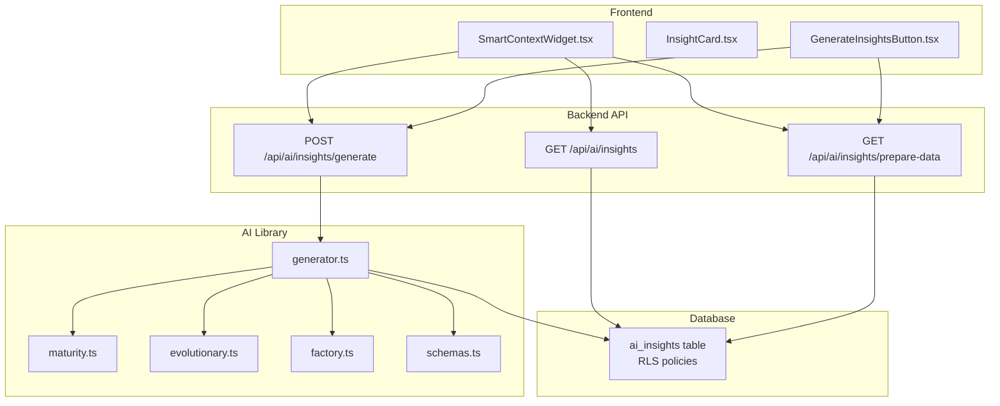
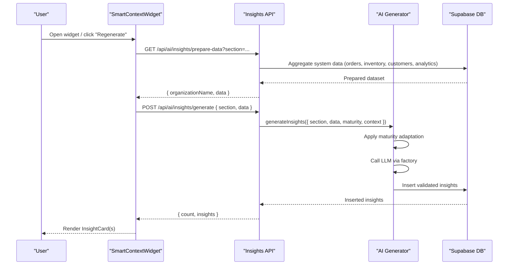
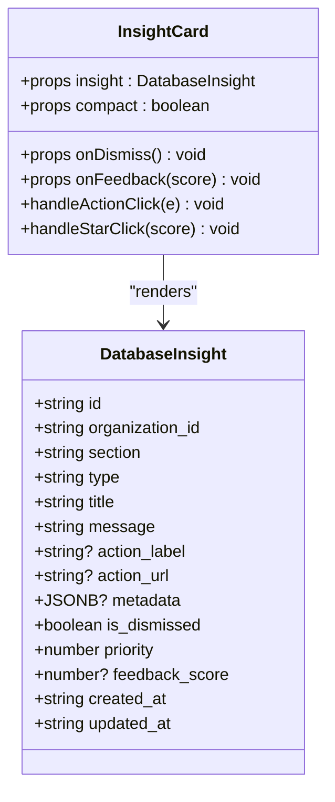
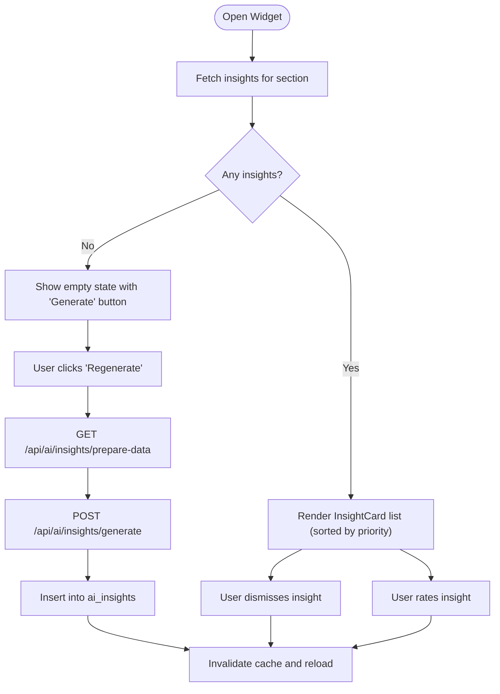
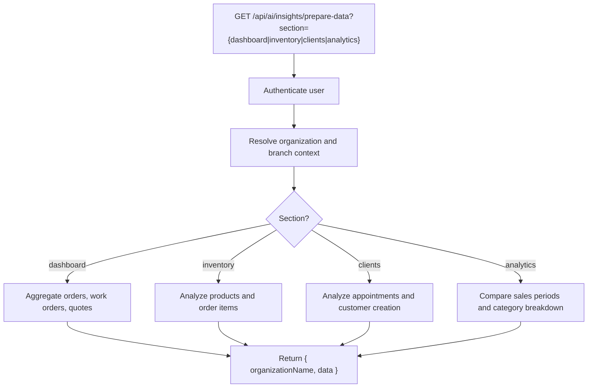
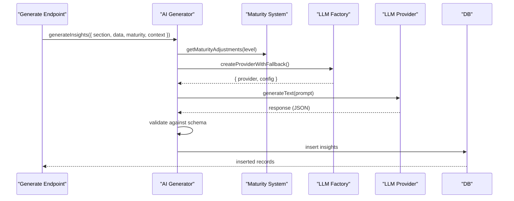
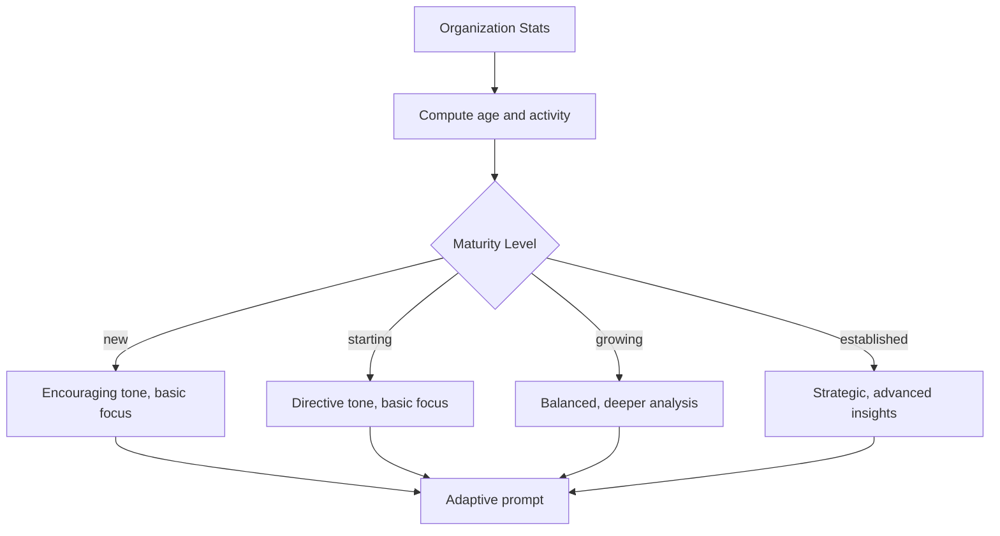
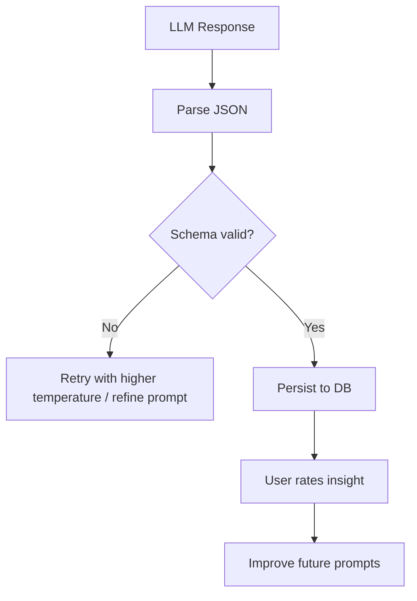
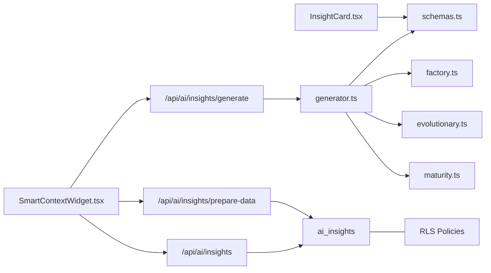

# Insight Generation & Automated Workflows

<cite>
**Referenced Files in This Document**
- [InsightCard.tsx](file://src/components/ai/InsightCard.tsx)
- [GenerateInsightsButton.tsx](file://src/components/ai/GenerateInsightsButton.tsx)
- [SmartContextWidget.tsx](file://src/components/ai/SmartContextWidget.tsx)
- [route.ts](file://src/app/api/ai/insights/route.ts)
- [route.ts](file://src/app/api/ai/insights/prepare-data/route.ts)
- [route.ts](file://src/app/api/ai/insights/generate/route.ts)
- [generator.ts](file://src/lib/ai/insights/generator.ts)
- [evolutionary.ts](file://src/lib/ai/insights/evolutionary.ts)
- [maturity.ts](file://src/lib/ai/insights/maturity.ts)
- [schemas.ts](file://src/lib/ai/insights/schemas.ts)
- [factory.ts](file://src/lib/ai/factory.ts)
- [create_ai_insights.sql](file://supabase/migrations/20260131000004_create_ai_insights.sql)
- [GENERATE_AI_INSIGHTS.md](file://docs/GENERATE_AI_INSIGHTS.md)
- [insights-generation.test.ts](file://src/__tests__/integration/ai/insights-generation.test.ts)
</cite>

## Table of Contents

1. [Introduction](#introduction)
2. [Project Structure](#project-structure)
3. [Core Components](#core-components)
4. [Architecture Overview](#architecture-overview)
5. [Detailed Component Analysis](#detailed-component-analysis)
6. [Dependency Analysis](#dependency-analysis)
7. [Performance Considerations](#performance-considerations)
8. [Troubleshooting Guide](#troubleshooting-guide)
9. [Conclusion](#conclusion)
10. [Appendices](#appendices)

## Introduction

This document explains the end-to-end AI insight generation and automated business intelligence workflows in the Opttius optical management platform. It covers how raw business data is prepared, analyzed, and transformed into actionable insights, how the InsightCard component presents recommendations, and how the SmartContextWidget orchestrates the entire workflow. It also documents integration with organizational maturity modeling, KPI tracking, decision support, validation mechanisms, confidence scoring, human-in-the-loop approval, performance monitoring, and continuous improvement strategies.

## Project Structure

The insight system is composed of:

- Frontend components for insight presentation and user interaction
- Backend API endpoints for data preparation, insight generation, and persistence
- AI libraries for LLM orchestration, schema validation, and organizational maturity adaptation
- Database schema for storing insights with metadata and feedback

**Diagram sources**

- [SmartContextWidget.tsx](file://src/components/ai/SmartContextWidget.tsx#L1-L340)
- [InsightCard.tsx](file://src/components/ai/InsightCard.tsx#L1-L342)
- [GenerateInsightsButton.tsx](file://src/components/ai/GenerateInsightsButton.tsx#L1-L93)
- [route.ts](file://src/app/api/ai/insights/route.ts#L1-L93)
- [route.ts](file://src/app/api/ai/insights/prepare-data/route.ts#L1-L474)
- [route.ts](file://src/app/api/ai/insights/generate/route.ts#L1-L279)
- [generator.ts](file://src/lib/ai/insights/generator.ts#L1-L202)
- [maturity.ts](file://src/lib/ai/insights/maturity.ts#L1-L40)
- [evolutionary.ts](file://src/lib/ai/insights/evolutionary.ts#L1-L51)
- [factory.ts](file://src/lib/ai/factory.ts#L1-L87)
- [schemas.ts](file://src/lib/ai/insights/schemas.ts#L97-L132)
- [create_ai_insights.sql](file://supabase/migrations/20260131000004_create_ai_insights.sql#L1-L131)

**Section sources**

- [route.ts](file://src/app/api/ai/insights/route.ts#L1-L93)
- [route.ts](file://src/app/api/ai/insights/prepare-data/route.ts#L1-L474)
- [route.ts](file://src/app/api/ai/insights/generate/route.ts#L1-L279)
- [generator.ts](file://src/lib/ai/insights/generator.ts#L1-L202)
- [maturity.ts](file://src/lib/ai/insights/maturity.ts#L1-L40)
- [evolutionary.ts](file://src/lib/ai/insights/evolutionary.ts#L1-L51)
- [factory.ts](file://src/lib/ai/factory.ts#L1-L87)
- [schemas.ts](file://src/lib/ai/insights/schemas.ts#L97-L132)
- [create_ai_insights.sql](file://supabase/migrations/20260131000004_create_ai_insights.sql#L1-L131)

## Core Components

- InsightCard: Renders individual insights with type-specific styling, priority indicators, optional action buttons, and star-based feedback collection.
- SmartContextWidget: Floating popover that fetches, displays, and manages insights per section, supports regeneration, dismissal, and feedback submission.
- GenerateInsightsButton: One-click trigger to prepare data and generate insights for a given section.
- API Endpoints: Provide data preparation, insight retrieval, and generation with rate limiting and authentication.
- AI Generator: Orchestrates LLM calls, applies organizational maturity adaptation, validates outputs, and persists insights.
- Database: Stores insights with rich metadata, feedback, and row-level security policies.

**Section sources**

- [InsightCard.tsx](file://src/components/ai/InsightCard.tsx#L1-L342)
- [SmartContextWidget.tsx](file://src/components/ai/SmartContextWidget.tsx#L1-L340)
- [GenerateInsightsButton.tsx](file://src/components/ai/GenerateInsightsButton.tsx#L1-L93)
- [route.ts](file://src/app/api/ai/insights/route.ts#L1-L93)
- [route.ts](file://src/app/api/ai/insights/prepare-data/route.ts#L1-L474)
- [route.ts](file://src/app/api/ai/insights/generate/route.ts#L1-L279)
- [generator.ts](file://src/lib/ai/insights/generator.ts#L1-L202)
- [create_ai_insights.sql](file://supabase/migrations/20260131000004_create_ai_insights.sql#L1-L131)

## Architecture Overview

The system follows a layered architecture:

- Presentation Layer: InsightCard and SmartContextWidget
- Orchestration Layer: API endpoints for data preparation and insight generation
- Intelligence Layer: AI generator with maturity-aware prompting and schema validation
- Persistence Layer: Supabase table with RLS policies and indexes

**Diagram sources**

- [SmartContextWidget.tsx](file://src/components/ai/SmartContextWidget.tsx#L103-L151)
- [route.ts](file://src/app/api/ai/insights/prepare-data/route.ts#L13-L474)
- [route.ts](file://src/app/api/ai/insights/generate/route.ts#L32-L208)
- [generator.ts](file://src/lib/ai/insights/generator.ts#L41-L191)
- [create_ai_insights.sql](file://supabase/migrations/20260131000004_create_ai_insights.sql#L5-L50)

## Detailed Component Analysis

### InsightCard Component

InsightCard renders a single AI insight with:

- Type-based theming (warning, opportunity, info, neutral)
- Priority dots indicating urgency
- Optional action button with metadata injection
- Star-based feedback collection with hover states
- Compact vs full-size variants

**Diagram sources**

- [InsightCard.tsx](file://src/components/ai/InsightCard.tsx#L17-L64)
- [schemas.ts](file://src/lib/ai/insights/schemas.ts#L121-L132)

**Section sources**

- [InsightCard.tsx](file://src/components/ai/InsightCard.tsx#L1-L342)
- [schemas.ts](file://src/lib/ai/insights/schemas.ts#L121-L132)

### SmartContextWidget Workflow

SmartContextWidget:

- Fetches insights via GET /api/ai/insights
- Provides a floating popover with a "Regenerate" button
- Supports dismissing insights and submitting feedback
- Uses React Query for caching and optimistic updates

**Diagram sources**

- [SmartContextWidget.tsx](file://src/components/ai/SmartContextWidget.tsx#L44-L151)
- [route.ts](file://src/app/api/ai/insights/route.ts#L17-L91)
- [route.ts](file://src/app/api/ai/insights/prepare-data/route.ts#L13-L474)
- [route.ts](file://src/app/api/ai/insights/generate/route.ts#L32-L208)

**Section sources**

- [SmartContextWidget.tsx](file://src/components/ai/SmartContextWidget.tsx#L1-L340)
- [route.ts](file://src/app/api/ai/insights/route.ts#L1-L93)
- [route.ts](file://src/app/api/ai/insights/prepare-data/route.ts#L1-L474)
- [route.ts](file://src/app/api/ai/insights/generate/route.ts#L1-L279)

### Data Preparation Pipeline

The prepare-data endpoint aggregates real system data for each section:

- Dashboard: Yesterday's sales, monthly averages, overdue work orders, pending quotes
- Inventory: Zombie products (no sales in long periods), low-stock items
- Clients: Inactive clients (no visits in extended periods)
- Analytics: Sales comparison between two periods and category breakdown

**Diagram sources**

- [route.ts](file://src/app/api/ai/insights/prepare-data/route.ts#L13-L474)

**Section sources**

- [route.ts](file://src/app/api/ai/insights/prepare-data/route.ts#L64-L453)

### Insight Generation Engine

The generator:

- Validates inputs and builds a maturity-aware prompt
- Calls an LLM provider via the factory with fallback support
- Parses and validates structured output against a strict schema
- Persists insights to the database with rich metadata

**Diagram sources**

- [route.ts](file://src/app/api/ai/insights/generate/route.ts#L81-L152)
- [generator.ts](file://src/lib/ai/insights/generator.ts#L41-L191)
- [maturity.ts](file://src/lib/ai/insights/maturity.ts#L15-L40)
- [factory.ts](file://src/lib/ai/factory.ts#L45-L87)
- [schemas.ts](file://src/lib/ai/insights/schemas.ts#L97-L132)

**Section sources**

- [route.ts](file://src/app/api/ai/insights/generate/route.ts#L32-L208)
- [generator.ts](file://src/lib/ai/insights/generator.ts#L1-L202)
- [maturity.ts](file://src/lib/ai/insights/maturity.ts#L1-L40)
- [factory.ts](file://src/lib/ai/factory.ts#L1-L87)
- [schemas.ts](file://src/lib/ai/insights/schemas.ts#L97-L132)

### Organizational Maturity and Evolutionary Insights

The system adapts prompts and recommendations based on organizational maturity:

- New: Encouraging, basic focus areas, avoid advanced topics
- Starting: Directive, focus on basics, avoid complex forecasting
- Growing: Balanced, deeper analysis
- Established: Strategic, advanced insights

**Diagram sources**

- [evolutionary.ts](file://src/lib/ai/insights/evolutionary.ts#L29-L51)
- [maturity.ts](file://src/lib/ai/insights/maturity.ts#L15-L40)

**Section sources**

- [evolutionary.ts](file://src/lib/ai/insights/evolutionary.ts#L1-L51)
- [maturity.ts](file://src/lib/ai/insights/maturity.ts#L1-L40)

### Example Use Cases

- Sales trend analysis: Compare current vs previous period sales, compute change percentage, and categorize by product type.
- Inventory optimization: Identify zombie products and low-stock items to reduce carrying costs and prevent stockouts.
- Customer behavior predictions: Flag inactive clients and suggest re-engagement actions based on last visit timing.
- Operational efficiency: Highlight overdue work orders and pending quotes to improve throughput.

These use cases are derived from the prepared datasets and the maturity-adapted prompts used during generation.

**Section sources**

- [route.ts](file://src/app/api/ai/insights/prepare-data/route.ts#L345-L453)
- [route.ts](file://src/app/api/ai/insights/prepare-data/route.ts#L176-L263)
- [route.ts](file://src/app/api/ai/insights/prepare-data/route.ts#L265-L343)
- [route.ts](file://src/app/api/ai/insights/prepare-data/route.ts#L67-L174)

### Human-in-the-Loop and Validation

- Validation: Structured schema validation ensures insights conform to expected shape and types.
- Confidence scoring: Priority levels (1–10) and optional feedback scores (1–5) capture perceived usefulness.
- Human approval: Dismissal allows users to mark insights as irrelevant; feedback enables continuous learning.

**Diagram sources**

- [generator.ts](file://src/lib/ai/insights/generator.ts#L158-L191)
- [schemas.ts](file://src/lib/ai/insights/schemas.ts#L97-L132)

**Section sources**

- [generator.ts](file://src/lib/ai/insights/generator.ts#L158-L191)
- [schemas.ts](file://src/lib/ai/insights/schemas.ts#L97-L132)

## Dependency Analysis

The AI insight system exhibits strong separation of concerns:

- Components depend on schemas and API endpoints
- API endpoints depend on the AI generator and database
- The generator depends on the factory, maturity system, and schemas
- Database schema defines constraints and RLS policies

**Diagram sources**

- [InsightCard.tsx](file://src/components/ai/InsightCard.tsx#L1-L342)
- [SmartContextWidget.tsx](file://src/components/ai/SmartContextWidget.tsx#L1-L340)
- [route.ts](file://src/app/api/ai/insights/route.ts#L1-L93)
- [route.ts](file://src/app/api/ai/insights/prepare-data/route.ts#L1-L474)
- [route.ts](file://src/app/api/ai/insights/generate/route.ts#L1-L279)
- [generator.ts](file://src/lib/ai/insights/generator.ts#L1-L202)
- [maturity.ts](file://src/lib/ai/insights/maturity.ts#L1-L40)
- [evolutionary.ts](file://src/lib/ai/insights/evolutionary.ts#L1-L51)
- [factory.ts](file://src/lib/ai/factory.ts#L1-L87)
- [schemas.ts](file://src/lib/ai/insights/schemas.ts#L97-L132)
- [create_ai_insights.sql](file://supabase/migrations/20260131000004_create_ai_insights.sql#L51-L107)

**Section sources**

- [route.ts](file://src/app/api/ai/insights/route.ts#L1-L93)
- [route.ts](file://src/app/api/ai/insights/prepare-data/route.ts#L1-L474)
- [route.ts](file://src/app/api/ai/insights/generate/route.ts#L1-L279)
- [generator.ts](file://src/lib/ai/insights/generator.ts#L1-L202)
- [factory.ts](file://src/lib/ai/factory.ts#L1-L87)
- [schemas.ts](file://src/lib/ai/insights/schemas.ts#L97-L132)
- [create_ai_insights.sql](file://supabase/migrations/20260131000004_create_ai_insights.sql#L51-L107)

## Performance Considerations

- Caching: React Query caches insights for 5 minutes to reduce API load.
- Rate limiting: All insight endpoints apply rate limits to protect backend resources.
- Branch filtering: Queries are scoped to the user's branch and organization to minimize dataset size.
- Indexes: Database indexes on organization_id, section, priority, and created_at optimize reads.
- Retry/backoff: The generator retries failed LLM calls with exponential backoff and validates schemas to avoid wasted processing.

[No sources needed since this section provides general guidance]

## Troubleshooting Guide

Common issues and resolutions:

- Authentication failures: Ensure the user is logged in and associated with an active admin user record.
- Organization not found: Verify the user belongs to an organization with active admin status.
- LLM provider not configured: The system returns a user-friendly error suggesting provider configuration.
- Schema validation errors: Inspect the LLM response format; the generator logs preview content for debugging.
- No insights returned: Use the embedded variant or the "Regenerate" button to trigger data preparation and generation.

**Section sources**

- [route.ts](file://src/app/api/ai/insights/route.ts#L27-L49)
- [route.ts](file://src/app/api/ai/insights/prepare-data/route.ts#L19-L41)
- [route.ts](file://src/app/api/ai/insights/generate/route.ts#L42-L64)
- [route.ts](file://src/app/api/ai/insights/generate/route.ts#L192-L200)
- [generator.ts](file://src/lib/ai/insights/generator.ts#L158-L191)

## Conclusion

The Opttius AI insight system delivers contextual, maturity-adapted recommendations through a robust pipeline from raw data to actionable cards. Its modular design integrates seamlessly with the frontend widgets, backend APIs, and database, while supporting validation, feedback, and continuous improvement. By leveraging organizational maturity modeling and structured validation, the system scales insights alongside business growth and maintains reliability under production loads.

[No sources needed since this section summarizes without analyzing specific files]

## Appendices

### API Definitions

- GET /api/ai/insights?section={dashboard|inventory|clients|pos|analytics}
  - Returns up to 5 non-dismissed insights ordered by priority and recency
- GET /api/ai/insights/prepare-data?section={dashboard|inventory|clients|analytics}
  - Returns prepared datasets for the requested section(s)
- POST /api/ai/insights/generate
  - Accepts { section, data, additionalContext? }
  - Returns { success, insights, count }
- POST /api/ai/insights/{id}/dismiss
  - Marks an insight as dismissed
- POST /api/ai/insights/{id}/feedback
  - Submits feedback score (1–5)

**Section sources**

- [route.ts](file://src/app/api/ai/insights/route.ts#L17-L91)
- [route.ts](file://src/app/api/ai/insights/prepare-data/route.ts#L13-L474)
- [route.ts](file://src/app/api/ai/insights/generate/route.ts#L32-L208)

### Database Schema Highlights

- ai_insights table with foreign key to organizations, section/type constraints, priority range, metadata JSONB, feedback score
- Row-level security policies allowing users to view/manage insights for their organization
- Indexes on organization_id, section, priority, is_dismissed, created_at, type

**Section sources**

- [create_ai_insights.sql](file://supabase/migrations/20260131000004_create_ai_insights.sql#L5-L50)
- [create_ai_insights.sql](file://supabase/migrations/20260131000004_create_ai_insights.sql#L51-L107)
- [create_ai_insights.sql](file://supabase/migrations/20260131000004_create_ai_insights.sql#L109-L131)

### Usage Examples

- Browser console method to generate insights for dashboard, inventory, clients, and analytics
- Embedded widget for dashboards and other sections

**Section sources**

- [GENERATE_AI_INSIGHTS.md](file://docs/GENERATE_AI_INSIGHTS.md#L23-L56)
- [SmartContextWidget.tsx](file://src/components/ai/SmartContextWidget.tsx#L277-L283)
