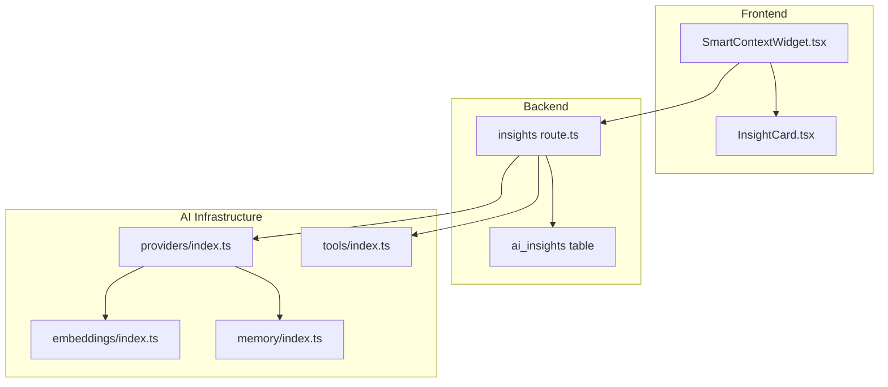
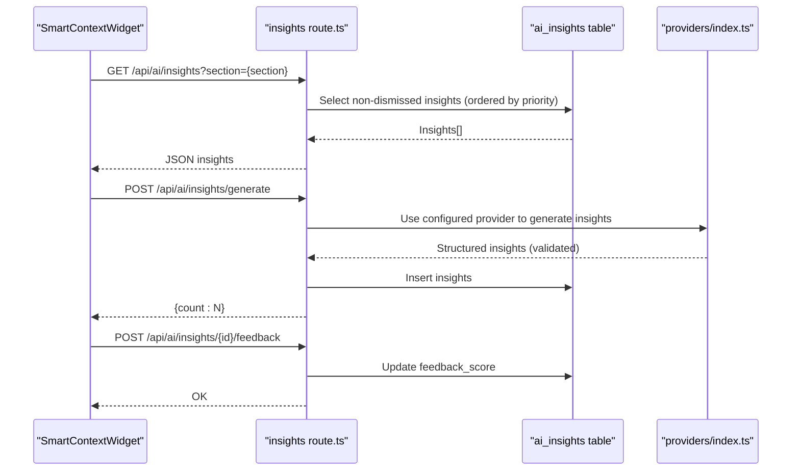
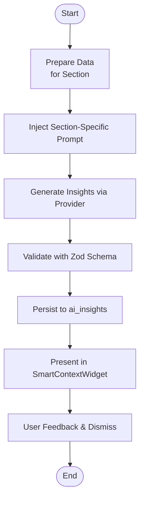
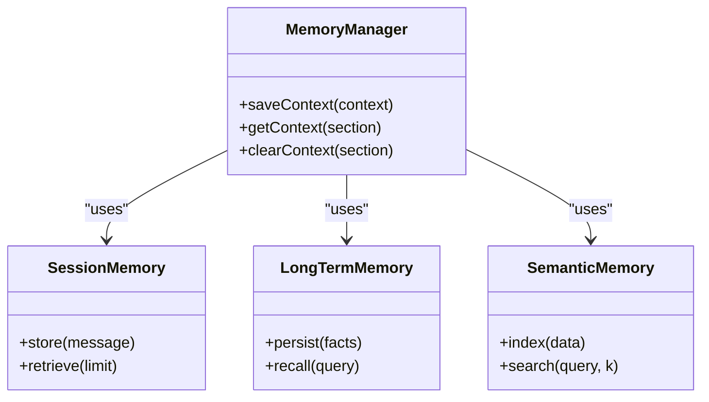
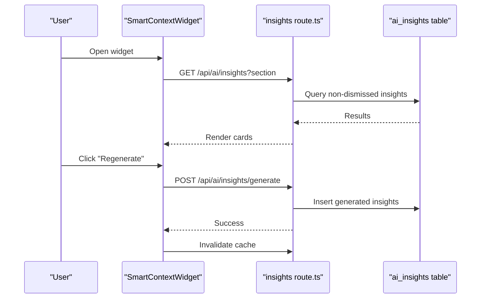
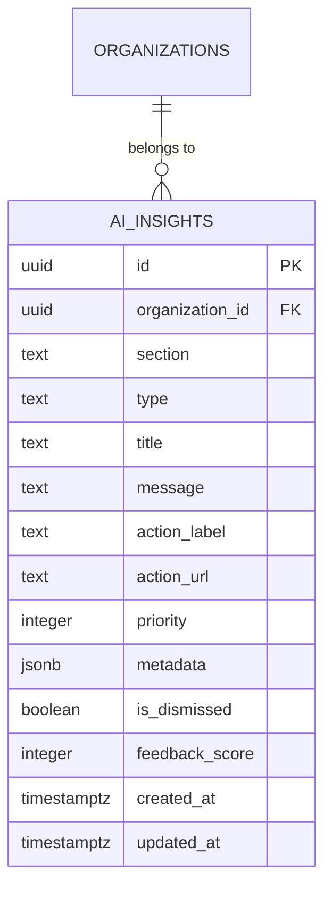
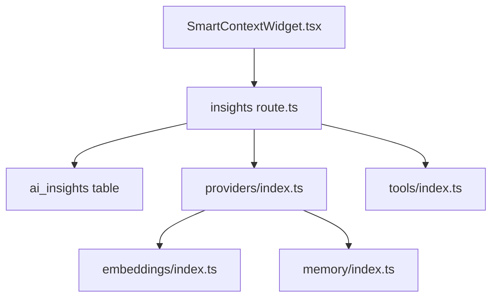

# Natural Language Processing & Understanding

<cite>
**Referenced Files in This Document**
- [AI_INSIGHTS_GUIDE.md](file://docs/AI_INSIGHTS_GUIDE.md)
- [AI_IMPLEMENTATION_GUIDE.md](file://docs/AI_IMPLEMENTATION_GUIDE.md)
- [SmartContextWidget.tsx](file://src/components/ai/SmartContextWidget.tsx)
- [InsightCard.tsx](file://src/components/ai/InsightCard.tsx)
- [insights route.ts](file://src/app/api/ai/insights/route.ts)
- [embeddings index.ts](file://src/lib/ai/embeddings/index.ts)
- [memory index.ts](file://src/lib/ai/memory/index.ts)
- [tools index.ts](file://src/lib/ai/tools/index.ts)
- [providers index.ts](file://src/lib/ai/providers/index.ts)
- [ai_insights.sql](file://supabase/migrations/20260131000004_create_ai_insights.sql)
</cite>

## Table of Contents

1. [Introduction](#introduction)
2. [Project Structure](#project-structure)
3. [Core Components](#core-components)
4. [Architecture Overview](#architecture-overview)
5. [Detailed Component Analysis](#detailed-component-analysis)
6. [Dependency Analysis](#dependency-analysis)
7. [Performance Considerations](#performance-considerations)
8. [Troubleshooting Guide](#troubleshooting-guide)
9. [Conclusion](#conclusion)
10. [Appendices](#appendices)

## Introduction

This document explains the natural language processing (NLP) and understanding capabilities within the AI insights system. It covers the NLP pipeline architecture, including text preprocessing, intent recognition, entity extraction, and sentiment analysis. It also documents prompt engineering techniques, context preservation mechanisms, and conversational flow management. Examples demonstrate business query interpretation, data retrieval requests, and automated workflow triggers. The system integrates with Supabase for structured data queries and uses database tools to generate insights. Multilingual support, domain-specific terminology handling, and contextual understanding improvements are addressed, along with debugging tools and optimization strategies.

## Project Structure

The AI insights system is composed of:

- Frontend widgets that present actionable insights and enable user feedback
- Backend API routes that orchestrate data preparation, insight generation, and persistence
- Supabase database with a dedicated table for storing insights and enforcing row-level security
- AI provider abstractions and tooling for structured reasoning and data retrieval

**Diagram sources**

- [SmartContextWidget.tsx](file://src/components/ai/SmartContextWidget.tsx#L1-L340)
- [InsightCard.tsx](file://src/components/ai/InsightCard.tsx#L1-L342)
- [insights route.ts](file://src/app/api/ai/insights/route.ts#L1-L93)
- [providers index.ts](file://src/lib/ai/providers/index.ts#L1-L34)
- [tools index.ts](file://src/lib/ai/tools/index.ts#L1-L75)
- [embeddings index.ts](file://src/lib/ai/embeddings/index.ts#L1-L16)
- [memory index.ts](file://src/lib/ai/memory/index.ts#L1-L19)
- [ai_insights.sql](file://supabase/migrations/20260131000004_create_ai_insights.sql)

**Section sources**

- [AI_INSIGHTS_GUIDE.md](file://docs/AI_INSIGHTS_GUIDE.md#L92-L191)
- [AI_IMPLEMENTATION_GUIDE.md](file://docs/AI_IMPLEMENTATION_GUIDE.md#L83-L173)

## Core Components

- SmartContextWidget: Presents contextual insights, supports regenerating insights, dismissing, and providing feedback. It fetches data via the backend API and renders InsightCards.
- InsightCard: Renders a single insight with type-specific styling, priority indicators, optional action buttons, and feedback stars.
- Backend API route: Validates inputs, authenticates users, resolves organization context, and retrieves non-dismissed insights ordered by priority.
- AI infrastructure: Provider abstraction, tool definitions, embeddings, and memory modules enable structured reasoning and data retrieval.

**Section sources**

- [SmartContextWidget.tsx](file://src/components/ai/SmartContextWidget.tsx#L35-L340)
- [InsightCard.tsx](file://src/components/ai/InsightCard.tsx#L59-L342)
- [insights route.ts](file://src/app/api/ai/insights/route.ts#L17-L93)
- [providers index.ts](file://src/lib/ai/providers/index.ts#L10-L33)
- [tools index.ts](file://src/lib/ai/tools/index.ts#L15-L75)
- [embeddings index.ts](file://src/lib/ai/embeddings/index.ts#L7-L16)
- [memory index.ts](file://src/lib/ai/memory/index.ts#L10-L19)

## Architecture Overview

The NLP-driven insights pipeline follows a structured flow:

- Data preparation: The frontend calls a preparation endpoint to gather real-time data from the system.
- Prompt engineering: Section-specific prompts guide the LLM to interpret data and produce structured insights.
- Generation and validation: The LLM produces insights validated against a schema and persisted to the database.
- Presentation and feedback: The widget displays insights, allows dismissal and feedback, and refreshes automatically.

**Diagram sources**

- [SmartContextWidget.tsx](file://src/components/ai/SmartContextWidget.tsx#L104-L151)
- [insights route.ts](file://src/app/api/ai/insights/route.ts#L17-L93)
- [providers index.ts](file://src/lib/ai/providers/index.ts#L23-L29)
- [ai_insights.sql](file://supabase/migrations/20260131000004_create_ai_insights.sql)

## Detailed Component Analysis

### NLP Pipeline Architecture

- Text preprocessing: Data is prepared and serialized for the LLM, ensuring only relevant metrics and context are included.
- Intent recognition: Section-specific prompts encode intent (e.g., sales analysis, inventory audit, customer engagement).
- Entity extraction: Structured schemas define insight fields (type, title, message, action, priority, metadata).
- Sentiment analysis: Insight types categorize sentiment (warning/opportunity/info/neutral), enabling prioritization and tone alignment.
- Validation: Zod schemas enforce correctness and prevent malformed insights.

**Diagram sources**

- [AI_INSIGHTS_GUIDE.md](file://docs/AI_INSIGHTS_GUIDE.md#L168-L183)
- [AI_IMPLEMENTATION_GUIDE.md](file://docs/AI_IMPLEMENTATION_GUIDE.md#L407-L435)
- [SmartContextWidget.tsx](file://src/components/ai/SmartContextWidget.tsx#L104-L151)

**Section sources**

- [AI_INSIGHTS_GUIDE.md](file://docs/AI_INSIGHTS_GUIDE.md#L168-L183)
- [AI_IMPLEMENTATION_GUIDE.md](file://docs/AI_IMPLEMENTATION_GUIDE.md#L407-L435)

### Prompt Engineering Techniques

- Section-aware prompts: Each section defines a specific role and trigger, guiding the model to focus on relevant KPIs and actions.
- Explicit route lists: Prompts include valid routes per section to avoid hallucinations.
- Clear instructions: Define acceptable outputs, limits, and desired actions.
- Iterative refinement: Adjust prompts based on feedback and observed relevance.

Examples of prompt engineering in practice:

- Dashboard: Executive summary of sales vs targets and overdue work orders.
- POS: Upsell recommendations based on prescriptions and purchase history.
- Inventory: Stock zombie detection and discount strategies.
- CRM: Inactive customer outreach with empathetic messaging.
- Analytics: Sales trend interpretation with actionable questions.

**Section sources**

- [AI_IMPLEMENTATION_GUIDE.md](file://docs/AI_IMPLEMENTATION_GUIDE.md#L179-L276)
- [AI_INSIGHTS_GUIDE.md](file://docs/AI_INSIGHTS_GUIDE.md#L155-L191)

### Context Preservation Mechanisms

- Section context injection: The chatbot floating component detects the current section and injects context into the system prompt.
- Memory modules: Session memory, long-term memory, and semantic memory enable persistent and vector-based recall across conversations.
- Tool-based reasoning: Tools encapsulate domain-specific actions (products, categories, orders, customers, analytics, support), preserving context during tool calls.

**Diagram sources**

- [memory index.ts](file://src/lib/ai/memory/index.ts#L14-L19)

**Section sources**

- [AI_IMPLEMENTATION_GUIDE.md](file://docs/AI_IMPLEMENTATION_GUIDE.md#L289-L342)
- [memory index.ts](file://src/lib/ai/memory/index.ts#L1-L19)

### Conversational Flow Management

- Quick suggestions: Per-section suggestion sets improve usability and reduce friction.
- Embedded and popover variants: Widgets adapt to different layouts (popover for sidebar, embedded for sheets).
- Feedback loop: Users can dismiss or rate insights, influencing future generations.
- Rate limiting and caching: API routes implement rate limiting and cache invalidation to maintain responsiveness.

**Diagram sources**

- [SmartContextWidget.tsx](file://src/components/ai/SmartContextWidget.tsx#L44-L151)
- [insights route.ts](file://src/app/api/ai/insights/route.ts#L17-L93)

**Section sources**

- [SmartContextWidget.tsx](file://src/components/ai/SmartContextWidget.tsx#L35-L340)
- [AI_IMPLEMENTATION_GUIDE.md](file://docs/AI_IMPLEMENTATION_GUIDE.md#L311-L334)

### Business Query Interpretation, Data Retrieval, and Workflow Triggers

- Business query interpretation: Prompts translate natural language into structured insights aligned with business goals.
- Data retrieval requests: Tools encapsulate domain-specific queries (products, categories, orders, customers, analytics, support).
- Automated workflow triggers: Insights include action URLs and metadata to pre-fill forms or navigate to relevant pages.

**Diagram sources**

- [tools index.ts](file://src/lib/ai/tools/index.ts#L15-L50)
- [AI_IMPLEMENTATION_GUIDE.md](file://docs/AI_IMPLEMENTATION_GUIDE.md#L407-L435)
- [AI_INSIGHTS_GUIDE.md](file://docs/AI_INSIGHTS_GUIDE.md#L172-L183)

**Section sources**

- [tools index.ts](file://src/lib/ai/tools/index.ts#L1-L75)
- [AI_INSIGHTS_GUIDE.md](file://docs/AI_INSIGHTS_GUIDE.md#L172-L183)

### Integration with Supabase and Database Tools

- ai_insights table: Stores insights with organization scoping, priority, type, and metadata. Row-level security ensures tenant isolation.
- API route: Authenticates users, resolves organization, and fetches insights filtered by section and dismissal status.
- Migration: Dedicated migration creates the table, indexes, and policies.

**Diagram sources**

- [ai_insights.sql](file://supabase/migrations/20260131000004_create_ai_insights.sql)
- [insights route.ts](file://src/app/api/ai/insights/route.ts#L52-L60)

**Section sources**

- [AI_INSIGHTS_GUIDE.md](file://docs/AI_INSIGHTS_GUIDE.md#L316-L366)
- [insights route.ts](file://src/app/api/ai/insights/route.ts#L17-L93)

### Multilingual Support, Domain Terminology, and Contextual Understanding

- Multilingual support: LLM providers can be selected via the provider factory; ensure prompts and tools accommodate target languages.
- Domain-specific terminology: Tools and prompts embed optical industry terms (prescriptions, frames, crystals, contact lenses) to improve accuracy.
- Contextual understanding: Memory modules and section-aware prompts enhance continuity and relevance across interactions.

**Section sources**

- [providers index.ts](file://src/lib/ai/providers/index.ts#L10-L33)
- [AI_IMPLEMENTATION_GUIDE.md](file://docs/AI_IMPLEMENTATION_GUIDE.md#L289-L342)
- [tools index.ts](file://src/lib/ai/tools/index.ts#L15-L27)

### Debugging Tools and Optimization Strategies

- Logging: API routes log errors and successful operations with context (section, count).
- Rate limiting: Middleware protects endpoints from abuse.
- Caching: Frontend caches insights for a short period to reduce load.
- Validation: Strict Zod schemas prevent malformed data from persisting.
- Monitoring: Use feedback scores to measure relevance and adjust prompts and tools iteratively.

**Section sources**

- [insights route.ts](file://src/app/api/ai/insights/route.ts#L62-L85)
- [SmartContextWidget.tsx](file://src/components/ai/SmartContextWidget.tsx#L49-L65)

## Dependency Analysis

The AI insights system exhibits low coupling between UI and backend, with clear separation of concerns:

- UI depends on API routes and schemas.
- API routes depend on Supabase client, authentication, and provider/tool abstractions.
- Providers and tools encapsulate external integrations and domain logic.

**Diagram sources**

- [SmartContextWidget.tsx](file://src/components/ai/SmartContextWidget.tsx#L1-L340)
- [insights route.ts](file://src/app/api/ai/insights/route.ts#L1-L93)
- [providers index.ts](file://src/lib/ai/providers/index.ts#L1-L34)
- [tools index.ts](file://src/lib/ai/tools/index.ts#L1-L75)
- [embeddings index.ts](file://src/lib/ai/embeddings/index.ts#L1-L16)
- [memory index.ts](file://src/lib/ai/memory/index.ts#L1-L19)

**Section sources**

- [SmartContextWidget.tsx](file://src/components/ai/SmartContextWidget.tsx#L35-L340)
- [insights route.ts](file://src/app/api/ai/insights/route.ts#L17-L93)

## Performance Considerations

- Use cron jobs and scheduled generation to avoid generating insights on every render.
- Apply aggressive caching on the frontend and limit returned insight counts.
- Choose cost-effective models for routine tasks while reserving stronger models for complex reasoning.
- Monitor feedback scores to optimize prompts and reduce unnecessary generations.

[No sources needed since this section provides general guidance]

## Troubleshooting Guide

Common issues and resolutions:

- Insights not appearing: Verify organization context and that insights are not dismissed.
- Non-functional action URLs: Ensure URLs are valid and included in the explicit route lists.
- Widget size or layout problems: Use the embedded variant for constrained spaces.
- Poor insight relevance: Adjust prompts and incorporate user feedback.

**Section sources**

- [AI_INSIGHTS_GUIDE.md](file://docs/AI_INSIGHTS_GUIDE.md#L267-L314)
- [AI_INSIGHTS_GUIDE.md](file://docs/AI_INSIGHTS_GUIDE.md#L316-L366)

## Conclusion

The AI insights system combines structured prompting, robust validation, and contextual awareness to deliver actionable insights. By leveraging Supabase for data persistence, a modular provider and tool architecture, and thoughtful UI patterns, the system balances performance, reliability, and user experience. Continuous tuning through feedback and iterative prompt refinement ensures sustained relevance and business impact.

[No sources needed since this section summarizes without analyzing specific files]

## Appendices

- Example prompts and schemas are documented in the implementation guide and insights guide.
- The ai_insights table schema and policies are defined in the migration file.

**Section sources**

- [AI_IMPLEMENTATION_GUIDE.md](file://docs/AI_IMPLEMENTATION_GUIDE.md#L83-L173)
- [AI_INSIGHTS_GUIDE.md](file://docs/AI_INSIGHTS_GUIDE.md#L316-L366)
- [ai_insights.sql](file://supabase/migrations/20260131000004_create_ai_insights.sql)
