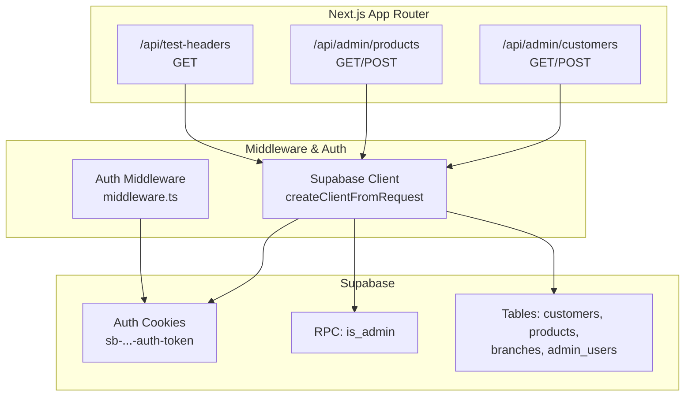
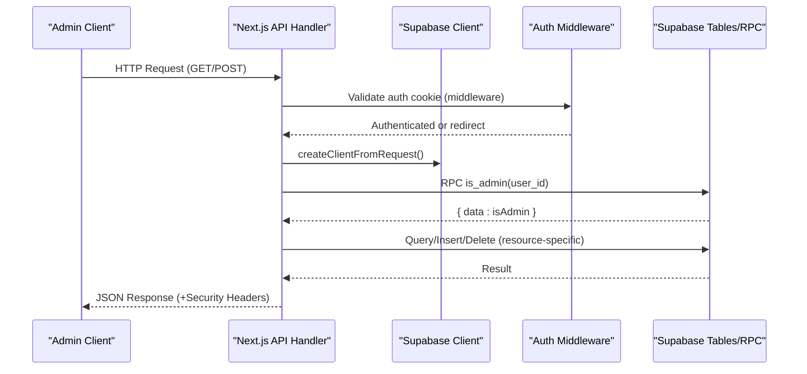
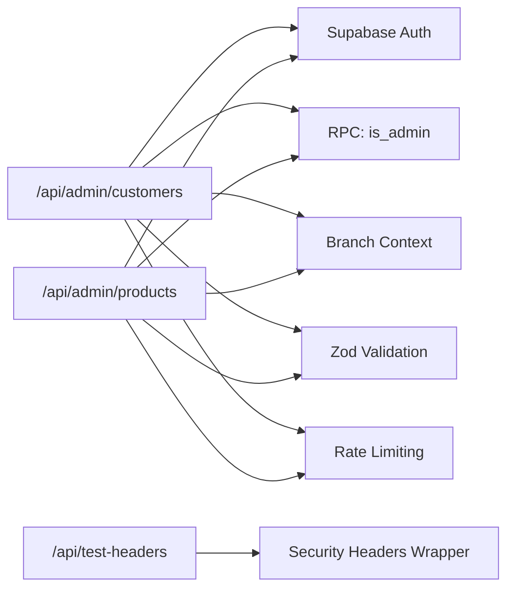

# API Reference

<cite>
**Referenced Files in This Document**
- [src/lib/supabase.ts](file://src/lib/supabase.ts)
- [src/middleware.ts](file://src/middleware.ts)
- [src/app/api/test-headers/route.ts](file://src/app/api/test-headers/route.ts)
- [src/app/api/admin/customers/route.ts](file://src/app/api/admin/customers/route.ts)
- [src/app/api/admin/products/route.ts](file://src/app/api/admin/products/route.ts)
</cite>

## Table of Contents

1. [Introduction](#introduction)
2. [Project Structure](#project-structure)
3. [Core Components](#core-components)
4. [Architecture Overview](#architecture-overview)
5. [Detailed Component Analysis](#detailed-component-analysis)
6. [Dependency Analysis](#dependency-analysis)
7. [Performance Considerations](#performance-considerations)
8. [Troubleshooting Guide](#troubleshooting-guide)
9. [Conclusion](#conclusion)
10. [Appendices](#appendices)

## Introduction

This document describes the Opttius administrative REST API surface implemented in the Next.js application. It focuses on administrative endpoints under the /api/admin namespace and covers:

- Authentication via Supabase Auth tokens
- Request/response formats and validation
- Error handling strategies
- Branch-scoped multi-tenancy and organization isolation
- Rate limiting and security headers
- Versioning and backwards compatibility notes
- Common use cases and client integration patterns

The administrative endpoints documented here are implemented as Next.js App Router API handlers and rely on Supabase for authentication, authorization checks, and data persistence.

## Project Structure

Administrative API routes are located under src/app/api/admin/<resource>. Each resource exposes standard CRUD endpoints with shared middleware for authentication, authorization, branch context, and rate limiting.

**Diagram sources**

- [src/app/api/admin/customers/route.ts](file://src/app/api/admin/customers/route.ts#L1-L703)
- [src/app/api/admin/products/route.ts](file://src/app/api/admin/products/route.ts#L1-L800)
- [src/app/api/test-headers/route.ts](file://src/app/api/test-headers/route.ts#L1-L55)
- [src/middleware.ts](file://src/middleware.ts#L1-L109)
- [src/lib/supabase.ts](file://src/lib/supabase.ts#L1-L36)

**Section sources**

- [src/app/api/admin/customers/route.ts](file://src/app/api/admin/customers/route.ts#L1-L703)
- [src/app/api/admin/products/route.ts](file://src/app/api/admin/products/route.ts#L1-L800)
- [src/app/api/test-headers/route.ts](file://src/app/api/test-headers/route.ts#L1-L55)
- [src/middleware.ts](file://src/middleware.ts#L1-L109)
- [src/lib/supabase.ts](file://src/lib/supabase.ts#L1-L36)

## Core Components

- Supabase client initialization and service role client for server-side operations
- Auth middleware that validates presence of Supabase auth cookies for /admin routes
- Resource endpoints for customers and products with:
  - Admin authorization via RPC
  - Branch-aware multi-tenancy
  - Validation using Zod schemas
  - Rate limiting for modification endpoints
  - Security headers for API endpoints

**Section sources**

- [src/lib/supabase.ts](file://src/lib/supabase.ts#L1-L36)
- [src/middleware.ts](file://src/middleware.ts#L1-L109)
- [src/app/api/admin/customers/route.ts](file://src/app/api/admin/customers/route.ts#L1-L703)
- [src/app/api/admin/products/route.ts](file://src/app/api/admin/products/route.ts#L1-L800)

## Architecture Overview

The administrative API follows a layered pattern:

- HTTP handlers in src/app/api/admin
- Shared middleware for auth, branch context, and rate limiting
- Supabase client instantiated per-request for secure access
- RPC calls for admin checks and database operations

**Diagram sources**

- [src/middleware.ts](file://src/middleware.ts#L14-L94)
- [src/app/api/admin/customers/route.ts](file://src/app/api/admin/customers/route.ts#L22-L82)
- [src/app/api/admin/products/route.ts](file://src/app/api/admin/products/route.ts#L24-L45)

## Detailed Component Analysis

### Authentication and Authorization

- Authentication relies on Supabase Auth cookies named sb-{projectRef}-auth-token. The middleware inspects cookies for /admin routes and redirects unauthenticated users to /login.
- Authorization is enforced via an RPC call is_admin(user_id) to verify administrative privileges.
- Service role client is available for server-side operations requiring elevated permissions.

**Section sources**

- [src/middleware.ts](file://src/middleware.ts#L44-L92)
- [src/lib/supabase.ts](file://src/lib/supabase.ts#L19-L33)
- [src/app/api/admin/customers/route.ts](file://src/app/api/admin/customers/route.ts#L64-L81)
- [src/app/api/admin/products/route.ts](file://src/app/api/admin/products/route.ts#L36-L45)

### Security Headers and Testing

- API endpoints apply security headers (e.g., X-Frame-Options, X-Content-Type-Options, Referrer-Policy, X-XSS-Protection, Permissions-Policy, COOP, CORP, CSP, HSTS) using a shared middleware wrapper.
- A dedicated test endpoint verifies applied headers and provides instructions for inspection.

**Section sources**

- [src/app/api/test-headers/route.ts](file://src/app/api/test-headers/route.ts#L12-L54)

### Customers API

- Base URL: /api/admin/customers
- Methods:
  - GET: List customers with search, status, pagination, and analytics summary
  - POST: Create a customer or request analytics summary

- Query parameters (GET):
  - q, search: free-text search across name, email, phone, RUT
  - is_active: boolean filter (active/inactive)
  - page, limit: pagination
  - branch_id: optional explicit branch filter

- Request body (POST):
  - For customer creation: fields validated by Zod schema (e.g., name, email, phone, RUT, address, medical history)
  - For analytics summary: empty body or summary-related fields

- Response formats:
  - GET: { customers: [...], pagination: { page, limit, total, totalPages } }
  - POST (create): { success: true, customer: {...} } or analytics summary
  - Errors: { error: string, details?: string }

- Validation and error handling:
  - Zod-based validation with structured error responses
  - Rate limiting for modifications
  - Multi-tenancy: organization_id filter; branch-aware visibility

- Example request (create customer):
  - Method: POST
  - Headers: Authorization: Bearer <Supabase Auth Token>
  - Body: { first_name, last_name, email?, phone?, rut?, address_line_1?, ... }

- Example response (success):
  - Status: 201 Created
  - Body: { success: true, customer: { id, organization_id, branch_id, ... } }

- Example response (validation error):
  - Status: 400 Bad Request
  - Body: { error: "Validation failed", details: [{ field, message }] }

- Example response (rate limit exceeded):
  - Status: 429 Too Many Requests
  - Body: { error: "<message>" }

- Notes:
  - Branch selection is required for customer creation; super admin in global view must specify branch_id
  - Duplicate detection by email/RUT within the same branch
  - Tier limits enforced via SaaS validator

**Section sources**

- [src/app/api/admin/customers/route.ts](file://src/app/api/admin/customers/route.ts#L22-L223)
- [src/app/api/admin/customers/route.ts](file://src/app/api/admin/customers/route.ts#L226-L702)

### Products API

- Base URL: /api/admin/products
- Methods:
  - GET: List products with filters, sorting, pagination, and stock aggregation
  - POST: Create a product

- Query parameters (GET):
  - branch_id: optional explicit branch filter
  - category, search, skin_type, min_price, max_price, featured, in_stock, low_stock_only, status, include_archived, sort_by, sort_order, page, limit, offset

- Request body (POST):
  - Fields validated by Zod schema (e.g., name, price, category_id, branch_id, status, images, tags)

- Response formats:
  - GET: { products: [...], pagination: { page, limit, total, totalPages, hasMore } }
  - POST: { success: true, product: {...} } or error
  - Errors: { error: string, details?: string }

- Validation and error handling:
  - Zod-based validation with structured error responses
  - Rate limiting for modifications
  - Multi-tenancy: organization_id filter; branch-aware visibility
  - Stock aggregation per branch via product_branch_stock

- Example request (create product):
  - Method: POST
  - Headers: Authorization: Bearer <Supabase Auth Token>
  - Body: { name, price, category_id?, branch_id, status?, images?, tags? }

- Example response (success):
  - Status: 200 OK
  - Body: { success: true, product: { id, slug, name, price, branch_id, ... } }

- Example response (validation error):
  - Status: 400 Bad Request
  - Body: { error: "Validation failed", details: [{ field, message }] }

- Example response (rate limit exceeded):
  - Status: 429 Too Many Requests
  - Body: { error: "<message>" }

- Notes:
  - When branch_id is explicitly requested, only global or branch-specific products are returned
  - Search queries combine with organization and branch filters; branch filter may be applied post-processing to avoid query conflicts
  - Legacy inventory fields handled for backward compatibility

**Section sources**

- [src/app/api/admin/products/route.ts](file://src/app/api/admin/products/route.ts#L24-L539)
- [src/app/api/admin/products/route.ts](file://src/app/api/admin/products/route.ts#L542-L800)

## Dependency Analysis

- Authentication and authorization depend on Supabase Auth cookies and RPC is_admin
- Branch-aware multi-tenancy depends on branch context headers and organization_id isolation
- Validation depends on Zod schemas and shared helpers
- Rate limiting depends on middleware wrappers
- Security headers are applied via a shared middleware wrapper

**Diagram sources**

- [src/app/api/admin/customers/route.ts](file://src/app/api/admin/customers/route.ts#L1-L703)
- [src/app/api/admin/products/route.ts](file://src/app/api/admin/products/route.ts#L1-L800)
- [src/app/api/test-headers/route.ts](file://src/app/api/test-headers/route.ts#L1-L55)

**Section sources**

- [src/app/api/admin/customers/route.ts](file://src/app/api/admin/customers/route.ts#L1-L703)
- [src/app/api/admin/products/route.ts](file://src/app/api/admin/products/route.ts#L1-L800)
- [src/app/api/test-headers/route.ts](file://src/app/api/test-headers/route.ts#L1-L55)

## Performance Considerations

- Pagination is supported for list endpoints to reduce payload sizes.
- Branch filters are applied to minimize cross-branch scans; explicit branch_id improves performance.
- Stock aggregation is computed per-branch and may require post-processing when nested relations are involved.
- Rate limiting is enabled for modification endpoints to protect backend resources.

[No sources needed since this section provides general guidance]

## Troubleshooting Guide

- Unauthorized or forbidden:
  - Ensure the auth cookie sb-{projectRef}-auth-token is present and valid.
  - Verify the user has admin privileges via is_admin RPC.
- Branch access denied:
  - Super admin in global view must specify branch_id in request body.
  - Regular admin must select a branch before creating resources.
- Validation errors:
  - Review the details array for field-specific messages.
- Rate limit exceeded:
  - Reduce request frequency or upgrade your plan.
- Security headers:
  - Use the test endpoint to verify applied headers and inspect browser/network devtools.

**Section sources**

- [src/middleware.ts](file://src/middleware.ts#L44-L92)
- [src/app/api/admin/customers/route.ts](file://src/app/api/admin/customers/route.ts#L320-L362)
- [src/app/api/admin/products/route.ts](file://src/app/api/admin/products/route.ts#L620-L666)
- [src/app/api/test-headers/route.ts](file://src/app/api/test-headers/route.ts#L12-L54)

## Conclusion

The administrative API provides secure, branch-aware, and multi-tenant endpoints for managing customers and products. It leverages Supabase Auth for authentication, RPC for authorization, Zod for validation, and shared middleware for rate limiting and security headers. Clients should integrate with Supabase Auth tokens, respect branch scoping, and follow the documented request/response formats.

[No sources needed since this section summarizes without analyzing specific files]

## Appendices

### Authentication Methods

- Supabase Auth tokens:
  - Cookie name: sb-{projectRef}-auth-token
  - Middleware validates presence for /admin routes
  - Tokens are used by Supabase client to authorize requests

**Section sources**

- [src/middleware.ts](file://src/middleware.ts#L44-L92)
- [src/lib/supabase.ts](file://src/lib/supabase.ts#L1-L36)

### Request/Response Formats and JSON Schemas

- Validation:
  - Zod schemas define allowed fields and types for create/update operations
  - Validation errors return structured details arrays with field and message
- Error responses:
  - Standardized shape: { error: string, details?: string }
  - Rate limit: 429 with error message
  - Unauthorized: 401 with "Unauthorized"
  - Forbidden: 403 with "Admin access required" or branch access denial

**Section sources**

- [src/app/api/admin/customers/route.ts](file://src/app/api/admin/customers/route.ts#L320-L362)
- [src/app/api/admin/products/route.ts](file://src/app/api/admin/products/route.ts#L620-L666)

### Rate Limiting

- Modification endpoints (e.g., POST for customers/products) are protected by rate limiting middleware
- Exceeded limits return 429 with an error message

**Section sources**

- [src/app/api/admin/customers/route.ts](file://src/app/api/admin/customers/route.ts#L228-L230)
- [src/app/api/admin/products/route.ts](file://src/app/api/admin/products/route.ts#L544-L546)

### Versioning and Backwards Compatibility

- API endpoints are implemented as Next.js App Router routes without explicit version segments
- Backward compatibility is maintained by preserving query parameters and response shapes where possible
- Migration notes:
  - Branch-aware filtering is enforced; clients must set x-branch-id or branch_id query param when appropriate
  - Product stock fields moved to product_branch_stock; clients should consume aggregated totals exposed by the API

**Section sources**

- [src/app/api/admin/products/route.ts](file://src/app/api/admin/products/route.ts#L96-L134)
- [src/app/api/admin/products/route.ts](file://src/app/api/admin/products/route.ts#L430-L472)

### Security Considerations

- Apply security headers consistently using the provided middleware wrapper
- Enforce admin checks via RPC is_admin
- Use Supabase Auth tokens; avoid exposing tokens in client-side logs
- Validate and sanitize inputs using Zod schemas

**Section sources**

- [src/app/api/test-headers/route.ts](file://src/app/api/test-headers/route.ts#L12-L54)
- [src/app/api/admin/customers/route.ts](file://src/app/api/admin/customers/route.ts#L64-L81)
- [src/app/api/admin/products/route.ts](file://src/app/api/admin/products/route.ts#L36-L45)

### CORS Configuration

- Configure CORS at the Next.js middleware level to allow administrative origins and methods
- Ensure credentials are handled appropriately for cross-origin requests

[No sources needed since this section provides general guidance]

### Monitoring Approaches

- Log request metadata and outcomes using the application logger
- Track rate limit events and validation failures
- Monitor database errors and RPC call results

**Section sources**

- [src/app/api/admin/customers/route.ts](file://src/app/api/admin/customers/route.ts#L24-L222)
- [src/app/api/admin/products/route.ts](file://src/app/api/admin/products/route.ts#L25-L538)
