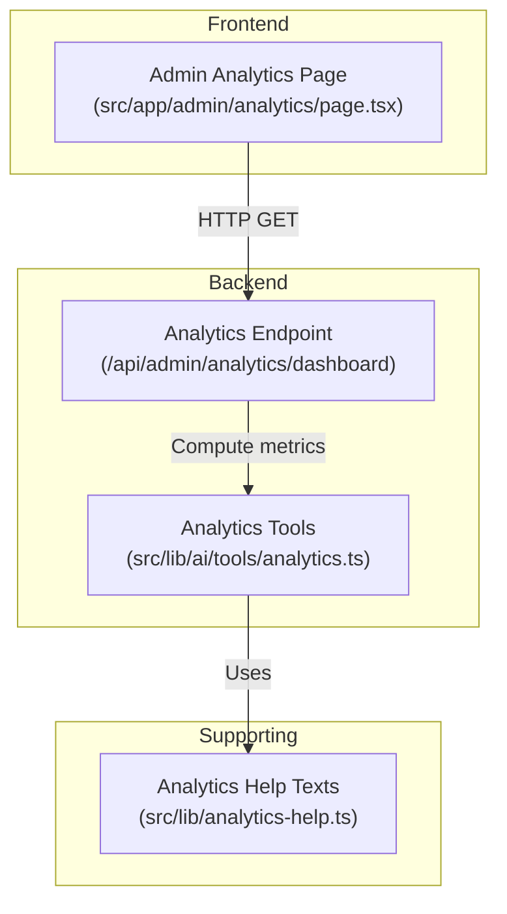
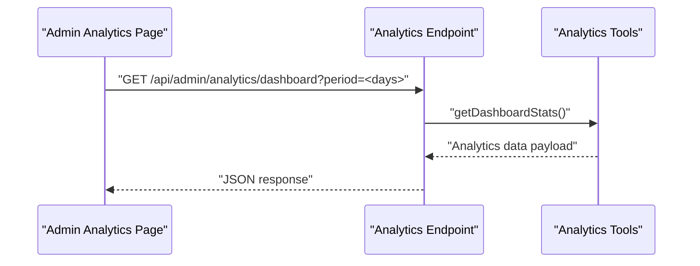
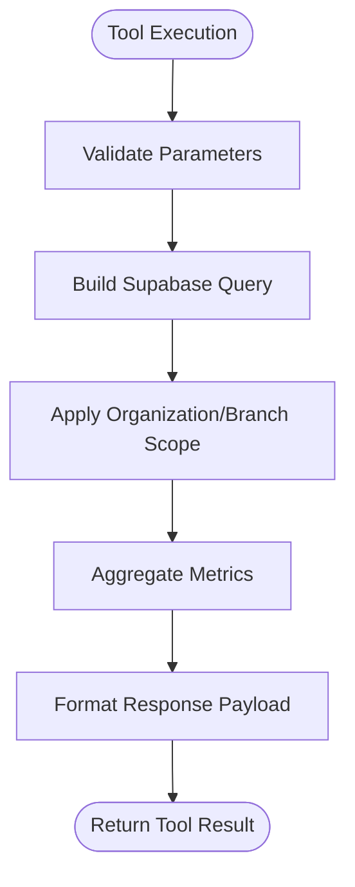
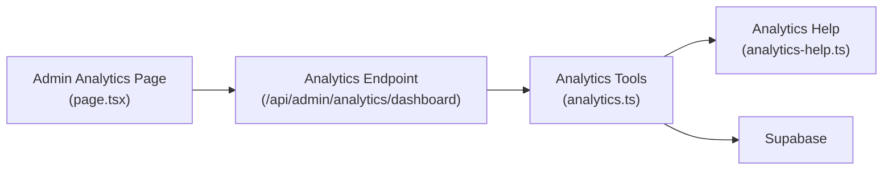

# Analytics & Dashboard API

<cite>
**Referenced Files in This Document**
- [analytics.ts](file://src/lib/ai/tools/analytics.ts)
- [analytics-help.ts](file://src/lib/analytics-help.ts)
- [page.tsx](file://src/app/admin/analytics/page.tsx)
</cite>

## Table of Contents

1. [Introduction](#introduction)
2. [Project Structure](#project-structure)
3. [Core Components](#core-components)
4. [Architecture Overview](#architecture-overview)
5. [Detailed Component Analysis](#detailed-component-analysis)
6. [Dependency Analysis](#dependency-analysis)
7. [Performance Considerations](#performance-considerations)
8. [Troubleshooting Guide](#troubleshooting-guide)
9. [Conclusion](#conclusion)
10. [Appendices](#appendices)

## Introduction

This document describes the analytics and dashboard APIs used by the Opttius admin interface. It focuses on:

- HTTP endpoints for retrieving business metrics, branch statistics, and performance dashboards
- Request/response schemas for KPIs, revenue tracking, customer analytics, and operational metrics
- Authentication requirements and request formats for analytics queries
- Filtering options (time ranges, branch scoping)
- Data aggregation patterns and multi-branch reporting capabilities

The analytics data is consumed by the admin analytics page and produced via internal analytics tools.

## Project Structure

The analytics functionality spans:

- Frontend page that requests analytics data from a backend endpoint
- Internal analytics tools that compute KPIs and trends
- Help texts that define metric semantics and formulas

**Diagram sources**

- [page.tsx](file://src/app/admin/analytics/page.tsx#L164-L191)
- [analytics.ts](file://src/lib/ai/tools/analytics.ts#L21-L137)
- [analytics-help.ts](file://src/lib/analytics-help.ts#L1-L124)

**Section sources**

- [page.tsx](file://src/app/admin/analytics/page.tsx#L1-L120)
- [analytics.ts](file://src/lib/ai/tools/analytics.ts#L1-L173)
- [analytics-help.ts](file://src/lib/analytics-help.ts#L1-L124)

## Core Components

- Admin Analytics Page: Fetches dashboard analytics via a client-side fetch to the backend endpoint, supports branch scoping and time-range selection.
- Analytics Tools: Internal toolset that computes KPIs, revenue trends, top products, and sales reports. These tools validate parameters and query the database using Supabase.
- Analytics Help: Provides semantic definitions and formulas for each metric to guide interpretation.

Key responsibilities:

- Request orchestration and UI rendering
- Parameter validation and query construction
- Metric definitions and formulas

**Section sources**

- [page.tsx](file://src/app/admin/analytics/page.tsx#L134-L191)
- [analytics.ts](file://src/lib/ai/tools/analytics.ts#L21-L137)
- [analytics-help.ts](file://src/lib/analytics-help.ts#L1-L124)

## Architecture Overview

The analytics pipeline:

- The admin page constructs a request to the backend analytics endpoint with a period parameter and branch header.
- The backend endpoint delegates computation to analytics tools.
- Tools validate parameters, query the database, and return structured analytics data.

**Diagram sources**

- [page.tsx](file://src/app/admin/analytics/page.tsx#L164-L191)
- [analytics.ts](file://src/lib/ai/tools/analytics.ts#L21-L137)

## Detailed Component Analysis

### HTTP Endpoint: GET /api/admin/analytics/dashboard

- Method: GET
- URL: /api/admin/analytics/dashboard
- Query parameters:
  - period: integer days (e.g., 7, 30, 90, 365)
- Request headers:
  - Branch-scoped header injected by the frontend (branch-aware access)
- Response body: JSON containing analytics payload (see Response Schema below)
- Authentication:
  - Requires admin session; branch-scoped via header

Response schema (analytics payload):

- kpis: Business KPIs
  - totalRevenue: number (CLP)
  - posRevenue: number (CLP)
  - workOrdersRevenue: number (CLP)
  - revenueGrowth: number (%)
  - totalOrders: number
  - totalWorkOrders: number
  - totalQuotes: number
  - totalAppointments: number
  - totalCustomers: number
  - newCustomers: number
  - recurringCustomers: number
  - avgOrderValue: number (CLP)
  - avgWorkOrderValue: number (CLP)
  - avgQuoteValue: number (CLP)
  - quoteConversionRate: number (%)
  - appointmentCompletionRate: number (%)
  - avgDeliveryDays: number (days)
- workOrders: Work order statistics
  - total: number
  - pending: number
  - completed: number
  - cancelled: number
  - byStatus: object mapping status to count
- quotes: Quote statistics
  - total: number
  - accepted: number
  - rejected: number
  - expired: number
  - converted: number
  - byStatus: object mapping status to count
  - conversionRate: number (%)
- appointments: Appointment statistics
  - total: number
  - completed: number
  - cancelled: number
  - noShow: number
  - byStatus: object mapping status to count
  - completionRate: number (%)
- products: Product inventory and sales
  - total: number
  - lowStock: number
  - outOfStock: number
  - topProducts: array of { id, name, category, revenue, quantity, orders }
  - categoryRevenue: array of { category, revenue }
- paymentMethods: array of { method, count, revenue }
- trends: Time series data
  - sales: array of { date, value, count }
  - customers: array of { date, value, count }
  - workOrders: array of { date, value, count }
  - quotes: array of { date, value, count }
- period: { from, to, days }

Notes:

- Multi-branch reporting: The frontend injects a branch-aware header; the backend uses this to scope analytics to a specific branch or global view for super admins.
- Time range filtering: Controlled by the period query parameter; tools compute start dates accordingly.

**Section sources**

- [page.tsx](file://src/app/admin/analytics/page.tsx#L164-L191)
- [page.tsx](file://src/app/admin/analytics/page.tsx#L58-L132)

### Internal Analytics Tools

The analytics tools module defines:

- getDashboardStats: Returns comprehensive dashboard KPIs and breakdowns
- getRevenueTrend: Returns revenue trend over N days
- getTopProducts: Returns top products by revenue over N days
- getSalesReport: Returns sales report with optional date window

Parameter schemas:

- getDashboardStats: {}
- getRevenueTrend: { days: number }
- getTopProducts: { limit: number, days: number }
- getSalesReport: { startDate?: string, endDate?: string, days?: number }

Execution behavior:

- Validates parameters using Zod
- Uses Supabase to query relevant tables
- Applies organization-level scoping
- Aggregates and formats results for the UI

**Diagram sources**

- [analytics.ts](file://src/lib/ai/tools/analytics.ts#L21-L137)

**Section sources**

- [analytics.ts](file://src/lib/ai/tools/analytics.ts#L1-L173)

### Metric Definitions and Formulas

The analytics help module documents semantics and formulas for key metrics:

- Total Revenue: Sum of paid orders’ totals in the period
- Revenue Growth: Percentage change vs previous period of equal length
- Total Orders: Count of all orders in the period
- Total Customers: Count of all customer profiles
- Conversion Rate: (Total Orders / New Customers) × 100
- Sales Trend: Daily revenue evolution for the period
- Customer Acquisition: New customer registrations in the period
- Order Status: Distribution of orders by status
- Customer Segmentation: Classification by membership type/status
- Revenue by Category: Sum of (quantity × price) by product category
- Top Products: Ranking by total revenue (quantity × price)

These definitions inform how the UI interprets and displays analytics data.

**Section sources**

- [analytics-help.ts](file://src/lib/analytics-help.ts#L1-L124)

## Dependency Analysis

- The admin analytics page depends on:
  - Backend endpoint for analytics data
  - Branch context for scoping
- The analytics endpoint depends on:
  - Analytics tools for computations
  - Supabase for data access
  - Branch header for multi-branch filtering

**Diagram sources**

- [page.tsx](file://src/app/admin/analytics/page.tsx#L164-L191)
- [analytics.ts](file://src/lib/ai/tools/analytics.ts#L21-L137)
- [analytics-help.ts](file://src/lib/analytics-help.ts#L1-L124)

**Section sources**

- [page.tsx](file://src/app/admin/analytics/page.tsx#L134-L191)
- [analytics.ts](file://src/lib/ai/tools/analytics.ts#L21-L137)

## Performance Considerations

- Time window sizing: Larger periods increase query volume; consider caching or pre-aggregation for frequent long-range views.
- Branch scoping: Limit dataset size by applying branch filters early in queries.
- Aggregation granularity: Prefer daily rollups for trend charts to reduce payload sizes.
- Pagination: For lists like top products, cap limits to avoid oversized responses.

## Troubleshooting Guide

Common issues and remedies:

- Missing organization context: Tools require organization ID; ensure the request context supplies it.
- Empty datasets: Some metrics may be empty for short windows or inactive catalogs; widen the period or verify data presence.
- Branch access: Super admins can view global data; branch users see scoped data; confirm branch header usage.

Operational checks:

- Verify endpoint availability and response shape
- Confirm branch header injection in the frontend
- Validate parameter types passed to analytics tools

**Section sources**

- [analytics.ts](file://src/lib/ai/tools/analytics.ts#L31-L41)
- [page.tsx](file://src/app/admin/analytics/page.tsx#L164-L191)

## Conclusion

The analytics and dashboard API provides a cohesive set of endpoints and tools to power business insights. By combining branch-aware scoping, flexible time-range filtering, and well-defined KPIs, administrators can monitor revenue, customer acquisition, operational throughput, and product performance across single or multiple branches.

## Appendices

### API Reference Summary

- Endpoint: GET /api/admin/analytics/dashboard
- Query parameters:
  - period: integer days (7, 30, 90, 365)
- Request headers:
  - Branch-scoped header for multi-branch filtering
- Response:
  - Analytics payload with KPIs, breakdowns, trends, and period metadata

### Request Formats

- Query parameters:
  - period: number (days)
- Optional date window:
  - days: number
  - startDate: ISO date string
  - endDate: ISO date string

### Response Structures

- analytics payload keys:
  - kpis, workOrders, quotes, appointments, products, paymentMethods, trends, period

### Filtering Options

- Time range: period (days)
- Branch: via branch-aware header
- Date window: days or explicit start/end dates (where supported)
