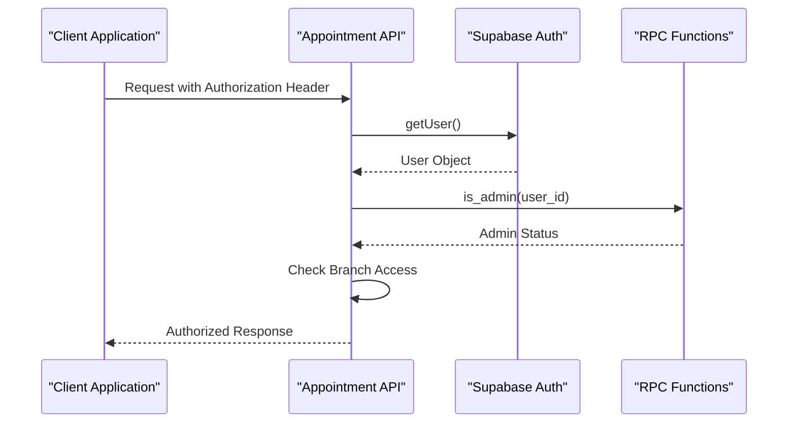
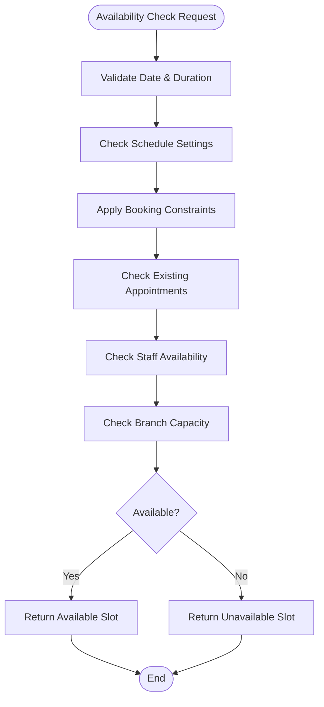
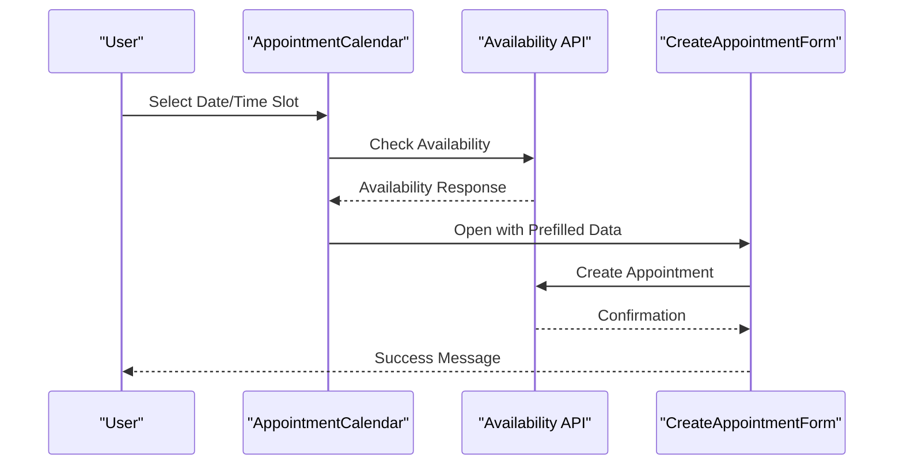

# Appointment Scheduling API

<cite>
**Referenced Files in This Document**
- [route.ts](file://src/app/api/admin/appointments/route.ts)
- [route.ts](file://src/app/api/admin/appointments/[id]/route.ts)
- [route.ts](file://src/app/api/admin/schedule-settings/route.ts)
- [route.ts](file://src/app/api/admin/customers/[id]/appointments/route.ts)
- [zod-schemas.ts](file://src/lib/api/validation/zod-schemas.ts)
- [supabase-rpc.ts](file://src/types/supabase-rpc.ts)
- [CreateAppointmentForm.tsx](file://src/components/admin/CreateAppointmentForm.tsx)
- [AppointmentCalendar.tsx](file://src/components/admin/AppointmentCalendar.tsx)
- [page.tsx](file://src/app/admin/appointments/page.tsx)
</cite>

## Table of Contents

1. [Introduction](#introduction)
2. [Authentication & Authorization](#authentication--authorization)
3. [Core Endpoints](#core-endpoints)
4. [Request/Response Schemas](#requestresponse-schemas)
5. [Schedule Settings Management](#schedule-settings-management)
6. [Availability Checking](#availability-checking)
7. [Appointment Status Tracking](#appointment-status-tracking)
8. [Time Slot Validation](#time-slot-validation)
9. [Guest Customer Handling](#guest-customer-handling)
10. [Calendar Integration Patterns](#calendar-integration-patterns)
11. [Error Handling](#error-handling)
12. [Best Practices](#best-practices)

## Introduction

The Opttius appointment scheduling API provides comprehensive functionality for managing optometric appointments across multiple clinic locations. This system handles appointment creation, modification, cancellation, and real-time availability checking while supporting both registered customers and guest visitors.

The API follows RESTful principles with type-safe validation using Zod schemas and integrates with Supabase's PostgreSQL database and RPC functions for business logic enforcement. The system supports multi-branch operations with proper authorization controls and maintains detailed appointment status tracking.

## Authentication & Authorization

All appointment endpoints require administrative authentication and authorization:

### Authentication Requirements

- **Supabase Authentication**: All requests must include valid Supabase authentication
- **Admin Privileges**: Users must have administrative access to the system
- **Branch Context**: Non-super admin users are restricted to their assigned branches

### Authorization Flow



**Section sources**

- [route.ts](file://src/app/api/admin/appointments/route.ts#L23-L44)
- [route.ts](file://src/app/api/admin/appointments/[id]/route.ts#L14-L31)

## Core Endpoints

### Appointment Management Endpoints

| Method | Endpoint                       | Description                        |
| ------ | ------------------------------ | ---------------------------------- |
| GET    | `/api/admin/appointments`      | List all appointments with filters |
| POST   | `/api/admin/appointments`      | Create new appointment             |
| GET    | `/api/admin/appointments/[id]` | Get specific appointment           |
| PUT    | `/api/admin/appointments/[id]` | Update appointment                 |
| DELETE | `/api/admin/appointments/[id]` | Cancel/delete appointment          |

### Availability Endpoints

| Method | Endpoint                               | Description                  |
| ------ | -------------------------------------- | ---------------------------- |
| GET    | `/api/admin/appointments/availability` | Check time slot availability |

### Schedule Settings Endpoints

| Method | Endpoint                       | Description                   |
| ------ | ------------------------------ | ----------------------------- |
| GET    | `/api/admin/schedule-settings` | Get schedule configuration    |
| PUT    | `/api/admin/schedule-settings` | Update schedule configuration |

**Section sources**

- [route.ts](file://src/app/api/admin/appointments/route.ts#L23-L202)
- [route.ts](file://src/app/api/admin/appointments/[id]/route.ts#L7-L98)
- [route.ts](file://src/app/api/admin/schedule-settings/route.ts#L8-L134)

## Request/Response Schemas

### Appointment Creation Schema

The appointment creation schema validates all incoming appointment data with comprehensive field validation:

**Required Fields:**

- `appointment_type`: String (1-100 characters)
- `appointment_date`: Date in YYYY-MM-DD format
- `appointment_time`: Time in HH:MM:SS format
- `duration_minutes`: Positive integer (default: 30)

**Conditional Fields:**

- Either `customer_id` OR `guest_customer` must be provided
- `guest_customer` requires: `first_name`, `last_name`, `rut`

**Optional Fields:**

- `notes`: String up to 5000 characters
- `assigned_to`: Staff member identifier
- `reason`: Appointment reason description
- `follow_up_required`: Boolean flag
- `prescription_id`: Related prescription identifier
- `order_id`: Related order identifier

**Section sources**

- [zod-schemas.ts](file://src/lib/api/validation/zod-schemas.ts#L1408-L1441)

### Appointment Update Schema

**Updatable Fields:**

- `appointment_date`, `appointment_time`, `duration_minutes`
- `status`: scheduled, confirmed, completed, cancelled, no_show
- `assigned_to`, `notes`, `reason`, `outcome`
- `follow_up_required`, `follow_up_date`
- `prescription_id`, `order_id`

**Status-specific Behavior:**

- Setting status to "completed" triggers auto-registration for guest customers
- Setting status to "cancelled" or "no_show" clears guest information

**Section sources**

- [route.ts](file://src/app/api/admin/appointments/[id]/route.ts#L194-L261)

### Response Structures

**Success Response (POST/PUT):**

```json
{
  "success": true,
  "appointment": {
    "id": "string",
    "appointment_date": "YYYY-MM-DD",
    "appointment_time": "HH:MM:SS",
    "duration_minutes": 30,
    "appointment_type": "string",
    "status": "scheduled",
    "customer": {
      "id": "string",
      "first_name": "string",
      "last_name": "string",
      "email": "string",
      "phone": "string"
    }
  }
}
```

**Error Response:**

```json
{
  "error": "Error message",
  "code": "ERROR_CODE",
  "details": {}
}
```

**Section sources**

- [route.ts](file://src/app/api/admin/appointments/route.ts#L625-L631)
- [route.ts](file://src/app/api/admin/appointments/[id]/route.ts#L388-L391)

## Schedule Settings Management

### Configuration Structure

The schedule settings system manages operational constraints for appointment scheduling:

**Core Settings:**

- `slot_duration_minutes`: Individual time slot size (default: 15)
- `default_appointment_duration`: Standard appointment length (default: 30)
- `buffer_time_minutes`: Gap between consecutive appointments (default: 0)
- `working_hours`: Daily schedule by day of week
- `blocked_dates`: Specific dates unavailable for booking
- `min_advance_booking_hours`: Minimum advance booking time
- `max_advance_booking_days`: Maximum advance booking period

**Working Hours Schema:**

```json
{
  "monday": {
    "enabled": true,
    "start_time": "09:00",
    "end_time": "18:00",
    "lunch_start": null,
    "lunch_end": null
  }
}
```

**Section sources**

- [route.ts](file://src/app/api/admin/schedule-settings/route.ts#L64-L124)

### Multi-Level Configuration

**Global vs Branch Configuration:**

- Super administrators can set organization-wide defaults
- Branch managers can override settings per location
- Global updates automatically sync to all branches

**Section sources**

- [route.ts](file://src/app/api/admin/schedule-settings/route.ts#L198-L252)

## Availability Checking

### Real-Time Availability API

The availability checking system provides real-time slot validation:

**Endpoint:** `GET /api/admin/appointments/availability`

**Query Parameters:**

- `date`: Required (YYYY-MM-DD)
- `duration`: Required (minutes)
- `staff_id`: Optional (specific staff member)
- `branch_id`: Optional (specific branch)

**Response Structure:**

```json
{
  "slots": [
    {
      "time_slot": "HH:MM",
      "available": true
    }
  ]
}
```

### Availability Validation Logic



**Diagram sources**

- [route.ts](file://src/app/api/admin/appointments/route.ts#L309-L421)
- [supabase-rpc.ts](file://src/types/supabase-rpc.ts#L101-L122)

**Section sources**

- [route.ts](file://src/app/api/admin/appointments/route.ts#L309-L421)
- [supabase-rpc.ts](file://src/types/supabase-rpc.ts#L101-L147)

## Appointment Status Tracking

### Status Lifecycle

The appointment system tracks detailed status changes with timestamps:

**Available Status Values:**

- `scheduled`: Initial booking state
- `confirmed`: Staff confirmation
- `completed`: Appointment finished
- `cancelled`: Administrative cancellation
- `no_show`: Customer failure to appear

**Timestamp Management:**

- `created_at`: Automatic timestamp on creation
- `updated_at`: Automatic timestamp on updates
- `completed_at`: Set when status becomes "completed"
- `cancelled_at`: Set when status becomes "cancelled"

### Auto-Registration Feature

When an appointment status changes to "completed":

- Guest customers are automatically converted to registered customers
- RUT-based duplicate detection prevents multiple registrations
- Customer data is migrated with organization and branch context

**Section sources**

- [route.ts](file://src/app/api/admin/appointments/[id]/route.ts#L280-L363)

## Time Slot Validation

### Validation Rules

**Time Format Requirements:**

- Dates: YYYY-MM-DD format
- Times: HH:MM:SS format (24-hour)
- Durations: Positive integers in minutes

**Constraint Validation:**

- Minimum booking advance: Configured in schedule settings
- Maximum booking horizon: Configured in schedule settings
- Working hours compliance: Based on schedule settings
- Staff availability: Confirmed against staff-specific schedules

**Section sources**

- [zod-schemas.ts](file://src/lib/api/validation/zod-schemas.ts#L1417-L1426)
- [route.ts](file://src/app/api/admin/appointments/route.ts#L328-L380)

## Guest Customer Handling

### Guest Registration Flow

The system supports both registered and guest customer appointments:

**Guest Customer Schema:**

- `first_name`: Required for guest appointments
- `last_name`: Required for guest appointments
- `rut`: Required for guest appointments
- `email`: Optional
- `phone`: Optional

**Automatic Registration:**

- Upon appointment completion, guest data is converted to customer records
- RUT-based deduplication prevents duplicate customer entries
- Organization and branch context maintained during conversion

**Section sources**

- [route.ts](file://src/app/api/admin/appointments/route.ts#L427-L457)
- [route.ts](file://src/app/api/admin/appointments/[id]/route.ts#L280-L363)

## Calendar Integration Patterns

### Frontend Calendar Implementation

The system provides a comprehensive calendar interface with real-time availability:

**Calendar Features:**

- Day/Week/Month view modes
- Click-to-book functionality
- Visual availability indicators
- Past date/time filtering
- Responsive design for all devices

**Integration Pattern:**



**Diagram sources**

- [CreateAppointmentForm.tsx](file://src/components/admin/CreateAppointmentForm.tsx#L227-L305)
- [page.tsx](file://src/app/admin/appointments/page.tsx#L401-L412)

**Section sources**

- [CreateAppointmentForm.tsx](file://src/components/admin/CreateAppointmentForm.tsx#L227-L305)
- [AppointmentCalendar.tsx](file://src/components/admin/AppointmentCalendar.tsx#L395-L466)
- [page.tsx](file://src/app/admin/appointments/page.tsx#L401-L412)

## Error Handling

### Common Error Scenarios

**Authentication Errors:**

- `401 Unauthorized`: Invalid or missing authentication
- `403 Forbidden`: Non-admin user attempting admin operation

**Validation Errors:**

- `400 Bad Request`: Invalid appointment data format
- `400 Bad Request`: Time slot not available
- `404 Not Found`: Appointment not found

**System Errors:**

- `500 Internal Server Error`: Database or RPC function failures

**Error Response Format:**

```json
{
  "error": "Descriptive error message",
  "code": "ERROR_CODE",
  "details": {
    "message": "Database error details",
    "code": "SQLSTATE_CODE",
    "hint": "Database hint"
  }
}
```

**Section sources**

- [route.ts](file://src/app/api/admin/appointments/route.ts#L94-L122)
- [route.ts](file://src/app/api/admin/appointments/[id]/route.ts#L172-L191)

## Best Practices

### Implementation Guidelines

**API Usage:**

- Always validate availability before creating appointments
- Use proper error handling for all API responses
- Implement retry logic for transient failures
- Cache schedule settings appropriately

**Data Management:**

- Maintain consistent time zone handling
- Use atomic operations for appointment updates
- Implement proper transaction handling
- Monitor API performance and response times

**Security Considerations:**

- Validate all user inputs regardless of source
- Implement proper rate limiting
- Use HTTPS for all API communications
- Log all administrative actions

**Performance Optimization:**

- Batch related data queries to prevent N+1 problems
- Use appropriate indexing on frequently queried fields
- Implement caching for schedule settings
- Optimize database queries with proper filters
