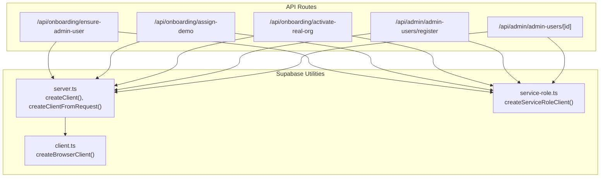
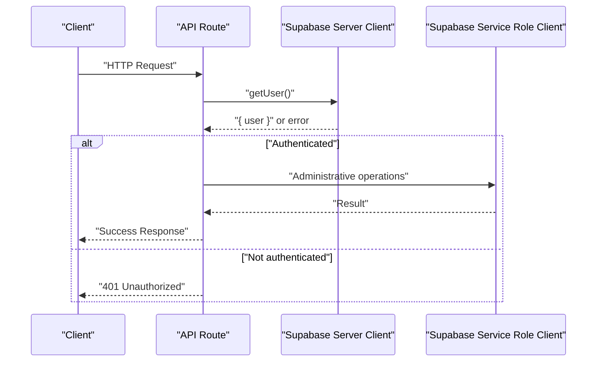
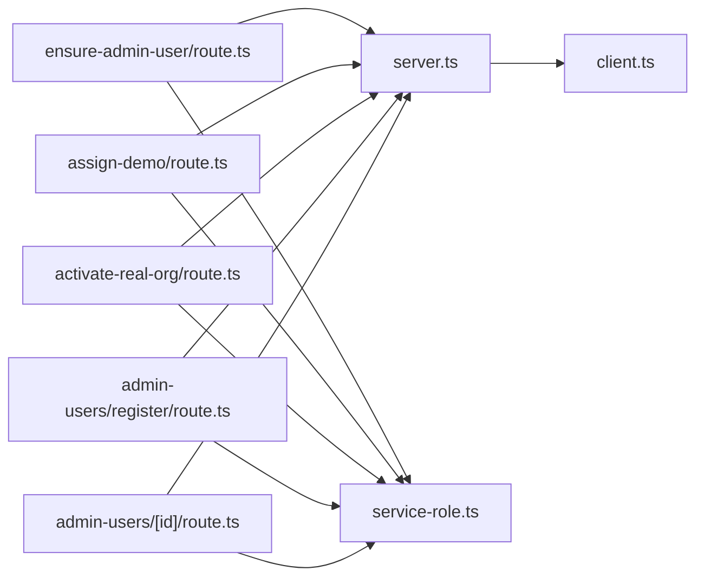

# Authentication API

<cite>
**Referenced Files in This Document**
- [ensure-admin-user/route.ts](file://src/app/api/onboarding/ensure-admin-user/route.ts)
- [assign-demo/route.ts](file://src/app/api/onboarding/assign-demo/route.ts)
- [activate-real-org/route.ts](file://src/app/api/onboarding/activate-real-org/route.ts)
- [admin-users/register/route.ts](file://src/app/api/admin/admin-users/register/route.ts)
- [admin-users/[id]/route.ts](file://src/app/api/admin/admin-users/[id]/route.ts)
- [server.ts](file://src/utils/supabase/server.ts)
- [service-role.ts](file://src/utils/supabase/service-role.ts)
- [client.ts](file://src/utils/supabase/client.ts)
</cite>

## Table of Contents

1. [Introduction](#introduction)
2. [Project Structure](#project-structure)
3. [Core Components](#core-components)
4. [Architecture Overview](#architecture-overview)
5. [Detailed Component Analysis](#detailed-component-analysis)
6. [Dependency Analysis](#dependency-analysis)
7. [Performance Considerations](#performance-considerations)
8. [Troubleshooting Guide](#troubleshooting-guide)
9. [Conclusion](#conclusion)

## Introduction

This document provides comprehensive API documentation for Opttius authentication and onboarding endpoints. It covers HTTP methods, URL patterns, request/response schemas, authentication requirements using Supabase Auth tokens, and error handling strategies. It also documents common workflows such as ensuring admin user records, assigning demo organizations, activating real organizations, and managing admin users.

Authentication relies on Supabase Auth with two supported mechanisms:

- Cookie-based sessions for browser clients
- Bearer token authentication for programmatic access and testing

Security considerations include role-based access control, service role client usage for administrative operations, and strict validation of inputs and permissions.

## Project Structure

The authentication and onboarding APIs are implemented as Next.js App Router API routes under src/app/api. The Supabase utilities provide clients for server-side operations and service role access.

**Diagram sources**

- [ensure-admin-user/route.ts](file://src/app/api/onboarding/ensure-admin-user/route.ts#L1-L111)
- [assign-demo/route.ts](file://src/app/api/onboarding/assign-demo/route.ts#L1-L196)
- [activate-real-org/route.ts](file://src/app/api/onboarding/activate-real-org/route.ts#L1-L415)
- [admin-users/register/route.ts](file://src/app/api/admin/admin-users/register/route.ts#L1-L495)
- [admin-users/[id]/route.ts](file://src/app/api/admin/admin-users/[id]/route.ts#L1-L492)
- [server.ts](file://src/utils/supabase/server.ts#L1-L110)
- [service-role.ts](file://src/utils/supabase/service-role.ts#L1-L12)
- [client.ts](file://src/utils/supabase/client.ts#L1-L8)

**Section sources**

- [ensure-admin-user/route.ts](file://src/app/api/onboarding/ensure-admin-user/route.ts#L1-L111)
- [assign-demo/route.ts](file://src/app/api/onboarding/assign-demo/route.ts#L1-L196)
- [activate-real-org/route.ts](file://src/app/api/onboarding/activate-real-org/route.ts#L1-L415)
- [admin-users/register/route.ts](file://src/app/api/admin/admin-users/register/route.ts#L1-L495)
- [admin-users/[id]/route.ts](file://src/app/api/admin/admin-users/[id]/route.ts#L1-L492)
- [server.ts](file://src/utils/supabase/server.ts#L1-L110)
- [service-role.ts](file://src/utils/supabase/service-role.ts#L1-L12)
- [client.ts](file://src/utils/supabase/client.ts#L1-L8)

## Core Components

- Onboarding endpoints:
  - Ensure admin user record exists for the authenticated user
  - Assign demo organization to the authenticated user
  - Activate a real organization from demo mode
- Admin user management endpoints:
  - Register new admin users within organizational and role constraints
  - Retrieve, update, and delete admin user records with role-based authorization

Authentication and session management:

- Supabase Auth getUser() for cookie-based sessions
- Bearer token support via Authorization header for programmatic access
- Service role client for administrative operations that bypass Row Level Security

**Section sources**

- [ensure-admin-user/route.ts](file://src/app/api/onboarding/ensure-admin-user/route.ts#L13-L110)
- [assign-demo/route.ts](file://src/app/api/onboarding/assign-demo/route.ts#L18-L195)
- [activate-real-org/route.ts](file://src/app/api/onboarding/activate-real-org/route.ts#L29-L414)
- [admin-users/register/route.ts](file://src/app/api/admin/admin-users/register/route.ts#L96-L494)
- [admin-users/[id]/route.ts](file://src/app/api/admin/admin-users/[id]/route.ts#L10-L491)
- [server.ts](file://src/utils/supabase/server.ts#L43-L92)
- [service-role.ts](file://src/utils/supabase/service-role.ts#L11-L12)

## Architecture Overview

The API routes authenticate requests using Supabase Auth and delegate administrative tasks using a service role client. Validation and permission checks are enforced per endpoint.

**Diagram sources**

- [server.ts](file://src/utils/supabase/server.ts#L6-L33)
- [server.ts](file://src/utils/supabase/server.ts#L43-L92)
- [ensure-admin-user/route.ts](file://src/app/api/onboarding/ensure-admin-user/route.ts#L18-L26)
- [assign-demo/route.ts](file://src/app/api/onboarding/assign-demo/route.ts#L23-L31)
- [activate-real-org/route.ts](file://src/app/api/onboarding/activate-real-org/route.ts#L34-L42)

## Detailed Component Analysis

### Onboarding: Ensure Admin User

- Method: POST
- URL: /api/onboarding/ensure-admin-user
- Purpose: Ensure the authenticated user has a record in admin_users. Creates one with role "admin" and broad permissions if missing.

Authentication

- Uses Supabase Auth getUser() from the server client.
- Returns 401 if not authenticated.

Behavior

- Checks for existing admin_users record by user ID.
- If not found, inserts a new record with role "admin" and default permissions.
- Returns success with created flag and admin user data.

Responses

- 200: { success: boolean, adminUser: object, created: boolean }
- 400/401: { error: string, details?: string }
- 500: { error: string, details?: string }

Common use cases

- First-time onboarding for new users to gain access to onboarding flows.

Security considerations

- Requires authenticated user session.
- Uses service role client for insert operation.

**Section sources**

- [ensure-admin-user/route.ts](file://src/app/api/onboarding/ensure-admin-user/route.ts#L13-L110)

### Onboarding: Assign Demo Organization

- Method: POST
- URL: /api/onboarding/assign-demo
- Purpose: Assign the demo organization to the authenticated user, granting super_admin access globally.

Authentication

- Uses Supabase Auth getUser().
- Returns 401 if not authenticated.

Behavior

- Verifies the user does not already belong to a non-demo organization.
- Confirms the demo organization exists.
- Upserts admin_users with role "super_admin" and organization_id set to demo.
- Grants global access (branch_id = null) by creating admin_branch_access.
- Returns success with organization details.

Responses

- 200: { success: boolean, organizationId: string, organization?: { id: string, name: string }, alreadyAssigned?: boolean }
- 400: { error: string, organizationId?: string }
- 401: { error: string }
- 500: { error: string, details?: string }

Common use cases

- Demo mode activation for new users trying out the system.

Security considerations

- Prevents changing organization if already assigned.
- Uses service role client for upsert and access grants.

**Section sources**

- [assign-demo/route.ts](file://src/app/api/onboarding/assign-demo/route.ts#L18-L195)

### Onboarding: Activate Real Organization

- Method: POST
- URL: /api/onboarding/activate-real-org
- Purpose: Convert the user from demo mode to a real organization, creating organization, branch, and subscription.

Authentication

- Uses Supabase Auth getUser().
- Returns 401 if not authenticated.

Request body

- name: string (required)
- slug: string (required)
- branchName: string (optional)

Behavior

- Validates that the user currently has the demo organization assigned.
- Ensures slug uniqueness.
- Creates organization with default "pro" tier and active status.
- Updates admin_users to set role "super_admin" and organization_id.
- Grants global access (branch_id = null).
- Creates initial branch (default name "Sucursal Principal").
- Cleans up any demo data created by the user during demo mode.
- Creates initial subscription with 7-day trial.
- Returns organization and branch details.

Responses

- 200: { organization: { id, name, slug, subscription_tier }, branch: { id, name, code } | null }
- 400: { error: string, details?: string }
- 401: { error: "No autenticado" }
- 500: { error: string, details?: string }

Common use cases

- Transition from demo to production organization.

Security considerations

- Strictly scoped to users with demo organization.
- Uses service role client for all administrative operations.
- Comprehensive cleanup of demo data to avoid leakage.

**Section sources**

- [activate-real-org/route.ts](file://src/app/api/onboarding/activate-real-org/route.ts#L29-L414)

### Admin Users: Register New Admin User

- Method: POST
- URL: /api/admin/admin-users/register
- Purpose: Create a new admin user within organizational and role constraints.

Authentication and authorization

- Requires authenticated user with appropriate admin role.
- Validates current user's role and organization context.
- Enforces allowed roles based on requester's role (root/dev, super_admin, admin).

Request body

- email: string (required)
- password: string (required, min length 8)
- firstName: string (recommended)
- lastName: string (recommended)
- role: string (default "admin"; allowed per requester role)
- branch_id: string (optional)

Behavior

- Validates inputs and tier limits for user creation.
- Creates user in Supabase Auth (email confirmed automatically).
- Ensures profile exists or creates/updates it.
- Inserts admin_users record with role-specific permissions.
- Optionally assigns branch access or grants global access for super_admin.
- Logs administrative activity.

Responses

- 200: { success: boolean, user: { id, email, role, organization_id } }
- 400: { error: string, code?: string, currentCount?: number, maxAllowed?: number }
- 401/403: { error: string }
- 500: { error: string, details?: string }

Common use cases

- Admin user creation by authorized administrators.

Security considerations

- Service role client used for auth.admin.createUser and profile/admin_user operations.
- Role hierarchy prevents unauthorized role assignments.
- Tier limit validation prevents exceeding subscription constraints.

**Section sources**

- [admin-users/register/route.ts](file://src/app/api/admin/admin-users/register/route.ts#L96-L494)

### Admin Users: Get, Update, Delete Admin User

- Methods: GET, PUT, DELETE
- URL: /api/admin/admin-users/[id]
- Purpose: Retrieve, update, or delete admin user records with strict authorization.

Authorization

- Requires authenticated user with admin role.
- Only super admins can activate/deactivate or change roles to super_admin.
- Self-modification restrictions prevent self-deactivation or demotion from super_admin.

GET

- Returns admin user details, branch access, and recent activity analytics.

PUT

- Allowed updates: role, permissions, is_active.
- Enforces role hierarchy and self-modification constraints.

DELETE

- Prevents self-deletion and ensures at least one admin remains.

Responses

- 200: { adminUser: object } (GET/PUT) or { success: boolean } (DELETE)
- 400/401/403: { error: string }
- 500: { error: string }

Common use cases

- Admin panel operations for managing team members.

Security considerations

- RPC get_admin_role and branch context checks enforce role-based access.
- Activity logging captures administrative actions.

**Section sources**

- [admin-users/[id]/route.ts](file://src/app/api/admin/admin-users/[id]/route.ts#L10-L491)

## Dependency Analysis

The API routes depend on Supabase utilities for authentication and administrative operations. The server client supports both cookie-based sessions and Bearer tokens. The service role client bypasses RLS for privileged operations.

**Diagram sources**

- [ensure-admin-user/route.ts](file://src/app/api/onboarding/ensure-admin-user/route.ts#L1-L111)
- [assign-demo/route.ts](file://src/app/api/onboarding/assign-demo/route.ts#L1-L196)
- [activate-real-org/route.ts](file://src/app/api/onboarding/activate-real-org/route.ts#L1-L415)
- [admin-users/register/route.ts](file://src/app/api/admin/admin-users/register/route.ts#L1-L495)
- [admin-users/[id]/route.ts](file://src/app/api/admin/admin-users/[id]/route.ts#L1-L492)
- [server.ts](file://src/utils/supabase/server.ts#L1-L110)
- [service-role.ts](file://src/utils/supabase/service-role.ts#L1-L12)
- [client.ts](file://src/utils/supabase/client.ts#L1-L8)

**Section sources**

- [server.ts](file://src/utils/supabase/server.ts#L43-L92)
- [service-role.ts](file://src/utils/supabase/service-role.ts#L11-L12)

## Performance Considerations

- Minimize database roundtrips by batching related operations where possible.
- Use service role client judiciously for administrative tasks to avoid unnecessary overhead.
- Validate inputs early to reduce error handling costs.
- Consider caching non-sensitive metadata for frequently accessed resources.

## Troubleshooting Guide

Common issues and resolutions

- 401 Unauthorized
  - Cause: Missing or invalid Supabase session/cookie or missing Bearer token.
  - Resolution: Ensure proper authentication flow and Authorization header for programmatic access.
- 403 Forbidden
  - Cause: Insufficient admin privileges or attempting unauthorized role changes.
  - Resolution: Verify requester's role and organization context; adhere to role hierarchy.
- 400 Bad Request
  - Cause: Invalid inputs (e.g., short password, duplicate slug) or attempting to change organization outside demo constraints.
  - Resolution: Validate request payload against endpoint requirements.
- 500 Internal Server Error
  - Cause: Database errors, service role client failures, or unexpected exceptions.
  - Resolution: Check server logs for detailed error messages and stack traces.

Operational tips

- Use createClientFromRequest to support Bearer token authentication in tests or backend jobs.
- Monitor administrative activity logs for audit trails.
- Ensure migrations are applied to create required demo organization and tables.

**Section sources**

- [server.ts](file://src/utils/supabase/server.ts#L43-L92)
- [ensure-admin-user/route.ts](file://src/app/api/onboarding/ensure-admin-user/route.ts#L24-L26)
- [assign-demo/route.ts](file://src/app/api/onboarding/assign-demo/route.ts#L46-L56)
- [activate-real-org/route.ts](file://src/app/api/onboarding/activate-real-org/route.ts#L67-L74)
- [admin-users/register/route.ts](file://src/app/api/admin/admin-users/register/route.ts#L140-L163)

## Conclusion

The Opttius authentication and onboarding APIs provide a secure, role-aware foundation for user onboarding and admin management. They leverage Supabase Auth for session management, service role clients for administrative operations, and strict validation to maintain data integrity. By following the documented endpoints, authentication mechanisms, and security considerations, developers can integrate robust authentication and onboarding flows into their applications.
