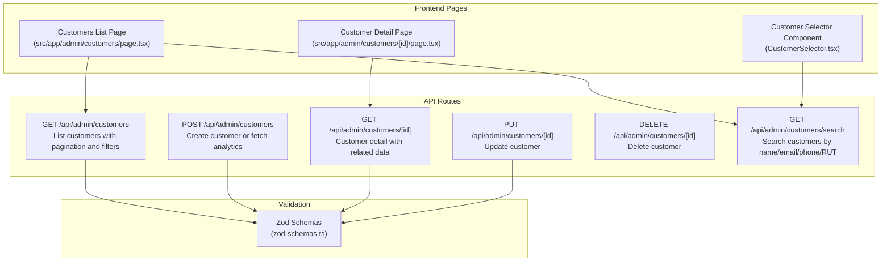
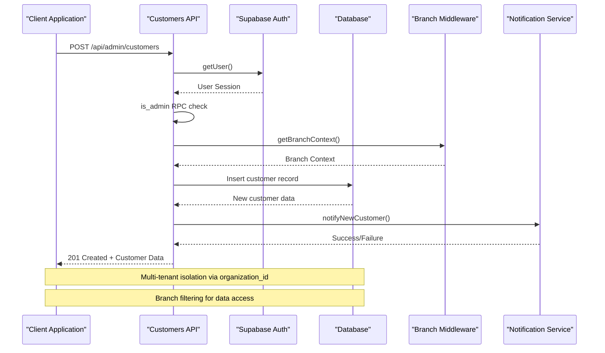
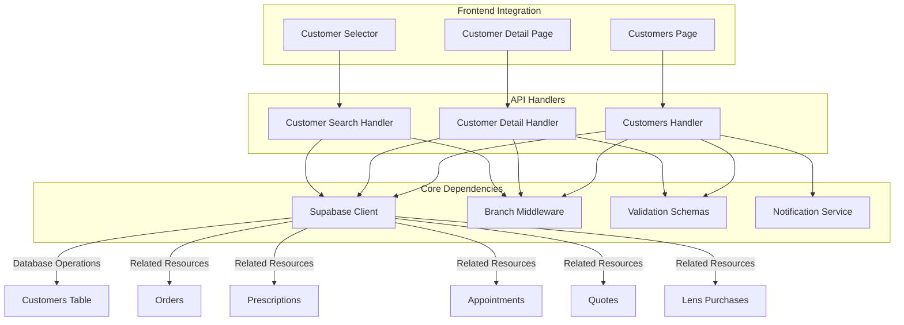

# Customer Management API

<cite>
**Referenced Files in This Document**
- [route.ts](file://src/app/api/admin/customers/route.ts)
- [route.ts](file://src/app/api/admin/customers/[id]/route.ts)
- [route.ts](file://src/app/api/admin/customers/search/route.ts)
- [page.tsx](file://src/app/admin/customers/page.tsx)
- [page.tsx](file://src/app/admin/customers/[id]/page.tsx)
- [CustomerSelector.tsx](file://src/components/admin/CreateWorkOrderForm/CustomerSelector.tsx)
- [zod-schemas.ts](file://src/lib/api/validation/zod-schemas.ts)
</cite>

## Table of Contents

1. [Introduction](#introduction)
2. [Project Structure](#project-structure)
3. [Core Components](#core-components)
4. [Architecture Overview](#architecture-overview)
5. [Detailed Component Analysis](#detailed-component-analysis)
6. [Dependency Analysis](#dependency-analysis)
7. [Performance Considerations](#performance-considerations)
8. [Troubleshooting Guide](#troubleshooting-guide)
9. [Conclusion](#conclusion)

## Introduction

This document provides comprehensive API documentation for Opttius customer management endpoints. It covers HTTP methods, URL patterns, request/response schemas for customer CRUD operations, search functionality, and related data retrieval. The documentation includes customer profile management, appointment history access, prescription data retrieval, and search capabilities. Authentication requirements, request formats for customer data, response structures with customer details, and pagination for search results are documented. Privacy considerations, search filtering options, and related resource access patterns are addressed.

## Project Structure

The customer management API is implemented using Next.js App Router with TypeScript. The API routes are located under `src/app/api/admin/customers/`, while the frontend pages are under `src/app/admin/customers/`. Validation schemas are centralized in `src/lib/api/validation/zod-schemas.ts`.



**Diagram sources**

- [route.ts](file://src/app/api/admin/customers/route.ts#L22-L223)
- [route.ts](file://src/app/api/admin/customers/[id]/route.ts#L7-L351)
- [route.ts](file://src/app/api/admin/customers/search/route.ts#L1-L429)
- [page.tsx](file://src/app/admin/customers/page.tsx#L94-L132)
- [page.tsx](file://src/app/admin/customers/[id]/page.tsx#L248-L265)
- [CustomerSelector.tsx](file://src/components/admin/CreateWorkOrderForm/CustomerSelector.tsx#L34-L64)
- [zod-schemas.ts](file://src/lib/api/validation/zod-schemas.ts#L387-L545)

**Section sources**

- [route.ts](file://src/app/api/admin/customers/route.ts#L1-L703)
- [route.ts](file://src/app/api/admin/customers/[id]/route.ts#L1-L651)
- [route.ts](file://src/app/api/admin/customers/search/route.ts#L1-L429)
- [page.tsx](file://src/app/admin/customers/page.tsx#L1-L516)
- [page.tsx](file://src/app/admin/customers/[id]/page.tsx#L1-L1994)
- [CustomerSelector.tsx](file://src/components/admin/CreateWorkOrderForm/CustomerSelector.tsx#L1-L139)
- [zod-schemas.ts](file://src/lib/api/validation/zod-schemas.ts#L1-L800)

## Core Components

The customer management API consists of five primary endpoints:

### Authentication and Authorization

- All endpoints require admin authentication via Supabase session
- Admin verification performed using RPC function `is_admin`
- Multi-tenancy enforced through organization_id and branch filtering
- Super admin privileges allow global access when branch context is "global"

### Request/Response Validation

- Centralized validation using Zod schemas
- Request body validation with structured error responses
- Query parameter validation for search and pagination
- Automatic sanitization and transformation of input data

### Data Access Patterns

- Branch-aware filtering for multi-tenant environments
- Organization isolation for customer data
- Related resource aggregation (orders, prescriptions, appointments, quotes)
- Service role usage for search operations requiring broader access

**Section sources**

- [route.ts](file://src/app/api/admin/customers/route.ts#L52-L82)
- [route.ts](file://src/app/api/admin/customers/[id]/route.ts#L14-L44)
- [zod-schemas.ts](file://src/lib/api/validation/zod-schemas.ts#L387-L545)

## Architecture Overview

The customer management system follows a layered architecture with clear separation of concerns:



**Diagram sources**

- [route.ts](file://src/app/api/admin/customers/route.ts#L226-L595)
- [route.ts](file://src/app/api/admin/customers/route.ts#L84-L126)

The architecture ensures:

- **Security**: Admin-only access with comprehensive validation
- **Scalability**: Branch-aware filtering prevents cross-tenant data leakage
- **Reliability**: Graceful degradation for related resource queries
- **Performance**: Optimized queries with appropriate indexing

## Detailed Component Analysis

### Customer Listing Endpoint

**URL Pattern**: `GET /api/admin/customers`
**Authentication**: Admin required
**Purpose**: Retrieve paginated customer listings with search and filtering capabilities

#### Request Parameters

| Parameter | Type    | Description                           | Default |
| --------- | ------- | ------------------------------------- | ------- |
| page      | number  | Page number (1-indexed)               | 1       |
| limit     | number  | Results per page (max 100)            | 20      |
| sort      | string  | Sort order: asc/desc                  | desc    |
| q         | string  | Search term (name, email, phone, RUT) | -       |
| search    | string  | Alternative search parameter          | -       |
| is_active | boolean | Filter by active status               | -       |
| branch_id | string  | Filter by specific branch             | -       |

#### Response Structure

```json
{
  "customers": [
    {
      "id": "string",
      "first_name": "string",
      "last_name": "string",
      "email": "string",
      "phone": "string",
      "rut": "string",
      "branch_id": "string",
      "is_active": true,
      "created_at": "datetime",
      "analytics": {
        "totalSpent": 0,
        "orderCount": 0,
        "lastOrderDate": "datetime",
        "avgOrderValue": 0,
        "segment": "string",
        "lifetimeValue": 0
      }
    }
  ],
  "pagination": {
    "page": 1,
    "limit": 20,
    "total": 0,
    "totalPages": 0
  }
}
```

#### Implementation Details

- Multi-field ILIKE search across first_name, last_name, email, phone, and rut
- Active/inactive status filtering
- Branch-aware filtering with organization isolation
- Analytics calculation from related orders
- Comprehensive error handling with detailed messages

**Section sources**

- [route.ts](file://src/app/api/admin/customers/route.ts#L22-L223)
- [route.ts](file://src/app/api/admin/customers/route.ts#L128-L215)
- [zod-schemas.ts](file://src/lib/api/validation/zod-schemas.ts#L362-L378)

### Customer Creation Endpoint

**URL Pattern**: `POST /api/admin/customers`
**Authentication**: Admin required
**Purpose**: Create new customers or fetch analytics summary

#### Request Body (Customer Creation)

| Field                    | Type        | Required    | Description                                           |
| ------------------------ | ----------- | ----------- | ----------------------------------------------------- |
| first_name               | string      | Conditional | Customer first name (required if last_name missing)   |
| last_name                | string      | Conditional | Customer last name (required if first_name missing)   |
| email                    | string      | Optional    | Customer email address                                |
| phone                    | string      | Optional    | Customer phone number                                 |
| rut                      | string      | Optional    | Chilean National Identification Number                |
| date_of_birth            | string/date | Optional    | Customer date of birth                                |
| gender                   | enum        | Optional    | Gender selection                                      |
| address_line_1           | string      | Optional    | Street address line 1                                 |
| address_line_2           | string      | Optional    | Street address line 2                                 |
| city                     | string      | Optional    | City                                                  |
| state                    | string      | Optional    | State/province                                        |
| postal_code              | string      | Optional    | ZIP/postal code                                       |
| country                  | string      | Optional    | Country (default: Chile)                              |
| medical_conditions       | array       | Optional    | Medical conditions list                               |
| allergies                | array       | Optional    | Allergies list                                        |
| medications              | array       | Optional    | Current medications                                   |
| medical_notes            | string      | Optional    | Additional medical notes                              |
| last_eye_exam_date       | string/date | Optional    | Last eye exam date                                    |
| next_eye_exam_due        | string/date | Optional    | Next eye exam due date                                |
| preferred_contact_method | enum        | Optional    | Preferred contact method                              |
| emergency_contact_name   | string      | Optional    | Emergency contact name                                |
| emergency_contact_phone  | string      | Optional    | Emergency contact phone                               |
| insurance_provider       | string      | Optional    | Insurance provider                                    |
| insurance_policy_number  | string      | Optional    | Insurance policy number                               |
| notes                    | string      | Optional    | General notes                                         |
| tags                     | array       | Optional    | Tags array                                            |
| is_active                | boolean     | Optional    | Active status (default: true)                         |
| branch_id                | string      | Conditional | Branch ID for customer (required in certain contexts) |

#### Response Structure (Customer Creation)

```json
{
  "success": true,
  "customer": {
    "id": "string",
    "first_name": "string",
    "last_name": "string",
    "email": "string",
    "branch_id": "string",
    "organization_id": "string",
    "created_by": "string",
    "created_at": "datetime"
  }
}
```

#### Response Structure (Analytics Summary)

```json
{
  "summary": {
    "totalCustomers": 0,
    "activeCustomers": 0,
    "newCustomersThisMonth": 0
  }
}
```

#### Implementation Details

- Tier validation for customer limits
- Duplicate detection by email and RUT within branch
- Branch context validation for super admin global access
- Real-time notifications for new customer creation
- Comprehensive input validation with detailed error reporting

**Section sources**

- [route.ts](file://src/app/api/admin/customers/route.ts#L226-L702)
- [route.ts](file://src/app/api/admin/customers/route.ts#L448-L595)
- [zod-schemas.ts](file://src/lib/api/validation/zod-schemas.ts#L387-L494)

### Customer Detail Endpoint

**URL Pattern**: `GET /api/admin/customers/[id]`
**Authentication**: Admin required
**Purpose**: Retrieve comprehensive customer information with related resources

#### Response Structure

```json
{
  "customer": {
    "id": "string",
    "first_name": "string",
    "last_name": "string",
    "email": "string",
    "phone": "string",
    "rut": "string",
    "branch_id": "string",
    "is_active": true,
    "created_at": "datetime",
    "orders": [...],
    "prescriptions": [...],
    "appointments": [...],
    "lensPurchases": [...],
    "quotes": [...],
    "analytics": {
      "totalSpent": 0,
      "orderCount": 0,
      "lastOrderDate": "datetime",
      "avgOrderValue": 0,
      "segment": "string",
      "lifetimeValue": 0,
      "orderStatusCounts": {},
      "favoriteProducts": [],
      "monthlySpending": []
    }
  }
}
```

#### Related Resource Retrieval

The endpoint aggregates multiple related resources:

- **Orders**: Customer purchase history with order items
- **Prescriptions**: Ophthalmology prescription records
- **Appointments**: Scheduled appointments and consultations
- **Lens Purchases**: Contact lens and eyeglass purchases
- **Quotes**: Quotation records for products/services

#### Analytics Calculation

- Total spent amount across all orders
- Average order value calculation
- Customer segmentation (new, first-time, regular, VIP, at-risk)
- Monthly spending trends (last 12 months)
- Favorite products based on purchase frequency

**Section sources**

- [route.ts](file://src/app/api/admin/customers/[id]/route.ts#L7-L351)
- [route.ts](file://src/app/api/admin/customers/[id]/route.ts#L116-L343)

### Customer Update Endpoint

**URL Pattern**: `PUT /api/admin/customers/[id]`
**Authentication**: Admin required
**Purpose**: Update existing customer information

#### Request Body

Same as customer creation with all fields optional for partial updates.

#### Response Structure

```json
{
  "success": true,
  "customer": {
    "id": "string",
    "first_name": "string",
    "last_name": "string",
    "email": "string",
    "updated_at": "datetime",
    "updated_by": "string"
  }
}
```

**Section sources**

- [route.ts](file://src/app/api/admin/customers/[id]/route.ts#L353-L526)

### Customer Deletion Endpoint

**URL Pattern**: `DELETE /api/admin/customers/[id]`
**Authentication**: Admin required
**Purpose**: Remove customer records from the system

#### Response Structure

```json
{
  "success": true,
  "message": "Customer deleted successfully"
}
```

**Section sources**

- [route.ts](file://src/app/api/admin/customers/[id]/route.ts#L528-L650)

### Customer Search Endpoint

**URL Pattern**: `GET /api/admin/customers/search`
**Authentication**: Admin required
**Purpose**: Quick search for customers during order creation and other workflows

#### Request Parameters

| Parameter | Type   | Description                         |
| --------- | ------ | ----------------------------------- |
| q         | string | Search query (minimum 2 characters) |
| branch_id | string | Filter by specific branch           |

#### Response Structure

```json
{
  "customers": [
    {
      "id": "string",
      "first_name": "string",
      "last_name": "string",
      "email": "string",
      "phone": "string",
      "rut": "string"
    }
  ]
}
```

#### Search Logic

The search performs concurrent queries across:

1. Name matching (first_name OR last_name)
2. Email pattern matching
3. Phone number pattern matching
4. RUT-based lookup using specialized function

Results are deduplicated and limited to 20 entries maximum.

**Section sources**

- [route.ts](file://src/app/api/admin/customers/search/route.ts#L1-L429)
- [CustomerSelector.tsx](file://src/components/admin/CreateWorkOrderForm/CustomerSelector.tsx#L34-L64)

## Dependency Analysis



**Diagram sources**

- [route.ts](file://src/app/api/admin/customers/route.ts#L1-L20)
- [route.ts](file://src/app/api/admin/customers/[id]/route.ts#L1-L5)
- [route.ts](file://src/app/api/admin/customers/search/route.ts#L1-L10)
- [page.tsx](file://src/app/admin/customers/page.tsx#L1-L45)
- [page.tsx](file://src/app/admin/customers/[id]/page.tsx#L1-L45)
- [CustomerSelector.tsx](file://src/components/admin/CreateWorkOrderForm/CustomerSelector.tsx#L1-L8)

### Key Dependencies

- **Supabase Authentication**: Session-based authentication with admin verification
- **Branch Context**: Multi-tenant filtering based on organization and branch
- **Validation Layer**: Centralized Zod schemas for consistent data validation
- **Notification System**: Asynchronous notifications for customer events
- **Rate Limiting**: Protection against abuse for modification endpoints

### Data Flow Patterns

1. **Request Flow**: Client → API Handler → Authentication → Validation → Database
2. **Response Flow**: Database → Data Processing → Branch Filtering → Response
3. **Search Flow**: Query Parsing → Concurrent Searches → Result Deduplication → Response

**Section sources**

- [route.ts](file://src/app/api/admin/customers/route.ts#L1-L21)
- [route.ts](file://src/app/api/admin/customers/[id]/route.ts#L1-L6)
- [route.ts](file://src/app/api/admin/customers/search/route.ts#L1-L15)

## Performance Considerations

The customer management API implements several performance optimizations:

### Query Optimization

- **Selective Field Retrieval**: Only necessary fields are fetched for list operations
- **Index Usage**: Strategic use of indexes on frequently queried fields (email, phone, rut)
- **Pagination**: Default limit of 20 with maximum 100 per page
- **Concurrent Queries**: Search operations use Promise.all for parallel execution

### Caching Strategies

- **Client-Side Caching**: Frontend pages implement caching for reduced API calls
- **Search Debouncing**: 300ms debounce for search input to minimize requests
- **Result Deduplication**: Automatic removal of duplicate search results

### Scalability Features

- **Branch Filtering**: Prevents unnecessary data scanning across organizations
- **Service Role Usage**: Separate database connections for different operation types
- **Graceful Degradation**: Related resource queries don't fail the main request

### Monitoring and Logging

- **Structured Logging**: Comprehensive logging for debugging and monitoring
- **Error Tracking**: Detailed error responses with context information
- **Performance Metrics**: Timing information for slow operations

## Troubleshooting Guide

### Common Authentication Issues

**Problem**: "Unauthorized" responses from all endpoints
**Solution**: Verify admin user session and proper authentication headers
**Debug Steps**:

1. Check browser developer tools for authentication cookies
2. Verify Supabase session validity
3. Confirm admin role assignment

### Authorization Failures

**Problem**: "Admin access required" responses
**Solution**: Ensure user has proper admin permissions
**Debug Steps**:

1. Verify `is_admin` RPC function returns true
2. Check organization membership
3. Confirm branch access permissions

### Data Access Issues

**Problem**: Empty results despite existing data
**Solution**: Verify branch context and organization filtering
**Debug Steps**:

1. Check `x-branch-id` header value
2. Verify organization_id association
3. Confirm branch_id matches expected values

### Validation Errors

**Problem**: "Validation failed" responses with field-specific errors
**Solution**: Review request payload against validation schemas
**Common Issues**:

- Invalid email format
- RUT format validation failures
- Missing required fields
- Exceeding field length limits

### Search Problems

**Problem**: Incomplete or no search results
**Solution**: Adjust search query and verify search parameters
**Debug Steps**:

1. Ensure search query is at least 2 characters
2. Check branch context for search scope
3. Verify search terms match customer data format

**Section sources**

- [route.ts](file://src/app/api/admin/customers/route.ts#L58-L81)
- [route.ts](file://src/app/api/admin/customers/[id]/route.ts#L20-L43)
- [route.ts](file://src/app/api/admin/customers/search/route.ts#L376-L385)

## Conclusion

The Opttius customer management API provides a comprehensive, secure, and scalable solution for customer data management in multi-tenant optical retail environments. The implementation emphasizes:

- **Security**: Admin-only access with comprehensive validation and multi-tenant isolation
- **Usability**: Intuitive APIs with clear request/response patterns and extensive validation
- **Performance**: Optimized queries, concurrent operations, and graceful degradation
- **Maintainability**: Centralized validation, modular architecture, and comprehensive error handling

The API supports all essential customer management operations including CRUD operations, advanced search capabilities, related resource aggregation, and analytics computation. The implementation follows modern development practices with TypeScript, Zod validation, and structured error handling, ensuring reliability and maintainability in production environments.
