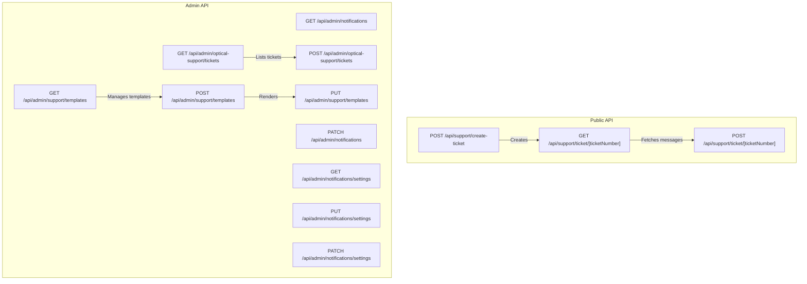
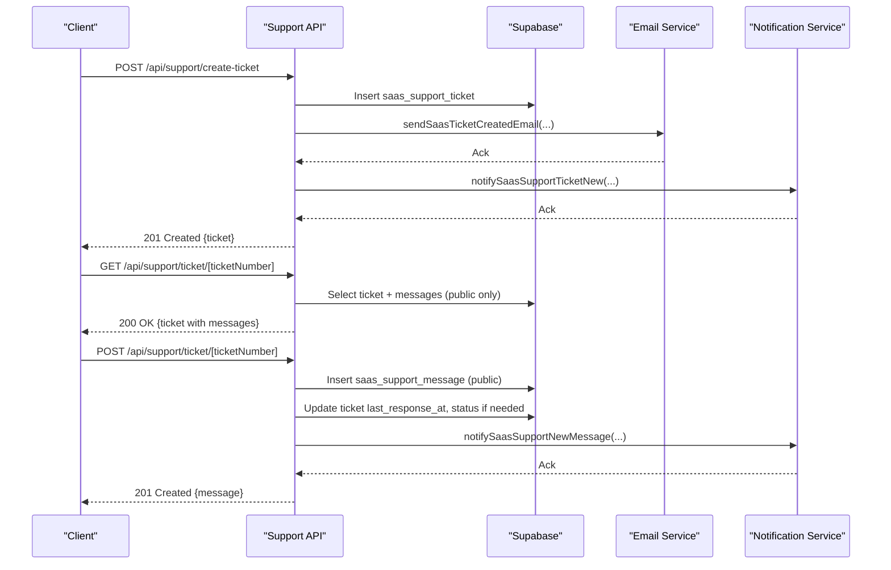
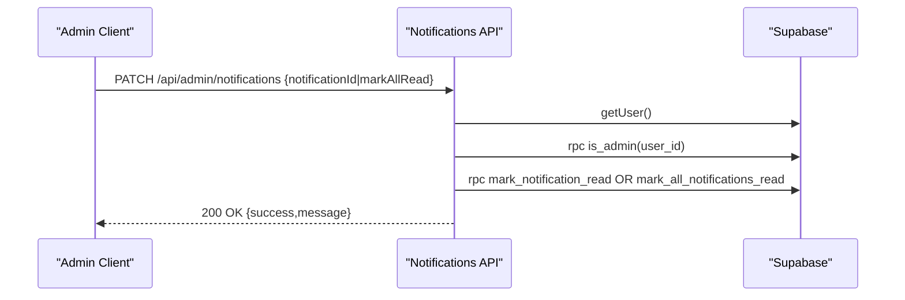
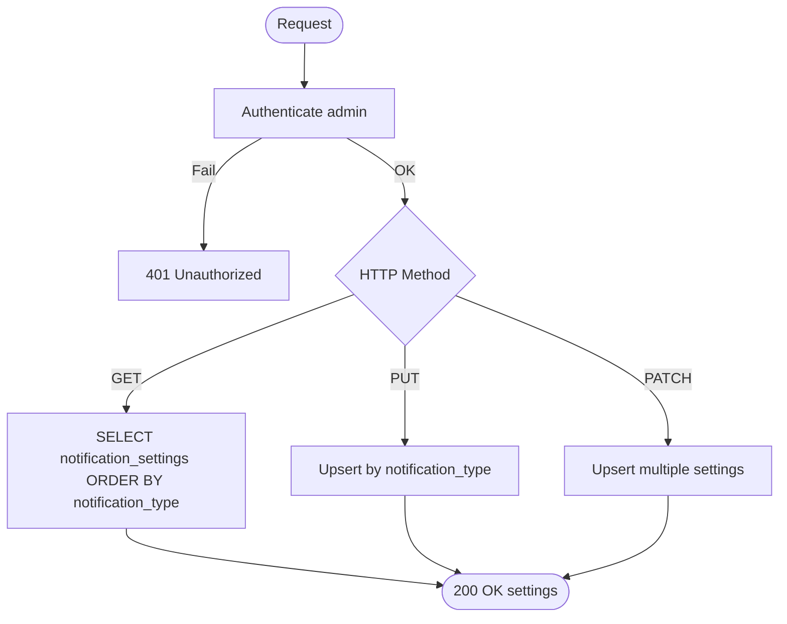
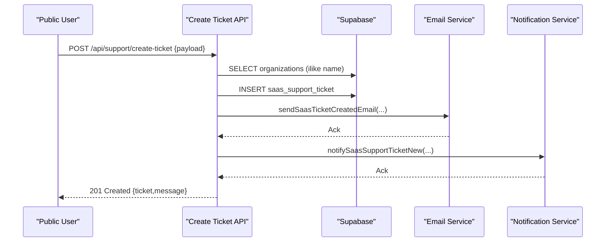
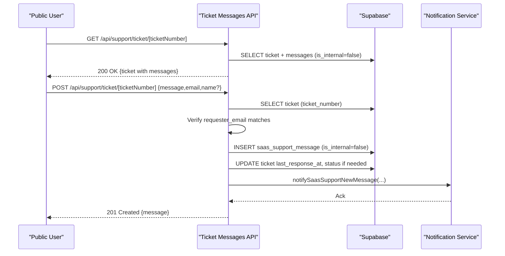
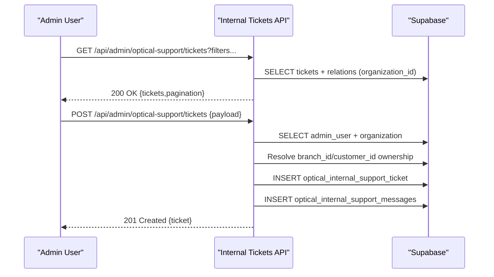
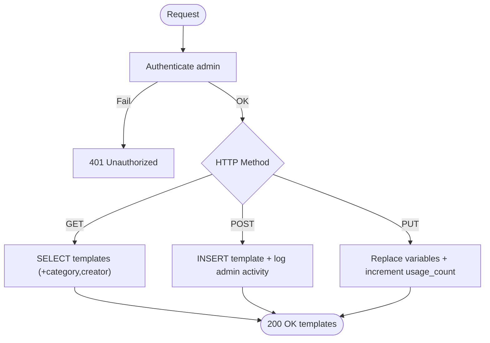
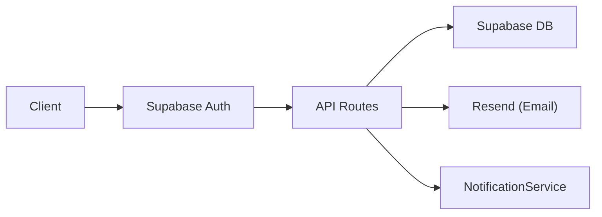

# Notification & Support API

<cite>
**Referenced Files in This Document**
- [route.ts](file://src/app/api/admin/notifications/route.ts)
- [route.ts](file://src/app/api/admin/notifications/settings/route.ts)
- [route.ts](file://src/app/api/support/create-ticket/route.ts)
- [route.ts](file://src/app/api/support/ticket/[ticketNumber]/route.ts)
- [route.ts](file://src/app/api/admin/optical-support/tickets/route.ts)
- [route.ts](file://src/app/api/admin/support/templates/route.ts)
- [zod-schemas.ts](file://src/lib/api/validation/zod-schemas.ts)
</cite>

## Table of Contents

1. [Introduction](#introduction)
2. [Project Structure](#project-structure)
3. [Core Components](#core-components)
4. [Architecture Overview](#architecture-overview)
5. [Detailed Component Analysis](#detailed-component-analysis)
6. [Dependency Analysis](#dependency-analysis)
7. [Performance Considerations](#performance-considerations)
8. [Troubleshooting Guide](#troubleshooting-guide)
9. [Conclusion](#conclusion)

## Introduction

This document describes the Notification and Support APIs for Opttius, covering:

- Notification settings management for administrators
- Public SaaS support ticket creation and message handling
- Internal optical support ticket management for admins
- Support template configuration and rendering
- Authentication requirements, request/response schemas, and message threading patterns
- Workflow automation and integration points for customer service

## Project Structure

The API surface is organized under Next.js App Router conventions:

- Admin notification endpoints: `/api/admin/notifications/*`
- Admin notification settings: `/api/admin/notifications/settings`
- Public SaaS support: `/api/support/create-ticket`, `/api/support/ticket/[ticketNumber]`
- Internal optical support: `/api/admin/optical-support/tickets`
- Support templates: `/api/admin/support/templates`

**Diagram sources**

- [route.ts](file://src/app/api/support/create-ticket/route.ts#L1-L143)
- [route.ts](file://src/app/api/support/ticket/[ticketNumber]/route.ts#L1-L197)
- [route.ts](file://src/app/api/admin/notifications/route.ts#L1-L165)
- [route.ts](file://src/app/api/admin/notifications/settings/route.ts#L1-L243)
- [route.ts](file://src/app/api/admin/optical-support/tickets/route.ts#L1-L343)
- [route.ts](file://src/app/api/admin/support/templates/route.ts#L1-L235)

**Section sources**

- [route.ts](file://src/app/api/support/create-ticket/route.ts#L1-L143)
- [route.ts](file://src/app/api/support/ticket/[ticketNumber]/route.ts#L1-L197)
- [route.ts](file://src/app/api/admin/notifications/route.ts#L1-L165)
- [route.ts](file://src/app/api/admin/notifications/settings/route.ts#L1-L243)
- [route.ts](file://src/app/api/admin/optical-support/tickets/route.ts#L1-L343)
- [route.ts](file://src/app/api/admin/support/templates/route.ts#L1-L235)

## Core Components

- Admin Notifications: Retrieve notifications and mark as read/unread
- Notification Settings: CRUD for notification preferences per notification type
- Public SaaS Support: Create tickets and add messages without authentication
- Internal Optical Support: Admin-only ticket lifecycle with filtering and assignment
- Support Templates: Manage reusable templates with variable substitution

**Section sources**

- [route.ts](file://src/app/api/admin/notifications/route.ts#L1-L165)
- [route.ts](file://src/app/api/admin/notifications/settings/route.ts#L1-L243)
- [route.ts](file://src/app/api/support/create-ticket/route.ts#L1-L143)
- [route.ts](file://src/app/api/support/ticket/[ticketNumber]/route.ts#L1-L197)
- [route.ts](file://src/app/api/admin/optical-support/tickets/route.ts#L1-L343)
- [route.ts](file://src/app/api/admin/support/templates/route.ts#L1-L235)

## Architecture Overview

The APIs integrate with Supabase for authentication, authorization, and persistence. Validation is enforced via Zod schemas. Some operations trigger non-blocking notifications and email dispatch.

**Diagram sources**

- [route.ts](file://src/app/api/support/create-ticket/route.ts#L1-L143)
- [route.ts](file://src/app/api/support/ticket/[ticketNumber]/route.ts#L1-L197)

## Detailed Component Analysis

### Admin Notifications

- Purpose: Fetch admin notifications and mark as read/unread
- Authentication: Requires authenticated admin user
- Endpoints:
  - GET /api/admin/notifications
    - Returns notifications list, counts, and unread count
  - PATCH /api/admin/notifications
    - Marks a specific notification or all notifications as read

**Diagram sources**

- [route.ts](file://src/app/api/admin/notifications/route.ts#L100-L165)

**Section sources**

- [route.ts](file://src/app/api/admin/notifications/route.ts#L1-L165)

### Notification Settings

- Purpose: Configure notification preferences per notification type
- Authentication: Admin required
- Endpoints:
  - GET /api/admin/notifications/settings
    - Lists all settings ordered by type
  - PUT /api/admin/notifications/settings
    - Upserts a single setting by notification_type
  - PATCH /api/admin/notifications/settings
    - Bulk upsert settings via array of updates

**Diagram sources**

- [route.ts](file://src/app/api/admin/notifications/settings/route.ts#L1-L243)

**Section sources**

- [route.ts](file://src/app/api/admin/notifications/settings/route.ts#L1-L243)

### Public SaaS Support: Ticket Creation

- Purpose: Allow public users to create SaaS support tickets without authentication
- Authentication: Not required
- Endpoint: POST /api/support/create-ticket
- Request body schema validated via Zod
- Behavior:
  - Optionally resolves organization by name
  - Inserts ticket with status open and metadata flag is_public=true
  - Sends confirmation email (non-blocking)
  - Triggers internal push notification for root/dev

**Diagram sources**

- [route.ts](file://src/app/api/support/create-ticket/route.ts#L1-L143)

**Section sources**

- [route.ts](file://src/app/api/support/create-ticket/route.ts#L1-L143)
- [zod-schemas.ts](file://src/lib/api/validation/zod-schemas.ts#L1-L800)

### Public SaaS Support: Ticket Messages

- Purpose: Allow the original requester to add messages to a public ticket
- Authentication: Not required, but requester email must match ticket’s requester_email
- Endpoints:
  - GET /api/support/ticket/[ticketNumber]
    - Returns ticket details and public messages only
  - POST /api/support/ticket/[ticketNumber]
    - Adds a message to the ticket
    - Updates last_response_at
    - Transitions status from resolved/closed to waiting_customer if needed
    - Triggers internal push notification for root/dev

**Diagram sources**

- [route.ts](file://src/app/api/support/ticket/[ticketNumber]/route.ts#L1-L197)

**Section sources**

- [route.ts](file://src/app/api/support/ticket/[ticketNumber]/route.ts#L1-L197)

### Internal Optical Support: Tickets

- Purpose: Admin-only system for managing internal optical support tickets
- Authentication: Admin required; enforces organization and branch ownership
- Endpoints:
  - GET /api/admin/optical-support/tickets
    - Filters: branch_id, customer_id, status, priority, category, assigned_to, search, pagination, sort
    - Returns tickets with related entities (customer, assigned_to, created_by, branch, related records)
  - POST /api/admin/optical-support/tickets
    - Creates a ticket with optional customer resolution and branch context
    - Inserts initial message tied to the ticket

**Diagram sources**

- [route.ts](file://src/app/api/admin/optical-support/tickets/route.ts#L1-L343)

**Section sources**

- [route.ts](file://src/app/api/admin/optical-support/tickets/route.ts#L1-L343)

### Support Templates

- Purpose: Manage reusable support templates with variable substitution
- Authentication: Admin required
- Endpoints:
  - GET /api/admin/support/templates?category_id&active_only
    - Lists templates with category and creator info, ordered by usage
  - POST /api/admin/support/templates
    - Creates a new template and logs admin activity
  - PUT /api/admin/support/templates
    - Renders a template by replacing {{variables}} and increments usage count

**Diagram sources**

- [route.ts](file://src/app/api/admin/support/templates/route.ts#L1-L235)

**Section sources**

- [route.ts](file://src/app/api/admin/support/templates/route.ts#L1-L235)

## Dependency Analysis

- Authentication and authorization:
  - Admin checks via RPC is_admin
  - Supabase auth.getUser for session validation
- Data access:
  - Service role client for privileged operations
  - Standard client for admin-facing endpoints requiring row-level security
- Validation:
  - Zod schemas for request bodies
- External integrations:
  - Email delivery via Resend (non-blocking)
  - Internal notifications via NotificationService

**Diagram sources**

- [route.ts](file://src/app/api/support/create-ticket/route.ts#L1-L143)
- [route.ts](file://src/app/api/support/ticket/[ticketNumber]/route.ts#L1-L197)
- [route.ts](file://src/app/api/admin/optical-support/tickets/route.ts#L1-L343)
- [route.ts](file://src/app/api/admin/support/templates/route.ts#L1-L235)

**Section sources**

- [route.ts](file://src/app/api/support/create-ticket/route.ts#L1-L143)
- [route.ts](file://src/app/api/support/ticket/[ticketNumber]/route.ts#L1-L197)
- [route.ts](file://src/app/api/admin/optical-support/tickets/route.ts#L1-L343)
- [route.ts](file://src/app/api/admin/support/templates/route.ts#L1-L235)

## Performance Considerations

- Pagination and sorting are supported for ticket listing to avoid large payloads
- Non-blocking operations (email and push notifications) prevent request latency
- Use filters to reduce dataset sizes for internal tickets
- Prefer selective column queries to minimize payload size

## Troubleshooting Guide

- Authentication failures:
  - 401 Unauthorized when user is not authenticated
  - 403 Forbidden when user lacks admin role or organization context
- Table not found errors:
  - Notification settings endpoint returns a structured error if the settings table is missing
- Validation errors:
  - Requests failing Zod validation return 400 with error details
- Email delivery:
  - Email sending is non-blocking; failures are logged but do not fail the request
- Internal ticket creation:
  - Ensure organization and branch ownership constraints are met; otherwise, requests are rejected

**Section sources**

- [route.ts](file://src/app/api/admin/notifications/settings/route.ts#L38-L61)
- [route.ts](file://src/app/api/admin/notifications/route.ts#L100-L165)
- [route.ts](file://src/app/api/support/create-ticket/route.ts#L68-L74)
- [route.ts](file://src/app/api/support/ticket/[ticketNumber]/route.ts#L97-L120)
- [route.ts](file://src/app/api/admin/optical-support/tickets/route.ts#L217-L231)

## Conclusion

The Notification and Support APIs provide a complete foundation for:

- Admin-driven notification management and configuration
- Public SaaS support with secure message handling and automation
- Internal optical support with robust filtering, assignment, and templating
  Adhering to the documented authentication, request/response schemas, and message threading patterns ensures reliable operation and maintainable integrations.
