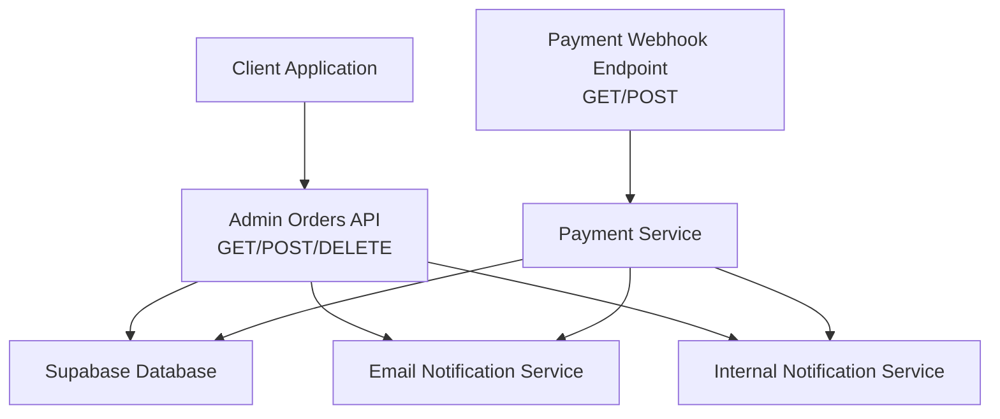
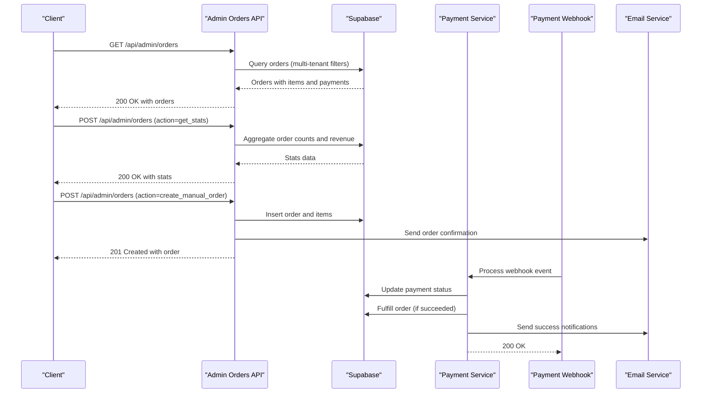
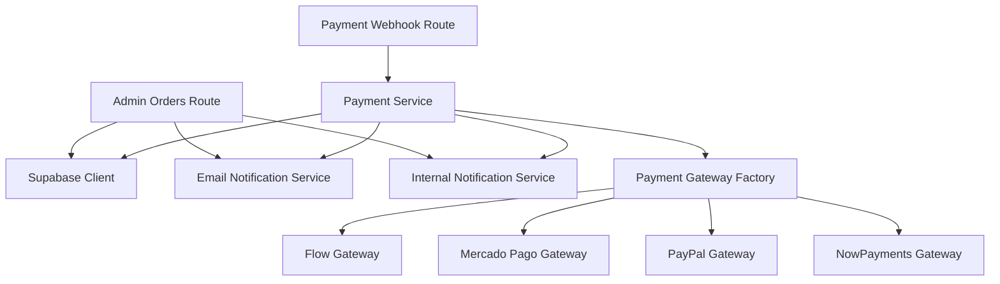

# Order Processing API

<cite>
**Referenced Files in This Document**
- [route.ts](file://src/app/api/admin/orders/route.ts)
- [payment-service.ts](file://src/lib/payments/services/payment-service.ts)
- [interfaces.ts](file://src/lib/payments/interfaces.ts)
- [payment.ts](file://src/types/payment.ts)
- [mercadopago.ts](file://src/lib/mercadopago.ts)
- [route.ts](file://src/app/api/webhooks/mercadopago/route.ts)
- [orders.test.ts](file://src/__tests__/integration/api/orders.test.ts)
- [TESTING_ORDERS_API_VALIDATION.md](file://docs/TESTING_ORDERS_API_VALIDATION.md)
</cite>

## Table of Contents

1. [Introduction](#introduction)
2. [Project Structure](#project-structure)
3. [Core Components](#core-components)
4. [Architecture Overview](#architecture-overview)
5. [Detailed Component Analysis](#detailed-component-analysis)
6. [Dependency Analysis](#dependency-analysis)
7. [Performance Considerations](#performance-considerations)
8. [Troubleshooting Guide](#troubleshooting-guide)
9. [Conclusion](#conclusion)

## Introduction

This document provides comprehensive API documentation for Opttius order processing endpoints. It covers HTTP methods, URL patterns, request/response schemas, authentication requirements, order lifecycle management, payment reconciliation, customer notification workflows, and audit trail considerations. The focus is on the administrative order management API and its integration with payment processing systems.

## Project Structure

The order processing API is implemented as a Next.js App Router API endpoint under the administrative namespace. Payment reconciliation and notification workflows integrate with payment gateway webhooks and internal services.

**Diagram sources**

- [route.ts](file://src/app/api/admin/orders/route.ts#L1-L748)
- [route.ts](file://src/app/api/webhooks/mercadopago/route.ts#L1-L372)
- [payment-service.ts](file://src/lib/payments/services/payment-service.ts#L1-L494)

**Section sources**

- [route.ts](file://src/app/api/admin/orders/route.ts#L1-L748)
- [route.ts](file://src/app/api/webhooks/mercadopago/route.ts#L1-L372)

## Core Components

- Admin Orders API: Provides listing, creation, and deletion of orders with multi-tenant filtering and rate limiting.
- Payment Service: Manages payment records, webhook processing, order fulfillment, and organization subscription updates.
- Payment Gateway Interfaces: Abstraction for payment providers (Flow, Mercado Pago, PayPal, NowPayments).
- Webhook Endpoints: Receive and validate payment provider notifications to reconcile payments and update order status.

Key capabilities:

- Multi-tenant order filtering by organization and branch
- Order statistics aggregation (counts, revenue, recent orders)
- Manual order creation with optional items
- Payment reconciliation via webhooks
- Order fulfillment and notification dispatch

**Section sources**

- [route.ts](file://src/app/api/admin/orders/route.ts#L10-L204)
- [payment-service.ts](file://src/lib/payments/services/payment-service.ts#L19-L494)
- [interfaces.ts](file://src/lib/payments/interfaces.ts#L10-L42)

## Architecture Overview

The order processing system integrates administrative order operations with payment reconciliation and notifications.

**Diagram sources**

- [route.ts](file://src/app/api/admin/orders/route.ts#L10-L204)
- [route.ts](file://src/app/api/admin/orders/route.ts#L207-L667)
- [payment-service.ts](file://src/lib/payments/services/payment-service.ts#L115-L185)
- [route.ts](file://src/app/api/webhooks/mercadopago/route.ts#L15-L372)

## Detailed Component Analysis

### Admin Orders API

- Purpose: Administrative order management with multi-tenancy, filtering, statistics, and manual order creation.
- Authentication: Requires admin role verification via RPC function.
- Rate Limiting: Applied to modification actions.
- Multi-tenancy: Filters orders by organization and optionally branch; super admins can filter by branch or organization.

Endpoints:

- GET /api/admin/orders
  - Query parameters: status, payment_status, date_from, date_to, limit, offset
  - Response: orders array with embedded order_items and order_payments, plus pagination metadata
- POST /api/admin/orders
  - Actions:
    - get_stats: Returns order counts by status, total revenue for current month, and recent orders
    - create_manual_order: Creates an order with optional items and triggers notifications
- DELETE /api/admin/orders
  - Deletes all orders and related items (testing cleanup)

Request/Response schemas:

- Request body (POST):
  - action: "get_stats" | "create_manual_order"
  - For create_manual_order: orderData (email, total_amount, status, payment_status, subtotal, notes, shipping details, items[])
- Response body (GET):
  - success: boolean
  - orders: array of orders with nested order_items and order_payments
  - total, offset, limit
- Response body (POST):
  - success: boolean
  - stats: { orderCounts, totalRevenue, recentOrders[] }
  - order: created order object
- Response body (DELETE):
  - success: boolean
  - message: string

Error handling:

- Unauthorized (401), Admin access required (403), Bad request (400), Rate limit exceeded (429), Internal server error (500)

**Section sources**

- [route.ts](file://src/app/api/admin/orders/route.ts#L10-L204)
- [route.ts](file://src/app/api/admin/orders/route.ts#L207-L667)
- [route.ts](file://src/app/api/admin/orders/route.ts#L671-L748)
- [orders.test.ts](file://src/__tests__/integration/api/orders.test.ts#L86-L197)
- [TESTING_ORDERS_API_VALIDATION.md](file://docs/TESTING_ORDERS_API_VALIDATION.md#L247-L297)

### Payment Reconciliation and Notification Workflows

- Webhook Endpoint: Validates signatures and processes payment events from providers.
- Payment Service: Updates payment records, fulfills orders, applies organization subscription changes, and sends notifications.
- Email Notifications: Dispatches order confirmation and subscription success notifications.

Endpoints:

- GET/POST /api/webhooks/mercadopago
  - Validates signature (when configured)
  - Supports subscription/preapproval topics and payment topics
  - Records webhook events for idempotency

Request/Response:

- Request: Query parameters (topic, id) or JSON body with data.id
- Response: 200 OK with "received": true or error details

Processing logic:

- Signature validation (HMAC) when secret is configured
- Idempotent event recording to prevent duplicate processing
- Payment status updates and order fulfillment on success
- Organization subscription tier and period updates
- Non-blocking email notifications

**Section sources**

- [route.ts](file://src/app/api/webhooks/mercadopago/route.ts#L1-L372)
- [payment-service.ts](file://src/lib/payments/services/payment-service.ts#L115-L185)
- [payment-service.ts](file://src/lib/payments/services/payment-service.ts#L272-L293)
- [payment-service.ts](file://src/lib/payments/services/payment-service.ts#L299-L445)

### Payment Gateway Abstractions

- IPaymentGateway: Defines contract for creating payment intents, processing webhooks, and mapping statuses.
- PaymentIntentResponse: Standardized response containing clientSecret, preferenceId, approvalUrl, invoiceUrl, paymentId, gatewayPaymentIntentId, and status.
- Supported gateways: flow, mercadopago, paypal, nowpayments.

Integration pattern:

- PaymentService creates payment records linked to orders
- Webhook endpoints normalize provider-specific events into standardized WebhookEvent
- PaymentService updates payment status and triggers downstream actions (order fulfillment, subscription updates)

**Section sources**

- [interfaces.ts](file://src/lib/payments/interfaces.ts#L10-L42)
- [payment.ts](file://src/types/payment.ts#L12-L48)
- [mercadopago.ts](file://src/lib/mercadopago.ts#L1-L21)

## Dependency Analysis

The order processing API depends on Supabase for persistence, email services for customer notifications, and payment gateway integrations for reconciliation.

**Diagram sources**

- [route.ts](file://src/app/api/admin/orders/route.ts#L1-L748)
- [route.ts](file://src/app/api/webhooks/mercadopago/route.ts#L1-L372)
- [payment-service.ts](file://src/lib/payments/services/payment-service.ts#L1-L494)
- [interfaces.ts](file://src/lib/payments/interfaces.ts#L19-L38)

**Section sources**

- [route.ts](file://src/app/api/admin/orders/route.ts#L1-L748)
- [payment-service.ts](file://src/lib/payments/services/payment-service.ts#L1-L494)
- [interfaces.ts](file://src/lib/payments/interfaces.ts#L19-L38)

## Performance Considerations

- Pagination: GET /api/admin/orders supports limit and offset to control payload size.
- Filtering: Use status, payment_status, and date range parameters to reduce result sets.
- Multi-tenancy: Queries are scoped to organization and branch to minimize cross-tenant scans.
- Asynchronous notifications: Email and internal notifications are dispatched asynchronously to avoid blocking API responses.
- Idempotent webhook processing: Recording events prevents duplicate processing overhead.

[No sources needed since this section provides general guidance]

## Troubleshooting Guide

Common issues and resolutions:

- Authentication failures (401): Verify admin role and session token.
- Access denied (403): Ensure user belongs to the correct organization or has super admin privileges.
- Invalid request body (400): Confirm JSON structure matches expected schemas for POST actions.
- Rate limit exceeded (429): Reduce request frequency or adjust rate limit configuration.
- Payment reconciliation delays: Check webhook endpoint logs and signature validation settings.
- Duplicate webhook processing: Inspect webhook_events table for processed flags.

Audit trail requirements:

- Webhook events are recorded with gateway, gateway_event_id, event_type, and processed status.
- Payment updates include timestamps and metadata for traceability.
- Order modifications maintain organization and branch scoping for compliance.

**Section sources**

- [route.ts](file://src/app/api/admin/orders/route.ts#L198-L203)
- [route.ts](file://src/app/api/webhooks/mercadopago/route.ts#L233-L245)
- [payment-service.ts](file://src/lib/payments/services/payment-service.ts#L207-L269)

## Conclusion

The Opttius order processing API provides robust administrative order management with strong multi-tenancy controls, comprehensive payment reconciliation via webhooks, and integrated notification workflows. The modular design supports extensible payment gateway integrations while maintaining clear audit trails and performance characteristics suitable for production environments.
