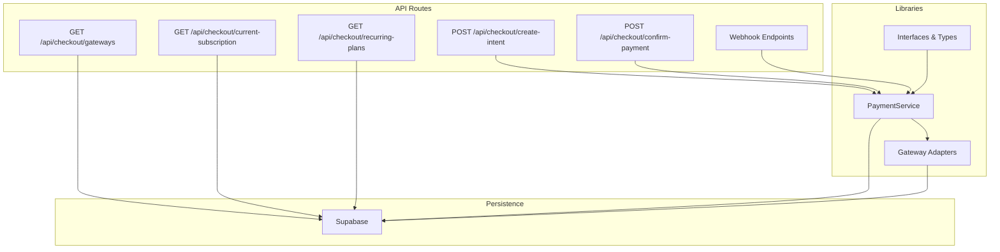
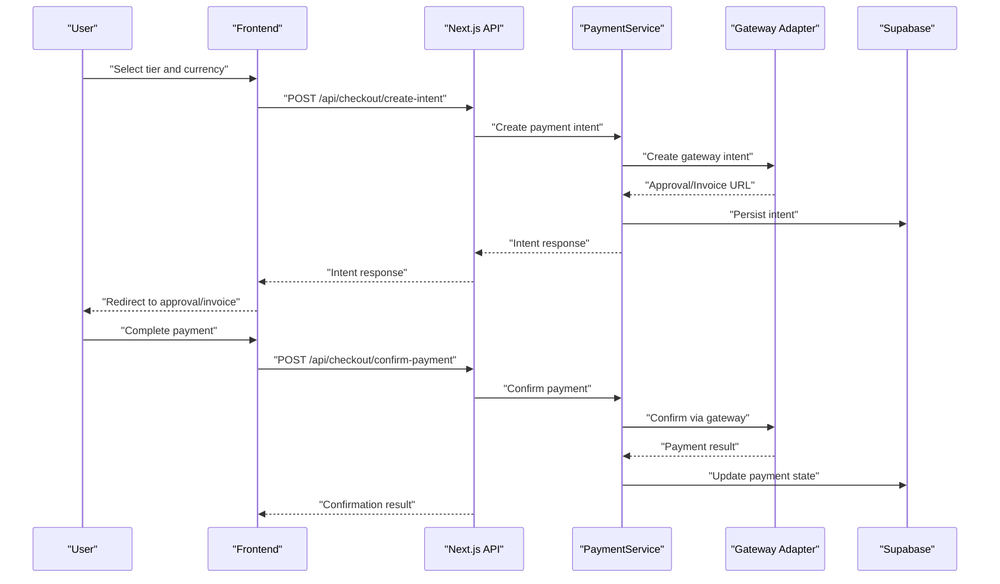
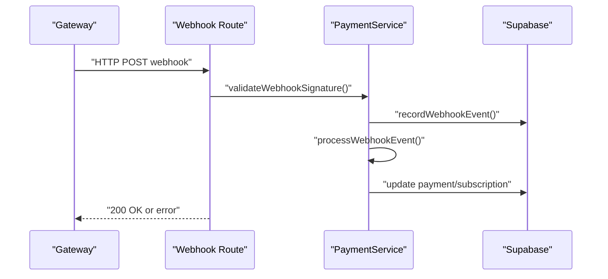
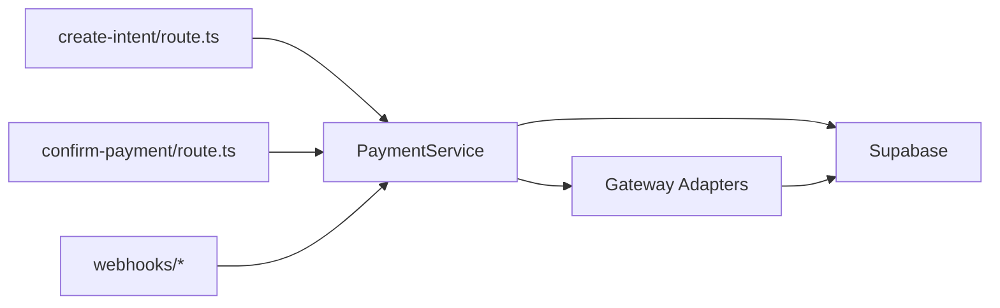

# Payment Processing API

<cite>
**Referenced Files in This Document**
- [route.ts](file://src/app/api/checkout/gateways/route.ts)
- [route.ts](file://src/app/api/checkout/create-intent/route.ts)
- [route.ts](file://src/app/api/checkout/confirm-payment/route.ts)
- [route.ts](file://src/app/api/checkout/current-subscription/route.ts)
- [route.ts](file://src/app/api/checkout/recurring-plans/route.ts)
- [route.ts](file://src/app/api/admin/billing/subscription-status/route.ts)
- [route.ts](file://src/app/api/webhooks/flow/route.ts)
- [route.ts](file://src/app/api/webhooks/mercadopago/route.ts)
- [route.ts](file://src/app/api/webhooks/nowpayments/route.ts)
- [route.ts](file://src/app/api/webhooks/paypal/route.ts)
- [payment-service.ts](file://src/lib/payments/services/payment-service.ts)
- [gateway.ts](file://src/lib/payments/flow/gateway.ts)
- [interfaces.ts](file://src/lib/payments/interfaces.ts)
- [index.ts](file://src/lib/payments/index.ts)
- [payment.ts](file://src/types/payment.ts)
- [supabase.ts](file://src/lib/supabase.ts)
- [PLAN_CHECKOUT_PAGINA_Y_BRICKS.md](file://docs/PLAN_CHECKOUT_PAGINA_Y_BRICKS.md)
- [CRYPTO_PAYMENTS_IMPLEMENTATION_SUMMARY.md](file://docs/CRYPTO_PAYMENTS_IMPLEMENTATION_SUMMARY.md)
- [flow.test.ts](file://src/__tests__/integration/api/webhooks/flow.test.ts)
- [nowpayments.test.ts](file://src/__tests__/integration/api/webhooks/nowpayments.test.ts)
</cite>

## Table of Contents

1. [Introduction](#introduction)
2. [Project Structure](#project-structure)
3. [Core Components](#core-components)
4. [Architecture Overview](#architecture-overview)
5. [Detailed Component Analysis](#detailed-component-analysis)
6. [Dependency Analysis](#dependency-analysis)
7. [Performance Considerations](#performance-considerations)
8. [Troubleshooting Guide](#troubleshooting-guide)
9. [Conclusion](#conclusion)
10. [Appendices](#appendices)

## Introduction

This document describes the Opttius payment processing API, covering HTTP endpoints for payment intents, checkout flows, recurring plans, subscription management, and gateway integrations. It also documents webhook handling, authentication requirements, request/response schemas, and security considerations including PCI compliance and multi-gateway support patterns.

## Project Structure

The payment system is organized around Next.js App Router API routes under `/src/app/api/` and shared payment logic under `/src/lib/payments/`. Gateway-specific integrations live in dedicated modules, while Supabase is used for persistence and authentication.

**Diagram sources**

- [route.ts](file://src/app/api/checkout/gateways/route.ts#L1-L25)
- [route.ts](file://src/app/api/checkout/create-intent/route.ts#L76-L111)
- [payment-service.ts](file://src/lib/payments/services/payment-service.ts#L187-L228)
- [gateway.ts](file://src/lib/payments/flow/gateway.ts#L67-L114)
- [interfaces.ts](file://src/lib/payments/interfaces.ts#L1-L200)
- [supabase.ts](file://src/lib/supabase.ts#L1-L36)

**Section sources**

- [route.ts](file://src/app/api/checkout/gateways/route.ts#L1-L25)
- [route.ts](file://src/app/api/checkout/create-intent/route.ts#L76-L111)
- [payment-service.ts](file://src/lib/payments/services/payment-service.ts#L187-L228)
- [gateway.ts](file://src/lib/payments/flow/gateway.ts#L67-L114)
- [interfaces.ts](file://src/lib/payments/interfaces.ts#L1-L200)
- [supabase.ts](file://src/lib/supabase.ts#L1-L36)

## Core Components

- Payment Intent Creation: Creates a gateway-backed intent and returns approval/invoice URLs.
- Payment Confirmation: Confirms a payment via gateway token or ID.
- Gateway Discovery: Lists enabled payment gateways for checkout.
- Recurring Plans: Retrieves available recurring pricing tiers.
- Current Subscription: Checks the organization’s active subscription.
- Webhooks: Processes gateway events to update payment and subscription states.
- PaymentService: Centralized persistence and idempotent webhook handling.
- Gateway Adapters: Abstractions for specific gateways (e.g., Flow, NowPayments, PayPal, Mercado Pago).

**Section sources**

- [route.ts](file://src/app/api/checkout/create-intent/route.ts#L76-L111)
- [route.ts](file://src/app/api/checkout/confirm-payment/route.ts#L1-L200)
- [route.ts](file://src/app/api/checkout/gateways/route.ts#L1-L25)
- [route.ts](file://src/app/api/checkout/recurring-plans/route.ts#L1-L200)
- [route.ts](file://src/app/api/checkout/current-subscription/route.ts#L1-L200)
- [payment-service.ts](file://src/lib/payments/services/payment-service.ts#L187-L228)
- [interfaces.ts](file://src/lib/payments/interfaces.ts#L1-L200)

## Architecture Overview

The checkout flow supports both hosted and API-driven payment methods. Gateways are selected dynamically, and webhooks keep the system synchronized with external payment states.

**Diagram sources**

- [route.ts](file://src/app/api/checkout/create-intent/route.ts#L76-L111)
- [route.ts](file://src/app/api/checkout/confirm-payment/route.ts#L1-L200)
- [payment-service.ts](file://src/lib/payments/services/payment-service.ts#L187-L228)
- [gateway.ts](file://src/lib/payments/flow/gateway.ts#L67-L114)

## Detailed Component Analysis

### Authentication and Authorization

- Supabase client is used for server-side operations. Service role client is available for privileged tasks.
- Organization context is required for payment operations; requests without a valid organization association are rejected.

**Section sources**

- [supabase.ts](file://src/lib/supabase.ts#L1-L36)
- [route.ts](file://src/app/api/checkout/create-intent/route.ts#L76-L111)

### Payment Intent Creation

- Endpoint: POST /api/checkout/create-intent
- Purpose: Create a payment intent for a given amount, currency, gateway, and optional subscription tier.
- Request body schema:
  - amount: number (integer or decimal)
  - currency: string (e.g., USD, CLP)
  - gateway: string (one of configured gateways)
  - subscription_tier?: string (optional)
- Response schema:
  - success: boolean
  - approval_url?: string (hosted redirect)
  - invoice_url?: string (non-redirect invoice/in-app)
  - gateway_payment_intent_id: string
  - organization_id: string
  - created_at: timestamp

Notes:

- The response includes an invoice_url fallback when approval_url is unavailable.
- Organization context is enforced during intent creation.

**Section sources**

- [route.ts](file://src/app/api/checkout/create-intent/route.ts#L76-L111)
- [interfaces.ts](file://src/lib/payments/interfaces.ts#L1-L200)
- [CRYPTO_PAYMENTS_IMPLEMENTATION_SUMMARY.md](file://docs/CRYPTO_PAYMENTS_IMPLEMENTATION_SUMMARY.md#L101-L124)

### Payment Confirmation

- Endpoint: POST /api/checkout/confirm-payment
- Purpose: Confirm a payment using gateway token or payment_method_id.
- Request body schema:
  - gateway_payment_intent_id: string
  - gateway_token?: string (e.g., Mercado Pago payment_id)
  - gateway_payment_method_id?: string (e.g., saved PM id)
- Response schema:
  - success: boolean
  - payment_id: string
  - status: string (e.g., completed, failed)
  - gateway_response?: object (gateway-specific)

Behavior:

- PaymentService updates payment records and subscription states upon successful confirmation.

**Section sources**

- [route.ts](file://src/app/api/checkout/confirm-payment/route.ts#L1-L200)
- [payment-service.ts](file://src/lib/payments/services/payment-service.ts#L187-L228)

### Gateway Discovery

- Endpoint: GET /api/checkout/gateways
- Purpose: List enabled gateways for checkout.
- Response schema:
  - gateways: array of objects with fields:
    - gateway_id: string
    - name: string
    - description: string
    - icon_name: string
    - config: object

**Section sources**

- [route.ts](file://src/app/api/checkout/gateways/route.ts#L1-L25)

### Recurring Plans and Subscription Management

- Endpoint: GET /api/checkout/recurring-plans
  - Returns available subscription tiers and pricing plans.
- Endpoint: GET /api/checkout/current-subscription
  - Returns the organization’s active subscription, if any.
- Endpoint: GET /api/admin/billing/subscription-status
  - Admin endpoint to check subscription status for billing operations.

**Section sources**

- [route.ts](file://src/app/api/checkout/recurring-plans/route.ts#L1-L200)
- [route.ts](file://src/app/api/checkout/current-subscription/route.ts#L1-L200)
- [route.ts](file://src/app/api/admin/billing/subscription-status/route.ts#L1-L200)

### Webhook Handling

- Flow: POST /api/webhooks/flow
  - Validates signature and processes approved events.
  - Idempotency is ensured via webhook_events table.
- NowPayments: POST /api/webhooks/nowpayments
  - JSON payload with x-nowpayments-sig header.
- Mercado Pago: POST /api/webhooks/mercadopago
  - Standard MP webhook payload.
- PayPal: POST /api/webhooks/paypal
  - Standard PayPal webhook payload.

Processing flow:

**Diagram sources**

- [route.ts](file://src/app/api/webhooks/flow/route.ts#L1-L200)
- [route.ts](file://src/app/api/webhooks/nowpayments/route.ts#L1-L200)
- [payment-service.ts](file://src/lib/payments/services/payment-service.ts#L187-L228)

**Section sources**

- [flow.test.ts](file://src/__tests__/integration/api/webhooks/flow.test.ts#L47-L118)
- [nowpayments.test.ts](file://src/__tests__/integration/api/webhooks/nowpayments.test.ts#L46-L89)
- [payment-service.ts](file://src/lib/payments/services/payment-service.ts#L187-L228)

### Multi-Gateway Support Patterns

- Gateway selection is dynamic and driven by the chosen gateway in the intent creation request.
- PaymentService delegates to gateway adapters for creation, confirmation, and webhook processing.
- Types and interfaces define a consistent contract across gateways.

**Section sources**

- [interfaces.ts](file://src/lib/payments/interfaces.ts#L1-L200)
- [index.ts](file://src/lib/payments/index.ts#L1-L200)
- [payment.ts](file://src/types/payment.ts#L1-L200)

## Dependency Analysis

**Diagram sources**

- [route.ts](file://src/app/api/checkout/create-intent/route.ts#L76-L111)
- [route.ts](file://src/app/api/checkout/confirm-payment/route.ts#L1-L200)
- [payment-service.ts](file://src/lib/payments/services/payment-service.ts#L187-L228)
- [gateway.ts](file://src/lib/payments/flow/gateway.ts#L67-L114)

**Section sources**

- [route.ts](file://src/app/api/checkout/create-intent/route.ts#L76-L111)
- [route.ts](file://src/app/api/checkout/confirm-payment/route.ts#L1-L200)
- [payment-service.ts](file://src/lib/payments/services/payment-service.ts#L187-L228)
- [gateway.ts](file://src/lib/payments/flow/gateway.ts#L67-L114)

## Performance Considerations

- Minimize round-trips by batching gateway calls and caching enabled gateways.
- Use idempotent webhook processing to avoid duplicate updates.
- Prefer server-side rendering for checkout pages to reduce client-side computation.
- Ensure gateway timeouts and retry policies are configured appropriately.

## Troubleshooting Guide

Common issues and resolutions:

- Missing organization context during intent creation: Ensure the authenticated user belongs to an organization.
- Invalid webhook signatures: Verify signature validation logic and shared secrets.
- Duplicate webhook events: PaymentService checks webhook_events to avoid reprocessing.
- Gateway-specific failures: Inspect gateway adapter logs and error responses.

**Section sources**

- [route.ts](file://src/app/api/checkout/create-intent/route.ts#L76-L111)
- [flow.test.ts](file://src/__tests__/integration/api/webhooks/flow.test.ts#L47-L118)
- [nowpayments.test.ts](file://src/__tests__/integration/api/webhooks/nowpayments.test.ts#L46-L89)
- [payment-service.ts](file://src/lib/payments/services/payment-service.ts#L187-L228)

## Conclusion

Opttius provides a gateway-agnostic payment API with robust webhook handling, organization-scoped operations, and extensible gateway adapters. The documented endpoints and schemas enable consistent integration for checkout flows, recurring payments, and subscription management across multiple payment providers.

## Appendices

### API Reference Summary

- POST /api/checkout/create-intent
  - Request: amount, currency, gateway, subscription_tier?
  - Response: approval_url?, invoice_url?, gateway_payment_intent_id, organization_id
- POST /api/checkout/confirm-payment
  - Request: gateway_payment_intent_id, gateway_token?, gateway_payment_method_id?
  - Response: success, payment_id, status, gateway_response?
- GET /api/checkout/gateways
  - Response: gateways[]
- GET /api/checkout/recurring-plans
  - Response: plans[]
- GET /api/checkout/current-subscription
  - Response: subscription info
- POST /api/webhooks/flow
  - Request: Form fields with signature
  - Response: { status: "ok" } or error
- POST /api/webhooks/nowpayments
  - Request: JSON + x-nowpayments-sig
  - Response: { status: "ok" } or error
- POST /api/webhooks/mercadopago
  - Request: Standard MP payload
  - Response: { status: "ok" } or error
- POST /api/webhooks/paypal
  - Request: Standard PayPal payload
  - Response: { status: "ok" } or error

### Security and PCI Compliance

- Use hosted payment pages or client components (e.g., Mercado Pago Bricks) to avoid handling raw card data.
- Store only minimal payment data; rely on gateway tokens/IDs.
- Enforce organization context and signed webhooks.
- Keep gateway credentials in environment variables and rotate regularly.

**Section sources**

- [PLAN_CHECKOUT_PAGINA_Y_BRICKS.md](file://docs/PLAN_CHECKOUT_PAGINA_Y_BRICKS.md#L72-L88)
- [CRYPTO_PAYMENTS_IMPLEMENTATION_SUMMARY.md](file://docs/CRYPTO_PAYMENTS_IMPLEMENTATION_SUMMARY.md#L101-L124)
