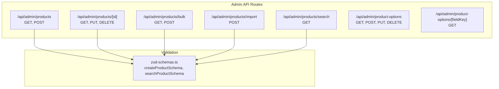
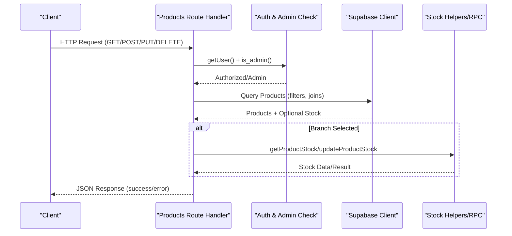
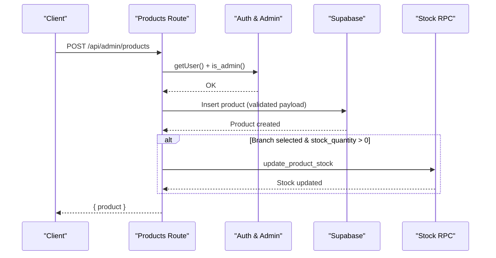
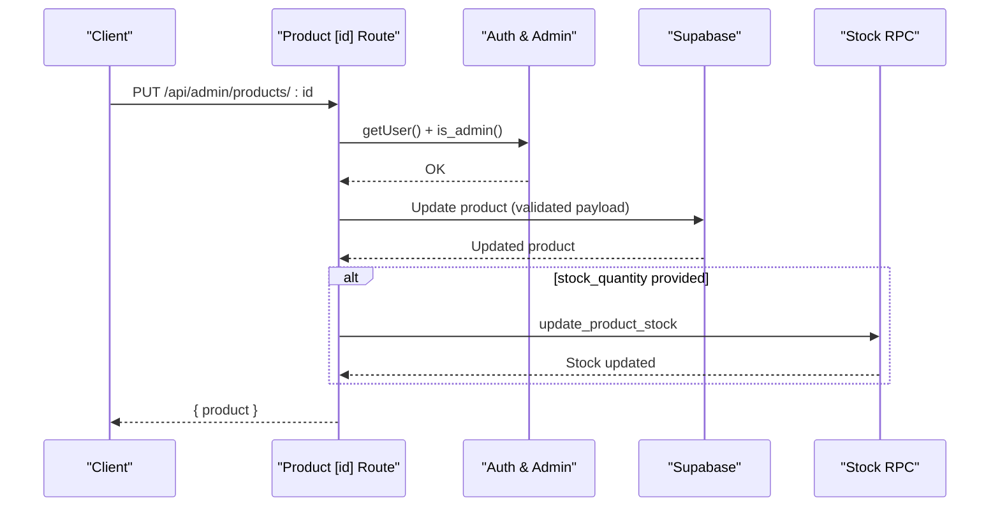
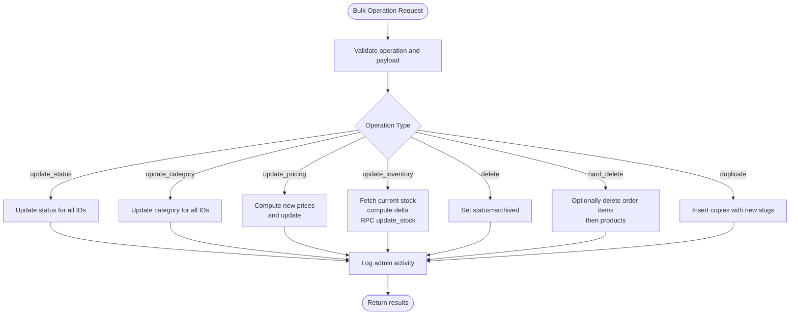
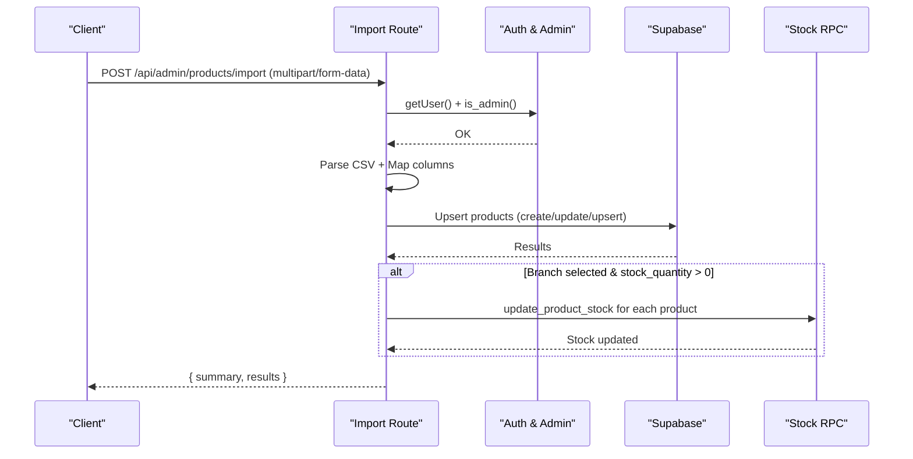
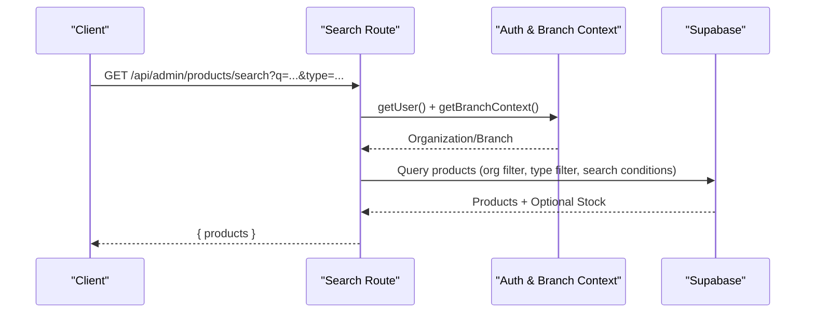
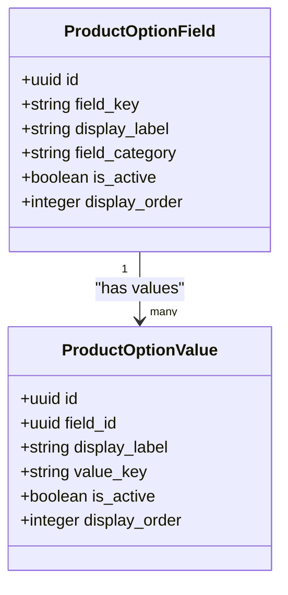
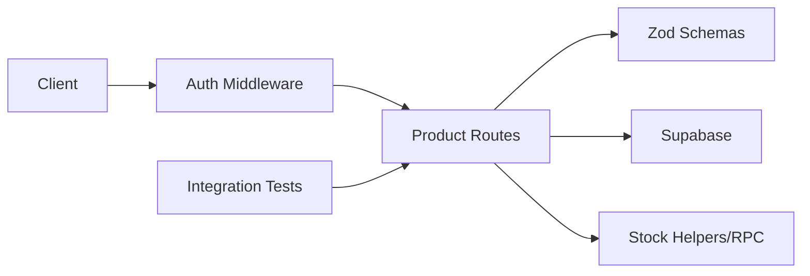

# Product Catalog API

<cite>
**Referenced Files in This Document**
- [route.ts](file://src/app/api/admin/products/route.ts)
- [route.ts](file://src/app/api/admin/products/[id]/route.ts)
- [route.ts](file://src/app/api/admin/products/bulk/route.ts)
- [route.ts](file://src/app/api/admin/products/import/route.ts)
- [route.ts](file://src/app/api/admin/products/search/route.ts)
- [route.ts](file://src/app/api/admin/product-options/route.ts)
- [route.ts](file://src/app/api/admin/product-options/[fieldKey]/route.ts)
- [zod-schemas.ts](file://src/lib/api/validation/zod-schemas.ts)
- [products.test.ts](file://src/__tests__/integration/api/products.test.ts)
</cite>

## Table of Contents

1. [Introduction](#introduction)
2. [Project Structure](#project-structure)
3. [Core Components](#core-components)
4. [Architecture Overview](#architecture-overview)
5. [Detailed Component Analysis](#detailed-component-analysis)
6. [Dependency Analysis](#dependency-analysis)
7. [Performance Considerations](#performance-considerations)
8. [Troubleshooting Guide](#troubleshooting-guide)
9. [Conclusion](#conclusion)

## Introduction

This document provides comprehensive API documentation for the Opttius product catalog management system. It covers product CRUD operations, bulk operations, CSV/JSON imports, product search functionality, product option management, category associations, and inventory tracking. Authentication requirements, request/response schemas, validation rules, and search indexing behavior are documented to enable reliable integration.

## Project Structure

The product catalog API is implemented as Next.js App Router API routes under `/src/app/api/admin/products` and related endpoints for product options. Validation schemas are centralized in `zod-schemas.ts`.

**Diagram sources**

- [route.ts](file://src/app/api/admin/products/route.ts#L1-L1220)
- [route.ts](file://src/app/api/admin/products/[id]/route.ts#L1-L682)
- [route.ts](file://src/app/api/admin/products/bulk/route.ts#L1-L683)
- [route.ts](file://src/app/api/admin/products/import/route.ts#L1-L632)
- [route.ts](file://src/app/api/admin/products/search/route.ts#L1-L263)
- [route.ts](file://src/app/api/admin/product-options/route.ts#L1-L233)
- [route.ts](file://src/app/api/admin/product-options/[fieldKey]/route.ts#L1-L68)
- [zod-schemas.ts](file://src/lib/api/validation/zod-schemas.ts#L559-L664)

**Section sources**

- [route.ts](file://src/app/api/admin/products/route.ts#L1-L1220)
- [route.ts](file://src/app/api/admin/products/[id]/route.ts#L1-L682)
- [route.ts](file://src/app/api/admin/products/bulk/route.ts#L1-L683)
- [route.ts](file://src/app/api/admin/products/import/route.ts#L1-L632)
- [route.ts](file://src/app/api/admin/products/search/route.ts#L1-L263)
- [route.ts](file://src/app/api/admin/product-options/route.ts#L1-L233)
- [route.ts](file://src/app/api/admin/product-options/[fieldKey]/route.ts#L1-L68)
- [zod-schemas.ts](file://src/lib/api/validation/zod-schemas.ts#L559-L664)

## Core Components

- Product Catalog API: Handles product CRUD, listing with filters, pagination, and search.
- Bulk Operations API: Performs batch updates, pricing adjustments, inventory adjustments, duplication, archiving, and hard deletion with optional force delete.
- Import API: Processes CSV uploads for product creation, updates, and upserts, including stock handling per branch.
- Search API: Provides optimized product search with organization and branch scoping.
- Product Options API: Manages product option fields and values for dynamic product attributes.

**Section sources**

- [route.ts](file://src/app/api/admin/products/route.ts#L24-L539)
- [route.ts](file://src/app/api/admin/products/bulk/route.ts#L11-L490)
- [route.ts](file://src/app/api/admin/products/import/route.ts#L11-L530)
- [route.ts](file://src/app/api/admin/products/search/route.ts#L9-L262)
- [route.ts](file://src/app/api/admin/product-options/route.ts#L8-L232)

## Architecture Overview

The product catalog API follows a layered architecture:

- Route handlers validate requests, enforce authentication and admin roles, apply branch and organization scoping, and delegate to service clients.
- Validation schemas ensure consistent request payload validation across endpoints.
- Inventory operations leverage a dedicated stock helper and RPC functions for branch-specific stock management.
- Search endpoints implement multi-tenant filtering and branch-aware stock retrieval.

**Diagram sources**

- [route.ts](file://src/app/api/admin/products/route.ts#L24-L539)
- [route.ts](file://src/app/api/admin/products/[id]/route.ts#L13-L209)
- [route.ts](file://src/app/api/admin/products/bulk/route.ts#L11-L490)

## Detailed Component Analysis

### Product CRUD Endpoints

- Base URL: `/api/admin/products`
- Methods:
  - GET: List products with filters, pagination, sorting, and optional branch scoping.
  - POST: Create a product with validation and optional initial stock per branch.

**Diagram sources**

- [route.ts](file://src/app/api/admin/products/route.ts#L542-L800)
- [route.ts](file://src/app/api/admin/products/import/route.ts#L245-L304)

**Section sources**

- [route.ts](file://src/app/api/admin/products/route.ts#L24-L539)
- [route.ts](file://src/app/api/admin/products/route.ts#L542-L800)
- [zod-schemas.ts](file://src/lib/api/validation/zod-schemas.ts#L637-L650)

### Single Product Endpoints

- Base URL: `/api/admin/products/[id]`
- Methods:
  - GET: Retrieve a single product with optional branch-scoped stock.
  - PUT: Update product details; supports stock_quantity update via branch stock RPC.
  - DELETE: Archive product (soft delete) or hard delete with optional force.

**Diagram sources**

- [route.ts](file://src/app/api/admin/products/[id]/route.ts#L211-L595)

**Section sources**

- [route.ts](file://src/app/api/admin/products/[id]/route.ts#L13-L209)
- [route.ts](file://src/app/api/admin/products/[id]/route.ts#L211-L595)

### Bulk Operations

- Base URL: `/api/admin/products/bulk`
- Supported operations:
  - update_status: Set product status.
  - update_category: Change category.
  - update_pricing: Percentage or fixed adjustments.
  - update_inventory: Set/add inventory per branch.
  - delete: Archive products.
  - hard_delete: Permanently delete with optional force to remove dependent order items.
  - duplicate: Duplicate selected products.

**Diagram sources**

- [route.ts](file://src/app/api/admin/products/bulk/route.ts#L11-L490)

**Section sources**

- [route.ts](file://src/app/api/admin/products/bulk/route.ts#L11-L490)

### Import Operations (CSV/JSON)

- Base URL: `/api/admin/products/import`
- Methods:
  - POST: Upload CSV with product data and mode (create, update, upsert). Supports category mapping and stock creation per branch.

**Diagram sources**

- [route.ts](file://src/app/api/admin/products/import/route.ts#L11-L530)

**Section sources**

- [route.ts](file://src/app/api/admin/products/import/route.ts#L11-L530)

### Product Search

- Base URL: `/api/admin/products/search`
- Method: GET
- Features:
  - Multi-tenant filtering by organization.
  - Branch-aware stock retrieval.
  - Type-specific filtering (e.g., frames).
  - Exact SKU/barcode prioritization for alphanumeric queries.

**Diagram sources**

- [route.ts](file://src/app/api/admin/products/search/route.ts#L9-L262)

**Section sources**

- [route.ts](file://src/app/api/admin/products/search/route.ts#L9-L262)

### Product Option Management

- Base URL: `/api/admin/product-options`
- Methods:
  - GET: List option fields with values, filter by category and activation.
  - POST: Create field or value.
  - PUT: Update field or value.
  - DELETE: Delete field/value (field cascade deletes values).

- Base URL: `/api/admin/product-options/[fieldKey]`
- Methods:
  - GET: Retrieve a specific field and its values.

**Diagram sources**

- [route.ts](file://src/app/api/admin/product-options/route.ts#L8-L232)
- [route.ts](file://src/app/api/admin/product-options/[fieldKey]/route.ts#L8-L67)

**Section sources**

- [route.ts](file://src/app/api/admin/product-options/route.ts#L8-L232)
- [route.ts](file://src/app/api/admin/product-options/[fieldKey]/route.ts#L8-L67)

## Dependency Analysis

- Authentication and Authorization:
  - All product endpoints require authenticated user and admin role checks.
  - Branch context is enforced for multi-tenancy and branch-scoped operations.
- Validation:
  - Centralized Zod schemas ensure consistent validation for product creation, updates, and search parameters.
- Inventory:
  - Dedicated stock helpers and RPC functions manage branch-specific stock quantities.
- Testing:
  - Integration tests validate CRUD, pagination, filtering, and validation scenarios.

**Diagram sources**

- [route.ts](file://src/app/api/admin/products/route.ts#L24-L539)
- [zod-schemas.ts](file://src/lib/api/validation/zod-schemas.ts#L559-L664)
- [products.test.ts](file://src/__tests__/integration/api/products.test.ts#L242-L401)

**Section sources**

- [route.ts](file://src/app/api/admin/products/route.ts#L24-L539)
- [zod-schemas.ts](file://src/lib/api/validation/zod-schemas.ts#L559-L664)
- [products.test.ts](file://src/__tests__/integration/api/products.test.ts#L242-L401)

## Performance Considerations

- Pagination and Sorting: Use `page`/`limit` and explicit `sort_by`/`sort_order` to control result size and ordering.
- Filtering: Prefer narrowing filters (category, status, price range) to reduce result sets.
- Branch Scoping: Selecting a branch reduces dataset size and avoids `.or()` conflicts in queries.
- Stock Retrieval: Branch-specific stock is fetched via RPC; avoid unnecessary stock queries when not required.
- Rate Limits: Search endpoint applies rate limiting; batch operations should be scheduled to avoid throttling.

## Troubleshooting Guide

- Unauthorized Access: Ensure the request includes a valid admin session and passes `is_admin` checks.
- Multi-Tenancy Issues: Organization-based filtering is strict; verify the user belongs to the correct organization and branch context.
- Validation Errors: Review payload against Zod schemas; missing required fields or invalid types will cause 400 responses.
- Stock Updates: When updating stock via product PUT, ensure a branch is selected; otherwise, the product updates but stock is not modified.
- Bulk Operation Failures: Hard delete requires force flag if dependent order items exist; otherwise, use archive (soft delete).
- Import Errors: CSV must include headers and at least one data row; category mapping failures produce warnings; unique slug conflicts cause creation skips.

**Section sources**

- [route.ts](file://src/app/api/admin/products/[id]/route.ts#L537-L586)
- [route.ts](file://src/app/api/admin/products/bulk/route.ts#L307-L420)
- [route.ts](file://src/app/api/admin/products/import/route.ts#L17-L51)
- [products.test.ts](file://src/__tests__/integration/api/products.test.ts#L364-L401)

## Conclusion

The Opttius product catalog API provides robust, secure, and scalable endpoints for managing products, options, categories, and inventory across branches and organizations. Centralized validation, strict authentication, and branch-aware operations ensure data integrity and performance. Use the provided schemas and endpoints to integrate product CRUD, bulk operations, imports, and search effectively.
