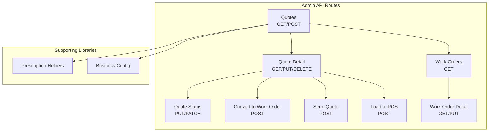
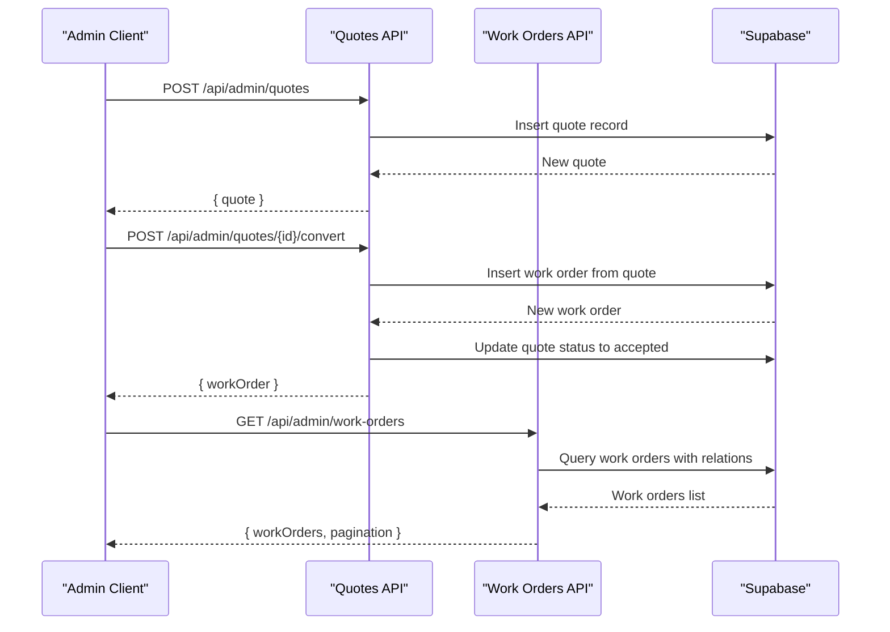
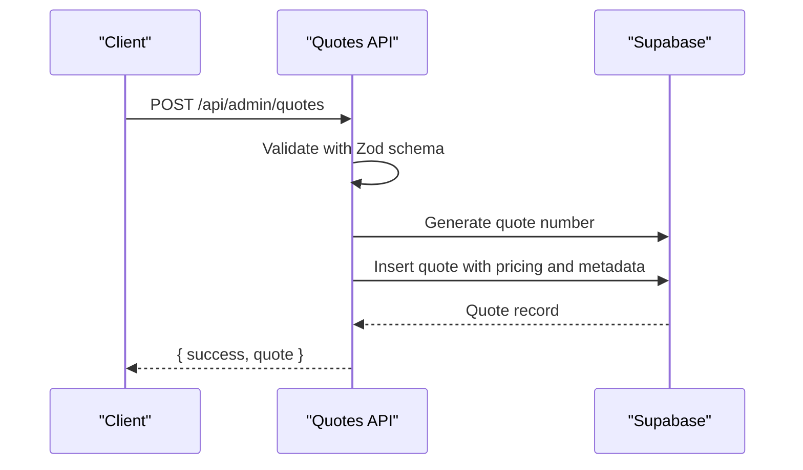
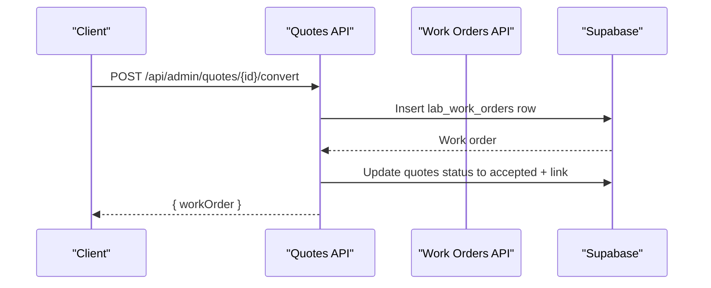
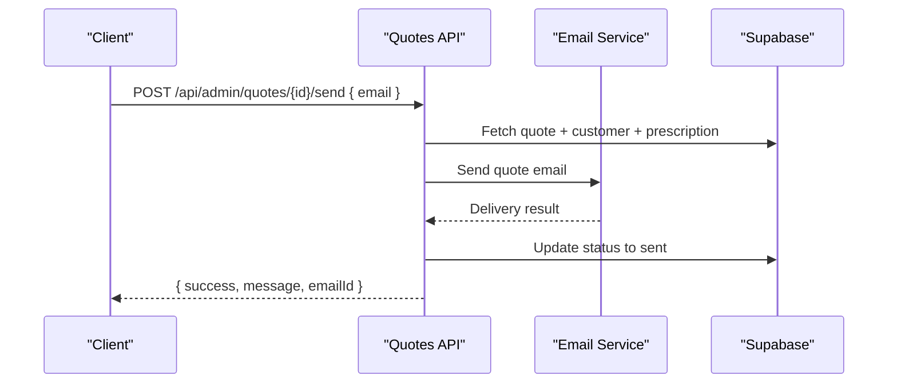
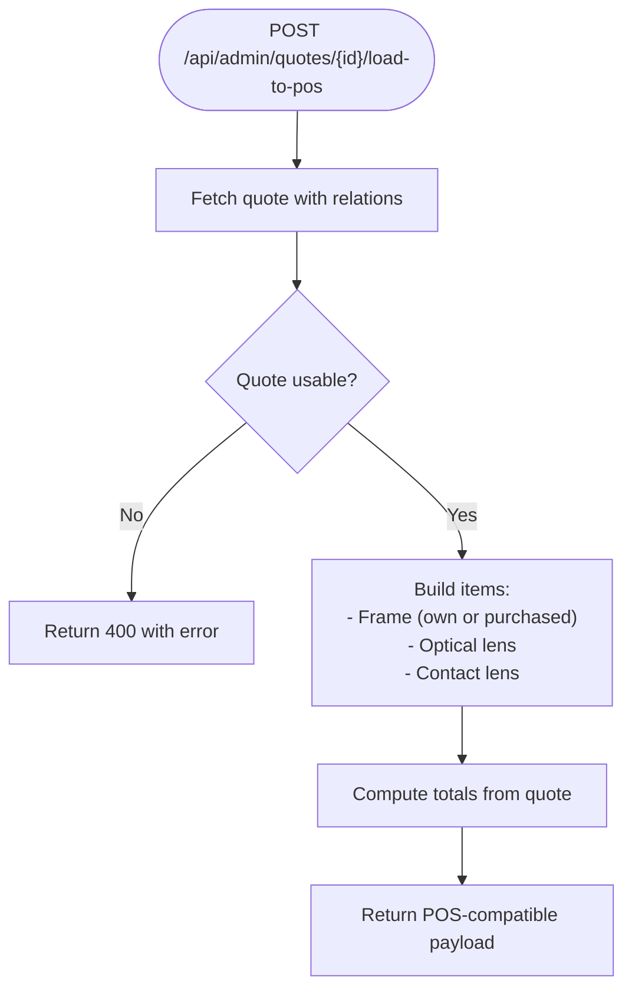
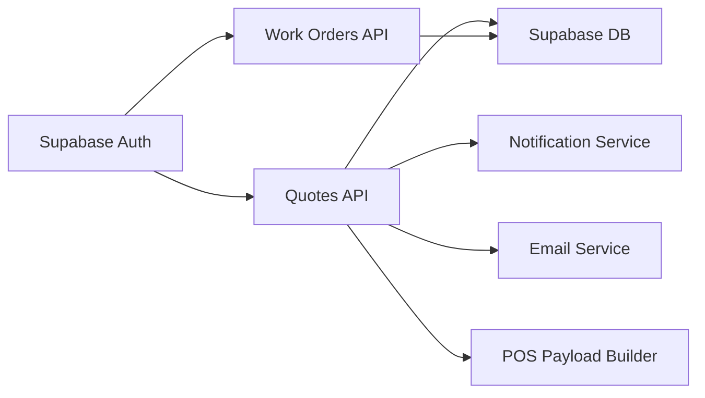

# Quote & Work Order API

<cite>
**Referenced Files in This Document**
- [route.ts](file://src/app/api/admin/quotes/route.ts)
- [route.ts](file://src/app/api/admin/quotes/[id]/route.ts)
- [route.ts](file://src/app/api/admin/quotes/[id]/status/route.ts)
- [route.ts](file://src/app/api/admin/quotes/[id]/convert/route.ts)
- [route.ts](file://src/app/api/admin/quotes/[id]/send/route.ts)
- [route.ts](file://src/app/api/admin/quotes/[id]/load-to-pos/route.ts)
- [route.ts](file://src/app/api/admin/work-orders/route.ts)
- [route.ts](file://src/app/api/admin/work-orders/[id]/route.ts)
- [prescription-helpers.ts](file://src/lib/prescription-helpers.ts)
- [seed_demo_organization.sql](file://supabase/migrations/20260130000001_seed_demo_organization.sql)
</cite>

## Table of Contents

1. [Introduction](#introduction)
2. [Project Structure](#project-structure)
3. [Core Components](#core-components)
4. [Architecture Overview](#architecture-overview)
5. [Detailed Component Analysis](#detailed-component-analysis)
6. [Dependency Analysis](#dependency-analysis)
7. [Performance Considerations](#performance-considerations)
8. [Troubleshooting Guide](#troubleshooting-guide)
9. [Conclusion](#conclusion)

## Introduction

This document provides comprehensive API documentation for Opttius quote and work order processing endpoints. It covers HTTP methods, URL patterns, request/response schemas, authentication requirements, and workflow state transitions for quote creation, conversion to work orders, sending quotes to customers, and POS integration. It also documents work order management, delivery tracking, status updates, and the integration patterns with laboratories and order fulfillment processes.

## Project Structure

The API endpoints are organized under the admin API routes for quotes and work orders, with supporting utilities for prescription handling and business configuration.

**Diagram sources**

- [route.ts](file://src/app/api/admin/quotes/route.ts#L1-L552)
- [route.ts](file://src/app/api/admin/quotes/[id]/route.ts#L1-L617)
- [route.ts](file://src/app/api/admin/quotes/[id]/status/route.ts#L1-L150)
- [route.ts](file://src/app/api/admin/quotes/[id]/convert/route.ts#L1-L200)
- [route.ts](file://src/app/api/admin/quotes/[id]/send/route.ts#L1-L428)
- [route.ts](file://src/app/api/admin/quotes/[id]/load-to-pos/route.ts#L1-L238)
- [route.ts](file://src/app/api/admin/work-orders/route.ts#L1-L198)
- [route.ts](file://src/app/api/admin/work-orders/[id]/route.ts#L81-L129)
- [prescription-helpers.ts](file://src/lib/prescription-helpers.ts#L1-L38)

**Section sources**

- [route.ts](file://src/app/api/admin/quotes/route.ts#L1-L552)
- [route.ts](file://src/app/api/admin/quotes/[id]/route.ts#L1-L617)
- [route.ts](file://src/app/api/admin/quotes/[id]/status/route.ts#L1-L150)
- [route.ts](file://src/app/api/admin/quotes/[id]/convert/route.ts#L1-L200)
- [route.ts](file://src/app/api/admin/quotes/[id]/send/route.ts#L1-L428)
- [route.ts](file://src/app/api/admin/quotes/[id]/load-to-pos/route.ts#L1-L238)
- [route.ts](file://src/app/api/admin/work-orders/route.ts#L1-L198)
- [route.ts](file://src/app/api/admin/work-orders/[id]/route.ts#L81-L129)
- [prescription-helpers.ts](file://src/lib/prescription-helpers.ts#L1-L38)

## Core Components

- Authentication and Authorization: All endpoints require admin authentication and verify administrative privileges using a stored procedure.
- Multi-tenancy and Branch Filtering: Endpoints enforce organization and branch access controls, with special handling for POS customer lookups.
- Validation: Request bodies are validated using Zod schemas for quote creation.
- Notifications and Emails: Non-blocking notifications and email dispatch are integrated for quote events.
- POS Integration: Dedicated endpoint transforms quotes into POS-compatible cart payloads.

**Section sources**

- [route.ts](file://src/app/api/admin/quotes/route.ts#L17-L118)
- [route.ts](file://src/app/api/admin/quotes/[id]/route.ts#L9-L124)
- [route.ts](file://src/app/api/admin/quotes/[id]/status/route.ts#L8-L41)
- [route.ts](file://src/app/api/admin/quotes/[id]/convert/route.ts#L14-L34)
- [route.ts](file://src/app/api/admin/quotes/[id]/send/route.ts#L14-L34)
- [route.ts](file://src/app/api/admin/quotes/[id]/load-to-pos/route.ts#L14-L38)

## Architecture Overview

The system separates quote lifecycle management from work order orchestration while maintaining tight integration for conversion and POS workflows.

**Diagram sources**

- [route.ts](file://src/app/api/admin/quotes/route.ts#L275-L551)
- [route.ts](file://src/app/api/admin/quotes/[id]/convert/route.ts#L9-L191)
- [route.ts](file://src/app/api/admin/work-orders/route.ts#L15-L198)

## Detailed Component Analysis

### Quote Management Endpoints

#### Create Quote

- Method: POST
- URL: /api/admin/quotes
- Purpose: Create a new quote with validated optical prescription and pricing data.
- Authentication: Admin required.
- Request Body Schema (selected fields):
  - customer_id: string (UUID)
  - branch_id: string (UUID, optional for super admins)
  - prescription_id: string (UUID, optional)
  - frame fields: name, brand, model, color, size, sku, price, cost
  - lens fields: type, material, index, tint_color, tint_percentage, treatments[]
  - contact lens fields: family_id, OD/OS sphere/cylinder/axis/add/base curve/diameter, quantity, cost/price
  - pricing: subtotal, tax_amount, discount_amount, discount_percentage, total_amount, currency
  - notes, customer_notes, terms_and_conditions
  - expiration_date, status (defaults applied)
- Response: { success: boolean, quote }

**Diagram sources**

- [route.ts](file://src/app/api/admin/quotes/route.ts#L275-L551)

**Section sources**

- [route.ts](file://src/app/api/admin/quotes/route.ts#L275-L551)

#### List Quotes

- Method: GET
- URL: /api/admin/quotes
- Query Parameters:
  - status: draft|sent|accepted|rejected|expired|all
  - customer_id: string (UUID)
  - customer_rut: string
  - customer_email: string
  - page: number
  - limit: number
- Response: { quotes[], pagination: { page, limit, total, totalPages } }

**Section sources**

- [route.ts](file://src/app/api/admin/quotes/route.ts#L17-L273)

#### Get Quote Details

- Method: GET
- URL: /api/admin/quotes/[id]
- Response: { quote with customer, prescription, frame_product, lens families (if applicable) }

**Section sources**

- [route.ts](file://src/app/api/admin/quotes/[id]/route.ts#L9-L345)

#### Update Quote

- Method: PUT
- URL: /api/admin/quotes/[id]
- Allowed Fields: frame/lens fields, costs, pricing, status, notes, expiration_date
- Response: { success: boolean, quote }

**Section sources**

- [route.ts](file://src/app/api/admin/quotes/[id]/route.ts#L347-L535)

#### Delete Quote

- Method: DELETE
- URL: /api/admin/quotes/[id]
- Constraints: Cannot delete quotes converted to work orders.
- Response: { success: boolean, message }

**Section sources**

- [route.ts](file://src/app/api/admin/quotes/[id]/route.ts#L537-L616)

#### Update Quote Status

- Method: PUT/PATCH
- URL: /api/admin/quotes/[id]/status
- Request Body: { status: draft|sent|accepted|rejected|expired }
- Constraints: Cannot change status of converted quotes.
- Response: { success: boolean, quote }

**Section sources**

- [route.ts](file://src/app/api/admin/quotes/[id]/status/route.ts#L8-L149)

#### Convert Quote to Work Order

- Method: POST
- URL: /api/admin/quotes/[id]/convert
- Behavior:
  - Creates a new work order from quote data
  - Sets quote status to accepted
  - Links work order ID to quote
- Response: { success: boolean, workOrder }

**Diagram sources**

- [route.ts](file://src/app/api/admin/quotes/[id]/convert/route.ts#L9-L191)

**Section sources**

- [route.ts](file://src/app/api/admin/quotes/[id]/convert/route.ts#L9-L191)

#### Send Quote to Customer

- Method: POST
- URL: /api/admin/quotes/[id]/send
- Request Body: { email: string }
- Behavior:
  - Validates email
  - Builds HTML/Text email with quote details
  - Sends email via configured provider
  - Updates quote status to sent
- Response: { success: boolean, message, emailId }

**Diagram sources**

- [route.ts](file://src/app/api/admin/quotes/[id]/send/route.ts#L9-L427)

**Section sources**

- [route.ts](file://src/app/api/admin/quotes/[id]/send/route.ts#L9-L427)

#### Load Quote to POS

- Method: POST
- URL: /api/admin/quotes/[id]/load-to-pos
- Purpose: Prepare a quote for POS checkout by returning items and totals in POS-compatible format.
- Constraints: Quote must not be accepted or converted.
- Response: { success: boolean, quoteId, quoteNumber, customerId, customer, prescriptionId, prescription, items[], totals, notes, internalNotes, originalQuote }

**Diagram sources**

- [route.ts](file://src/app/api/admin/quotes/[id]/load-to-pos/route.ts#L13-L237)

**Section sources**

- [route.ts](file://src/app/api/admin/quotes/[id]/load-to-pos/route.ts#L13-L237)

### Work Order Management Endpoints

#### List Work Orders

- Method: GET
- URL: /api/admin/work-orders
- Query Parameters:
  - page: number
  - limit: number
- Response: { workOrders[], pagination: { page, limit, total, totalPages } }

**Section sources**

- [route.ts](file://src/app/api/admin/work-orders/route.ts#L15-L198)

#### Get Work Order Details

- Method: GET
- URL: /api/admin/work-orders/[id]
- Response: { workOrder, statusHistory[] }

**Section sources**

- [route.ts](file://src/app/api/admin/work-orders/[id]/route.ts#L81-L97)

#### Update Work Order

- Method: PUT
- URL: /api/admin/work-orders/[id]
- Allowed Fields: Various work order attributes (status, payment_status, notes, etc.)
- Response: { success: boolean, workOrder }

**Section sources**

- [route.ts](file://src/app/api/admin/work-orders/[id]/route.ts#L100-L129)

### Prescription Data Handling

- Prescription types are supported with localized labels for display.
- Demo data includes optical prescriptions with spherical, cylindrical, axis, add, and pupillary distance fields.
- Prescription snapshots are captured during quote-to-work-order conversion.

**Section sources**

- [prescription-helpers.ts](file://src/lib/prescription-helpers.ts#L1-L38)
- [seed_demo_organization.sql](file://supabase/migrations/20260130000001_seed_demo_organization.sql#L204-L222)

## Dependency Analysis

- Authentication: Uses Supabase auth getUser and RPC is_admin.
- Multi-tenancy: Enforced via branch context and organization filters.
- Validation: Zod schemas for request body validation.
- Notifications: Non-blocking notification service for quote/work order events.
- Email: Business email sending with HTML and text variants.
- POS Integration: Dedicated endpoint returns structured items for checkout.

**Diagram sources**

- [route.ts](file://src/app/api/admin/quotes/route.ts#L1-L16)
- [route.ts](file://src/app/api/admin/work-orders/route.ts#L1-L14)
- [route.ts](file://src/app/api/admin/quotes/[id]/send/route.ts#L1-L8)

**Section sources**

- [route.ts](file://src/app/api/admin/quotes/route.ts#L1-L16)
- [route.ts](file://src/app/api/admin/work-orders/route.ts#L1-L14)
- [route.ts](file://src/app/api/admin/quotes/[id]/send/route.ts#L1-L8)

## Performance Considerations

- Batch relation loading: Quotes and work orders fetch related entities (customers, prescriptions, products, staff) in separate queries to avoid N+1 issues.
- Pagination: Implemented for listing endpoints to control payload sizes.
- Service role usage: Certain operations use service roles for permission bypass and background tasks.
- Email and notifications: Non-blocking to prevent request latency.

## Troubleshooting Guide

- Unauthorized Access: Ensure admin credentials and is_admin verification pass.
- Branch/ Organization Access Denied: Verify branch context and organization filters.
- Validation Errors: Confirm request body conforms to Zod schemas for quotes.
- Converted Quote Modifications: Status updates and deletions are blocked for quotes converted to work orders.
- Email Delivery Failures: Check email service configuration and returned error details.

**Section sources**

- [route.ts](file://src/app/api/admin/quotes/[id]/status/route.ts#L77-L94)
- [route.ts](file://src/app/api/admin/quotes/[id]/route.ts#L577-L589)
- [route.ts](file://src/app/api/admin/quotes/[id]/send/route.ts#L388-L396)

## Conclusion

The Quote & Work Order API provides a robust foundation for managing optical prescriptions, quotes, conversions to work orders, and POS integration. It enforces strong authentication, multi-tenancy, and validation while offering flexible workflows for customer communication and fulfillment. The documented endpoints and schemas enable reliable integrations with external systems and internal POS checkout flows.
