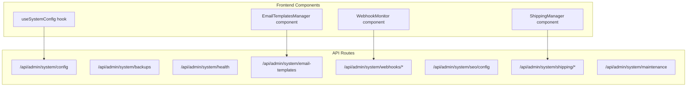
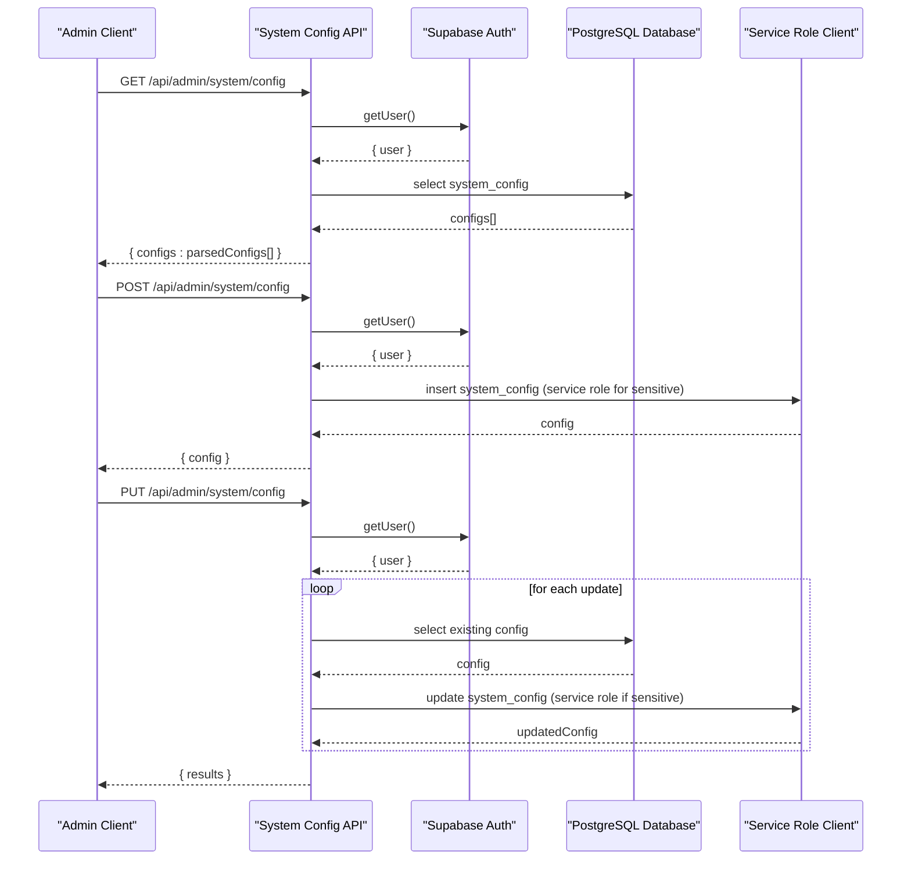
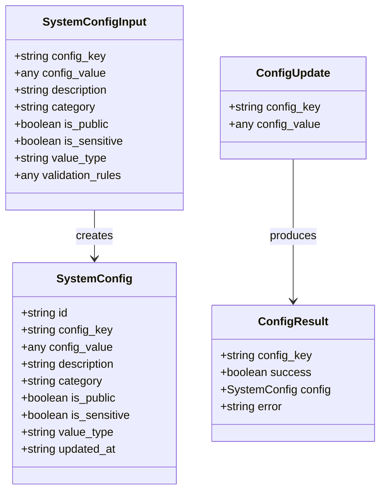
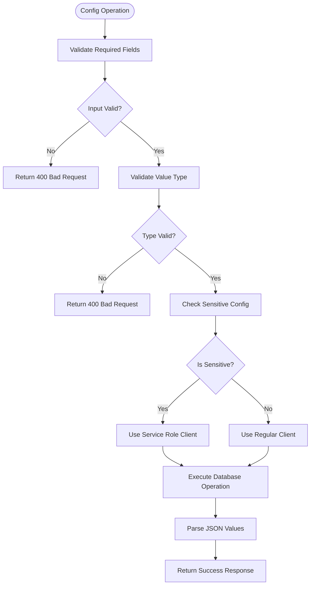
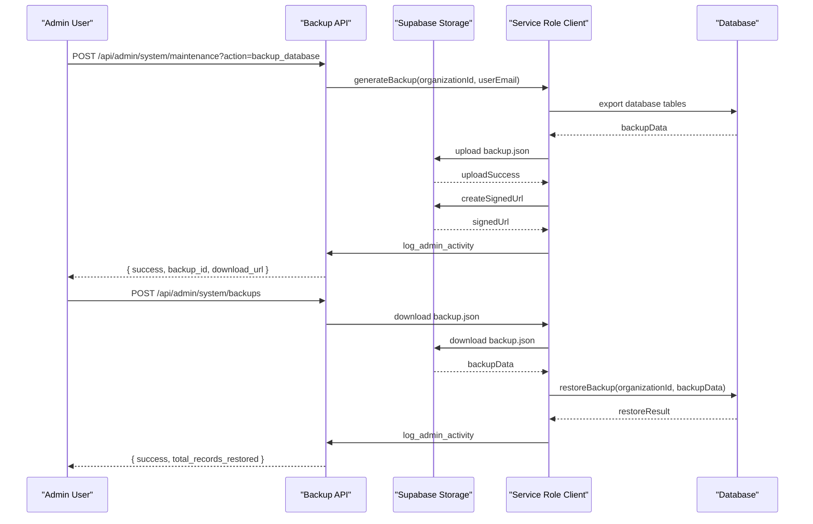
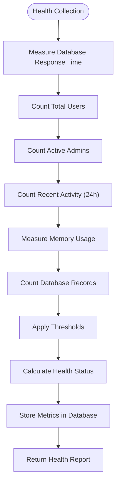
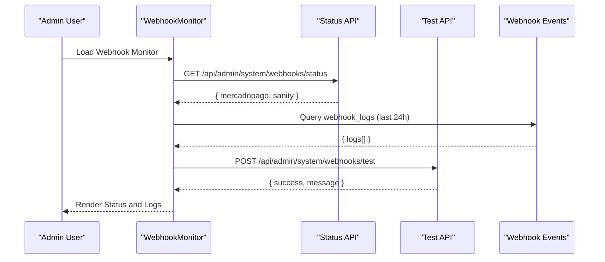
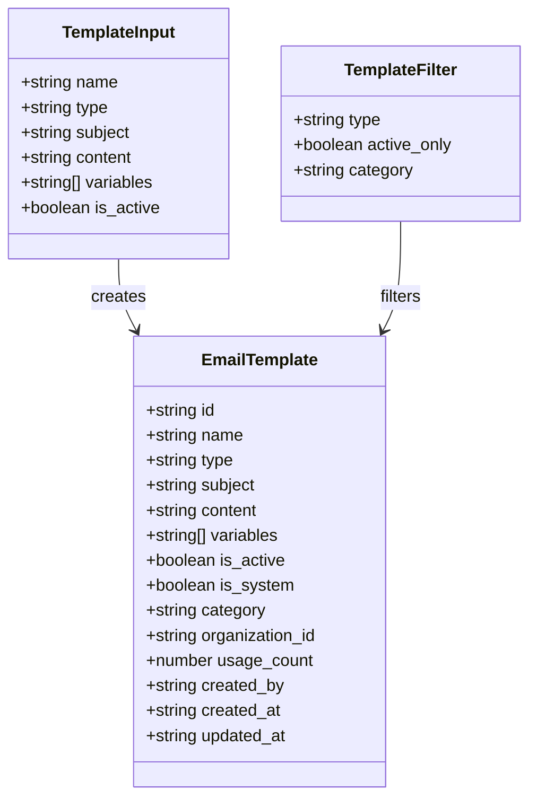
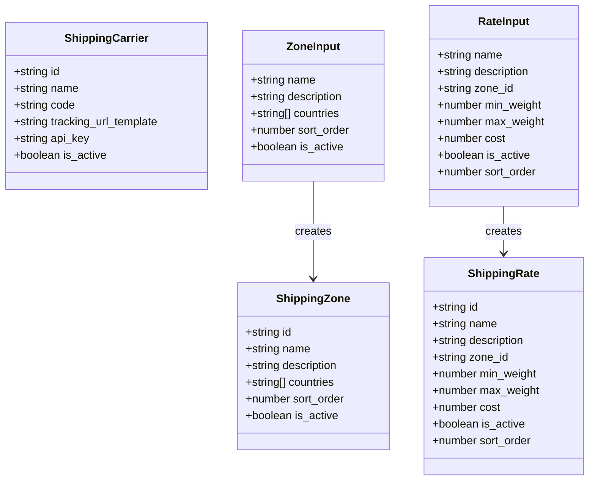
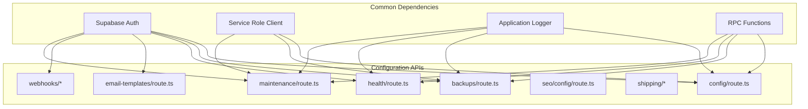

# System Configuration API

<cite>
**Referenced Files in This Document**
- [config/route.ts](file://src/app/api/admin/system/config/route.ts)
- [backups/route.ts](file://src/app/api/admin/system/backups/route.ts)
- [health/route.ts](file://src/app/api/admin/system/health/route.ts)
- [email-templates/route.ts](file://src/app/api/admin/system/email-templates/route.ts)
- [webhooks/status/route.ts](file://src/app/api/admin/system/webhooks/status/route.ts)
- [webhooks/test/route.ts](file://src/app/api/admin/system/webhooks/test/route.ts)
- [seo/config/route.ts](file://src/app/api/admin/system/seo/config/route.ts)
- [shipping/carriers/route.ts](file://src/app/api/admin/system/shipping/carriers/route.ts)
- [shipping/zones/route.ts](file://src/app/api/admin/system/shipping/zones/route.ts)
- [shipping/zones/[id]/route.ts](file://src/app/api/admin/system/shipping/zones/[id]/route.ts)
- [shipping/rates/route.ts](file://src/app/api/admin/system/shipping/rates/route.ts)
- [maintenance/route.ts](file://src/app/api/admin/system/maintenance/route.ts)
- [useSystemConfig.ts](file://src/app/admin/system/hooks/useSystemConfig.ts)
- [WebhookMonitor.tsx](file://src/components/admin/WebhookMonitor.tsx)
- [EmailTemplatesManager.tsx](file://src/components/admin/EmailTemplatesManager.tsx)
- [ShippingManager.tsx](file://src/components/admin/ShippingManager.tsx)
- [20250116210000_create_system_admin_tools.sql](file://supabase/migrations/20250116210000_create_system_admin_tools.sql)
- [20260131000000_create_payments_and_webhook_events.sql](file://supabase/migrations/20260131000000_create_payments_and_webhook_events.sql)
</cite>

## Table of Contents

1. [Introduction](#introduction)
2. [Project Structure](#project-structure)
3. [Core Components](#core-components)
4. [Architecture Overview](#architecture-overview)
5. [Detailed Component Analysis](#detailed-component-analysis)
6. [Dependency Analysis](#dependency-analysis)
7. [Performance Considerations](#performance-considerations)
8. [Troubleshooting Guide](#troubleshooting-guide)
9. [Conclusion](#conclusion)

## Introduction

This document provides comprehensive API documentation for the Opttius system configuration endpoints. It covers HTTP methods, URL patterns, request/response schemas, authentication requirements, and operational workflows for system settings, backup management, health monitoring, email templates, webhooks, SEO configuration, and shipping management. The documentation also addresses system maintenance operations, configuration validation, and infrastructure monitoring capabilities.

## Project Structure

The system configuration APIs are organized under the Next.js app router in the `/api/admin/system` namespace. Each functional area (configuration, backups, health, email templates, webhooks, SEO, shipping, maintenance) has dedicated route handlers. Frontend components integrate with these APIs through React hooks and direct fetch calls.

**Diagram sources**

- [config/route.ts](file://src/app/api/admin/system/config/route.ts#L1-L441)
- [backups/route.ts](file://src/app/api/admin/system/backups/route.ts#L1-L295)
- [health/route.ts](file://src/app/api/admin/system/health/route.ts#L1-L323)
- [email-templates/route.ts](file://src/app/api/admin/system/email-templates/route.ts#L1-L229)
- [webhooks/status/route.ts](file://src/app/api/admin/system/webhooks/status/route.ts#L1-L40)
- [webhooks/test/route.ts](file://src/app/api/admin/system/webhooks/test/route.ts#L1-L56)
- [seo/config/route.ts](file://src/app/api/admin/system/seo/config/route.ts#L1-L85)
- [shipping/carriers/route.ts](file://src/app/api/admin/system/shipping/carriers/route.ts#L1-L113)
- [shipping/zones/route.ts](file://src/app/api/admin/system/shipping/zones/route.ts#L1-L48)
- [shipping/zones/[id]/route.ts](file://src/app/api/admin/system/shipping/zones/[id]/route.ts#L91-L145)
- [shipping/rates/route.ts](file://src/app/api/admin/system/shipping/rates/route.ts#L1-L49)
- [maintenance/route.ts](file://src/app/api/admin/system/maintenance/route.ts#L1-L529)

**Section sources**

- [config/route.ts](file://src/app/api/admin/system/config/route.ts#L1-L441)
- [backups/route.ts](file://src/app/api/admin/system/backups/route.ts#L1-L295)
- [health/route.ts](file://src/app/api/admin/system/health/route.ts#L1-L323)
- [email-templates/route.ts](file://src/app/api/admin/system/email-templates/route.ts#L1-L229)
- [webhooks/status/route.ts](file://src/app/api/admin/system/webhooks/status/route.ts#L1-L40)
- [webhooks/test/route.ts](file://src/app/api/admin/system/webhooks/test/route.ts#L1-L56)
- [seo/config/route.ts](file://src/app/api/admin/system/seo/config/route.ts#L1-L85)
- [shipping/carriers/route.ts](file://src/app/api/admin/system/shipping/carriers/route.ts#L1-L113)
- [shipping/zones/route.ts](file://src/app/api/admin/system/shipping/zones/route.ts#L1-L48)
- [shipping/zones/[id]/route.ts](file://src/app/api/admin/system/shipping/zones/[id]/route.ts#L91-L145)
- [shipping/rates/route.ts](file://src/app/api/admin/system/shipping/rates/route.ts#L1-L49)
- [maintenance/route.ts](file://src/app/api/admin/system/maintenance/route.ts#L1-L529)

## Core Components

This section documents the primary system configuration endpoints and their capabilities.

### System Configuration Management

Manages system-wide configuration keys with validation, categorization, and sensitivity handling.

**HTTP Methods and URLs**

- GET /api/admin/system/config
  - Query parameters: category (string), public_only (boolean)
  - Response: { configs: SystemConfig[] }
- POST /api/admin/system/config
  - Request body: SystemConfigInput
  - Response: { config: SystemConfig }
- PUT /api/admin/system/config
  - Request body: { updates: { config_key: string, config_value: any }[] }
  - Response: { results: ConfigResult[] }

**Request Schema (POST/PUT)**

- config_key: string (required)
- config_value: any (required)
- description: string (optional)
- category: string (default: "general")
- is_public: boolean (default: false)
- is_sensitive: boolean (default: false)
- value_type: string (enum: "string"|"number"|"boolean"|"json"|"array")
- validation_rules: any (optional)

**Response Schema**

- id: string
- config_key: string
- config_value: any
- description: string
- category: string
- is_public: boolean
- is_sensitive: boolean
- value_type: string
- updated_at: string

**Authentication Requirements**

- Admin authorization required (admin, super_admin, root, dev)
- Sensitive configurations bypass RLS using service role client

**Section sources**

- [config/route.ts](file://src/app/api/admin/system/config/route.ts#L5-L89)
- [config/route.ts](file://src/app/api/admin/system/config/route.ts#L91-L200)
- [config/route.ts](file://src/app/api/admin/system/config/route.ts#L202-L441)

### Backup Management

Handles database backup creation, restoration, listing, and deletion with organization isolation.

**HTTP Methods and URLs**

- GET /api/admin/system/backups
  - Query parameters: filename (string), action (string: "details")
  - Response: { backups: Backup[] } or { backup_id: string, tables_count: number, total_records: number, backup_size_mb: string, created_at: string, created_by: string }
- POST /api/admin/system/backups
  - Request body: { backup_filename: string }
  - Response: { success: boolean, total_records_restored: number, tables_restored: number }
- DELETE /api/admin/system/backups?filename={backup_filename}
  - Response: { success: boolean, message: string }

**Backup File Naming and Security**

- Files stored as `{organization_id}/{backup_id}.json`
- Access controlled by organization prefix validation
- Signed URLs generated for download with 1-hour expiration

**Response Schema**

- backups[].id: string
- backups[].filename: string
- backups[].size: number
- backups[].size_mb: string
- backups[].created_at: string

**Authentication Requirements**

- Admin authorization required (admin, super_admin, root, dev)
- Organization-based access control enforced

**Section sources**

- [backups/route.ts](file://src/app/api/admin/system/backups/route.ts#L10-L163)
- [backups/route.ts](file://src/app/api/admin/system/backups/route.ts#L169-L244)
- [backups/route.ts](file://src/app/api/admin/system/backups/route.ts#L250-L295)

### Health Monitoring

Provides system health metrics collection and retrieval with automated thresholds and status calculation.

**HTTP Methods and URLs**

- GET /api/admin/system/health
  - Query parameters: category (string), hours (number, default: 24)
  - Response: { metrics: HealthMetric[], latest: HealthMetric[], health_status: HealthStatus, grouped: any, period_hours: number }
- POST /api/admin/system/health
  - Response: { success: boolean, metrics_collected: number, latest_metrics: HealthMetric[] }

**Collected Metrics**

- database_response_time: seconds (thresholds: warning 1.0s, critical 3.0s)
- total_users: count (thresholds: warning 10k, critical 50k)
- active_admin_users: count (thresholds: warning 50, critical 100)
- admin_activity_24h: count (thresholds: warning 1k, critical 5k)
- memory_usage: megabytes (thresholds: warning 1GB, critical 2GB)
- database_records: count (thresholds: warning 100k, critical 500k)

**Health Status Calculation**

- Critical: any metric meets critical threshold
- Warning: no critical, at least one metric meets warning threshold
- Healthy: all metrics below warning thresholds

**Response Schema**

- health_status.status: "healthy"|"warning"|"critical"
- health_status.warnings: number
- health_status.criticals: number

**Authentication Requirements**

- Admin authorization required (admin, super_admin, root, dev)

**Section sources**

- [health/route.ts](file://src/app/api/admin/system/health/route.ts#L5-L77)
- [health/route.ts](file://src/app/api/admin/system/health/route.ts#L79-L231)
- [health/route.ts](file://src/app/api/admin/system/health/route.ts#L234-L323)

### Email Templates Management

Manages organization-specific and system email templates with multi-tenant filtering and validation.

**HTTP Methods and URLs**

- GET /api/admin/system/email-templates
  - Query parameters: type (string), active_only (boolean), category (string, default: "organization")
  - Response: { templates: EmailTemplate[] }
- POST /api/admin/system/email-templates
  - Request body: { name: string, type: string, subject: string, content: string, variables?: string[], is_active?: boolean }
  - Response: { template: EmailTemplate }

**Template Types**

- order_confirmation, order_shipped, order_delivered
- password_reset, account_welcome
- appointment_confirmation, appointment_reminder
- prescription_ready, quote_sent, work_order_ready
- low_stock_alert
- payment_success, payment_failed
- marketing, custom

**Multi-Tenant Filtering**

- Global admins (root, dev, super_admin): full visibility or category filtering
- Organization admins: system templates (organization_id is null AND category='organization') OR their own templates

**Response Schema**

- templates[].id: string
- templates[].name: string
- templates[].type: string
- templates[].subject: string
- templates[].content: string
- templates[].variables: string[]
- templates[].is_active: boolean
- templates[].is_system: boolean
- templates[].category: string
- templates[].organization_id: string
- templates[].usage_count: number

**Authentication Requirements**

- Admin authorization required (admin, super_admin, root, dev)

**Section sources**

- [email-templates/route.ts](file://src/app/api/admin/system/email-templates/route.ts#L6-L112)
- [email-templates/route.ts](file://src/app/api/admin/system/email-templates/route.ts#L114-L229)

### Webhook Management

Monitors webhook delivery status and provides testing capabilities for payment providers.

**HTTP Methods and URLs**

- GET /api/admin/system/webhooks/status
  - Response: { mercadopago: WebhookStats, sanity: WebhookStats }
- POST /api/admin/system/webhooks/test
  - Request body: { webhook_type: "mercadopago"|"sanity" }
  - Response: { success: boolean, message: string }

**Webhook Statistics**

- total: number of events in last 24 hours
- success: number of successful deliveries
- failed: number of failed deliveries
- last_delivery: timestamp of last delivery

**Authentication Requirements**

- Admin authorization required (admin, super_admin, root, dev)

**Section sources**

- [webhooks/status/route.ts](file://src/app/api/admin/system/webhooks/status/route.ts#L1-L40)
- [webhooks/test/route.ts](file://src/app/api/admin/system/webhooks/test/route.ts#L1-L56)

### SEO Configuration

Manages SEO-related system configuration keys with JSON parsing support.

**HTTP Methods and URLs**

- GET /api/admin/system/seo/config
  - Response: { config: Record<string, any> }
- PUT /api/admin/system/seo/config
  - Request body: { [key: string]: any }
  - Response: { success: boolean }

**Authentication Requirements**

- Admin authorization required (admin, super_admin, root, dev)

**Section sources**

- [seo/config/route.ts](file://src/app/api/admin/system/seo/config/route.ts#L1-L85)

### Shipping Management

Handles shipping carriers, zones, and rates with administrative controls.

**HTTP Methods and URLs**

- Carriers:
  - GET /api/admin/system/shipping/carriers
  - POST /api/admin/system/shipping/carriers
  - DELETE /api/admin/system/shipping/carriers?id={carrier_id}
- Zones:
  - GET /api/admin/system/shipping/zones
  - POST /api/admin/system/shipping/zones
  - PUT /api/admin/system/shipping/zones/{id}
  - DELETE /api/admin/system/shipping/zones/{id}
- Rates:
  - GET /api/admin/system/shipping/rates?zone_id={zone_id}
  - POST /api/admin/system/shipping/rates
  - PUT /api/admin/system/shipping/rates/{id}

**Authentication Requirements**

- Admin authorization required (admin, super_admin, root, dev)

**Section sources**

- [shipping/carriers/route.ts](file://src/app/api/admin/system/shipping/carriers/route.ts#L1-L113)
- [shipping/zones/route.ts](file://src/app/api/admin/system/shipping/zones/route.ts#L1-L48)
- [shipping/zones/[id]/route.ts](file://src/app/api/admin/system/shipping/zones/[id]/route.ts#L91-L145)
- [shipping/rates/route.ts](file://src/app/api/admin/system/shipping/rates/route.ts#L1-L49)

### System Maintenance Operations

Performs administrative maintenance tasks including backups, log cleanup, database optimization, and system audits.

**HTTP Methods and URLs**

- POST /api/admin/system/maintenance
  - Request body: { action: string }
  - Response varies by action type

**Supported Actions**

- backup_database: Creates organization-specific database backup with signed download URL
- clean_logs: Removes logs older than 90 days
- optimize_database: Executes VACUUM ANALYZE on database tables
- security_audit: Identifies potential security issues (inactive admins, single admin risk)
- test_email: Sends test email to requesting admin
- system_status: Generates comprehensive system status report
- clear_memory: Monitors and attempts to clear Node.js memory

**Authentication Requirements**

- Admin authorization required (admin, super_admin, root, dev)

**Section sources**

- [maintenance/route.ts](file://src/app/api/admin/system/maintenance/route.ts#L10-L529)

## Architecture Overview

The system configuration API follows a modular architecture with clear separation of concerns across functional domains. Authentication is enforced at the route level using Supabase auth getUser(), with role-based access control for sensitive operations.

**Diagram sources**

- [config/route.ts](file://src/app/api/admin/system/config/route.ts#L5-L89)
- [config/route.ts](file://src/app/api/admin/system/config/route.ts#L91-L200)
- [config/route.ts](file://src/app/api/admin/system/config/route.ts#L202-L441)

## Detailed Component Analysis

### System Configuration Component

The configuration management system provides centralized control over system settings with robust validation and security measures.

**Diagram sources**

- [config/route.ts](file://src/app/api/admin/system/config/route.ts#L6-L16)
- [config/route.ts](file://src/app/api/admin/system/config/route.ts#L94-L103)
- [config/route.ts](file://src/app/api/admin/system/config/route.ts#L205-L206)

**Configuration Validation Flow**

**Diagram sources**

- [config/route.ts](file://src/app/api/admin/system/config/route.ts#L122-L139)
- [config/route.ts](file://src/app/api/admin/system/config/route.ts#L286-L288)

**Section sources**

- [config/route.ts](file://src/app/api/admin/system/config/route.ts#L5-L89)
- [config/route.ts](file://src/app/api/admin/system/config/route.ts#L91-L200)
- [config/route.ts](file://src/app/api/admin/system/config/route.ts#L202-L441)

### Backup Management Component

The backup system ensures data safety with organization isolation, secure storage, and comprehensive audit trails.

**Diagram sources**

- [maintenance/route.ts](file://src/app/api/admin/system/maintenance/route.ts#L62-L147)
- [backups/route.ts](file://src/app/api/admin/system/backups/route.ts#L169-L244)

**Backup Security Measures**

- Organization prefix validation prevents cross-tenant access
- Signed URLs with 1-hour expiration for secure downloads
- JSON validation and organization_id verification
- Comprehensive audit logging for all operations

**Section sources**

- [maintenance/route.ts](file://src/app/api/admin/system/maintenance/route.ts#L62-L147)
- [backups/route.ts](file://src/app/api/admin/system/backups/route.ts#L54-L127)
- [backups/route.ts](file://src/app/api/admin/system/backups/route.ts#L169-L244)

### Health Monitoring Component

The health monitoring system provides real-time system diagnostics with automated threshold-based status calculation.

**Diagram sources**

- [health/route.ts](file://src/app/api/admin/system/health/route.ts#L97-L192)
- [health/route.ts](file://src/app/api/admin/system/health/route.ts#L250-L286)

**Health Status Calculation Logic**

- Critical threshold exceeded: status = "critical"
- Warning threshold exceeded: status = "warning" (unless already critical)
- All thresholds satisfied: status = "healthy"

**Section sources**

- [health/route.ts](file://src/app/api/admin/system/health/route.ts#L5-L77)
- [health/route.ts](file://src/app/api/admin/system/health/route.ts#L79-L231)
- [health/route.ts](file://src/app/api/admin/system/health/route.ts#L234-L323)

### Webhook Management Component

The webhook system provides monitoring and testing capabilities for payment provider integrations.

**Diagram sources**

- [WebhookMonitor.tsx](file://src/components/admin/WebhookMonitor.tsx#L84-L133)
- [webhooks/status/route.ts](file://src/app/api/admin/system/webhooks/status/route.ts#L18-L40)
- [webhooks/test/route.ts](file://src/app/api/admin/system/webhooks/test/route.ts#L28-L48)

**Webhook Event Processing**

- Stored in webhook_logs table with automatic RLS policies
- Separate RPC policy allows super admins to view events for debugging
- Supports multiple payment providers (mercadopago, sanity)

**Section sources**

- [WebhookMonitor.tsx](file://src/components/admin/WebhookMonitor.tsx#L60-L382)
- [webhooks/status/route.ts](file://src/app/api/admin/system/webhooks/status/route.ts#L1-L40)
- [webhooks/test/route.ts](file://src/app/api/admin/system/webhooks/test/route.ts#L1-L56)
- [20260131000000_create_payments_and_webhook_events.sql](file://supabase/migrations/20260131000000_create_payments_and_webhook_events.sql#L132-L149)

### Email Templates Component

The email template system supports multi-tenant configuration with validation and usage tracking.

**Diagram sources**

- [email-templates/route.ts](file://src/app/api/admin/system/email-templates/route.ts#L43-L58)
- [email-templates/route.ts](file://src/app/api/admin/system/email-templates/route.ts#L117-L124)
- [email-templates/route.ts](file://src/app/api/admin/system/email-templates/route.ts#L8-L11)

**Multi-Tenant Access Control**

- Global admins: full visibility or category filtering
- Organization admins: system templates (organization_id is null AND category='organization') OR their own templates
- Automatic ordering prioritizes custom templates over system defaults

**Section sources**

- [email-templates/route.ts](file://src/app/api/admin/system/email-templates/route.ts#L6-L112)
- [email-templates/route.ts](file://src/app/api/admin/system/email-templates/route.ts#L114-L229)

### Shipping Management Component

The shipping system manages carriers, zones, and pricing rates with administrative controls.

**Diagram sources**

- [shipping/carriers/route.ts](file://src/app/api/admin/system/shipping/carriers/route.ts#L36-L40)
- [shipping/zones/route.ts](file://src/app/api/admin/system/shipping/zones/route.ts#L44-L48)
- [shipping/rates/route.ts](file://src/app/api/admin/system/shipping/rates/route.ts#L42-L49)

**Section sources**

- [shipping/carriers/route.ts](file://src/app/api/admin/system/shipping/carriers/route.ts#L1-L113)
- [shipping/zones/route.ts](file://src/app/api/admin/system/shipping/zones/route.ts#L1-L48)
- [shipping/zones/[id]/route.ts](file://src/app/api/admin/system/shipping/zones/[id]/route.ts#L91-L145)
- [shipping/rates/route.ts](file://src/app/api/admin/system/shipping/rates/route.ts#L1-L49)

## Dependency Analysis

The system configuration APIs share common dependencies and patterns across components.

**Diagram sources**

- [config/route.ts](file://src/app/api/admin/system/config/route.ts#L1-L3)
- [backups/route.ts](file://src/app/api/admin/system/backups/route.ts#L1-L4)
- [health/route.ts](file://src/app/api/admin/system/health/route.ts#L1-L3)
- [maintenance/route.ts](file://src/app/api/admin/system/maintenance/route.ts#L1-L8)

**Authentication and Authorization Patterns**

- All protected routes call `supabase.auth.getUser()` for user validation
- Role-based access control using `get_admin_role` RPC function
- Service role client used for sensitive operations and organization isolation
- Comprehensive error logging with structured context

**Section sources**

- [config/route.ts](file://src/app/api/admin/system/config/route.ts#L13-L20)
- [backups/route.ts](file://src/app/api/admin/system/backups/route.ts#L18-L37)
- [health/route.ts](file://src/app/api/admin/system/health/route.ts#L13-L20)
- [maintenance/route.ts](file://src/app/api/admin/system/maintenance/route.ts#L17-L39)

## Performance Considerations

- Database queries use appropriate indexes (category, config_key, organization_id)
- JSON parsing occurs client-side to avoid database overhead
- Backup operations use service role client for optimal performance
- Health metrics collection includes memory usage monitoring
- Webhook logs are filtered by 24-hour window for efficient queries

## Troubleshooting Guide

Common issues and resolutions:

**Authentication Failures**

- 401 Unauthorized: Verify user session and Supabase authentication
- 403 Forbidden: Check admin role requirements (admin, super_admin, root, dev)

**Configuration Issues**

- JSON parsing errors: Ensure config values are properly formatted JSON
- Sensitive config access: Use service role client for token-like values
- Validation failures: Check value_type matches actual data type

**Backup Operations**

- Access denied errors: Verify organization prefix in filename
- Storage upload failures: Check Supabase Storage bucket permissions
- Restore failures: Validate backup file integrity and organization_id

**Health Monitoring**

- Metric collection failures: Verify database connectivity and table access
- Threshold calculation issues: Check metric value ranges and thresholds

**Webhook Problems**

- Delivery failures: Review webhook_logs for error details
- Signature validation: Ensure proper webhook secret configuration
- Provider-specific issues: Check payment provider documentation

**Section sources**

- [config/route.ts](file://src/app/api/admin/system/config/route.ts#L122-L139)
- [backups/route.ts](file://src/app/api/admin/system/backups/route.ts#L56-L60)
- [health/route.ts](file://src/app/api/admin/system/health/route.ts#L250-L286)
- [20260131000000_create_payments_and_webhook_events.sql](file://supabase/migrations/20260131000000_create_payments_and_webhook_events.sql#L132-L149)

## Conclusion

The Opttius system configuration API provides comprehensive administrative capabilities with strong security measures, multi-tenant support, and robust monitoring. The modular architecture enables focused management of different system aspects while maintaining consistent authentication and authorization patterns. The APIs support both programmatic integration and frontend component consumption, providing a complete administrative toolkit for system management.
