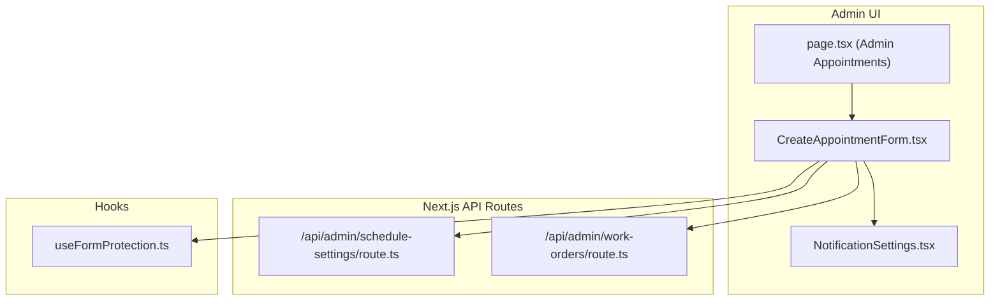
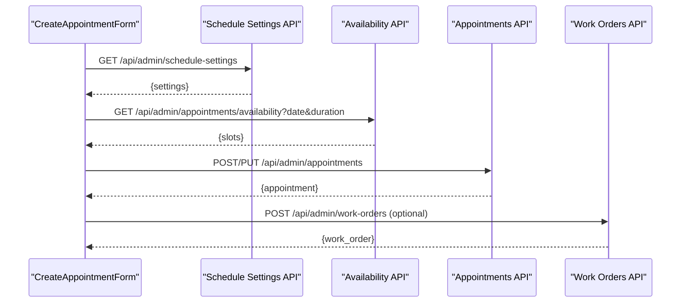
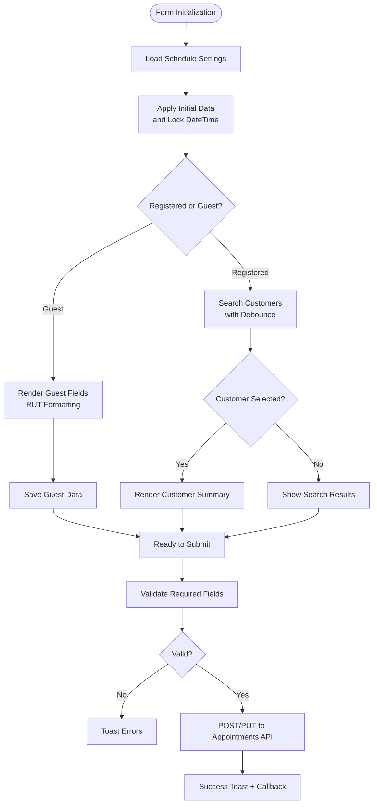
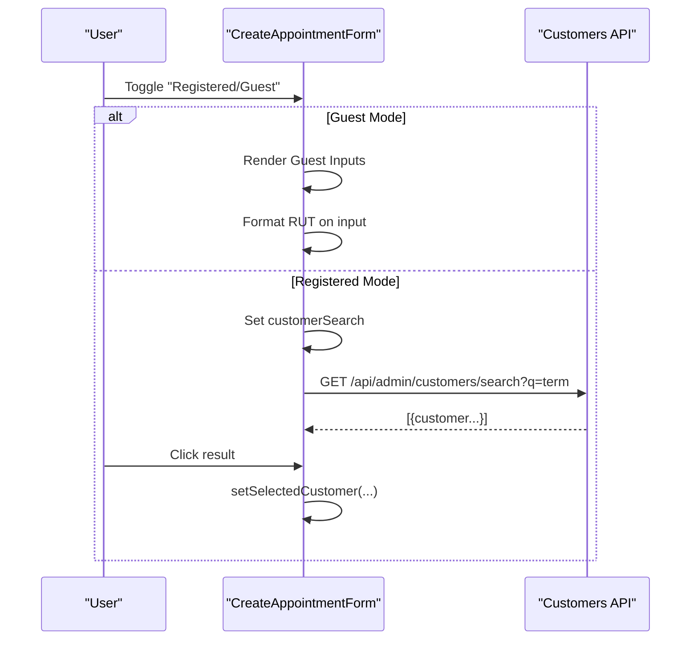
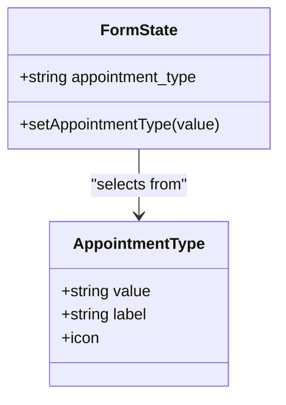
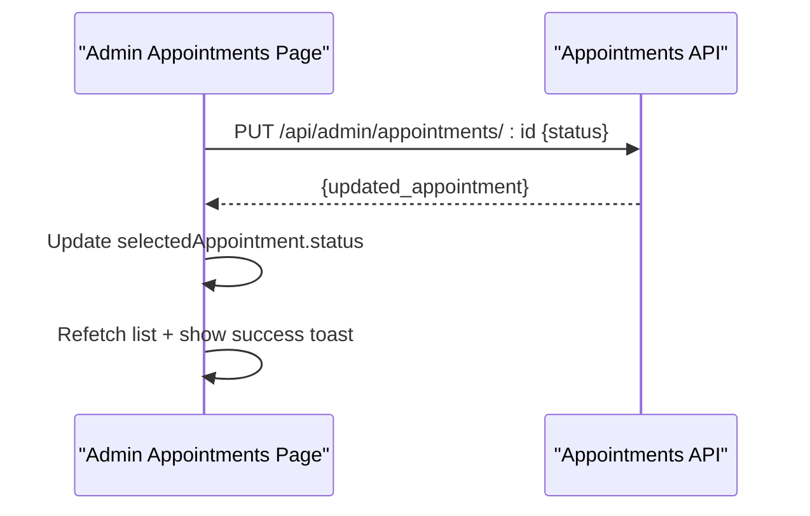
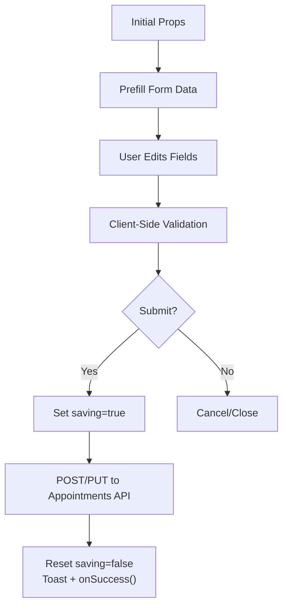
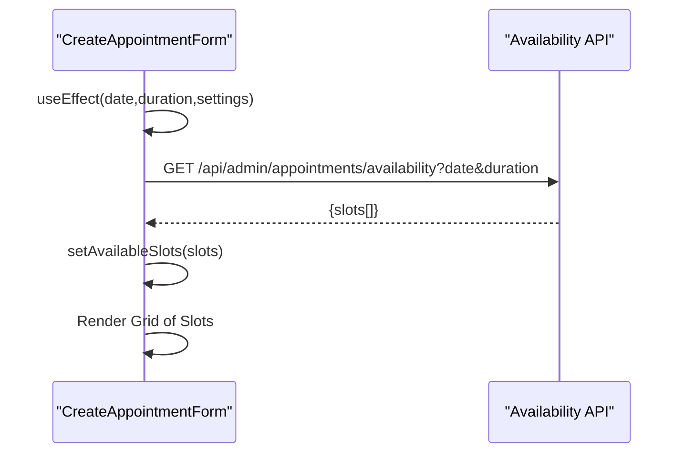
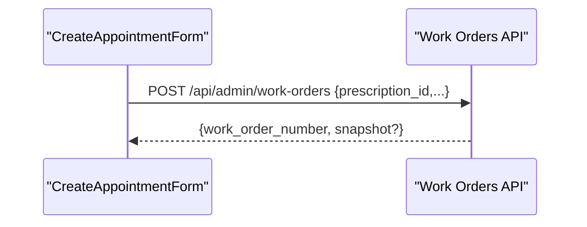
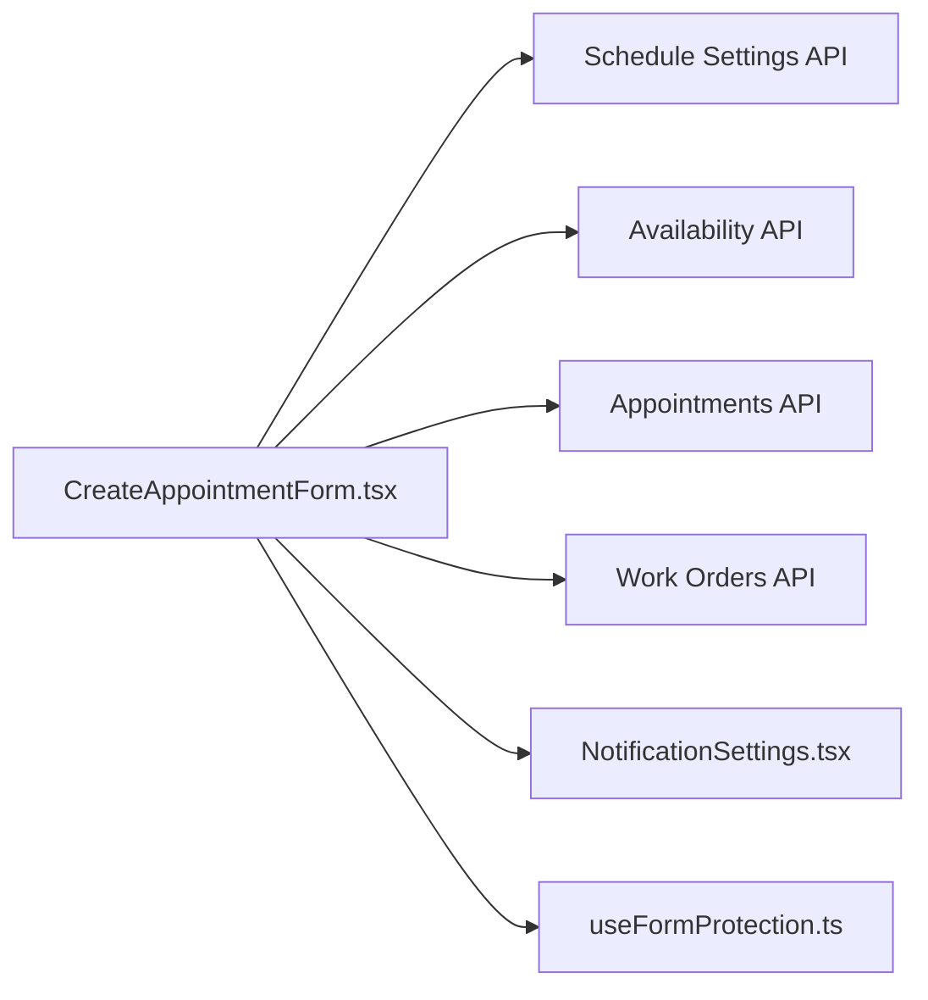

# Appointment Forms & Workflows

<cite>
**Referenced Files in This Document**
- [CreateAppointmentForm.tsx](file://src/components/admin/CreateAppointmentForm.tsx)
- [page.tsx](file://src/app/admin/appointments/page.tsx)
- [route.ts](file://src/app/api/admin/schedule-settings/route.ts)
- [route.ts](file://src/app/api/admin/work-orders/route.ts)
- [NotificationSettings.tsx](file://src/components/admin/NotificationSettings.tsx)
- [useFormProtection.ts](file://src/hooks/useFormProtection.ts)
</cite>

## Table of Contents

1. [Introduction](#introduction)
2. [Project Structure](#project-structure)
3. [Core Components](#core-components)
4. [Architecture Overview](#architecture-overview)
5. [Detailed Component Analysis](#detailed-component-analysis)
6. [Dependency Analysis](#dependency-analysis)
7. [Performance Considerations](#performance-considerations)
8. [Troubleshooting Guide](#troubleshooting-guide)
9. [Conclusion](#conclusion)
10. [Appendices](#appendices)

## Introduction

This document explains the appointment creation and management forms in the Opttius application. It covers form validation logic, customer selection workflow, appointment type categorization, status management, form state handling, conditional field rendering, auto-completion features, and real-time validation. It also documents configuration options for required fields, custom appointment types, scheduling rules, and notification preferences. Finally, it outlines integrations with the customer database, prescription linking, and work order creation, and describes common workflows such as walk-in appointments, emergency bookings, patient rescheduling, and automated reminders.

## Project Structure

The appointment forms are implemented as a client-side React component integrated with Next.js API routes for schedule settings and availability, and with backend routes for work order creation. The admin appointments page orchestrates the form lifecycle and status updates.

**Diagram sources**

- [CreateAppointmentForm.tsx](file://src/components/admin/CreateAppointmentForm.tsx#L1-L1140)
- [page.tsx](file://src/app/admin/appointments/page.tsx#L753-L767)
- [route.ts](file://src/app/api/admin/schedule-settings/route.ts#L61-L107)
- [route.ts](file://src/app/api/admin/work-orders/route.ts#L251-L275)
- [NotificationSettings.tsx](file://src/components/admin/NotificationSettings.tsx#L38-L511)
- [useFormProtection.ts](file://src/hooks/useFormProtection.ts#L167-L197)

**Section sources**

- [CreateAppointmentForm.tsx](file://src/components/admin/CreateAppointmentForm.tsx#L1-L1140)
- [page.tsx](file://src/app/admin/appointments/page.tsx#L753-L767)

## Core Components

- CreateAppointmentForm: A comprehensive form for creating and editing appointments with customer selection, date/time selection, availability lookup, appointment type, status, notes, follow-up, and submission handling.
- Admin Appointments Page: Hosts the modal/dialog containing the appointment form and manages initial data, locking date/time from calendar slots, and status updates.
- Schedule Settings API: Provides branch-specific scheduling configuration (default durations, advance booking windows, working hours).
- Work Orders API: Supports linking prescriptions to work orders and generating work order numbers.
- Notification Settings: Manages notification preferences for appointment events.
- Form Protection Hook: Handles form change detection and save state for navigation protection.

**Section sources**

- [CreateAppointmentForm.tsx](file://src/components/admin/CreateAppointmentForm.tsx#L1-L1140)
- [page.tsx](file://src/app/admin/appointments/page.tsx#L753-L767)
- [route.ts](file://src/app/api/admin/schedule-settings/route.ts#L61-L107)
- [route.ts](file://src/app/api/admin/work-orders/route.ts#L251-L275)
- [NotificationSettings.tsx](file://src/components/admin/NotificationSettings.tsx#L38-L511)
- [useFormProtection.ts](file://src/hooks/useFormProtection.ts#L167-L197)

## Architecture Overview

The form integrates with backend services via API routes. It dynamically loads schedule settings, queries availability, validates inputs, and persists appointment records. Optional fields for prescriptions and orders enable downstream workflows like work order creation.

**Diagram sources**

- [CreateAppointmentForm.tsx](file://src/components/admin/CreateAppointmentForm.tsx#L183-L305)
- [route.ts](file://src/app/api/admin/schedule-settings/route.ts#L61-L107)
- [route.ts](file://src/app/api/admin/work-orders/route.ts#L251-L275)

## Detailed Component Analysis

### CreateAppointmentForm: Validation, State, and Rendering

- Form state management:
  - Tracks customer selection (registered vs guest), schedule settings, available time slots, and form data (date, time, duration, type, status, notes, reason, follow-up).
  - Uses effect hooks to load schedule settings, fetch availability when date/duration change, and prefill from initial data.
- Validation logic:
  - Enforces required fields: customer selection (registered or guest), date, and time.
  - Guest mode requires name, last name, and RUT; registered mode requires a selected customer.
  - Normalizes time to HH:MM:SS format before submission.
- Conditional rendering:
  - Customer panel toggles between registered and guest modes.
  - Time slot grid appears only when a date is selected and availability is loaded.
  - Follow-up section conditionally renders when follow-up is required.
  - Date picker respects minimum/maximum dates derived from schedule settings.
- Auto-completion and search:
  - Debounced customer search endpoint returns matching customers for quick selection.
  - Selected customer displays a summary card with contact info and a change action.
- Submission handling:
  - Builds request payload with either guest_customer or customer_id.
  - Calls the appropriate endpoint (create or update) and shows success/error feedback.
- Real-time validation:
  - Availability fetch triggers on date/duration changes.
  - Date picker prevents past dates and enforces min/max windows.
  - Slot buttons reflect availability and lock behavior when opened from calendar.

**Diagram sources**

- [CreateAppointmentForm.tsx](file://src/components/admin/CreateAppointmentForm.tsx#L123-L181)
- [CreateAppointmentForm.tsx](file://src/components/admin/CreateAppointmentForm.tsx#L308-L333)
- [CreateAppointmentForm.tsx](file://src/components/admin/CreateAppointmentForm.tsx#L335-L470)

**Section sources**

- [CreateAppointmentForm.tsx](file://src/components/admin/CreateAppointmentForm.tsx#L1-L1140)

### Customer Selection Workflow

- Registered customer mode:
  - Input field with search icon and debounced query to the customer search endpoint.
  - Dropdown lists matching customers; selecting one sets the selected customer and clears search.
- Guest customer mode:
  - Toggle switches to guest mode; renders fields for first name, last name, RUT (auto-formatted), phone, and email.
  - On toggle, clears previous selections and resets guest data.

**Diagram sources**

- [CreateAppointmentForm.tsx](file://src/components/admin/CreateAppointmentForm.tsx#L515-L751)
- [CreateAppointmentForm.tsx](file://src/components/admin/CreateAppointmentForm.tsx#L308-L333)

**Section sources**

- [CreateAppointmentForm.tsx](file://src/components/admin/CreateAppointmentForm.tsx#L515-L751)

### Appointment Type Categorization

- Appointment types are defined as a list with values, labels, and icons.
- The form exposes a dropdown to select the appointment type, enabling categorization for reporting and automation.

**Diagram sources**

- [CreateAppointmentForm.tsx](file://src/components/admin/CreateAppointmentForm.tsx#L111-L120)
- [CreateAppointmentForm.tsx](file://src/components/admin/CreateAppointmentForm.tsx#L949-L977)

**Section sources**

- [CreateAppointmentForm.tsx](file://src/components/admin/CreateAppointmentForm.tsx#L111-L120)
- [CreateAppointmentForm.tsx](file://src/components/admin/CreateAppointmentForm.tsx#L949-L977)

### Status Management

- The form initializes with a default status and allows changing it via a dropdown.
- The admin appointments page demonstrates updating status via a PUT request and reflects the change in the UI.

**Diagram sources**

- [page.tsx](file://src/app/admin/appointments/page.tsx#L911-L930)

**Section sources**

- [CreateAppointmentForm.tsx](file://src/components/admin/CreateAppointmentForm.tsx#L989-L1024)
- [page.tsx](file://src/app/admin/appointments/page.tsx#L911-L930)

### Form State Management and Persistence

- Form state is centralized in component state with controlled inputs.
- Initial data prop supports prefilling date/time and other fields.
- Saving/loading flags prevent concurrent submissions and indicate loading states.
- The form posts to either create or update endpoints depending on whether an ID exists.

**Diagram sources**

- [CreateAppointmentForm.tsx](file://src/components/admin/CreateAppointmentForm.tsx#L90-L109)
- [CreateAppointmentForm.tsx](file://src/components/admin/CreateAppointmentForm.tsx#L335-L470)

**Section sources**

- [CreateAppointmentForm.tsx](file://src/components/admin/CreateAppointmentForm.tsx#L90-L109)
- [CreateAppointmentForm.tsx](file://src/components/admin/CreateAppointmentForm.tsx#L335-L470)

### Availability and Time Slot Rendering

- Availability is fetched when a date and duration are set and schedule settings are loaded.
- The UI renders a grid of available time slots; unavailable slots are visually indicated.
- When locked from calendar, only the selected slot is clickable.

**Diagram sources**

- [CreateAppointmentForm.tsx](file://src/components/admin/CreateAppointmentForm.tsx#L137-L158)
- [CreateAppointmentForm.tsx](file://src/components/admin/CreateAppointmentForm.tsx#L227-L305)

**Section sources**

- [CreateAppointmentForm.tsx](file://src/components/admin/CreateAppointmentForm.tsx#L137-L158)
- [CreateAppointmentForm.tsx](file://src/components/admin/CreateAppointmentForm.tsx#L227-L305)

### Prescription Linking and Work Order Creation

- The form supports linking a prescription ID and an order ID to the appointment.
- Work order creation can be triggered later and uses a dedicated API route that generates a work order number and snapshots the prescription if provided.

**Diagram sources**

- [CreateAppointmentForm.tsx](file://src/components/admin/CreateAppointmentForm.tsx#L107-L109)
- [route.ts](file://src/app/api/admin/work-orders/route.ts#L251-L275)

**Section sources**

- [CreateAppointmentForm.tsx](file://src/components/admin/CreateAppointmentForm.tsx#L107-L109)
- [route.ts](file://src/app/api/admin/work-orders/route.ts#L251-L275)

### Notification Preferences

- Notification settings include appointment-related types such as new appointment, cancelled appointment, and others.
- Administrators can enable/disable types and set priorities.

**Section sources**

- [NotificationSettings.tsx](file://src/components/admin/NotificationSettings.tsx#L38-L511)

### Form Protection and Navigation Guard

- The form protection hook tracks changes, marks saving states, and allows navigation during save.
- Useful for preventing accidental navigation away from an unsaved form.

**Section sources**

- [useFormProtection.ts](file://src/hooks/useFormProtection.ts#L167-L197)

## Dependency Analysis

- CreateAppointmentForm depends on:
  - Schedule settings API for default durations and booking windows.
  - Availability API for real-time slot discovery.
  - Appointments API for create/update operations.
  - Work Orders API for optional downstream workflows.
  - Notification settings for event-driven alerts.
  - Form protection hook for UX around save state.

**Diagram sources**

- [CreateAppointmentForm.tsx](file://src/components/admin/CreateAppointmentForm.tsx#L183-L305)
- [route.ts](file://src/app/api/admin/schedule-settings/route.ts#L61-L107)
- [route.ts](file://src/app/api/admin/work-orders/route.ts#L251-L275)
- [NotificationSettings.tsx](file://src/components/admin/NotificationSettings.tsx#L38-L511)
- [useFormProtection.ts](file://src/hooks/useFormProtection.ts#L167-L197)

**Section sources**

- [CreateAppointmentForm.tsx](file://src/components/admin/CreateAppointmentForm.tsx#L183-L305)
- [route.ts](file://src/app/api/admin/schedule-settings/route.ts#L61-L107)
- [route.ts](file://src/app/api/admin/work-orders/route.ts#L251-L275)
- [NotificationSettings.tsx](file://src/components/admin/NotificationSettings.tsx#L38-L511)
- [useFormProtection.ts](file://src/hooks/useFormProtection.ts#L167-L197)

## Performance Considerations

- Debounced customer search reduces network requests during typing.
- Availability fetch is gated by presence of date and schedule settings to avoid unnecessary calls.
- Loading states (availability, saving) improve perceived responsiveness.
- Consider caching recent availability results per date to minimize repeated fetches.

## Troubleshooting Guide

- Availability returns empty:
  - Verify schedule settings are loaded and the date is within allowed min/max windows.
  - Check backend availability calculation for conflicts or closed slots.
- Past date selected:
  - The date picker enforces minimum dates based on schedule settings; ensure settings are loaded before selection.
- Guest RUT formatting:
  - The form auto-formats RUT; ensure input follows supported patterns.
- Submission errors:
  - Inspect toast messages and backend error responses for missing required fields or invalid data.
- Status update failures:
  - Confirm the appointment exists and the request payload includes a valid status value.

**Section sources**

- [CreateAppointmentForm.tsx](file://src/components/admin/CreateAppointmentForm.tsx#L778-L783)
- [CreateAppointmentForm.tsx](file://src/components/admin/CreateAppointmentForm.tsx#L292-L297)
- [CreateAppointmentForm.tsx](file://src/components/admin/CreateAppointmentForm.tsx#L447-L450)

## Conclusion

The appointment creation and management forms provide a robust, configurable interface for scheduling optical services. They integrate with schedule settings, real-time availability, customer search, and optional work order creation. Administrators can tailor appointment types, statuses, and notification preferences to streamline workflows for walk-in patients, emergency bookings, rescheduling, and automated reminders.

## Appendices

### Configuration Options

- Required fields:
  - Customer selection (registered or guest), date, and time are mandatory.
- Custom appointment types:
  - Extend the appointment types list with new values and icons.
- Practitioner assignment rules:
  - The form includes an assigned_to field; implement backend rules to enforce availability and specialization.
- Notification preferences:
  - Configure appointment-related notification types and priorities in the notification settings component.

**Section sources**

- [CreateAppointmentForm.tsx](file://src/components/admin/CreateAppointmentForm.tsx#L111-L120)
- [CreateAppointmentForm.tsx](file://src/components/admin/CreateAppointmentForm.tsx#L101-L102)
- [NotificationSettings.tsx](file://src/components/admin/NotificationSettings.tsx#L38-L511)

### Common Workflows

- Walk-in appointments:
  - Enable guest customer mode and prefill minimal fields; optionally link to a future order.
- Emergency bookings:
  - Use the emergency appointment type; consider reducing minimum advance booking hours in schedule settings.
- Patient rescheduling:
  - Open the existing appointment, adjust date/time, and update status accordingly.
- Automated reminders:
  - Configure notification preferences for appointment-related events; integrate with external systems if needed.

**Section sources**

- [CreateAppointmentForm.tsx](file://src/components/admin/CreateAppointmentForm.tsx#L118-L118)
- [NotificationSettings.tsx](file://src/components/admin/NotificationSettings.tsx#L38-L511)
