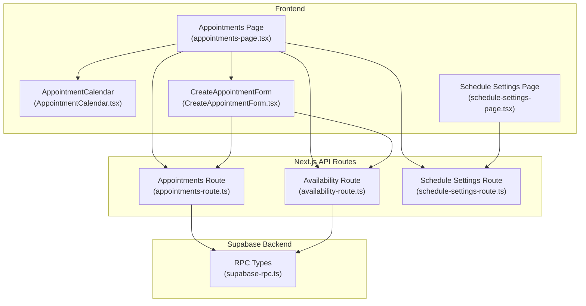
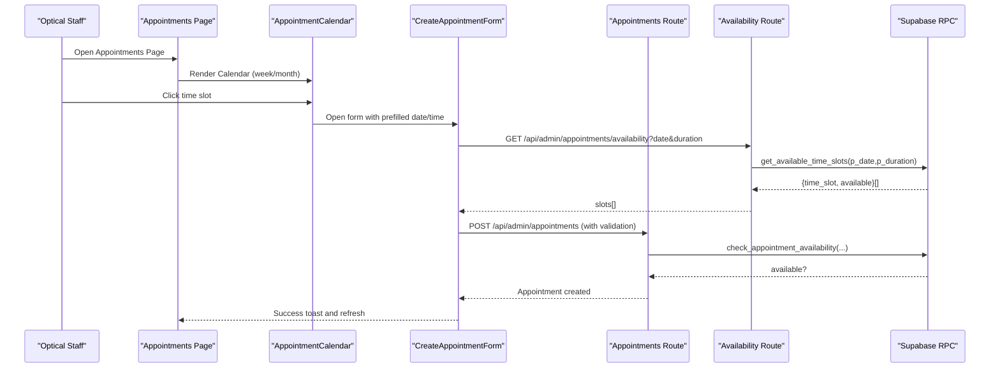
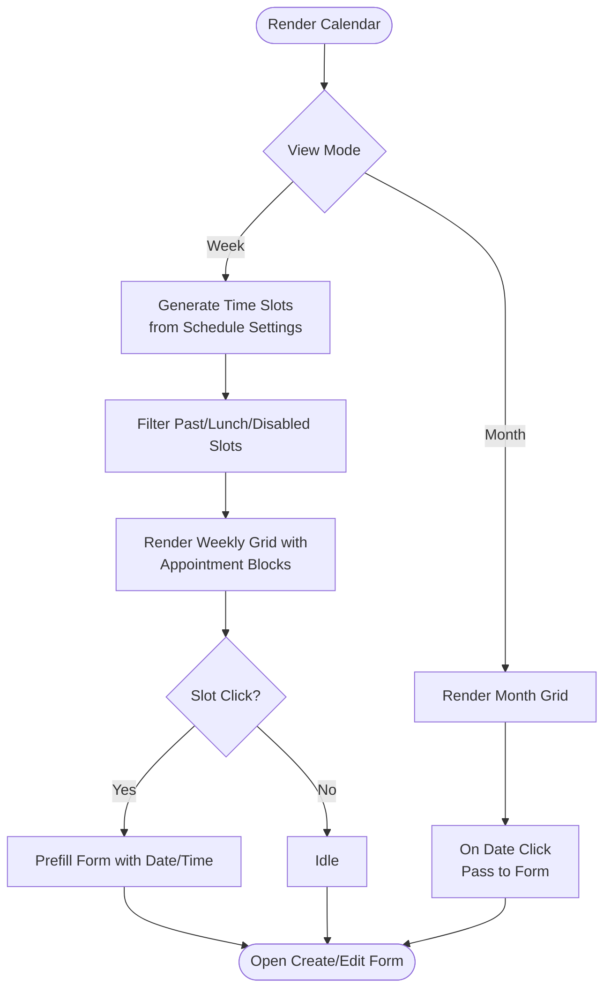
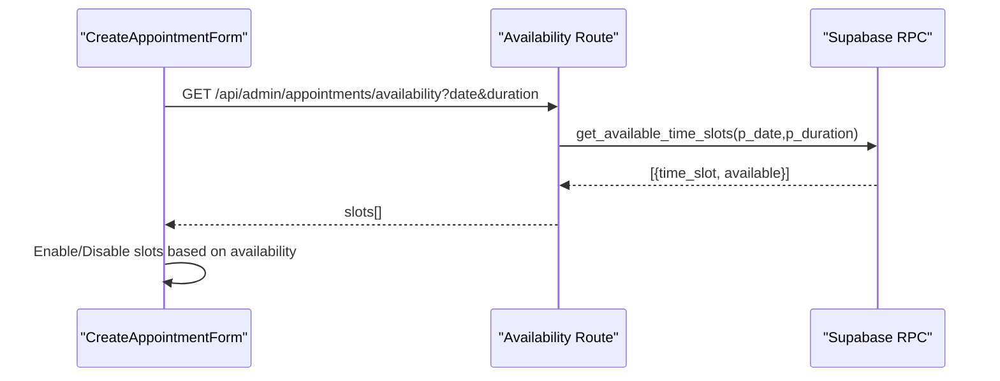
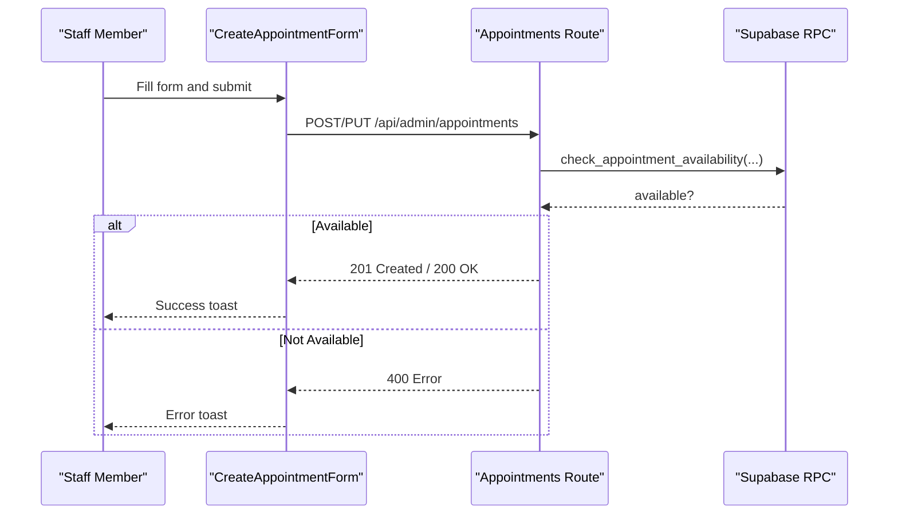
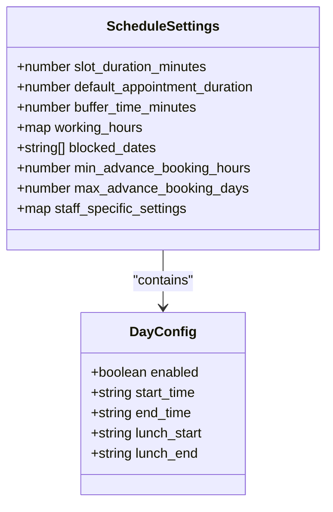
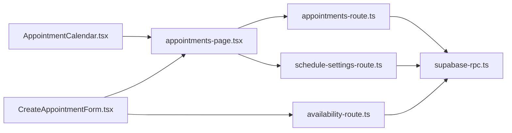

# Appointment Management

<cite>
**Referenced Files in This Document**
- [AppointmentCalendar.tsx](file://src/components/admin/AppointmentCalendar.tsx)
- [CreateAppointmentForm.tsx](file://src/components/admin/CreateAppointmentForm.tsx)
- [appointments-page.tsx](file://src/app/admin/appointments/page.tsx)
- [appointments-route.ts](file://src/app/api/admin/appointments/route.ts)
- [availability-route.ts](file://src/app/api/admin/appointments/availability/route.ts)
- [schedule-settings-route.ts](file://src/app/api/admin/schedule-settings/route.ts)
- [schedule-settings-page.tsx](file://src/app/admin/appointments/settings/page.tsx)
- [supabase-rpc.ts](file://src/types/supabase-rpc.ts)
</cite>

## Table of Contents

1. [Introduction](#introduction)
2. [Project Structure](#project-structure)
3. [Core Components](#core-components)
4. [Architecture Overview](#architecture-overview)
5. [Detailed Component Analysis](#detailed-component-analysis)
6. [Dependency Analysis](#dependency-analysis)
7. [Performance Considerations](#performance-considerations)
8. [Troubleshooting Guide](#troubleshooting-guide)
9. [Conclusion](#conclusion)

## Introduction

This document explains the appointment management system in Opttius, focusing on the calendar interface, availability checking, and scheduling workflows. It covers how appointments are created, edited, canceled, and rescheduled, and documents configuration options for business hours, appointment duration, buffer times, and blackout dates. It also clarifies relationships with customer profiles, practitioner availability, and branch-level scheduling. The content is designed to be accessible to optical staff while providing technical implementation details for developers extending the system.

## Project Structure

The appointment management system spans frontend components, Next.js API routes, and Supabase RPC functions:

- Frontend pages and components render the calendar, manage forms, and orchestrate user interactions.
- API routes handle CRUD operations, availability checks, and schedule settings persistence.
- Supabase RPC functions encapsulate backend logic for availability and time-slot generation.

**Diagram sources**

- [appointments-page.tsx](file://src/app/admin/appointments/page.tsx#L112-L728)
- [AppointmentCalendar.tsx](file://src/components/admin/AppointmentCalendar.tsx#L72-L630)
- [CreateAppointmentForm.tsx](file://src/components/admin/CreateAppointmentForm.tsx#L47-L800)
- [schedule-settings-page.tsx](file://src/app/admin/appointments/settings/page.tsx#L53-L633)
- [appointments-route.ts](file://src/app/api/admin/appointments/route.ts#L23-L640)
- [availability-route.ts](file://src/app/api/admin/appointments/availability/route.ts#L14-L172)
- [schedule-settings-route.ts](file://src/app/api/admin/schedule-settings/route.ts#L8-L334)
- [supabase-rpc.ts](file://src/types/supabase-rpc.ts#L101-L147)

**Section sources**

- [appointments-page.tsx](file://src/app/admin/appointments/page.tsx#L112-L728)
- [AppointmentCalendar.tsx](file://src/components/admin/AppointmentCalendar.tsx#L72-L630)
- [CreateAppointmentForm.tsx](file://src/components/admin/CreateAppointmentForm.tsx#L47-L800)
- [schedule-settings-page.tsx](file://src/app/admin/appointments/settings/page.tsx#L53-L633)
- [appointments-route.ts](file://src/app/api/admin/appointments/route.ts#L23-L640)
- [availability-route.ts](file://src/app/api/admin/appointments/availability/route.ts#L14-L172)
- [schedule-settings-route.ts](file://src/app/api/admin/schedule-settings/route.ts#L8-L334)
- [supabase-rpc.ts](file://src/types/supabase-rpc.ts#L101-L147)

## Core Components

- Calendar interface renders weekly and monthly views, displays appointments, and enables quick creation via slot clicks.
- Availability checker computes available time slots for a given date and duration, integrating with schedule settings.
- Schedule settings define business hours, blackout dates, and booking constraints per branch.
- Appointment creation/editing form validates inputs, formats time, and persists data via API routes.

Key responsibilities:

- Calendar: generate time slots, enforce working hours/lunch breaks, and render appointment blocks.
- Availability: call RPC to compute available slots and surface them to the form.
- Settings: store and sync branch-specific schedule configurations.
- API: validate, authorize, and persist appointments; trigger notifications and emails.

**Section sources**

- [AppointmentCalendar.tsx](file://src/components/admin/AppointmentCalendar.tsx#L72-L630)
- [CreateAppointmentForm.tsx](file://src/components/admin/CreateAppointmentForm.tsx#L47-L800)
- [schedule-settings-page.tsx](file://src/app/admin/appointments/settings/page.tsx#L53-L633)
- [appointments-route.ts](file://src/app/api/admin/appointments/route.ts#L205-L640)
- [availability-route.ts](file://src/app/api/admin/appointments/availability/route.ts#L14-L172)
- [schedule-settings-route.ts](file://src/app/api/admin/schedule-settings/route.ts#L8-L334)

## Architecture Overview

The system follows a layered architecture:

- UI layer: React components and Next.js app router pages.
- API layer: Next.js routes handling requests/responses and branch-aware authorization.
- Data layer: Supabase tables and RPC functions for availability and time-slot computation.

**Diagram sources**

- [appointments-page.tsx](file://src/app/admin/appointments/page.tsx#L401-L412)
- [AppointmentCalendar.tsx](file://src/components/admin/AppointmentCalendar.tsx#L401-L425)
- [CreateAppointmentForm.tsx](file://src/components/admin/CreateAppointmentForm.tsx#L227-L305)
- [availability-route.ts](file://src/app/api/admin/appointments/availability/route.ts#L14-L172)
- [appointments-route.ts](file://src/app/api/admin/appointments/route.ts#L309-L421)
- [supabase-rpc.ts](file://src/types/supabase-rpc.ts#L125-L147)

## Detailed Component Analysis

### Calendar Interface

The calendar renders two views:

- Weekly grid with time slots aligned to schedule settings, highlighting past/present slots and clickable free time.
- Monthly grid showing daily appointment indicators and allowing date selection.

Rendering logic:

- Generates time slots from schedule settings or defaults.
- Enforces working hours, lunch breaks, and blackout dates.
- Renders appointment blocks sized by duration and positioned by start time.
- Supports click-to-create flow by passing selected date/time to the form.

**Diagram sources**

- [AppointmentCalendar.tsx](file://src/components/admin/AppointmentCalendar.tsx#L83-L143)
- [AppointmentCalendar.tsx](file://src/components/admin/AppointmentCalendar.tsx#L146-L211)
- [AppointmentCalendar.tsx](file://src/components/admin/AppointmentCalendar.tsx#L342-L523)
- [AppointmentCalendar.tsx](file://src/components/admin/AppointmentCalendar.tsx#L525-L628)

**Section sources**

- [AppointmentCalendar.tsx](file://src/components/admin/AppointmentCalendar.tsx#L72-L630)

### Availability Checking and Time Slot Validation

Availability is computed via:

- An API endpoint that calls a Supabase RPC to return available time slots for a given date and duration.
- The form consumes these slots to enable/disable selections and guide the user.

**Diagram sources**

- [CreateAppointmentForm.tsx](file://src/components/admin/CreateAppointmentForm.tsx#L227-L305)
- [availability-route.ts](file://src/app/api/admin/appointments/availability/route.ts#L61-L69)
- [supabase-rpc.ts](file://src/types/supabase-rpc.ts#L125-L147)

**Section sources**

- [CreateAppointmentForm.tsx](file://src/components/admin/CreateAppointmentForm.tsx#L227-L305)
- [availability-route.ts](file://src/app/api/admin/appointments/availability/route.ts#L14-L172)
- [supabase-rpc.ts](file://src/types/supabase-rpc.ts#L125-L147)

### Scheduling Workflows: Create, Edit, Cancel, Reschedule

- Create: The form posts to the appointments route, which validates inputs, checks availability via RPC, and inserts the record. Notifications and emails are triggered asynchronously.
- Edit: The form reuses the same endpoint with a PUT request to update an existing appointment.
- Cancel/Reschedule: The same form supports editing existing appointments; cancellation is handled by updating status and optionally adding a cancellation reason.

**Diagram sources**

- [CreateAppointmentForm.tsx](file://src/components/admin/CreateAppointmentForm.tsx#L335-L470)
- [appointments-route.ts](file://src/app/api/admin/appointments/route.ts#L205-L640)
- [supabase-rpc.ts](file://src/types/supabase-rpc.ts#L101-L122)

**Section sources**

- [CreateAppointmentForm.tsx](file://src/components/admin/CreateAppointmentForm.tsx#L335-L470)
- [appointments-route.ts](file://src/app/api/admin/appointments/route.ts#L205-L640)

### Configuration Options: Business Hours, Durations, Buffer Times, Blackout Dates

Schedule settings include:

- Slot duration (visual grid spacing)
- Default appointment duration (applies to new appointments)
- Min/max advance booking windows
- Working hours per day (including lunch breaks)
- Blocked dates (non-working dates)
- Optional staff-specific overrides

These settings are persisted per branch and can be synchronized globally by super admins.

**Diagram sources**

- [schedule-settings-page.tsx](file://src/app/admin/appointments/settings/page.tsx#L27-L51)
- [schedule-settings-route.ts](file://src/app/api/admin/schedule-settings/route.ts#L64-L124)

**Section sources**

- [schedule-settings-page.tsx](file://src/app/admin/appointments/settings/page.tsx#L53-L633)
- [schedule-settings-route.ts](file://src/app/api/admin/schedule-settings/route.ts#L8-L334)

### Relationships with Customers, Practitioners, and Branches

- Customer profiles: Registered customers are linked via customer_id; guests are supported with temporary data stored on the appointment record.
- Practitioner assignment: Appointments can be assigned to staff members; availability checks can target specific practitioners.
- Branch scoping: All operations are filtered by branch context; super admins can manage global defaults and synchronize settings across branches.

**Section sources**

- [CreateAppointmentForm.tsx](file://src/components/admin/CreateAppointmentForm.tsx#L423-L457)
- [appointments-route.ts](file://src/app/api/admin/appointments/route.ts#L282-L297)
- [schedule-settings-route.ts](file://src/app/api/admin/schedule-settings/route.ts#L198-L252)

### Common Scheduling Scenarios

- Walk-in patients: Use the guest customer mode to capture minimal information at booking time; formal registration occurs upon service completion.
- Emergency appointments: Use the “emergency” appointment type; the system enforces availability checks and respects branch constraints.
- Recurring visits: While the calendar does not expose recurring series creation, practitioners can create multiple single appointments for repeated visits.

**Section sources**

- [CreateAppointmentForm.tsx](file://src/components/admin/CreateAppointmentForm.tsx#L69-L80)
- [CreateAppointmentForm.tsx](file://src/components/admin/CreateAppointmentForm.tsx#L111-L120)
- [appointments-page.tsx](file://src/app/admin/appointments/page.tsx#L237-L263)

## Dependency Analysis

The system exhibits clear separation of concerns:

- UI components depend on API routes for data and actions.
- API routes depend on Supabase RPC functions for availability computations.
- Schedule settings are shared across components and enforced by the backend.

**Diagram sources**

- [appointments-page.tsx](file://src/app/admin/appointments/page.tsx#L45-L73)
- [AppointmentCalendar.tsx](file://src/components/admin/AppointmentCalendar.tsx#L72-L80)
- [CreateAppointmentForm.tsx](file://src/components/admin/CreateAppointmentForm.tsx#L47-L53)
- [availability-route.ts](file://src/app/api/admin/appointments/availability/route.ts#L14-L172)
- [appointments-route.ts](file://src/app/api/admin/appointments/route.ts#L23-L640)
- [schedule-settings-route.ts](file://src/app/api/admin/schedule-settings/route.ts#L8-L334)
- [supabase-rpc.ts](file://src/types/supabase-rpc.ts#L101-L147)

**Section sources**

- [appointments-page.tsx](file://src/app/admin/appointments/page.tsx#L45-L73)
- [CreateAppointmentForm.tsx](file://src/components/admin/CreateAppointmentForm.tsx#L47-L53)
- [appointments-route.ts](file://src/app/api/admin/appointments/route.ts#L23-L640)
- [availability-route.ts](file://src/app/api/admin/appointments/availability/route.ts#L14-L172)
- [schedule-settings-route.ts](file://src/app/api/admin/schedule-settings/route.ts#L8-L334)
- [supabase-rpc.ts](file://src/types/supabase-rpc.ts#L101-L147)

## Performance Considerations

- Calendar rendering: Time slot generation and filtering are computed client-side; keep schedule settings concise to minimize DOM updates.
- Availability API: Batch requests and caching can reduce network overhead; debounce customer search and availability fetches.
- Branch scoping: Ensure branch filters are applied early to limit dataset sizes on the backend.
- Notifications and emails: Non-blocking asynchronous tasks prevent UI delays.

## Troubleshooting Guide

Common issues and resolutions:

- Unavailable slot errors: Verify schedule settings (working hours, lunch breaks, blocked dates) and ensure the selected duration aligns with slot granularity.
- Missing branch context: Super admins must select a branch when creating appointments; otherwise, the system requires a default branch for non-super admins.
- Guest customer validation: Ensure required fields (name, last name, RUT) are provided when using guest mode.
- Time formatting: The system normalizes time to HH:MM:SS; ensure inputs conform to expected formats.

**Section sources**

- [CreateAppointmentForm.tsx](file://src/components/admin/CreateAppointmentForm.tsx#L335-L470)
- [appointments-route.ts](file://src/app/api/admin/appointments/route.ts#L282-L297)
- [availability-route.ts](file://src/app/api/admin/appointments/availability/route.ts#L46-L51)

## Conclusion

Opttius provides a robust, branch-aware appointment management system with a responsive calendar, precise availability checks, and flexible scheduling settings. Optical staff can efficiently book, edit, and manage appointments, while developers can extend functionality through the documented APIs and RPC integrations.
