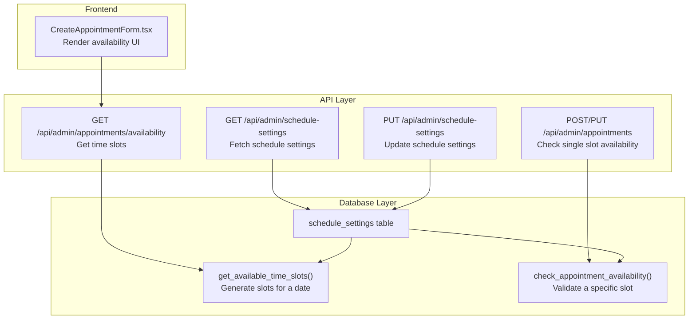
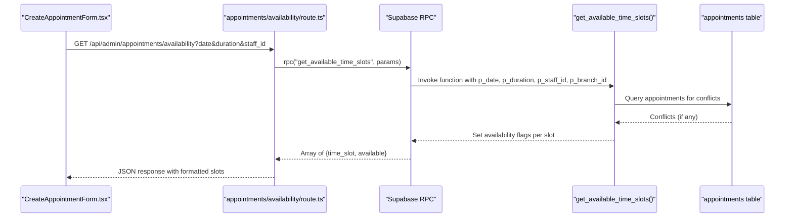
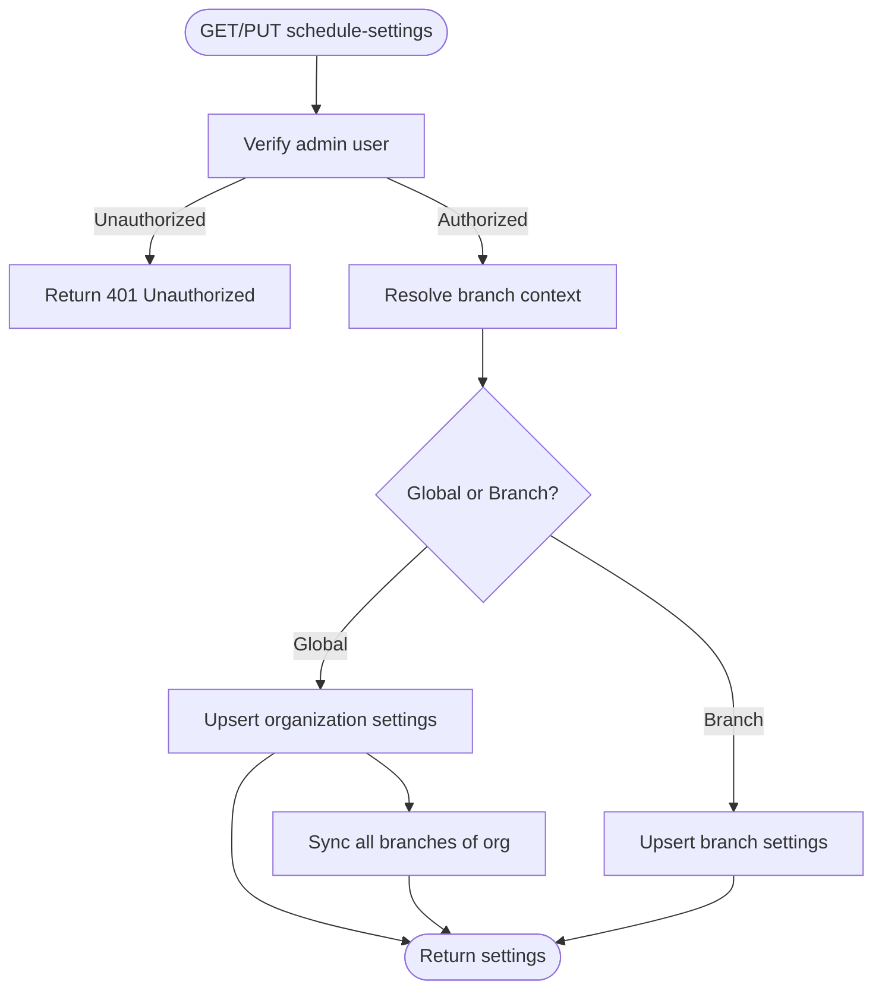
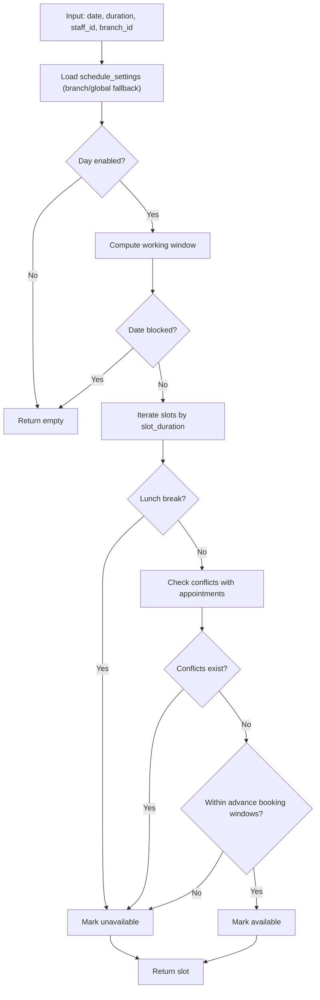
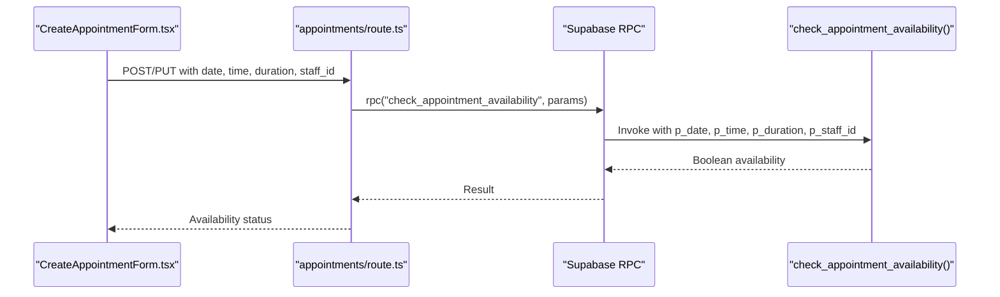
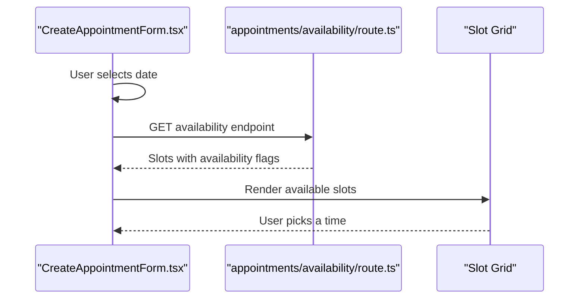
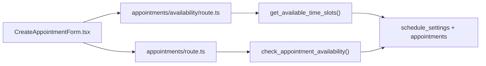

# Availability Management

<cite>
**Referenced Files in This Document**
- [schedule-settings/route.ts](file://src/app/api/admin/schedule-settings/route.ts)
- [appointments/availability/route.ts](file://src/app/api/admin/appointments/availability/route.ts)
- [appointments/route.ts](file://src/app/api/admin/appointments/route.ts)
- [CreateAppointmentForm.tsx](file://src/components/admin/CreateAppointmentForm.tsx)
- [create_schedule_settings_system.sql](file://supabase/migrations/20250126000000_create_schedule_settings_system.sql)
- [update_get_available_time_slots_for_branches.sql](file://supabase/migrations/20251216000005_update_get_available_time_slots_for_branches.sql)
- [fix_get_available_time_slots_past_filtering.sql](file://supabase/migrations/20250127000004_fix_get_available_time_slots_past_filtering.sql)
- [debug_check_appointment_availability.sql](file://supabase/migrations/20250127000002_debug_check_appointment_availability.sql)
</cite>

## Table of Contents

1. [Introduction](#introduction)
2. [Project Structure](#project-structure)
3. [Core Components](#core-components)
4. [Architecture Overview](#architecture-overview)
5. [Detailed Component Analysis](#detailed-component-analysis)
6. [Dependency Analysis](#dependency-analysis)
7. [Performance Considerations](#performance-considerations)
8. [Troubleshooting Guide](#troubleshooting-guide)
9. [Conclusion](#conclusion)

## Introduction

This document explains the availability management system that powers practitioner scheduling, resource allocation, and capacity planning. It covers how availability slots are generated, validated, and filtered; how configuration controls daily schedules, weekly patterns, holidays, and advance booking windows; and how the system integrates with staff rosters, equipment, and location-specific constraints. Advanced scenarios such as part-time scheduling, shift coverage, cross-training, and overtime are addressed through configuration options and branching logic.

## Project Structure

The availability system spans three primary areas:

- API routes that expose schedule settings and availability queries
- Database schema and stored procedures that compute slot availability
- Frontend components that render and consume availability data

**Diagram sources**

- [schedule-settings/route.ts](file://src/app/api/admin/schedule-settings/route.ts#L8-L135)
- [schedule-settings/route.ts](file://src/app/api/admin/schedule-settings/route.ts#L137-L334)
- [appointments/availability/route.ts](file://src/app/api/admin/appointments/availability/route.ts#L14-L171)
- [appointments/route.ts](file://src/app/api/admin/appointments/route.ts#L337-L406)
- [create_schedule_settings_system.sql](file://supabase/migrations/20250126000000_create_schedule_settings_system.sql#L6-L40)
- [create_schedule_settings_system.sql](file://supabase/migrations/20250126000000_create_schedule_settings_system.sql#L46-L153)
- [create_schedule_settings_system.sql](file://supabase/migrations/20250126000000_create_schedule_settings_system.sql#L156-L251)

**Section sources**

- [schedule-settings/route.ts](file://src/app/api/admin/schedule-settings/route.ts#L8-L135)
- [schedule-settings/route.ts](file://src/app/api/admin/schedule-settings/route.ts#L137-L334)
- [appointments/availability/route.ts](file://src/app/api/admin/appointments/availability/route.ts#L14-L171)
- [appointments/route.ts](file://src/app/api/admin/appointments/route.ts#L337-L406)
- [create_schedule_settings_system.sql](file://supabase/migrations/20250126000000_create_schedule_settings_system.sql#L6-L40)

## Core Components

- Schedule settings API: Retrieves and updates branch- or organization-wide scheduling configuration, including slot duration, working hours, blocked dates, and advance booking limits.
- Availability API: Returns time slots for a given date with availability flags, honoring working hours, blocked dates, and existing appointments.
- Database functions: Compute slot availability using configurable working hours, handle overlap detection, enforce advance booking windows, and support branch-level overrides.
- Frontend integration: Renders available slots and guides selection based on real-time availability.

Key configuration options:

- Slot duration (minutes)
- Default appointment duration (minutes)
- Buffer time between appointments (minutes)
- Working hours per day (enabled, start/end, optional lunch break)
- Blocked dates (holidays, special closures)
- Minimum advance booking hours
- Maximum advance booking days
- Staff-specific settings (per-staff working hours and blocked dates)

**Section sources**

- [schedule-settings/route.ts](file://src/app/api/admin/schedule-settings/route.ts#L8-L135)
- [schedule-settings/route.ts](file://src/app/api/admin/schedule-settings/route.ts#L137-L334)
- [create_schedule_settings_system.sql](file://supabase/migrations/20250126000000_create_schedule_settings_system.sql#L10-L34)

## Architecture Overview

The system follows a layered architecture:

- Presentation: Admin UI components request availability and display slots.
- API: Route handlers validate permissions, resolve branch context, and call database functions.
- Data: Stored procedures encapsulate scheduling logic and return computed availability.

**Diagram sources**

- [appointments/availability/route.ts](file://src/app/api/admin/appointments/availability/route.ts#L61-L69)
- [update_get_available_time_slots_for_branches.sql](file://supabase/migrations/20251216000005_update_get_available_time_slots_for_branches.sql#L115-L133)
- [create_schedule_settings_system.sql](file://supabase/migrations/20250126000000_create_schedule_settings_system.sql#L111-L130)

## Detailed Component Analysis

### Schedule Settings Management

The schedule settings API supports:

- Fetching current settings with branch-aware fallback
- Updating settings globally (super admin) or per branch
- Upsert logic to create or update records with proper conflict handling

Implementation highlights:

- Admin authorization via RPC
- Branch context resolution
- Global vs branch-specific upsert with organization sync for super admins
- Default settings returned when no record exists

**Diagram sources**

- [schedule-settings/route.ts](file://src/app/api/admin/schedule-settings/route.ts#L8-L135)
- [schedule-settings/route.ts](file://src/app/api/admin/schedule-settings/route.ts#L137-L334)

**Section sources**

- [schedule-settings/route.ts](file://src/app/api/admin/schedule-settings/route.ts#L8-L135)
- [schedule-settings/route.ts](file://src/app/api/admin/schedule-settings/route.ts#L137-L334)

### Availability Slot Generation and Filtering

The availability API computes slots for a given date:

- Validates required parameters
- Calls the database function with branch context
- Normalizes time formats and availability flags
- Returns a list of time slots with availability booleans

The database function performs:

- Day-of-week lookup against working hours JSONB
- Lunch break exclusion
- Overlap checks with confirmed/scheduled appointments
- Advance booking constraints (minimum and maximum windows)
- Branch-level settings fallback logic

**Diagram sources**

- [appointments/availability/route.ts](file://src/app/api/admin/appointments/availability/route.ts#L61-L69)
- [update_get_available_time_slots_for_branches.sql](file://supabase/migrations/20251216000005_update_get_available_time_slots_for_branches.sql#L100-L155)
- [create_schedule_settings_system.sql](file://supabase/migrations/20250126000000_create_schedule_settings_system.sql#L111-L149)

**Section sources**

- [appointments/availability/route.ts](file://src/app/api/admin/appointments/availability/route.ts#L14-L171)
- [update_get_available_time_slots_for_branches.sql](file://supabase/migrations/20251216000005_update_get_available_time_slots_for_branches.sql#L8-L157)
- [create_schedule_settings_system.sql](file://supabase/migrations/20250126000000_create_schedule_settings_system.sql#L46-L153)

### Single Slot Availability Validation

For individual slot checks (e.g., when editing an appointment):

- The API calls a dedicated function to validate a specific time and duration
- It enforces working hours, lunch break overlap, and appointment conflicts
- It applies advance booking constraints and returns a boolean result

**Diagram sources**

- [appointments/route.ts](file://src/app/api/admin/appointments/route.ts#L337-L350)
- [create_schedule_settings_system.sql](file://supabase/migrations/20250126000000_create_schedule_settings_system.sql#L156-L251)

**Section sources**

- [appointments/route.ts](file://src/app/api/admin/appointments/route.ts#L337-L406)
- [create_schedule_settings_system.sql](file://supabase/migrations/20250126000000_create_schedule_settings_system.sql#L156-L251)

### Configuration Options and Capacity Planning

- Daily schedules: Enable/disable per day, define start/end times, optional lunch break
- Weekly patterns: JSONB structure allows flexible weekday configurations
- Holiday exclusions: Blocked dates array excludes entire days from availability
- Advance booking windows: Minimum hours in advance and maximum days ahead
- Capacity monitoring: Slot generation reflects current appointment load; conflicts drive availability flags
- Branch-level overrides: Branch-specific settings override global defaults with fallback logic

Advanced scenarios:

- Part-time scheduling: Configure reduced working hours for specific staff via staff-specific settings
- Shift coverage: Use multiple staff IDs and branch filters to model team coverage
- Cross-training: Assign multiple practitioners to the same slots by configuring shared working hours
- Overtime management: Control buffer time and maximum advance booking to manage workload density

**Section sources**

- [create_schedule_settings_system.sql](file://supabase/migrations/20250126000000_create_schedule_settings_system.sql#L14-L34)
- [update_get_available_time_slots_for_branches.sql](file://supabase/migrations/20251216000005_update_get_available_time_slots_for_branches.sql#L34-L68)
- [fix_get_available_time_slots_past_filtering.sql](file://supabase/migrations/20250127000004_fix_get_available_time_slots_past_filtering.sql#L1-L120)

### Frontend Integration and User Experience

The frontend component:

- Fetches availability for the selected date and duration
- Displays available time slots and highlights selections
- Handles loading states and error messaging
- Respects branch context headers for accurate branch-specific results

**Diagram sources**

- [CreateAppointmentForm.tsx](file://src/components/admin/CreateAppointmentForm.tsx#L227-L305)
- [appointments/availability/route.ts](file://src/app/api/admin/appointments/availability/route.ts#L14-L171)

**Section sources**

- [CreateAppointmentForm.tsx](file://src/components/admin/CreateAppointmentForm.tsx#L227-L305)
- [CreateAppointmentForm.tsx](file://src/components/admin/CreateAppointmentForm.tsx#L868-L897)

## Dependency Analysis

The system exhibits clean separation of concerns:

- API routes depend on Supabase clients and branch middleware
- Database functions encapsulate all scheduling logic and data access
- Frontend depends on API responses and branch context headers

**Diagram sources**

- [CreateAppointmentForm.tsx](file://src/components/admin/CreateAppointmentForm.tsx#L227-L305)
- [appointments/availability/route.ts](file://src/app/api/admin/appointments/availability/route.ts#L61-L69)
- [appointments/route.ts](file://src/app/api/admin/appointments/route.ts#L337-L350)
- [create_schedule_settings_system.sql](file://supabase/migrations/20250126000000_create_schedule_settings_system.sql#L46-L153)

**Section sources**

- [CreateAppointmentForm.tsx](file://src/components/admin/CreateAppointmentForm.tsx#L227-L305)
- [appointments/availability/route.ts](file://src/app/api/admin/appointments/availability/route.ts#L14-L171)
- [appointments/route.ts](file://src/app/api/admin/appointments/route.ts#L337-L406)
- [create_schedule_settings_system.sql](file://supabase/migrations/20250126000000_create_schedule_settings_system.sql#L46-L153)

## Performance Considerations

- Slot generation iterates within working hours; keep slot_duration reasonable to limit iterations.
- Overlap checks scan appointments; ensure appropriate indexing on appointment_date, status, and branch_id.
- Branch-level fallback reduces repeated lookups by prioritizing branch-specific settings.
- Minimizing network round trips by batching availability requests and caching recent results in the UI.

## Troubleshooting Guide

Common issues and resolutions:

- Empty slot arrays: Verify working hours are enabled for the target day and that blocked dates do not exclude the requested date.
- Past-slot filtering anomalies: Ensure min_advance_booking_hours is configured appropriately; zero allows immediate bookings.
- Branch mismatch: Confirm branch context headers are included so the function resolves branch-specific settings.
- Boolean result parsing: The API normalizes RPC results that may arrive as strings to booleans.

Operational debugging aids:

- Function-level logging and notices in stored procedures
- API request/response logs with branch and parameter context
- Frontend console logs for availability fetch outcomes

**Section sources**

- [appointments/availability/route.ts](file://src/app/api/admin/appointments/availability/route.ts#L108-L152)
- [debug_check_appointment_availability.sql](file://supabase/migrations/20250127000002_debug_check_appointment_availability.sql#L107-L119)
- [fix_get_available_time_slots_past_filtering.sql](file://supabase/migrations/20250127000004_fix_get_available_time_slots_past_filtering.sql#L1-L120)

## Conclusion

The availability management system provides a robust, configurable foundation for scheduling practitioners and resources. Through branch-aware settings, flexible working hour patterns, and precise conflict detection, it supports both straightforward daily operations and advanced scenarios like part-time coverage and cross-training. Administrators can tune capacity via configuration while developers can extend behavior through stored procedures and API routes.
