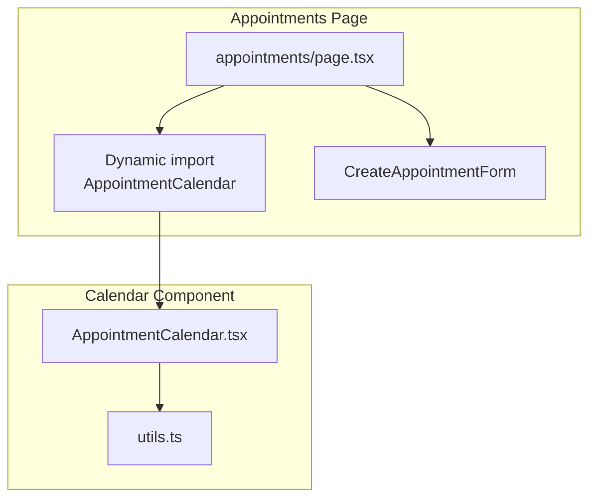
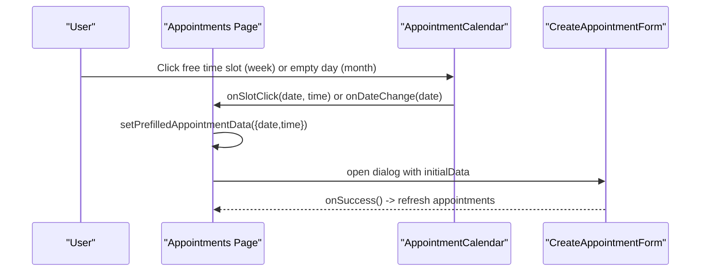
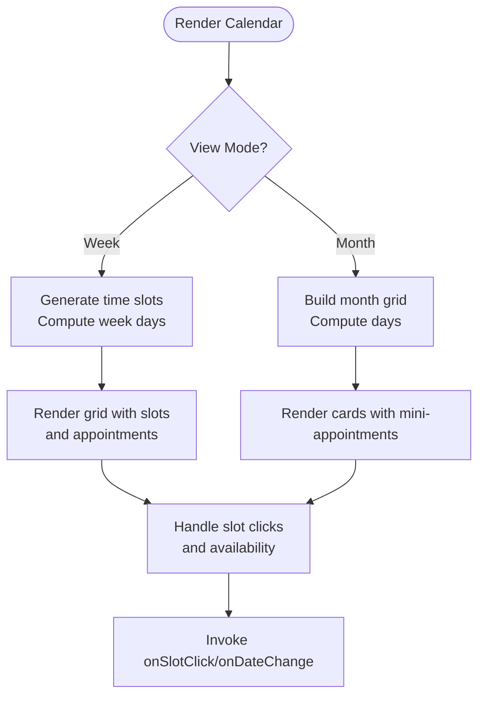
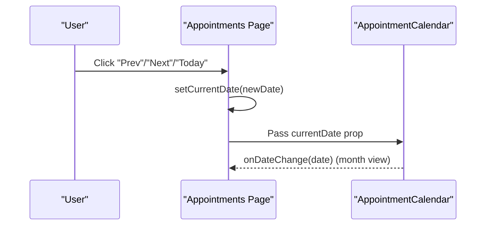
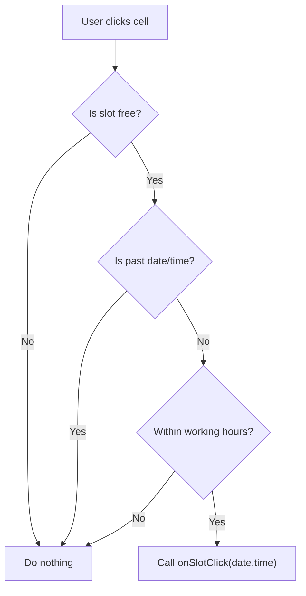
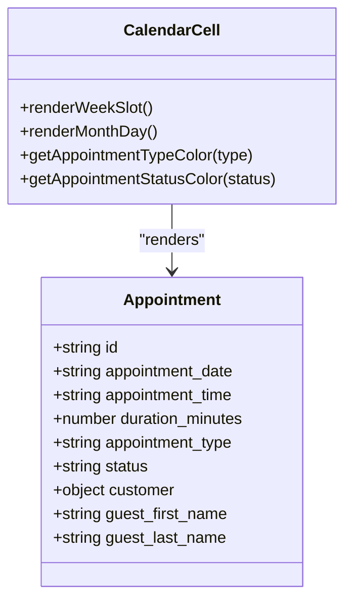
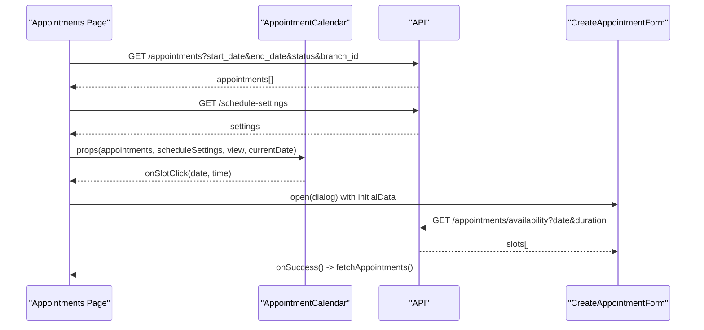
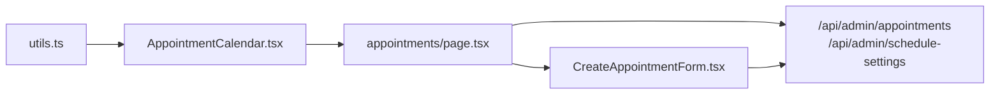

# Calendar Interface

<cite>
**Referenced Files in This Document**
- [AppointmentCalendar.tsx](file://src/components/admin/AppointmentCalendar.tsx)
- [appointments/page.tsx](file://src/app/admin/appointments/page.tsx)
- [CreateAppointmentForm.tsx](file://src/components/admin/CreateAppointmentForm.tsx)
- [utils.ts](file://src/lib/utils.ts)
</cite>

## Table of Contents

1. [Introduction](#introduction)
2. [Project Structure](#project-structure)
3. [Core Components](#core-components)
4. [Architecture Overview](#architecture-overview)
5. [Detailed Component Analysis](#detailed-component-analysis)
6. [Dependency Analysis](#dependency-analysis)
7. [Performance Considerations](#performance-considerations)
8. [Troubleshooting Guide](#troubleshooting-guide)
9. [Conclusion](#conclusion)

## Introduction

This document explains the appointment calendar interface component used in the admin appointments page. It covers calendar rendering logic, view modes (week/month), date navigation, interactive slot selection, cell rendering, appointment display, drag-and-drop considerations, responsive design patterns, configuration options, and relationships with the main appointments page and form components. The goal is to make the calendar behavior accessible to optical staff while providing developers with implementation details for customization.

## Project Structure

The calendar is implemented as a reusable component integrated into the main appointments page. Dynamic imports are used to optimize initial load performance. The calendar delegates interactions to the parent page, which manages state, filters, and opens the appointment creation/editing form.

**Diagram sources**

- [appointments/page.tsx](file://src/app/admin/appointments/page.tsx#L44-L58)
- [AppointmentCalendar.tsx](file://src/components/admin/AppointmentCalendar.tsx#L1-L21)
- [utils.ts](file://src/lib/utils.ts#L1-L6)

**Section sources**

- [appointments/page.tsx](file://src/app/admin/appointments/page.tsx#L44-L58)
- [AppointmentCalendar.tsx](file://src/components/admin/AppointmentCalendar.tsx#L1-L21)
- [utils.ts](file://src/lib/utils.ts#L1-L6)

## Core Components

- AppointmentCalendar: Renders week and month views, computes time slots, checks availability against schedule settings, renders appointments, and handles slot clicks to open the form.
- Appointments Page: Manages view mode, current date, filters, and passes callbacks to the calendar. It also controls the Create/Edit form dialog.
- CreateAppointmentForm: Handles customer selection, date/time selection, availability fetching, and submission. It integrates with schedule settings and respects locked date/time when invoked from the calendar.

Key responsibilities:

- Calendar rendering and interactivity
- Time slot generation and availability checks
- Appointment display with type/status indicators
- Navigation and date change propagation
- Integration with the form for creating/updating appointments

**Section sources**

- [AppointmentCalendar.tsx](file://src/components/admin/AppointmentCalendar.tsx#L62-L80)
- [appointments/page.tsx](file://src/app/admin/appointments/page.tsx#L112-L129)
- [CreateAppointmentForm.tsx](file://src/components/admin/CreateAppointmentForm.tsx#L39-L53)

## Architecture Overview

The calendar component receives props for view mode, current date, appointments, and callbacks. It computes derived data (time slots, week/month days) and renders either a weekly grid or a monthly grid. Clicking a free slot triggers a callback to prefill and open the form. The page manages filters and branch scoping and passes schedule settings to the calendar.

**Diagram sources**

- [AppointmentCalendar.tsx](file://src/components/admin/AppointmentCalendar.tsx#L408-L435)
- [appointments/page.tsx](file://src/app/admin/appointments/page.tsx#L401-L412)
- [CreateAppointmentForm.tsx](file://src/components/admin/CreateAppointmentForm.tsx#L39-L53)

## Detailed Component Analysis

### Calendar Rendering Logic

- Week view:
  - Generates time slots from schedule settings or defaults (8:00–20:00 in 15-minute increments).
  - Computes visible week days aligned to Monday.
  - Renders a grid with a time column and day columns.
  - For each slot, checks availability against schedule settings (working hours, lunch break, past dates/times).
  - Renders overlapping appointments with absolute positioning based on duration.
  - Shows a subtle "+" overlay on hover for clickable slots.
- Month view:
  - Builds a grid of 7 columns for days of the week.
  - Highlights today and dimmed past days.
  - Shows up to three upcoming appointments per day with status badges.
  - Clicking a day triggers date change to the selected date.

**Diagram sources**

- [AppointmentCalendar.tsx](file://src/components/admin/AppointmentCalendar.tsx#L83-L143)
- [AppointmentCalendar.tsx](file://src/components/admin/AppointmentCalendar.tsx#L213-L250)
- [AppointmentCalendar.tsx](file://src/components/admin/AppointmentCalendar.tsx#L342-L523)
- [AppointmentCalendar.tsx](file://src/components/admin/AppointmentCalendar.tsx#L525-L628)

**Section sources**

- [AppointmentCalendar.tsx](file://src/components/admin/AppointmentCalendar.tsx#L83-L143)
- [AppointmentCalendar.tsx](file://src/components/admin/AppointmentCalendar.tsx#L145-L211)
- [AppointmentCalendar.tsx](file://src/components/admin/AppointmentCalendar.tsx#L213-L250)
- [AppointmentCalendar.tsx](file://src/components/admin/AppointmentCalendar.tsx#L252-L317)
- [AppointmentCalendar.tsx](file://src/components/admin/AppointmentCalendar.tsx#L342-L523)
- [AppointmentCalendar.tsx](file://src/components/admin/AppointmentCalendar.tsx#L525-L628)

### View Modes and Navigation

- View mode: week or month, controlled by a select in the parent page.
- Navigation: Previous/Next buttons adjust the current date by week or month respectively; Today button resets to current date.
- Date change: Month view emits onDateChange to the parent; week view uses internal navigation via buttons.

**Diagram sources**

- [appointments/page.tsx](file://src/app/admin/appointments/page.tsx#L223-L235)
- [AppointmentCalendar.tsx](file://src/components/admin/AppointmentCalendar.tsx#L558-L561)

**Section sources**

- [appointments/page.tsx](file://src/app/admin/appointments/page.tsx#L450-L582)
- [appointments/page.tsx](file://src/app/admin/appointments/page.tsx#L223-L235)
- [AppointmentCalendar.tsx](file://src/components/admin/AppointmentCalendar.tsx#L558-L561)

### Interactive Slot Selection

- Week view:
  - A slot is clickable if it has no appointment, is not in the past, and falls within working hours/lunch break.
  - Clicking a slot invokes onSlotClick with the date and time, which the parent uses to open the form with prefilled data.
- Month view:
  - Clicking an empty day card triggers onDateChange to the selected date.
  - Clicking an existing appointment opens the detail dialog (handled by the parent).

**Diagram sources**

- [AppointmentCalendar.tsx](file://src/components/admin/AppointmentCalendar.tsx#L408-L435)
- [AppointmentCalendar.tsx](file://src/components/admin/AppointmentCalendar.tsx#L413-L425)
- [AppointmentCalendar.tsx](file://src/components/admin/AppointmentCalendar.tsx#L145-L211)

**Section sources**

- [AppointmentCalendar.tsx](file://src/components/admin/AppointmentCalendar.tsx#L408-L435)
- [AppointmentCalendar.tsx](file://src/components/admin/AppointmentCalendar.tsx#L413-L425)
- [AppointmentCalendar.tsx](file://src/components/admin/AppointmentCalendar.tsx#L145-L211)

### Calendar Cell Rendering and Appointment Display

- Week view:
  - Each slot shows overlapping appointments positioned absolutely based on duration and start time.
  - Appointment badges include type icon, customer name, type label, start time, and duration.
  - Status and type colors are applied via computed classes.
- Month view:
  - Cards display up to three appointments with concise status badges.
  - Today’s date is visually emphasized with a ring and accent background.

**Diagram sources**

- [AppointmentCalendar.tsx](file://src/components/admin/AppointmentCalendar.tsx#L29-L47)
- [AppointmentCalendar.tsx](file://src/components/admin/AppointmentCalendar.tsx#L257-L285)
- [AppointmentCalendar.tsx](file://src/components/admin/AppointmentCalendar.tsx#L457-L512)
- [AppointmentCalendar.tsx](file://src/components/admin/AppointmentCalendar.tsx#L580-L614)

**Section sources**

- [AppointmentCalendar.tsx](file://src/components/admin/AppointmentCalendar.tsx#L29-L47)
- [AppointmentCalendar.tsx](file://src/components/admin/AppointmentCalendar.tsx#L257-L285)
- [AppointmentCalendar.tsx](file://src/components/admin/AppointmentCalendar.tsx#L457-L512)
- [AppointmentCalendar.tsx](file://src/components/admin/AppointmentCalendar.tsx#L580-L614)

### Drag-and-Drop Functionality

- The calendar does not implement drag-and-drop for rescheduling. Users can create new appointments by clicking free slots or days, and edit existing ones via the detail dialog and form.

[No sources needed since this section provides general guidance]

### Responsive Design Patterns

- Grid layouts adapt to screen sizes:
  - Week view uses a horizontally scrollable container with a fixed header row.
  - Month view uses a 7-column grid that stacks on smaller screens.
- Utility class merging is used for conditional styling and animations.
- Scrollbars are styled for better visibility and interaction.

**Section sources**

- [AppointmentCalendar.tsx](file://src/components/admin/AppointmentCalendar.tsx#L349-L350)
- [AppointmentCalendar.tsx](file://src/components/admin/AppointmentCalendar.tsx#L526-L538)
- [utils.ts](file://src/lib/utils.ts#L4-L6)

### Configuration Options

- Calendar dimensions:
  - Week view container has a fixed max-height with a custom scrollbar.
  - Month view cards enforce a minimum height for consistent appearance.
- Color schemes:
  - Appointment type colors and status colors are mapped via computed classes.
  - Accent colors are applied for “today” highlighting and hover states.
- Timezone handling:
  - Dates are compared against the local system time; no explicit timezone conversion is performed in the component.
- Localization:
  - Weekday labels and date formatting use the Spanish locale for CL.

**Section sources**

- [AppointmentCalendar.tsx](file://src/components/admin/AppointmentCalendar.tsx#L349-L350)
- [AppointmentCalendar.tsx](file://src/components/admin/AppointmentCalendar.tsx#L376-L386)
- [AppointmentCalendar.tsx](file://src/components/admin/AppointmentCalendar.tsx#L489-L498)
- [AppointmentCalendar.tsx](file://src/components/admin/AppointmentCalendar.tsx#L564-L573)

### Relationships with Main Appointments Page and Forms

- Parent page:
  - Manages view mode, current date, filters, and branch scoping.
  - Fetches appointments and schedule settings, then passes them down to the calendar.
  - Opens the Create/Edit form dialog with prefilled data when a slot is clicked.
- Form integration:
  - The form reads schedule settings to compute available time slots and validates date/time ranges.
  - Supports locked date/time when opened from a calendar slot.

**Diagram sources**

- [appointments/page.tsx](file://src/app/admin/appointments/page.tsx#L166-L202)
- [appointments/page.tsx](file://src/app/admin/appointments/page.tsx#L204-L221)
- [appointments/page.tsx](file://src/app/admin/appointments/page.tsx#L401-L412)
- [CreateAppointmentForm.tsx](file://src/components/admin/CreateAppointmentForm.tsx#L227-L305)

**Section sources**

- [appointments/page.tsx](file://src/app/admin/appointments/page.tsx#L112-L129)
- [appointments/page.tsx](file://src/app/admin/appointments/page.tsx#L166-L221)
- [appointments/page.tsx](file://src/app/admin/appointments/page.tsx#L401-L412)
- [CreateAppointmentForm.tsx](file://src/components/admin/CreateAppointmentForm.tsx#L183-L213)
- [CreateAppointmentForm.tsx](file://src/components/admin/CreateAppointmentForm.tsx#L227-L305)

### Common User Interactions

- Double-click to create:
  - Implemented by clicking a free slot in week view or an empty day in month view, which opens the form with prefilled date/time.
- Click-to-select:
  - Clicking an existing appointment opens the detail dialog; clicking a day in month view navigates to that date.
- Keyboard navigation:
  - The calendar itself does not implement keyboard navigation for slots. Users rely on mouse clicks and the navigation controls.

**Section sources**

- [AppointmentCalendar.tsx](file://src/components/admin/AppointmentCalendar.tsx#L408-L435)
- [AppointmentCalendar.tsx](file://src/components/admin/AppointmentCalendar.tsx#L558-L561)
- [appointments/page.tsx](file://src/app/admin/appointments/page.tsx#L450-L582)

## Dependency Analysis

- Calendar depends on:
  - Schedule settings for generating time slots and validating availability.
  - Utility functions for class merging.
- Parent page depends on:
  - Calendar for rendering and interactions.
  - Form for creating/editing appointments.
  - API endpoints for appointments and schedule settings.

**Diagram sources**

- [utils.ts](file://src/lib/utils.ts#L4-L6)
- [AppointmentCalendar.tsx](file://src/components/admin/AppointmentCalendar.tsx#L19)
- [appointments/page.tsx](file://src/app/admin/appointments/page.tsx#L166-L221)
- [CreateAppointmentForm.tsx](file://src/components/admin/CreateAppointmentForm.tsx#L183-L213)

**Section sources**

- [utils.ts](file://src/lib/utils.ts#L4-L6)
- [AppointmentCalendar.tsx](file://src/components/admin/AppointmentCalendar.tsx#L19)
- [appointments/page.tsx](file://src/app/admin/appointments/page.tsx#L166-L221)
- [CreateAppointmentForm.tsx](file://src/components/admin/CreateAppointmentForm.tsx#L183-L213)

## Performance Considerations

- Lazy loading:
  - The calendar is dynamically imported to reduce initial bundle size.
- Memoization:
  - Time slots and week/month days are computed with memoization to avoid unnecessary recalculations.
- Conditional rendering:
  - Only the visible portion of the week grid is rendered; month view limits the number of displayed appointments per day.

**Section sources**

- [appointments/page.tsx](file://src/app/admin/appointments/page.tsx#L44-L58)
- [AppointmentCalendar.tsx](file://src/components/admin/AppointmentCalendar.tsx#L83-L143)
- [AppointmentCalendar.tsx](file://src/components/admin/AppointmentCalendar.tsx#L213-L250)

## Troubleshooting Guide

- No appointments displayed:
  - Verify that the parent page is passing the correct date range and filters.
  - Ensure schedule settings are loaded and not null.
- Free slots not clickable:
  - Confirm that the slot is not in the past and falls within working hours.
  - Check that the day is enabled in schedule settings and not during lunch break.
- Form not opening on slot click:
  - Ensure onSlotClick is wired correctly and that the parent sets prefilled data and opens the dialog.

**Section sources**

- [appointments/page.tsx](file://src/app/admin/appointments/page.tsx#L401-L412)
- [AppointmentCalendar.tsx](file://src/components/admin/AppointmentCalendar.tsx#L145-L211)
- [AppointmentCalendar.tsx](file://src/components/admin/AppointmentCalendar.tsx#L408-L435)

## Conclusion

The calendar interface provides a robust, configurable, and responsive solution for managing appointments. Its separation of concerns—rendering logic in the calendar component and orchestration in the parent page—enables maintainability and extensibility. Developers can customize color schemes, dimensions, and availability rules by adjusting the component’s computed styles and schedule settings integration. Optical staff benefit from clear visual indicators, intuitive navigation, and streamlined creation/editing workflows.
