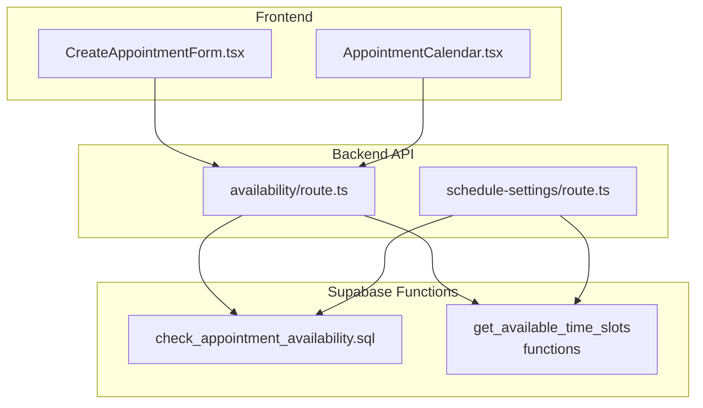
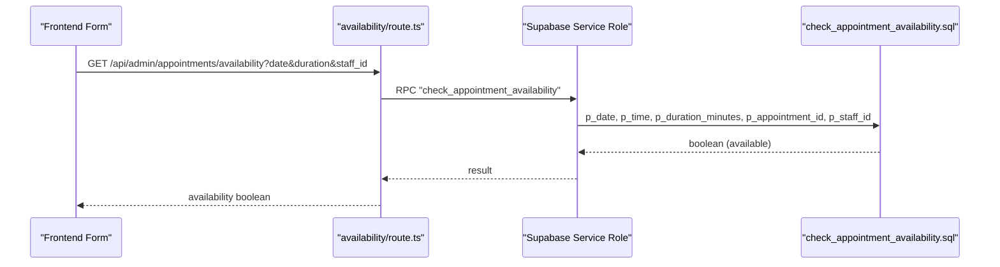
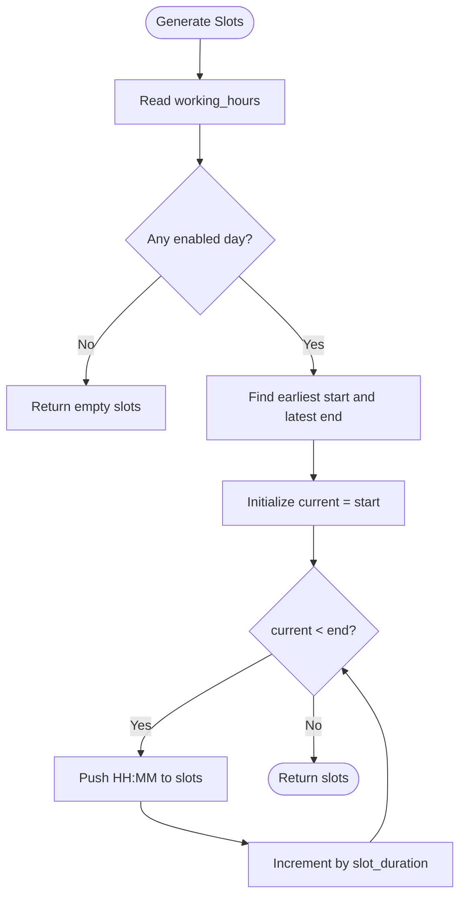
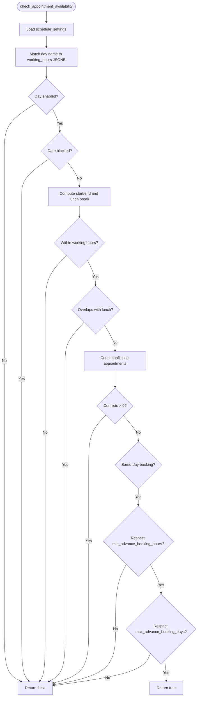
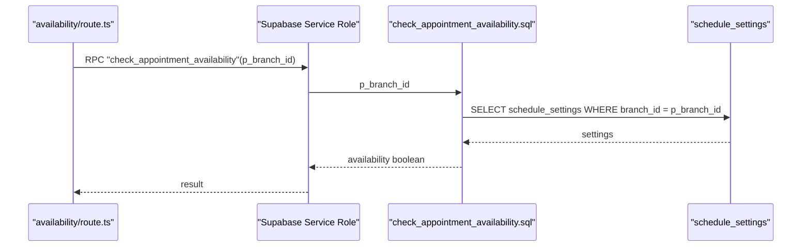
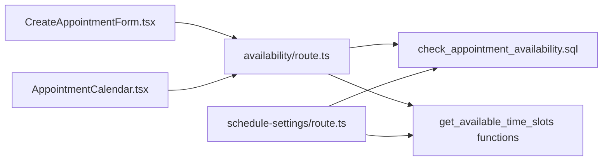

# Scheduling Algorithms

<cite>
**Referenced Files in This Document**
- [availability/route.ts](file://src/app/api/admin/appointments/availability/availability/route.ts)
- [schedule-settings/route.ts](file://src/app/api/admin/schedule-settings/route.ts)
- [supabase-rpc.ts](file://src/types/supabase-rpc.ts)
- [check_appointment_availability.sql](file://supabase/migrations/20250127000001_fix_check_appointment_availability.sql)
- [debug_check_appointment_availability.sql](file://supabase/migrations/20250127000002_debug_check_appointment_availability.sql)
- [fix_get_available_time_slots_past_filtering.sql](file://supabase/migrations/20250127000004_fix_get_available_time_slots_past_filtering.sql)
- [update_get_available_time_slots_for_branches.sql](file://supabase/migrations/20251216000005_update_get_available_time_slots_for_branches.sql)
- [update_appointment_availability_for_branches.sql](file://supabase/migrations/20251216000002_update_appointment_availability_for_branches.sql)
- [CreateAppointmentForm.tsx](file://src/components/admin/CreateAppointmentForm.tsx)
- [AppointmentCalendar.tsx](file://src/components/admin/AppointmentCalendar.tsx)
</cite>

## Table of Contents

1. [Introduction](#introduction)
2. [Project Structure](#project-structure)
3. [Core Components](#core-components)
4. [Architecture Overview](#architecture-overview)
5. [Detailed Component Analysis](#detailed-component-analysis)
6. [Dependency Analysis](#dependency-analysis)
7. [Performance Considerations](#performance-considerations)
8. [Troubleshooting Guide](#troubleshooting-guide)
9. [Conclusion](#conclusion)

## Introduction

This document explains the appointment scheduling algorithms and availability checking system in the Opttius application. It covers time slot calculation logic, conflict detection, buffer time handling, blackout dates, and multi-location scheduling. It also documents configuration options such as minimum booking notice, maximum booking advance, and service duration variations, and addresses edge cases like same-day scheduling and extended service windows.

## Project Structure

The scheduling system spans frontend components, backend API routes, and Supabase SQL functions. Key areas:

- Frontend: Availability query UI and calendar slot generation
- Backend: Admin APIs for availability checks and schedule settings
- Database: Supabase RPC functions and schedule settings table

**Diagram sources**

- [availability/route.ts](file://src/app/api/admin/appointments/availability/availability/route.ts#L1-L172)
- [schedule-settings/route.ts](file://src/app/api/admin/schedule-settings/route.ts#L1-L334)
- [check_appointment_availability.sql](file://supabase/migrations/20250127000001_fix_check_appointment_availability.sql#L1-L104)
- [fix_get_available_time_slots_past_filtering.sql](file://supabase/migrations/20250127000004_fix_get_available_time_slots_past_filtering.sql#L1-L47)
- [update_get_available_time_slots_for_branches.sql](file://supabase/migrations/20251216000005_update_get_available_time_slots_for_branches.sql#L1-L120)

**Section sources**

- [availability/route.ts](file://src/app/api/admin/appointments/availability/availability/route.ts#L1-L172)
- [schedule-settings/route.ts](file://src/app/api/admin/schedule-settings/route.ts#L1-L334)

## Core Components

- Availability API endpoint: Validates admin credentials, extracts branch context, reads query parameters (date, duration, staff_id), and calls the Supabase RPC function to compute available time slots.
- Schedule settings API: Returns branch-specific or default schedule configuration including slot duration, default appointment duration, buffer time, working hours, blocked dates, and booking window limits.
- Supabase RPC functions: Perform business hour validation, blackout date checks, conflict detection, and same-day advance booking constraints.

Key configuration options exposed via schedule settings:

- Slot duration minutes: Granularity for time slot generation
- Default appointment duration: Base duration used when unspecified
- Buffer time minutes: Inter-appt gap for cleanup/buffer
- Working hours: Per-day open/close times and optional lunch break
- Blocked dates: Dates excluded from availability
- Minimum advance booking hours: Prohibits booking earlier than now + N hours for same-day
- Maximum advance booking days: Prohibits booking later than today + N days

**Section sources**

- [availability/route.ts](file://src/app/api/admin/appointments/availability/availability/route.ts#L41-L106)
- [schedule-settings/route.ts](file://src/app/api/admin/schedule-settings/route.ts#L61-L125)
- [supabase-rpc.ts](file://src/types/supabase-rpc.ts#L101-L147)

## Architecture Overview

The availability pipeline integrates frontend requests, backend authorization and branch scoping, and database-side scheduling logic.

**Diagram sources**

- [availability/route.ts](file://src/app/api/admin/appointments/availability/availability/route.ts#L61-L86)
- [check_appointment_availability.sql](file://supabase/migrations/20250127000001_fix_check_appointment_availability.sql#L4-L100)
- [supabase-rpc.ts](file://src/types/supabase-rpc.ts#L101-L122)

## Detailed Component Analysis

### Availability Query Endpoint

Responsibilities:

- Authenticate admin user
- Resolve branch context
- Parse query parameters (date, duration, staff_id)
- Call Supabase RPC function get_available_time_slots
- Normalize returned time slots and availability flags
- Return structured response

Processing logic highlights:

- Parameter validation and defaults
- RPC call with branch-scoped schedule settings
- Robust parsing of TIME formats and boolean availability flags
- Logging for observability

Edge cases handled:

- Empty slot arrays
- Mixed TIME formats from PostgreSQL
- Boolean/string availability flags

**Section sources**

- [availability/route.ts](file://src/app/api/admin/appointments/availability/availability/route.ts#L14-L171)

### Time Slot Generation and Calendar Rendering

The calendar component generates candidate time slots based on schedule settings:

- Computes earliest start and latest end across enabled days
- Iterates in increments of slot_duration_minutes
- Produces HH:MM entries for UI rendering

**Diagram sources**

- [AppointmentCalendar.tsx](file://src/components/admin/AppointmentCalendar.tsx#L99-L133)

**Section sources**

- [AppointmentCalendar.tsx](file://src/components/admin/AppointmentCalendar.tsx#L99-L133)

### Conflict Detection and Business Hour Validation

The core algorithm resides in the Supabase function check_appointment_availability:

**Diagram sources**

- [check_appointment_availability.sql](file://supabase/migrations/20250127000001_fix_check_appointment_availability.sql#L22-L98)

Algorithm details:

- Day-of-week normalization using TRIM to match JSONB keys
- Working hours boundary checks
- Lunch break overlap detection
- Overlap detection formula: startA < endB AND endA > startB
- Same-day minimum advance window
- Maximum advance window constraint

**Section sources**

- [check_appointment_availability.sql](file://supabase/migrations/20250127000001_fix_check_appointment_availability.sql#L30-L98)

### Buffer Time Calculations

Buffer time is applied implicitly during conflict detection:

- The function computes end_appointment_time = p_time + p_duration_minutes
- Subsequent checks ensure no overlap with existing appointments
- Buffer time can be modeled by adjusting slot_duration_minutes and default_appointment_duration in schedule settings

Note: There is no dedicated buffer field in the function; buffer is managed via slot granularity and duration offsets.

**Section sources**

- [check_appointment_availability.sql](file://supabase/migrations/20250127000001_fix_check_appointment_availability.sql#L52-L77)
- [schedule-settings/route.ts](file://src/app/api/admin/schedule-settings/route.ts#L65-L67)

### Blackout Date Handling

Blocked dates are enforced by checking if the requested date exists in the blocked_dates array. If matched, availability is denied immediately.

**Section sources**

- [check_appointment_availability.sql](file://supabase/migrations/20250127000001_fix_check_appointment_availability.sql#L39-L42)

### Multi-Location Scheduling

Branch-awareness is integrated into both availability checks and time slot generation:

- Availability API passes p_branch_id to the RPC function
- The function resolves schedule_settings per branch or falls back to global settings
- Time slot generation respects branch-specific working hours and blocked dates

**Diagram sources**

- [update_appointment_availability_for_branches.sql](file://supabase/migrations/20251216000002_update_appointment_availability_for_branches.sql#L36-L49)
- [availability/route.ts](file://src/app/api/admin/appointments/availability/availability/route.ts#L61-L68)

**Section sources**

- [update_appointment_availability_for_branches.sql](file://supabase/migrations/20251216000002_update_appointment_availability_for_branches.sql#L36-L76)
- [update_get_available_time_slots_for_branches.sql](file://supabase/migrations/20251216000005_update_get_available_time_slots_for_branches.sql#L1-L120)

### Same-Day Scheduling and Extended Windows

- Same-day minimum advance: If today’s date is requested and min_advance_booking_hours > 0, the requested time must be at least that long in the future from now.
- Maximum advance: Future-only limit enforced by comparing against CURRENT_DATE + max_advance_booking_days.

**Section sources**

- [check_appointment_availability.sql](file://supabase/migrations/20250127000001_fix_check_appointment_availability.sql#L83-L96)
- [schedule-settings/route.ts](file://src/app/api/admin/schedule-settings/route.ts#L120-L121)

### Peak Hour Management

Peak hours are not explicitly modeled as a separate configuration. However, peak-like behavior can be approximated by:

- Adjusting working_hours end_time earlier for busy periods
- Using shorter slot_duration_minutes to increase granularity and reduce overlap risk
- Leveraging blocked_dates to temporarily close on high-demand days

**Section sources**

- [schedule-settings/route.ts](file://src/app/api/admin/schedule-settings/route.ts#L68-L118)
- [fix_get_available_time_slots_past_filtering.sql](file://supabase/migrations/20250127000004_fix_get_available_time_slots_past_filtering.sql#L36-L47)

## Dependency Analysis

The system exhibits clear separation of concerns:

- Frontend components depend on backend APIs for availability and settings
- Backend APIs depend on Supabase RPC functions
- RPC functions depend on schedule_settings and appointments tables

**Diagram sources**

- [CreateAppointmentForm.tsx](file://src/components/admin/CreateAppointmentForm.tsx#L227-L264)
- [AppointmentCalendar.tsx](file://src/components/admin/AppointmentCalendar.tsx#L99-L133)
- [availability/route.ts](file://src/app/api/admin/appointments/availability/availability/route.ts#L61-L86)
- [schedule-settings/route.ts](file://src/app/api/admin/schedule-settings/route.ts#L35-L44)
- [check_appointment_availability.sql](file://supabase/migrations/20250127000001_fix_check_appointment_availability.sql#L4-L100)
- [fix_get_available_time_slots_past_filtering.sql](file://supabase/migrations/20250127000004_fix_get_available_time_slots_past_filtering.sql#L5-L47)

**Section sources**

- [CreateAppointmentForm.tsx](file://src/components/admin/CreateAppointmentForm.tsx#L227-L264)
- [AppointmentCalendar.tsx](file://src/components/admin/AppointmentCalendar.tsx#L99-L133)
- [availability/route.ts](file://src/app/api/admin/appointments/availability/availability/route.ts#L61-L86)
- [schedule-settings/route.ts](file://src/app/api/admin/schedule-settings/route.ts#L35-L44)

## Performance Considerations

- Function composition: The availability checks involve multiple conditions and a conflict count query. Indexes on appointments.appointment_date, appointments.assigned_to, and appointments.appointment_time can improve performance.
- Timezone handling: The debug migration indicates timezone fixes were applied; ensure consistent timezone usage across client, server, and database.
- Slot generation: Calendar slot generation is O(N) in number of slots; keep slot_duration_minutes reasonable to avoid excessive UI rendering.
- Branch scoping: RPC functions resolve settings per branch; caching or preloading settings per branch can reduce repeated lookups.

[No sources needed since this section provides general guidance]

## Troubleshooting Guide

Common issues and resolutions:

- Unexpected "No slots returned": Verify schedule_settings are configured for the selected branch and that the requested date falls within working hours and is not blocked.
- Same-day booking rejected: Confirm min_advance_booking_hours allows the requested time window.
- Future booking rejected: Increase max_advance_booking_days or adjust the requested date.
- Conflicts still reported: Review overlapping appointments and ensure the conflict detection logic aligns with intended buffer and duration settings.

Operational diagnostics:

- The debug function logs detailed notices for blocked dates, working hours boundaries, lunch overlap, and conflicts.
- The availability API logs incoming parameters and RPC outcomes for tracing.

**Section sources**

- [debug_check_appointment_availability.sql](file://supabase/migrations/20250127000002_debug_check_appointment_availability.sql#L43-L118)
- [availability/route.ts](file://src/app/api/admin/appointments/availability/availability/route.ts#L71-L86)
- [schedule-settings/route.ts](file://src/app/api/admin/schedule-settings/route.ts#L46-L59)

## Conclusion

The scheduling system combines robust backend validation with flexible frontend presentation. Its strength lies in configurable business rules (working hours, blocked dates, booking windows), precise conflict detection, and branch-aware operation. By tuning slot_duration_minutes, default_appointment_duration, and buffer_time_minutes, teams can model diverse operational needs while maintaining strong correctness guarantees.
