# API Architecture

<cite>
**Referenced Files in This Document**
- [middleware.ts](file://src/middleware.ts)
- [package.json](file://package.json)
- [src/app/api/admin/admin-users/route.ts](file://src/app/api/admin/admin-users/route.ts)
- [src/app/api/admin/admin-users/[id]/route.ts](file://src/app/api/admin/admin-users/[id]/route.ts)
- [src/app/api/admin/admin-users/register/route.ts](file://src/app/api/admin/admin-users/register/route.ts)
- [src/app/api/admin/branches/route.ts](file://src/app/api/admin/branches/route.ts)
- [src/app/api/admin/branches/[id]/route.ts](file://src/app/api/admin/branches/[id]/route.ts)
- [src/app/api/admin/customers/route.ts](file://src/app/api/admin/customers/route.ts)
- [src/app/api/admin/customers/[id]/route.ts](file://src/app/api/admin/customers/[id]/route.ts)
- [src/app/api/admin/customers/search/route.ts](file://src/app/api/admin/customers/search/route.ts)
- [src/app/api/admin/customers/[id]/prescriptions/route.ts](file://src/app/api/admin/customers/[id]/prescriptions/route.ts)
- [src/app/api/admin/customers/[id]/prescriptions/[prescriptionId]/route.ts](file://src/app/api/admin/customers/[id]/prescriptions/[prescriptionId]/route.ts)
- [src/app/api/admin/customers/[id]/appointments/route.ts](file://src/app/api/admin/customers/[id]/appointments/route.ts)
- [src/app/api/admin/orders/route.ts](file://src/app/api/admin/orders/route.ts)
- [src/app/api/admin/orders/[id]/route.ts](file://src/app/api/admin/orders/[id]/route.ts)
- [src/app/api/admin/pos/route.ts](file://src/app/api/admin/pos/route.ts)
- [src/app/api/admin/pos/[id]/route.ts](file://src/app/api/admin/pos/[id]/route.ts)
- [src/app/api/admin/products/route.ts](file://src/app/api/admin/products/route.ts)
- [src/app/api/admin/products/[id]/route.ts](file://src/app/api/admin/products/[id]/route.ts)
- [src/app/api/admin/products/search/route.ts](file://src/app/api/admin/products/search/route.ts)
- [src/app/api/categories/route.ts](file://src/app/api/categories/route.ts)
- [src/app/api/categories/[id]/route.ts](file://src/app/api/categories/[id]/route.ts)
- [src/app/api/admin/lens-families/route.ts](file://src/app/api/admin/lens-families/route.ts)
- [src/app/api/admin/lens-families/[id]/route.ts](file://src/app/api/admin/lens-families/[id]/route.ts)
- [src/app/api/admin/lens-matrices/route.ts](file://src/app/api/admin/lens-matrices/route.ts)
- [src/app/api/admin/lens-matrices/[id]/route.ts](file://src/app/api/admin/lens-matrices/[id]/route.ts)
- [src/app/api/admin/lens-matrices/calculate/route.ts](file://src/app/api/admin/lens-matrices/calculate/route.ts)
- [src/app/api/admin/quotes/route.ts](file://src/app/api/admin/quotes/route.ts)
- [src/app/api/admin/quotes/[id]/route.ts](file://src/app/api/admin/quotes/[id]/route.ts)
- [src/app/api/admin/work-orders/route.ts](file://src/app/api/admin/work-orders/route.ts)
- [src/app/api/admin/work-orders/[id]/route.ts](file://src/app/api/admin/work-orders/[id]/route.ts)
- [src/app/api/admin/appointments/route.ts](file://src/app/api/admin/appointments/route.ts)
- [src/app/api/admin/appointments/[id]/route.ts](file://src/app/api/admin/appointments/[id]/route.ts)
- [src/app/api/admin/appointments/availability/route.ts](file://src/app/api/admin/appointments/availability/route.ts)
- [src/app/api/admin/analytics/dashboard/route.ts](file://src/app/api/admin/analytics/dashboard/route.ts)
- [src/app/api/admin/payments/create-intent/route.ts](file://src/app/api/admin/payments/create-intent/route.ts)
- [src/app/api/webhooks/mercadopago/route.ts](file://src/app/api/webhooks/mercadopago/route.ts)
- [src/app/api/webhooks/nowpayments/route.ts](file://src/app/api/webhooks/nowpayments/route.ts)
- [src/app/api/webhooks/paypal/route.ts](file://src/app/api/webhooks/paypal/route.ts)
- [src/app/api/webhooks/flow/route.ts](file://src/app/api/webhooks/flow/route.ts)
- [src/app/api/checkout/create-intent/route.ts](file://src/app/api/checkout/create-intent/route.ts)
- [src/app/api/checkout/confirm-payment/route.ts](file://src/app/api/checkout/confirm-payment/route.ts)
- [src/app/api/checkout/current-subscription/route.ts](file://src/app/api/checkout/current-subscription/route.ts)
- [src/app/api/checkout/recurring-plans/route.ts](file://src/app/api/checkout/recurring-plans/route.ts)
- [src/app/api/checkout/gateways/route.ts](file://src/app/api/checkout/gateways/route.ts)
- [src/app/api/checkout/create-preapproval/route.ts](file://src/app/api/checkout/create-preapproval/route.ts)
- [src/app/api/checkout/tiers/route.ts](file://src/app/api/checkout/tiers/route.ts)
- [src/app/api/landing/tiers/route.ts](file://src/app/api/landing/tiers/route.ts)
- [src/app/api/products/[slug]/route.ts](file://src/app/api/products/[slug]/route.ts)
- [src/app/api/support/create-ticket/route.ts](file://src/app/api/support/create-ticket/route.ts)
- [src/app/api/support/ticket/[ticketNumber]/route.ts](file://src/app/api/support/ticket/[ticketNumber]/route.ts)
- [src/app/api/upload/route.ts](file://src/app/api/upload/route.ts)
- [src/app/api/test-headers/route.ts](file://src/app/api/test-headers/route.ts)
- [src/app/api/onboarding/activate-real-org/route.ts](file://src/app/api/onboarding/activate-real-org/route.ts)
- [src/app/api/onboarding/assign-demo/route.ts](file://src/app/api/onboarding/assign-demo/route.ts)
- [src/app/api/onboarding/ensure-admin-user/route.ts](file://src/app/api/onboarding/ensure-admin-user/route.ts)
- [src/app/api/onboarding/tour/route.ts](file://src/app/api/onboarding/tour/route.ts)
- [src/app/api/check-status/route.ts](file://src/app/api/check-status/route.ts)
- [src/app/api/cron/backups/route.ts](file://src/app/api/cron/backups/route.ts)
- [src/app/api/ai/insights/route.ts](file://src/app/api/ai/insights/route.ts)
- [src/app/api/ai/insights/[id]/route.ts](file://src/app/api/ai/insights/[id]/route.ts)
- [src/app/api/ai/insights/generate/route.ts](file://src/app/api/ai/insights/generate/route.ts)
- [src/app/api/ai/insights/prepare-data/route.ts](file://src/app/api/ai/insights/prepare-data/route.ts)
- [src/lib/logger/index.ts](file://src/lib/logger/index.ts)
- [src/utils/supabase/server.ts](file://src/utils/supabase/server.ts)
- [src/lib/payments/mercadopago/gateway.ts](file://src/lib/payments/mercadopago/gateway.ts)
- [src/lib/payments/mercadopago/webhook-validator.ts](file://src/lib/payments/mercadopago/webhook-validator.ts)
- [src/lib/payments/services/payment-service.ts](file://src/lib/payments/services/payment-service.ts)
- [src/lib/payments/index.ts](file://src/lib/payments/index.ts)
- [src/lib/payments/factory.ts](file://src/lib/payments/factory.ts)
- [src/types/payment.ts](file://src/types/payment.ts)
- [src/types/database.ts](file://src/types/database.ts)
</cite>

## Table of Contents

1. [Introduction](#introduction)
2. [Project Structure](#project-structure)
3. [Core Components](#core-components)
4. [Architecture Overview](#architecture-overview)
5. [Detailed Component Analysis](#detailed-component-analysis)
6. [Dependency Analysis](#dependency-analysis)
7. [Performance Considerations](#performance-considerations)
8. [Troubleshooting Guide](#troubleshooting-guide)
9. [Conclusion](#conclusion)
10. [Appendices](#appendices)

## Introduction

This document describes the Opttius RESTful API architecture built with Next.js App Router. It focuses on the administrative API under /api/admin/, covering endpoint organization, resource-based routing, consistent response formatting, error handling, authentication, parameter validation, request/response patterns, and webhook integrations for payment processing (MercadoPago, PayPal, NowPayments). It also outlines rate limiting strategies, API versioning approach, backward compatibility, CORS and security headers, and documentation standards.

## Project Structure

The API follows Next.js App Router conventions with route handlers located under src/app/api/. Administrative endpoints are grouped under /api/admin/ and organized by domain resources such as admin-users, branches, customers, orders, pos, products, quotes, work-orders, appointments, analytics, payments, and system support. Webhooks are under /api/webhooks/.

```mermaid
graph TB
subgraph "Next.js App Router API"
A["/api/admin/*"]
B["/api/webhooks/*"]
C["/api/checkout/*"]
D["/api/* (misc)"]
end
subgraph "Admin Resources"
A1["admin-users"]
A2["branches"]
A3["customers"]
A4["orders"]
A5["pos"]
A6["products"]
A7["quotes"]
A8["work-orders"]
A9["appointments"]
A10["analytics"]
A11["payments"]
A12["support/system"]
end
subgraph "Webhooks"
W1["mercadopago"]
W2["paypal"]
W3["nowpayments"]
W4["flow"]
end
subgraph "Checkout"
C1["create-intent"]
C2["confirm-payment"]
C3["current-subscription"]
C4["recurring-plans"]
C5["gateways"]
C6["create-preapproval"]
C7["tiers"]
end
A --> A1
A --> A2
A --> A3
A --> A4
A --> A5
A --> A6
A --> A7
A --> A8
A --> A9
A --> A10
A --> A11
A --> A12
B --> W1
B --> W2
B --> W3
B --> W4
D --> C1
D --> C2
D --> C3
D --> C4
D --> C5
D --> C6
D --> C7
```

**Diagram sources**

- [src/app/api/admin/admin-users/route.ts](file://src/app/api/admin/admin-users/route.ts#L1-L200)
- [src/app/api/webhooks/mercadopago/route.ts](file://src/app/api/webhooks/mercadopago/route.ts#L1-L372)
- [src/app/api/webhooks/nowpayments/route.ts](file://src/app/api/webhooks/nowpayments/route.ts#L1-L70)
- [src/app/api/checkout/create-intent/route.ts](file://src/app/api/checkout/create-intent/route.ts#L1-L200)

**Section sources**

- [src/app/api/admin/admin-users/route.ts](file://src/app/api/admin/admin-users/route.ts#L1-L200)
- [src/app/api/webhooks/mercadopago/route.ts](file://src/app/api/webhooks/mercadopago/route.ts#L1-L372)
- [src/app/api/webhooks/nowpayments/route.ts](file://src/app/api/webhooks/nowpayments/route.ts#L1-L70)
- [src/app/api/checkout/create-intent/route.ts](file://src/app/api/checkout/create-intent/route.ts#L1-L200)

## Core Components

- Authentication and Authorization: Admin endpoints enforce admin role checks and optional root user privileges. Requests are authenticated via Supabase SSR client and validated against stored policies.
- Resource-based Routing: Endpoints follow REST conventions with plural nouns for collections and singular IDs for individual resources. Nested resources are supported (e.g., customer prescriptions, customer appointments).
- Consistent Response Formatting: All endpoints return JSON with either successful payloads or standardized error objects containing an error field and HTTP status codes.
- Error Handling Standards: Standardized 401 Unauthorized, 403 Forbidden, and 500 Internal Server Error responses are returned consistently across admin routes.
- Parameter Validation: Route parameters and query parameters are parsed and validated; webhook handlers validate signatures and id/topic presence.
- Request/Response Schema: While explicit OpenAPI/Swagger definitions are not present in the repository, the code demonstrates consistent patterns for request bodies, query parameters, and response shapes.

**Section sources**

- [src/app/api/admin/admin-users/route.ts](file://src/app/api/admin/admin-users/route.ts#L1-L200)
- [src/app/api/admin/admin-users/[id]/route.ts](file://src/app/api/admin/admin-users/[id]/route.ts#L1-L200)
- [src/app/api/admin/admin-users/register/route.ts](file://src/app/api/admin/admin-users/register/route.ts#L1-L200)
- [src/app/api/admin/branches/route.ts](file://src/app/api/admin/branches/route.ts#L1-L200)
- [src/app/api/admin/branches/[id]/route.ts](file://src/app/api/admin/branches/[id]/route.ts#L1-L200)
- [src/app/api/admin/customers/route.ts](file://src/app/api/admin/customers/route.ts#L1-L200)
- [src/app/api/admin/customers/[id]/route.ts](file://src/app/api/admin/customers/[id]/route.ts#L1-L200)
- [src/app/api/admin/customers/search/route.ts](file://src/app/api/admin/customers/search/route.ts#L1-L200)
- [src/app/api/admin/customers/[id]/prescriptions/route.ts](file://src/app/api/admin/customers/[id]/prescriptions/route.ts#L1-L200)
- [src/app/api/admin/customers/[id]/prescriptions/[prescriptionId]/route.ts](file://src/app/api/admin/customers/[id]/prescriptions/[prescriptionId]/route.ts#L1-L200)
- [src/app/api/admin/customers/[id]/appointments/route.ts](file://src/app/api/admin/customers/[id]/appointments/route.ts#L1-L200)
- [src/app/api/admin/orders/route.ts](file://src/app/api/admin/orders/route.ts#L1-L200)
- [src/app/api/admin/orders/[id]/route.ts](file://src/app/api/admin/orders/[id]/route.ts#L1-L200)
- [src/app/api/admin/pos/route.ts](file://src/app/api/admin/pos/route.ts#L1-L200)
- [src/app/api/admin/pos/[id]/route.ts](file://src/app/api/admin/pos/[id]/route.ts#L1-L200)
- [src/app/api/admin/products/route.ts](file://src/app/api/admin/products/route.ts#L1-L200)
- [src/app/api/admin/products/[id]/route.ts](file://src/app/api/admin/products/[id]/route.ts#L1-L200)
- [src/app/api/admin/products/search/route.ts](file://src/app/api/admin/products/search/route.ts#L1-L200)
- [src/app/api/categories/route.ts](file://src/app/api/categories/route.ts#L1-L200)
- [src/app/api/categories/[id]/route.ts](file://src/app/api/categories/[id]/route.ts#L1-L200)
- [src/app/api/admin/lens-families/route.ts](file://src/app/api/admin/lens-families/route.ts#L1-L200)
- [src/app/api/admin/lens-families/[id]/route.ts](file://src/app/api/admin/lens-families/[id]/route.ts#L1-L200)
- [src/app/api/admin/lens-matrices/route.ts](file://src/app/api/admin/lens-matrices/route.ts#L1-L200)
- [src/app/api/admin/lens-matrices/[id]/route.ts](file://src/app/api/admin/lens-matrices/[id]/route.ts#L1-L200)
- [src/app/api/admin/lens-matrices/calculate/route.ts](file://src/app/api/admin/lens-matrices/calculate/route.ts#L1-L200)
- [src/app/api/admin/quotes/route.ts](file://src/app/api/admin/quotes/route.ts#L1-L200)
- [src/app/api/admin/quotes/[id]/route.ts](file://src/app/api/admin/quotes/[id]/route.ts#L1-L200)
- [src/app/api/admin/work-orders/route.ts](file://src/app/api/admin/work-orders/route.ts#L1-L200)
- [src/app/api/admin/work-orders/[id]/route.ts](file://src/app/api/admin/work-orders/[id]/route.ts#L1-L200)
- [src/app/api/admin/appointments/route.ts](file://src/app/api/admin/appointments/route.ts#L1-L200)
- [src/app/api/admin/appointments/[id]/route.ts](file://src/app/api/admin/appointments/[id]/route.ts#L1-L200)
- [src/app/api/admin/appointments/availability/route.ts](file://src/app/api/admin/appointments/availability/route.ts#L1-L200)
- [src/app/api/admin/analytics/dashboard/route.ts](file://src/app/api/admin/analytics/dashboard/route.ts#L1-L200)
- [src/app/api/admin/payments/create-intent/route.ts](file://src/app/api/admin/payments/create-intent/route.ts#L1-L200)

## Architecture Overview

The API architecture centers around:

- Next.js App Router route handlers implementing HTTP verbs (GET, POST, PUT, DELETE).
- Supabase SSR client for authentication and database operations.
- Payment gateway abstractions and webhook validators for secure, idempotent processing.
- Centralized logging for observability and debugging.

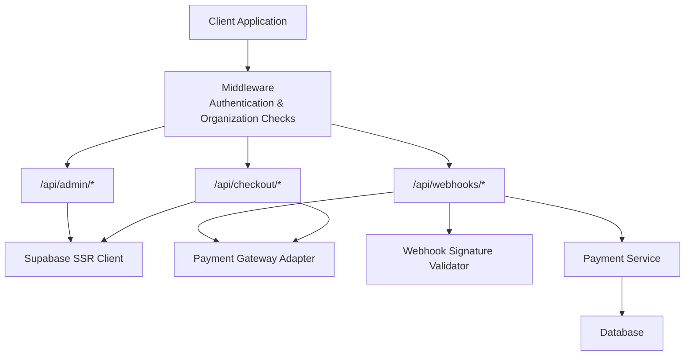

**Diagram sources**

- [src/middleware.ts](file://src/middleware.ts#L1-L109)
- [src/app/api/admin/payments/create-intent/route.ts](file://src/app/api/admin/payments/create-intent/route.ts#L1-L200)
- [src/app/api/webhooks/mercadopago/route.ts](file://src/app/api/webhooks/mercadopago/route.ts#L1-L372)
- [src/app/api/webhooks/nowpayments/route.ts](file://src/app/api/webhooks/nowpayments/route.ts#L1-L70)
- [src/utils/supabase/server.ts](file://src/utils/supabase/server.ts#L1-L200)
- [src/lib/payments/mercadopago/webhook-validator.ts](file://src/lib/payments/mercadopago/webhook-validator.ts#L1-L200)
- [src/lib/payments/services/payment-service.ts](file://src/lib/payments/services/payment-service.ts#L1-L200)

## Detailed Component Analysis

### Authentication and Authorization

- Authentication: Admin endpoints retrieve the current user via Supabase SSR client and validate the session.
- Authorization: Admin endpoints call RPC functions to check admin and root user roles before proceeding.
- Middleware: Global middleware redirects unauthenticated users away from protected routes and allows public paths and API routes to proceed.

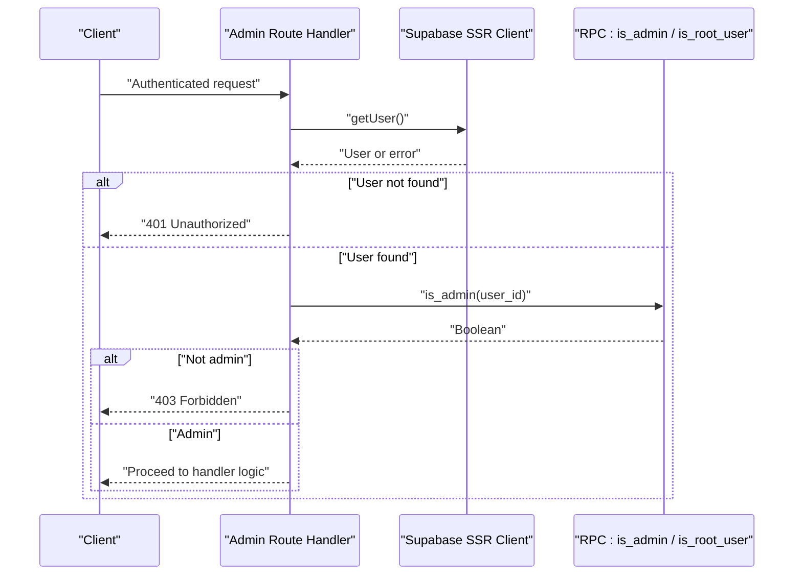

**Diagram sources**

- [src/app/api/admin/admin-users/route.ts](file://src/app/api/admin/admin-users/route.ts#L1-L200)
- [src/middleware.ts](file://src/middleware.ts#L1-L109)

**Section sources**

- [src/app/api/admin/admin-users/route.ts](file://src/app/api/admin/admin-users/route.ts#L1-L200)
- [src/middleware.ts](file://src/middleware.ts#L1-L109)

### Resource-Based Routing Patterns

- Collections: GET/POST for listing and creation (e.g., /api/admin/products, /api/admin/customers).
- Individual Resources: GET/PUT/DELETE for retrieval, updates, and deletion (e.g., /api/admin/products/[id]).
- Nested Resources: Customer-specific nested endpoints (e.g., /api/admin/customers/[id]/prescriptions, /api/admin/customers/[id]/appointments).
- Search: Dedicated search endpoints (e.g., /api/admin/customers/search).

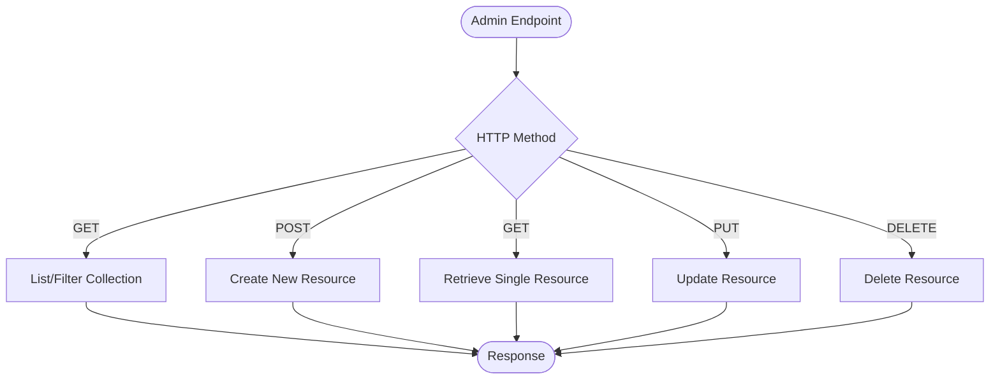

**Diagram sources**

- [src/app/api/admin/products/route.ts](file://src/app/api/admin/products/route.ts#L1-L200)
- [src/app/api/admin/products/[id]/route.ts](file://src/app/api/admin/products/[id]/route.ts#L1-L200)
- [src/app/api/admin/customers/[id]/prescriptions/route.ts](file://src/app/api/admin/customers/[id]/prescriptions/route.ts#L1-L200)

**Section sources**

- [src/app/api/admin/products/route.ts](file://src/app/api/admin/products/route.ts#L1-L200)
- [src/app/api/admin/products/[id]/route.ts](file://src/app/api/admin/products/[id]/route.ts#L1-L200)
- [src/app/api/admin/customers/[id]/prescriptions/route.ts](file://src/app/api/admin/customers/[id]/prescriptions/route.ts#L1-L200)

### Consistent Response Formatting and Error Handling

- Successful Responses: Return structured JSON payloads appropriate to the resource.
- Error Responses: Return JSON with an error field and an appropriate HTTP status (401, 403, 500).
- Logging: Centralized logger is used to record errors and warnings for observability.

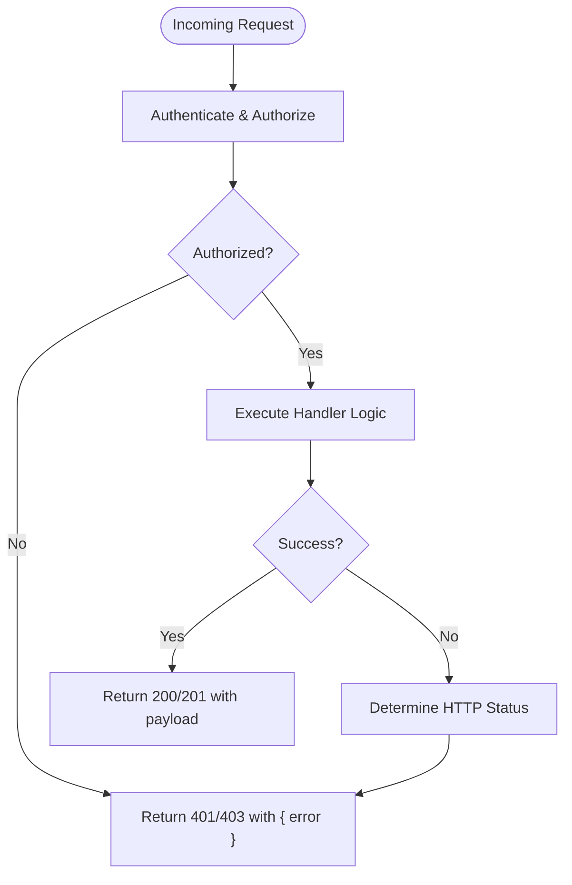

**Diagram sources**

- [src/app/api/admin/admin-users/route.ts](file://src/app/api/admin/admin-users/route.ts#L1-L200)
- [src/lib/logger/index.ts](file://src/lib/logger/index.ts#L1-L200)

**Section sources**

- [src/app/api/admin/admin-users/route.ts](file://src/app/api/admin/admin-users/route.ts#L1-L200)
- [src/lib/logger/index.ts](file://src/lib/logger/index.ts#L1-L200)

### Parameter Validation and Request/Response Patterns

- Route Parameters: Strongly typed IDs extracted from the URL path.
- Query Parameters: Used for filtering and search operations.
- Body Parsing: JSON body parsing with fallbacks for webhook handlers.
- Signature Validation: Webhooks validate signatures and require id/topic presence.

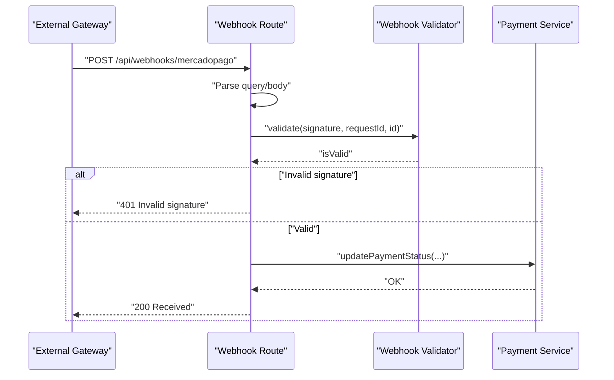

**Diagram sources**

- [src/app/api/webhooks/mercadopago/route.ts](file://src/app/api/webhooks/mercadopago/route.ts#L1-L372)
- [src/lib/payments/mercadopago/webhook-validator.ts](file://src/lib/payments/mercadopago/webhook-validator.ts#L1-L200)
- [src/lib/payments/services/payment-service.ts](file://src/lib/payments/services/payment-service.ts#L1-L200)

**Section sources**

- [src/app/api/webhooks/mercadopago/route.ts](file://src/app/api/webhooks/mercadopago/route.ts#L1-L372)
- [src/app/api/webhooks/nowpayments/route.ts](file://src/app/api/webhooks/nowpayments/route.ts#L1-L70)

### Payment Intent Creation (Admin)

- Purpose: Create payment intents for admin-initiated transactions.
- Authentication: Requires authenticated admin user.
- Authorization: Checks admin role via RPC.
- Organization Scope: Uses admin user’s organization_id for scoping.

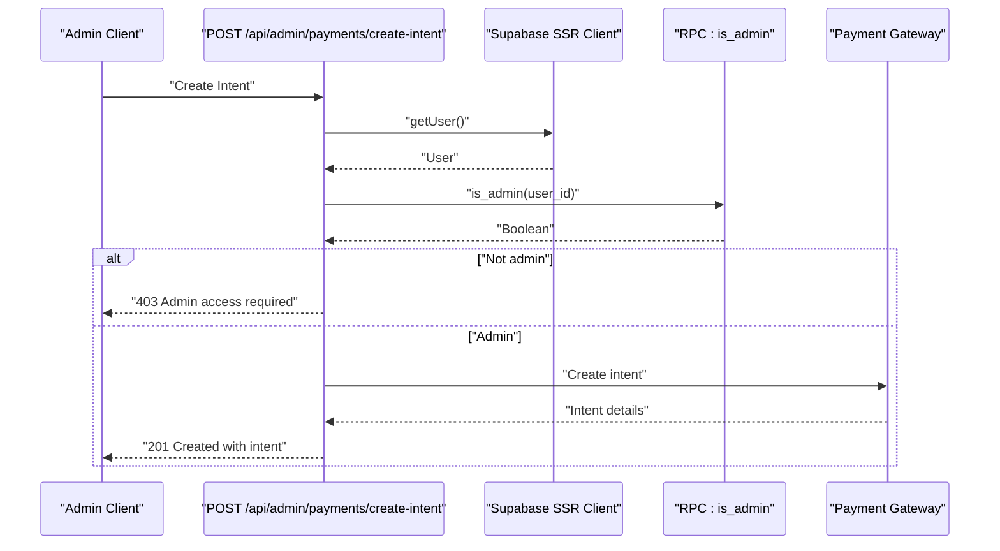

**Diagram sources**

- [src/app/api/admin/payments/create-intent/route.ts](file://src/app/api/admin/payments/create-intent/route.ts#L1-L200)

**Section sources**

- [src/app/api/admin/payments/create-intent/route.ts](file://src/app/api/admin/payments/create-intent/route.ts#L1-L200)

### Webhook Architecture: MercadoPago

- Topics: Supports payment, merchant_order, subscription_preapproval, preapproval.
- Signature Validation: Validates HMAC signature using configured secret.
- Idempotency: Records events in webhook_events to avoid duplicate processing.
- Fulfillment: Updates payment status and fulfills orders and organization subscriptions upon success.

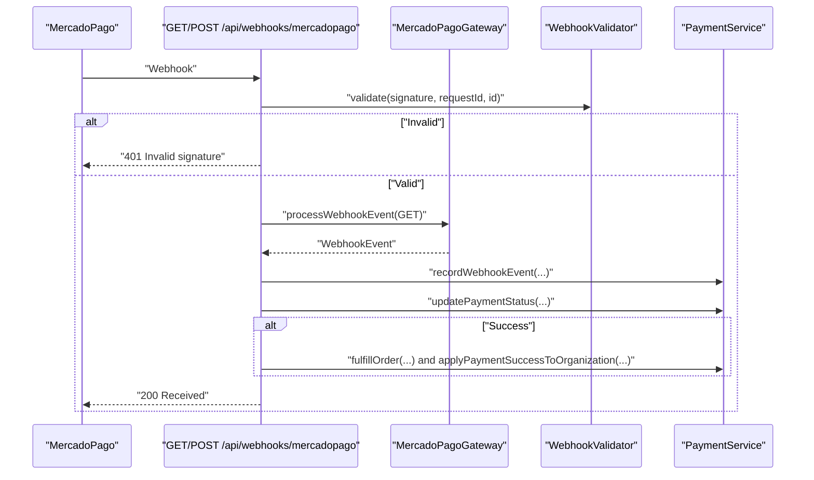

**Diagram sources**

- [src/app/api/webhooks/mercadopago/route.ts](file://src/app/api/webhooks/mercadopago/route.ts#L1-L372)
- [src/lib/payments/mercadopago/gateway.ts](file://src/lib/payments/mercadopago/gateway.ts#L1-L200)
- [src/lib/payments/mercadopago/webhook-validator.ts](file://src/lib/payments/mercadopago/webhook-validator.ts#L1-L200)
- [src/lib/payments/services/payment-service.ts](file://src/lib/payments/services/payment-service.ts#L1-L200)

**Section sources**

- [src/app/api/webhooks/mercadopago/route.ts](file://src/app/api/webhooks/mercadopago/route.ts#L1-L372)

### Webhook Architecture: NowPayments

- Processing: Uses PaymentGatewayFactory to process IPN callbacks.
- Idempotency: PaymentService records and checks webhook events.
- Response: Returns 200 OK for successful processing; logs errors without retrying failures.

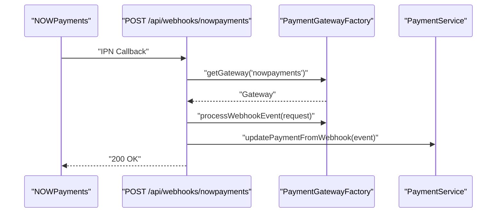

**Diagram sources**

- [src/app/api/webhooks/nowpayments/route.ts](file://src/app/api/webhooks/nowpayments/route.ts#L1-L70)
- [src/lib/payments/factory.ts](file://src/lib/payments/factory.ts#L1-L200)
- [src/lib/payments/services/payment-service.ts](file://src/lib/payments/services/payment-service.ts#L1-L200)

**Section sources**

- [src/app/api/webhooks/nowpayments/route.ts](file://src/app/api/webhooks/nowpayments/route.ts#L1-L70)

### Webhook Architecture: PayPal

- Processing: PayPal webhook handler delegates to the gateway adapter and PaymentService.
- Idempotency: Records and checks webhook events to prevent duplicates.
- Response: Returns success responses for accepted events.

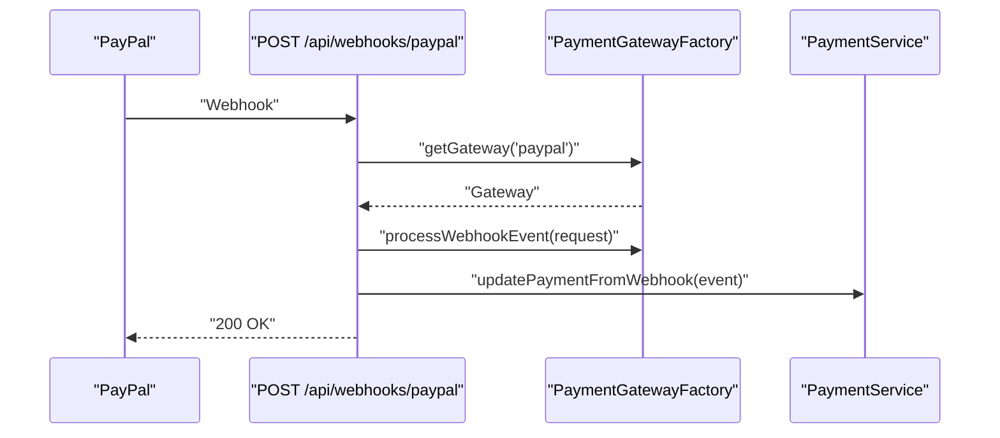

**Diagram sources**

- [src/app/api/webhooks/paypal/route.ts](file://src/app/api/webhooks/paypal/route.ts#L1-L200)
- [src/lib/payments/factory.ts](file://src/lib/payments/factory.ts#L1-L200)
- [src/lib/payments/services/payment-service.ts](file://src/lib/payments/services/payment-service.ts#L1-L200)

**Section sources**

- [src/app/api/webhooks/paypal/route.ts](file://src/app/api/webhooks/paypal/route.ts#L1-L200)

### Checkout API (Public)

- Intent Creation: Creates payment intents for customer-facing purchases.
- Confirmation: Confirms payments and finalizes transactions.
- Subscriptions: Manages recurring plans and current subscription status.
- Gateways: Lists available payment gateways.

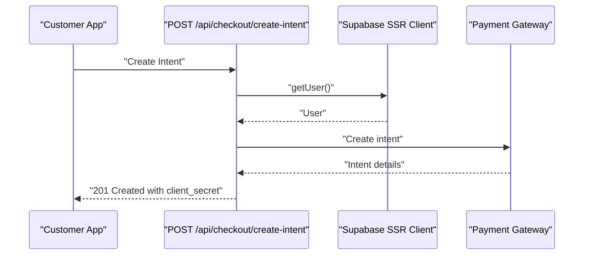

**Diagram sources**

- [src/app/api/checkout/create-intent/route.ts](file://src/app/api/checkout/create-intent/route.ts#L1-L200)
- [src/app/api/checkout/confirm-payment/route.ts](file://src/app/api/checkout/confirm-payment/route.ts#L1-L200)
- [src/app/api/checkout/current-subscription/route.ts](file://src/app/api/checkout/current-subscription/route.ts#L1-L200)
- [src/app/api/checkout/recurring-plans/route.ts](file://src/app/api/checkout/recurring-plans/route.ts#L1-L200)
- [src/app/api/checkout/gateways/route.ts](file://src/app/api/checkout/gateways/route.ts#L1-L200)
- [src/app/api/checkout/create-preapproval/route.ts](file://src/app/api/checkout/create-preapproval/route.ts#L1-L200)
- [src/app/api/checkout/tiers/route.ts](file://src/app/api/checkout/tiers/route.ts#L1-L200)

**Section sources**

- [src/app/api/checkout/create-intent/route.ts](file://src/app/api/checkout/create-intent/route.ts#L1-L200)
- [src/app/api/checkout/confirm-payment/route.ts](file://src/app/api/checkout/confirm-payment/route.ts#L1-L200)
- [src/app/api/checkout/current-subscription/route.ts](file://src/app/api/checkout/current-subscription/route.ts#L1-L200)
- [src/app/api/checkout/recurring-plans/route.ts](file://src/app/api/checkout/recurring-plans/route.ts#L1-L200)
- [src/app/api/checkout/gateways/route.ts](file://src/app/api/checkout/gateways/route.ts#L1-L200)
- [src/app/api/checkout/create-preapproval/route.ts](file://src/app/api/checkout/create-preapproval/route.ts#L1-L200)
- [src/app/api/checkout/tiers/route.ts](file://src/app/api/checkout/tiers/route.ts#L1-L200)

## Dependency Analysis

Key runtime dependencies relevant to API functionality:

- Next.js: App Router and server-side rendering.
- Supabase: SSR client for authentication and database access.
- Payment Libraries: MercadoPago SDK and Stripe for payment processing.
- Utilities: Zod for validation, Pino for logging.

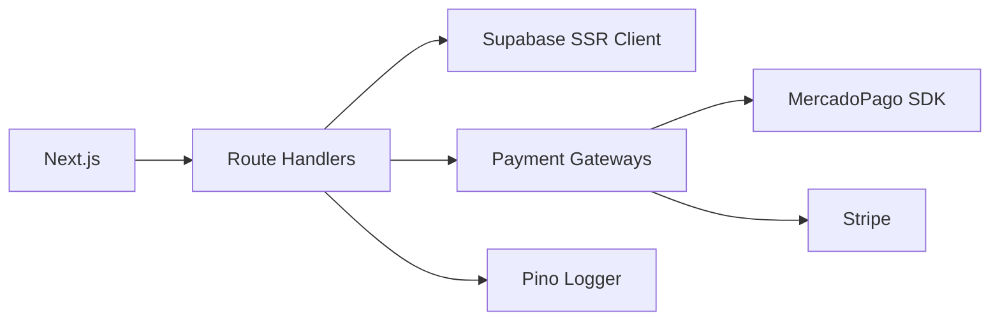

**Diagram sources**

- [package.json](file://package.json#L36-L86)
- [src/utils/supabase/server.ts](file://src/utils/supabase/server.ts#L1-L200)
- [src/lib/payments/mercadopago/gateway.ts](file://src/lib/payments/mercadopago/gateway.ts#L1-L200)
- [src/lib/payments/index.ts](file://src/lib/payments/index.ts#L1-L200)

**Section sources**

- [package.json](file://package.json#L36-L86)

## Performance Considerations

- Minimize Database Calls: Batch operations and reuse Supabase client instances.
- Idempotency: Webhooks rely on recorded events to avoid duplicate processing.
- Logging Overhead: Use structured logging sparingly in hot paths; leverage centralized logger for observability.
- Caching: Consider caching frequently accessed configuration data (e.g., gateway settings) in memory.

[No sources needed since this section provides general guidance]

## Troubleshooting Guide

Common issues and resolutions:

- Authentication Failures: Ensure the client sends the correct Supabase auth cookie and that the user is logged in.
- Authorization Errors: Verify admin role and root user permissions via RPC checks.
- Webhook Signature Validation: Confirm webhook secret configuration and header presence (signature and request id).
- Missing Payment Intents: Ensure gatewayPaymentIntentId is present in webhook events; otherwise, mark as processed and log.
- Duplicate Events: Check webhook_events table for already processed events.

**Section sources**

- [src/app/api/webhooks/mercadopago/route.ts](file://src/app/api/webhooks/mercadopago/route.ts#L1-L372)
- [src/app/api/webhooks/nowpayments/route.ts](file://src/app/api/webhooks/nowpayments/route.ts#L1-L70)
- [src/lib/payments/services/payment-service.ts](file://src/lib/payments/services/payment-service.ts#L1-L200)

## Conclusion

Opttius employs a clean, resource-based RESTful API design within Next.js App Router. Administrative endpoints enforce strict authentication and authorization, while webhook handlers provide secure, idempotent payment processing for multiple gateways. The architecture emphasizes consistency, observability, and maintainability, with clear separation of concerns across route handlers, services, and utilities.

[No sources needed since this section summarizes without analyzing specific files]

## Appendices

### API Design Patterns and Standards

- Resource-based Routing: Use plural nouns for collections and singular IDs for resources.
- Consistent Response Formatting: Return JSON with either data payloads or standardized error objects.
- Error Handling: Use 401 Unauthorized, 403 Forbidden, and 500 Internal Server Error consistently.
- Parameter Validation: Validate route parameters, query parameters, and request bodies.
- Request/Response Schema: Document request and response shapes per endpoint; keep schemas aligned with database types.

[No sources needed since this section provides general guidance]

### Security Headers and CORS

- CORS: Configure CORS in Next.js configuration to allow trusted origins for API consumption.
- Security Headers: Apply security headers (e.g., Content-Security-Policy, Strict-Transport-Security) at the edge or middleware level.
- Rate Limiting: Implement rate limiting at the edge or middleware to protect sensitive endpoints.

[No sources needed since this section provides general guidance]

### API Versioning and Backward Compatibility

- Versioning Strategy: Use path-based versioning (e.g., /api/v1/) or header-based versioning; maintain backward compatibility by deprecating fields rather than removing them immediately.
- Migration Plan: Provide migration guides and rollback procedures for breaking changes.

[No sources needed since this section provides general guidance]

### Integration Guidelines for Client Applications

- Authentication: Clients must authenticate via Supabase and include the auth cookie in requests to admin endpoints.
- Webhook Integration: Configure webhook endpoints with proper signing secrets and handle idempotency.
- Error Handling: Clients should parse standardized error responses and surface actionable messages to users.

[No sources needed since this section provides general guidance]
