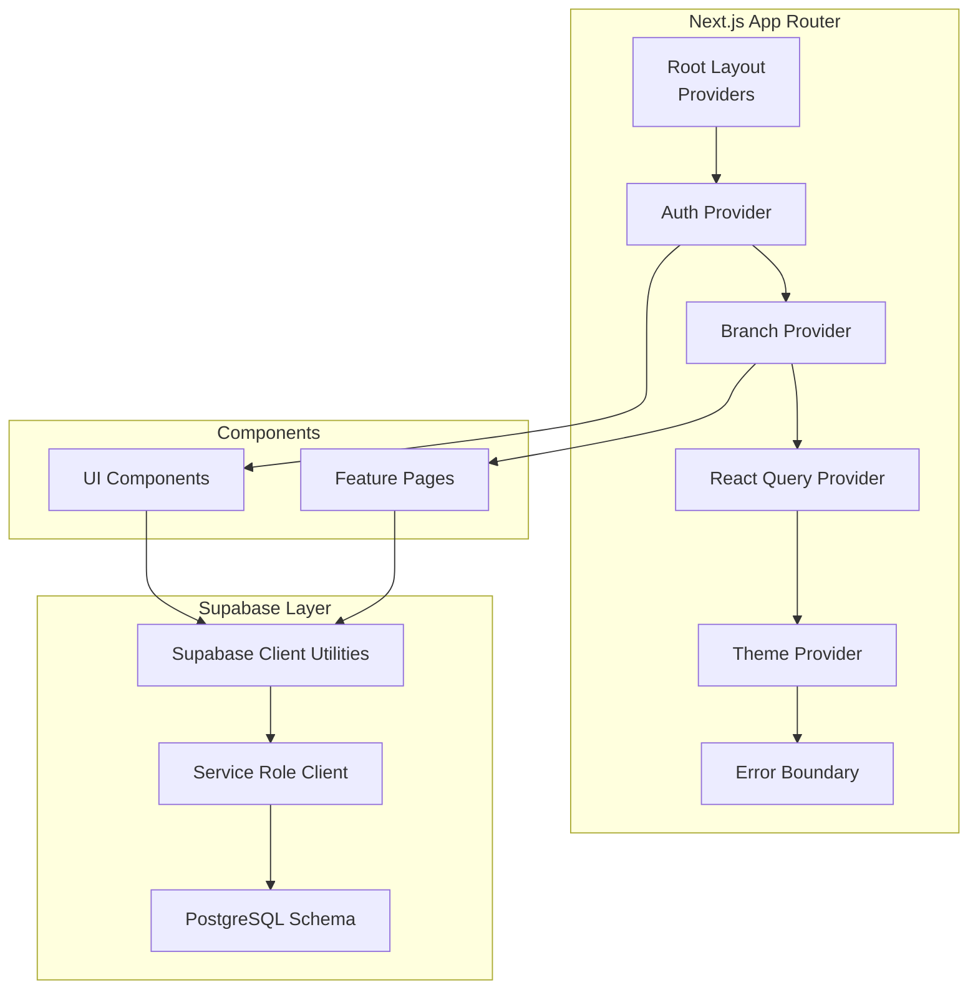
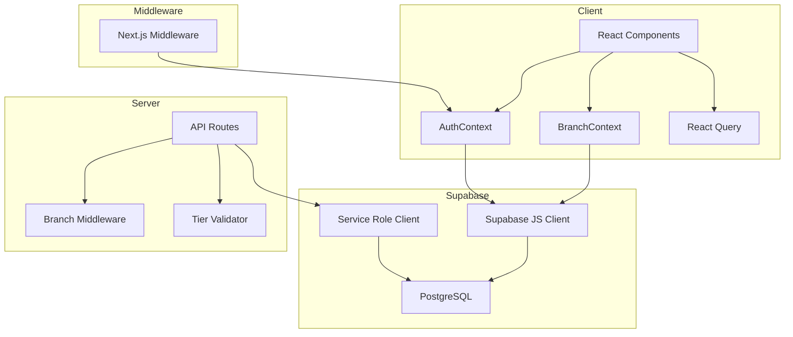
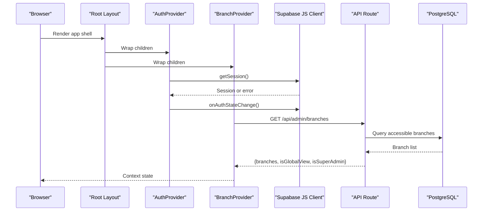
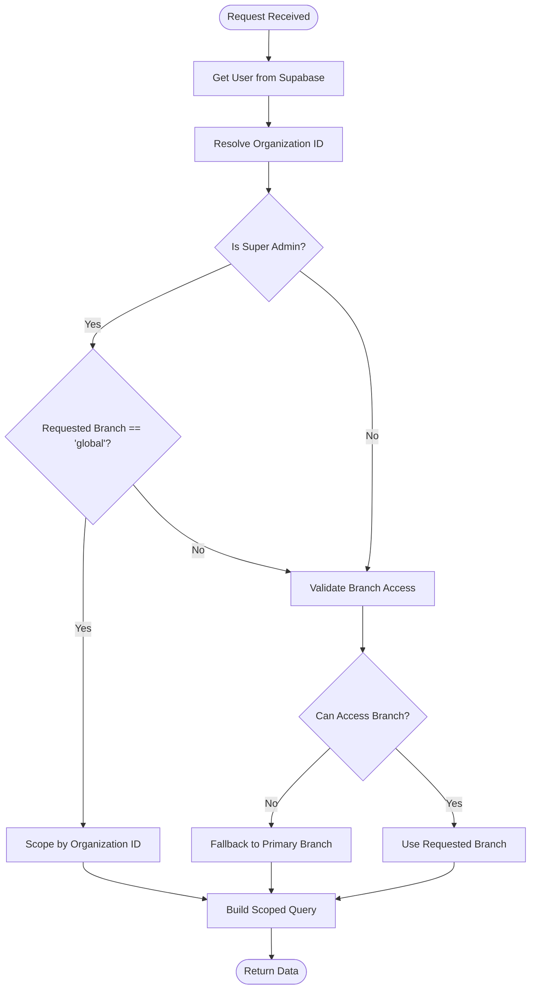
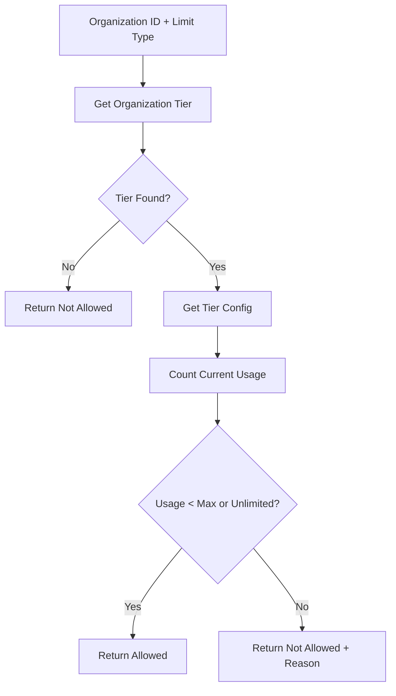
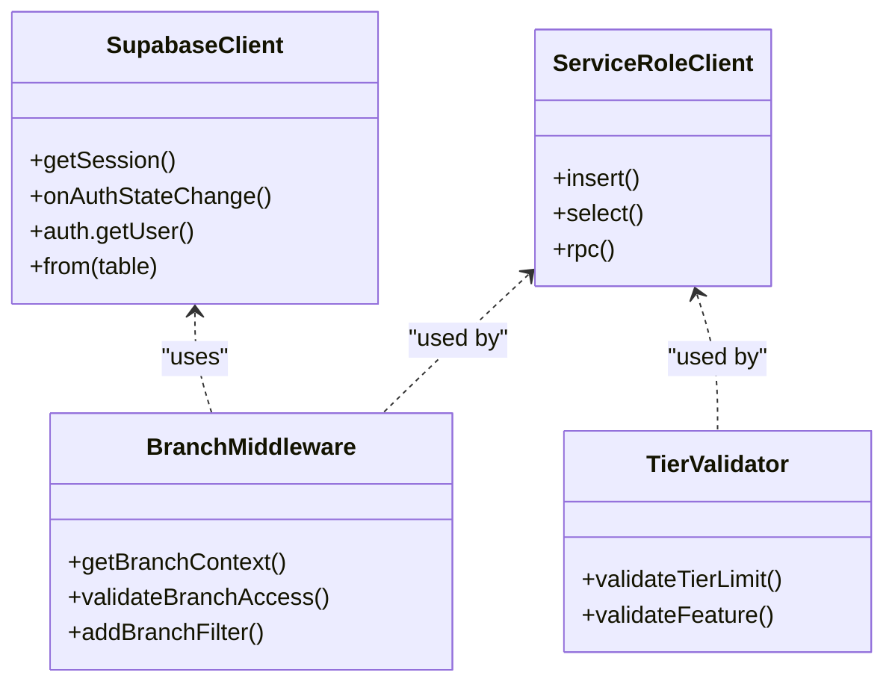
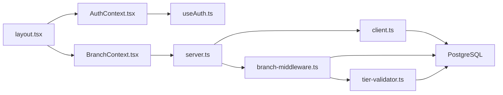

# Architecture Overview

<cite>
**Referenced Files in This Document**
- [middleware.ts](file://src/middleware.ts)
- [layout.tsx](file://src/app/layout.tsx)
- [AuthContext.tsx](file://src/contexts/AuthContext.tsx)
- [BranchContext.tsx](file://src/contexts/BranchContext.tsx)
- [useAuth.ts](file://src/hooks/useAuth.ts)
- [supabase.ts](file://src/lib/supabase.ts)
- [client.ts](file://src/utils/supabase/client.ts)
- [server.ts](file://src/utils/supabase/server.ts)
- [branch-middleware.ts](file://src/lib/api/branch-middleware.ts)
- [route.ts](file://src/app/api/admin/organizations/route.ts)
- [route.ts](file://src/app/api/admin/branches/route.ts)
- [database.ts](file://src/types/database.ts)
- [20260128000000_create_organizations_and_subscriptions.sql](file://supabase/migrations/20260128000000_create_organizations_and_subscriptions.sql)
- [20251216000000_create_branches_system.sql](file://supabase/migrations/20251216000000_create_branches_system.sql)
- [tier-validator.ts](file://src/lib/saas/tier-validator.ts)
</cite>

## Table of Contents

1. [Introduction](#introduction)
2. [Project Structure](#project-structure)
3. [Core Components](#core-components)
4. [Architecture Overview](#architecture-overview)
5. [Detailed Component Analysis](#detailed-component-analysis)
6. [Dependency Analysis](#dependency-analysis)
7. [Performance Considerations](#performance-considerations)
8. [Troubleshooting Guide](#troubleshooting-guide)
9. [Conclusion](#conclusion)
10. [Appendices](#appendices)

## Introduction

This document describes the multi-tenant SaaS architecture and Next.js 14 App Router implementation of Opttius. It focuses on provider pattern for state management, repository-like data access abstractions, component composition, authentication and authorization with Supabase Auth and role-based access control, organization-based data isolation, middleware-driven route protection and tenant scoping, and the data flow from React components to Supabase clients and real-time synchronization. It also outlines infrastructure requirements, scalability considerations, deployment topology, cross-cutting concerns (security, monitoring, disaster recovery), and third-party dependency management.

## Project Structure

Opttius follows a layered Next.js 14 App Router structure:

- App Router pages and layouts under src/app
- Shared providers in the root layout
- Authentication and branch contexts under src/contexts
- Hooks for auth logic under src/hooks
- Supabase client utilities under src/utils/supabase
- API routes under src/app/api for server-side operations
- Supabase database migrations under supabase/migrations
- Type-safe database definitions under src/types

**Diagram sources**

- [layout.tsx](file://src/app/layout.tsx#L30-L55)
- [AuthContext.tsx](file://src/contexts/AuthContext.tsx#L28-L36)
- [BranchContext.tsx](file://src/contexts/BranchContext.tsx#L38-L206)
- [client.ts](file://src/utils/supabase/client.ts#L3-L8)
- [server.ts](file://src/utils/supabase/server.ts#L6-L33)

**Section sources**

- [layout.tsx](file://src/app/layout.tsx#L30-L55)

## Core Components

- Providers and Composition
  - Root layout composes ThemeProvider, ErrorBoundary, QueryProvider, AuthProvider, and BranchProvider to establish global state and data fetching.
- Authentication and Authorization
  - Supabase Auth client configured for auto-refresh and persisted sessions; server-side client supports cookie and Bearer token authentication.
  - useAuth hook manages session lifecycle, profile loading, and auth operations with timeouts and error handling.
- Multi-Tenant SaaS
  - Organizations represent tenants; branches represent locations within an organization; admin users belong to an organization and have role-based access.
  - Branch middleware resolves current branch context, validates access, and scopes queries to organization boundaries.
- API Routes
  - Server-side routes use service role clients to bypass RLS for administrative tasks while enforcing authorization and tier limits.

**Section sources**

- [layout.tsx](file://src/app/layout.tsx#L30-L55)
- [supabase.ts](file://src/lib/supabase.ts#L11-L17)
- [server.ts](file://src/utils/supabase/server.ts#L43-L92)
- [useAuth.ts](file://src/hooks/useAuth.ts#L18-L130)
- [branch-middleware.ts](file://src/lib/api/branch-middleware.ts#L48-L210)

## Architecture Overview

The system implements a provider-centric architecture with Supabase as the central data and auth layer. Providers encapsulate state and side effects, while API routes handle server-side operations with explicit authorization and tier checks.

**Diagram sources**

- [middleware.ts](file://src/middleware.ts#L14-L95)
- [AuthContext.tsx](file://src/contexts/AuthContext.tsx#L28-L36)
- [BranchContext.tsx](file://src/contexts/BranchContext.tsx#L38-L206)
- [route.ts](file://src/app/api/admin/branches/route.ts#L10-L112)
- [branch-middleware.ts](file://src/lib/api/branch-middleware.ts#L48-L210)
- [tier-validator.ts](file://src/lib/saas/tier-validator.ts#L90-L143)
- [supabase.ts](file://src/lib/supabase.ts#L11-L17)
- [server.ts](file://src/utils/supabase/server.ts#L94-L109)

## Detailed Component Analysis

### Authentication and Authorization Flow

- Browser initializes Supabase client with auto-refresh and persisted sessions.
- useAuth hook loads initial session, fetches profile with timeouts, and subscribes to auth state changes.
- Middleware protects routes by verifying auth cookies and redirecting unauthenticated users to login.
- Organization and branch scoping are enforced via server-side logic and branch middleware.

**Diagram sources**

- [layout.tsx](file://src/app/layout.tsx#L30-L55)
- [AuthContext.tsx](file://src/contexts/AuthContext.tsx#L28-L36)
- [BranchContext.tsx](file://src/contexts/BranchContext.tsx#L38-L206)
- [useAuth.ts](file://src/hooks/useAuth.ts#L27-L130)
- [route.ts](file://src/app/api/admin/branches/route.ts#L10-L112)

**Section sources**

- [supabase.ts](file://src/lib/supabase.ts#L11-L17)
- [client.ts](file://src/utils/supabase/client.ts#L3-L8)
- [server.ts](file://src/utils/supabase/server.ts#L43-L92)
- [useAuth.ts](file://src/hooks/useAuth.ts#L18-L130)
- [middleware.ts](file://src/middleware.ts#L14-L95)

### Multi-Tenant Data Isolation and Branch Scoping

- Organizations are tenants; branches belong to organizations; admin users belong to organizations and have roles.
- Branch middleware determines current branch context, validates access, and scopes queries to organization boundaries.
- Supabase RLS policies enforce row-level isolation for organizations, subscriptions, branches, and branch access.

**Diagram sources**

- [branch-middleware.ts](file://src/lib/api/branch-middleware.ts#L48-L210)
- [20260128000000_create_organizations_and_subscriptions.sql](file://supabase/migrations/20260128000000_create_organizations_and_subscriptions.sql#L93-L132)
- [20251216000000_create_branches_system.sql](file://supabase/migrations/20251216000000_create_branches_system.sql#L222-L302)

**Section sources**

- [branch-middleware.ts](file://src/lib/api/branch-middleware.ts#L48-L210)
- [20260128000000_create_organizations_and_subscriptions.sql](file://supabase/migrations/20260128000000_create_organizations_and_subscriptions.sql#L93-L132)
- [20251216000000_create_branches_system.sql](file://supabase/migrations/20251216000000_create_branches_system.sql#L222-L302)

### SaaS Tier Validation and Feature Gates

- Tier validator retrieves organization tier, counts current usage, compares against tier limits, and returns validation results.
- API routes call tier validation before creating branches and other operations.

**Diagram sources**

- [tier-validator.ts](file://src/lib/saas/tier-validator.ts#L90-L143)

**Section sources**

- [tier-validator.ts](file://src/lib/saas/tier-validator.ts#L90-L143)
- [route.ts](file://src/app/api/admin/branches/route.ts#L194-L209)

### Data Access Abstractions and Repository Pattern

- Supabase client utilities provide a thin abstraction over Supabase JS for client and server environments.
- Service role client enables administrative operations that bypass RLS.
- API routes encapsulate repository-like operations: user/org/branch retrieval, validation, and persistence.

**Diagram sources**

- [client.ts](file://src/utils/supabase/client.ts#L3-L8)
- [server.ts](file://src/utils/supabase/server.ts#L94-L109)
- [branch-middleware.ts](file://src/lib/api/branch-middleware.ts#L48-L210)
- [tier-validator.ts](file://src/lib/saas/tier-validator.ts#L90-L143)

**Section sources**

- [client.ts](file://src/utils/supabase/client.ts#L3-L8)
- [server.ts](file://src/utils/supabase/server.ts#L94-L109)
- [branch-middleware.ts](file://src/lib/api/branch-middleware.ts#L48-L210)
- [tier-validator.ts](file://src/lib/saas/tier-validator.ts#L90-L143)

## Dependency Analysis

- Provider hierarchy: ThemeProvider -> ErrorBoundary -> QueryProvider -> AuthProvider -> BranchProvider -> Children.
- AuthContext depends on Supabase client and useAuth hook.
- BranchContext depends on AuthContext and server API for branch data.
- API routes depend on branch middleware and tier validator for authorization and limits.
- Supabase clients depend on environment variables for credentials.

**Diagram sources**

- [layout.tsx](file://src/app/layout.tsx#L30-L55)
- [AuthContext.tsx](file://src/contexts/AuthContext.tsx#L28-L36)
- [BranchContext.tsx](file://src/contexts/BranchContext.tsx#L38-L206)
- [useAuth.ts](file://src/hooks/useAuth.ts#L18-L130)
- [server.ts](file://src/utils/supabase/server.ts#L6-L33)
- [client.ts](file://src/utils/supabase/client.ts#L3-L8)
- [branch-middleware.ts](file://src/lib/api/branch-middleware.ts#L48-L210)
- [tier-validator.ts](file://src/lib/saas/tier-validator.ts#L90-L143)

**Section sources**

- [layout.tsx](file://src/app/layout.tsx#L30-L55)
- [server.ts](file://src/utils/supabase/server.ts#L6-L33)
- [branch-middleware.ts](file://src/lib/api/branch-middleware.ts#L48-L210)

## Performance Considerations

- Client-side auth initialization includes timeouts to prevent indefinite loading.
- Branch context leverages localStorage for super admins to avoid repeated server calls.
- API routes use service role clients for administrative operations and RLS-aware queries for user-facing data.
- Tier validation avoids redundant counting by accepting current counts when available.

[No sources needed since this section provides general guidance]

## Troubleshooting Guide

- Authentication issues
  - Verify NEXT_PUBLIC_SUPABASE_URL and NEXT_PUBLIC_SUPABASE_ANON_KEY are set.
  - Check middleware redirection to login for missing auth cookies.
  - Inspect useAuth timeouts and error logs for session retrieval failures.
- Branch access problems
  - Confirm admin_branch_access records and is_super_admin function results.
  - Validate branch middleware’s getBranchContext and validateBranchAccess logic.
- Tier limit errors
  - Review tier-validator results and organization tier configuration.
  - Ensure subscription_tiers table contains expected limits.

**Section sources**

- [supabase.ts](file://src/lib/supabase.ts#L7-L9)
- [middleware.ts](file://src/middleware.ts#L71-L80)
- [useAuth.ts](file://src/hooks/useAuth.ts#L32-L91)
- [branch-middleware.ts](file://src/lib/api/branch-middleware.ts#L215-L235)
- [tier-validator.ts](file://src/lib/saas/tier-validator.ts#L90-L143)

## Conclusion

Opttius employs a clean provider-based architecture with Supabase as the backbone for authentication, authorization, and data access. The multi-tenant design centers on organizations and branches, enforced by Supabase RLS policies and branch middleware. API routes encapsulate server-side logic with explicit authorization and tier validation. The system balances developer productivity with strong isolation and scalability through environment-driven configuration and service role clients.

[No sources needed since this section summarizes without analyzing specific files]

## Appendices

### Technology Stack Integration Patterns

- Next.js 14 App Router with server/client components and middleware.
- Supabase Auth and Postgres for identity, RLS, and data persistence.
- React Query for caching and optimistic updates.
- Tailwind CSS for styling and theme provider.

[No sources needed since this section provides general guidance]

### Third-Party Dependencies Management

- Environment variables for Supabase credentials and service role keys.
- Supabase client libraries for browser and server environments.
- PostgreSQL extensions and triggers managed via migrations.

**Section sources**

- [supabase.ts](file://src/lib/supabase.ts#L4-L5)
- [server.ts](file://src/utils/supabase/server.ts#L47-L53)

### Infrastructure Requirements and Deployment Topology

- Frontend: Next.js application served via Vercel or compatible platform.
- Backend: Supabase project hosting PostgreSQL, Auth, and Storage.
- Database: Migrations applied to enforce RLS policies and multi-tenancy schema.
- Real-time: Supabase client auto-refresh and auth state subscriptions.

**Section sources**

- [20260128000000_create_organizations_and_subscriptions.sql](file://supabase/migrations/20260128000000_create_organizations_and_subscriptions.sql#L1-L287)
- [20251216000000_create_branches_system.sql](file://supabase/migrations/20251216000000_create_branches_system.sql#L1-L397)

### Cross-Cutting Concerns

- Security: Supabase RLS policies, service role bypass for admin ops, branch scoping, and tier validation.
- Monitoring: Application logging via appLogger in API routes.
- Disaster Recovery: Supabase-managed backups and immutable migrations.

**Section sources**

- [route.ts](file://src/app/api/admin/organizations/route.ts#L89-L102)
- [route.ts](file://src/app/api/admin/branches/route.ts#L105-L111)
