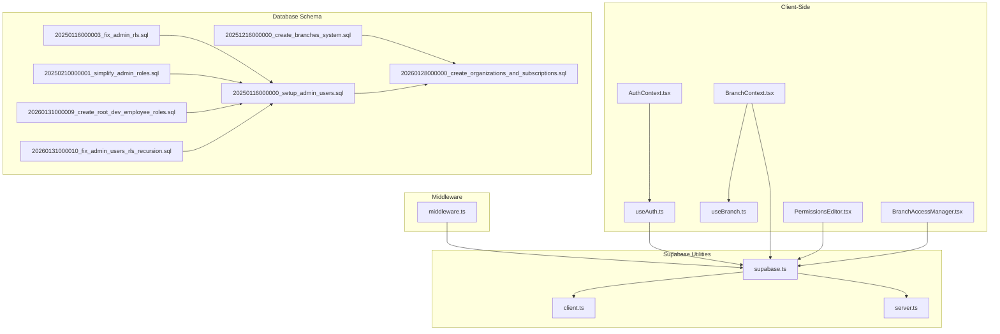
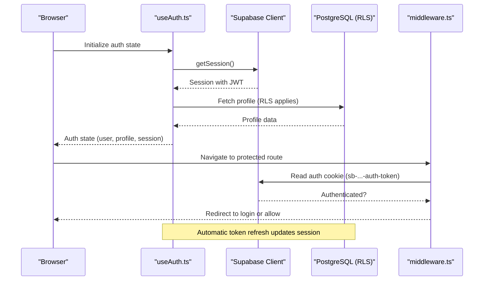
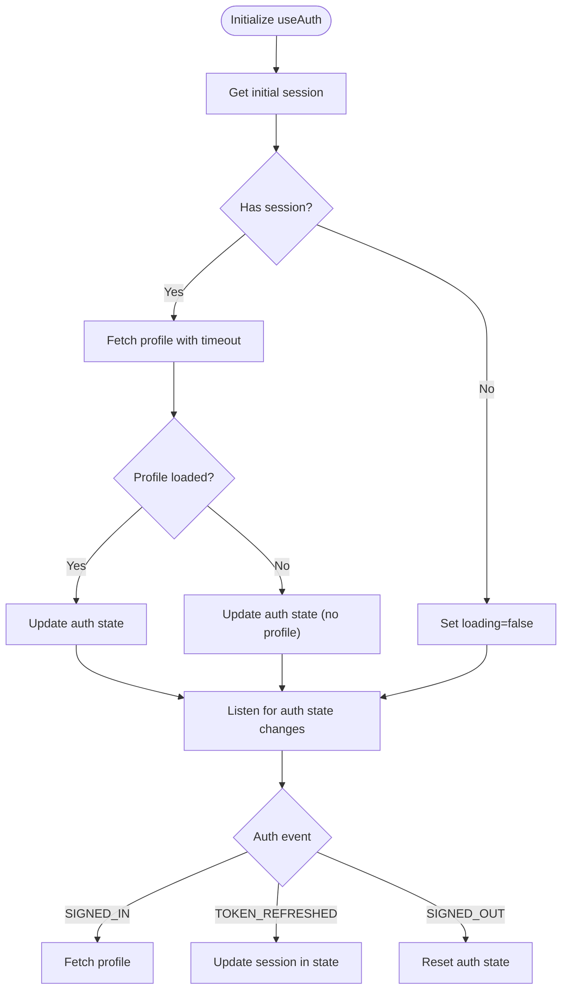
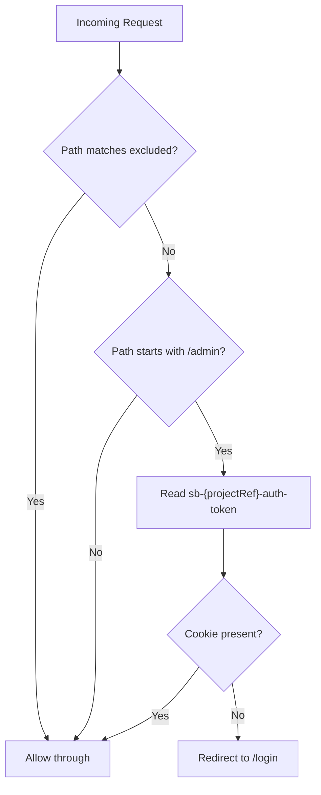
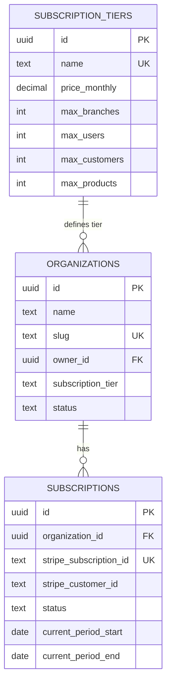
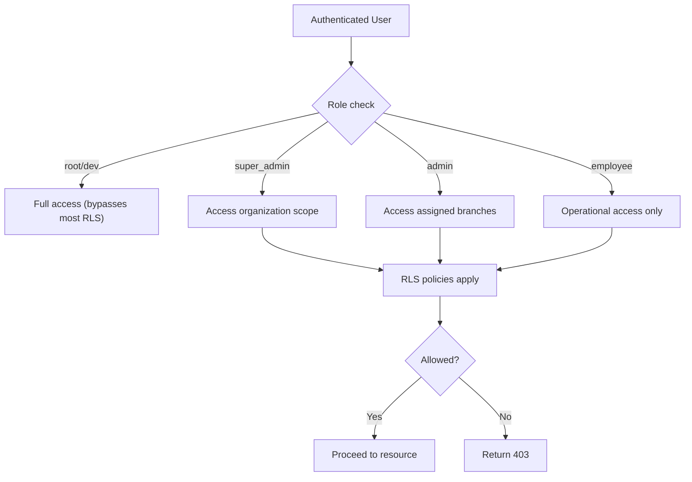
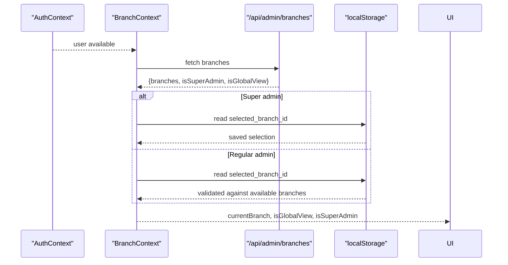
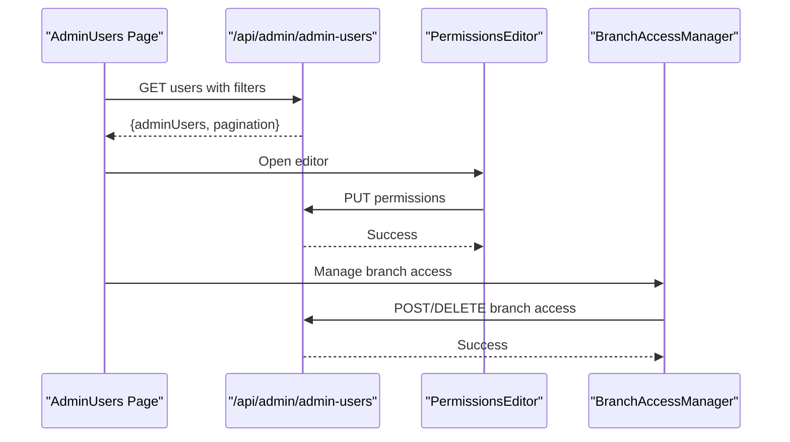
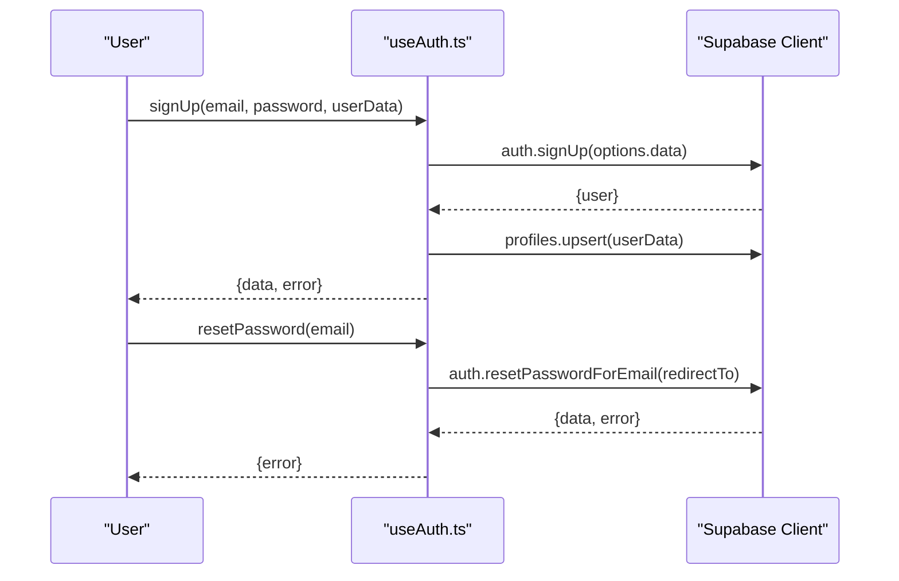
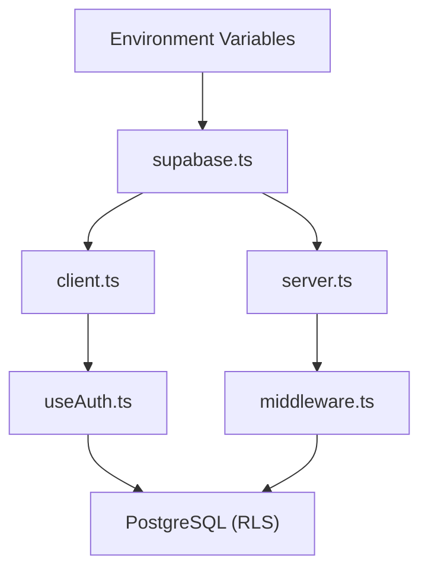

# Authentication & Authorization

<cite>
**Referenced Files in This Document**
- [AuthContext.tsx](file://src/contexts/AuthContext.tsx)
- [useAuth.ts](file://src/hooks/useAuth.ts)
- [middleware.ts](file://src/middleware.ts)
- [supabase.ts](file://src/lib/supabase.ts)
- [client.ts](file://src/utils/supabase/client.ts)
- [server.ts](file://src/utils/supabase/server.ts)
- [20251216000000_create_branches_system.sql](file://supabase/migrations/20251216000000_create_branches_system.sql)
- [20260128000000_create_organizations_and_subscriptions.sql](file://supabase/migrations/20260128000000_create_organizations_and_subscriptions.sql)
- [20250116000000_setup_admin_users.sql](file://supabase/migrations/20250116000000_setup_admin_users.sql)
- [20250116000003_fix_admin_rls.sql](file://supabase/migrations/20250116000003_fix_admin_rls.sql)
- [20250210000001_simplify_admin_roles.sql](file://supabase/migrations/20250210000001_simplify_admin_roles.sql)
- [20260131000009_create_root_dev_employee_roles.sql](file://supabase/migrations/20260131000009_create_root_dev_employee_roles.sql)
- [20260131000010_fix_admin_users_rls_recursion.sql](file://supabase/migrations/20260131000010_fix_admin_users_rls_recursion.sql)
- [BranchContext.tsx](file://src/contexts/BranchContext.tsx)
- [useBranch.ts](file://src/hooks/useBranch.ts)
- [PermissionsEditor.tsx](file://src/components/admin/PermissionsEditor.tsx)
- [BranchAccessManager.tsx](file://src/components/admin/BranchAccessManager.tsx)
- [admin-users/page.tsx](file://src/app/admin/admin-users/page.tsx)
- [database.ts](file://src/types/database.ts)
</cite>

## Table of Contents

1. [Introduction](#introduction)
2. [Project Structure](#project-structure)
3. [Core Components](#core-components)
4. [Architecture Overview](#architecture-overview)
5. [Detailed Component Analysis](#detailed-component-analysis)
6. [Dependency Analysis](#dependency-analysis)
7. [Performance Considerations](#performance-considerations)
8. [Security Considerations](#security-considerations)
9. [Troubleshooting Guide](#troubleshooting-guide)
10. [Conclusion](#conclusion)

## Introduction

This document describes the authentication and authorization architecture for Opttius, focusing on Supabase Auth integration, JWT token lifecycle, session handling, automatic refresh mechanisms, and the role-based access control (RBAC) system. It explains organization-level permissions, branch-specific access controls, middleware-based route protection, and tenant verification. It also covers user registration, password reset, and account management workflows, along with the permission matrix for different user roles, security considerations, and implementation examples for custom authorization checks and dynamic permission evaluation.

## Project Structure

The authentication and authorization system spans client-side React hooks, server-side Supabase utilities, middleware for route protection, and database-level row-level security (RLS) policies with multi-tenancy and multi-branch support.



**Diagram sources**

- [AuthContext.tsx](file://src/contexts/AuthContext.tsx#L1-L71)
- [useAuth.ts](file://src/hooks/useAuth.ts#L1-L377)
- [BranchContext.tsx](file://src/contexts/BranchContext.tsx#L1-L216)
- [useBranch.ts](file://src/hooks/useBranch.ts#L1-L53)
- [PermissionsEditor.tsx](file://src/components/admin/PermissionsEditor.tsx#L1-L202)
- [BranchAccessManager.tsx](file://src/components/admin/BranchAccessManager.tsx#L1-L342)
- [middleware.ts](file://src/middleware.ts#L1-L109)
- [supabase.ts](file://src/lib/supabase.ts#L1-L36)
- [client.ts](file://src/utils/supabase/client.ts#L1-L8)
- [server.ts](file://src/utils/supabase/server.ts#L1-L110)
- [20251216000000_create_branches_system.sql](file://supabase/migrations/20251216000000_create_branches_system.sql#L1-L397)
- [20260128000000_create_organizations_and_subscriptions.sql](file://supabase/migrations/20260128000000_create_organizations_and_subscriptions.sql#L1-L287)
- [20250116000000_setup_admin_users.sql](file://supabase/migrations/20250116000000_setup_admin_users.sql#L1-L280)
- [20250116000003_fix_admin_rls.sql](file://supabase/migrations/20250116000003_fix_admin_rls.sql#L1-L73)
- [20250210000001_simplify_admin_roles.sql](file://supabase/migrations/20250210000001_simplify_admin_roles.sql#L1-L87)
- [20260131000009_create_root_dev_employee_roles.sql](file://supabase/migrations/20260131000009_create_root_dev_employee_roles.sql#L1-L972)
- [20260131000010_fix_admin_users_rls_recursion.sql](file://supabase/migrations/20260131000010_fix_admin_users_rls_recursion.sql#L1-L77)

**Section sources**

- [AuthContext.tsx](file://src/contexts/AuthContext.tsx#L1-L71)
- [useAuth.ts](file://src/hooks/useAuth.ts#L1-L377)
- [middleware.ts](file://src/middleware.ts#L1-L109)
- [supabase.ts](file://src/lib/supabase.ts#L1-L36)
- [client.ts](file://src/utils/supabase/client.ts#L1-L8)
- [server.ts](file://src/utils/supabase/server.ts#L1-L110)
- [20251216000000_create_branches_system.sql](file://supabase/migrations/20251216000000_create_branches_system.sql#L1-L397)
- [20260128000000_create_organizations_and_subscriptions.sql](file://supabase/migrations/20260128000000_create_organizations_and_subscriptions.sql#L1-L287)
- [20250116000000_setup_admin_users.sql](file://supabase/migrations/20250116000000_setup_admin_users.sql#L1-L280)
- [20250116000003_fix_admin_rls.sql](file://supabase/migrations/20250116000003_fix_admin_rls.sql#L1-L73)
- [20250210000001_simplify_admin_roles.sql](file://supabase/migrations/20250210000001_simplify_admin_roles.sql#L1-L87)
- [20260131000009_create_root_dev_employee_roles.sql](file://supabase/migrations/20260131000009_create_root_dev_employee_roles.sql#L1-L972)
- [20260131000010_fix_admin_users_rls_recursion.sql](file://supabase/migrations/20260131000010_fix_admin_users_rls_recursion.sql#L1-L77)

## Core Components

- Supabase client configuration with automatic token refresh and persistence
- Client-side authentication state management with hooks
- Server-side Supabase client creation supporting cookies and Bearer tokens
- Middleware for route protection and organization verification
- Branch and organization context providers for tenant-aware UI and logic
- Role-based access control with organization-level and branch-level permissions
- Dynamic permission editor for granular admin permissions

**Section sources**

- [supabase.ts](file://src/lib/supabase.ts#L1-L36)
- [client.ts](file://src/utils/supabase/client.ts#L1-L8)
- [server.ts](file://src/utils/supabase/server.ts#L1-L110)
- [AuthContext.tsx](file://src/contexts/AuthContext.tsx#L1-L71)
- [useAuth.ts](file://src/hooks/useAuth.ts#L1-L377)
- [BranchContext.tsx](file://src/contexts/BranchContext.tsx#L1-L216)
- [useBranch.ts](file://src/hooks/useBranch.ts#L1-L53)
- [middleware.ts](file://src/middleware.ts#L1-L109)

## Architecture Overview

The system integrates Supabase Auth for identity and JWT management, with automatic token refresh enabled. Client-side hooks manage authentication state and profile retrieval. Middleware enforces route protection and organization verification. Database-level RLS policies enforce multi-tenancy (organizations), multi-branch access, and admin roles. The branch context maintains tenant-aware selections and preferences.



**Diagram sources**

- [useAuth.ts](file://src/hooks/useAuth.ts#L27-L130)
- [supabase.ts](file://src/lib/supabase.ts#L11-L17)
- [middleware.ts](file://src/middleware.ts#L44-L94)

**Section sources**

- [useAuth.ts](file://src/hooks/useAuth.ts#L27-L130)
- [supabase.ts](file://src/lib/supabase.ts#L11-L17)
- [middleware.ts](file://src/middleware.ts#L44-L94)

## Detailed Component Analysis

### Supabase Auth Integration and Token Management

- Client configuration enables auto-refresh and persistent sessions, ensuring seamless user experiences.
- Client and server utilities create Supabase clients with appropriate auth settings for browser and SSR contexts.
- Token refresh events update the local auth state without manual intervention.

```mermaid
classDiagram
class SupabaseClient {
+auth.autoRefreshToken : boolean
+auth.persistSession : boolean
+auth.detectSessionInUrl : boolean
}
class ClientUtils {
+createClient() : SupabaseClient
}
class ServerUtils {
+createClient() : SupabaseClient
+createClientFromRequest(request) : {client, getUser}
+createServiceRoleClient() : SupabaseClient
}
SupabaseClient <.. ClientUtils : "configured"
SupabaseClient <.. ServerUtils : "configured"
```

**Diagram sources**

- [supabase.ts](file://src/lib/supabase.ts#L11-L17)
- [client.ts](file://src/utils/supabase/client.ts#L1-L8)
- [server.ts](file://src/utils/supabase/server.ts#L6-L33)

**Section sources**

- [supabase.ts](file://src/lib/supabase.ts#L11-L17)
- [client.ts](file://src/utils/supabase/client.ts#L1-L8)
- [server.ts](file://src/utils/supabase/server.ts#L6-L33)

### Authentication State Management (useAuth)

- Initializes session, listens for auth state changes, and manages profile loading with timeouts and error handling.
- Provides sign-up, sign-in, sign-out, profile updates, and password reset flows.
- Handles TOKEN_REFRESHED events to keep session data current.



**Diagram sources**

- [useAuth.ts](file://src/hooks/useAuth.ts#L27-L130)

**Section sources**

- [useAuth.ts](file://src/hooks/useAuth.ts#L27-L130)

### Middleware-Based Route Protection and Tenant Verification

- Excludes public routes (login, signup, reset-password, support, API, static assets).
- For admin routes, verifies presence of Supabase auth cookie and redirects unauthenticated users to login.
- Uses environment-derived project reference to construct cookie names for token detection.



**Diagram sources**

- [middleware.ts](file://src/middleware.ts#L14-L94)

**Section sources**

- [middleware.ts](file://src/middleware.ts#L14-L94)

### Organization-Level Permissions and Multi-Tenancy

- Organizations table defines tenants with subscription tiers and status.
- RLS policies restrict visibility and modifications to authorized users.
- Subscription tiers define feature caps and limits.



**Diagram sources**

- [20260128000000_create_organizations_and_subscriptions.sql](file://supabase/migrations/20260128000000_create_organizations_and_subscriptions.sql#L5-L44)

**Section sources**

- [20260128000000_create_organizations_and_subscriptions.sql](file://supabase/migrations/20260128000000_create_organizations_and_subscriptions.sql#L5-L44)

### Branch-Level Access Controls and Admin Roles

- Branches table stores locations with optional preferred branch linkage in profiles.
- Admin-branch access grants manager/staff/viewer roles per branch or super admin (all branches).
- RLS policies enforce access based on is_super_admin and assigned branches.
- Functions provide role checks and accessible branch enumeration.

```mermaid
erDiagram
BRANCHES {
uuid id PK
text name
text code UK
boolean is_active
}
ADMIN_USERS {
uuid id PK FK
text email
text role
jsonb permissions
boolean is_active
}
ADMIN_BRANCH_ACCESS {
uuid id PK
uuid admin_user_id FK
uuid branch_id FK
text role
boolean is_primary
}
ADMIN_USERS ||--o{ ADMIN_BRANCH_ACCESS : "grants access"
BRANCHES ||--o{ ADMIN_BRANCH_ACCESS : "assigned to"
```

**Diagram sources**

- [20251216000000_create_branches_system.sql](file://supabase/migrations/20251216000000_create_branches_system.sql#L4-L33)
- [20250116000000_setup_admin_users.sql](file://supabase/migrations/20250116000000_setup_admin_users.sql#L4-L15)

**Section sources**

- [20251216000000_create_branches_system.sql](file://supabase/migrations/20251216000000_create_branches_system.sql#L4-L33)
- [20250116000000_setup_admin_users.sql](file://supabase/migrations/20250116000000_setup_admin_users.sql#L4-L15)

### Role-Based Access Control (RBAC) Matrix and Policies

- Roles include root/dev (full SaaS management), super_admin (organization-level), admin (limited), and employee (operational).
- RLS policies leverage helper functions to avoid recursion and enforce hierarchical access.
- Policies differentiate access for root/dev, super_admin, and regular admin/employee.



**Diagram sources**

- [20260131000009_create_root_dev_employee_roles.sql](file://supabase/migrations/20260131000009_create_root_dev_employee_roles.sql#L34-L66)
- [20260131000010_fix_admin_users_rls_recursion.sql](file://supabase/migrations/20260131000010_fix_admin_users_rls_recursion.sql#L15-L26)

**Section sources**

- [20260131000009_create_root_dev_employee_roles.sql](file://supabase/migrations/20260131000009_create_root_dev_employee_roles.sql#L34-L66)
- [20260131000010_fix_admin_users_rls_recursion.sql](file://supabase/migrations/20260131000010_fix_admin_users_rls_recursion.sql#L15-L26)

### Branch Context and Tenant-Aware Operations

- Branch provider loads accessible branches, supports global view for super admins, and persists selections in localStorage.
- Hook exposes convenient accessors and utilities for UI components and queries.



**Diagram sources**

- [BranchContext.tsx](file://src/contexts/BranchContext.tsx#L73-L155)
- [useBranch.ts](file://src/hooks/useBranch.ts#L40-L52)

**Section sources**

- [BranchContext.tsx](file://src/contexts/BranchContext.tsx#L73-L155)
- [useBranch.ts](file://src/hooks/useBranch.ts#L40-L52)

### Admin User Management and Permission Editor

- Admin users page lists users, filters by role/status, and paginates results.
- Permissions editor allows toggling granular permissions per resource/action.
- Branch access manager assigns/removes branch access and promotes to super admin.



**Diagram sources**

- [admin-users/page.tsx](file://src/app/admin/admin-users/page.tsx#L150-L181)
- [PermissionsEditor.tsx](file://src/components/admin/PermissionsEditor.tsx#L94-L118)
- [BranchAccessManager.tsx](file://src/components/admin/BranchAccessManager.tsx#L100-L187)

**Section sources**

- [admin-users/page.tsx](file://src/app/admin/admin-users/page.tsx#L150-L181)
- [PermissionsEditor.tsx](file://src/components/admin/PermissionsEditor.tsx#L94-L118)
- [BranchAccessManager.tsx](file://src/components/admin/BranchAccessManager.tsx#L100-L187)

### User Registration, Password Reset, and Account Management

- Sign-up creates user with optional profile data and triggers automatic profile creation via database trigger.
- Sign-in uses credentials and leverages Supabase auth state changes.
- Password reset sends reset instructions to the registered email.
- Profile updates are persisted and reflected in local state.



**Diagram sources**

- [useAuth.ts](file://src/hooks/useAuth.ts#L194-L265)
- [useAuth.ts](file://src/hooks/useAuth.ts#L338-L364)

**Section sources**

- [useAuth.ts](file://src/hooks/useAuth.ts#L194-L265)
- [useAuth.ts](file://src/hooks/useAuth.ts#L338-L364)

## Dependency Analysis

The authentication stack depends on Supabase client libraries and environment variables. Middleware relies on cookie parsing and Supabase URL detection. Database policies depend on helper functions and RLS configurations.



**Diagram sources**

- [supabase.ts](file://src/lib/supabase.ts#L4-L17)
- [client.ts](file://src/utils/supabase/client.ts#L1-L8)
- [server.ts](file://src/utils/supabase/server.ts#L1-L110)
- [useAuth.ts](file://src/hooks/useAuth.ts#L1-L377)
- [middleware.ts](file://src/middleware.ts#L1-L109)

**Section sources**

- [supabase.ts](file://src/lib/supabase.ts#L4-L17)
- [client.ts](file://src/utils/supabase/client.ts#L1-L8)
- [server.ts](file://src/utils/supabase/server.ts#L1-L110)
- [useAuth.ts](file://src/hooks/useAuth.ts#L1-L377)
- [middleware.ts](file://src/middleware.ts#L1-L109)

## Performance Considerations

- Auth initialization includes timeouts to prevent indefinite loading during profile fetches.
- Branch context minimizes server requests for super admins by leveraging localStorage and in-memory state.
- RLS policies are designed to avoid recursion and use helper functions for efficient checks.

[No sources needed since this section provides general guidance]

## Security Considerations

- CSRF protection: Supabase Auth cookies are scoped to the project reference; middleware validates presence of the expected cookie. Consider adding CSRF tokens for state-changing forms and API endpoints.
- XSS prevention: Sanitize user inputs and avoid rendering raw HTML. Use framework-safe rendering and Content Security Policy headers.
- Secure token storage: Supabase auto-refresh and persistence are configured; ensure HTTPS in production and secure cookie attributes. Avoid storing sensitive tokens in localStorage beyond necessity.
- Token refresh: Automatic refresh keeps sessions current; monitor for unexpected refresh storms and implement rate limiting at the application level if needed.
- RLS enforcement: Policies rely on helper functions and explicit schema references to avoid recursion and ensure tenant isolation.

[No sources needed since this section provides general guidance]

## Troubleshooting Guide

- Auth initialization timeout: If profile fetch times out, the system continues without profile data; verify network connectivity and database availability.
- Missing environment variables: Supabase client creation requires NEXT_PUBLIC_SUPABASE_URL and NEXT_PUBLIC_SUPABASE_ANON_KEY; missing keys will cause runtime errors.
- Middleware redirection loops: Ensure excluded paths are correctly configured and that the auth cookie name matches the project reference derived from the Supabase URL.
- Branch selection resets: For super admins, localStorage overrides server values; if a previously selected branch no longer exists, the system falls back to global view.

**Section sources**

- [useAuth.ts](file://src/hooks/useAuth.ts#L132-L192)
- [supabase.ts](file://src/lib/supabase.ts#L7-L9)
- [middleware.ts](file://src/middleware.ts#L44-L94)
- [BranchContext.tsx](file://src/contexts/BranchContext.tsx#L47-L71)

## Conclusion

Opttius employs a robust authentication and authorization architecture centered on Supabase Auth, with automatic token refresh, middleware-based route protection, and comprehensive RLS policies enforcing organization-level and branch-level access. The system supports a flexible RBAC model with roles ranging from root/dev to employee, complemented by granular permissions and branch access management. Together with tenant-aware contexts and secure client/server utilities, the architecture provides a scalable and secure foundation for multi-tenant optical management applications.
