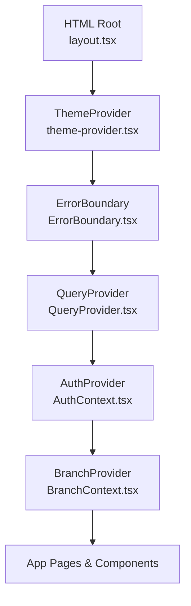
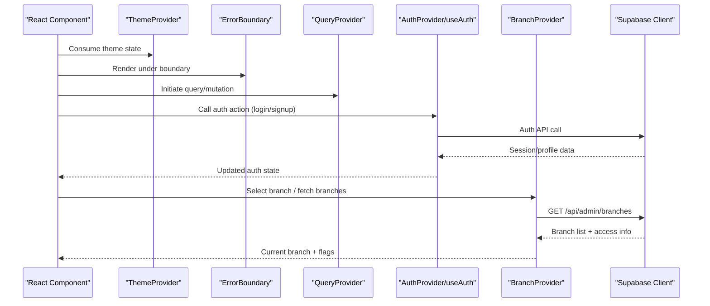
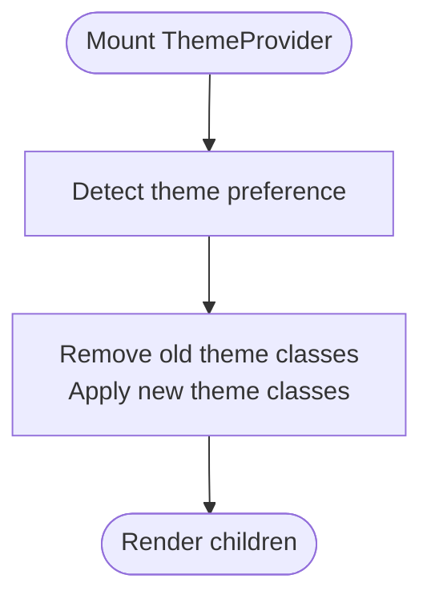
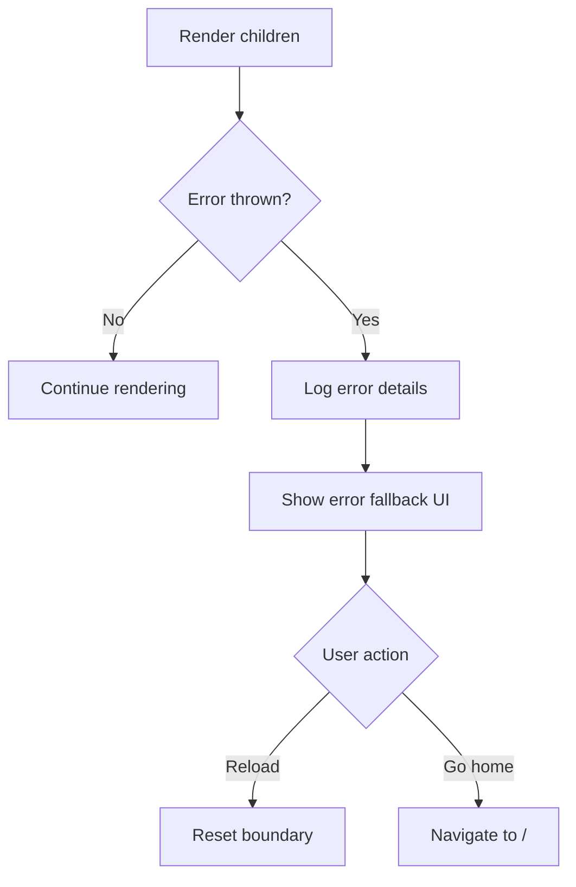
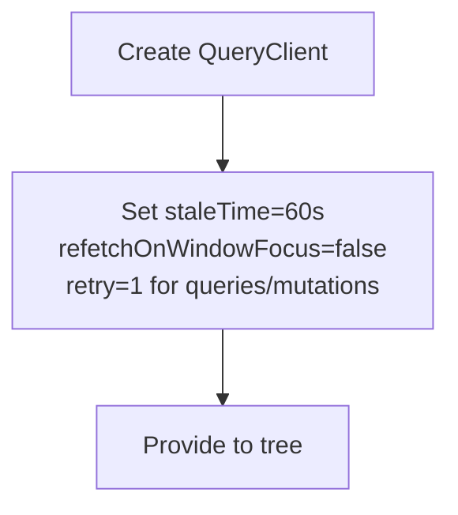
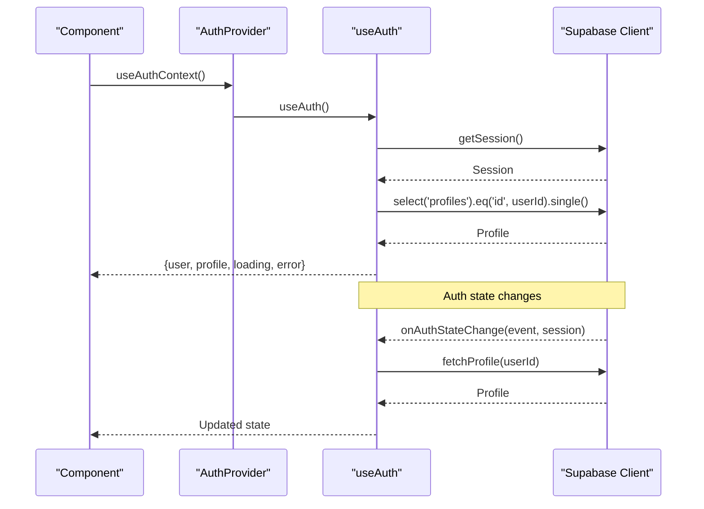
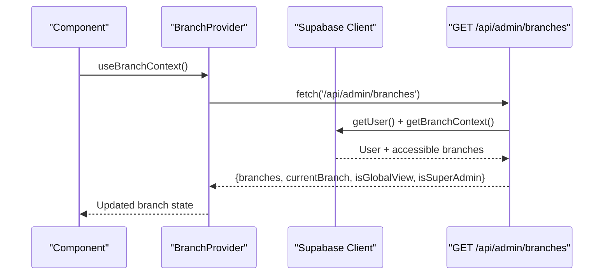
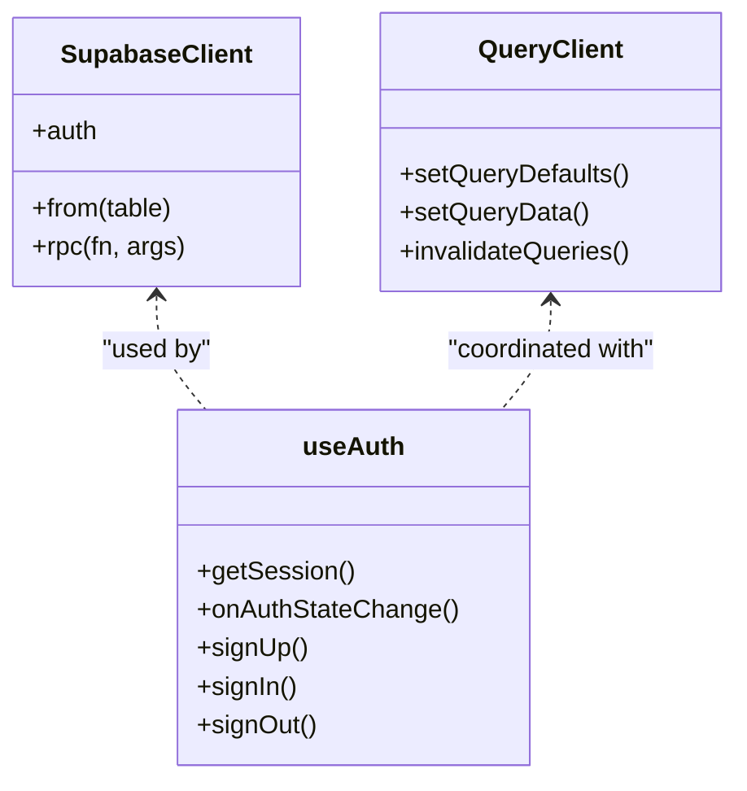
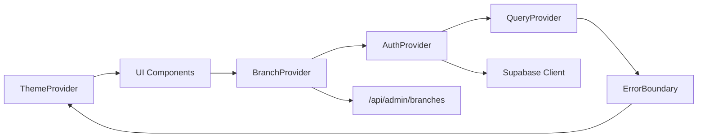

# Data Flow Architecture

<cite>
**Referenced Files in This Document**
- [layout.tsx](file://src/app/layout.tsx)
- [theme-provider.tsx](file://src/components/theme-provider.tsx)
- [ErrorBoundary.tsx](file://src/components/ErrorBoundary.tsx)
- [QueryProvider.tsx](file://src/lib/react-query/QueryProvider.tsx)
- [AuthContext.tsx](file://src/contexts/AuthContext.tsx)
- [BranchContext.tsx](file://src/contexts/BranchContext.tsx)
- [useAuth.ts](file://src/hooks/useAuth.ts)
- [supabase.ts](file://src/lib/supabase.ts)
- [client.ts](file://src/utils/supabase/client.ts)
- [route.ts](file://src/app/api/admin/branches/route.ts)
- [branch-middleware.ts](file://src/lib/api/branch-middleware.ts)
</cite>

## Table of Contents

1. [Introduction](#introduction)
2. [Project Structure](#project-structure)
3. [Core Components](#core-components)
4. [Architecture Overview](#architecture-overview)
5. [Detailed Component Analysis](#detailed-component-analysis)
6. [Dependency Analysis](#dependency-analysis)
7. [Performance Considerations](#performance-considerations)
8. [Troubleshooting Guide](#troubleshooting-guide)
9. [Conclusion](#conclusion)

## Introduction

This document describes the Opttius application’s data flow architecture from React components through context providers to database operations. It explains the hierarchical provider stack, component-to-context communication, context-to-service interactions, and Supabase-backed persistence. Real-time synchronization via Supabase Auth and client-side reactive state are covered, along with request-response cycles, error handling, caching, and performance optimizations.

## Project Structure

The application bootstraps providers at the root layout level, establishing a layered context hierarchy that enables centralized state management and consistent data access across the app.

**Diagram sources**

- [layout.tsx](file://src/app/layout.tsx#L30-L55)
- [theme-provider.tsx](file://src/components/theme-provider.tsx#L11-L25)
- [ErrorBoundary.tsx](file://src/components/ErrorBoundary.tsx#L89-L110)
- [QueryProvider.tsx](file://src/lib/react-query/QueryProvider.tsx#L7-L34)
- [AuthContext.tsx](file://src/contexts/AuthContext.tsx#L28-L36)
- [BranchContext.tsx](file://src/contexts/BranchContext.tsx#L38-L206)

**Section sources**

- [layout.tsx](file://src/app/layout.tsx#L30-L55)

## Core Components

- ThemeProvider: Manages theme state and applies CSS classes to the document root.
- ErrorBoundary: Catches and displays user-friendly error surfaces while logging errors.
- QueryProvider: Configures TanStack Query client with caching and retry policies.
- AuthProvider: Exposes authentication state and actions via a typed context.
- BranchProvider: Centralizes branch selection, access control, and persistence.

These components collectively eliminate prop drilling and provide predictable data flow across the application.

**Section sources**

- [theme-provider.tsx](file://src/components/theme-provider.tsx#L11-L104)
- [ErrorBoundary.tsx](file://src/components/ErrorBoundary.tsx#L89-L110)
- [QueryProvider.tsx](file://src/lib/react-query/QueryProvider.tsx#L7-L34)
- [AuthContext.tsx](file://src/contexts/AuthContext.tsx#L28-L71)
- [BranchContext.tsx](file://src/contexts/BranchContext.tsx#L38-L216)

## Architecture Overview

The data flow follows a unidirectional pattern:

- UI components consume context (theme, auth, branch).
- Context hooks call service-like functions (e.g., Supabase client wrappers).
- Supabase client performs authenticated requests to the database.
- Real-time updates propagate via Supabase Auth and client-side state.

**Diagram sources**

- [layout.tsx](file://src/app/layout.tsx#L38-L51)
- [useAuth.ts](file://src/hooks/useAuth.ts#L18-L130)
- [route.ts](file://src/app/api/admin/branches/route.ts#L10-L112)
- [supabase.ts](file://src/lib/supabase.ts#L11-L17)
- [client.ts](file://src/utils/supabase/client.ts#L3-L8)

## Detailed Component Analysis

### ThemeProvider

- Applies theme classes to the document root and manages hydration to prevent FOUC.
- Provides a typed hook for theme-aware components.

**Diagram sources**

- [theme-provider.tsx](file://src/components/theme-provider.tsx#L28-L81)

**Section sources**

- [theme-provider.tsx](file://src/components/theme-provider.tsx#L11-L104)

### ErrorBoundary

- Wraps the entire app subtree and renders a friendly error UI.
- Logs errors with structured metadata and supports recovery actions.

**Diagram sources**

- [ErrorBoundary.tsx](file://src/components/ErrorBoundary.tsx#L89-L110)

**Section sources**

- [ErrorBoundary.tsx](file://src/components/ErrorBoundary.tsx#L89-L110)

### QueryProvider

- Initializes TanStack Query with default caching and retry behavior.
- Disables window focus refetch to reduce unnecessary network activity.

**Diagram sources**

- [QueryProvider.tsx](file://src/lib/react-query/QueryProvider.tsx#L7-L34)

**Section sources**

- [QueryProvider.tsx](file://src/lib/react-query/QueryProvider.tsx#L7-L34)

### AuthProvider and useAuth

- Establishes reactive auth state using Supabase Auth.
- Handles sign-up, sign-in, sign-out, profile updates, and password resets.
- Subscribes to auth state changes and refreshes profile data accordingly.

**Diagram sources**

- [AuthContext.tsx](file://src/contexts/AuthContext.tsx#L28-L36)
- [useAuth.ts](file://src/hooks/useAuth.ts#L18-L130)

**Section sources**

- [AuthContext.tsx](file://src/contexts/AuthContext.tsx#L28-L71)
- [useAuth.ts](file://src/hooks/useAuth.ts#L18-L377)

### BranchProvider and Branch API

- Loads accessible branches per user and persists selection in localStorage for super admins.
- Supports global view for eligible users and validates access for others.
- The branch API endpoint returns accessible branches, current selection, and flags.

**Diagram sources**

- [BranchContext.tsx](file://src/contexts/BranchContext.tsx#L73-L155)
- [route.ts](file://src/app/api/admin/branches/route.ts#L10-L112)
- [branch-middleware.ts](file://src/lib/api/branch-middleware.ts#L48-L210)

**Section sources**

- [BranchContext.tsx](file://src/contexts/BranchContext.tsx#L38-L216)
- [route.ts](file://src/app/api/admin/branches/route.ts#L10-L112)
- [branch-middleware.ts](file://src/lib/api/branch-middleware.ts#L48-L210)

### Supabase Client and Real-Time Behavior

- Browser client is created with SSR-compatible helpers and configured for automatic token refresh and persisted sessions.
- Auth state changes drive reactive updates in components via the useAuth subscription.
- Queries and mutations leverage the QueryProvider’s caching and refetch policies.

**Diagram sources**

- [supabase.ts](file://src/lib/supabase.ts#L11-L17)
- [client.ts](file://src/utils/supabase/client.ts#L3-L8)
- [useAuth.ts](file://src/hooks/useAuth.ts#L18-L130)
- [QueryProvider.tsx](file://src/lib/react-query/QueryProvider.tsx#L7-L34)

**Section sources**

- [supabase.ts](file://src/lib/supabase.ts#L11-L36)
- [client.ts](file://src/utils/supabase/client.ts#L3-L8)
- [useAuth.ts](file://src/hooks/useAuth.ts#L18-L130)

## Dependency Analysis

The provider stack defines clear boundaries:

- ThemeProvider depends on UI theming libraries and has no runtime dependencies.
- ErrorBoundary depends on React Error Boundary and logging utilities.
- QueryProvider depends on TanStack Query and optionally devtools.
- AuthProvider depends on useAuth and Supabase client.
- BranchProvider depends on AuthProvider and the branch API.

**Diagram sources**

- [layout.tsx](file://src/app/layout.tsx#L38-L51)
- [AuthContext.tsx](file://src/contexts/AuthContext.tsx#L28-L36)
- [BranchContext.tsx](file://src/contexts/BranchContext.tsx#L38-L206)
- [route.ts](file://src/app/api/admin/branches/route.ts#L10-L112)
- [supabase.ts](file://src/lib/supabase.ts#L11-L17)

**Section sources**

- [layout.tsx](file://src/app/layout.tsx#L38-L51)
- [AuthContext.tsx](file://src/contexts/AuthContext.tsx#L28-L36)
- [BranchContext.tsx](file://src/contexts/BranchContext.tsx#L38-L206)
- [route.ts](file://src/app/api/admin/branches/route.ts#L10-L112)
- [supabase.ts](file://src/lib/supabase.ts#L11-L17)

## Performance Considerations

- Caching and Stale Time: Queries are cached for 60 seconds to minimize redundant network calls.
- Refetch Control: Window focus refetch is disabled to reduce background traffic.
- Retry Strategy: Limited retries (1) for both queries and mutations to avoid thrashing.
- Auth Initialization Timeout: Graceful handling of slow auth initialization to prevent UI stalls.
- Local Storage Persistence: Branch selection is persisted locally for super admins to avoid repeated server calls.
- Theme Hydration: Prevents flash-of-unstyled-content by applying theme classes after mount.

[No sources needed since this section provides general guidance]

## Troubleshooting Guide

- Authentication Failures: Inspect auth state changes and profile fetch timeouts. Verify environment variables for Supabase keys and ensure the Supabase client is initialized correctly.
- Branch Access Errors: Confirm the user’s role and accessible branches. Validate the branch API response and branch middleware logic.
- Query Errors: Review QueryClient defaults and devtools logs (when enabled) to identify stale data or refetch anomalies.
- Error Boundary: Use the fallback UI to capture and report errors; check logs for structured metadata.

**Section sources**

- [useAuth.ts](file://src/hooks/useAuth.ts#L31-L91)
- [route.ts](file://src/app/api/admin/branches/route.ts#L10-L112)
- [QueryProvider.tsx](file://src/lib/react-query/QueryProvider.tsx#L7-L34)
- [ErrorBoundary.tsx](file://src/components/ErrorBoundary.tsx#L89-L110)

## Conclusion

Opttius employs a robust, layered provider architecture that centralizes theme, error handling, state caching, authentication, and branch context. Supabase integrates seamlessly with React Query and client-side hooks to deliver responsive, real-time experiences. The documented data pathways and optimization strategies provide a clear blueprint for extending functionality while maintaining reliability and performance.
