# Infrastructure & Deployment

<cite>
**Referenced Files in This Document**
- [vercel.json](file://vercel.json)
- [package.json](file://package.json)
- [next.config.js](file://next.config.js)
- [supabase/config.toml](file://supabase/config.toml)
- [.env.local](file://.env.local)
- [src/lib/supabase.ts](file://src/lib/supabase.ts)
- [src/utils/supabase/client.ts](file://src/utils/supabase/client.ts)
- [src/utils/supabase/server.ts](file://src/utils/supabase/server.ts)
- [src/utils/supabase/service-role.ts](file://src/utils/supabase/service-role.ts)
- [src/app/api/cron/backups/route.ts](file://src/app/api/cron/backups/route.ts)
- [src/lib/backup-service.ts](file://src/lib/backup-service.ts)
- [src/lib/saas-backup-service.ts](file://src/lib/saas-backup-service.ts)
</cite>

## Table of Contents

1. [Introduction](#introduction)
2. [Project Structure](#project-structure)
3. [Core Components](#core-components)
4. [Architecture Overview](#architecture-overview)
5. [Detailed Component Analysis](#detailed-component-analysis)
6. [Dependency Analysis](#dependency-analysis)
7. [Performance Considerations](#performance-considerations)
8. [Troubleshooting Guide](#troubleshooting-guide)
9. [Conclusion](#conclusion)
10. [Appendices](#appendices)

## Introduction

This document describes the infrastructure and deployment architecture for the Opttius production environment. It covers the cloud deployment strategy using Vercel for frontend hosting and Supabase for backend services, containerization approach, environment configuration management, secrets handling, database architecture (PostgreSQL), connection pooling, backup strategies, CDN integration for static assets and image optimization, monitoring and logging, performance metrics and alerting, CI/CD pipeline configuration, automated testing, deployment automation, scalability and load balancing, and disaster recovery planning.

## Project Structure

The Opttius application is a Next.js 14 application configured for production-grade deployment. The frontend is hosted on Vercel, while the backend services (authentication, database, storage, real-time, auth hooks, analytics) are provided by Supabase. Environment variables are managed via .env.local and Next.js runtime configuration. Supabase CLI is integrated for local development and migrations.

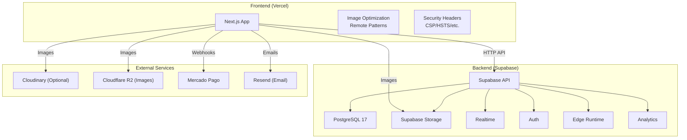

**Diagram sources**

- [next.config.js](file://next.config.js#L29-L74)
- [next.config.js](file://next.config.js#L81-L158)
- [supabase/config.toml](file://supabase/config.toml#L7-L44)
- [supabase/config.toml](file://supabase/config.toml#L100-L127)
- [supabase/config.toml](file://supabase/config.toml#L314-L323)
- [supabase/config.toml](file://supabase/config.toml#L327-L332)
- [.env.local](file://.env.local#L106-L114)

**Section sources**

- [package.json](file://package.json#L1-L134)
- [next.config.js](file://next.config.js#L1-L161)
- [supabase/config.toml](file://supabase/config.toml#L1-L345)
- [.env.local](file://.env.local#L1-L116)

## Core Components

- Frontend Hosting: Vercel hosts the Next.js application with automatic builds and deployments. Cron jobs are configured via vercel.json.
- Backend Services: Supabase provides API, database, storage, auth, realtime, edge runtime, and analytics.
- Environment Management: .env.local defines environment variables for Supabase, Mercado Pago, Resend, Cloudinary, security, analytics, AI providers, demo/root users, ngrok, NowPayments, and Cloudflare R2.
- Supabase Clients: Dedicated client utilities for browser, server, and service role operations.
- Backup and Disaster Recovery: Scheduled cron-based backups and relational backup service; optional SaaS full backup via pg_dump.

**Section sources**

- [vercel.json](file://vercel.json#L1-L8)
- [supabase/config.toml](file://supabase/config.toml#L1-L345)
- [.env.local](file://.env.local#L1-L116)
- [src/lib/supabase.ts](file://src/lib/supabase.ts#L1-L36)
- [src/utils/supabase/client.ts](file://src/utils/supabase/client.ts#L1-L8)
- [src/utils/supabase/server.ts](file://src/utils/supabase/server.ts#L1-L110)
- [src/utils/supabase/service-role.ts](file://src/utils/supabase/service-role.ts#L1-L12)
- [src/app/api/cron/backups/route.ts](file://src/app/api/cron/backups/route.ts#L1-L98)
- [src/lib/backup-service.ts](file://src/lib/backup-service.ts#L1-L224)
- [src/lib/saas-backup-service.ts](file://src/lib/saas-backup-service.ts#L1-L134)

## Architecture Overview

The production architecture centers on Vercel for frontend delivery and Supabase for backend services. The Next.js app enforces strict security headers and image optimization rules. Supabase manages PostgreSQL, storage, auth, and edge functions. Optional integrations include Cloudinary for image optimization, Cloudflare R2 for image storage, Mercado Pago for payments, and Resend for transactional emails.

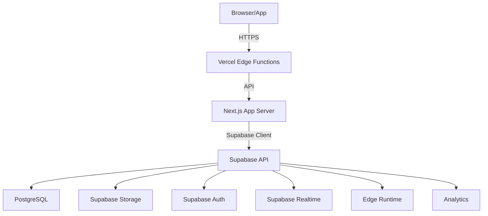

**Diagram sources**

- [next.config.js](file://next.config.js#L81-L158)
- [supabase/config.toml](file://supabase/config.toml#L7-L44)
- [supabase/config.toml](file://supabase/config.toml#L314-L323)
- [supabase/config.toml](file://supabase/config.toml#L327-L332)

## Detailed Component Analysis

### Vercel Deployment and Cron Jobs

- Cron scheduling: A weekly backup cron is defined in vercel.json targeting /api/cron/backups.
- Build and runtime: package.json scripts define dev/build/start commands and Supabase CLI integration for local development and migrations.

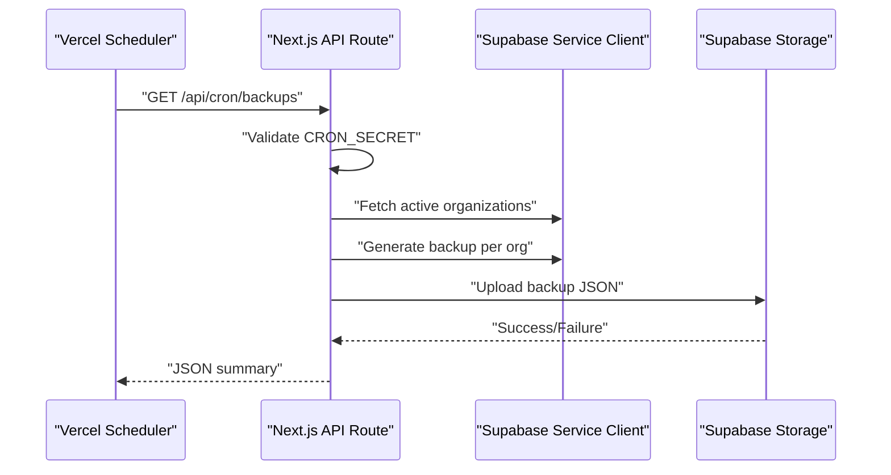

**Diagram sources**

- [vercel.json](file://vercel.json#L2-L7)
- [src/app/api/cron/backups/route.ts](file://src/app/api/cron/backups/route.ts#L11-L98)
- [src/lib/backup-service.ts](file://src/lib/backup-service.ts#L84-L140)

**Section sources**

- [vercel.json](file://vercel.json#L1-L8)
- [package.json](file://package.json#L5-L34)
- [src/app/api/cron/backups/route.ts](file://src/app/api/cron/backups/route.ts#L1-L98)

### Supabase Backend Services

- API and Database: Supabase API exposes REST and GraphQL endpoints; PostgreSQL 17 is configured with connection pooling disabled by default in local config.
- Storage: Public buckets for product-images, images, and uploads; file size limits applied.
- Auth: Email/password, anonymous sign-ins, rate limits, and external providers supported; site URL and redirect settings configurable.
- Edge Runtime: Enabled for serverless edge functions with inspector port and policy settings.
- Analytics: Optional backend configured for analytics.

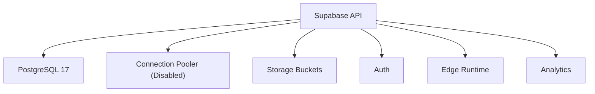

**Diagram sources**

- [supabase/config.toml](file://supabase/config.toml#L7-L44)
- [supabase/config.toml](file://supabase/config.toml#L100-L127)
- [supabase/config.toml](file://supabase/config.toml#L128-L168)
- [supabase/config.toml](file://supabase/config.toml#L314-L323)
- [supabase/config.toml](file://supabase/config.toml#L327-L332)

**Section sources**

- [supabase/config.toml](file://supabase/config.toml#L1-L345)

### Supabase Client Utilities

- Browser client: Uses @supabase/ssr for client-side operations with environment variables.
- Server client: Creates a server-side client with cookie handling and supports Bearer token fallback for API routes and tests.
- Service role client: Creates a client with service role key for admin operations bypassing RLS.

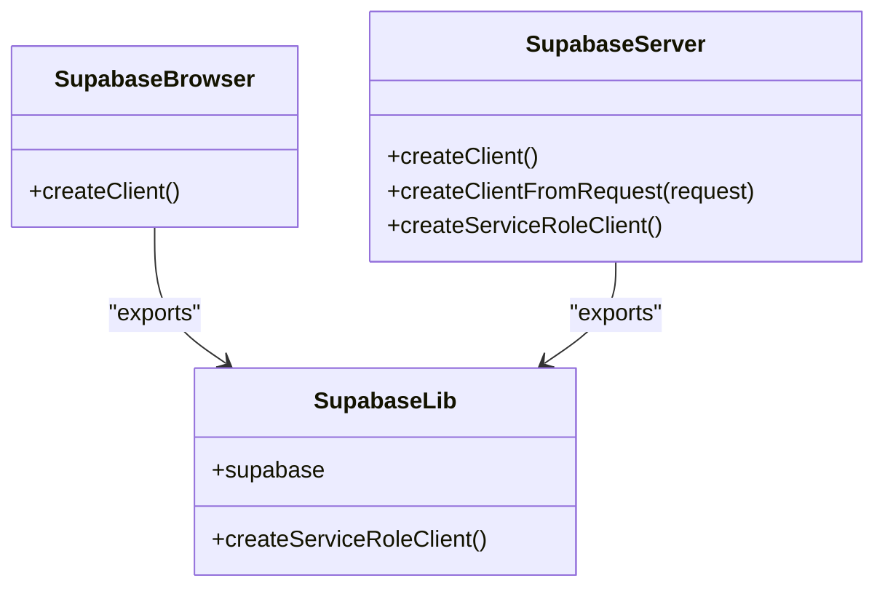

**Diagram sources**

- [src/utils/supabase/client.ts](file://src/utils/supabase/client.ts#L1-L8)
- [src/utils/supabase/server.ts](file://src/utils/supabase/server.ts#L1-L110)
- [src/utils/supabase/service-role.ts](file://src/utils/supabase/service-role.ts#L1-L12)
- [src/lib/supabase.ts](file://src/lib/supabase.ts#L1-L36)

**Section sources**

- [src/utils/supabase/client.ts](file://src/utils/supabase/client.ts#L1-L8)
- [src/utils/supabase/server.ts](file://src/utils/supabase/server.ts#L1-L110)
- [src/utils/supabase/service-role.ts](file://src/utils/supabase/service-role.ts#L1-L12)
- [src/lib/supabase.ts](file://src/lib/supabase.ts#L1-L36)

### Environment Configuration and Secrets Management

- Environment variables: Supabase URLs and keys, Mercado Pago credentials, Resend API key, Cloudinary, security, analytics, AI providers, demo/root users, ngrok, NowPayments, and Cloudflare R2 are defined in .env.local.
- Supabase client initialization validates presence of required environment variables and throws if missing.
- Secret enforcement: Cron endpoint checks for CRON_SECRET via Authorization header or x-cron-secret header.

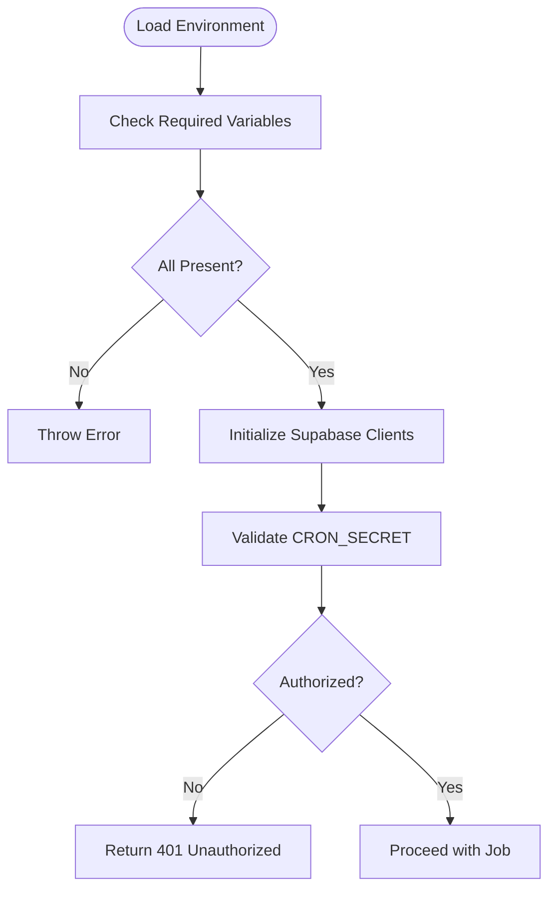

**Diagram sources**

- [.env.local](file://.env.local#L8-L116)
- [src/lib/supabase.ts](file://src/lib/supabase.ts#L7-L9)
- [src/app/api/cron/backups/route.ts](file://src/app/api/cron/backups/route.ts#L14-L21)

**Section sources**

- [.env.local](file://.env.local#L1-L116)
- [src/lib/supabase.ts](file://src/lib/supabase.ts#L1-L36)
- [src/app/api/cron/backups/route.ts](file://src/app/api/cron/backups/route.ts#L1-L98)

### Database Architecture and Connection Pooling

- PostgreSQL configuration: Major version 17; search_path includes extensions; max_rows limit enforced; TLS disabled locally.
- Connection pooling: Disabled in local config; pooler settings present but off by default.
- Network restrictions: Allowed CIDRs configured for IPv4/IPv6; disabled by default.
- Migrations and seeding: Migrations enabled; seed.sql path configured.

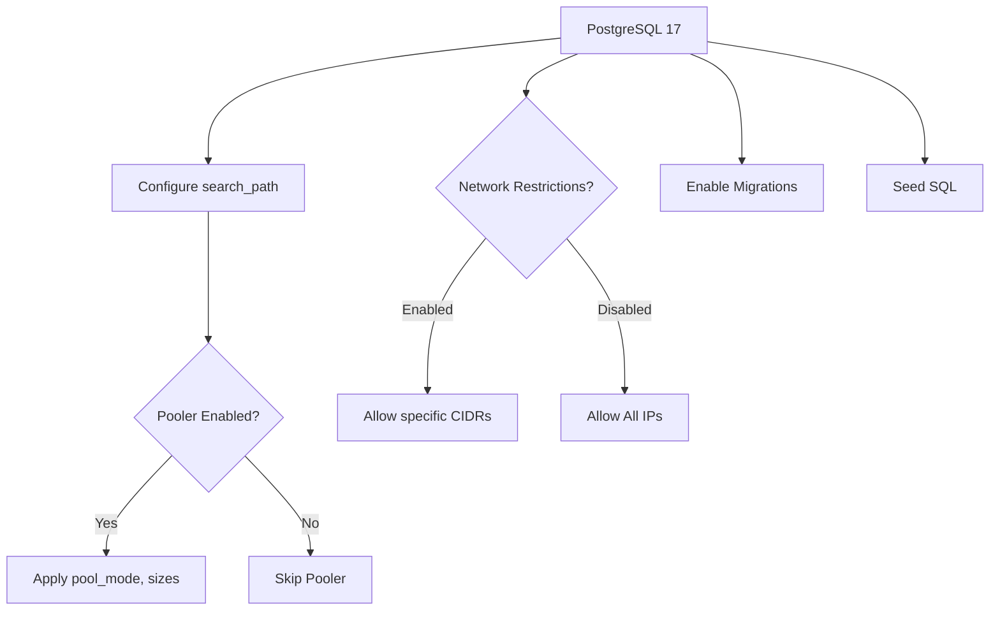

**Diagram sources**

- [supabase/config.toml](file://supabase/config.toml#L24-L44)
- [supabase/config.toml](file://supabase/config.toml#L62-L71)
- [supabase/config.toml](file://supabase/config.toml#L48-L61)

**Section sources**

- [supabase/config.toml](file://supabase/config.toml#L24-L71)

### Backup Strategies

- Relational backup service: Iterates through a hierarchical table list, respecting anchors and batching, and uploads JSON backups to Supabase Storage under database-backups bucket.
- Cron-triggered backups: Weekly cron invokes the backup route, validating CRON_SECRET and processing organizations sequentially.
- SaaS full backup: Uses pg_dump against a running database container and uploads to saas-backups bucket; designed for local/docker environments.

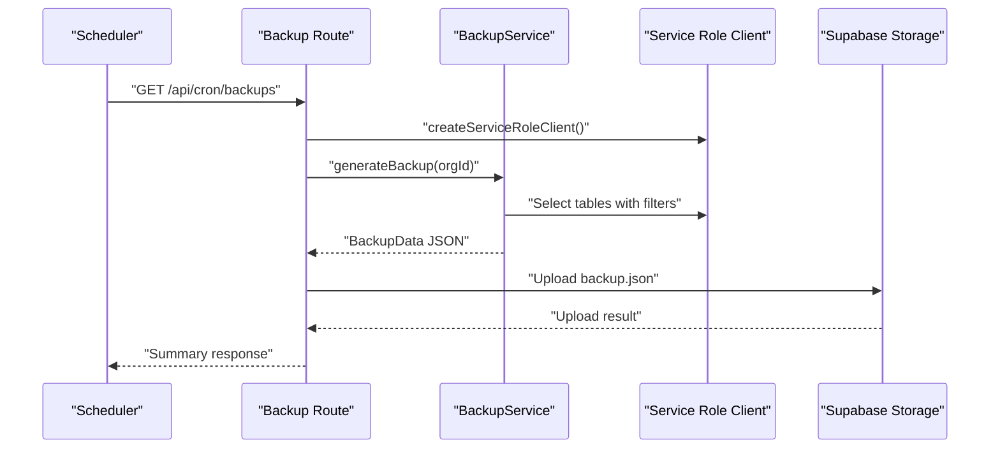

**Diagram sources**

- [src/app/api/cron/backups/route.ts](file://src/app/api/cron/backups/route.ts#L11-L98)
- [src/lib/backup-service.ts](file://src/lib/backup-service.ts#L84-L140)

**Section sources**

- [src/app/api/cron/backups/route.ts](file://src/app/api/cron/backups/route.ts#L1-L98)
- [src/lib/backup-service.ts](file://src/lib/backup-service.ts#L1-L224)
- [src/lib/saas-backup-service.ts](file://src/lib/saas-backup-service.ts#L20-L92)

### CDN Integration and Image Optimization

- Next.js Image Optimization: Remote patterns allow images from Supabase Storage, Cloudinary, Unsplash, Sanity, generic domains, Pravatar, and Cloudflare R2.
- Optional Cloudinary: Credentials configured for image transformations.
- Cloudflare R2: Public URL configured for image bucket; fallback upload to Supabase Storage if R2 is not configured.

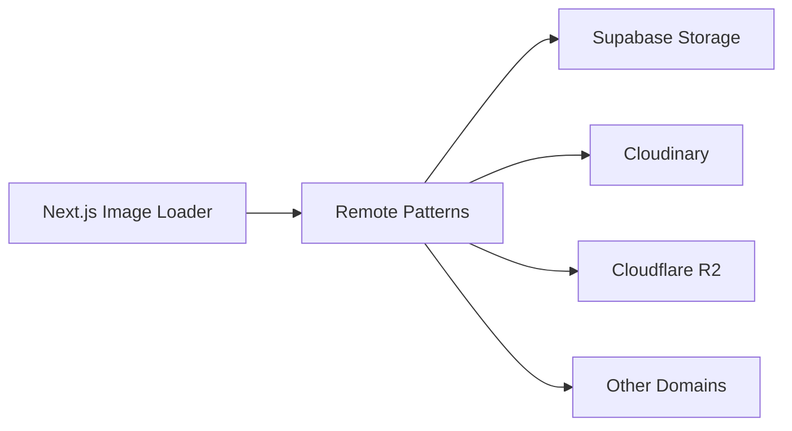

**Diagram sources**

- [next.config.js](file://next.config.js#L29-L74)
- [.env.local](file://.env.local#L25-L28)
- [.env.local](file://.env.local#L106-L114)

**Section sources**

- [next.config.js](file://next.config.js#L29-L74)
- [.env.local](file://.env.local#L25-L28)
- [.env.local](file://.env.local#L106-L114)

### Monitoring, Logging, and Alerting

- Logging: Application uses pino logger; backup route logs info/warn/error events.
- Metrics and alerting: No explicit metrics or alerting configuration detected in the repository. Recommended to integrate platform-native observability or third-party solutions.

**Section sources**

- [src/app/api/cron/backups/route.ts](file://src/app/api/cron/backups/route.ts#L3-L4)
- [src/lib/backup-service.ts](file://src/lib/backup-service.ts#L1-L224)

### CI/CD Pipeline and Automated Testing

- Scripts: package.json includes test scripts (unit, coverage, watch, UI) and various developer/admin tasks.
- Supabase CLI: npm scripts for starting/stopping Supabase locally, checking status, resetting, and pushing migrations.
- Deployment: Vercel handles frontend builds and deployments; Supabase manages backend services.

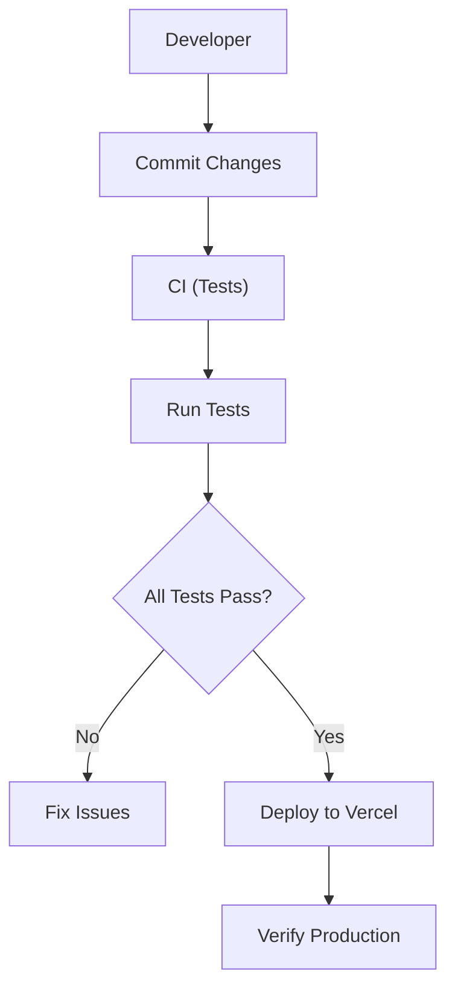

**Diagram sources**

- [package.json](file://package.json#L28-L34)
- [package.json](file://package.json#L13-L20)

**Section sources**

- [package.json](file://package.json#L1-L134)

### Scalability, Load Balancing, and Disaster Recovery

- Scalability: Next.js SSR and ISR are handled by Vercel; Supabase scales automatically for API, DB, storage, and auth.
- Load balancing: Vercel distributes traffic; Supabase provides regional availability.
- Disaster recovery: Cron-triggered relational backups and optional SaaS full backups to Supabase Storage; restore service supports ordered restoration respecting foreign key anchors.

**Section sources**

- [src/app/api/cron/backups/route.ts](file://src/app/api/cron/backups/route.ts#L1-L98)
- [src/lib/backup-service.ts](file://src/lib/backup-service.ts#L142-L224)
- [src/lib/saas-backup-service.ts](file://src/lib/saas-backup-service.ts#L94-L134)

## Dependency Analysis

The application depends on Next.js for the frontend runtime, Supabase for backend services, and optional external services for payments, email, and image optimization. Supabase clients encapsulate environment-driven configuration and authentication flows.

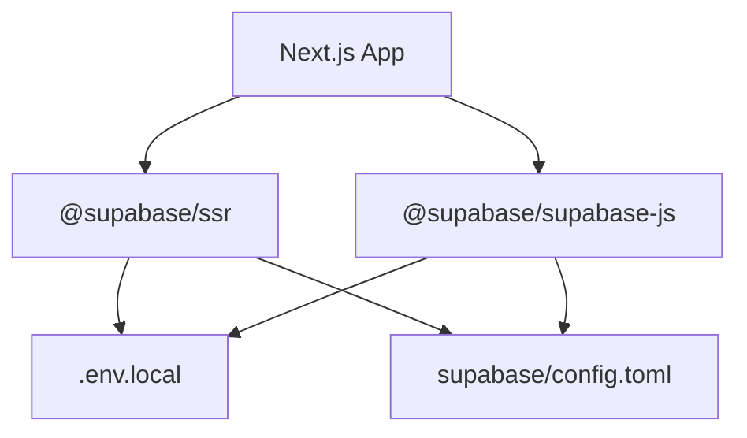

**Diagram sources**

- [src/utils/supabase/client.ts](file://src/utils/supabase/client.ts#L1-L8)
- [src/utils/supabase/server.ts](file://src/utils/supabase/server.ts#L1-L33)
- [src/lib/supabase.ts](file://src/lib/supabase.ts#L1-L17)
- [.env.local](file://.env.local#L8-L11)
- [supabase/config.toml](file://supabase/config.toml#L7-L18)

**Section sources**

- [src/utils/supabase/client.ts](file://src/utils/supabase/client.ts#L1-L8)
- [src/utils/supabase/server.ts](file://src/utils/supabase/server.ts#L1-L110)
- [src/lib/supabase.ts](file://src/lib/supabase.ts#L1-L36)
- [.env.local](file://.env.local#L1-L116)
- [supabase/config.toml](file://supabase/config.toml#L1-L345)

## Performance Considerations

- Image optimization: Leverage Next.js Image Optimization with remote patterns to reduce bandwidth and improve loading times.
- Security headers: Strict CSP, HSTS, X-Frame-Options, and other headers enhance security and can impact performance minimally.
- Database: Keep migrations minimal and indexed appropriately; avoid heavy queries in edge functions.
- CDN: Use Cloudflare R2 or Cloudinary for global distribution of images.

[No sources needed since this section provides general guidance]

## Troubleshooting Guide

- Missing environment variables: Supabase client initialization throws if required variables are missing; verify .env.local entries.
- Cron authorization: Ensure CRON_SECRET matches the Authorization header or x-cron-secret header.
- Storage uploads: Verify bucket permissions and public URLs for images and backups.
- Supabase connectivity: Confirm NEXT_PUBLIC_SUPABASE_URL and keys are correct for both local and production.

**Section sources**

- [src/lib/supabase.ts](file://src/lib/supabase.ts#L7-L9)
- [src/app/api/cron/backups/route.ts](file://src/app/api/cron/backups/route.ts#L14-L21)
- [.env.local](file://.env.local#L8-L116)

## Conclusion

Opttius leverages Vercel for robust frontend hosting and Supabase for a comprehensive backend stack. The architecture emphasizes security through strict headers, environment-driven configuration, and service role clients. Backup strategies include scheduled relational backups and optional SaaS full backups. While the repository does not include explicit metrics/alerting configurations, the modular design supports easy integration with monitoring platforms. The provided Supabase configuration and client utilities offer a solid foundation for production deployment with scalability and disaster recovery in mind.

[No sources needed since this section summarizes without analyzing specific files]

## Appendices

- Supabase local configuration reference is embedded in supabase/config.toml comments.
- Next.js configuration includes security headers and image optimization settings.

**Section sources**

- [supabase/config.toml](file://supabase/config.toml#L1-L2)
- [next.config.js](file://next.config.js#L81-L158)
