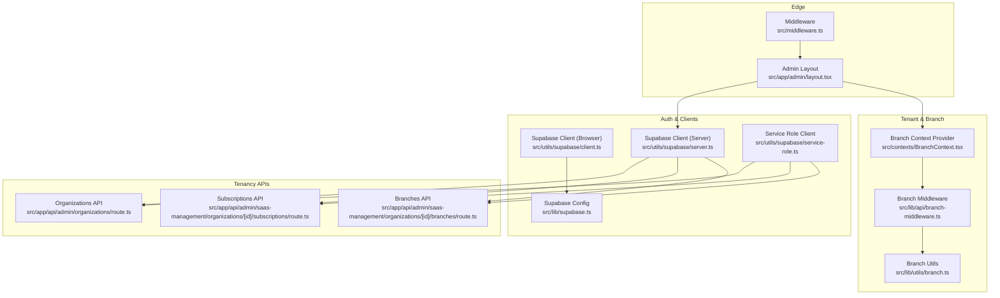
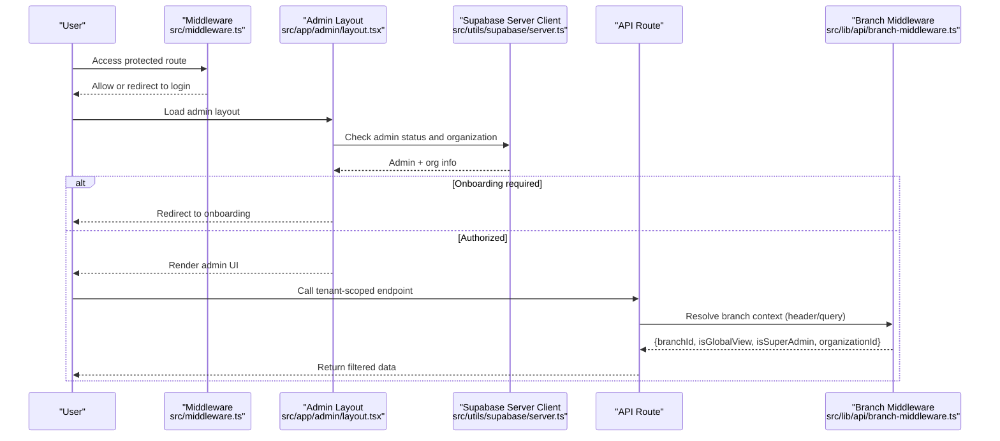
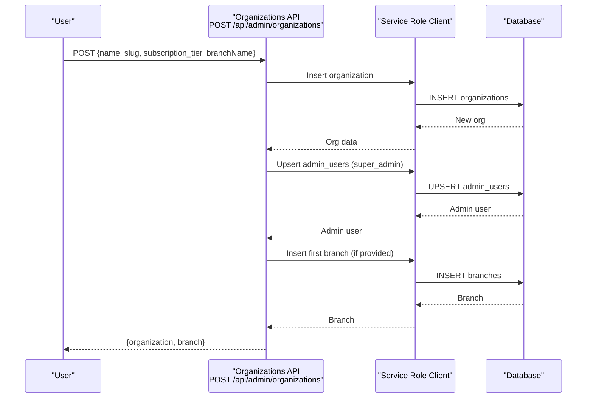
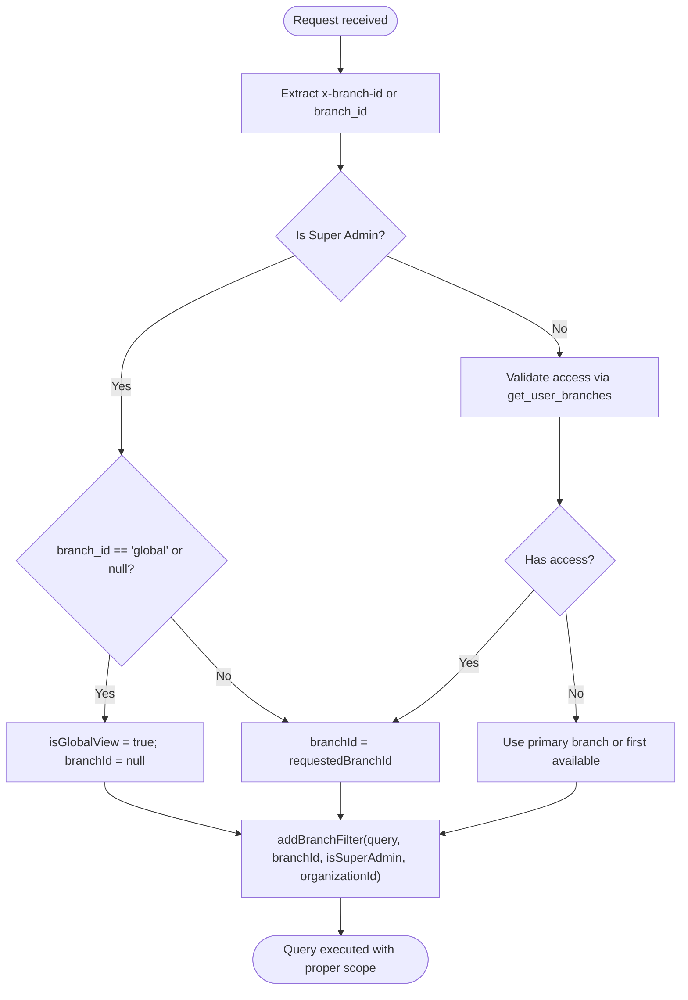
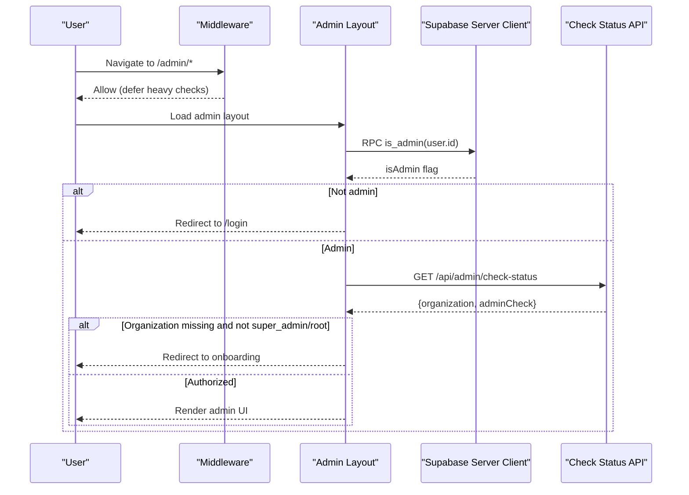
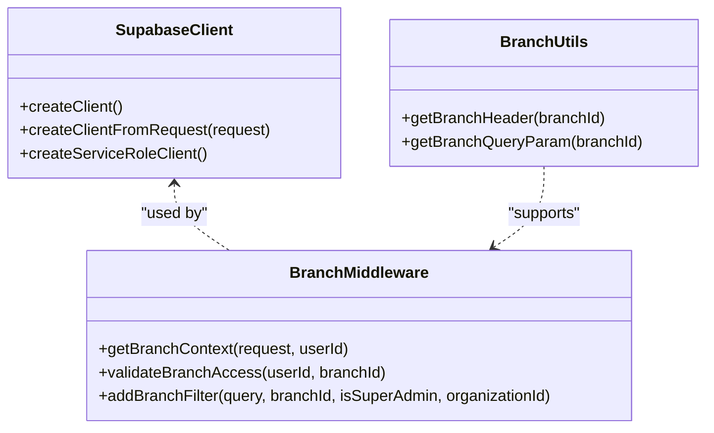
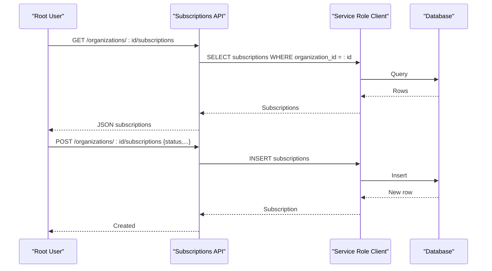
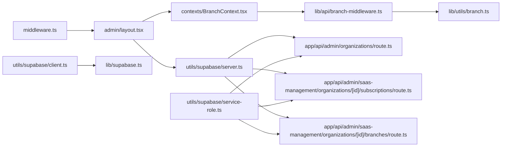

# Multi-Tenant Architecture

<cite>
**Referenced Files in This Document**
- [middleware.ts](file://src/middleware.ts)
- [supabase.ts](file://src/lib/supabase.ts)
- [server.ts](file://src/utils/supabase/server.ts)
- [service-role.ts](file://src/utils/supabase/service-role.ts)
- [client.ts](file://src/utils/supabase/client.ts)
- [layout.tsx](file://src/app/admin/layout.tsx)
- [BranchContext.tsx](file://src/contexts/BranchContext.tsx)
- [branch-middleware.ts](file://src/lib/api/branch-middleware.ts)
- [branch.ts](file://src/lib/utils/branch.ts)
- [organizations.route.ts](file://src/app/api/admin/organizations/route.ts)
- [organization.subscriptions.route.ts](file://src/app/api/admin/saas-management/organizations/[id]/subscriptions/route.ts)
- [organization.branches.route.ts](file://src/app/api/admin/saas-management/organizations/[id]/branches/route.ts)
</cite>

## Table of Contents

1. [Introduction](#introduction)
2. [Project Structure](#project-structure)
3. [Core Components](#core-components)
4. [Architecture Overview](#architecture-overview)
5. [Detailed Component Analysis](#detailed-component-analysis)
6. [Dependency Analysis](#dependency-analysis)
7. [Performance Considerations](#performance-considerations)
8. [Troubleshooting Guide](#troubleshooting-guide)
9. [Conclusion](#conclusion)
10. [Appendices](#appendices)

## Introduction

This document explains the multi-tenant architecture of Opttius, a SaaS solution for optical chains. It focuses on the organization-based tenant isolation model, branch-level data scoping, middleware-driven tenant verification, Row Level Security (RLS) enforcement, subscription management, onboarding workflows, and operational best practices. The goal is to enable serving multiple optical chains from a single instance while maintaining strict data isolation, flexible branch-level visibility, and scalable operations.

## Project Structure

Opttius organizes multi-tenancy around three pillars:

- Tenant isolation by organization
- Branch-level scoping within an organization
- Subscription tiers controlling feature access

Key areas:

- Authentication and session handling via Supabase clients
- Admin layout orchestrating tenant checks and navigation
- Branch context provider managing branch selection and visibility
- API middleware extracting and validating branch context
- Organization and subscription management APIs
- Utility helpers for branch filtering and headers

**Diagram sources**

- [middleware.ts](file://src/middleware.ts#L1-L109)
- [layout.tsx](file://src/app/admin/layout.tsx#L1-L800)
- [client.ts](file://src/utils/supabase/client.ts#L1-L8)
- [server.ts](file://src/utils/supabase/server.ts#L1-L110)
- [service-role.ts](file://src/utils/supabase/service-role.ts#L1-L12)
- [supabase.ts](file://src/lib/supabase.ts#L1-L36)
- [BranchContext.tsx](file://src/contexts/BranchContext.tsx#L1-L216)
- [branch-middleware.ts](file://src/lib/api/branch-middleware.ts#L1-L263)
- [branch.ts](file://src/lib/utils/branch.ts#L1-L123)
- [organizations.route.ts](file://src/app/api/admin/organizations/route.ts#L1-L441)
- [organization.subscriptions.route.ts](file://src/app/api/admin/saas-management/organizations/[id]/subscriptions/route.ts#L1-L161)
- [organization.branches.route.ts](file://src/app/api/admin/saas-management/organizations/[id]/branches/route.ts#L1-L176)

**Section sources**

- [middleware.ts](file://src/middleware.ts#L1-L109)
- [layout.tsx](file://src/app/admin/layout.tsx#L1-L800)
- [BranchContext.tsx](file://src/contexts/BranchContext.tsx#L1-L216)
- [branch-middleware.ts](file://src/lib/api/branch-middleware.ts#L1-L263)
- [branch.ts](file://src/lib/utils/branch.ts#L1-L123)
- [organizations.route.ts](file://src/app/api/admin/organizations/route.ts#L1-L441)
- [organization.subscriptions.route.ts](file://src/app/api/admin/saas-management/organizations/[id]/subscriptions/route.ts#L1-L161)
- [organization.branches.route.ts](file://src/app/api/admin/saas-management/organizations/[id]/branches/route.ts#L1-L176)

## Core Components

- Organization-based tenant isolation: Each tenant (optical chain) is represented by an organization record. Users are associated with an organization via admin_users, ensuring all downstream data is scoped to that organization.
- Branch management: Organizations own multiple branches. Users gain access to specific branches via admin_branch_access. Super admins can operate in a global view scoped to their organization.
- Subscription management: Organizations have a subscription record that controls tier-based feature access and billing status.
- Middleware and layout orchestration: Middleware performs lightweight checks; the admin layout performs robust tenant and role verification, redirecting unauthorized users to login or onboarding.
- Branch context and filtering: Utilities extract branch context from headers/query params and add appropriate filters to Supabase queries to enforce data isolation.

**Section sources**

- [organizations.route.ts](file://src/app/api/admin/organizations/route.ts#L1-L441)
- [organization.subscriptions.route.ts](file://src/app/api/admin/saas-management/organizations/[id]/subscriptions/route.ts#L1-L161)
- [organization.branches.route.ts](file://src/app/api/admin/saas-management/organizations/[id]/branches/route.ts#L1-L176)
- [layout.tsx](file://src/app/admin/layout.tsx#L250-L430)
- [branch-middleware.ts](file://src/lib/api/branch-middleware.ts#L48-L210)
- [branch.ts](file://src/lib/utils/branch.ts#L92-L122)

## Architecture Overview

The system enforces multi-tenancy through:

- Authentication and session detection at the edge (middleware)
- Admin layout performing admin and organization checks
- Branch-aware API middleware resolving the effective branch context
- Supabase service role for privileged operations bypassing RLS
- Supabase browser/server clients for tenant-scoped operations

**Diagram sources**

- [middleware.ts](file://src/middleware.ts#L14-L95)
- [layout.tsx](file://src/app/admin/layout.tsx#L250-L430)
- [server.ts](file://src/utils/supabase/server.ts#L43-L92)
- [branch-middleware.ts](file://src/lib/api/branch-middleware.ts#L48-L210)

## Detailed Component Analysis

### Organization-Based Tenant Isolation

- Creation: POST /api/admin/organizations creates an organization, assigns the creator as super_admin, sets up initial branch and subscription defaults.
- Retrieval: GET /api/admin/organizations returns the current user’s organization metadata.
- Enforcement: Service role client is used for privileged operations (e.g., inserting organizations, admin_users, branches) to bypass RLS.

**Diagram sources**

- [organizations.route.ts](file://src/app/api/admin/organizations/route.ts#L121-L441)

**Section sources**

- [organizations.route.ts](file://src/app/api/admin/organizations/route.ts#L1-L441)

### Branch Management and Location-Based Data Scoping

- Branch retrieval and access control: GET /api/admin/branches lists accessible branches per user; super admins can opt into global view.
- Branch context resolution: getBranchContext extracts branch_id from headers or query params, validates access, and determines isGlobalView and organizationId.
- Filtering: addBranchFilter scopes queries to either a specific branch or to the user’s organization in global view, preventing cross-tenant leakage.

**Diagram sources**

- [branch-middleware.ts](file://src/lib/api/branch-middleware.ts#L48-L263)
- [branch.ts](file://src/lib/utils/branch.ts#L92-L122)

**Section sources**

- [BranchContext.tsx](file://src/contexts/BranchContext.tsx#L73-L155)
- [branch-middleware.ts](file://src/lib/api/branch-middleware.ts#L48-L210)
- [branch.ts](file://src/lib/utils/branch.ts#L40-L122)

### Middleware Implementation for Tenant Verification and Route Protection

- Edge middleware: Lightweight checks for excluded paths (/api, static assets). For /admin routes, it logs auth cookie presence and defers heavy checks to the admin layout.
- Admin layout: Performs robust checks:
  - Admin status via RPC is_admin
  - Organization status via /api/admin/check-status
  - Redirects unauthorized users to login or onboarding
  - Prevents race conditions and redundant checks using atomic state updates

**Diagram sources**

- [middleware.ts](file://src/middleware.ts#L14-L95)
- [layout.tsx](file://src/app/admin/layout.tsx#L250-L430)
- [server.ts](file://src/utils/supabase/server.ts#L43-L92)

**Section sources**

- [middleware.ts](file://src/middleware.ts#L1-L109)
- [layout.tsx](file://src/app/admin/layout.tsx#L250-L430)

### Row Level Security (RLS) Policies and Data Isolation

- Supabase service role client: Used for privileged operations (creating organizations, branches, admin users) to bypass RLS and ensure correct ownership.
- Tenant-scoped operations: For regular tenant operations, use the browser/server client with branch-aware filters to scope queries to the current branch or organization in global view.
- Best practice: Always resolve branch context via getBranchContext and apply addBranchFilter to every tenant-sensitive query.

**Diagram sources**

- [server.ts](file://src/utils/supabase/server.ts#L1-L110)
- [service-role.ts](file://src/utils/supabase/service-role.ts#L1-L12)
- [branch-middleware.ts](file://src/lib/api/branch-middleware.ts#L48-L263)
- [branch.ts](file://src/lib/utils/branch.ts#L92-L122)

**Section sources**

- [server.ts](file://src/utils/supabase/server.ts#L94-L110)
- [branch-middleware.ts](file://src/lib/api/branch-middleware.ts#L237-L263)
- [branch.ts](file://src/lib/utils/branch.ts#L92-L122)

### Subscription Management and Feature Access Control

- Listing subscriptions: GET /api/admin/saas-management/organizations/[id]/subscriptions requires root access.
- Creating subscriptions: POST /api/admin/saas-management/organizations/[id]/subscriptions also requires root access.
- Tier control: Organization metadata includes subscription_tier; feature gating should be enforced at the application level using this tier.

**Diagram sources**

- [organization.subscriptions.route.ts](file://src/app/api/admin/saas-management/organizations/[id]/subscriptions/route.ts#L11-L61)
- [organization.subscriptions.route.ts](file://src/app/api/admin/saas-management/organizations/[id]/subscriptions/route.ts#L67-L160)

**Section sources**

- [organization.subscriptions.route.ts](file://src/app/api/admin/saas-management/organizations/[id]/subscriptions/route.ts#L1-L161)

### Tenant Onboarding Workflows and Data Migration Strategies

- Onboarding flow: Admin layout redirects users without organization to onboarding when required. The organization creation API supports onboarding by creating the first branch and subscription defaults.
- Data migration strategies:
  - Use service role client for bulk inserts/updates to bypass RLS during controlled migrations.
  - Scope migrated data to the target organization and branch using addBranchFilter.
  - Validate branch access before applying filters to prevent cross-tenant writes.

**Section sources**

- [layout.tsx](file://src/app/admin/layout.tsx#L296-L382)
- [organizations.route.ts](file://src/app/api/admin/organizations/route.ts#L366-L400)
- [branch-middleware.ts](file://src/lib/api/branch-middleware.ts#L237-L263)

### Multi-Tenancy Best Practices

- Prefer service role client for administrative tasks; use browser/server client for tenant operations.
- Always resolve branch context and apply addBranchFilter to tenant-sensitive queries.
- Use headers (x-branch-id) or query params consistently across API calls.
- Keep organization and branch metadata synchronized; invalidate stale selections for super admins.
- Gate features by subscription tier at the application level.

**Section sources**

- [branch.ts](file://src/lib/utils/branch.ts#L92-L122)
- [branch-middleware.ts](file://src/lib/api/branch-middleware.ts#L237-L263)
- [organization.subscriptions.route.ts](file://src/app/api/admin/saas-management/organizations/[id]/subscriptions/route.ts#L1-L161)

## Dependency Analysis

The following diagram highlights key dependencies among multi-tenancy components:

**Diagram sources**

- [middleware.ts](file://src/middleware.ts#L1-L109)
- [layout.tsx](file://src/app/admin/layout.tsx#L1-L800)
- [server.ts](file://src/utils/supabase/server.ts#L1-L110)
- [service-role.ts](file://src/utils/supabase/service-role.ts#L1-L12)
- [client.ts](file://src/utils/supabase/client.ts#L1-L8)
- [supabase.ts](file://src/lib/supabase.ts#L1-L36)
- [BranchContext.tsx](file://src/contexts/BranchContext.tsx#L1-L216)
- [branch-middleware.ts](file://src/lib/api/branch-middleware.ts#L1-L263)
- [branch.ts](file://src/lib/utils/branch.ts#L1-L123)
- [organizations.route.ts](file://src/app/api/admin/organizations/route.ts#L1-L441)
- [organization.subscriptions.route.ts](file://src/app/api/admin/saas-management/organizations/[id]/subscriptions/route.ts#L1-L161)
- [organization.branches.route.ts](file://src/app/api/admin/saas-management/organizations/[id]/branches/route.ts#L1-L176)

**Section sources**

- [middleware.ts](file://src/middleware.ts#L1-L109)
- [layout.tsx](file://src/app/admin/layout.tsx#L1-L800)
- [branch-middleware.ts](file://src/lib/api/branch-middleware.ts#L1-L263)

## Performance Considerations

- Minimize middleware work: The edge middleware defers heavy checks to the admin layout to reduce latency for unauthenticated or non-admin users.
- Cache branch context: For super admins, branch selection is persisted in localStorage and validated in-memory to avoid repeated network calls.
- Use service role client judiciously: Reserve it for administrative tasks; prefer browser/server client for tenant operations to leverage caching and connection pooling.
- Apply filters close to the data access layer: Use addBranchFilter immediately when building queries to avoid scanning large datasets.
- Batch operations: During migrations, batch inserts/updates and scope them to the target organization/branch to reduce overhead.

[No sources needed since this section provides general guidance]

## Troubleshooting Guide

- Unauthorized access redirection: If users are redirected to login or onboarding unexpectedly, verify:
  - Admin status via RPC is_admin
  - Organization assignment and onboarding requirements
- Branch access denied: Ensure the user has access to the requested branch or falls back to primary branch.
- Global view leakage: Confirm addBranchFilter is applied with organizationId scoping when isSuperAdmin and branchId is null.
- Service role client errors: Verify SUPABASE_SERVICE_ROLE_KEY is configured and used only for administrative operations.

**Section sources**

- [layout.tsx](file://src/app/admin/layout.tsx#L650-L732)
- [branch-middleware.ts](file://src/lib/api/branch-middleware.ts#L237-L263)
- [server.ts](file://src/utils/supabase/server.ts#L94-L110)

## Conclusion

Opttius implements a robust multi-tenant architecture centered on organizations, branches, and subscriptions. The design leverages Supabase for authentication and RLS, with explicit branch-aware middleware and utilities to enforce strict data isolation. Administrative tasks use a service role client, while tenant operations remain scoped via branch filters. This foundation supports serving multiple optical chains from a single instance with clear boundaries, predictable performance, and manageable operational overhead.

[No sources needed since this section summarizes without analyzing specific files]

## Appendices

### Tenant-Specific Configuration Examples

- Organization creation payload: name, slug, subscription_tier, optional branchName
- Branch creation payload: name, optional code (auto-generated if omitted), address fields, phone, email, is_active
- Subscription creation payload: gateway fields, status, period dates

**Section sources**

- [organizations.route.ts](file://src/app/api/admin/organizations/route.ts#L168-L169)
- [organization.branches.route.ts](file://src/app/api/admin/saas-management/organizations/[id]/branches/route.ts#L77-L88)
- [organization.subscriptions.route.ts](file://src/app/api/admin/saas-management/organizations/[id]/subscriptions/route.ts#L76-L84)
