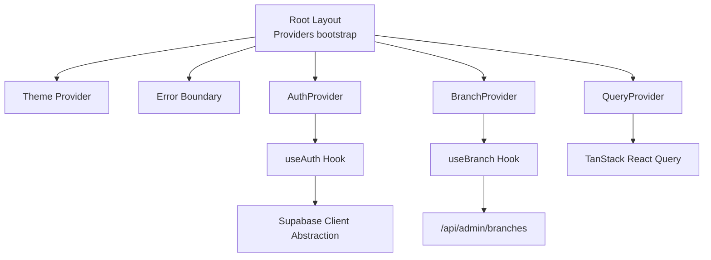
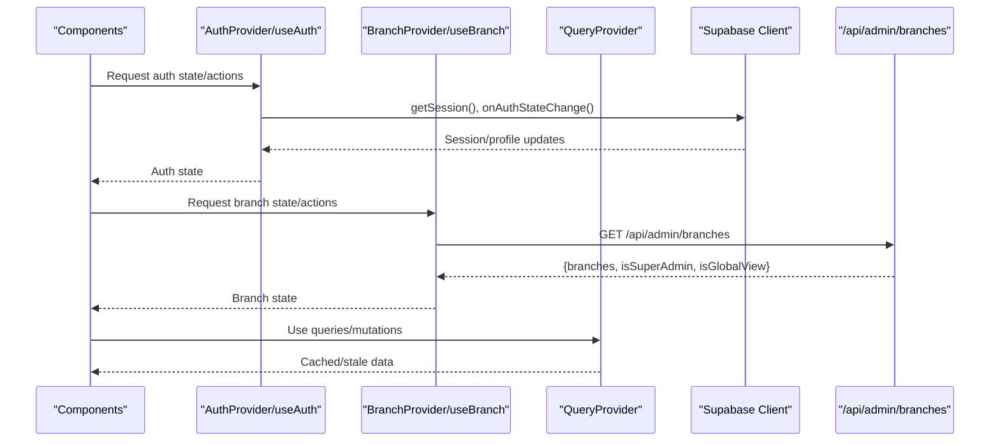
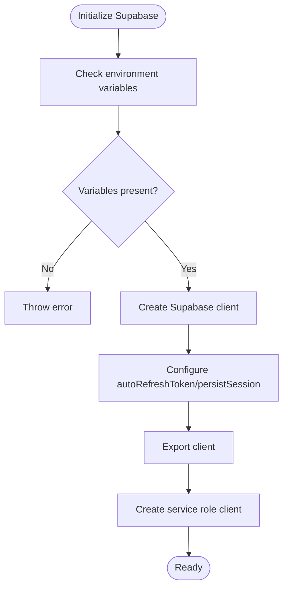
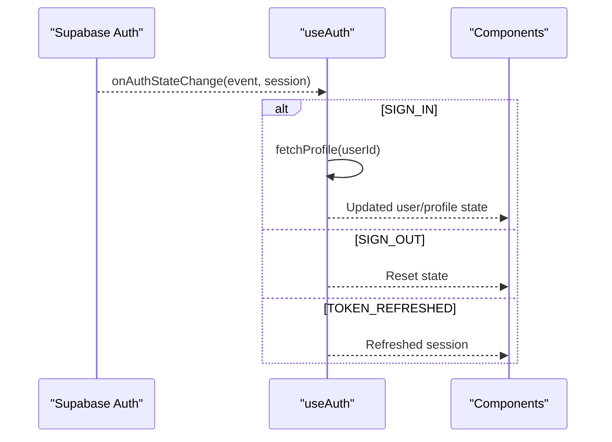
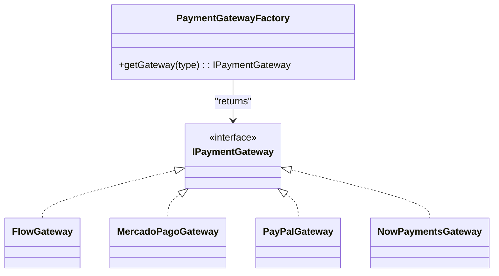
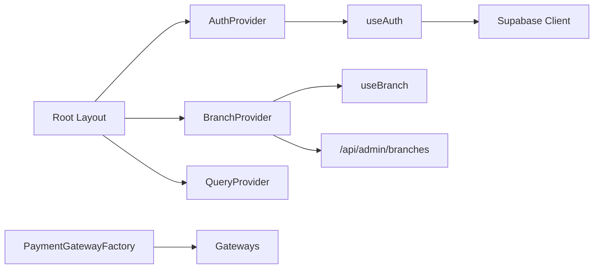

# System Design Patterns

<cite>
**Referenced Files in This Document**
- [AuthContext.tsx](file://src/contexts/AuthContext.tsx)
- [BranchContext.tsx](file://src/contexts/BranchContext.tsx)
- [useAuth.ts](file://src/hooks/useAuth.ts)
- [useBranch.ts](file://src/hooks/useBranch.ts)
- [QueryProvider.tsx](file://src/lib/react-query/QueryProvider.tsx)
- [supabase.ts](file://src/lib/supabase.ts)
- [layout.tsx](file://src/app/layout.tsx)
- [index.ts](file://src/lib/payments/index.ts)
- [mercadopago.ts](file://src/lib/mercadopago.ts)
</cite>

## Table of Contents

1. [Introduction](#introduction)
2. [Project Structure](#project-structure)
3. [Core Components](#core-components)
4. [Architecture Overview](#architecture-overview)
5. [Detailed Component Analysis](#detailed-component-analysis)
6. [Dependency Analysis](#dependency-analysis)
7. [Performance Considerations](#performance-considerations)
8. [Troubleshooting Guide](#troubleshooting-guide)
9. [Conclusion](#conclusion)

## Introduction

This document explains the design patterns implemented in the Opttius application, focusing on state management providers, repository abstraction, service layer encapsulation, observer-driven real-time updates, factory and strategy patterns for payment processing, and component composition approaches. It synthesizes the codebase’s provider hierarchy (AuthProvider, BranchProvider, QueryProvider), the Supabase client abstraction layer, and the payment gateway factory to demonstrate how these patterns improve modularity, testability, and scalability.

## Project Structure

The application bootstraps providers at the root layout level, establishing a layered architecture:

- Providers: AuthProvider, BranchProvider, QueryProvider wrap the application tree.
- Hooks: useAuth and useBranch expose typed state and actions to components.
- Data access: Supabase client abstraction centralizes database operations.
- Payments: Factory and interfaces define a strategy-like gateway selection mechanism.



**Diagram sources**

- [layout.tsx](file://src/app/layout.tsx#L30-L55)
- [AuthContext.tsx](file://src/contexts/AuthContext.tsx#L28-L36)
- [BranchContext.tsx](file://src/contexts/BranchContext.tsx#L38-L206)
- [QueryProvider.tsx](file://src/lib/react-query/QueryProvider.tsx#L7-L34)
- [useAuth.ts](file://src/hooks/useAuth.ts#L18-L377)
- [useBranch.ts](file://src/hooks/useBranch.ts#L40-L52)
- [supabase.ts](file://src/lib/supabase.ts#L11-L33)

**Section sources**

- [layout.tsx](file://src/app/layout.tsx#L30-L55)

## Core Components

- AuthProvider and useAuth: Provide authentication state, lifecycle events, and CRUD-like operations for profiles via Supabase.
- BranchProvider and useBranch: Manage multi-branch selection, persistence, and global view logic.
- QueryProvider: Configure caching, retries, and devtools for React Query.
- Supabase client abstraction: Centralizes client creation and service role usage.
- Payment gateway factory: Selects payment processors using a factory pattern.

**Section sources**

- [AuthContext.tsx](file://src/contexts/AuthContext.tsx#L28-L71)
- [BranchContext.tsx](file://src/contexts/BranchContext.tsx#L38-L216)
- [QueryProvider.tsx](file://src/lib/react-query/QueryProvider.tsx#L7-L35)
- [supabase.ts](file://src/lib/supabase.ts#L11-L36)
- [index.ts](file://src/lib/payments/index.ts#L19-L38)

## Architecture Overview

The provider pattern establishes a unidirectional data flow:

- Providers manage state and expose typed hooks.
- Hooks encapsulate side effects and integrate with external systems (Supabase, API).
- React Query handles caching and invalidation.
- Payment factory selects gateway implementations at runtime.



**Diagram sources**

- [AuthContext.tsx](file://src/contexts/AuthContext.tsx#L28-L36)
- [useAuth.ts](file://src/hooks/useAuth.ts#L93-L123)
- [BranchContext.tsx](file://src/contexts/BranchContext.tsx#L73-L155)
- [QueryProvider.tsx](file://src/lib/react-query/QueryProvider.tsx#L7-L34)
- [supabase.ts](file://src/lib/supabase.ts#L11-L17)

## Detailed Component Analysis

### Provider Pattern: AuthProvider, BranchProvider, QueryProvider

- AuthProvider
  - Wraps children with authentication state and convenience actions.
  - Exposes typed context and guards usage with a dedicated hook.
- BranchProvider
  - Manages branches, current selection, global view, and persistence.
  - Optimizes initialization for super admins by reading local storage.
  - Uses server-provided data for regular admins and validates selections.
- QueryProvider
  - Configures React Query defaults (staleTime, retries, devtools).
  - Provides a single client instance per render.

```mermaid
classDiagram
class AuthProvider {
+children : ReactNode
+value : AuthContextType
}
class BranchProvider {
+children : ReactNode
+value : BranchContextType
+initializeFromStorage()
+fetchBranches()
+setCurrentBranch()
}
class QueryProvider {
+children : React.ReactNode
+queryClient : QueryClient
}
class useAuth {
+state : AuthState
+signUp()
+signIn()
+signOut()
+updateProfile()
+resetPassword()
+refetchProfile()
}
class useBranch {
+branches : Branch[]
+currentBranch : Branch|null
+isGlobalView : boolean
+isSuperAdmin : boolean
+setCurrentBranch()
+refreshBranches()
}
AuthProvider --> useAuth : "exposes"
BranchProvider --> useBranch : "exposes"
QueryProvider --> "uses" : "TanStack Query"
```

**Diagram sources**

- [AuthContext.tsx](file://src/contexts/AuthContext.tsx#L28-L46)
- [BranchContext.tsx](file://src/contexts/BranchContext.tsx#L38-L206)
- [QueryProvider.tsx](file://src/lib/react-query/QueryProvider.tsx#L7-L34)
- [useAuth.ts](file://src/hooks/useAuth.ts#L18-L377)
- [useBranch.ts](file://src/hooks/useBranch.ts#L40-L52)

**Section sources**

- [AuthContext.tsx](file://src/contexts/AuthContext.tsx#L28-L71)
- [BranchContext.tsx](file://src/contexts/BranchContext.tsx#L38-L216)
- [QueryProvider.tsx](file://src/lib/react-query/QueryProvider.tsx#L7-L35)
- [useAuth.ts](file://src/hooks/useAuth.ts#L18-L377)
- [useBranch.ts](file://src/hooks/useBranch.ts#L40-L52)

### Repository Pattern: Supabase Client Abstraction

- Centralized client creation and service role provisioning.
- Encapsulates environment checks and client configuration.
- Enables server-side operations via a dedicated service role client.



**Diagram sources**

- [supabase.ts](file://src/lib/supabase.ts#L7-L36)

**Section sources**

- [supabase.ts](file://src/lib/supabase.ts#L11-L36)

### Service Layer Pattern: Business Logic Encapsulation

- Authentication service logic is encapsulated in useAuth:
  - Session lifecycle management.
  - Profile retrieval with timeouts and error handling.
  - Sign-up/sign-in/sign-out/update/reset flows.
- Branch service logic is encapsulated in BranchProvider:
  - Multi-branch selection and persistence.
  - Super admin vs regular admin branching strategies.
  - Validation and fallback mechanisms.

Benefits:

- Single responsibility per hook/provider.
- Easier testing and mocking of external dependencies.
  Trade-offs:
- Tight coupling to Supabase in hooks; consider extracting pure service functions for easier unit tests.

**Section sources**

- [useAuth.ts](file://src/hooks/useAuth.ts#L18-L377)
- [BranchContext.tsx](file://src/contexts/BranchContext.tsx#L73-L155)

### Observer Pattern: Real-Time Data Synchronization

- Auth state changes are observed via Supabase auth event stream.
- On SIGN_IN/SIGN_OUT/TOKEN_REFRESHED, local state is updated.
- BranchProvider listens to server responses and local storage for reactive updates.



**Diagram sources**

- [useAuth.ts](file://src/hooks/useAuth.ts#L93-L123)

**Section sources**

- [useAuth.ts](file://src/hooks/useAuth.ts#L93-L123)
- [BranchContext.tsx](file://src/contexts/BranchContext.tsx#L178-L190)

### Factory Pattern: Component Creation and Payment Gateway Selection

- Payment gateway factory selects implementations by type.
- Supports Flow, MercadoPago, PayPal, and NowPayments.
- Enables runtime selection and easy extension.



**Diagram sources**

- [index.ts](file://src/lib/payments/index.ts#L19-L34)

**Section sources**

- [index.ts](file://src/lib/payments/index.ts#L19-L38)

### Strategy Pattern: Payment Processing Integration

- PaymentService orchestrates intent creation and payment execution using a selected gateway.
- Strategy emerges from the factory-selected gateway implementation.
- Allows swapping gateways without changing consumer code.

Note: The MercadoPago stub indicates partial integration; the factory supports it, but runtime usage requires implementing the gateway.

**Section sources**

- [index.ts](file://src/lib/payments/index.ts#L36-L38)
- [mercadopago.ts](file://src/lib/mercadopago.ts#L1-L21)

### Component Composition Patterns

- Compound components: Providers compose state and actions for consumers.
- Atomic design alignment: UI primitives are reusable and composable; providers supply data to these components.
- Hooks-as-services: useAuth and useBranch abstract cross-cutting concerns (auth and branch selection) for component composition.

[No sources needed since this section provides conceptual guidance]

## Dependency Analysis

Providers depend on hooks, which depend on Supabase clients and APIs. QueryProvider depends on TanStack Query. Payment factory depends on gateway implementations.



**Diagram sources**

- [layout.tsx](file://src/app/layout.tsx#L44-L46)
- [AuthContext.tsx](file://src/contexts/AuthContext.tsx#L28-L36)
- [BranchContext.tsx](file://src/contexts/BranchContext.tsx#L38-L206)
- [useAuth.ts](file://src/hooks/useAuth.ts#L29-L40)
- [useBranch.ts](file://src/hooks/useBranch.ts#L40-L41)
- [QueryProvider.tsx](file://src/lib/react-query/QueryProvider.tsx#L7-L34)
- [index.ts](file://src/lib/payments/index.ts#L19-L34)

**Section sources**

- [layout.tsx](file://src/app/layout.tsx#L44-L46)
- [useAuth.ts](file://src/hooks/useAuth.ts#L29-L40)
- [BranchContext.tsx](file://src/contexts/BranchContext.tsx#L100-L106)
- [QueryProvider.tsx](file://src/lib/react-query/QueryProvider.tsx#L7-L34)
- [index.ts](file://src/lib/payments/index.ts#L19-L34)

## Performance Considerations

- React Query defaults:
  - Stale time reduces unnecessary refetches after SSR.
  - Controlled retries minimize network pressure.
  - Devtools disabled in production reduce overhead.
- Auth initialization:
  - Timers prevent hanging; profile fetch timeouts handle slow networks.
  - Token refresh events update state without full reinitialization.
- Branch initialization:
  - Super admin reads local storage to avoid server calls.
  - Validation ensures persisted selections remain valid.

Scalability implications:

- Provider state should be granular to avoid unnecessary re-renders.
- Consider splitting providers if the tree grows larger.
- Use selective invalidation and targeted queries to limit cache churn.

**Section sources**

- [QueryProvider.tsx](file://src/lib/react-query/QueryProvider.tsx#L10-L22)
- [useAuth.ts](file://src/hooks/useAuth.ts#L32-L37)
- [BranchContext.tsx](file://src/contexts/BranchContext.tsx#L47-L96)

## Troubleshooting Guide

- Missing environment variables for Supabase:
  - Symptom: Application throws during client creation.
  - Resolution: Set required environment variables and restart.
- Auth initialization timeouts:
  - Symptom: Loading remains true after timeout.
  - Resolution: Verify network connectivity and Supabase availability.
- Branch selection inconsistencies:
  - Symptom: Selected branch disappears after reload.
  - Resolution: Ensure server returns valid branches; local storage is cleared on sign-out.
- Payment gateway not supported:
  - Symptom: Factory throws error for unsupported type.
  - Resolution: Use a supported gateway or extend the factory.

**Section sources**

- [supabase.ts](file://src/lib/supabase.ts#L7-L9)
- [useAuth.ts](file://src/hooks/useAuth.ts#L32-L37)
- [BranchContext.tsx](file://src/contexts/BranchContext.tsx#L59-L64)
- [index.ts](file://src/lib/payments/index.ts#L30-L32)

## Conclusion

Opttius leverages provider, repository, service layer, observer, factory, and strategy patterns to achieve a modular, scalable, and maintainable architecture. Providers encapsulate state and actions, Supabase abstraction centralizes data access, React Query optimizes caching, and the payment factory enables flexible gateway integration. These patterns collectively improve separation of concerns, testability, and developer productivity while supporting growth and real-time responsiveness.
