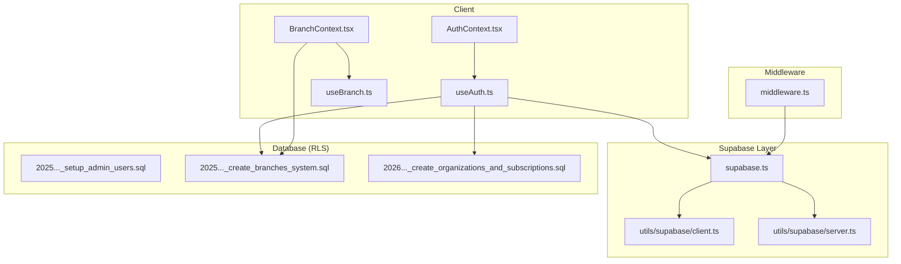
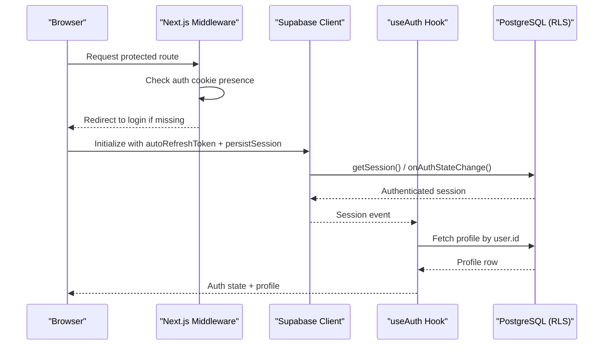
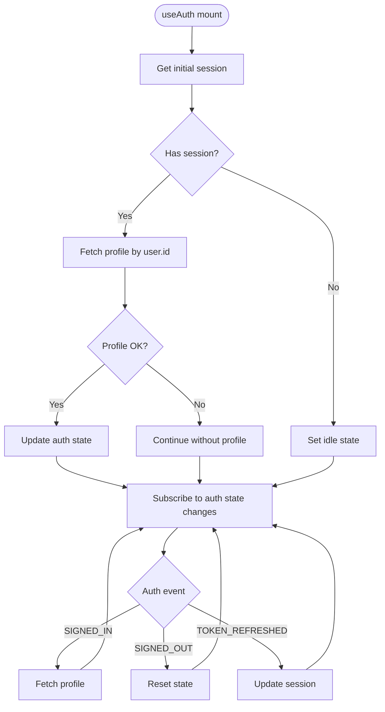
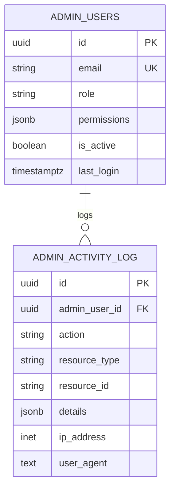
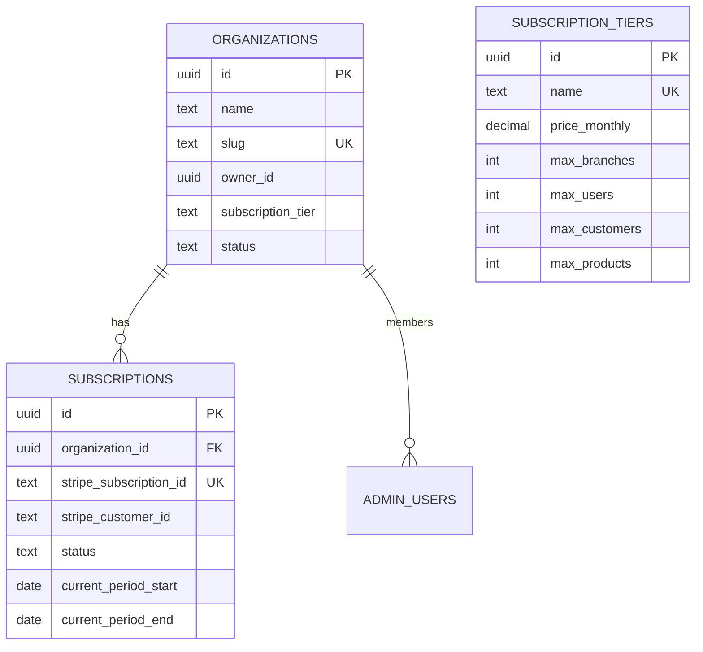
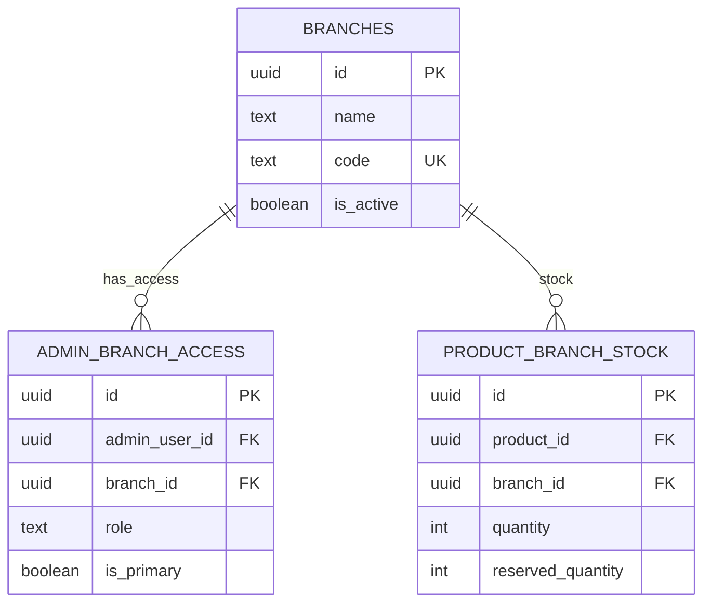
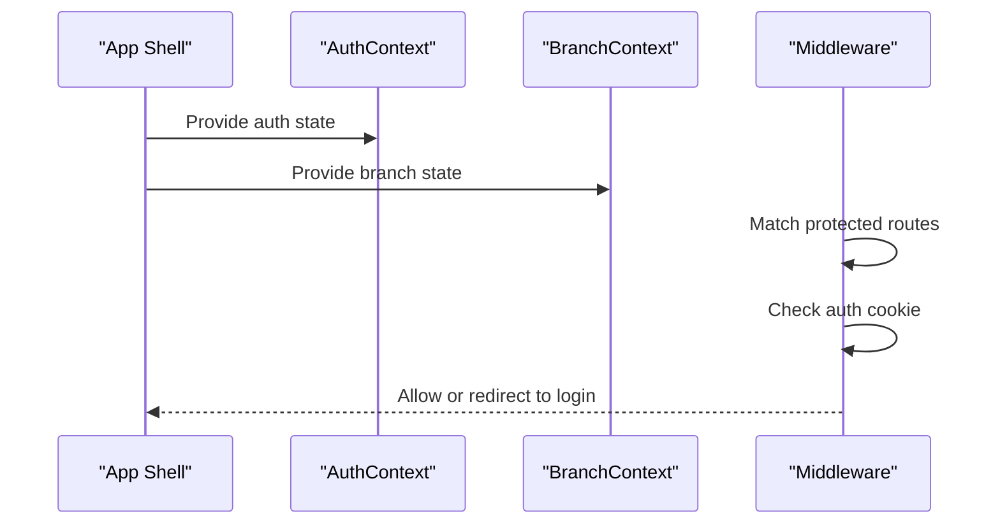
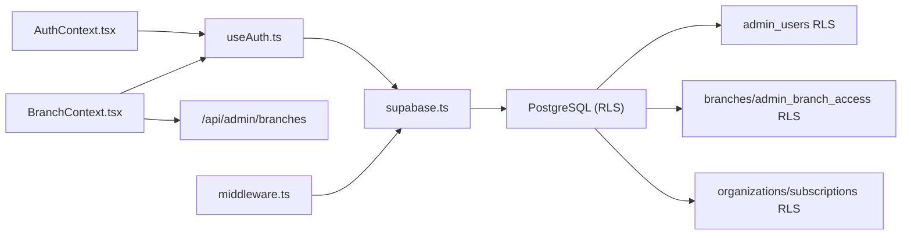

# Authentication & Authorization

<cite>
**Referenced Files in This Document**
- [AuthContext.tsx](file://src/contexts/AuthContext.tsx)
- [useAuth.ts](file://src/hooks/useAuth.ts)
- [supabase.ts](file://src/lib/supabase.ts)
- [client.ts](file://src/utils/supabase/client.ts)
- [server.ts](file://src/utils/supabase/server.ts)
- [middleware.ts](file://src/middleware.ts)
- [BranchContext.tsx](file://src/contexts/BranchContext.tsx)
- [useBranch.ts](file://src/hooks/useBranch.ts)
- [database.ts](file://src/types/database.ts)
- [20250116000000_setup_admin_users.sql](file://supabase/migrations/20250116000000_setup_admin_users.sql)
- [20250116000001_fix_admin_profile.sql](file://supabase/migrations/20250116000001_fix_admin_profile.sql)
- [20251216000000_create_branches_system.sql](file://supabase/migrations/20251216000000_create_branches_system.sql)
- [20260128000000_create_organizations_and_subscriptions.sql](file://supabase/migrations/20260128000000_create_organizations_and_subscriptions.sql)
</cite>

## Table of Contents

1. [Introduction](#introduction)
2. [Project Structure](#project-structure)
3. [Core Components](#core-components)
4. [Architecture Overview](#architecture-overview)
5. [Detailed Component Analysis](#detailed-component-analysis)
6. [Dependency Analysis](#dependency-analysis)
7. [Performance Considerations](#performance-considerations)
8. [Security Hardening Guide](#security-hardening-guide)
9. [Troubleshooting Guide](#troubleshooting-guide)
10. [Conclusion](#conclusion)

## Introduction

This document explains the authentication and authorization system in Opttius, focusing on Supabase Auth integration, session lifecycle, role-based access control (RBAC), and multi-tenant permissions. It covers:

- How users authenticate and maintain sessions
- How the frontend exposes user state and profile data
- How Supabase Row Level Security (RLS) enforces tenant and branch boundaries
- How organization-based data isolation and subscription tiers are modeled
- How branch-level access controls are enforced for admin users
- Practical guidance for middleware protection, CSRF considerations, session hijacking prevention, and secure logout

## Project Structure

The authentication and authorization stack spans client-side React hooks, Supabase clients, middleware, and database-level RLS policies. The key areas are:

- Frontend auth state management and providers
- Supabase client configuration and SSR helpers
- Middleware-based route protection
- Database schema for organizations, subscriptions, branches, and admin access

**Diagram sources**

- [AuthContext.tsx](file://src/contexts/AuthContext.tsx#L1-L71)
- [useAuth.ts](file://src/hooks/useAuth.ts#L1-L377)
- [supabase.ts](file://src/lib/supabase.ts#L1-L36)
- [client.ts](file://src/utils/supabase/client.ts#L1-L8)
- [server.ts](file://src/utils/supabase/server.ts#L1-L110)
- [middleware.ts](file://src/middleware.ts#L1-L109)
- [20250116000000_setup_admin_users.sql](file://supabase/migrations/20250116000000_setup_admin_users.sql#L1-L280)
- [20251216000000_create_branches_system.sql](file://supabase/migrations/20251216000000_create_branches_system.sql#L1-L397)
- [20260128000000_create_organizations_and_subscriptions.sql](file://supabase/migrations/20260128000000_create_organizations_and_subscriptions.sql#L1-L287)

**Section sources**

- [AuthContext.tsx](file://src/contexts/AuthContext.tsx#L1-L71)
- [useAuth.ts](file://src/hooks/useAuth.ts#L1-L377)
- [supabase.ts](file://src/lib/supabase.ts#L1-L36)
- [client.ts](file://src/utils/supabase/client.ts#L1-L8)
- [server.ts](file://src/utils/supabase/server.ts#L1-L110)
- [middleware.ts](file://src/middleware.ts#L1-L109)
- [20250116000000_setup_admin_users.sql](file://supabase/migrations/20250116000000_setup_admin_users.sql#L1-L280)
- [20251216000000_create_branches_system.sql](file://supabase/migrations/20251216000000_create_branches_system.sql#L1-L397)
- [20260128000000_create_organizations_and_subscriptions.sql](file://supabase/migrations/20260128000000_create_organizations_and_subscriptions.sql#L1-L287)

## Core Components

- AuthContext and useAuth: Provide centralized auth state, profile loading, sign-in/sign-up/reset-password, and sign-out. They subscribe to Supabase auth events and keep local state synchronized.
- Supabase client configuration: Enables automatic token refresh and persistent sessions in the browser; provides a service role client for admin operations bypassing RLS.
- BranchContext and useBranch: Manage multi-branch access for admin users, including global view for super admins and branch-scoped views for managers/staff.
- Middleware: Performs lightweight checks for protected routes and ensures auth cookies presence for admin layouts.
- Database RLS: Enforces organization-level isolation, subscription tier limits, branch-level access, and admin permissions.

**Section sources**

- [AuthContext.tsx](file://src/contexts/AuthContext.tsx#L1-L71)
- [useAuth.ts](file://src/hooks/useAuth.ts#L1-L377)
- [supabase.ts](file://src/lib/supabase.ts#L1-L36)
- [BranchContext.tsx](file://src/contexts/BranchContext.tsx#L1-L216)
- [useBranch.ts](file://src/hooks/useBranch.ts#L1-L53)
- [middleware.ts](file://src/middleware.ts#L1-L109)
- [20250116000000_setup_admin_users.sql](file://supabase/migrations/20250116000000_setup_admin_users.sql#L1-L280)
- [20251216000000_create_branches_system.sql](file://supabase/migrations/20251216000000_create_branches_system.sql#L1-L397)
- [20260128000000_create_organizations_and_subscriptions.sql](file://supabase/migrations/20260128000000_create_organizations_and_subscriptions.sql#L1-L287)

## Architecture Overview

The system integrates Supabase Auth with React context and Next.js middleware to enforce:

- Session persistence and refresh
- Organization-based data isolation
- Branch-level access control for admin users
- Subscription tier gating and limits

**Diagram sources**

- [middleware.ts](file://src/middleware.ts#L14-L95)
- [supabase.ts](file://src/lib/supabase.ts#L11-L17)
- [useAuth.ts](file://src/hooks/useAuth.ts#L27-L130)
- [20250116000000_setup_admin_users.sql](file://supabase/migrations/20250116000000_setup_admin_users.sql#L34-L52)

## Detailed Component Analysis

### Supabase Auth Integration and Session Management

- Client initialization enables auto-refresh and persistent sessions, ensuring long-lived admin sessions remain valid.
- useAuth manages:
  - Initial session retrieval and profile fetch
  - Auth state change subscriptions (sign-in, sign-out, token refresh)
  - Sign-up with optional user metadata, sign-in, sign-out, profile updates, and password reset
  - Graceful error handling and timeouts for slow environments
- Supabase server utilities support both cookie-based and Bearer token authentication for API routes and tests.

**Diagram sources**

- [useAuth.ts](file://src/hooks/useAuth.ts#L27-L130)
- [useAuth.ts](file://src/hooks/useAuth.ts#L132-L192)

**Section sources**

- [supabase.ts](file://src/lib/supabase.ts#L11-L17)
- [useAuth.ts](file://src/hooks/useAuth.ts#L18-L130)
- [useAuth.ts](file://src/hooks/useAuth.ts#L132-L192)
- [server.ts](file://src/utils/supabase/server.ts#L43-L92)

### Role-Based Access Control (RBAC) and Admin Users

- Admin users are stored in a dedicated table with roles and permissions. RLS policies restrict visibility and modifications to authorized users.
- Functions provide runtime checks for admin status, role retrieval, and activity logging.
- The system supports:
  - Super admin (full access)
  - Store manager, customer support, content manager (scoped access)
  - Permission matrices via JSONB for granular control

**Diagram sources**

- [20250116000000_setup_admin_users.sql](file://supabase/migrations/20250116000000_setup_admin_users.sql#L5-L28)
- [20250116000000_setup_admin_users.sql](file://supabase/migrations/20250116000000_setup_admin_users.sql#L80-L148)

**Section sources**

- [20250116000000_setup_admin_users.sql](file://supabase/migrations/20250116000000_setup_admin_users.sql#L34-L52)
- [20250116000000_setup_admin_users.sql](file://supabase/migrations/20250116000000_setup_admin_users.sql#L80-L148)
- [20250116000001_fix_admin_profile.sql](file://supabase/migrations/20250116000001_fix_admin_profile.sql#L116-L134)

### Multi-Tenant Permission Model: Organizations and Subscription Tiers

- Organizations represent tenants. Each organization has a subscription tier with feature and capacity limits.
- RLS policies ensure users can only access their organization’s data and are restricted by subscription tier capabilities.
- Indexes and triggers support efficient updates and cascading deletes.

**Diagram sources**

- [20260128000000_create_organizations_and_subscriptions.sql](file://supabase/migrations/20260128000000_create_organizations_and_subscriptions.sql#L6-L31)
- [20260128000000_create_organizations_and_subscriptions.sql](file://supabase/migrations/20260128000000_create_organizations_and_subscriptions.sql#L134-L208)

**Section sources**

- [20260128000000_create_organizations_and_subscriptions.sql](file://supabase/migrations/20260128000000_create_organizations_and_subscriptions.sql#L88-L208)

### Branch-Level Access Controls

- Branches define locations with settings and stock per product.
- Admin users gain access to branches via a mapping table with roles (manager, staff, viewer) and a primary branch designation.
- Functions and RLS policies enforce:
  - Super admins can access all branches (global view)
  - Non-super admins can only access assigned branches
  - Stock and related entities are scoped to accessible branches

**Diagram sources**

- [20251216000000_create_branches_system.sql](file://supabase/migrations/20251216000000_create_branches_system.sql#L5-L46)
- [20251216000000_create_branches_system.sql](file://supabase/migrations/20251216000000_create_branches_system.sql#L222-L302)

**Section sources**

- [20251216000000_create_branches_system.sql](file://supabase/migrations/20251216000000_create_branches_system.sql#L99-L188)
- [20251216000000_create_branches_system.sql](file://supabase/migrations/20251216000000_create_branches_system.sql#L222-L302)

### Context Providers and Middleware Protection

- AuthContext wraps the app to expose user, profile, and auth actions to components.
- BranchContext maintains branch selection state, supports global view for super admins, and persists selections locally.
- Middleware performs lightweight checks for admin routes, verifying auth cookies and redirecting unauthorized users to login.

**Diagram sources**

- [AuthContext.tsx](file://src/contexts/AuthContext.tsx#L28-L46)
- [BranchContext.tsx](file://src/contexts/BranchContext.tsx#L38-L71)
- [middleware.ts](file://src/middleware.ts#L14-L95)

**Section sources**

- [AuthContext.tsx](file://src/contexts/AuthContext.tsx#L28-L46)
- [BranchContext.tsx](file://src/contexts/BranchContext.tsx#L38-L71)
- [middleware.ts](file://src/middleware.ts#L14-L95)

## Dependency Analysis

- Frontend depends on Supabase JS for client auth and on Supabase SSR utilities for server-side requests.
- Database RLS depends on:
  - Admin user roles and permissions
  - Branch access grants
  - Organization membership and subscription tiers
- BranchContext relies on API endpoints to fetch accessible branches and stores preferences locally for super admins.

**Diagram sources**

- [useAuth.ts](file://src/hooks/useAuth.ts#L1-L377)
- [supabase.ts](file://src/lib/supabase.ts#L1-L36)
- [BranchContext.tsx](file://src/contexts/BranchContext.tsx#L73-L155)
- [middleware.ts](file://src/middleware.ts#L14-L95)
- [20250116000000_setup_admin_users.sql](file://supabase/migrations/20250116000000_setup_admin_users.sql#L34-L52)
- [20251216000000_create_branches_system.sql](file://supabase/migrations/20251216000000_create_branches_system.sql#L222-L302)
- [20260128000000_create_organizations_and_subscriptions.sql](file://supabase/migrations/20260128000000_create_organizations_and_subscriptions.sql#L134-L208)

**Section sources**

- [useAuth.ts](file://src/hooks/useAuth.ts#L1-L377)
- [supabase.ts](file://src/lib/supabase.ts#L1-L36)
- [BranchContext.tsx](file://src/contexts/BranchContext.tsx#L73-L155)
- [middleware.ts](file://src/middleware.ts#L14-L95)
- [20250116000000_setup_admin_users.sql](file://supabase/migrations/20250116000000_setup_admin_users.sql#L34-L52)
- [20251216000000_create_branches_system.sql](file://supabase/migrations/20251216000000_create_branches_system.sql#L222-L302)
- [20260128000000_create_organizations_and_subscriptions.sql](file://supabase/migrations/20260128000000_create_organizations_and_subscriptions.sql#L134-L208)

## Performance Considerations

- Auth initialization and profile fetch include timeouts to avoid hanging UIs during slow network conditions.
- BranchContext caches branch lists and uses localStorage to minimize server calls for super admins.
- RLS policies rely on appropriate indexes; migrations create indexes on foreign keys and lookup columns to improve query performance.

[No sources needed since this section provides general guidance]

## Security Hardening Guide

- Session hijacking prevention
  - Supabase auto-refresh and persistent sessions are enabled; ensure HTTPS in production and secure cookie attributes.
  - Use Supabase Auth’s built-in token refresh and avoid storing raw tokens client-side beyond necessity.
- CSRF protection
  - Supabase Auth uses signed cookies and JWTs; leverage Supabase SSR helpers that read cookies to avoid relying on external CSRF tokens.
- Secure logout
  - Always call the sign-out function to invalidate the session server-side and clear local state.
- Least privilege
  - Assign minimal roles (manager/staff/viewer) and restrict branch access to only necessary locations.
  - Use subscription tiers to limit resource counts (users, customers, products).
- Audit and monitoring
  - Activity logs capture admin actions; monitor for suspicious patterns.

**Section sources**

- [supabase.ts](file://src/lib/supabase.ts#L11-L17)
- [useAuth.ts](file://src/hooks/useAuth.ts#L298-L310)
- [20250116000000_setup_admin_users.sql](file://supabase/migrations/20250116000000_setup_admin_users.sql#L113-L148)

## Troubleshooting Guide

- Auth initialization hangs or shows loading indefinitely
  - Check for timeouts and console warnings; verify environment variables for Supabase URL and keys.
- Profile fetch fails or returns null
  - New users may not have a profile yet; the system handles missing profiles gracefully.
- Branch switching not working for super admins
  - Confirm localStorage key and that the selected branch still exists; the provider validates against the fetched list.
- Middleware redirects to login unexpectedly
  - Ensure auth cookies are present and not blocked; verify middleware matcher exclusions.

**Section sources**

- [useAuth.ts](file://src/hooks/useAuth.ts#L31-L91)
- [useAuth.ts](file://src/hooks/useAuth.ts#L132-L192)
- [BranchContext.tsx](file://src/contexts/BranchContext.tsx#L47-L71)
- [BranchContext.tsx](file://src/contexts/BranchContext.tsx#L157-L176)
- [middleware.ts](file://src/middleware.ts#L62-L81)

## Conclusion

Opttius implements a robust, layered authentication and authorization system:

- Supabase Auth provides secure sessions with auto-refresh and persistent storage
- React contexts expose typed auth and branch state across the app
- Database RLS enforces organization and branch boundaries with explicit policies
- Admin RBAC and subscription tiers offer scalable access control aligned with business needs

By following the patterns documented here—using Supabase clients, enforcing RLS, leveraging context providers, and applying middleware protections—you can implement secure, multi-tenant applications with fine-grained access control.
