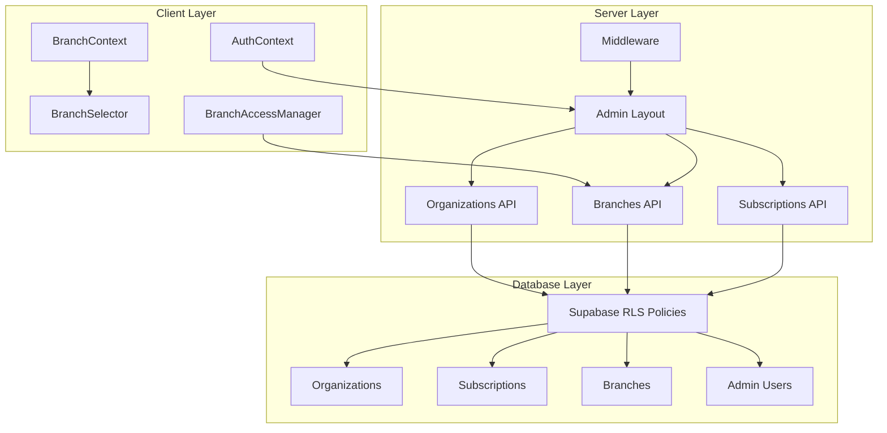
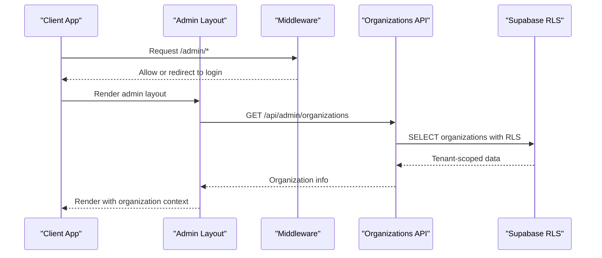
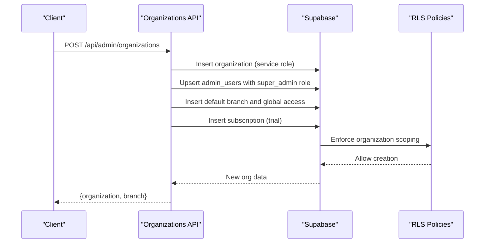
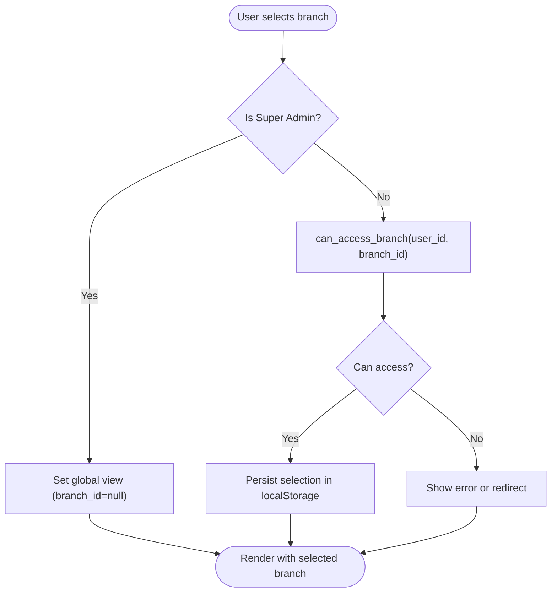
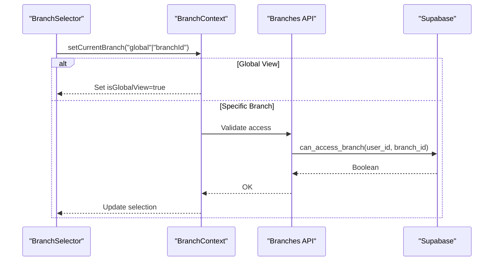
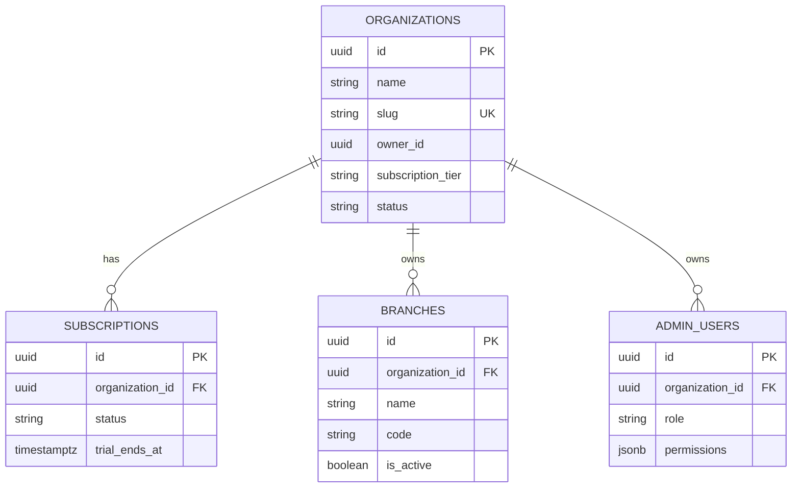
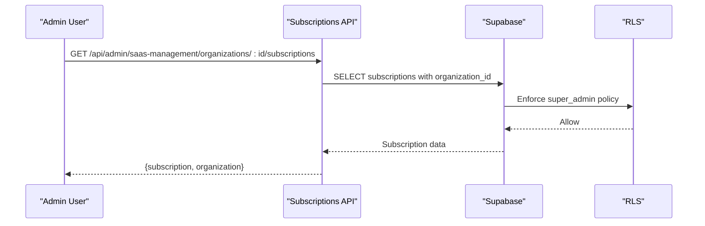
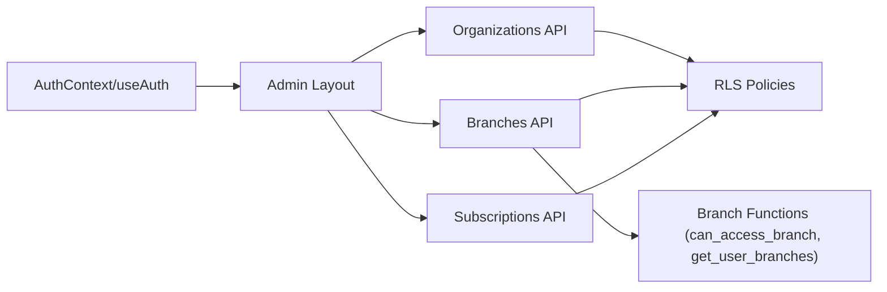

# Organization-Based Permissions

<cite>
**Referenced Files in This Document**
- [middleware.ts](file://src/middleware.ts)
- [AuthContext.tsx](file://src/contexts/AuthContext.tsx)
- [BranchContext.tsx](file://src/contexts/BranchContext.tsx)
- [BranchSelector.tsx](file://src/components/admin/BranchSelector.tsx)
- [BranchAccessManager.tsx](file://src/components/admin/BranchAccessManager.tsx)
- [useAuth.ts](file://src/hooks/useAuth.ts)
- [layout.tsx](file://src/app/admin/layout.tsx)
- [organizations/route.ts](file://src/app/api/admin/organizations/route.ts)
- [organizations/current/route.ts](file://src/app/api/admin/organizations/current/route.ts)
- [organization-schemas.ts](file://src/lib/api/validation/organization-schemas.ts)
- [assign-demo/route.ts](file://src/app/api/onboarding/assign-demo/route.ts)
- [20260128000000_create_organizations_and_subscriptions.sql](file://supabase/migrations/20260128000000_create_organizations_and_subscriptions.sql)
- [20260131000009_create_root_dev_employee_roles.sql](file://supabase/migrations/20260131000009_create_root_dev_employee_roles.sql)
- [20260128000001_extend_rls_for_multitenancy.sql](file://supabase/migrations/20260128000001_extend_rls_for_multitenancy.sql)
- [20251216000000_create_branches_system.sql](file://supabase/migrations/20251216000000_create_branches_system.sql)
- [20260204000000_fix_root_user_branch_access.sql](file://supabase/migrations/20260204000000_fix_root_user_branch_access.sql)
- [20260205000002_add_trial_columns.sql](file://supabase/migrations/20260205000002_add_trial_columns.sql)
- [route.ts](file://src/app/api/admin/branches/route.ts)
- [route.ts](file://src/app/api/admin/saas-management/organizations/[id]/subscriptions/route.ts)
- [page.tsx](file://src/app/admin/saas-management/subscriptions/page.tsx)
</cite>

## Table of Contents

1. [Introduction](#introduction)
2. [Project Structure](#project-structure)
3. [Core Components](#core-components)
4. [Architecture Overview](#architecture-overview)
5. [Detailed Component Analysis](#detailed-component-analysis)
6. [Dependency Analysis](#dependency-analysis)
7. [Performance Considerations](#performance-considerations)
8. [Troubleshooting Guide](#troubleshooting-guide)
9. [Conclusion](#conclusion)
10. [Appendices](#appendices)

## Introduction

This document explains Opttius’s organization-based permission system, detailing the multi-tenant architecture with organization-level data isolation, cross-branch access controls, and hierarchical permission patterns. It covers organization membership, branch-level permissions, subscription-based feature access, billing-related permissions, Supabase RLS policies, and middleware protections. Practical examples demonstrate organization switching, branch access validation, and data segregation, alongside guidance for implementing organization-aware components and API endpoints.

## Project Structure

Opttius implements a layered architecture:

- Authentication and session management via Supabase
- Organization and subscription management via dedicated API routes
- Branch-level access control with a dedicated context and UI selector
- Supabase Row Level Security (RLS) policies enforcing tenant isolation
- Middleware protecting admin routes and gating access based on organization status

**Diagram sources**

- [middleware.ts](file://src/middleware.ts#L1-L109)
- [layout.tsx](file://src/app/admin/layout.tsx#L165-L800)
- [organizations/route.ts](file://src/app/api/admin/organizations/route.ts#L1-L441)
- [route.ts](file://src/app/api/admin/branches/route.ts#L42-L223)
- [route.ts](file://src/app/api/admin/saas-management/organizations/[id]/subscriptions/route.ts)
- [20260128000000_create_organizations_and_subscriptions.sql](file://supabase/migrations/20260128000000_create_organizations_and_subscriptions.sql#L88-L137)
- [20260128000001_extend_rls_for_multitenancy.sql](file://supabase/migrations/20260128000001_extend_rls_for_multitenancy.sql#L337-L390)

**Section sources**

- [middleware.ts](file://src/middleware.ts#L1-L109)
- [layout.tsx](file://src/app/admin/layout.tsx#L165-L800)

## Core Components

- Authentication and session management: centralized in the AuthContext and useAuth hook, integrating with Supabase Auth.
- Organization management: APIs for creating, retrieving, and updating organization metadata; validation schemas ensure slug uniqueness and naming rules.
- Branch-level access control: BranchContext maintains current branch selection and global view for super admins; BranchSelector UI exposes switching; BranchAccessManager manages assignments.
- Supabase RLS: policies enforce organization scoping for organizations, subscriptions, and tenant-aware tables; branch visibility functions and access checks are enforced in stored procedures.
- Middleware protection: guards admin routes and redirects unauthorized users to login; admin layout performs organization checks and onboarding gating.

**Section sources**

- [AuthContext.tsx](file://src/contexts/AuthContext.tsx#L1-L71)
- [useAuth.ts](file://src/hooks/useAuth.ts#L1-L377)
- [organizations/route.ts](file://src/app/api/admin/organizations/route.ts#L1-L441)
- [organization-schemas.ts](file://src/lib/api/validation/organization-schemas.ts#L1-L70)
- [BranchContext.tsx](file://src/contexts/BranchContext.tsx#L1-L216)
- [BranchSelector.tsx](file://src/components/admin/BranchSelector.tsx#L1-L107)
- [BranchAccessManager.tsx](file://src/components/admin/BranchAccessManager.tsx#L1-L342)
- [20260128000000_create_organizations_and_subscriptions.sql](file://supabase/migrations/20260128000000_create_organizations_and_subscriptions.sql#L88-L137)
- [20260128000001_extend_rls_for_multitenancy.sql](file://supabase/migrations/20260128000001_extend_rls_for_multitenancy.sql#L337-L390)

## Architecture Overview

The system enforces multi-tenancy by scoping data to an organization via organization_id. RLS policies ensure reads/writes remain tenant-isolated. Branch-level access is controlled via admin_branch_access and stored functions, enabling super admins to operate in a global view while regular admins are restricted to assigned branches.

**Diagram sources**

- [middleware.ts](file://src/middleware.ts#L14-L95)
- [layout.tsx](file://src/app/admin/layout.tsx#L296-L382)
- [organizations/route.ts](file://src/app/api/admin/organizations/route.ts#L20-L103)
- [20260128000000_create_organizations_and_subscriptions.sql](file://supabase/migrations/20260128000000_create_organizations_and_subscriptions.sql#L88-L137)

## Detailed Component Analysis

### Organization Membership Model

- Creation flow: authenticated users can create an organization, which sets them as super_admin and assigns ownership. A default branch is created and global access is granted for the creator.
- Retrieval and updates: current organization metadata is fetched and updated via dedicated endpoints, scoped to the authenticated user’s organization via service role clients and RLS.
- Validation: Zod schemas enforce slug uniqueness, naming rules, and tier constraints.

**Diagram sources**

- [organizations/route.ts](file://src/app/api/admin/organizations/route.ts#L121-L441)
- [organization-schemas.ts](file://src/lib/api/validation/organization-schemas.ts#L51-L70)
- [20260128000000_create_organizations_and_subscriptions.sql](file://supabase/migrations/20260128000000_create_organizations_and_subscriptions.sql#L212-L255)

**Section sources**

- [organizations/route.ts](file://src/app/api/admin/organizations/route.ts#L121-L441)
- [organizations/current/route.ts](file://src/app/api/admin/organizations/current/route.ts#L10-L153)
- [organization-schemas.ts](file://src/lib/api/validation/organization-schemas.ts#L1-L70)

### Branch-Level Permissions and Hierarchical Access

- Branch visibility: stored functions return accessible branches per user, treating root/dev users like super_admin for visibility.
- Access enforcement: can_access_branch validates whether a user can access a given branch; global view is only permitted for super_admin.
- UI and context: BranchContext manages current branch selection, supports global view for super admins, and persists selections in localStorage for performance.

**Diagram sources**

- [20251216000000_create_branches_system.sql](file://supabase/migrations/20251216000000_create_branches_system.sql#L131-L188)
- [20260204000000_fix_root_user_branch_access.sql](file://supabase/migrations/20260204000000_fix_root_user_branch_access.sql#L9-L44)
- [BranchContext.tsx](file://src/contexts/BranchContext.tsx#L157-L176)
- [BranchSelector.tsx](file://src/components/admin/BranchSelector.tsx#L27-L36)

**Section sources**

- [20251216000000_create_branches_system.sql](file://supabase/migrations/20251216000000_create_branches_system.sql#L131-L188)
- [20260204000000_fix_root_user_branch_access.sql](file://supabase/migrations/20260204000000_fix_root_user_branch_access.sql#L9-L44)
- [BranchContext.tsx](file://src/contexts/BranchContext.tsx#L157-L176)
- [BranchSelector.tsx](file://src/components/admin/BranchSelector.tsx#L1-L107)

### Organization Switching and Cross-Branch Access

- Super admins can toggle between global view and a specific branch; selections persist locally to avoid repeated server calls.
- Regular admins are restricted to assigned branches; the UI hides global view options.
- BranchAccessManager allows assigning/removing branch access and promoting users to super admin globally.

**Diagram sources**

- [BranchContext.tsx](file://src/contexts/BranchContext.tsx#L157-L176)
- [route.ts](file://src/app/api/admin/branches/route.ts#L42-L81)
- [20251216000000_create_branches_system.sql](file://supabase/migrations/20251216000000_create_branches_system.sql#L160-L188)

**Section sources**

- [BranchContext.tsx](file://src/contexts/BranchContext.tsx#L1-L216)
- [BranchSelector.tsx](file://src/components/admin/BranchSelector.tsx#L1-L107)
- [BranchAccessManager.tsx](file://src/components/admin/BranchAccessManager.tsx#L1-L342)
- [route.ts](file://src/app/api/admin/branches/route.ts#L42-L81)

### Data Segregation Between Organizations

- RLS policies on organizations and subscriptions ensure users only see their organization’s data.
- Tenant-aware tables (e.g., products, customers) use organization_id scoping; legacy records may have organization_id IS NULL for backward compatibility.
- Root/dev users bypass organization scoping for administrative tasks.

**Diagram sources**

- [20260128000000_create_organizations_and_subscriptions.sql](file://supabase/migrations/20260128000000_create_organizations_and_subscriptions.sql#L88-L137)
- [20260128000001_extend_rls_for_multitenancy.sql](file://supabase/migrations/20260128000001_extend_rls_for_multitenancy.sql#L337-L390)
- [20260131000009_create_root_dev_employee_roles.sql](file://supabase/migrations/20260131000009_create_root_dev_employee_roles.sql#L94-L122)

**Section sources**

- [20260128000000_create_organizations_and_subscriptions.sql](file://supabase/migrations/20260128000000_create_organizations_and_subscriptions.sql#L88-L137)
- [20260128000001_extend_rls_for_multitenancy.sql](file://supabase/migrations/20260128000001_extend_rls_for_multitenancy.sql#L337-L390)
- [20260131000009_create_root_dev_employee_roles.sql](file://supabase/migrations/20260131000009_create_root_dev_employee_roles.sql#L94-L122)

### Subscription-Based Feature Access and Billing Permissions

- Subscription tiers define feature sets and limits; RLS policies restrict management to super admins.
- Trial periods are tracked per organization; trial overrides can be configured per organization.
- SaaS management endpoints expose subscription details and actions for root/dev users.

**Diagram sources**

- [route.ts](file://src/app/api/admin/saas-management/organizations/[id]/subscriptions/route.ts)
- [20260205000002_add_trial_columns.sql](file://supabase/migrations/20260205000002_add_trial_columns.sql#L1-L12)
- [20260128000000_create_organizations_and_subscriptions.sql](file://supabase/migrations/20260128000000_create_organizations_and_subscriptions.sql#L187-L208)

**Section sources**

- [route.ts](file://src/app/api/admin/saas-management/organizations/[id]/subscriptions/route.ts)
- [20260205000002_add_trial_columns.sql](file://supabase/migrations/20260205000002_add_trial_columns.sql#L1-L12)
- [20260128000000_create_organizations_and_subscriptions.sql](file://supabase/migrations/20260128000000_create_organizations_and_subscriptions.sql#L187-L208)

### Integration with Supabase RLS Policies

- Organizations and subscriptions enable RLS and define policies for viewing/updating per organization or super admin.
- Tenant-aware tables enforce organization scoping; legacy records may include organization_id IS NULL.
- Root/dev users gain broad visibility and management capabilities via dedicated policies.

**Section sources**

- [20260128000000_create_organizations_and_subscriptions.sql](file://supabase/migrations/20260128000000_create_organizations_and_subscriptions.sql#L88-L137)
- [20260128000001_extend_rls_for_multitenancy.sql](file://supabase/migrations/20260128000001_extend_rls_for_multitenancy.sql#L337-L390)
- [20260131000009_create_root_dev_employee_roles.sql](file://supabase/migrations/20260131000009_create_root_dev_employee_roles.sql#L94-L122)

### Middleware Protection for Unauthorized Access Attempts

- Middleware checks for authentication cookies and redirects unauthenticated users to login.
- Admin layout performs admin verification and organization checks; onboarding is enforced for eligible users.

**Section sources**

- [middleware.ts](file://src/middleware.ts#L14-L95)
- [layout.tsx](file://src/app/admin/layout.tsx#L252-L429)

### Common Organization Permission Scenarios

- Demo mode access: users can be assigned to a demo organization for exploration; branch access is granted for immediate usability.
- Multi-organization user management: root/dev users can view and manage all organizations; super admins are scoped to their organization.
- Permission inheritance patterns: super admin role grants global branch access; branch assignments inherit manager role with optional primary designation.

**Section sources**

- [assign-demo/route.ts](file://src/app/api/onboarding/assign-demo/route.ts#L18-L195)
- [20260131000009_create_root_dev_employee_roles.sql](file://supabase/migrations/20260131000009_create_root_dev_employee_roles.sql#L94-L122)
- [BranchAccessManager.tsx](file://src/components/admin/BranchAccessManager.tsx#L92-L187)

### Practical Examples: Implementing Organization-Aware Components and API Endpoints

- Organization-aware API endpoints:
  - Create organization: validate input, insert organization and admin_user, create default branch and global access, initialize subscription with trial.
  - Retrieve/update organization: fetch organization by admin_user’s organization_id, apply RLS-scoped updates.
- Branch-aware components:
  - BranchSelector: switch between global view (super admin) and specific branch; persist selection.
  - BranchAccessManager: assign/remove branch access, promote to super admin globally.

**Section sources**

- [organizations/route.ts](file://src/app/api/admin/organizations/route.ts#L121-L441)
- [organizations/current/route.ts](file://src/app/api/admin/organizations/current/route.ts#L10-L153)
- [BranchSelector.tsx](file://src/components/admin/BranchSelector.tsx#L1-L107)
- [BranchAccessManager.tsx](file://src/components/admin/BranchAccessManager.tsx#L1-L342)

## Dependency Analysis

The system exhibits clear separation of concerns:

- Client-side contexts and components depend on Supabase Auth and local storage for state.
- Server-side APIs rely on service role clients and RLS to enforce tenant isolation.
- Stored functions and policies mediate branch access and organization visibility.

**Diagram sources**

- [useAuth.ts](file://src/hooks/useAuth.ts#L1-L377)
- [layout.tsx](file://src/app/admin/layout.tsx#L165-L800)
- [organizations/route.ts](file://src/app/api/admin/organizations/route.ts#L1-L441)
- [route.ts](file://src/app/api/admin/branches/route.ts#L42-L81)
- [20251216000000_create_branches_system.sql](file://supabase/migrations/20251216000000_create_branches_system.sql#L131-L188)
- [20260128000000_create_organizations_and_subscriptions.sql](file://supabase/migrations/20260128000000_create_organizations_and_subscriptions.sql#L88-L137)

**Section sources**

- [useAuth.ts](file://src/hooks/useAuth.ts#L1-L377)
- [layout.tsx](file://src/app/admin/layout.tsx#L165-L800)
- [route.ts](file://src/app/api/admin/branches/route.ts#L42-L81)
- [20251216000000_create_branches_system.sql](file://supabase/migrations/20251216000000_create_branches_system.sql#L131-L188)
- [20260128000000_create_organizations_and_subscriptions.sql](file://supabase/migrations/20260128000000_create_organizations_and_subscriptions.sql#L88-L137)

## Performance Considerations

- Local-first branch selection: BranchContext persists selections in localStorage for super admins to minimize server requests.
- Optimized branch fetching: fetchBranches avoids redundant network calls by validating persisted selections and using server-provided lists for regular admins.
- RLS overhead: Keep filters minimal and leverage indexed organization_id columns to reduce query cost.

[No sources needed since this section provides general guidance]

## Troubleshooting Guide

- Unauthorized access: Middleware redirects unauthenticated users to login; admin layout verifies admin status and organization assignment.
- Branch access denied: Verify user role and branch assignments; use can_access_branch to validate permissions.
- Organization retrieval failures: Confirm admin_user has organization_id; check RLS policies for organization visibility.

**Section sources**

- [middleware.ts](file://src/middleware.ts#L14-L95)
- [layout.tsx](file://src/app/admin/layout.tsx#L252-L429)
- [20251216000000_create_branches_system.sql](file://supabase/migrations/20251216000000_create_branches_system.sql#L160-L188)

## Conclusion

Opttius implements a robust, multi-tenant permission system centered on organizations and branches, enforced by Supabase RLS and complemented by middleware and UI components. The design supports flexible branching, subscription-driven feature gating, and strong data isolation, while maintaining a smooth user experience through local-first state and efficient API interactions.

[No sources needed since this section summarizes without analyzing specific files]

## Appendices

- Demo mode setup: Assign demo organization to users for onboarding and exploration.
- Subscription management: Root/dev users can view and manage subscriptions across organizations.

**Section sources**

- [assign-demo/route.ts](file://src/app/api/onboarding/assign-demo/route.ts#L18-L195)
- [page.tsx](file://src/app/admin/saas-management/subscriptions/page.tsx#L150-L200)
