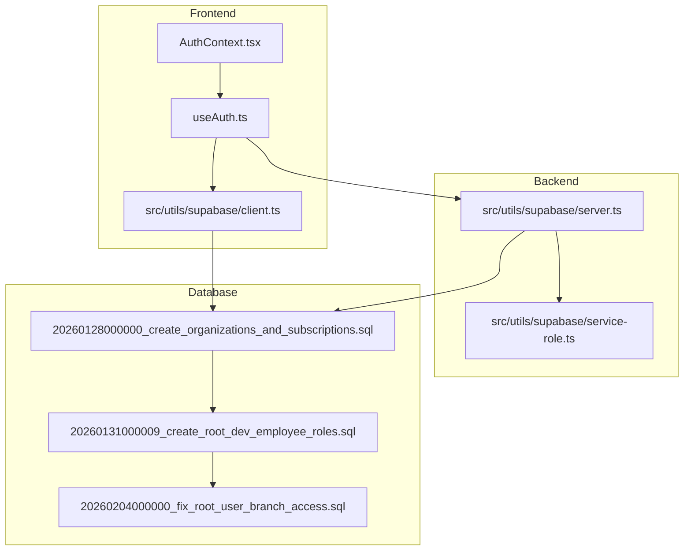
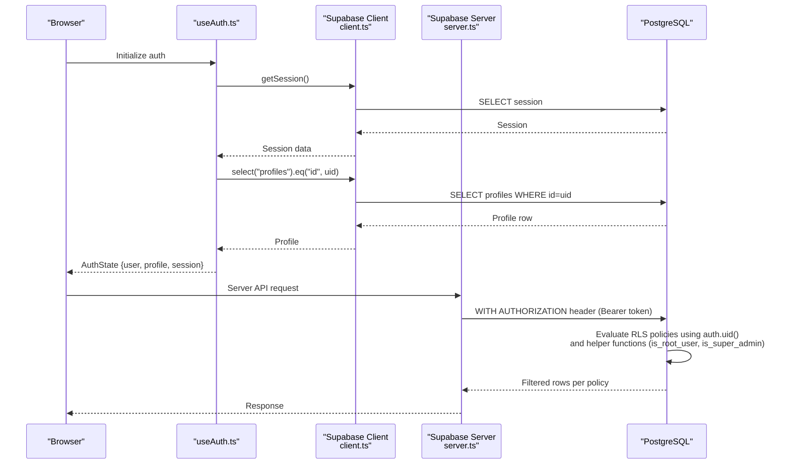
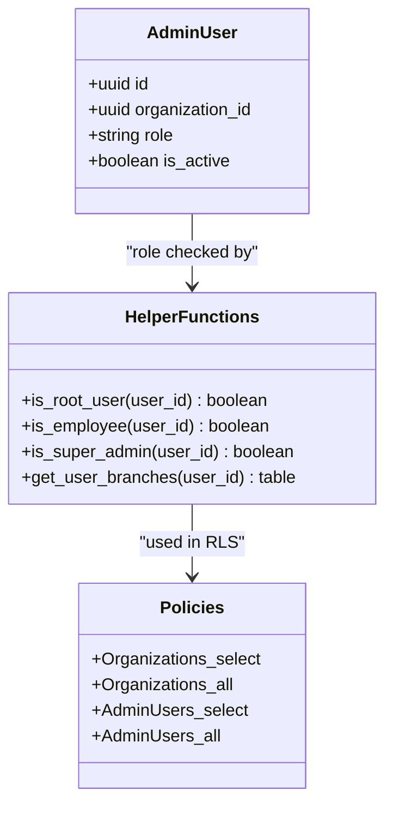
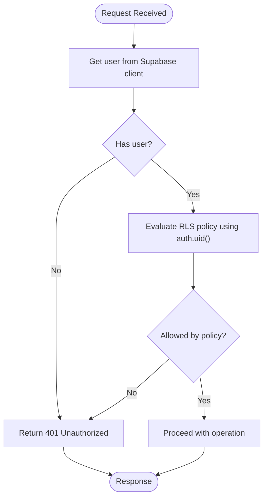
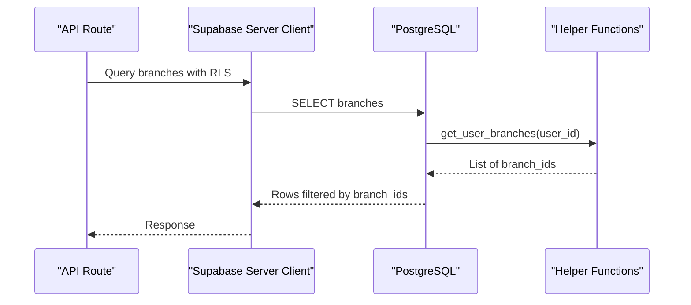
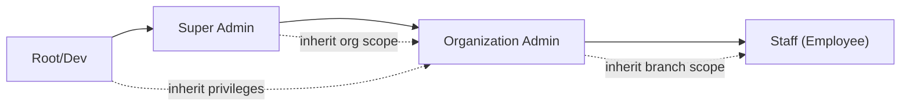
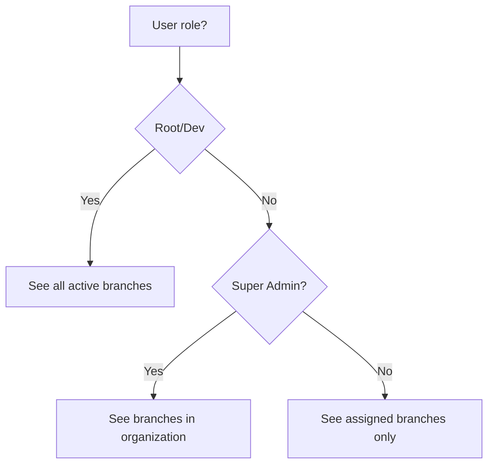
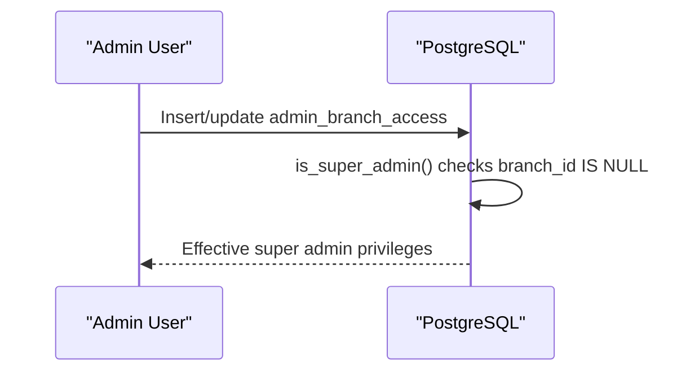
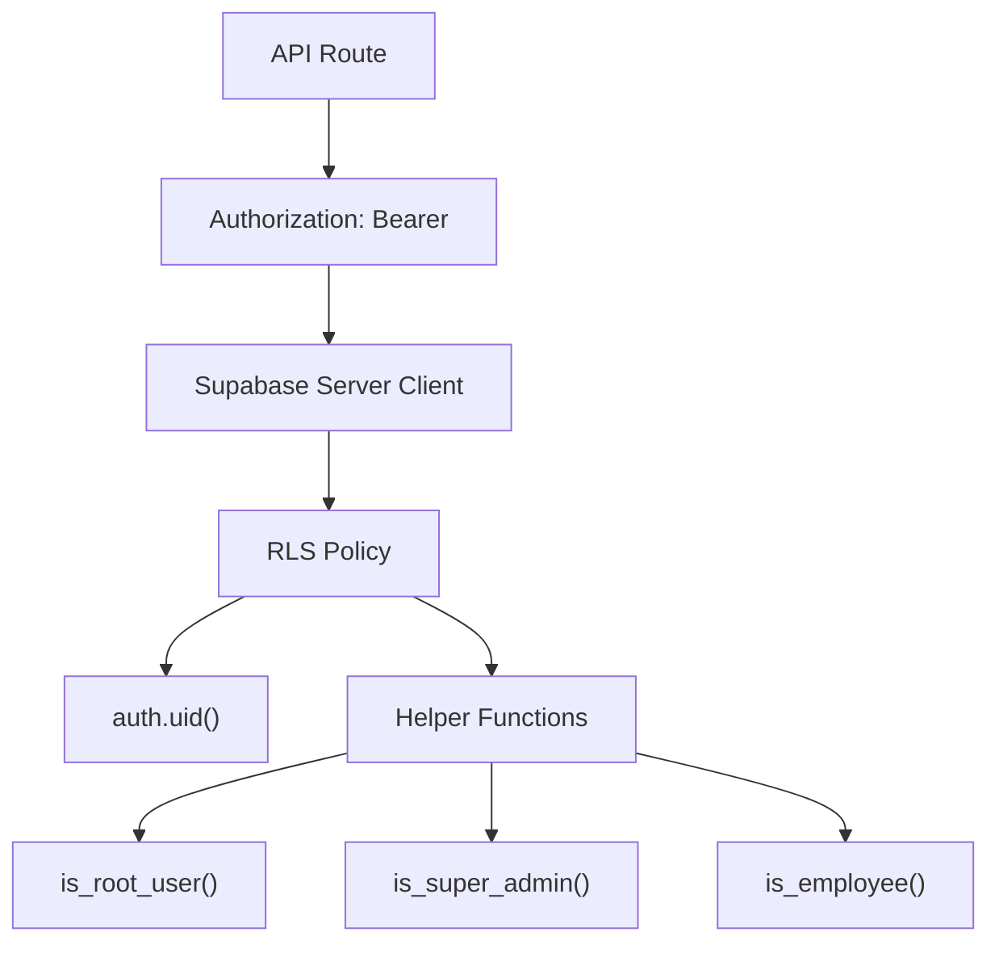
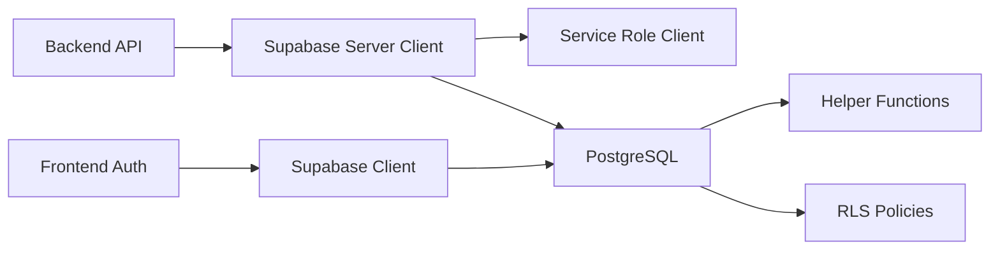

# Role-Based Access Control (RBAC)

<cite>
**Referenced Files in This Document**
- [AuthContext.tsx](file://src/contexts/AuthContext.tsx)
- [useAuth.ts](file://src/hooks/useAuth.ts)
- [client.ts](file://src/utils/supabase/client.ts)
- [server.ts](file://src/utils/supabase/server.ts)
- [service-role.ts](file://src/utils/supabase/service-role.ts)
- [database.ts](file://src/types/database.ts)
- [20260128000000_create_organizations_and_subscriptions.sql](file://supabase/migrations/20260128000000_create_organizations_and_subscriptions.sql)
- [20260131000009_create_root_dev_employee_roles.sql](file://supabase/migrations/20260131000009_create_root_dev_employee_roles.sql)
- [20260204000000_fix_root_user_branch_access.sql](file://supabase/migrations/20260204000000_fix_root_user_branch_access.sql)
</cite>

## Table of Contents

1. [Introduction](#introduction)
2. [Project Structure](#project-structure)
3. [Core Components](#core-components)
4. [Architecture Overview](#architecture-overview)
5. [Detailed Component Analysis](#detailed-component-analysis)
6. [Dependency Analysis](#dependency-analysis)
7. [Performance Considerations](#performance-considerations)
8. [Troubleshooting Guide](#troubleshooting-guide)
9. [Conclusion](#conclusion)
10. [Appendices](#appendices)

## Introduction

This document explains the Role-Based Access Control (RBAC) system in Opttius. It covers the hierarchical permission model including super admin, organization admin, branch manager, and staff roles, along with the implementation patterns for permission checking, dynamic access control based on user roles and organization membership, and integration with Supabase Row Level Security (RLS). It also documents permission inheritance, cross-branch access controls, temporary role assignments, and practical examples for UI rendering, API protection, and data access restrictions. Finally, it addresses common RBAC challenges such as preventing permission escalation, audit logging, and role assignment workflows, and provides guidance for extending the role system.

## Project Structure

RBAC spans three primary areas:

- Authentication and session management in the frontend via Supabase client and React hooks
- Backend Supabase clients for server-side operations and RLS enforcement
- Supabase database migrations defining roles, policies, and helper functions

**Diagram sources**

- [AuthContext.tsx](file://src/contexts/AuthContext.tsx#L1-L71)
- [useAuth.ts](file://src/hooks/useAuth.ts#L1-L377)
- [client.ts](file://src/utils/supabase/client.ts#L1-L8)
- [server.ts](file://src/utils/supabase/server.ts#L1-L110)
- [service-role.ts](file://src/utils/supabase/service-role.ts#L1-L12)
- [20260128000000_create_organizations_and_subscriptions.sql](file://supabase/migrations/20260128000000_create_organizations_and_subscriptions.sql#L1-L287)
- [20260131000009_create_root_dev_employee_roles.sql](file://supabase/migrations/20260131000009_create_root_dev_employee_roles.sql#L1-L158)
- [20260204000000_fix_root_user_branch_access.sql](file://supabase/migrations/20260204000000_fix_root_user_branch_access.sql#L1-L90)

**Section sources**

- [AuthContext.tsx](file://src/contexts/AuthContext.tsx#L1-L71)
- [useAuth.ts](file://src/hooks/useAuth.ts#L1-L377)
- [client.ts](file://src/utils/supabase/client.ts#L1-L8)
- [server.ts](file://src/utils/supabase/server.ts#L1-L110)
- [service-role.ts](file://src/utils/supabase/service-role.ts#L1-L12)
- [20260128000000_create_organizations_and_subscriptions.sql](file://supabase/migrations/20260128000000_create_organizations_and_subscriptions.sql#L1-L287)
- [20260131000009_create_root_dev_employee_roles.sql](file://supabase/migrations/20260131000009_create_root_dev_employee_roles.sql#L1-L158)
- [20260204000000_fix_root_user_branch_access.sql](file://supabase/migrations/20260204000000_fix_root_user_branch_access.sql#L1-L90)

## Core Components

- Frontend authentication and profile retrieval powered by Supabase client and React hooks
- Backend Supabase clients for RLS-aware queries and service-role client for privileged operations
- Supabase RLS policies and helper functions defining roles and access scopes

Key implementation patterns:

- Centralized auth state management with typed profile access
- Supabase client creation for browser and server environments
- Service role client for admin-only operations bypassing RLS
- Database-level policies enforcing tenant isolation and role-based access

**Section sources**

- [AuthContext.tsx](file://src/contexts/AuthContext.tsx#L1-L71)
- [useAuth.ts](file://src/hooks/useAuth.ts#L1-L377)
- [client.ts](file://src/utils/supabase/client.ts#L1-L8)
- [server.ts](file://src/utils/supabase/server.ts#L1-L110)
- [service-role.ts](file://src/utils/supabase/service-role.ts#L1-L12)
- [database.ts](file://src/types/database.ts#L1-L271)

## Architecture Overview

The RBAC architecture integrates frontend auth, backend RLS, and database policies. Roles are enforced at the database level with helper functions and policies, while the frontend consumes user context and enforces UI-level access.

**Diagram sources**

- [useAuth.ts](file://src/hooks/useAuth.ts#L1-L377)
- [client.ts](file://src/utils/supabase/client.ts#L1-L8)
- [server.ts](file://src/utils/supabase/server.ts#L43-L92)
- [20260131000009_create_root_dev_employee_roles.sql](file://supabase/migrations/20260131000009_create_root_dev_employee_roles.sql#L30-L66)
- [20260204000000_fix_root_user_branch_access.sql](file://supabase/migrations/20260204000000_fix_root_user_branch_access.sql#L67-L89)

## Detailed Component Analysis

### Role Model and Hierarchical Permissions

Opttius defines a multi-tier role hierarchy:

- Root/Dev: Full SaaS management access across tenants and organizations
- Super Admin: Full access within their organization
- Organization Admin: Branch-level access within their organization
- Staff (Employee): Operational access without administrative permissions

These roles are enforced via:

- Database constraints on admin user roles
- Helper functions to detect role types
- RLS policies on sensitive tables
- Cross-branch visibility adjustments for root/dev and super admin

**Diagram sources**

- [20260131000009_create_root_dev_employee_roles.sql](file://supabase/migrations/20260131000009_create_root_dev_employee_roles.sql#L19-L28)
- [20260131000009_create_root_dev_employee_roles.sql](file://supabase/migrations/20260131000009_create_root_dev_employee_roles.sql#L30-L66)
- [20260128000000_create_organizations_and_subscriptions.sql](file://supabase/migrations/20260128000000_create_organizations_and_subscriptions.sql#L93-L208)
- [20260204000000_fix_root_user_branch_access.sql](file://supabase/migrations/20260204000000_fix_root_user_branch_access.sql#L67-L89)

**Section sources**

- [20260131000009_create_root_dev_employee_roles.sql](file://supabase/migrations/20260131000009_create_root_dev_employee_roles.sql#L19-L28)
- [20260131000009_create_root_dev_employee_roles.sql](file://supabase/migrations/20260131000009_create_root_dev_employee_roles.sql#L30-L66)
- [20260128000000_create_organizations_and_subscriptions.sql](file://supabase/migrations/20260128000000_create_organizations_and_subscriptions.sql#L93-L208)
- [20260204000000_fix_root_user_branch_access.sql](file://supabase/migrations/20260204000000_fix_root_user_branch_access.sql#L67-L89)

### Permission Checking Mechanisms

- Frontend: Auth state exposes user and profile; UI components can gate rendering based on role presence
- Backend: Supabase server client supports Bearer token authentication for API routes; RLS policies evaluate auth.uid() and helper functions
- Service role: Dedicated client bypasses RLS for privileged administrative tasks

**Diagram sources**

- [server.ts](file://src/utils/supabase/server.ts#L43-L92)
- [20260128000000_create_organizations_and_subscriptions.sql](file://supabase/migrations/20260128000000_create_organizations_and_subscriptions.sql#L93-L208)

**Section sources**

- [server.ts](file://src/utils/supabase/server.ts#L43-L92)
- [20260128000000_create_organizations_and_subscriptions.sql](file://supabase/migrations/20260128000000_create_organizations_and_subscriptions.sql#L93-L208)

### Dynamic Access Control Based on Roles and Organization Membership

- Organizations and subscriptions enforce RLS policies that allow users to view only their organization or super admins to manage all
- Root/Dev users bypass organization filters and gain full visibility across tenants
- Branch-level visibility is handled by a helper function that returns all branches for root/dev and super admin, and assigned branches for regular users

**Diagram sources**

- [20260204000000_fix_root_user_branch_access.sql](file://supabase/migrations/20260204000000_fix_root_user_branch_access.sql#L9-L65)
- [20260128000000_create_organizations_and_subscriptions.sql](file://supabase/migrations/20260128000000_create_organizations_and_subscriptions.sql#L93-L208)

**Section sources**

- [20260204000000_fix_root_user_branch_access.sql](file://supabase/migrations/20260204000000_fix_root_user_branch_access.sql#L9-L65)
- [20260128000000_create_organizations_and_subscriptions.sql](file://supabase/migrations/20260128000000_create_organizations_and_subscriptions.sql#L93-L208)

### Permission Inheritance Patterns

- Root/Dev inherit super admin-like privileges for branch visibility and organization access
- Super admin inherits organization-level access and can manage organization resources
- Regular admin/employee inherit branch-level or operational access respectively

**Diagram sources**

- [20260131000009_create_root_dev_employee_roles.sql](file://supabase/migrations/20260131000009_create_root_dev_employee_roles.sql#L67-L91)
- [20260204000000_fix_root_user_branch_access.sql](file://supabase/migrations/20260204000000_fix_root_user_branch_access.sql#L67-L89)

**Section sources**

- [20260131000009_create_root_dev_employee_roles.sql](file://supabase/migrations/20260131000009_create_root_dev_employee_roles.sql#L67-L91)
- [20260204000000_fix_root_user_branch_access.sql](file://supabase/migrations/20260204000000_fix_root_user_branch_access.sql#L67-L89)

### Cross-Branch Access Controls

- Root/Dev users see all active branches regardless of organization
- Super admin sees branches within their organization
- Regular users see only assigned branches

**Diagram sources**

- [20260204000000_fix_root_user_branch_access.sql](file://supabase/migrations/20260204000000_fix_root_user_branch_access.sql#L30-L61)

**Section sources**

- [20260204000000_fix_root_user_branch_access.sql](file://supabase/migrations/20260204000000_fix_root_user_branch_access.sql#L30-L61)

### Temporary Role Assignments

- The system supports temporary assignments via admin branch access records and helper functions
- Super admin detection considers records with null branch_id as global super admin privileges

**Diagram sources**

- [20260204000000_fix_root_user_branch_access.sql](file://supabase/migrations/20260204000000_fix_root_user_branch_access.sql#L76-L86)

**Section sources**

- [20260204000000_fix_root_user_branch_access.sql](file://supabase/migrations/20260204000000_fix_root_user_branch_access.sql#L76-L86)

### Integration with Supabase RLS Policies and Custom Claims

- RLS policies use auth.uid() and helper functions to enforce access
- Bearer token support enables API routes to authenticate with service accounts or test harnesses
- Service role client bypasses RLS for privileged operations

**Diagram sources**

- [20260131000009_create_root_dev_employee_roles.sql](file://supabase/migrations/20260131000009_create_root_dev_employee_roles.sql#L30-L66)
- [server.ts](file://src/utils/supabase/server.ts#L54-L91)
- [service-role.ts](file://src/utils/supabase/service-role.ts#L1-L12)

**Section sources**

- [20260131000009_create_root_dev_employee_roles.sql](file://supabase/migrations/20260131000009_create_root_dev_employee_roles.sql#L30-L66)
- [server.ts](file://src/utils/supabase/server.ts#L54-L91)
- [service-role.ts](file://src/utils/supabase/service-role.ts#L1-L12)

### Practical Examples

#### Role-Based UI Rendering

- Gate UI elements based on role presence in auth state
- Example pattern: Render admin-only buttons when user has elevated role

**Section sources**

- [AuthContext.tsx](file://src/contexts/AuthContext.tsx#L38-L71)
- [useAuth.ts](file://src/hooks/useAuth.ts#L18-L377)

#### API Endpoint Protection

- Use server client with Bearer token to authenticate API requests
- Enforce RLS policies server-side; return filtered results

**Section sources**

- [server.ts](file://src/utils/supabase/server.ts#L43-L92)
- [20260128000000_create_organizations_and_subscriptions.sql](file://supabase/migrations/20260128000000_create_organizations_and_subscriptions.sql#L93-L208)

#### Data Access Restrictions

- Organizations and subscriptions tables enable RLS and define policies for viewing and managing data
- Root/Dev users bypass organization filters

**Section sources**

- [20260128000000_create_organizations_and_subscriptions.sql](file://supabase/migrations/20260128000000_create_organizations_and_subscriptions.sql#L88-L208)

### Extending the Role System

- Add new roles by updating admin user role constraints and helper functions
- Define RLS policies for new tables following the established pattern
- Introduce temporary role assignments via branch access records

**Section sources**

- [20260131000009_create_root_dev_employee_roles.sql](file://supabase/migrations/20260131000009_create_root_dev_employee_roles.sql#L19-L28)
- [20260131000009_create_root_dev_employee_roles.sql](file://supabase/migrations/20260131000009_create_root_dev_employee_roles.sql#L124-L141)

## Dependency Analysis

- Frontend depends on Supabase client for auth and profile retrieval
- Backend depends on Supabase server client for RLS-aware queries and Bearer token support
- Database depends on helper functions and policies for role enforcement
- Service role client is a dedicated dependency for privileged operations

**Diagram sources**

- [client.ts](file://src/utils/supabase/client.ts#L1-L8)
- [server.ts](file://src/utils/supabase/server.ts#L1-L110)
- [service-role.ts](file://src/utils/supabase/service-role.ts#L1-L12)
- [20260131000009_create_root_dev_employee_roles.sql](file://supabase/migrations/20260131000009_create_root_dev_employee_roles.sql#L30-L66)
- [20260128000000_create_organizations_and_subscriptions.sql](file://supabase/migrations/20260128000000_create_organizations_and_subscriptions.sql#L93-L208)

**Section sources**

- [client.ts](file://src/utils/supabase/client.ts#L1-L8)
- [server.ts](file://src/utils/supabase/server.ts#L1-L110)
- [service-role.ts](file://src/utils/supabase/service-role.ts#L1-L12)
- [20260131000009_create_root_dev_employee_roles.sql](file://supabase/migrations/20260131000009_create_root_dev_employee_roles.sql#L30-L66)
- [20260128000000_create_organizations_and_subscriptions.sql](file://supabase/migrations/20260128000000_create_organizations_and_subscriptions.sql#L93-L208)

## Performance Considerations

- Auth initialization includes timeouts to avoid indefinite loading
- Profile fetch uses timeouts and graceful error handling for slow connections
- RLS evaluation occurs server-side; keep policies efficient and indexed

[No sources needed since this section provides general guidance]

## Troubleshooting Guide

Common issues and resolutions:

- Auth initialization timeout: Adjust timeout thresholds and handle errors gracefully
- Profile fetch timeout: Expect timeouts for new users; continue without profile data
- RLS policy violations: Verify user role and organization membership; ensure helper functions are defined
- Bearer token authentication: Confirm Authorization header format and token validity

**Section sources**

- [useAuth.ts](file://src/hooks/useAuth.ts#L27-L91)
- [useAuth.ts](file://src/hooks/useAuth.ts#L132-L192)
- [server.ts](file://src/utils/supabase/server.ts#L54-L91)

## Conclusion

Opttius implements a robust RBAC system combining frontend auth state, backend Supabase clients, and database-level RLS policies. The multi-tier role hierarchy supports SaaS-scale management with tenant isolation, while helper functions and policies enforce dynamic access control across organizations and branches. The architecture provides clear extension points for adding roles and policies, and includes mechanisms for privileged operations via service role clients.

[No sources needed since this section summarizes without analyzing specific files]

## Appendices

### Appendix A: Role Assignment Workflows

- Create or update admin user records with appropriate roles
- Assign branch access for organization admins and branch managers
- Use helper functions to verify effective privileges

**Section sources**

- [20260131000009_create_root_dev_employee_roles.sql](file://supabase/migrations/20260131000009_create_root_dev_employee_roles.sql#L19-L28)
- [20260204000000_fix_root_user_branch_access.sql](file://supabase/migrations/20260204000000_fix_root_user_branch_access.sql#L47-L61)

### Appendix B: Audit Logging Guidance

- Track role changes and access events at the application level
- Monitor RLS policy decisions via database logs
- Maintain audit trails for privileged actions performed with service role client

[No sources needed since this section provides general guidance]
