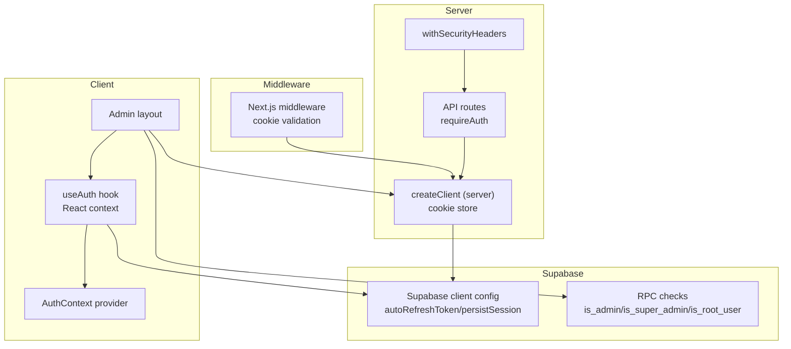
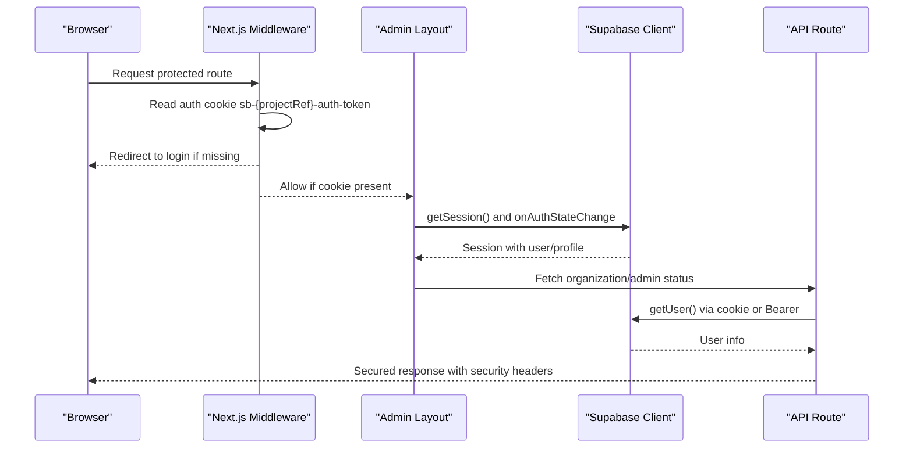
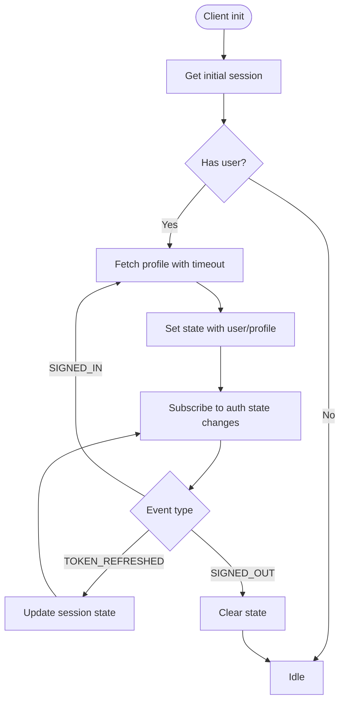
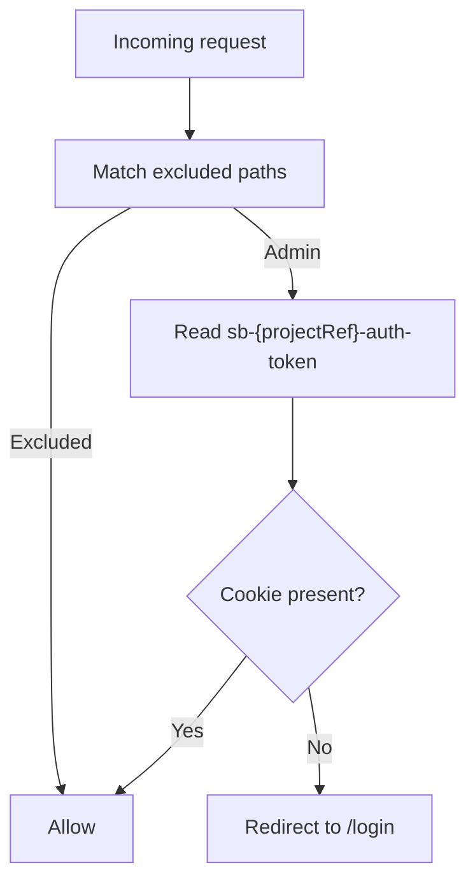
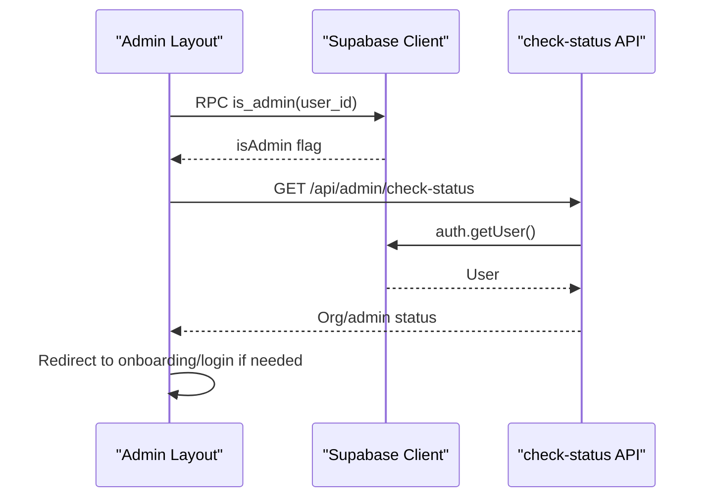
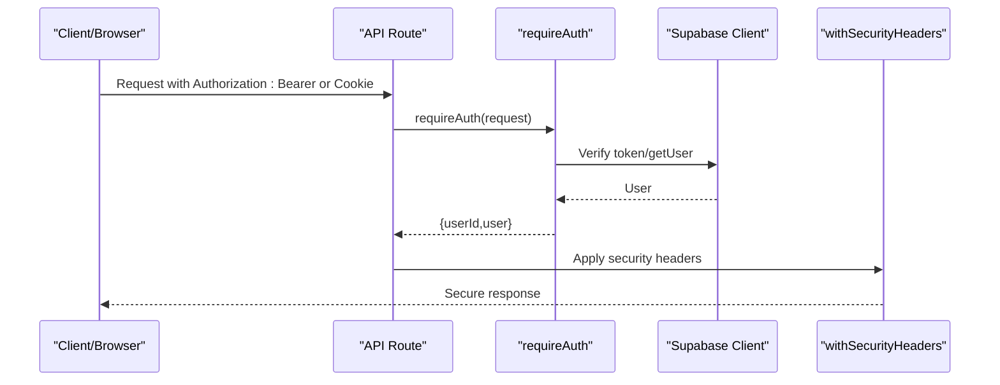
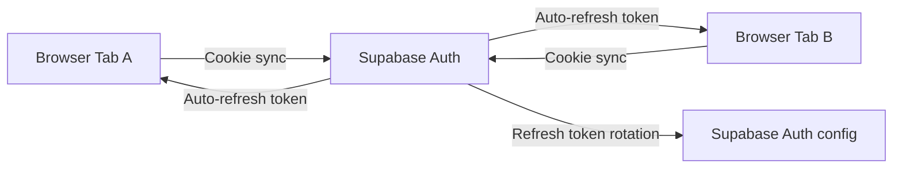
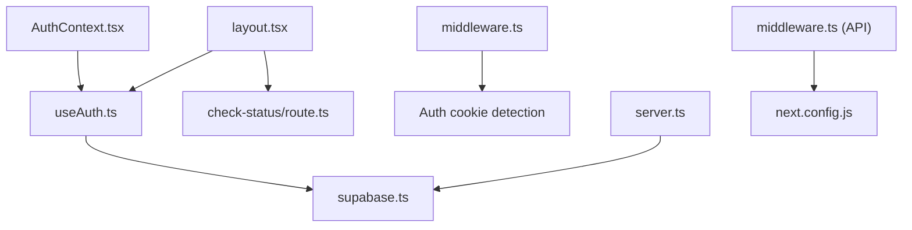
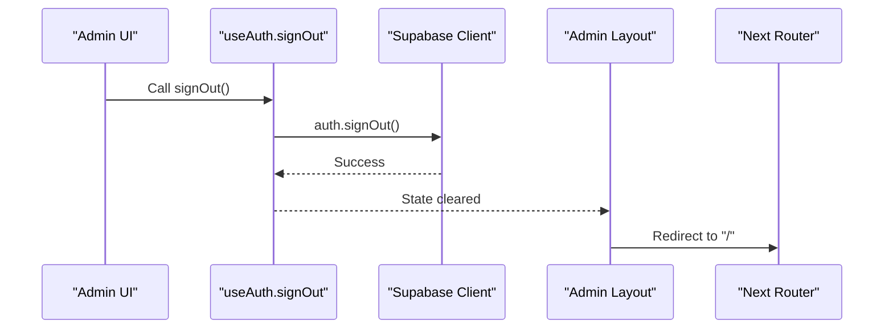

# Session Management & Security

<cite>
**Referenced Files in This Document**
- [middleware.ts](file://src/middleware.ts)
- [AuthContext.tsx](file://src/contexts/AuthContext.tsx)
- [useAuth.ts](file://src/hooks/useAuth.ts)
- [supabase.ts](file://src/lib/supabase.ts)
- [client.ts](file://src/utils/supabase/client.ts)
- [server.ts](file://src/utils/supabase/server.ts)
- [layout.tsx](file://src/app/admin/layout.tsx)
- [check-status/route.ts](file://src/app/api/admin/check-status/route.ts)
- [middleware.ts (API)](file://src/lib/api/middleware.ts)
- [test-headers/route.ts](file://src/app/api/test-headers/route.ts)
- [next.config.js](file://next.config.js)
- [config.toml](file://supabase/config.toml)
- [test-setup.ts](file://src/__tests__/integration/helpers/test-setup.ts)
</cite>

## Table of Contents

1. [Introduction](#introduction)
2. [Project Structure](#project-structure)
3. [Core Components](#core-components)
4. [Architecture Overview](#architecture-overview)
5. [Detailed Component Analysis](#detailed-component-analysis)
6. [Dependency Analysis](#dependency-analysis)
7. [Performance Considerations](#performance-considerations)
8. [Troubleshooting Guide](#troubleshooting-guide)
9. [Conclusion](#conclusion)
10. [Appendices](#appendices)

## Introduction

This document explains session management and security measures in Opttius, focusing on:

- Session lifecycle and JWT handling
- Automatic session renewal and token refresh
- Middleware-based route protection and authentication guards
- Unauthorized access handling
- Supabase Auth integration for session persistence, cross-tab synchronization, and device management
- Security best practices (CSRF/XSS/session fixation) and secure cookie configuration
- Practical examples for custom session validation, concurrent sessions, and graceful expiration

## Project Structure

Opttius organizes session and security logic across client hooks, server utilities, middleware, and API endpoints:

- Client-side session state and authentication actions are managed in a React context and hook
- Supabase client configuration enables auto-refresh and persistent sessions
- Middleware validates presence of Supabase auth cookies for protected routes
- Admin layout performs admin role checks and organization gating
- API endpoints provide authenticated access and enforce security headers
- Next.js configuration applies robust security headers globally

**Diagram sources**

- [useAuth.ts](file://src/hooks/useAuth.ts#L1-L377)
- [AuthContext.tsx](file://src/contexts/AuthContext.tsx#L1-L71)
- [layout.tsx](file://src/app/admin/layout.tsx#L1-L800)
- [middleware.ts](file://src/middleware.ts#L1-L109)
- [server.ts](file://src/utils/supabase/server.ts#L1-L110)
- [middleware.ts (API)](file://src/lib/api/middleware.ts#L173-L360)
- [supabase.ts](file://src/lib/supabase.ts#L1-L36)
- [check-status/route.ts](file://src/app/api/admin/check-status/route.ts#L1-L164)

**Section sources**

- [useAuth.ts](file://src/hooks/useAuth.ts#L1-L377)
- [AuthContext.tsx](file://src/contexts/AuthContext.tsx#L1-L71)
- [layout.tsx](file://src/app/admin/layout.tsx#L1-L800)
- [middleware.ts](file://src/middleware.ts#L1-L109)
- [server.ts](file://src/utils/supabase/server.ts#L1-L110)
- [supabase.ts](file://src/lib/supabase.ts#L1-L36)
- [check-status/route.ts](file://src/app/api/admin/check-status/route.ts#L1-L164)
- [middleware.ts (API)](file://src/lib/api/middleware.ts#L173-L360)
- [next.config.js](file://next.config.js#L110-L161)

## Core Components

- Supabase client configuration with auto-refresh and persisted sessions
- Client-side authentication state management via React context and hook
- Middleware enforcing cookie-based authentication for protected routes
- Admin layout performing admin role and organization checks
- API authentication guard and security headers middleware
- Global security headers applied via Next.js configuration

Key implementation references:

- Supabase client initialization and session behavior
  - [supabase.ts](file://src/lib/supabase.ts#L11-L17)
  - [client.ts](file://src/utils/supabase/client.ts#L1-L8)
- Client authentication state and token refresh handling
  - [useAuth.ts](file://src/hooks/useAuth.ts#L96-L123)
- Middleware cookie validation and redirection
  - [middleware.ts](file://src/middleware.ts#L42-L94)
- Admin layout role and organization gating
  - [layout.tsx](file://src/app/admin/layout.tsx#L251-L429)
- API authentication guard and security headers
  - [middleware.ts (API)](file://src/lib/api/middleware.ts#L173-L360)
  - [test-headers/route.ts](file://src/app/api/test-headers/route.ts#L1-L34)
- Global security headers
  - [next.config.js](file://next.config.js#L110-L161)

**Section sources**

- [supabase.ts](file://src/lib/supabase.ts#L11-L17)
- [client.ts](file://src/utils/supabase/client.ts#L1-L8)
- [useAuth.ts](file://src/hooks/useAuth.ts#L96-L123)
- [middleware.ts](file://src/middleware.ts#L42-L94)
- [layout.tsx](file://src/app/admin/layout.tsx#L251-L429)
- [middleware.ts (API)](file://src/lib/api/middleware.ts#L173-L360)
- [test-headers/route.ts](file://src/app/api/test-headers/route.ts#L1-L34)
- [next.config.js](file://next.config.js#L110-L161)

## Architecture Overview

The session lifecycle spans client initialization, middleware enforcement, admin validation, and API access with security headers.

**Diagram sources**

- [middleware.ts](file://src/middleware.ts#L42-L94)
- [layout.tsx](file://src/app/admin/layout.tsx#L251-L429)
- [server.ts](file://src/utils/supabase/server.ts#L43-L92)
- [check-status/route.ts](file://src/app/api/admin/check-status/route.ts#L18-L33)
- [middleware.ts (API)](file://src/lib/api/middleware.ts#L173-L184)
- [next.config.js](file://next.config.js#L110-L161)

## Detailed Component Analysis

### Session Lifecycle and JWT Handling

- Initialization: The client initializes Supabase with auto-refresh and persisted sessions, then fetches the current session and subscribes to auth state changes.
- Token refresh: On TOKEN_REFRESHED events, the client updates session state with the new session data.
- Graceful fallbacks: Profile fetch timeouts and missing profiles are handled without blocking the UI.

**Diagram sources**

- [useAuth.ts](file://src/hooks/useAuth.ts#L27-L123)
- [supabase.ts](file://src/lib/supabase.ts#L11-L17)

**Section sources**

- [useAuth.ts](file://src/hooks/useAuth.ts#L27-L123)
- [supabase.ts](file://src/lib/supabase.ts#L11-L17)

### Middleware-Based Route Protection

- The middleware checks for the Supabase auth cookie and redirects unauthenticated users to the login page.
- It excludes public routes (login, signup, API, static assets) and allows root path access.
- For admin routes, it logs cookie presence and defers organization checks to the admin layout.

**Diagram sources**

- [middleware.ts](file://src/middleware.ts#L14-L94)

**Section sources**

- [middleware.ts](file://src/middleware.ts#L14-L94)

### Admin Role and Organization Gating

- The admin layout performs:
  - Admin role verification via RPC
  - Organization assignment and onboarding gating
  - Concurrent session and redirect safeguards
- It avoids redundant checks by tracking the last checked user ID and uses timeouts to prevent UI stalls.

**Diagram sources**

- [layout.tsx](file://src/app/admin/layout.tsx#L501-L732)
- [check-status/route.ts](file://src/app/api/admin/check-status/route.ts#L18-L152)

**Section sources**

- [layout.tsx](file://src/app/admin/layout.tsx#L501-L732)
- [check-status/route.ts](file://src/app/api/admin/check-status/route.ts#L18-L152)

### API Authentication Guards and Security Headers

- API routes can require Bearer tokens for programmatic access and fall back to cookie-based auth for browser requests.
- A reusable middleware applies comprehensive security headers to API responses.
- Next.js configuration adds global security headers to all responses.

**Diagram sources**

- [server.ts](file://src/utils/supabase/server.ts#L43-L92)
- [middleware.ts (API)](file://src/lib/api/middleware.ts#L173-L360)
- [test-headers/route.ts](file://src/app/api/test-headers/route.ts#L1-L34)
- [next.config.js](file://next.config.js#L110-L161)

**Section sources**

- [server.ts](file://src/utils/supabase/server.ts#L43-L92)
- [middleware.ts (API)](file://src/lib/api/middleware.ts#L173-L360)
- [test-headers/route.ts](file://src/app/api/test-headers/route.ts#L1-L34)
- [next.config.js](file://next.config.js#L110-L161)

### Supabase Auth Integration: Session Persistence, Cross-Tab Sync, Device Management

- Supabase client configuration enables auto-refresh and persistent sessions, enabling cross-tab synchronization and device continuity.
- Tests demonstrate constructing the Supabase SSR cookie format for integration testing.
- Supabase Auth server configuration includes rate limits and refresh token rotation settings.

**Diagram sources**

- [supabase.ts](file://src/lib/supabase.ts#L11-L17)
- [test-setup.ts](file://src/__tests__/integration/helpers/test-setup.ts#L504-L536)
- [config.toml](file://supabase/config.toml#L140-L166)

**Section sources**

- [supabase.ts](file://src/lib/supabase.ts#L11-L17)
- [test-setup.ts](file://src/__tests__/integration/helpers/test-setup.ts#L504-L536)
- [config.toml](file://supabase/config.toml#L140-L166)

### Security Best Practices and Mitigations

- CSRF protection: Use anti-CSRF tokens for state-changing forms and rely on SameSite cookies via Supabase configuration.
- XSS prevention: Apply strict Content-Security-Policy, disable unsafe-inline where possible, and sanitize user-generated content.
- Session fixation: Supabase’s refresh token rotation and auto-refresh mitigate session fixation risks.
- Secure cookie configuration: Configure domain/path/same-site attributes and secure flags via Supabase Auth settings.

Practical references:

- Security headers applied globally and per-route
  - [next.config.js](file://next.config.js#L110-L161)
  - [middleware.ts (API)](file://src/lib/api/middleware.ts#L302-L360)
- Supabase Auth security settings
  - [config.toml](file://supabase/config.toml#L140-L166)

**Section sources**

- [next.config.js](file://next.config.js#L110-L161)
- [middleware.ts (API)](file://src/lib/api/middleware.ts#L302-L360)
- [config.toml](file://supabase/config.toml#L140-L166)

### Practical Examples

#### Session Validation

- Client-side validation using the hook and context:
  - [useAuth.ts](file://src/hooks/useAuth.ts#L27-L123)
  - [AuthContext.tsx](file://src/contexts/AuthContext.tsx#L28-L71)

#### Token Refresh Strategies

- Auto-refresh and persisted sessions:
  - [supabase.ts](file://src/lib/supabase.ts#L11-L17)
- Handling refresh events:
  - [useAuth.ts](file://src/hooks/useAuth.ts#L116-L122)

#### Secure Logout Procedures

- Sign out and redirect to home:
  - [layout.tsx](file://src/app/admin/layout.tsx#L742-L746)
  - [useAuth.ts](file://src/hooks/useAuth.ts#L298-L310)

#### Custom Session Validation

- Require Bearer token in API routes:
  - [server.ts](file://src/utils/supabase/server.ts#L43-L92)
  - [middleware.ts (API)](file://src/lib/api/middleware.ts#L173-L184)

#### Concurrent Sessions and Graceful Expiration

- Admin layout safeguards against multiple simultaneous checks and redirects:
  - [layout.tsx](file://src/app/admin/layout.tsx#L234-L244)
  - [layout.tsx](file://src/app/admin/layout.tsx#L651-L732)

## Dependency Analysis

**Diagram sources**

- [useAuth.ts](file://src/hooks/useAuth.ts#L1-L377)
- [supabase.ts](file://src/lib/supabase.ts#L1-L36)
- [AuthContext.tsx](file://src/contexts/AuthContext.tsx#L1-L71)
- [layout.tsx](file://src/app/admin/layout.tsx#L1-L800)
- [check-status/route.ts](file://src/app/api/admin/check-status/route.ts#L1-L164)
- [middleware.ts](file://src/middleware.ts#L1-L109)
- [server.ts](file://src/utils/supabase/server.ts#L1-L110)
- [middleware.ts (API)](file://src/lib/api/middleware.ts#L173-L360)
- [next.config.js](file://next.config.js#L110-L161)

**Section sources**

- [useAuth.ts](file://src/hooks/useAuth.ts#L1-L377)
- [supabase.ts](file://src/lib/supabase.ts#L1-L36)
- [AuthContext.tsx](file://src/contexts/AuthContext.tsx#L1-L71)
- [layout.tsx](file://src/app/admin/layout.tsx#L1-L800)
- [check-status/route.ts](file://src/app/api/admin/check-status/route.ts#L1-L164)
- [middleware.ts](file://src/middleware.ts#L1-L109)
- [server.ts](file://src/utils/supabase/server.ts#L1-L110)
- [middleware.ts (API)](file://src/lib/api/middleware.ts#L173-L360)
- [next.config.js](file://next.config.js#L110-L161)

## Performance Considerations

- Minimize repeated admin checks by caching results per user ID and avoiding redundant RPC calls.
- Use timeouts for session and profile fetches to prevent UI stalls.
- Defer organization checks to the admin layout to reduce middleware overhead.

[No sources needed since this section provides general guidance]

## Troubleshooting Guide

- Authentication not recognized:
  - Verify Supabase auth cookie presence and format
  - Confirm Supabase client configuration for auto-refresh and persistence
  - References:
    - [middleware.ts](file://src/middleware.ts#L42-L94)
    - [supabase.ts](file://src/lib/supabase.ts#L11-L17)
- Redirect loops or stale state:
  - Check admin layout’s redirect safeguards and state tracking
  - References:
    - [layout.tsx](file://src/app/admin/layout.tsx#L651-L732)
- API authentication failures:
  - Ensure Authorization header format and token validity
  - References:
    - [server.ts](file://src/utils/supabase/server.ts#L43-L92)
    - [middleware.ts (API)](file://src/lib/api/middleware.ts#L173-L184)
- Security headers not applied:
  - Verify Next.js configuration and per-route middleware
  - References:
    - [next.config.js](file://next.config.js#L110-L161)
    - [middleware.ts (API)](file://src/lib/api/middleware.ts#L302-L360)

**Section sources**

- [middleware.ts](file://src/middleware.ts#L42-L94)
- [supabase.ts](file://src/lib/supabase.ts#L11-L17)
- [layout.tsx](file://src/app/admin/layout.tsx#L651-L732)
- [server.ts](file://src/utils/supabase/server.ts#L43-L92)
- [middleware.ts (API)](file://src/lib/api/middleware.ts#L173-L184)
- [next.config.js](file://next.config.js#L110-L161)

## Conclusion

Opttius implements a robust session and security model centered on Supabase Auth:

- Client-side state management with auto-refresh and persisted sessions
- Middleware and admin layout enforcement for route protection and role gating
- API authentication guards and comprehensive security headers
- Global security policies and Supabase Auth server configuration

These mechanisms collectively provide secure, resilient session handling with clear pathways for validation, renewal, and safe logout.

[No sources needed since this section summarizes without analyzing specific files]

## Appendices

### Example: Secure Logout Flow

**Diagram sources**

- [useAuth.ts](file://src/hooks/useAuth.ts#L298-L310)
- [layout.tsx](file://src/app/admin/layout.tsx#L742-L746)
