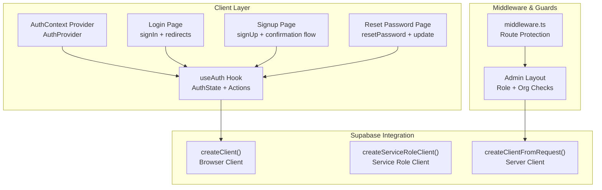
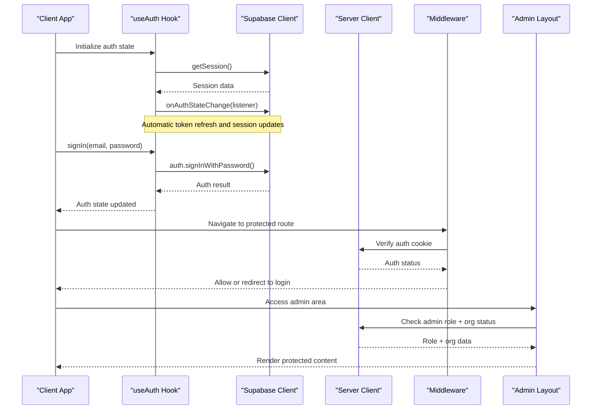
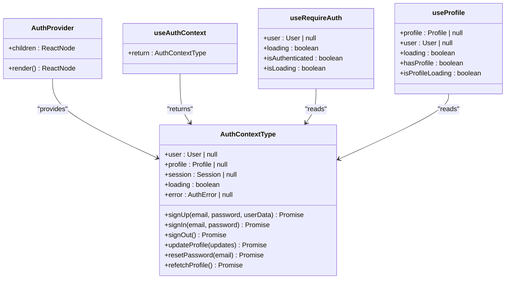
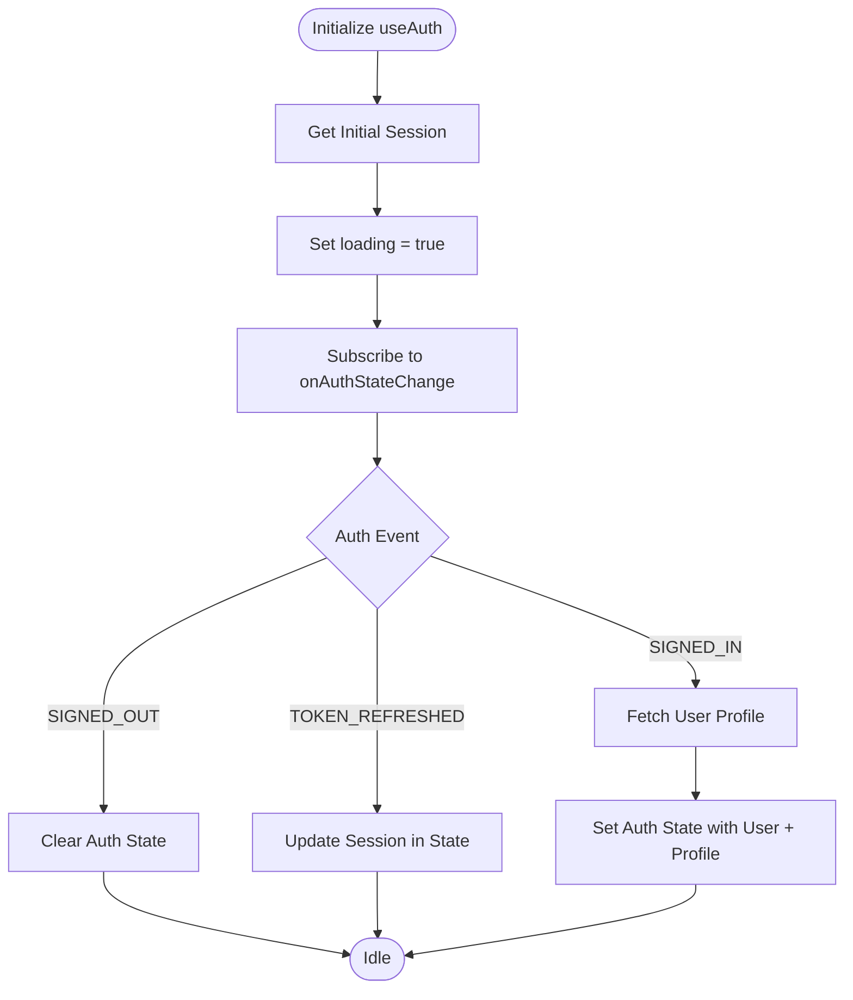
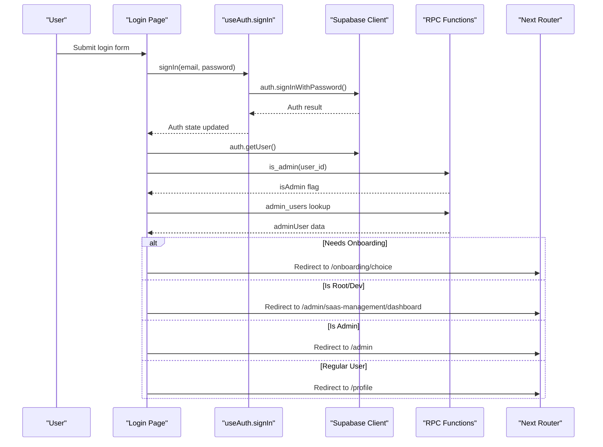
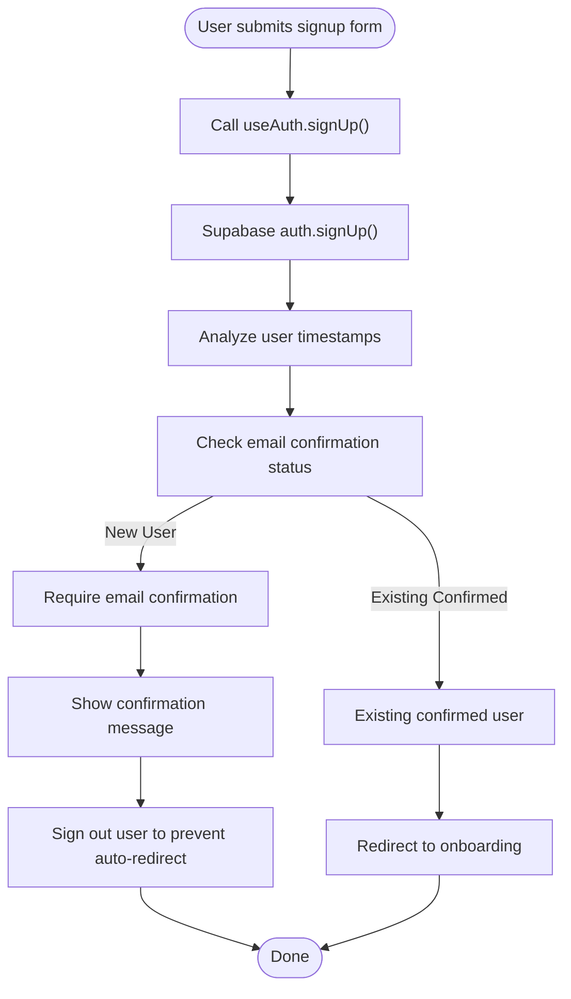
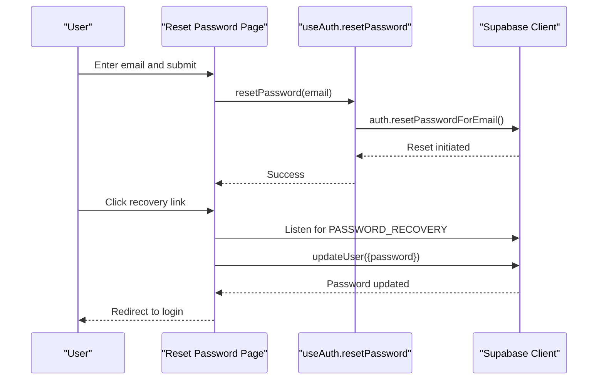
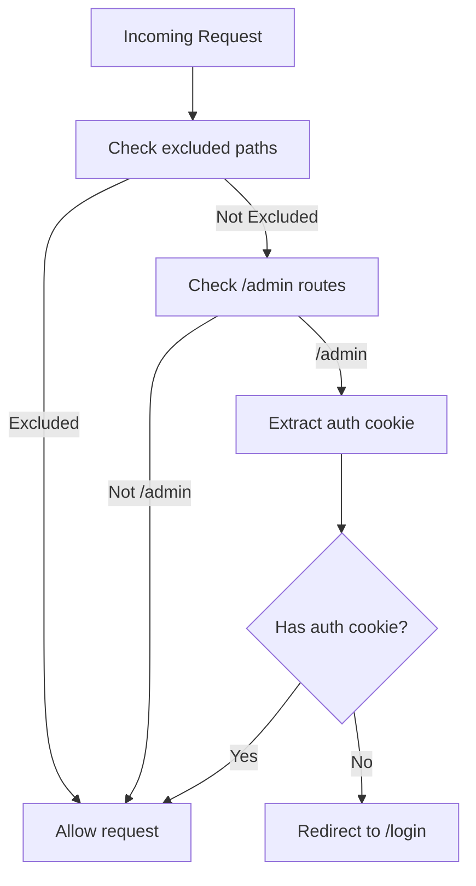
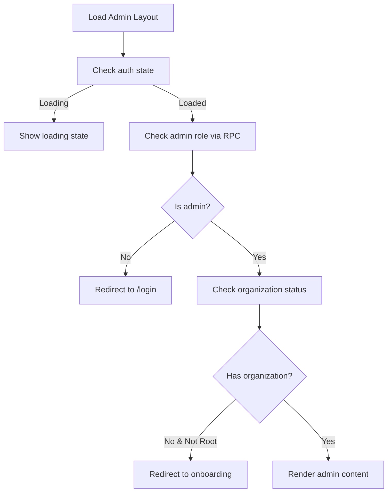
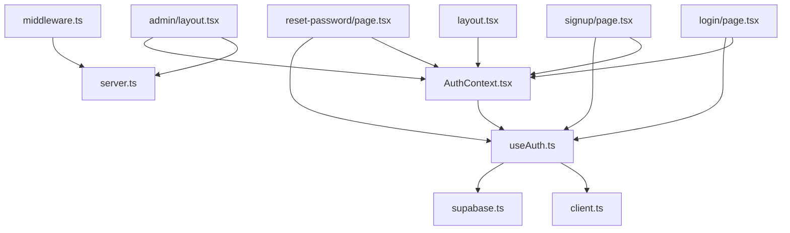

# User Authentication Flow

<cite>
**Referenced Files in This Document**
- [AuthContext.tsx](file://src/contexts/AuthContext.tsx)
- [useAuth.ts](file://src/hooks/useAuth.ts)
- [supabase.ts](file://src/lib/supabase.ts)
- [client.ts](file://src/utils/supabase/client.ts)
- [server.ts](file://src/utils/supabase/server.ts)
- [middleware.ts](file://src/middleware.ts)
- [login/page.tsx](file://src/app/login/page.tsx)
- [signup/page.tsx](file://src/app/signup/page.tsx)
- [reset-password/page.tsx](file://src/app/reset-password/page.tsx)
- [layout.tsx](file://src/app/layout.tsx)
- [admin/layout.tsx](file://src/app/admin/layout.tsx)
- [admin/page.tsx](file://src/app/admin/page.tsx)
</cite>

## Table of Contents

1. [Introduction](#introduction)
2. [Project Structure](#project-structure)
3. [Core Components](#core-components)
4. [Architecture Overview](#architecture-overview)
5. [Detailed Component Analysis](#detailed-component-analysis)
6. [Dependency Analysis](#dependency-analysis)
7. [Performance Considerations](#performance-considerations)
8. [Security Considerations](#security-considerations)
9. [Troubleshooting Guide](#troubleshooting-guide)
10. [Practical Implementation Examples](#practical-implementation-examples)
11. [Conclusion](#conclusion)

## Introduction

This document provides comprehensive documentation for the user authentication flow in Opttius, covering the complete lifecycle from login/signup to session management and password reset. It explains the AuthContext provider implementation, authentication state management, and user session handling, including integration with Supabase Auth for JWT token management, automatic session refresh, and secure cookie handling. The guide also covers authentication guards, redirect mechanisms, protected route handling, and security considerations such as CSRF protection, session timeout handling, and secure password storage. Practical examples demonstrate authentication usage across different scenarios, along with troubleshooting common authentication issues.

## Project Structure

Opttius implements authentication using a layered architecture:

- Supabase client utilities for browser and server environments
- A custom React context and hook for centralized authentication state
- Page-level authentication flows for login, signup, and password reset
- Middleware-based route protection for admin areas
- Admin layout with role-based access control and organization verification



**Diagram sources**

- [AuthContext.tsx](file://src/contexts/AuthContext.tsx#L28-L36)
- [useAuth.ts](file://src/hooks/useAuth.ts#L18-L376)
- [client.ts](file://src/utils/supabase/client.ts#L3-L8)
- [server.ts](file://src/utils/supabase/server.ts#L6-L33)
- [middleware.ts](file://src/middleware.ts#L14-L95)
- [admin/layout.tsx](file://src/app/admin/layout.tsx#L165-L800)

**Section sources**

- [AuthContext.tsx](file://src/contexts/AuthContext.tsx#L1-L71)
- [useAuth.ts](file://src/hooks/useAuth.ts#L1-L377)
- [client.ts](file://src/utils/supabase/client.ts#L1-L8)
- [server.ts](file://src/utils/supabase/server.ts#L1-L110)
- [middleware.ts](file://src/middleware.ts#L1-L109)
- [admin/layout.tsx](file://src/app/admin/layout.tsx#L1-L1200)

## Core Components

This section details the core authentication components and their responsibilities.

- AuthContext Provider
  - Wraps the application with authentication state and exposes convenient hooks for authentication actions and profile access.
  - Provides sign-up, sign-in, sign-out, profile updates, and password reset capabilities.

- useAuth Hook
  - Centralizes authentication state management with loading, error, user, profile, and session fields.
  - Implements Supabase auth listeners for automatic session refresh and state synchronization.
  - Handles profile fetching with timeouts and graceful error handling for missing profiles.

- Supabase Clients
  - Browser client creation for client-side operations with auto-refresh and persisted sessions.
  - Service role client for server-side operations bypassing Row Level Security.
  - Server client creation supporting cookie-based and Bearer token authentication for API routes.

- Middleware and Admin Guards
  - Route protection middleware checks for authentication cookies and redirects unauthenticated users to login.
  - Admin layout performs role and organization verification, with safeguards against race conditions and redundant checks.

**Section sources**

- [AuthContext.tsx](file://src/contexts/AuthContext.tsx#L28-L71)
- [useAuth.ts](file://src/hooks/useAuth.ts#L18-L376)
- [supabase.ts](file://src/lib/supabase.ts#L1-L36)
- [client.ts](file://src/utils/supabase/client.ts#L1-L8)
- [server.ts](file://src/utils/supabase/server.ts#L1-L110)
- [middleware.ts](file://src/middleware.ts#L14-L95)
- [admin/layout.tsx](file://src/app/admin/layout.tsx#L501-L732)

## Architecture Overview

The authentication architecture integrates Supabase Auth with Next.js routing and middleware to provide seamless user experiences and robust security.



**Diagram sources**

- [useAuth.ts](file://src/hooks/useAuth.ts#L27-L130)
- [client.ts](file://src/utils/supabase/client.ts#L3-L8)
- [server.ts](file://src/utils/supabase/server.ts#L43-L91)
- [middleware.ts](file://src/middleware.ts#L42-L92)
- [admin/layout.tsx](file://src/app/admin/layout.tsx#L501-L732)

## Detailed Component Analysis

### AuthContext Provider and Hooks

The AuthContext provider exposes a typed authentication context and convenient hooks for authentication actions and profile access.



**Diagram sources**

- [AuthContext.tsx](file://src/contexts/AuthContext.tsx#L9-L20)
- [AuthContext.tsx](file://src/contexts/AuthContext.tsx#L28-L46)
- [AuthContext.tsx](file://src/contexts/AuthContext.tsx#L49-L71)

**Section sources**

- [AuthContext.tsx](file://src/contexts/AuthContext.tsx#L1-L71)

### Authentication State Management with useAuth

The useAuth hook manages authentication state, integrates with Supabase auth listeners, and provides actions for user operations.



**Diagram sources**

- [useAuth.ts](file://src/hooks/useAuth.ts#L27-L130)
- [useAuth.ts](file://src/hooks/useAuth.ts#L132-L192)

**Section sources**

- [useAuth.ts](file://src/hooks/useAuth.ts#L18-L376)

### Supabase Client Utilities

Supabase client utilities provide consistent client creation across browser and server environments with appropriate authentication configurations.

```mermaid
classDiagram
class SupabaseClient {
+createClient() : SupabaseClient
+autoRefreshToken : boolean
+persistSession : boolean
+detectSessionInUrl : boolean
}
class ServiceRoleClient {
+createServiceRoleClient() : SupabaseClient
+autoRefreshToken : false
+persistSession : false
}
class ServerClient {
+createClient() : SupabaseClient
+createClientFromRequest(request) : {client, getUser}
+createServiceRoleClient() : SupabaseClient
}
SupabaseClient <.. ServiceRoleClient : "configured differently"
SupabaseClient <.. ServerClient : "configured differently"
```

**Diagram sources**

- [supabase.ts](file://src/lib/supabase.ts#L11-L17)
- [supabase.ts](file://src/lib/supabase.ts#L20-L33)
- [server.ts](file://src/utils/supabase/server.ts#L6-L33)
- [server.ts](file://src/utils/supabase/server.ts#L43-L91)
- [server.ts](file://src/utils/supabase/server.ts#L95-L110)

**Section sources**

- [supabase.ts](file://src/lib/supabase.ts#L1-L36)
- [client.ts](file://src/utils/supabase/client.ts#L1-L8)
- [server.ts](file://src/utils/supabase/server.ts#L1-L110)

### Login Flow

The login flow validates credentials, authenticates via Supabase, determines user roles and onboarding requirements, and redirects appropriately.



**Diagram sources**

- [login/page.tsx](file://src/app/login/page.tsx#L87-L241)
- [useAuth.ts](file://src/hooks/useAuth.ts#L267-L296)

**Section sources**

- [login/page.tsx](file://src/app/login/page.tsx#L1-L508)

### Signup Flow

The signup flow creates a new user, handles email confirmation requirements, and guides users through onboarding or immediate redirection.



**Diagram sources**

- [signup/page.tsx](file://src/app/signup/page.tsx#L115-L254)
- [useAuth.ts](file://src/hooks/useAuth.ts#L194-L265)

**Section sources**

- [signup/page.tsx](file://src/app/signup/page.tsx#L1-L734)

### Password Reset Flow

The password reset flow supports requesting password reset emails and updating passwords securely.



**Diagram sources**

- [reset-password/page.tsx](file://src/app/reset-password/page.tsx#L105-L135)
- [useAuth.ts](file://src/hooks/useAuth.ts#L338-L364)

**Section sources**

- [reset-password/page.tsx](file://src/app/reset-password/page.tsx#L1-L423)

### Middleware-Based Authentication Guards

Middleware enforces authentication for protected routes by checking for authentication cookies and redirecting unauthorized users.



**Diagram sources**

- [middleware.ts](file://src/middleware.ts#L14-L95)

**Section sources**

- [middleware.ts](file://src/middleware.ts#L1-L109)

### Admin Layout Role and Organization Verification

The admin layout performs role and organization verification with safeguards against race conditions and redundant checks.



**Diagram sources**

- [admin/layout.tsx](file://src/app/admin/layout.tsx#L501-L732)

**Section sources**

- [admin/layout.tsx](file://src/app/admin/layout.tsx#L1-L1200)

## Dependency Analysis

This section analyzes dependencies between authentication components and their relationships.



**Diagram sources**

- [AuthContext.tsx](file://src/contexts/AuthContext.tsx#L1-L71)
- [useAuth.ts](file://src/hooks/useAuth.ts#L1-L377)
- [client.ts](file://src/utils/supabase/client.ts#L1-L8)
- [supabase.ts](file://src/lib/supabase.ts#L1-L36)
- [login/page.tsx](file://src/app/login/page.tsx#L1-L508)
- [signup/page.tsx](file://src/app/signup/page.tsx#L1-L734)
- [reset-password/page.tsx](file://src/app/reset-password/page.tsx#L1-L423)
- [middleware.ts](file://src/middleware.ts#L1-L109)
- [server.ts](file://src/utils/supabase/server.ts#L1-L110)
- [admin/layout.tsx](file://src/app/admin/layout.tsx#L1-L1200)
- [layout.tsx](file://src/app/layout.tsx#L30-L55)

**Section sources**

- [AuthContext.tsx](file://src/contexts/AuthContext.tsx#L1-L71)
- [useAuth.ts](file://src/hooks/useAuth.ts#L1-L377)
- [client.ts](file://src/utils/supabase/client.ts#L1-L8)
- [supabase.ts](file://src/lib/supabase.ts#L1-L36)
- [login/page.tsx](file://src/app/login/page.tsx#L1-L508)
- [signup/page.tsx](file://src/app/signup/page.tsx#L1-L734)
- [reset-password/page.tsx](file://src/app/reset-password/page.tsx#L1-L423)
- [middleware.ts](file://src/middleware.ts#L1-L109)
- [server.ts](file://src/utils/supabase/server.ts#L1-L110)
- [admin/layout.tsx](file://src/app/admin/layout.tsx#L1-L1200)
- [layout.tsx](file://src/app/layout.tsx#L30-L55)

## Performance Considerations

- Session Initialization Timeout: The useAuth hook applies a 10-second timeout for session initialization to prevent indefinite loading states.
- Profile Fetch Timeout: Profile retrieval includes an 8-second timeout to handle slow connections and new users without blocking the UI.
- Auth State Change Listener: Uses Supabase's onAuthStateChange to keep state synchronized without manual polling.
- Middleware Optimization: Middleware checks are scoped to specific paths (/admin) and use cookie extraction to minimize overhead.
- Admin Layout Debouncing: Prevents redundant admin checks by tracking checked user IDs and using atomic state updates.

[No sources needed since this section provides general guidance]

## Security Considerations

- Secure Cookie Handling: Supabase Auth uses secure cookies with automatic refresh and persistence configured in the Supabase client.
- CSRF Protection: Supabase Auth inherently mitigates CSRF risks through secure cookie management and token-based authentication.
- Session Timeout Handling: Automatic token refresh is enabled to maintain session validity without manual intervention.
- Password Storage: Passwords are handled server-side by Supabase; client-side flows focus on authentication and session management.
- Protected Routes: Middleware enforces authentication for protected routes, redirecting unauthorized users to the login page.
- Role-Based Access Control: Admin layout verifies user roles and organization membership before rendering protected content.

**Section sources**

- [supabase.ts](file://src/lib/supabase.ts#L11-L17)
- [middleware.ts](file://src/middleware.ts#L42-L92)
- [admin/layout.tsx](file://src/app/admin/layout.tsx#L501-L732)

## Troubleshooting Guide

Common authentication issues and their resolutions:

- Authentication Initialization Timeout
  - Symptom: Loading spinner remains indefinitely on login/signup pages.
  - Cause: Supabase session initialization taking longer than expected.
  - Resolution: The useAuth hook applies a 10-second timeout and sets loading to false if exceeded.

- Profile Fetch Timeout
  - Symptom: Users can log in but profile data does not load immediately.
  - Cause: Network latency or missing profile for new users.
  - Resolution: The useAuth hook applies an 8-second timeout and logs warnings; profile loading continues asynchronously.

- Admin Check Failures
  - Symptom: Admin users redirected to login unexpectedly.
  - Cause: Race conditions or rapid token refresh events.
  - Resolution: Admin layout tracks checked user IDs and uses atomic state updates to prevent redundant checks.

- Middleware Redirect Loops
  - Symptom: Infinite redirects between login and admin pages.
  - Cause: Missing or invalid auth cookies.
  - Resolution: Middleware extracts auth cookies and redirects to login when absent; ensure cookies are properly set.

- Password Reset Issues
  - Symptom: Recovery email not received or password update fails.
  - Cause: Incorrect email or expired reset link.
  - Resolution: Verify email address and ensure the recovery link is clicked; the reset page listens for PASSWORD_RECOVERY events.

**Section sources**

- [useAuth.ts](file://src/hooks/useAuth.ts#L32-L91)
- [useAuth.ts](file://src/hooks/useAuth.ts#L132-L192)
- [admin/layout.tsx](file://src/app/admin/layout.tsx#L544-L649)
- [middleware.ts](file://src/middleware.ts#L71-L80)
- [reset-password/page.tsx](file://src/app/reset-password/page.tsx#L82-L95)

## Practical Implementation Examples

Below are practical examples demonstrating authentication usage across different scenarios:

- Using AuthContext in Components
  - Access authentication state and actions via the provided hooks.
  - Example paths:
    - [AuthContext Provider](file://src/contexts/AuthContext.tsx#L28-L36)
    - [useRequireAuth Hook](file://src/contexts/AuthContext.tsx#L49-L58)
    - [useProfile Hook](file://src/contexts/AuthContext.tsx#L61-L71)

- Implementing Login in Pages
  - Handle form submission, call signIn, and manage redirects based on user roles.
  - Example path: [Login Page](file://src/app/login/page.tsx#L87-L241)

- Implementing Signup with Confirmation
  - Manage new user creation, email confirmation requirements, and onboarding redirection.
  - Example path: [Signup Page](file://src/app/signup/page.tsx#L115-L254)

- Handling Password Reset
  - Request reset emails and update passwords securely.
  - Example path: [Reset Password Page](file://src/app/reset-password/page.tsx#L105-L135)

- Protecting Admin Routes
  - Use middleware and admin layout for role-based access control.
  - Example paths:
    - [Middleware](file://src/middleware.ts#L42-L92)
    - [Admin Layout](file://src/app/admin/layout.tsx#L501-L732)

- Accessing Supabase Clients
  - Use browser client for client-side operations and service role client for server-side bypass.
  - Example paths:
    - [Browser Client](file://src/utils/supabase/client.ts#L3-L8)
    - [Service Role Client](file://src/lib/supabase.ts#L20-L33)
    - [Server Client](file://src/utils/supabase/server.ts#L6-L33)

**Section sources**

- [AuthContext.tsx](file://src/contexts/AuthContext.tsx#L28-L71)
- [login/page.tsx](file://src/app/login/page.tsx#L87-L241)
- [signup/page.tsx](file://src/app/signup/page.tsx#L115-L254)
- [reset-password/page.tsx](file://src/app/reset-password/page.tsx#L105-L135)
- [middleware.ts](file://src/middleware.ts#L42-L92)
- [admin/layout.tsx](file://src/app/admin/layout.tsx#L501-L732)
- [client.ts](file://src/utils/supabase/client.ts#L3-L8)
- [supabase.ts](file://src/lib/supabase.ts#L20-L33)
- [server.ts](file://src/utils/supabase/server.ts#L6-L33)

## Conclusion

Opttius implements a robust and secure authentication system leveraging Supabase Auth for JWT token management, automatic session refresh, and secure cookie handling. The AuthContext provider and useAuth hook centralize authentication state management, while page-level flows for login, signup, and password reset provide seamless user experiences. Middleware and admin layout enforce authentication and role-based access control, protecting sensitive routes and data. The system includes comprehensive error handling, performance optimizations, and security measures to ensure reliable operation across diverse scenarios.
