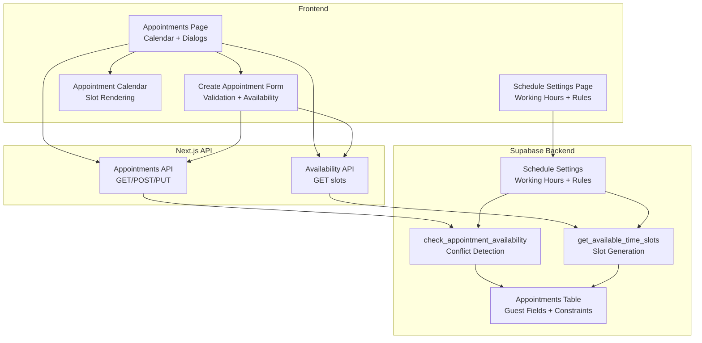
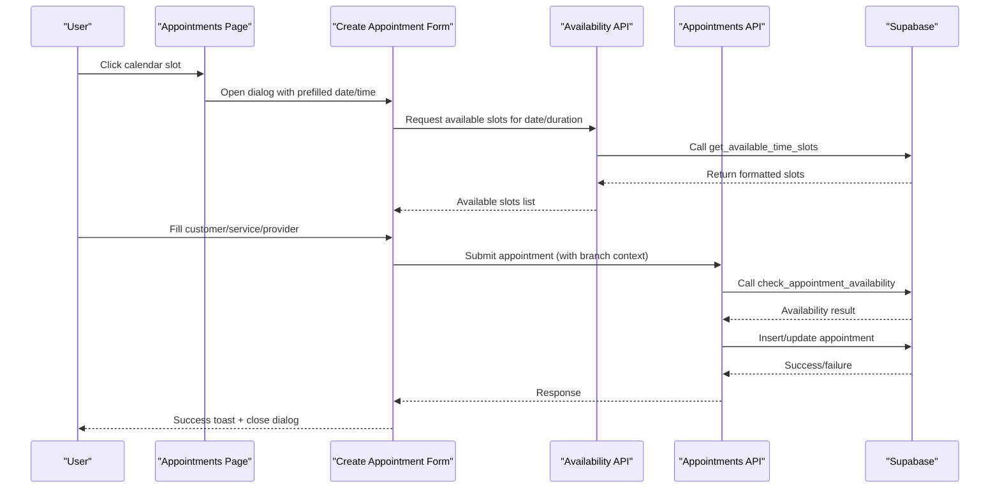
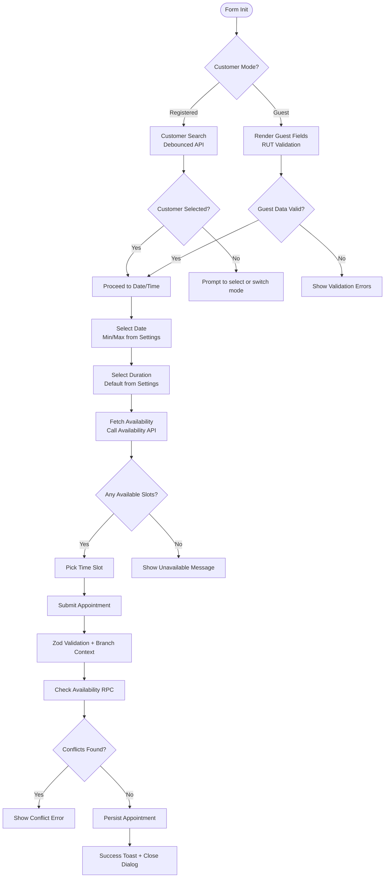
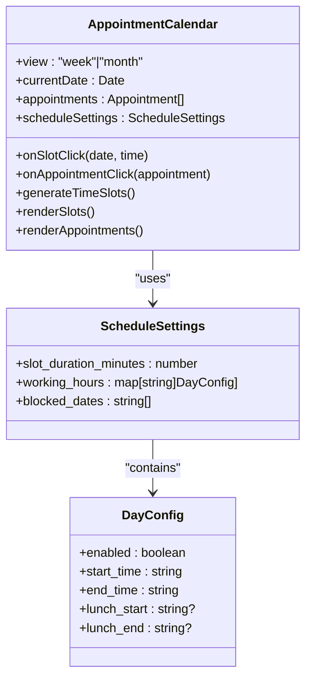
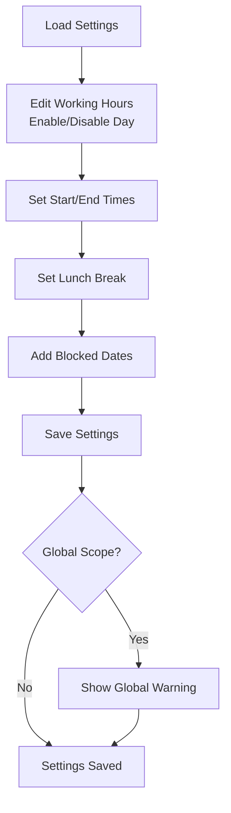
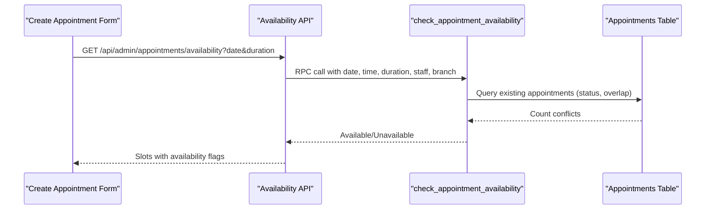
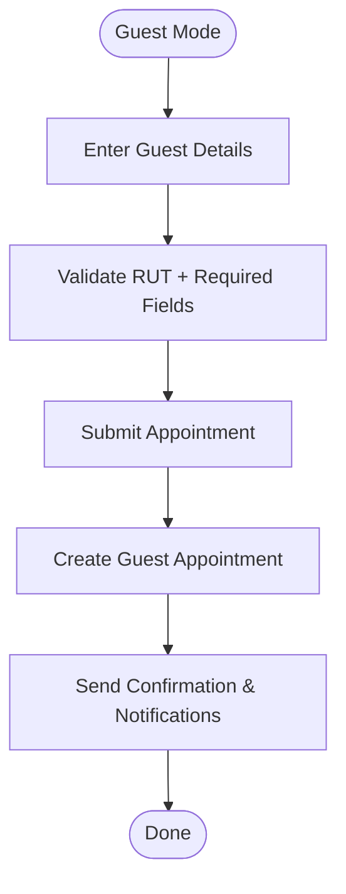
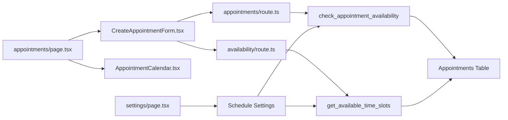

# Appointment Booking Workflow

<cite>
**Referenced Files in This Document**
- [Appointments Page](file://src/app/admin/appointments/page.tsx)
- [Create Appointment Form](file://src/components/admin/CreateAppointmentForm.tsx)
- [Appointment Calendar](file://src/components/admin/AppointmentCalendar.tsx)
- [Schedule Settings Page](file://src/app/admin/appointments/settings/page.tsx)
- [Appointments API](file://src/app/api/admin/appointments/route.ts)
- [Availability API](file://src/app/api/admin/appointments/availability/route.ts)
- [Schedule Settings Validation](file://src/lib/api/validation/zod-schemas.ts)
- [Check Availability Function](file://supabase/migrations/20250127000001_fix_check_appointment_availability.sql)
- [Fix Timezone Availability](file://supabase/migrations/20250127000003_fix_timezone_check_appointment_availability.sql)
- [Guest Customer Migration](file://supabase/migrations/20250131000002_modify_appointments_for_guest_customers.sql)
- [Branch Availability Fix](file://supabase/migrations/20251216000002_update_appointment_availability_for_branches.sql)
- [Availability Fallback Fix](file://supabase/migrations/20251216000004_fix_appointment_availability_fallback.sql)
</cite>

## Table of Contents

1. [Introduction](#introduction)
2. [Project Structure](#project-structure)
3. [Core Components](#core-components)
4. [Architecture Overview](#architecture-overview)
5. [Detailed Component Analysis](#detailed-component-analysis)
6. [Dependency Analysis](#dependency-analysis)
7. [Performance Considerations](#performance-considerations)
8. [Troubleshooting Guide](#troubleshooting-guide)
9. [Conclusion](#conclusion)

## Introduction

This document provides comprehensive coverage of the Opttius appointment booking workflow system, focusing on the end-to-end process of creating and managing patient appointments. It explains the multi-step booking form, including patient selection, service type configuration, provider assignment, and time slot selection. It documents form validation logic, real-time availability checking, conflict detection mechanisms, guest booking flow for walk-in patients, appointment type categorization, and duration calculations. Implementation details cover form state management, conditional field rendering, and error handling strategies. Examples illustrate booking scenarios, customization options, and integrations with patient records and scheduling rules.

## Project Structure

The appointment booking system spans frontend React components, Next.js API routes, and backend Supabase database logic with stored procedures and migrations:

- Frontend pages and components:
  - Appointments page with calendar view and dialogs
  - Create appointment form with validation and availability checks
  - Calendar component with time slot generation and click handling
  - Schedule settings page for configuring working hours and rules
- Backend API routes:
  - Appointments endpoint for CRUD operations and availability checks
  - Availability endpoint for real-time slot generation
- Database layer:
  - Supabase stored procedures for availability validation and slot calculation
  - Migrations supporting guest customer flow and branch-aware scheduling

**Diagram sources**

- [Appointments Page](file://src/app/admin/appointments/page.tsx#L112-L767)
- [Create Appointment Form](file://src/components/admin/CreateAppointmentForm.tsx#L47-L1139)
- [Appointment Calendar](file://src/components/admin/AppointmentCalendar.tsx#L72-L629)
- [Schedule Settings Page](file://src/app/admin/appointments/settings/page.tsx#L53-L633)
- [Appointments API](file://src/app/api/admin/appointments/route.ts#L23-L639)
- [Availability API](file://src/app/api/admin/appointments/availability/route.ts#L14-L171)
- [Check Availability Function](file://supabase/migrations/20250127000001_fix_check_appointment_availability.sql#L4-L103)
- [Guest Customer Migration](file://supabase/migrations/20250131000002_modify_appointments_for_guest_customers.sql#L1-L38)

**Section sources**

- [Appointments Page](file://src/app/admin/appointments/page.tsx#L112-L767)
- [Create Appointment Form](file://src/components/admin/CreateAppointmentForm.tsx#L47-L1139)
- [Appointment Calendar](file://src/components/admin/AppointmentCalendar.tsx#L72-L629)
- [Schedule Settings Page](file://src/app/admin/appointments/settings/page.tsx#L53-L633)
- [Appointments API](file://src/app/api/admin/appointments/route.ts#L23-L639)
- [Availability API](file://src/app/api/admin/appointments/availability/route.ts#L14-L171)

## Core Components

This section outlines the primary building blocks of the appointment booking workflow:

- Appointments Page
  - Hosts the master calendar view (week/month), filters, and dialogs
  - Manages branch scoping, status filtering, and weekly report generation
  - Opens Create/Edit dialogs and handles prefilled data from calendar clicks
- Create Appointment Form
  - Multi-step form with customer selection (registered vs guest), service type, provider assignment, and time slot selection
  - Real-time availability checking via Availability API
  - Validation using Zod schemas and branch-aware submission
- Appointment Calendar
  - Generates time slots based on schedule settings
  - Renders appointment blocks with status and type indicators
  - Handles slot clicks to prefill booking form
- Schedule Settings Page
  - Configures working hours, slot durations, blocked dates, and booking windows
  - Supports global vs branch-specific views for super admins
- Appointments API
  - CRUD operations for appointments with branch context and admin authorization
  - Calls availability RPC for conflict detection before creation/update
- Availability API
  - Returns available time slots for a given date and duration
  - Formats slot data and handles various PostgreSQL TIME formats
- Database Layer
  - Stored procedures for availability validation and slot generation
  - Migrations enabling guest customer flow and branch-aware scheduling

**Section sources**

- [Appointments Page](file://src/app/admin/appointments/page.tsx#L112-L767)
- [Create Appointment Form](file://src/components/admin/CreateAppointmentForm.tsx#L47-L1139)
- [Appointment Calendar](file://src/components/admin/AppointmentCalendar.tsx#L72-L629)
- [Schedule Settings Page](file://src/app/admin/appointments/settings/page.tsx#L53-L633)
- [Appointments API](file://src/app/api/admin/appointments/route.ts#L23-L639)
- [Availability API](file://src/app/api/admin/appointments/availability/route.ts#L14-L171)

## Architecture Overview

The system follows a layered architecture with clear separation of concerns:

- Presentation Layer
  - Next.js pages and components render UI and manage local state
  - Dialogs encapsulate create/edit workflows
- Business Logic Layer
  - API routes validate requests, enforce authorization, and coordinate with database
  - Forms orchestrate validation, availability checks, and submission
- Data Access Layer
  - Supabase stored procedures encapsulate scheduling rules and availability logic
  - Migrations define table structure supporting guest customers and branch scoping

**Diagram sources**

- [Appointments Page](file://src/app/admin/appointments/page.tsx#L401-L412)
- [Create Appointment Form](file://src/components/admin/CreateAppointmentForm.tsx#L227-L305)
- [Availability API](file://src/app/api/admin/appointments/availability/route.ts#L14-L171)
- [Appointments API](file://src/app/api/admin/appointments/route.ts#L205-L639)
- [Check Availability Function](file://supabase/migrations/20250127000001_fix_check_appointment_availability.sql#L4-L103)

## Detailed Component Analysis

### Create Appointment Form

The form orchestrates the entire booking process with robust validation and real-time feedback:

- Customer Selection Modes
  - Registered customer: searchable via customer search with debounced API calls
  - Guest customer: temporary registration with required fields (name, RUT, optional contact)
- Service Type Configuration
  - Appointment types mapped to icons and labels (examination, consultation, fitting, delivery, repair, follow-up, emergency, other)
- Provider Assignment
  - Optional assignment to staff members (integration point for provider selection)
- Time Slot Selection
  - Real-time availability fetched when date/duration changes
  - Visual grid of available slots with conflict detection
- Validation and Submission
  - Zod-based validation for required fields and formats
  - Branch-aware submission with admin authorization checks
  - Conflict detection via stored procedure before persistence

**Diagram sources**

- [Create Appointment Form](file://src/components/admin/CreateAppointmentForm.tsx#L60-L1139)
- [Availability API](file://src/app/api/admin/appointments/availability/route.ts#L14-L171)
- [Appointments API](file://src/app/api/admin/appointments/route.ts#L205-L639)

**Section sources**

- [Create Appointment Form](file://src/components/admin/CreateAppointmentForm.tsx#L47-L1139)
- [Appointments API](file://src/app/api/admin/appointments/route.ts#L205-L639)
- [Availability API](file://src/app/api/admin/appointments/availability/route.ts#L14-L171)

### Appointment Calendar

The calendar component generates time slots based on schedule settings and renders appointment blocks:

- Time Slot Generation
  - Uses configured slot duration and working hours
  - Considers lunch breaks and blocked dates
- Slot Availability
  - Checks against schedule settings and existing appointments
  - Highlights clickable slots for new bookings
- Appointment Rendering
  - Displays appointment blocks with type and status
  - Handles multi-duration blocks spanning multiple slots
- Interaction
  - Clicking a slot pre-fills the booking form with date/time
  - Supports both week and month views

**Diagram sources**

- [Appointment Calendar](file://src/components/admin/AppointmentCalendar.tsx#L62-L629)
- [Schedule Settings Page](file://src/app/admin/appointments/settings/page.tsx#L27-L51)

**Section sources**

- [Appointment Calendar](file://src/components/admin/AppointmentCalendar.tsx#L72-L629)
- [Schedule Settings Page](file://src/app/admin/appointments/settings/page.tsx#L27-L51)

### Schedule Settings Management

The schedule settings page enables administrators to configure operational rules:

- Working Hours Configuration
  - Enable/disable days and set opening/closing times
  - Configure lunch breaks with start/end times
- Global vs Branch Configuration
  - Super admins can configure global settings affecting all branches
  - Branch managers configure branch-specific rules
- Booking Windows
  - Minimum advance booking hours and maximum future booking days
- Blocked Dates
  - List of non-working dates excluded from availability

**Diagram sources**

- [Schedule Settings Page](file://src/app/admin/appointments/settings/page.tsx#L53-L633)

**Section sources**

- [Schedule Settings Page](file://src/app/admin/appointments/settings/page.tsx#L53-L633)

### Availability and Conflict Detection

Real-time availability checking ensures accurate slot selection and prevents double bookings:

- Availability API
  - Accepts date and duration parameters
  - Returns formatted time slots with availability flags
  - Handles various PostgreSQL TIME formats and boolean values
- Conflict Detection
  - Stored procedure validates working hours, lunch breaks, and existing appointments
  - Enforces minimum/maximum booking windows and branch scoping
  - Supports guest customer constraints and branch-aware filtering

**Diagram sources**

- [Availability API](file://src/app/api/admin/appointments/availability/route.ts#L14-L171)
- [Check Availability Function](file://supabase/migrations/20250127000001_fix_check_appointment_availability.sql#L4-L103)
- [Branch Availability Fix](file://supabase/migrations/20251216000002_update_appointment_availability_for_branches.sql#L109-L128)

**Section sources**

- [Availability API](file://src/app/api/admin/appointments/availability/route.ts#L14-L171)
- [Check Availability Function](file://supabase/migrations/20250127000001_fix_check_appointment_availability.sql#L4-L103)
- [Fix Timezone Availability](file://supabase/migrations/20250127000003_fix_timezone_check_appointment_availability.sql#L41-L77)
- [Branch Availability Fix](file://supabase/migrations/20251216000002_update_appointment_availability_for_branches.sql#L109-L128)
- [Availability Fallback Fix](file://supabase/migrations/20251216000004_fix_appointment_availability_fallback.sql#L113-L148)

### Guest Booking Flow

The system supports walk-in patients without requiring registration:

- Guest Customer Fields
  - Name, last name, RUT (required), email, and phone (optional)
  - Stored directly in the appointments table with constraints
- Validation and Submission
  - RUT validation and normalization enforced
  - Branch-aware creation with guest data persisted
- Integration
  - Guest appointments appear alongside registered customer appointments
  - Searchable by guest RUT/email via dedicated indexes

**Diagram sources**

- [Guest Customer Migration](file://supabase/migrations/20250131000002_modify_appointments_for_guest_customers.sql#L1-L38)
- [Appointments API](file://src/app/api/admin/appointments/route.ts#L423-L457)

**Section sources**

- [Guest Customer Migration](file://supabase/migrations/20250131000002_modify_appointments_for_guest_customers.sql#L1-L38)
- [Appointments API](file://src/app/api/admin/appointments/route.ts#L423-L457)

## Dependency Analysis

The system exhibits clear dependency relationships:

- Frontend depends on:
  - Next.js API routes for data operations
  - Supabase for authentication and database access
  - Local state management for form interactions
- API routes depend on:
  - Supabase stored procedures for scheduling logic
  - Branch middleware for multi-tenancy
  - Zod schemas for validation
- Database depends on:
  - Stored procedures for availability and slot generation
  - Migrations for schema evolution and constraints

**Diagram sources**

- [Create Appointment Form](file://src/components/admin/CreateAppointmentForm.tsx#L47-L1139)
- [Appointments Page](file://src/app/admin/appointments/page.tsx#L112-L767)
- [Appointment Calendar](file://src/components/admin/AppointmentCalendar.tsx#L72-L629)
- [Schedule Settings Page](file://src/app/admin/appointments/settings/page.tsx#L53-L633)
- [Appointments API](file://src/app/api/admin/appointments/route.ts#L23-L639)
- [Availability API](file://src/app/api/admin/appointments/availability/route.ts#L14-L171)
- [Check Availability Function](file://supabase/migrations/20250127000001_fix_check_appointment_availability.sql#L4-L103)

**Section sources**

- [Create Appointment Form](file://src/components/admin/CreateAppointmentForm.tsx#L47-L1139)
- [Appointments Page](file://src/app/admin/appointments/page.tsx#L112-L767)
- [Appointment Calendar](file://src/components/admin/AppointmentCalendar.tsx#L72-L629)
- [Schedule Settings Page](file://src/app/admin/appointments/settings/page.tsx#L53-L633)
- [Appointments API](file://src/app/api/admin/appointments/route.ts#L23-L639)
- [Availability API](file://src/app/api/admin/appointments/availability/route.ts#L14-L171)

## Performance Considerations

- Debounced Customer Search
  - Reduces API calls during typing with 300ms debounce
- Lazy Loading
  - Calendar and form components are dynamically imported to minimize initial bundle size
- Efficient Availability Queries
  - Single RPC call per date/duration change with formatted slot responses
- Branch Filtering
  - Applies branch context early to limit dataset size
- Index Usage
  - Guest RUT/email indexes optimize search queries for walk-in patients

## Troubleshooting Guide

Common issues and resolutions:

- Availability Always Shows Unavailable
  - Verify schedule settings (working hours, blocked dates, lunch breaks)
  - Check minimum/maximum booking windows
  - Ensure branch context is correctly applied
- Conflicts Not Detected
  - Review stored procedure logic for overlap detection
  - Confirm branch scoping and staff assignment filters
- Guest Customer Creation Fails
  - Ensure required fields (name, last name, RUT) are provided
  - Validate RUT format and normalization
- Time Zone Issues
  - Confirm database and application time zone alignment
  - Review timezone-specific availability fixes

**Section sources**

- [Check Availability Function](file://supabase/migrations/20250127000001_fix_check_appointment_availability.sql#L4-L103)
- [Fix Timezone Availability](file://supabase/migrations/20250127000003_fix_timezone_check_appointment_availability.sql#L41-L77)
- [Branch Availability Fix](file://supabase/migrations/20251216000002_update_appointment_availability_for_branches.sql#L109-L128)
- [Availability Fallback Fix](file://supabase/migrations/20251216000004_fix_appointment_availability_fallback.sql#L113-L148)

## Conclusion

The Opttius appointment booking workflow provides a comprehensive, branch-aware scheduling solution with robust validation, real-time availability checking, and flexible customer modes. The modular architecture separates presentation, business logic, and data access concerns, enabling maintainability and extensibility. Administrators can fine-tune scheduling rules, while end users benefit from an intuitive multi-step booking process with immediate feedback and conflict prevention.
