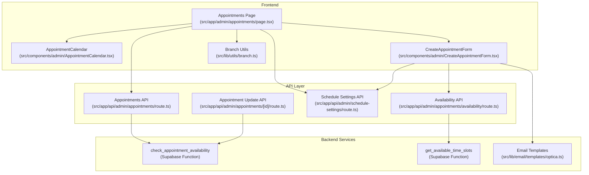
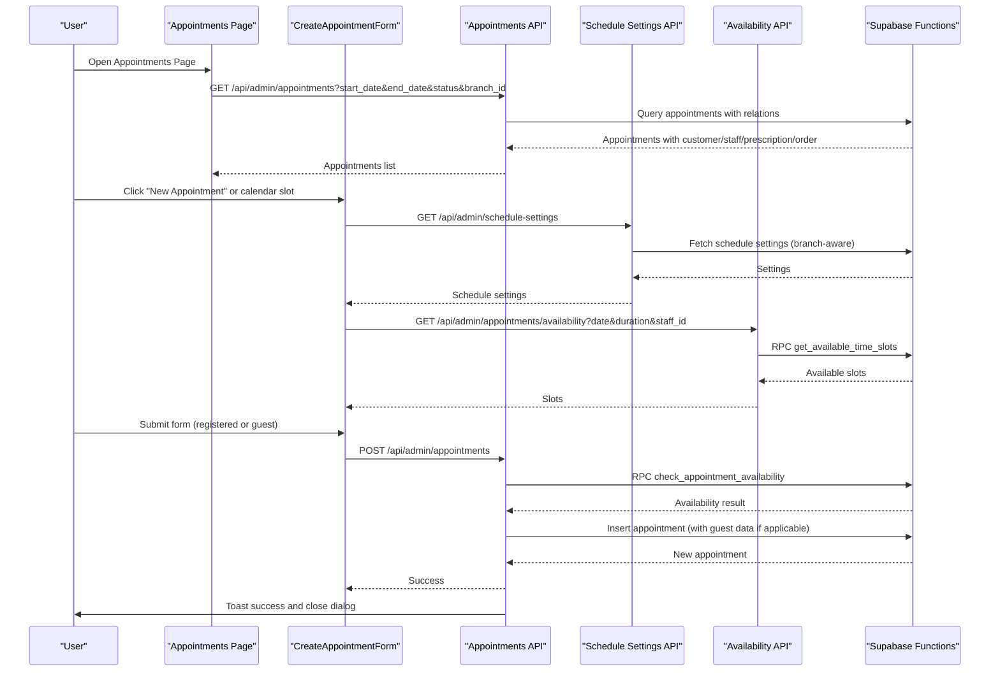
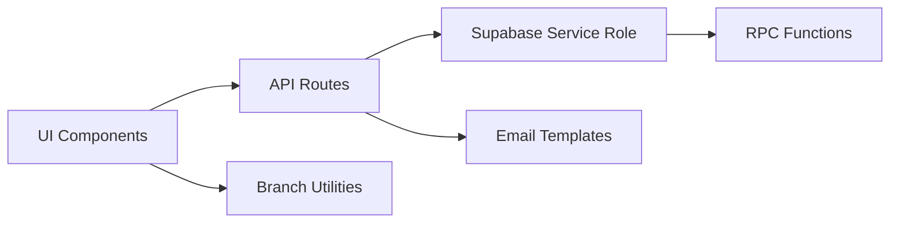

# Appointment Management & Status Tracking

<cite>
**Referenced Files in This Document**
- [src/app/admin/appointments/page.tsx](file://src/app/admin/appointments/page.tsx)
- [src/components/admin/CreateAppointmentForm.tsx](file://src/components/admin/CreateAppointmentForm.tsx)
- [src/components/admin/AppointmentCalendar.tsx](file://src/components/admin/AppointmentCalendar.tsx)
- [src/lib/utils/branch.ts](file://src/lib/utils/branch.ts)
- [src/app/api/admin/appointments/route.ts](file://src/app/api/admin/appointments/route.ts)
- [src/app/api/admin/appointments/availability/route.ts](file://src/app/api/admin/appointments/availability/route.ts)
- [src/app/api/admin/schedule-settings/route.ts](file://src/app/api/admin/schedule-settings/route.ts)
- [src/app/api/admin/appointments/[id]/route.ts](file://src/app/api/admin/appointments/[id]/route.ts)
- [src/lib/email/templates/optica.ts](file://src/lib/email/templates/optica.ts)
- [supabase/migrations/20260208000001_email_templates_complete_migration.sql](file://supabase/migrations/20260208000001_email_templates_complete_migration.sql)
- [supabase/migrations/20250127000002-debug_check_appointment_availability.sql](file://supabase/migrations/20250127000002-debug_check_appointment_availability.sql)
- [supabase/migrations/20251216000002-update_appointment_availability_for_branches.sql](file://supabase/migrations/20251216000002-update_appointment_availability_for_branches.sql)
</cite>

## Table of Contents

1. [Introduction](#introduction)
2. [Project Structure](#project-structure)
3. [Core Components](#core-components)
4. [Architecture Overview](#architecture-overview)
5. [Detailed Component Analysis](#detailed-component-analysis)
6. [Dependency Analysis](#dependency-analysis)
7. [Performance Considerations](#performance-considerations)
8. [Troubleshooting Guide](#troubleshooting-guide)
9. [Conclusion](#conclusion)

## Introduction

This document describes the appointment management and status tracking system for Opttius, focusing on operational workflows for managing existing appointments. It explains the appointment lifecycle from creation to completion, covering status transitions, reminder systems, follow-up scheduling, filtering and search capabilities, batch operations, and integrations with patient records, appointment reminders, and staff notifications. It also documents status validation, audit trails, and reporting capabilities, with practical examples for common management scenarios and integration with external systems for confirmation and rescheduling.

## Project Structure

The appointment management system spans frontend React components, API routes, and backend database functions:

- Frontend pages and components manage user interactions, calendar views, and forms
- API routes handle CRUD operations, availability checks, and schedule settings
- Database functions enforce business rules for availability and branch scoping
- Email templates and services integrate with notification systems

**Diagram sources**

- [src/app/admin/appointments/page.tsx](file://src/app/admin/appointments/page.tsx#L112-L202)
- [src/components/admin/AppointmentCalendar.tsx](file://src/components/admin/AppointmentCalendar.tsx#L72-L80)
- [src/components/admin/CreateAppointmentForm.tsx](file://src/components/admin/CreateAppointmentForm.tsx#L47-L53)
- [src/lib/utils/branch.ts](file://src/lib/utils/branch.ts#L92-L99)
- [src/app/api/admin/appointments/route.ts](file://src/app/api/admin/appointments/route.ts#L23-L104)
- [src/app/api/admin/appointments/availability/route.ts](file://src/app/api/admin/appointments/availability/route.ts#L14-L69)
- [src/app/api/admin/schedule-settings/route.ts](file://src/app/api/admin/schedule-settings/route.ts#L8-L44)
- [src/app/api/admin/appointments/[id]/route.ts](file://src/app/api/admin/appointments/[id]/route.ts#L162-L192)
- [src/lib/email/templates/optica.ts](file://src/lib/email/templates/optica.ts#L349-L412)

**Section sources**

- [src/app/admin/appointments/page.tsx](file://src/app/admin/appointments/page.tsx#L1-L1239)
- [src/components/admin/AppointmentCalendar.tsx](file://src/components/admin/AppointmentCalendar.tsx#L1-L630)
- [src/components/admin/CreateAppointmentForm.tsx](file://src/components/admin/CreateAppointmentForm.tsx#L1-L1140)
- [src/lib/utils/branch.ts](file://src/lib/utils/branch.ts#L1-L123)

## Core Components

- Appointments Page: Orchestrates calendar display, filters, branch selection, weekly reports, and creates/edit dialogs
- AppointmentCalendar: Renders week/month views, handles click-to-create slots, and displays appointment blocks
- CreateAppointmentForm: Manages customer selection (registered/guest), availability checks, date/time constraints, and submission
- Schedule Settings API: Provides working hours, slot durations, and booking constraints; supports global updates for super admins
- Availability API: Computes available time slots for a given date and duration, considering staff and branch
- Appointments API: Handles listing, creation, and updates with validation and notifications
- Email Templates: Implements appointment confirmation, reminders, rescheduling, and cancellation notifications

Key operational capabilities:

- Filtering and search: By status, date range, customer, staff, and branch
- Status management: Scheduled → Confirmed → Completed, with cancellation and no-show states
- Follow-up scheduling: Optional follow-up flag and date capture
- Audit and reporting: Weekly summaries, branch-scoped views, and auto-registration on completion

**Section sources**

- [src/app/admin/appointments/page.tsx](file://src/app/admin/appointments/page.tsx#L112-L399)
- [src/components/admin/AppointmentCalendar.tsx](file://src/components/admin/AppointmentCalendar.tsx#L72-L317)
- [src/components/admin/CreateAppointmentForm.tsx](file://src/components/admin/CreateAppointmentForm.tsx#L47-L501)
- [src/app/api/admin/schedule-settings/route.ts](file://src/app/api/admin/schedule-settings/route.ts#L8-L127)
- [src/app/api/admin/appointments/availability/route.ts](file://src/app/api/admin/appointments/availability/route.ts#L14-L106)
- [src/app/api/admin/appointments/route.ts](file://src/app/api/admin/appointments/route.ts#L23-L195)
- [src/lib/email/templates/optica.ts](file://src/lib/email/templates/optica.ts#L349-L446)

## Architecture Overview

The system follows a layered architecture:

- UI layer: Next.js client components with dynamic imports for performance
- API layer: Next.js API routes with Supabase client/service role
- Business logic: Supabase RPC functions for availability and time-slot computation
- Notifications: Email templates and services integrated during create/update operations

**Diagram sources**

- [src/app/admin/appointments/page.tsx](file://src/app/admin/appointments/page.tsx#L166-L202)
- [src/components/admin/CreateAppointmentForm.tsx](file://src/components/admin/CreateAppointmentForm.tsx#L183-L305)
- [src/app/api/admin/appointments/route.ts](file://src/app/api/admin/appointments/route.ts#L205-L297)
- [src/app/api/admin/schedule-settings/route.ts](file://src/app/api/admin/schedule-settings/route.ts#L8-L44)
- [src/app/api/admin/appointments/availability/route.ts](file://src/app/api/admin/appointments/availability/route.ts#L14-L69)

## Detailed Component Analysis

### Appointments Page (Master View)

Responsibilities:

- Manage view modes (week/month), date navigation, and branch filtering
- Fetch appointments with optional status/date filters
- Render mini-dashboard, calendar grid, and action dialogs
- Provide weekly report generation and sync tools

Key features:

- Branch-aware filtering via headers and query parameters
- Status badges and type icons for visual cues
- Prefill creation form from calendar slot clicks

Operational flow:

- On mount or filter change, fetches appointments and schedule settings
- Uses branch utilities to set x-branch-id header for multi-branch support
- Generates weekly report data grouped by day and status

**Section sources**

- [src/app/admin/appointments/page.tsx](file://src/app/admin/appointments/page.tsx#L112-L399)
- [src/lib/utils/branch.ts](file://src/lib/utils/branch.ts#L92-L99)

### AppointmentCalendar (Calendar Rendering)

Responsibilities:

- Generate time slots from schedule settings
- Render week/month views with appointment blocks
- Enable click-to-create when slots are available
- Enforce working hours, lunch breaks, and past-date constraints

Logic highlights:

- Computes time slots based on slot_duration_minutes and working hours
- Validates slot availability per date and staff constraints
- Displays appointment blocks with status-specific styling and type icons
- Supports hover indicators for clickable slots

**Section sources**

- [src/components/admin/AppointmentCalendar.tsx](file://src/components/admin/AppointmentCalendar.tsx#L72-L317)

### CreateAppointmentForm (Creation and Editing)

Responsibilities:

- Customer selection: registered (search) or guest (temporary)
- Availability validation: fetches available slots and validates constraints
- Date/time constraints: min/max booking windows from schedule settings
- Submission: creates or updates appointments with proper validation and notifications

Key validations:

- Customer presence (registered or guest with required fields)
- Date not in the past
- Time format normalization (HH:MM:SS)
- Availability check via RPC before insertion/update

Auto-registration:

- When status becomes "completed" and customer_id is null, attempts to register guest as customer in the same organization

**Section sources**

- [src/components/admin/CreateAppointmentForm.tsx](file://src/components/admin/CreateAppointmentForm.tsx#L47-L501)
- [src/app/api/admin/appointments/[id]/route.ts](file://src/app/api/admin/appointments/[id]/route.ts#L280-L306)

### Schedule Settings Management

Responsibilities:

- Provide working hours, slot durations, and booking constraints
- Support global updates for super admins (syncs across branches)
- Default settings when no branch-specific configuration exists

Behavior:

- GET returns branch-specific or default settings
- PUT supports global organization-wide updates and per-branch updates
- Maintains min/max booking windows and staff-specific overrides

**Section sources**

- [src/app/api/admin/schedule-settings/route.ts](file://src/app/api/admin/schedule-settings/route.ts#L8-L127)
- [src/app/api/admin/schedule-settings/route.ts](file://src/app/api/admin/schedule-settings/route.ts#L137-L333)

### Availability API and Business Rules

Responsibilities:

- Compute available time slots for a given date and duration
- Enforce branch-specific constraints and staff availability
- Return formatted slots with availability flags

Business rules enforced:

- Working hours and lunch breaks
- Minimum/maximum booking windows
- Overlap prevention with existing appointments
- Past-date restrictions

**Section sources**

- [src/app/api/admin/appointments/availability/route.ts](file://src/app/api/admin/appointments/availability/route.ts#L14-L106)
- [supabase/migrations/20250127000002-debug_check_appointment_availability.sql](file://supabase/migrations/20250127000002-debug_check_appointment_availability.sql#L73-L108)
- [supabase/migrations/20251216000002-update_appointment_availability_for_branches.sql](file://supabase/migrations/20251216000002-update_appointment_availability_for_branches.sql#L109-L122)

### Appointments API (CRUD and Validation)

Responsibilities:

- List appointments with optional filters and branch scoping
- Create appointments with validation and availability checks
- Update appointments with status transitions and follow-up scheduling
- Trigger notifications and email confirmations

Validation and constraints:

- Zod schema validation for create/update bodies
- Availability RPC check before insert/update
- Branch assignment and organization scoping
- Auto-registration on completion for guests

Notifications:

- New appointment notifications
- Customer email confirmation upon creation
- Email templates for reminders, rescheduling, and cancellations

**Section sources**

- [src/app/api/admin/appointments/route.ts](file://src/app/api/admin/appointments/route.ts#L23-L195)
- [src/app/api/admin/appointments/route.ts](file://src/app/api/admin/appointments/route.ts#L205-L631)
- [src/app/api/admin/appointments/[id]/route.ts](file://src/app/api/admin/appointments/[id]/route.ts#L162-L192)

### Email Templates and Reminders

Capabilities:

- Appointment confirmation emails
- Two-hour reminder emails
- Rescheduling and cancellation notifications
- Template activation and usage tracking

Integration:

- Loaded dynamically based on active templates
- Variables substituted with customer, professional, and branch details
- Reply-to configured from organization metadata

**Section sources**

- [src/lib/email/templates/optica.ts](file://src/lib/email/templates/optica.ts#L349-L446)
- [supabase/migrations/20260208000001_email_templates_complete_migration.sql](file://supabase/migrations/20260208000001_email_templates_complete_migration.sql#L19-L26)

## Dependency Analysis

The system exhibits clear separation of concerns:

- UI components depend on API routes for data and actions
- API routes depend on Supabase service role for database operations
- Business logic is encapsulated in Supabase RPC functions
- Notifications are decoupled via email template services

**Diagram sources**

- [src/app/admin/appointments/page.tsx](file://src/app/admin/appointments/page.tsx#L166-L202)
- [src/app/api/admin/appointments/route.ts](file://src/app/api/admin/appointments/route.ts#L23-L104)
- [src/lib/utils/branch.ts](file://src/lib/utils/branch.ts#L92-L99)

**Section sources**

- [src/app/admin/appointments/page.tsx](file://src/app/admin/appointments/page.tsx#L112-L202)
- [src/app/api/admin/appointments/route.ts](file://src/app/api/admin/appointments/route.ts#L23-L104)
- [src/lib/utils/branch.ts](file://src/lib/utils/branch.ts#L92-L99)

## Performance Considerations

- Dynamic imports: Calendar and form components are lazy-loaded to reduce initial bundle size
- Batch queries: Related data (customers, staff, prescriptions, orders) fetched in single queries to avoid N+1
- Pagination and filtering: API supports date-range and status filters to limit result sets
- Availability caching: Consider caching available slots per date/duration to reduce RPC calls
- Debounced search: Customer search in the form debounced to minimize network requests

[No sources needed since this section provides general guidance]

## Troubleshooting Guide

Common issues and resolutions:

- Unauthorized access: Ensure admin authorization via RPC is_admin and proper user session
- Availability failures: Verify schedule settings, working hours, and branch-specific constraints
- Missing branch context: Confirm x-branch-id header is set for multi-branch operations
- Guest customer registration: On completion, system attempts to register guest under organization; verify RUT uniqueness and organization context
- Email delivery: Check active templates and organization metadata for reply-to addresses

**Section sources**

- [src/app/api/admin/appointments/route.ts](file://src/app/api/admin/appointments/route.ts#L27-L44)
- [src/app/api/admin/schedule-settings/route.ts](file://src/app/api/admin/schedule-settings/route.ts#L12-L29)
- [src/app/api/admin/appointments/[id]/route.ts](file://src/app/api/admin/appointments/[id]/route.ts#L280-L306)
- [src/lib/email/templates/optica.ts](file://src/lib/email/templates/optica.ts#L349-L446)

## Conclusion

The Opttius appointment management system provides a robust, multi-branch capable solution for scheduling, status tracking, and operational reporting. Its modular architecture enables clear separation between UI, API, and business logic, while Supabase RPC functions ensure consistent enforcement of availability and branch rules. Integrated email templates and notifications enhance customer communication, and the system supports future extensions for batch operations and advanced reporting.
