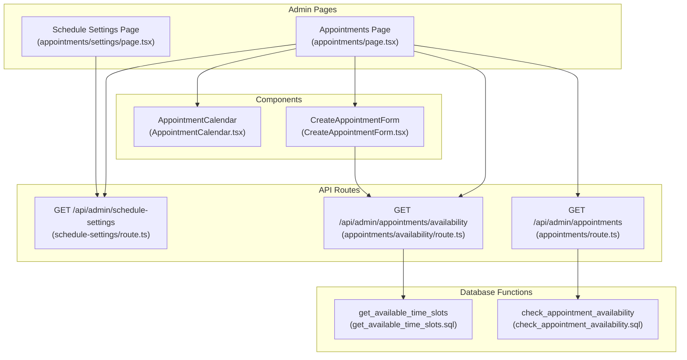
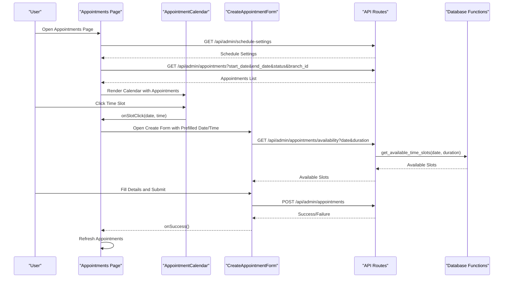
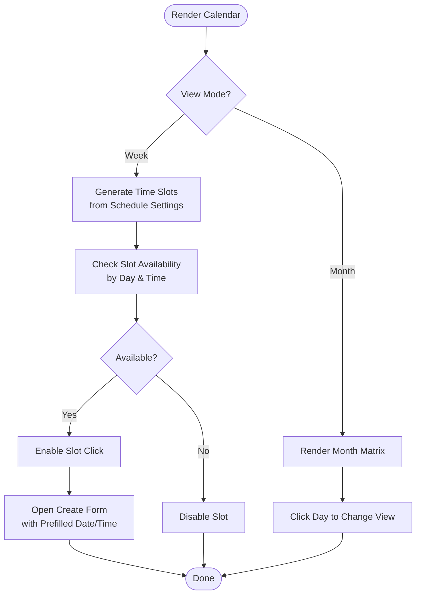
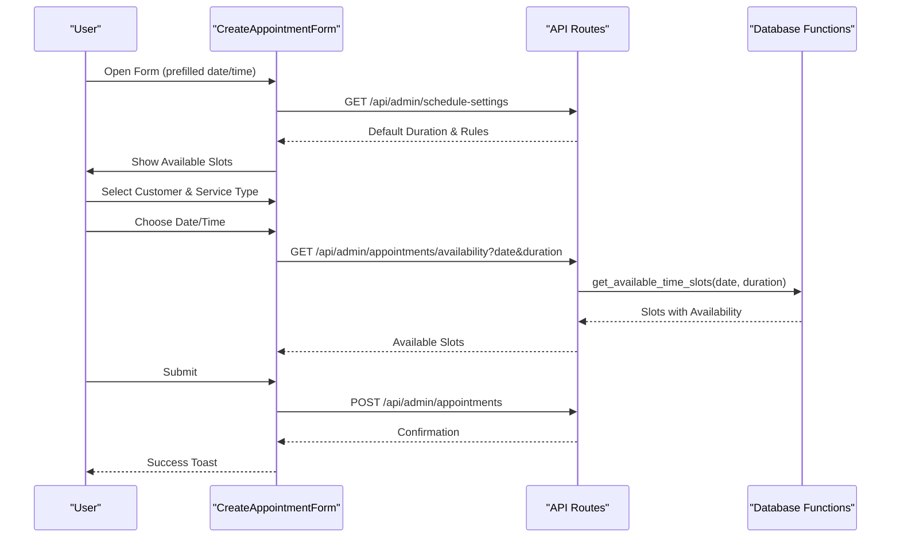
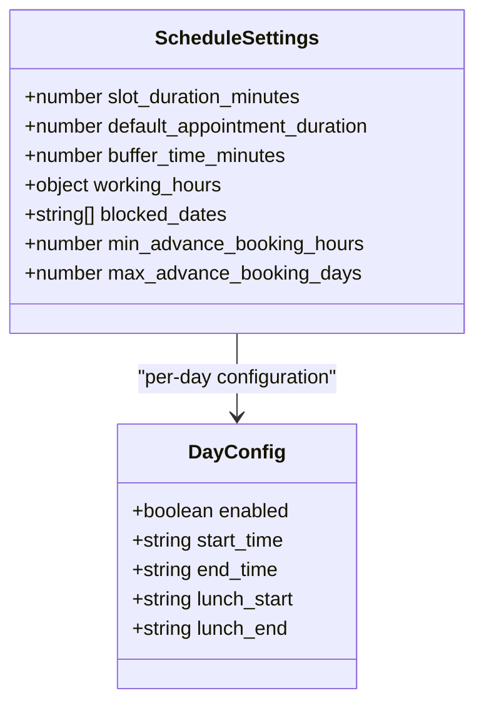
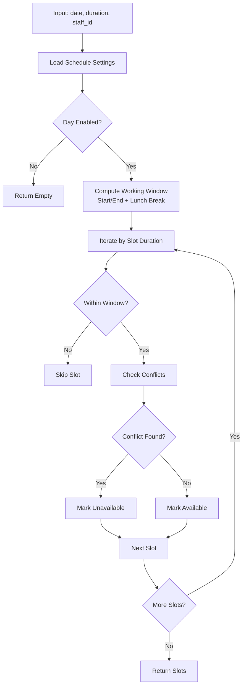
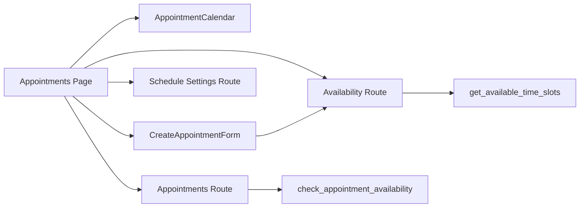

# Appointment Scheduling System

<cite>
**Referenced Files in This Document**
- [appointments/page.tsx](file://src/app/admin/appointments/page.tsx)
- [settings/page.tsx](file://src/app/admin/appointments/settings/page.tsx)
- [AppointmentCalendar.tsx](file://src/components/admin/AppointmentCalendar.tsx)
- [CreateAppointmentForm.tsx](file://src/components/admin/CreateAppointmentForm.tsx)
- [schedule-settings/route.ts](file://src/app/api/admin/schedule-settings/route.ts)
- [appointments/route.ts](file://src/app/api/admin/appointments/route.ts)
- [appointments/availability/route.ts](file://src/app/api/admin/appointments/availability/route.ts)
- [create_schedule_settings_system.sql](file://supabase/migrations/20250126000000_create_schedule_settings_system.sql)
- [get_available_time_slots.sql](file://supabase/migrations/20250126000000_create_schedule_settings_system.sql)
- [check_appointment_availability.sql](file://supabase/migrations/20250127000000_create_schedule_settings_system.sql)
- [fix_timezone_check_appointment_availability.sql](file://supabase/migrations/20250127000003_fix_timezone_check_appointment_availability.sql)
- [fix_get_available_time_slots_past_filtering.sql](file://supabase/migrations/20250127000004_fix_get_available_time_slots_past_filtering.sql)
- [update_get_available_time_slots_for_branches.sql](file://supabase/migrations/20250127000005_update_get_available_time_slots_for_branches.sql)
</cite>

## Table of Contents

1. [Introduction](#introduction)
2. [Project Structure](#project-structure)
3. [Core Components](#core-components)
4. [Architecture Overview](#architecture-overview)
5. [Detailed Component Analysis](#detailed-component-analysis)
6. [Dependency Analysis](#dependency-analysis)
7. [Performance Considerations](#performance-considerations)
8. [Troubleshooting Guide](#troubleshooting-guide)
9. [Conclusion](#conclusion)

## Introduction

This document describes the appointment scheduling system designed for optical practice management workflows. It covers the calendar interface for managing patient appointments, availability settings, and resource allocation. The system supports appointment creation with patient selection, service type configuration, and time slot booking. It also documents scheduling rules including business hours, provider availability, and conflict detection, along with implementation details for timezone handling, appointment status management, and reminder systems. Examples of booking flows, calendar management tasks, and integration with patient records are included, alongside the scheduling algorithms, availability calculation logic, and multi-provider coordination patterns.

## Project Structure

The appointment scheduling system is organized around three primary areas:

- Administrative UI pages for managing appointments and schedule settings
- Calendar and form components for user interaction
- Backend API routes and database functions for availability and persistence

**Diagram sources**

- [appointments/page.tsx](file://src/app/admin/appointments/page.tsx#L112-L221)
- [settings/page.tsx](file://src/app/admin/appointments/settings/page.tsx#L53-L101)
- [AppointmentCalendar.tsx](file://src/components/admin/AppointmentCalendar.tsx#L72-L80)
- [CreateAppointmentForm.tsx](file://src/components/admin/CreateAppointmentForm.tsx#L47-L53)
- [schedule-settings/route.ts](file://src/app/api/admin/schedule-settings/route.ts)
- [appointments/route.ts](file://src/app/api/admin/appointments/route.ts)
- [appointments/availability/route.ts](file://src/app/api/admin/appointments/availability/route.ts)
- [get_available_time_slots.sql](file://supabase/migrations/20250126000000_create_schedule_settings_system.sql#L45-L120)
- [check_appointment_availability.sql](file://supabase/migrations/20250127000000_create_schedule_settings_system.sql)

**Section sources**

- [appointments/page.tsx](file://src/app/admin/appointments/page.tsx#L1-L1239)
- [settings/page.tsx](file://src/app/admin/appointments/settings/page.tsx#L1-L633)

## Core Components

- Master Calendar Interface: Renders weekly and monthly views, displays appointments, and enables slot-based booking.
- Appointment Creation Form: Handles patient selection (registered or guest), service type, date/time selection, and availability checks.
- Schedule Settings: Manages business hours, slot durations, blocking dates, and booking windows.
- Availability Engine: Computes available time slots based on schedule settings and existing bookings.

Key capabilities:

- Multi-view calendar with time-slot grid and appointment overlays
- Real-time availability checking via API
- Flexible customer selection modes (registered vs. guest)
- Business rules enforcement (working hours, minimum/maximum booking windows)
- Branch-aware scheduling with global and local views

**Section sources**

- [AppointmentCalendar.tsx](file://src/components/admin/AppointmentCalendar.tsx#L72-L630)
- [CreateAppointmentForm.tsx](file://src/components/admin/CreateAppointmentForm.tsx#L47-L800)
- [settings/page.tsx](file://src/app/admin/appointments/settings/page.tsx#L53-L633)

## Architecture Overview

The system follows a layered architecture:

- Frontend pages orchestrate state and render components
- Components encapsulate UI logic and user interactions
- API routes handle persistence and business queries
- Database functions enforce scheduling rules and compute availability

**Diagram sources**

- [appointments/page.tsx](file://src/app/admin/appointments/page.tsx#L159-L202)
- [AppointmentCalendar.tsx](file://src/components/admin/AppointmentCalendar.tsx#L430-L435)
- [CreateAppointmentForm.tsx](file://src/components/admin/CreateAppointmentForm.tsx#L227-L305)
- [appointments/availability/route.ts](file://src/app/api/admin/appointments/availability/route.ts)
- [get_available_time_slots.sql](file://supabase/migrations/20250126000000_create_schedule_settings_system.sql#L45-L120)

## Detailed Component Analysis

### Calendar Interface and Management

The calendar component renders either a weekly grid or a monthly matrix:

- Weekly view: A time-axis grid with vertical appointment blocks sized by duration
- Monthly view: Day cells with truncated appointment badges
- Slot availability: Determined by schedule settings (working hours, lunch breaks, blocked dates)
- Interaction: Clicking a slot opens the appointment creation form with prefilled date/time

**Diagram sources**

- [AppointmentCalendar.tsx](file://src/components/admin/AppointmentCalendar.tsx#L83-L143)
- [AppointmentCalendar.tsx](file://src/components/admin/AppointmentCalendar.tsx#L146-L211)
- [AppointmentCalendar.tsx](file://src/components/admin/AppointmentCalendar.tsx#L430-L435)

**Section sources**

- [AppointmentCalendar.tsx](file://src/components/admin/AppointmentCalendar.tsx#L72-L630)

### Appointment Creation Workflow

The creation form manages:

- Patient selection: Registered customer search or guest mode with RUT validation
- Service type selection: Predefined categories with icons and labels
- Date/time selection: Enforced against schedule settings and availability
- Duration configuration: Defaults from schedule settings, adjustable per booking
- Submission: Validates inputs, formats time, and persists appointment

**Diagram sources**

- [CreateAppointmentForm.tsx](file://src/components/admin/CreateAppointmentForm.tsx#L183-L213)
- [CreateAppointmentForm.tsx](file://src/components/admin/CreateAppointmentForm.tsx#L227-L305)
- [CreateAppointmentForm.tsx](file://src/components/admin/CreateAppointmentForm.tsx#L335-L470)
- [get_available_time_slots.sql](file://supabase/migrations/20250126000000_create_schedule_settings_system.sql#L45-L120)

**Section sources**

- [CreateAppointmentForm.tsx](file://src/components/admin/CreateAppointmentForm.tsx#L47-L800)

### Schedule Settings and Business Rules

Schedule settings define:

- Slot duration (grid spacing)
- Default appointment duration (initial size)
- Buffer time (not explicitly used in frontend, but stored)
- Working hours per day (enabled, start/end, optional lunch break)
- Blocked dates (holidays/non-working days)
- Booking windows: minimum advance hours and maximum booking days

**Diagram sources**

- [settings/page.tsx](file://src/app/admin/appointments/settings/page.tsx#L27-L51)

**Section sources**

- [settings/page.tsx](file://src/app/admin/appointments/settings/page.tsx#L53-L633)

### Availability Calculation Logic

Availability is computed by database functions:

- `get_available_time_slots`: Generates time slots for a given date and duration, respecting working hours, lunch breaks, and blocked dates
- `check_appointment_availability`: Validates conflicts for a proposed appointment
- Timezone handling: Adjustments applied in later migrations to ensure accurate comparisons

**Diagram sources**

- [get_available_time_slots.sql](file://supabase/migrations/20250126000000_create_schedule_settings_system.sql#L45-L120)
- [check_appointment_availability.sql](file://supabase/migrations/20250127000000_create_schedule_settings_system.sql)

**Section sources**

- [get_available_time_slots.sql](file://supabase/migrations/20250126000000_create_schedule_settings_system.sql#L45-L120)
- [check_appointment_availability.sql](file://supabase/migrations/20250127000000_create_schedule_settings_system.sql)
- [fix_timezone_check_appointment_availability.sql](file://supabase/migrations/20250127000003_fix_timezone_check_appointment_availability.sql)
- [fix_get_available_time_slots_past_filtering.sql](file://supabase/migrations/20250127000004_fix_get_available_time_slots_past_filtering.sql)
- [update_get_available_time_slots_for_branches.sql](file://supabase/migrations/20250127000005_update_get_available_time_slots_for_branches.sql)

### Multi-Provider Coordination Patterns

- Staff assignment: The form supports assigning appointments to providers, enabling provider-specific availability checks
- Branch scoping: Schedule settings and availability queries are branch-aware, allowing global administrators to configure across locations
- Conflict detection: Database functions ensure no double-booking occurs for the same provider within the same time slot

**Section sources**

- [CreateAppointmentForm.tsx](file://src/components/admin/CreateAppointmentForm.tsx#L90-L109)
- [update_get_available_time_slots_for_branches.sql](file://supabase/migrations/20250127000005_update_get_available_time_slots_for_branches.sql)

### Timezone Handling

- Migration updates address timezone-related discrepancies in availability calculations and past-date filtering
- Ensures accurate comparisons between local times and database timestamps

**Section sources**

- [fix_timezone_check_appointment_availability.sql](file://supabase/migrations/20250127000003_fix_timezone_check_appointment_availability.sql)
- [fix_get_available_time_slots_past_filtering.sql](file://supabase/migrations/20250127000004_fix_get_available_time_slots_past_filtering.sql)

### Appointment Status Management

- Supported statuses: scheduled, confirmed, completed, cancelled, no_show
- Visual indicators: Color-coded badges and labels for quick identification
- Workflow integration: Status affects calendar rendering and reporting

**Section sources**

- [appointments/page.tsx](file://src/app/admin/appointments/page.tsx#L265-L327)

### Reminder Systems

- Not implemented in the current codebase
- Can be integrated via backend triggers or scheduled jobs to send notifications before upcoming appointments

[No sources needed since this section provides general guidance]

## Dependency Analysis

The system exhibits clear separation of concerns:

- UI pages depend on components for rendering and interaction
- Components depend on API routes for data and availability
- API routes depend on database functions for scheduling logic
- Schedule settings influence both UI rendering and backend computations

**Diagram sources**

- [appointments/page.tsx](file://src/app/admin/appointments/page.tsx#L112-L221)
- [CreateAppointmentForm.tsx](file://src/components/admin/CreateAppointmentForm.tsx#L227-L305)
- [get_available_time_slots.sql](file://supabase/migrations/20250126000000_create_schedule_settings_system.sql#L45-L120)
- [check_appointment_availability.sql](file://supabase/migrations/20250127000000_create_schedule_settings_system.sql)

**Section sources**

- [appointments/page.tsx](file://src/app/admin/appointments/page.tsx#L112-L221)
- [CreateAppointmentForm.tsx](file://src/components/admin/CreateAppointmentForm.tsx#L227-L305)

## Performance Considerations

- Lazy loading: Calendar and form components are dynamically imported to reduce initial bundle size
- Debounced customer search: Prevents excessive API calls during typing
- Availability caching: Consider caching available slots per date to minimize repeated database calls
- Pagination: Large appointment lists should be paginated on the server-side

**Section sources**

- [appointments/page.tsx](file://src/app/admin/appointments/page.tsx#L44-L73)
- [CreateAppointmentForm.tsx](file://src/components/admin/CreateAppointmentForm.tsx#L308-L333)

## Troubleshooting Guide

Common issues and resolutions:

- Availability shows empty: Verify schedule settings are configured and the date is within allowed booking windows
- Past dates disabled: Ensure the selected date meets minimum advance requirements
- Conflicts persist: Check for overlapping appointments and adjust duration or timing
- Branch visibility: Global administrators must explicitly select a branch when configuring settings

**Section sources**

- [CreateAppointmentForm.tsx](file://src/components/admin/CreateAppointmentForm.tsx#L227-L305)
- [CreateAppointmentForm.tsx](file://src/components/admin/CreateAppointmentForm.tsx#L482-L500)
- [settings/page.tsx](file://src/app/admin/appointments/settings/page.tsx#L146-L183)

## Conclusion

The appointment scheduling system provides a robust foundation for optical practice management with a flexible calendar interface, configurable business rules, and reliable availability computation. Its modular design supports future enhancements such as reminders, multi-provider coordination improvements, and expanded reporting capabilities.
