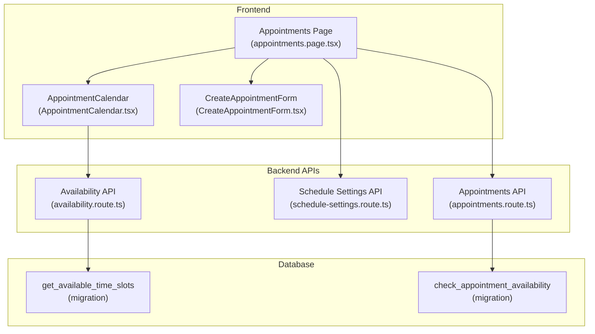
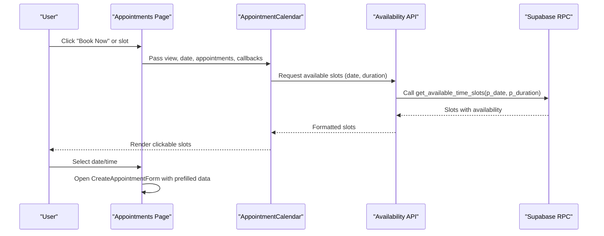
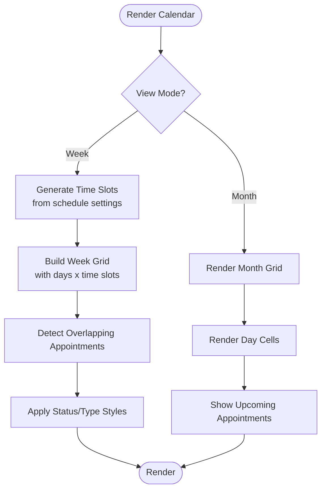
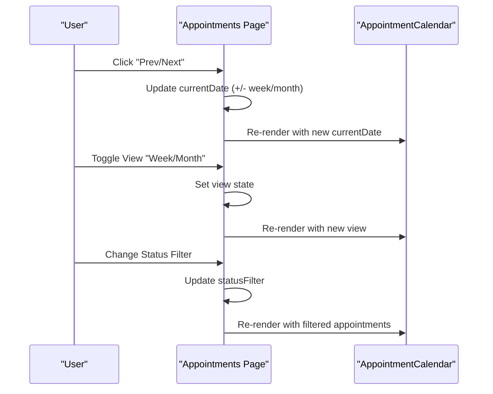
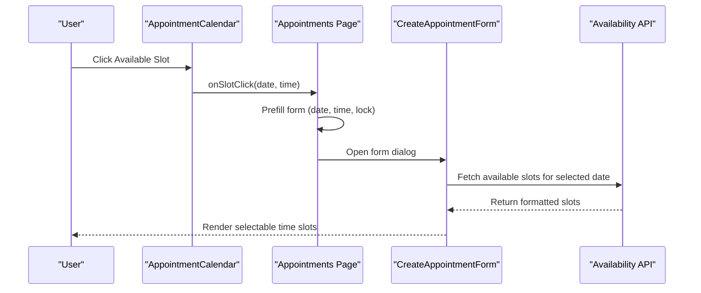
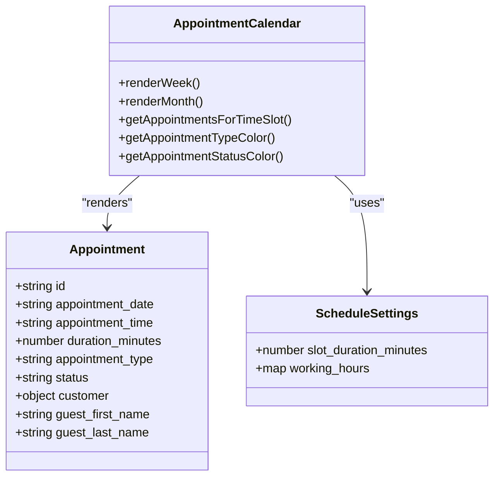
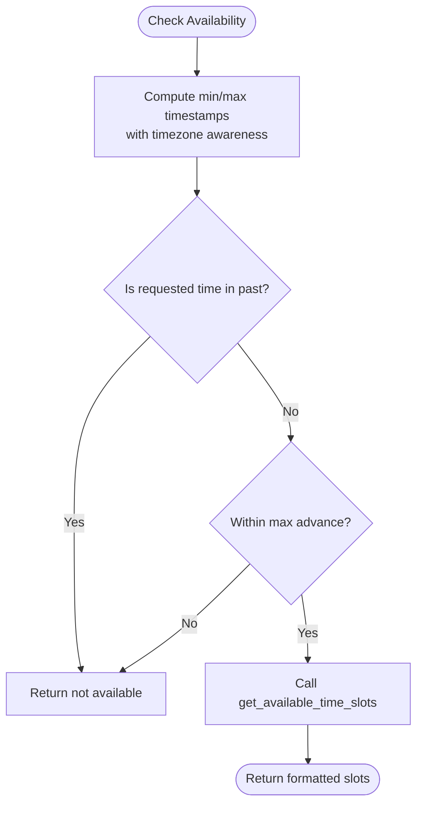
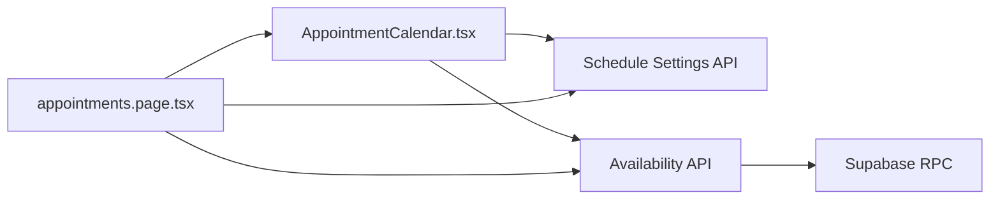

# Calendar Interface & Views

<cite>
**Referenced Files in This Document**
- [AppointmentCalendar.tsx](file://src/components/admin/AppointmentCalendar.tsx)
- [appointments.page.tsx](file://src/app/admin/appointments/page.tsx)
- [settings.page.tsx](file://src/app/admin/appointments/settings/page.tsx)
- [availability.route.ts](file://src/app/api/admin/appointments/availability/route.ts)
- [appointments.route.ts](file://src/app/api/admin/appointments/route.ts)
- [schedule-settings.route.ts](file://src/app/api/admin/schedule-settings/route.ts)
- [fix_timezone_check_appointment_availability.sql](file://supabase/migrations/20250127000003_fix_timezone_check_appointment_availability.sql)
- [fix_get_available_time_slots_past_filtering.sql](file://supabase/migrations/20250127000004_fix_get_available_time_slots_past_filtering.sql)
- [utils.ts](file://src/lib/utils.ts)
</cite>

## Table of Contents

1. [Introduction](#introduction)
2. [Project Structure](#project-structure)
3. [Core Components](#core-components)
4. [Architecture Overview](#architecture-overview)
5. [Detailed Component Analysis](#detailed-component-analysis)
6. [Dependency Analysis](#dependency-analysis)
7. [Performance Considerations](#performance-considerations)
8. [Troubleshooting Guide](#troubleshooting-guide)
9. [Conclusion](#conclusion)

## Introduction

This document provides comprehensive technical documentation for the calendar interface component that powers the appointment scheduling system. It focuses on the dual-view calendar implementation supporting week and month modes, navigation controls, date selection, view switching mechanisms, rendering logic, event display patterns, time slot visualization, click-to-book interactions, responsive design adaptations, timezone handling, event density management, and performance optimization for large datasets. It also covers customization options, event styling, and integration with the underlying scheduling backend.

## Project Structure

The calendar interface is composed of:

- A presentation component that renders the calendar grid and handles user interactions
- A parent page that orchestrates data fetching, view state, and navigation
- Backend APIs that provide availability checks and schedule settings
- Database migration functions that enforce timezone-aware availability logic

**Diagram sources**

- [appointments.page.tsx](file://src/app/admin/appointments/page.tsx#L112-L231)
- [AppointmentCalendar.tsx](file://src/components/admin/AppointmentCalendar.tsx#L72-L80)
- [availability.route.ts](file://src/app/api/admin/appointments/availability/route.ts#L14-L86)
- [schedule-settings.route.ts](file://src/app/api/admin/schedule-settings/route.ts#L103-L125)
- [appointments.route.ts](file://src/app/api/admin/appointments/route.ts#L337-L371)
- [fix_get_available_time_slots_past_filtering.sql](file://supabase/migrations/20250127000004_fix_get_available_time_slots_past_filtering.sql#L107-L116)
- [fix_timezone_check_appointment_availability.sql](file://supabase/migrations/20250127000003_fix_timezone_check_appointment_availability.sql#L98-L119)

**Section sources**

- [appointments.page.tsx](file://src/app/admin/appointments/page.tsx#L112-L231)
- [AppointmentCalendar.tsx](file://src/components/admin/AppointmentCalendar.tsx#L72-L80)

## Core Components

- AppointmentCalendar: Renders week and month views, generates time slots, applies schedule settings, manages click-to-book interactions, and displays events with status and type styling.
- Appointments Page: Manages view mode, date navigation, loading states, and integrates with the calendar component and availability API.
- Schedule Settings Page: Allows administrators to configure slot duration, default appointment duration, working hours, blocked dates, and booking windows.
- Availability API: Returns available time slots for a given date and duration, handling timezone-aware filtering and boolean availability normalization.
- Schedule Settings API: Provides operational hours and constraints for availability calculations.
- Database RPC Functions: Enforce timezone-aware availability checks and time-slot generation.

**Section sources**

- [AppointmentCalendar.tsx](file://src/components/admin/AppointmentCalendar.tsx#L29-L70)
- [appointments.page.tsx](file://src/app/admin/appointments/page.tsx#L112-L231)
- [settings.page.tsx](file://src/app/admin/appointments/settings/page.tsx#L35-L51)
- [availability.route.ts](file://src/app/api/admin/appointments/availability/route.ts#L14-L86)
- [schedule-settings.route.ts](file://src/app/api/admin/schedule-settings/route.ts#L103-L125)

## Architecture Overview

The calendar architecture follows a layered pattern:

- Presentation Layer: Calendar grid rendering and user interactions
- Orchestration Layer: Parent page managing state and API calls
- Backend Integration: Availability and schedule settings APIs
- Data Access: Supabase RPC functions with timezone-aware logic

**Diagram sources**

- [appointments.page.tsx](file://src/app/admin/appointments/page.tsx#L401-L412)
- [AppointmentCalendar.tsx](file://src/components/admin/AppointmentCalendar.tsx#L395-L425)
- [availability.route.ts](file://src/app/api/admin/appointments/availability/route.ts#L61-L86)
- [fix_get_available_time_slots_past_filtering.sql](file://supabase/migrations/20250127000004_fix_get_available_time_slots_past_filtering.sql#L107-L116)

## Detailed Component Analysis

### Calendar Rendering Logic

The calendar supports two primary views:

- Week View: Displays a scrollable grid with time slots along the vertical axis and week days along the horizontal axis. Each cell represents a time slot and may contain one or more overlapping appointments.
- Month View: Displays a grid of calendar days, each showing up to three upcoming appointments and a count of additional appointments.

Rendering logic includes:

- Time slot generation based on schedule settings (slot duration, working hours, lunch breaks)
- Past-date and past-time filtering to prevent booking unavailable slots
- Dynamic height calculation for appointment blocks based on duration and slot size
- Status and type-based styling for appointments

**Diagram sources**

- [AppointmentCalendar.tsx](file://src/components/admin/AppointmentCalendar.tsx#L85-L143)
- [AppointmentCalendar.tsx](file://src/components/admin/AppointmentCalendar.tsx#L342-L523)
- [AppointmentCalendar.tsx](file://src/components/admin/AppointmentCalendar.tsx#L525-L628)

**Section sources**

- [AppointmentCalendar.tsx](file://src/components/admin/AppointmentCalendar.tsx#L85-L143)
- [AppointmentCalendar.tsx](file://src/components/admin/AppointmentCalendar.tsx#L342-L523)
- [AppointmentCalendar.tsx](file://src/components/admin/AppointmentCalendar.tsx#L525-L628)

### Navigation Controls and View Switching

Navigation is handled by the parent page:

- Previous/Next buttons adjust the current date by week or month depending on the view
- Today button resets to the current date
- View selector toggles between week and month modes
- Status filter narrows displayed appointments

**Diagram sources**

- [appointments.page.tsx](file://src/app/admin/appointments/page.tsx#L223-L231)
- [appointments.page.tsx](file://src/app/admin/appointments/page.tsx#L526-L540)
- [appointments.page.tsx](file://src/app/admin/appointments/page.tsx#L542-L578)

**Section sources**

- [appointments.page.tsx](file://src/app/admin/appointments/page.tsx#L223-L231)
- [appointments.page.tsx](file://src/app/admin/appointments/page.tsx#L526-L540)
- [appointments.page.tsx](file://src/app/admin/appointments/page.tsx#L542-L578)

### Click-to-Book Interactions

Click-to-book enables quick creation of new appointments:

- In week view, clicking an available slot triggers a callback to open the create form with prefilled date and time
- In month view, clicking an empty day cell opens the form and highlights the selected date
- The create form validates availability via the availability API before submission

**Diagram sources**

- [AppointmentCalendar.tsx](file://src/components/admin/AppointmentCalendar.tsx#L421-L425)
- [appointments.page.tsx](file://src/app/admin/appointments/page.tsx#L401-L412)
- [CreateAppointmentForm.tsx](file://src/components/admin/CreateAppointmentForm.tsx#L227-L305)

**Section sources**

- [AppointmentCalendar.tsx](file://src/components/admin/AppointmentCalendar.tsx#L421-L425)
- [appointments.page.tsx](file://src/app/admin/appointments/page.tsx#L401-L412)
- [CreateAppointmentForm.tsx](file://src/components/admin/CreateAppointmentForm.tsx#L227-L305)

### Event Display Patterns and Time Slot Visualization

Event rendering emphasizes clarity and density management:

- Week view: Appointment blocks are absolutely positioned within their start time slot, sized proportionally to duration
- Month view: Each day shows up to three upcoming appointments with truncated labels and a "+N" indicator for overflow
- Status and type icons/badges provide immediate visual cues
- Hover states and subtle animations enhance interactivity

**Diagram sources**

- [AppointmentCalendar.tsx](file://src/components/admin/AppointmentCalendar.tsx#L29-L70)
- [AppointmentCalendar.tsx](file://src/components/admin/AppointmentCalendar.tsx#L301-L317)
- [AppointmentCalendar.tsx](file://src/components/admin/AppointmentCalendar.tsx#L257-L285)

**Section sources**

- [AppointmentCalendar.tsx](file://src/components/admin/AppointmentCalendar.tsx#L257-L285)
- [AppointmentCalendar.tsx](file://src/components/admin/AppointmentCalendar.tsx#L301-L317)
- [AppointmentCalendar.tsx](file://src/components/admin/AppointmentCalendar.tsx#L457-L512)
- [AppointmentCalendar.tsx](file://src/components/admin/AppointmentCalendar.tsx#L580-L614)

### Drag-and-Drop Functionality

The current implementation does not include drag-and-drop for rescheduling. The calendar provides click-to-book interactions and event click handlers for viewing/editing existing appointments. To implement drag-and-drop:

- Integrate a library such as react-dnd or @dnd-kit
- Add draggable attributes to appointment blocks in week view
- Implement drop targets aligned to time slots
- Validate drop positions against schedule settings and availability
- Persist rescheduling via the appointments API

[No sources needed since this section proposes future enhancements]

### Responsive Design Adaptations

The calendar adapts to different screen sizes:

- Week view uses a scrollable container with sticky headers for usability on small screens
- Month view adjusts to grid layouts with appropriate spacing
- Mobile-friendly floating action buttons for quick actions
- Tailwind utility classes manage breakpoints and responsive typography

**Section sources**

- [AppointmentCalendar.tsx](file://src/components/admin/AppointmentCalendar.tsx#L349-L350)
- [AppointmentCalendar.tsx](file://src/components/admin/AppointmentCalendar.tsx#L529-L538)
- [settings.page.tsx](file://src/app/admin/appointments/settings/page.tsx#L617-L629)

### Timezone Handling

Timezone-awareness is enforced in backend functions:

- Availability checks compare appointment timestamps against minimum advance booking windows using timezone-aware comparisons
- Time-slot generation filters out past slots based on current time in the configured timezone
- The availability API normalizes PostgreSQL TIME types and boolean availability flags for consistent frontend consumption

**Diagram sources**

- [fix_timezone_check_appointment_availability.sql](file://supabase/migrations/20250127000003_fix_timezone_check_appointment_availability.sql#L98-L119)
- [fix_get_available_time_slots_past_filtering.sql](file://supabase/migrations/20250127000004_fix_get_available_time_slots_past_filtering.sql#L107-L116)
- [availability.route.ts](file://src/app/api/admin/appointments/availability/route.ts#L137-L152)

**Section sources**

- [fix_timezone_check_appointment_availability.sql](file://supabase/migrations/20250127000003_fix_timezone_check_appointment_availability.sql#L98-L119)
- [fix_get_available_time_slots_past_filtering.sql](file://supabase/migrations/20250127000004_fix_get_available_time_slots_past_filtering.sql#L107-L116)
- [availability.route.ts](file://src/app/api/admin/appointments/availability/route.ts#L137-L152)

### Event Density Management

The calendar employs several strategies to manage dense schedules:

- Month view truncates visible appointments per day and shows overflow counts
- Week view overlays appointments vertically within time slots, using absolute positioning and proportional sizing
- Status and type colors provide quick scanning of appointment states and types

**Section sources**

- [AppointmentCalendar.tsx](file://src/components/admin/AppointmentCalendar.tsx#L580-L614)
- [AppointmentCalendar.tsx](file://src/components/admin/AppointmentCalendar.tsx#L457-L512)

### Implementation Details and Customization Options

Customization is achieved through:

- Schedule settings: slot duration, default appointment duration, working hours, lunch breaks, blocked dates, and booking windows
- Event styling: status-specific colors and badges, type-specific icons
- UI theming: shared design tokens and utility classes for consistent appearance

Integration points:

- Calendar communicates with the availability API to validate selections
- Parent page fetches appointments and schedule settings, passing them down to the calendar
- Backend RPC functions encapsulate business logic for availability and time-slot generation

**Section sources**

- [settings.page.tsx](file://src/app/admin/appointments/settings/page.tsx#L35-L51)
- [AppointmentCalendar.tsx](file://src/components/admin/AppointmentCalendar.tsx#L257-L285)
- [utils.ts](file://src/lib/utils.ts#L4-L6)

## Dependency Analysis

The calendar component depends on:

- Schedule settings for generating time slots and validating availability
- Availability API for real-time slot availability
- Parent page for orchestration and data fetching
- Utility functions for class merging and formatting

**Diagram sources**

- [AppointmentCalendar.tsx](file://src/components/admin/AppointmentCalendar.tsx#L72-L80)
- [appointments.page.tsx](file://src/app/admin/appointments/page.tsx#L159-L221)
- [availability.route.ts](file://src/app/api/admin/appointments/availability/route.ts#L61-L86)
- [schedule-settings.route.ts](file://src/app/api/admin/schedule-settings/route.ts#L103-L125)

**Section sources**

- [AppointmentCalendar.tsx](file://src/components/admin/AppointmentCalendar.tsx#L72-L80)
- [appointments.page.tsx](file://src/app/admin/appointments/page.tsx#L159-L221)

## Performance Considerations

- Memoized computations: Time slots and derived arrays are computed with memoization to avoid unnecessary recalculations
- Virtualization: Consider implementing virtualized lists for long time slots in week view to improve rendering performance
- Debounced availability queries: Throttle availability API calls when users rapidly change dates
- Efficient filtering: Use indexed date comparisons and avoid deep cloning of large appointment arrays
- Lazy loading: The calendar component is dynamically imported to reduce initial bundle size

[No sources needed since this section provides general guidance]

## Troubleshooting Guide

Common issues and resolutions:

- No available slots returned: Verify schedule settings and blocked dates; ensure the date and duration parameters are correctly passed to the availability API
- Incorrect timezone behavior: Confirm backend RPC functions are using timezone-aware comparisons and that the client passes the correct branch context
- Past slot bookings: Ensure the calendar's past-time filtering aligns with schedule settings and that the availability API excludes past slots
- Excessive re-renders: Check that memoization is applied to expensive computations and that props are stable

**Section sources**

- [availability.route.ts](file://src/app/api/admin/appointments/availability/route.ts#L108-L152)
- [fix_timezone_check_appointment_availability.sql](file://supabase/migrations/20250127000003_fix_timezone_check_appointment_availability.sql#L98-L119)
- [AppointmentCalendar.tsx](file://src/components/admin/AppointmentCalendar.tsx#L146-L211)

## Conclusion

The calendar interface provides a robust, customizable, and responsive solution for appointment scheduling. Its dual-view design, integrated availability checks, and clear event visualization enable efficient booking workflows. By leveraging schedule settings, backend RPC functions, and thoughtful performance optimizations, the system scales to handle large datasets while maintaining a smooth user experience.
