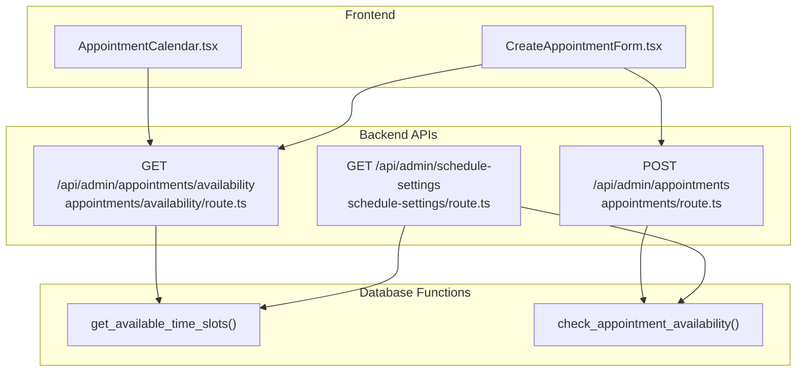
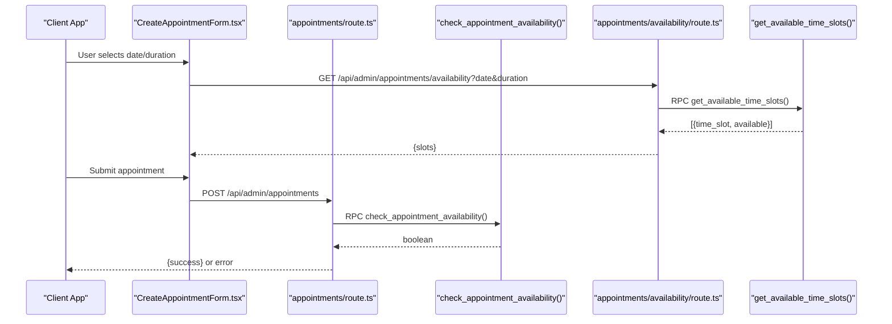
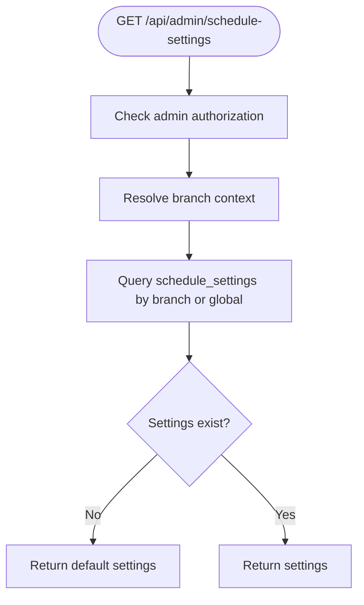
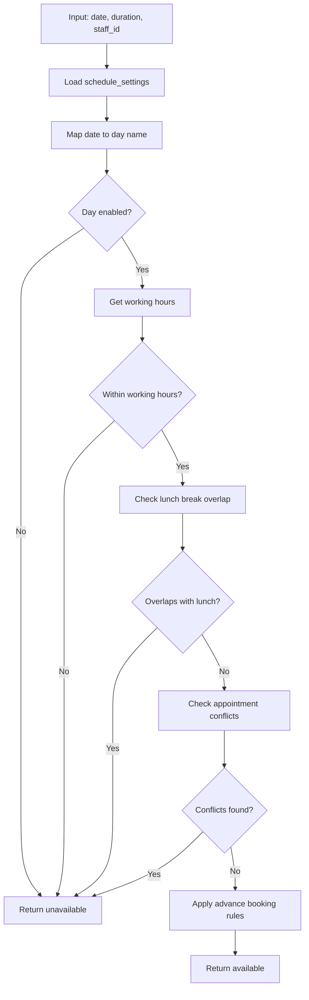
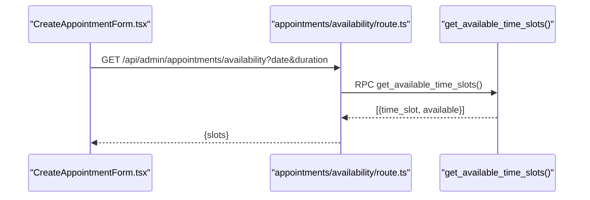
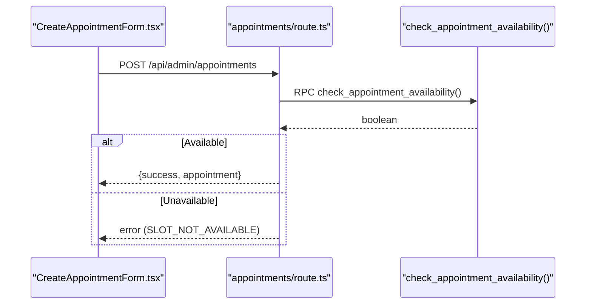
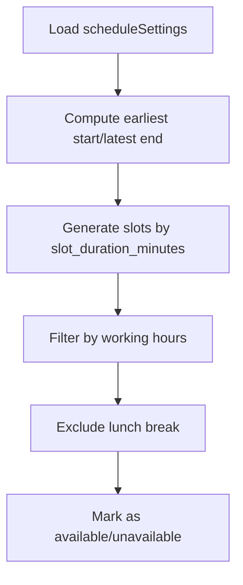
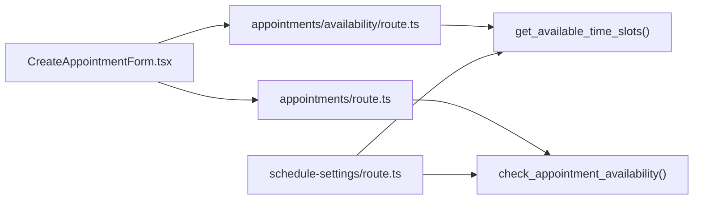

# Scheduling Rules & Availability

<cite>
**Referenced Files in This Document**
- [schedule-settings/route.ts](file://src/app/api/admin/schedule-settings/route.ts)
- [appointments/availability/route.ts](file://src/app/api/admin/appointments/availability/route.ts)
- [appointments/route.ts](file://src/app/api/admin/appointments/route.ts)
- [CreateAppointmentForm.tsx](file://src/components/admin/CreateAppointmentForm.tsx)
- [AppointmentCalendar.tsx](file://src/components/admin/AppointmentCalendar.tsx)
- [create_schedule_settings_system.sql](file://supabase/migrations/20250126000000_create_schedule_settings_system.sql)
- [fix_check_appointment_availability.sql](file://supabase/migrations/20250127000001_fix_check_appointment_availability.sql)
- [debug_check_appointment_availability.sql](file://supabase/migrations/20250127000002_debug_check_appointment_availability.sql)
- [fix_timezone_check_appointment_availability.sql](file://supabase/migrations/20250127000003_fix_timezone_check_appointment_availability.sql)
</cite>

## Table of Contents

1. [Introduction](#introduction)
2. [Project Structure](#project-structure)
3. [Core Components](#core-components)
4. [Architecture Overview](#architecture-overview)
5. [Detailed Component Analysis](#detailed-component-analysis)
6. [Dependency Analysis](#dependency-analysis)
7. [Performance Considerations](#performance-considerations)
8. [Troubleshooting Guide](#troubleshooting-guide)
9. [Conclusion](#conclusion)

## Introduction

This document explains the scheduling rules and availability management system for Opttius, focusing on configuring business hours, provider availability, and resource constraints. It details the rule engine that determines available time slots, handles overlapping bookings, and manages provider capacity limits. It also covers business hours configuration, break scheduling, exception handling for holidays and special events, availability calculation algorithms, conflict resolution strategies, real-time slot availability checking, timezone management, rule inheritance patterns, and performance optimization for complex scheduling scenarios.

## Project Structure

The scheduling system spans three main areas:

- Frontend components for displaying and interacting with schedules
- Backend APIs for retrieving schedule settings, checking availability, and creating appointments
- Database functions implementing the scheduling rules and availability logic

**Diagram sources**

- [schedule-settings/route.ts](file://src/app/api/admin/schedule-settings/route.ts#L1-L135)
- [appointments/availability/route.ts](file://src/app/api/admin/appointments/availability/route.ts#L1-L172)
- [appointments/route.ts](file://src/app/api/admin/appointments/route.ts#L305-L421)
- [create_schedule_settings_system.sql](file://supabase/migrations/20250126000000_create_schedule_settings_system.sql#L45-L154)
- [create_schedule_settings_system.sql](file://supabase/migrations/20250126000000_create_schedule_settings_system.sql#L155-L251)

**Section sources**

- [schedule-settings/route.ts](file://src/app/api/admin/schedule-settings/route.ts#L1-L135)
- [appointments/availability/route.ts](file://src/app/api/admin/appointments/availability/route.ts#L1-L172)
- [appointments/route.ts](file://src/app/api/admin/appointments/route.ts#L305-L421)
- [create_schedule_settings_system.sql](file://supabase/migrations/20250126000000_create_schedule_settings_system.sql#L1-L307)

## Core Components

- Schedule Settings API: Retrieves and updates business hours, slot durations, buffer times, blocked dates, and advance booking constraints.
- Availability API: Returns available time slots for a given date and duration, considering working hours, breaks, blocked dates, and existing appointments.
- Appointment Creation API: Validates availability for a proposed appointment and persists it if available.
- Frontend Components: Render calendars, manage customer selection, and display available slots.

Key configuration fields include:

- Slot duration minutes
- Default appointment duration
- Buffer time minutes
- Working hours per day (enabled, start/end times, optional lunch break)
- Blocked dates (holidays, special closures)
- Minimum advance booking hours
- Maximum advance booking days
- Staff-specific settings (JSONB for per-staff overrides)

**Section sources**

- [schedule-settings/route.ts](file://src/app/api/admin/schedule-settings/route.ts#L61-L125)
- [create_schedule_settings_system.sql](file://supabase/migrations/20250126000000_create_schedule_settings_system.sql#L6-L43)
- [create_schedule_settings_system.sql](file://supabase/migrations/20250126000000_create_schedule_settings_system.sql#L155-L251)

## Architecture Overview

The system uses a hybrid approach: frontend components request availability from backend APIs, which delegate to Postgres functions for deterministic, atomic calculations. This ensures consistency across concurrent requests and prevents race conditions.

**Diagram sources**

- [CreateAppointmentForm.tsx](file://src/components/admin/CreateAppointmentForm.tsx#L227-L305)
- [appointments/route.ts](file://src/app/api/admin/appointments/route.ts#L305-L421)
- [appointments/availability/route.ts](file://src/app/api/admin/appointments/availability/route.ts#L54-L106)
- [create_schedule_settings_system.sql](file://supabase/migrations/20250126000000_create_schedule_settings_system.sql#L155-L251)
- [create_schedule_settings_system.sql](file://supabase/migrations/20250126000000_create_schedule_settings_system.sql#L45-L154)

## Detailed Component Analysis

### Schedule Settings Management

The schedule settings API supports:

- Retrieving current branch or global defaults
- Updating settings with branch-scoped or global propagation for super admins
- Enforcing admin authorization and branch context

**Diagram sources**

- [schedule-settings/route.ts](file://src/app/api/admin/schedule-settings/route.ts#L8-L127)

**Section sources**

- [schedule-settings/route.ts](file://src/app/api/admin/schedule-settings/route.ts#L1-L135)

### Availability Calculation Engine

The database functions implement the core scheduling logic:

- get_available_time_slots:
  - Iterates through working hours for the target day
  - Generates fixed-duration slots based on slot_duration_minutes
  - Marks slots unavailable if:
    - Within lunch break
    - Overlaps with existing confirmed/scheduled appointments
    - Outside advance booking windows
  - Returns slot time and availability flag

- check_appointment_availability:
  - Validates a single time slot against working hours, breaks, and conflicts
  - Applies minimum/maximum advance booking constraints
  - Used for real-time validation during appointment creation

**Diagram sources**

- [create_schedule_settings_system.sql](file://supabase/migrations/20250126000000_create_schedule_settings_system.sql#L45-L154)
- [create_schedule_settings_system.sql](file://supabase/migrations/20250126000000_create_schedule_settings_system.sql#L155-L251)

**Section sources**

- [create_schedule_settings_system.sql](file://supabase/migrations/20250126000000_create_schedule_settings_system.sql#L45-L154)
- [create_schedule_settings_system.sql](file://supabase/migrations/20250126000000_create_schedule_settings_system.sql#L155-L251)

### Real-Time Availability Checking

The availability API:

- Accepts date, duration, and optional staff_id
- Calls get_available_time_slots via RPC
- Normalizes returned slot formats and availability booleans
- Returns structured slot data for the UI

**Diagram sources**

- [appointments/availability/route.ts](file://src/app/api/admin/appointments/availability/route.ts#L54-L163)

**Section sources**

- [appointments/availability/route.ts](file://src/app/api/admin/appointments/availability/route.ts#L1-L172)

### Appointment Creation and Conflict Resolution

The appointment creation API:

- Validates admin authorization and branch context
- Checks availability using check_appointment_availability
- Rejects if unavailable with detailed error context
- Creates the appointment upon success

**Diagram sources**

- [appointments/route.ts](file://src/app/api/admin/appointments/route.ts#L305-L421)
- [create_schedule_settings_system.sql](file://supabase/migrations/20250126000000_create_schedule_settings_system.sql#L155-L251)

**Section sources**

- [appointments/route.ts](file://src/app/api/admin/appointments/route.ts#L305-L421)

### Frontend Calendar and Slot Rendering

The calendar component:

- Generates time slots based on schedule settings
- Filters slots by working hours and lunch breaks
- Highlights clickable slots and displays appointment overlays
- Integrates with availability API for dynamic updates

**Diagram sources**

- [AppointmentCalendar.tsx](file://src/components/admin/AppointmentCalendar.tsx#L83-L143)

**Section sources**

- [AppointmentCalendar.tsx](file://src/components/admin/AppointmentCalendar.tsx#L83-L211)

### Business Hours Configuration and Break Scheduling

- Working hours are stored as JSONB with per-day configuration:
  - enabled flag
  - start_time and end_time
  - Optional lunch_start and lunch_end
- Blocked dates array supports holidays and special closures
- Advance booking controls:
  - min_advance_booking_hours (today-only restriction)
  - max_advance_booking_days (future limit)

**Section sources**

- [create_schedule_settings_system.sql](file://supabase/migrations/20250126000000_create_schedule_settings_system.sql#L14-L43)
- [fix_check_appointment_availability.sql](file://supabase/migrations/20250127000001_fix_check_appointment_availability.sql#L30-L96)

### Exception Handling for Holidays and Special Events

- Blocked dates are enforced in both availability functions
- Debug logs in the availability checker help diagnose rejections
- The system distinguishes between:
  - Disabled days (enabled=false)
  - Blocked dates (holidays)
  - Lunch breaks
  - Conflicting appointments

**Section sources**

- [create_schedule_settings_system.sql](file://supabase/migrations/20250126000000_create_schedule_settings_system.sql#L93-L96)
- [debug_check_appointment_availability.sql](file://supabase/migrations/20250127000002_debug_check_appointment_availability.sql#L42-L46)

### Timezone Management

- The availability checker was updated to handle timezone differences between client time and server time
- When min_advance_booking_hours > 0 and date is today, timestamps are compared using explicit timezone-aware casting
- For robustness, ensure clients send consistent time representations

**Section sources**

- [fix_timezone_check_appointment_availability.sql](file://supabase/migrations/20250127000003_fix_timezone_check_appointment_availability.sql#L93-L105)

### Rule Inheritance Patterns

- Global vs branch-level settings:
  - Super admins can update global defaults that propagate to all branches
  - Branch-specific updates override global settings
- Staff-specific settings are supported via JSONB for per-provider overrides

**Section sources**

- [schedule-settings/route.ts](file://src/app/api/admin/schedule-settings/route.ts#L198-L320)
- [create_schedule_settings_system.sql](file://supabase/migrations/20250126000000_create_schedule_settings_system.sql#L33-L34)

## Dependency Analysis

The system exhibits clear separation of concerns:

- Frontend depends on backend APIs
- Backend APIs depend on database functions
- Database functions encapsulate all scheduling logic

**Diagram sources**

- [CreateAppointmentForm.tsx](file://src/components/admin/CreateAppointmentForm.tsx#L227-L305)
- [appointments/availability/route.ts](file://src/app/api/admin/appointments/availability/route.ts#L54-L163)
- [appointments/route.ts](file://src/app/api/admin/appointments/route.ts#L305-L421)
- [schedule-settings/route.ts](file://src/app/api/admin/schedule-settings/route.ts#L1-L135)
- [create_schedule_settings_system.sql](file://supabase/migrations/20250126000000_create_schedule_settings_system.sql#L45-L154)
- [create_schedule_settings_system.sql](file://supabase/migrations/20250126000000_create_schedule_settings_system.sql#L155-L251)

**Section sources**

- [CreateAppointmentForm.tsx](file://src/components/admin/CreateAppointmentForm.tsx#L227-L305)
- [appointments/availability/route.ts](file://src/app/api/admin/appointments/availability/route.ts#L1-L172)
- [appointments/route.ts](file://src/app/api/admin/appointments/route.ts#L305-L421)
- [schedule-settings/route.ts](file://src/app/api/admin/schedule-settings/route.ts#L1-L135)

## Performance Considerations

- Database functions compute availability deterministically, minimizing frontend computation
- Queries filter by date, status, and optional staff_id to reduce result sets
- JSONB storage enables flexible per-day configurations without joins
- Consider indexing on appointments(appointment_date, status, assigned_to) for large datasets
- Batch customer and staff lookups in appointment retrieval prevent N+1 queries

[No sources needed since this section provides general guidance]

## Troubleshooting Guide

Common issues and resolutions:

- Availability checker rejects slots unexpectedly:
  - Verify working hours and lunch break configuration
  - Check blocked_dates for the target date
  - Confirm advance booking constraints (min/max)
- Timezone-related failures:
  - Ensure consistent time representation across client/server
  - Review timezone-aware timestamp comparisons in the availability checker
- Past-slot filtering:
  - Past slots are filtered by the availability function; verify min_advance_booking_hours and current time
- Debugging:
  - Use the debug version of the availability checker to log rejection reasons

**Section sources**

- [debug_check_appointment_availability.sql](file://supabase/migrations/20250127000002_debug_check_appointment_availability.sql#L28-L117)
- [fix_timezone_check_appointment_availability.sql](file://supabase/migrations/20250127000003_fix_timezone_check_appointment_availability.sql#L93-L105)

## Conclusion

The Opttius scheduling system combines configurable business rules with robust database functions to provide accurate, real-time availability checks. Its architecture separates frontend UX from backend scheduling logic, ensuring consistency and scalability. By leveraging JSONB configurations, strict conflict detection, and timezone-aware comparisons, the system supports complex scheduling scenarios while remaining maintainable and observable.
