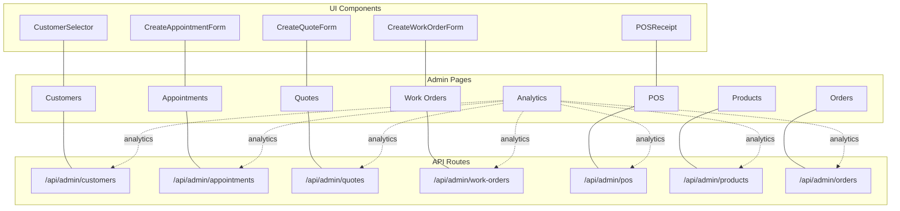
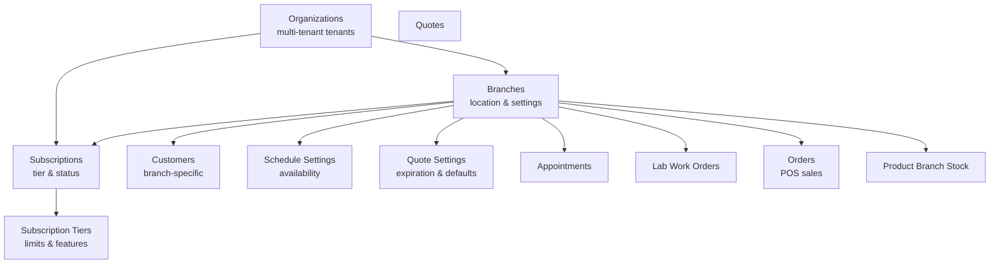
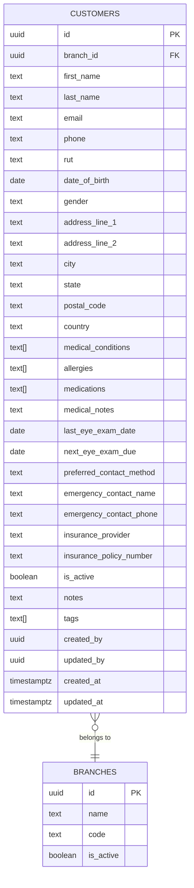
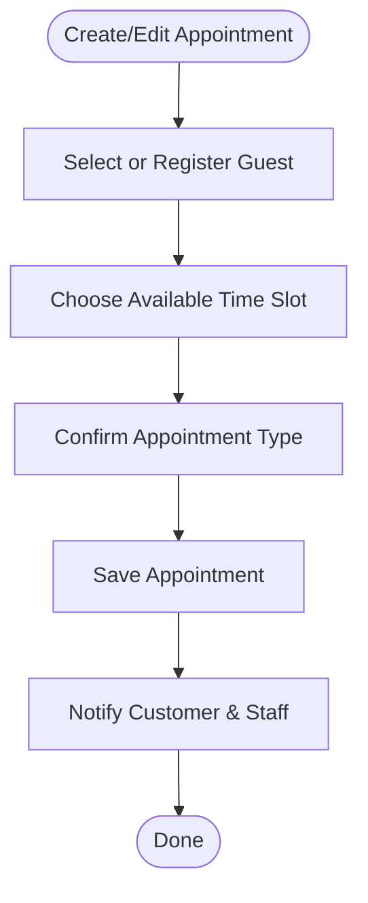
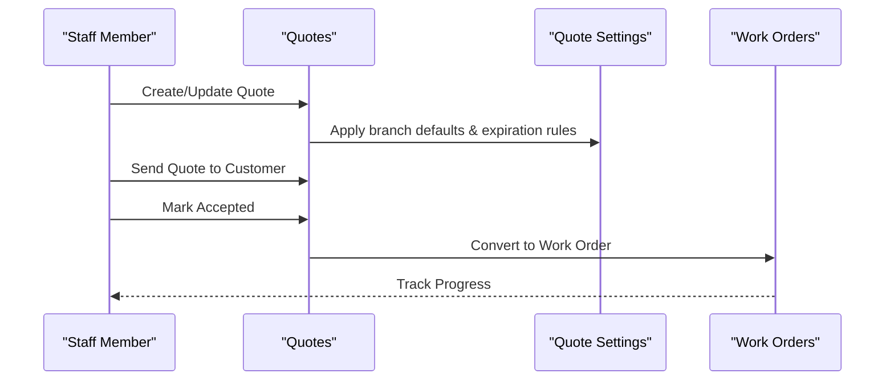
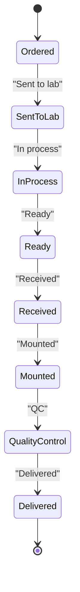
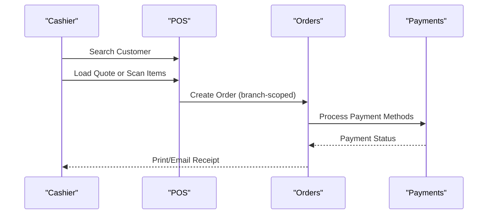
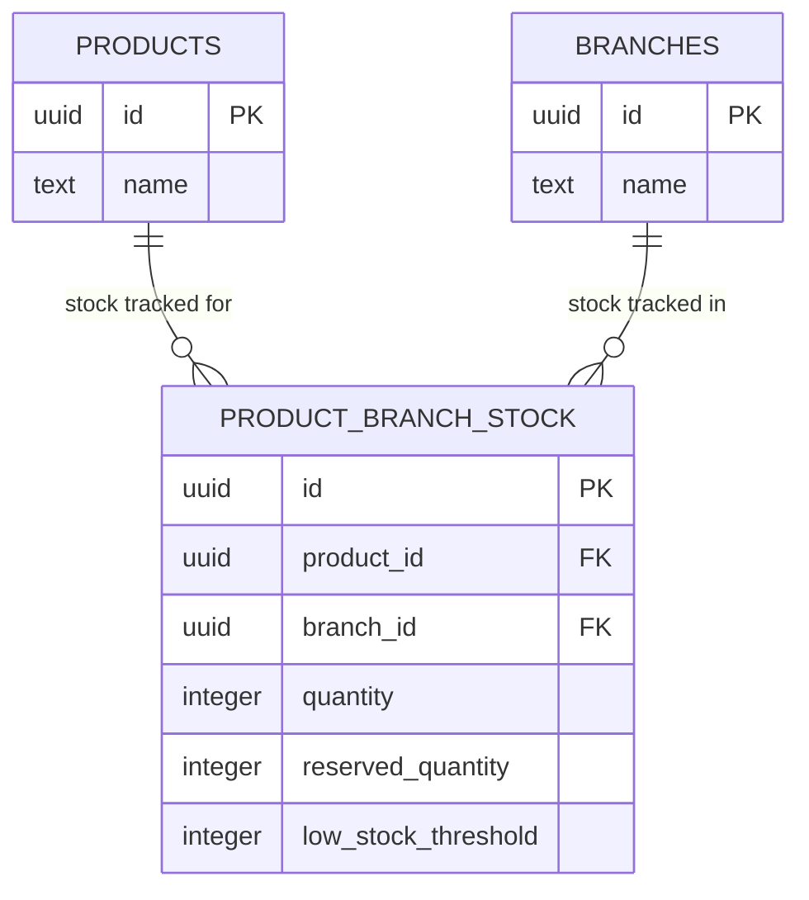
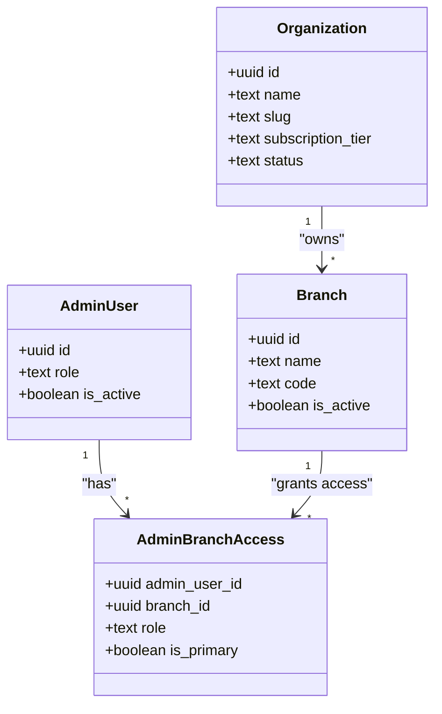
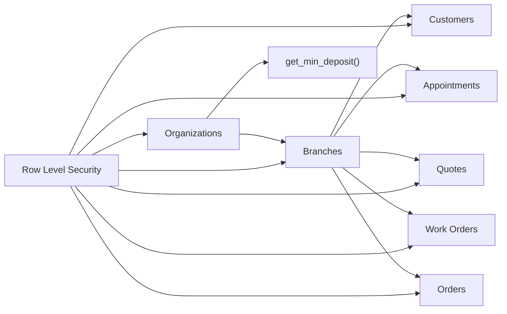

# Core Features

<cite>
**Referenced Files in This Document**
- [README.md](file://README.md)
- [SETUP_GUIDE.md](file://SETUP_GUIDE.md)
- [src/lib/utils/rut.ts](file://src/lib/utils/rut.ts)
- [supabase/migrations/20251216000000_create_branches_system.sql](file://supabase/migrations/20251216000000_create_branches_system.sql)
- [supabase/migrations/20251218000000_separate_customers_from_users.sql](file://supabase/migrations/20251218000000_separate_customers_from_users.sql)
- [supabase/migrations/20260128000000_create_organizations_and_subscriptions.sql](file://supabase/migrations/20260128000000_create_organizations_and_subscriptions.sql)
- [supabase/migrations/20260122000005_create_organization_settings.sql](file://supabase/migrations/20260122000005_create_organization_settings.sql)
</cite>

## Table of Contents

1. [Introduction](#introduction)
2. [Project Structure](#project-structure)
3. [Core Components](#core-components)
4. [Architecture Overview](#architecture-overview)
5. [Detailed Component Analysis](#detailed-component-analysis)
6. [Dependency Analysis](#dependency-analysis)
7. [Performance Considerations](#performance-considerations)
8. [Troubleshooting Guide](#troubleshooting-guide)
9. [Conclusion](#conclusion)
10. [Appendices](#appendices)

## Introduction

This document presents the complete optical management workflow implemented in Opttius, covering the integrated lifecycle from patient acquisition to treatment completion. It documents how the system orchestrates customer management, appointment scheduling, quote generation, work order processing, point-of-sale operations, and inventory management. It also explains the multi-tenant architecture that enables independent optical chains with robust data isolation, and provides both conceptual overviews for practitioners and technical implementation details for developers.

## Project Structure

Opttius is a Next.js 14 application with a Supabase backend. The optical workflow spans several feature areas:

- Administration pages for managing customers, appointments, quotes, work orders, POS, products, orders, and analytics
- API routes supporting administrative operations and integrations
- UI components for forms, calendars, receipts, and dashboards
- A comprehensive database schema with multi-branch and multi-tenant foundations

**Section sources**

- [README.md](file://README.md#L283-L331)

## Core Components

This section outlines the core optical workflow components and how they interrelate to support the full business lifecycle.

- Customer Management
  - Branch-specific customer records separate from application users
  - Supports optional identifiers (e.g., RUT), addresses, medical history, and contact preferences
  - RLS ensures access only within assigned branches; super admins gain global visibility

- Appointment Scheduling
  - Interactive calendar with weekly/monthly views and configurable time slots
  - Availability checks, blocking days, and flexible appointment types
  - Supports guest customers who become registered upon attendance

- Quote Generation
  - Detailed quotes for frames, lenses, treatments, and labor
  - Automatic expiration and conversion to work orders
  - Email delivery and print/PDF generation

- Work Order Processing
  - Lifecycle tracking with statuses from ordered to delivered
  - Timeline visualization, status history, and staff assignment
  - Links to original quotes

- Point of Sale (POS)
  - Fast checkout with customer lookup, quote loading, and bundled items
  - Multiple payment methods (cash, debit, credit, installments)
  - Automatic tax and discount calculations

- Inventory Management
  - Branch-specific stock tracking per product
  - Low-stock thresholds and reserved quantities for pending orders
  - Centralized product catalog with customizable options

- Multi-Tenant Architecture
  - Organizations (optical chains) with subscription tiers and limits
  - Branches under organizations with granular access control
  - Data isolation enforced via RLS and branch/context-aware queries

**Section sources**

- [README.md](file://README.md#L7-L86)
- [supabase/migrations/20251218000000_separate_customers_from_users.sql](file://supabase/migrations/20251218000000_separate_customers_from_users.sql#L6-L59)
- [supabase/migrations/20251216000000_create_branches_system.sql](file://supabase/migrations/20251216000000_create_branches_system.sql#L4-L96)
- [supabase/migrations/20260128000000_create_organizations_and_subscriptions.sql](file://supabase/migrations/20260128000000_create_organizations_and_subscriptions.sql#L5-L44)

## Architecture Overview

The optical workflow is built on a multi-branch, multi-tenant architecture with Supabase RLS enforcing data isolation. Organizations own branches; branches own customers, appointments, quotes, work orders, and orders. Inventory is tracked per branch per product. POS integrates with orders and payment processing.

**Diagram sources**

- [supabase/migrations/20260128000000_create_organizations_and_subscriptions.sql](file://supabase/migrations/20260128000000_create_organizations_and_subscriptions.sql#L5-L31)
- [supabase/migrations/20251216000000_create_branches_system.sql](file://supabase/migrations/20251216000000_create_branches_system.sql#L4-L96)
- [supabase/migrations/20251218000000_separate_customers_from_users.sql](file://supabase/migrations/20251218000000_separate_customers_from_users.sql#L6-L59)

**Section sources**

- [supabase/migrations/20260128000000_create_organizations_and_subscriptions.sql](file://supabase/migrations/20260128000000_create_organizations_and_subscriptions.sql#L1-L287)
- [supabase/migrations/20251216000000_create_branches_system.sql](file://supabase/migrations/20251216000000_create_branches_system.sql#L1-L397)
- [supabase/migrations/20251218000000_separate_customers_from_users.sql](file://supabase/migrations/20251218000000_separate_customers_from_users.sql#L1-L157)

## Detailed Component Analysis

### Customer Management

- Purpose: Maintain branch-specific customer profiles with medical and contact details
- Key behaviors:
  - RUT normalization and formatting utilities
  - Optional contact info and emergency contacts
  - Active status and tagging for segmentation
- Data model highlights:
  - Branch association for isolation
  - Created/updated by user tracking
  - Indexes for efficient lookups (email, phone, RUT, name)
- Access control:
  - Super admins: view/update/delete all
  - Branch admins: view/update/delete within assigned branches

**Diagram sources**

- [supabase/migrations/20251218000000_separate_customers_from_users.sql](file://supabase/migrations/20251218000000_separate_customers_from_users.sql#L6-L59)
- [supabase/migrations/20251216000000_create_branches_system.sql](file://supabase/migrations/20251216000000_create_branches_system.sql#L4-L21)

**Section sources**

- [src/lib/utils/rut.ts](file://src/lib/utils/rut.ts#L1-L65)
- [supabase/migrations/20251218000000_separate_customers_from_users.sql](file://supabase/migrations/20251218000000_separate_customers_from_users.sql#L6-L59)

### Appointment Scheduling

- Purpose: Manage appointment availability and types with branch scoping
- Key behaviors:
  - Calendar views with time-slot configuration
  - Availability checks and blocking days
  - Support for guest customers
- Data model highlights:
  - Branch foreign key for isolation
  - Schedule settings per branch
- Access control:
  - Branch admins can manage appointments within their branches

**Section sources**

- [README.md](file://README.md#L15-L23)
- [supabase/migrations/20251216000000_create_branches_system.sql](file://supabase/migrations/20251216000000_create_branches_system.sql#L70-L95)

### Quote Generation

- Purpose: Create detailed quotes convertible to work orders
- Key behaviors:
  - Items: frames, lenses, treatments, labor
  - Expiration automation and status transitions
  - Email delivery and print/PDF generation
- Data model highlights:
  - Branch-scoped quotes
  - Quote settings per branch for expiration and defaults
- Access control:
  - Branch admins can manage quotes within their branches

**Section sources**

- [README.md](file://README.md#L24-L32)
- [supabase/migrations/20251216000000_create_branches_system.sql](file://supabase/migrations/20251216000000_create_branches_system.sql#L74-L95)

### Work Order Processing

- Purpose: Full lifecycle tracking for lab work orders
- Key behaviors:
  - Status transitions from ordered to delivered
  - Timeline visualization and status history
  - Staff assignment and link to original quotes
- Data model highlights:
  - Branch-scoped work orders
  - Status history table
- Access control:
  - Branch admins can manage within their branches

**Section sources**

- [README.md](file://README.md#L33-L41)
- [supabase/migrations/20251216000000_create_branches_system.sql](file://supabase/migrations/20251216000000_create_branches_system.sql#L58-L64)

### Point of Sale (POS)

- Purpose: Fast checkout with customer lookup, quote loading, and multiple payment methods
- Key behaviors:
  - Customer search by RUT/name/email/phone
  - Load existing quotes into cart
  - Automatic tax and discount calculations
- Data model highlights:
  - Orders linked to branch and POS sessions
  - Payment method metadata and partial payments
- Access control:
  - Branch admins can manage POS within their branches

**Section sources**

- [README.md](file://README.md#L42-L50)
- [supabase/migrations/20260122000005_create_organization_settings.sql](file://supabase/migrations/20260122000005_create_organization_settings.sql#L24-L54)

### Inventory Management

- Purpose: Track stock per branch per product with low-stock alerts
- Key behaviors:
  - Reserved quantities for pending orders
  - Low-stock threshold per product per branch
- Data model highlights:
  - Product branch stock table with unique constraints
  - Branch foreign keys across related entities
- Access control:
  - Branch admins can manage stock within their branches

**Diagram sources**

- [supabase/migrations/20251216000000_create_branches_system.sql](file://supabase/migrations/20251216000000_create_branches_system.sql#L35-L46)

**Section sources**

- [README.md](file://README.md#L59-L66)
- [supabase/migrations/20251216000000_create_branches_system.sql](file://supabase/migrations/20251216000000_create_branches_system.sql#L35-L46)

### Multi-Tenant Architecture

- Purpose: Enable independent optical chains with data isolation
- Key components:
  - Organizations (tenants) with subscription tiers and limits
  - Branches under organizations with granular access control
  - Admin users scoped to organizations and branches
- Data isolation:
  - RLS policies restrict access to assigned branches and organizations
  - Super admins gain global visibility and management capabilities
- Business rules:
  - Deposit minimums configurable per organization for cash-first logic

**Diagram sources**

- [supabase/migrations/20260128000000_create_organizations_and_subscriptions.sql](file://supabase/migrations/20260128000000_create_organizations_and_subscriptions.sql#L5-L53)
- [supabase/migrations/20251216000000_create_branches_system.sql](file://supabase/migrations/20251216000000_create_branches_system.sql#L23-L33)

**Section sources**

- [supabase/migrations/20260128000000_create_organizations_and_subscriptions.sql](file://supabase/migrations/20260128000000_create_organizations_and_subscriptions.sql#L1-L287)
- [supabase/migrations/20251216000000_create_branches_system.sql](file://supabase/migrations/20251216000000_create_branches_system.sql#L97-L188)

## Dependency Analysis

The optical workflow depends on:

- Supabase RLS for row-level data isolation across organizations and branches
- Branch-scoped foreign keys on appointments, quotes, work orders, orders, and settings
- Functions to compute minimum deposits per organization
- UI components that bind to admin pages and API routes

**Diagram sources**

- [supabase/migrations/20260128000000_create_organizations_and_subscriptions.sql](file://supabase/migrations/20260128000000_create_organizations_and_subscriptions.sql#L88-L208)
- [supabase/migrations/20251216000000_create_branches_system.sql](file://supabase/migrations/20251216000000_create_branches_system.sql#L217-L302)
- [supabase/migrations/20260122000005_create_organization_settings.sql](file://supabase/migrations/20260122000005_create_organization_settings.sql#L23-L54)

**Section sources**

- [supabase/migrations/20260128000000_create_organizations_and_subscriptions.sql](file://supabase/migrations/20260128000000_create_organizations_and_subscriptions.sql#L88-L208)
- [supabase/migrations/20251216000000_create_branches_system.sql](file://supabase/migrations/20251216000000_create_branches_system.sql#L217-L302)
- [supabase/migrations/20260122000005_create_organization_settings.sql](file://supabase/migrations/20260122000005_create_organization_settings.sql#L23-L54)

## Performance Considerations

- Indexes on branch-scoped foreign keys and frequently queried columns (e.g., customer email, phone, RUT) improve search performance
- RLS policies add overhead; ensure appropriate indexes and avoid unnecessary cross-branch queries
- Use branch-aware filters in all queries to minimize result sets
- Batch operations for inventory updates and order processing reduce transaction contention

## Troubleshooting Guide

- Admin access issues:
  - Verify admin user exists in the admin users table and is active
  - Confirm branch access records grant the required role
- Branch visibility:
  - Use helper functions to check accessible branches and access rights
- Customer lookup:
  - Normalize RUT inputs before searching to match stored formats
- POS deposit logic:
  - Confirm organization settings for minimum deposit percent/amount
- Database migrations:
  - Re-apply migrations if schema inconsistencies arise

**Section sources**

- [SETUP_GUIDE.md](file://SETUP_GUIDE.md#L235-L387)
- [supabase/migrations/20251216000000_create_branches_system.sql](file://supabase/migrations/20251216000000_create_branches_system.sql#L116-L188)
- [src/lib/utils/rut.ts](file://src/lib/utils/rut.ts#L47-L64)
- [supabase/migrations/20260122000005_create_organization_settings.sql](file://supabase/migrations/20260122000005_create_organization_settings.sql#L24-L54)

## Conclusion

Opttius delivers a complete optical management solution with integrated customer acquisition, scheduling, quoting, work order tracking, POS, and inventory—all underpinned by a robust multi-tenant architecture. The system’s branch-scoped design and Supabase RLS ensure data isolation and scalability for independent optical chains, while developer-friendly APIs and UI components streamline day-to-day operations.

## Appendices

- Optical terminology alignment:
  - Customer vs. user separation clarifies practice roles
  - Quote-to-work order conversion mirrors typical optical workflows
  - Branch-scoped inventory reflects multi-location operations
- Practical examples:
  - Cash-first logic: minimum deposit computed per organization
  - Customer search: RUT normalization improves lookup reliability
  - POS checkout: load quotes, scan items, apply taxes and discounts
