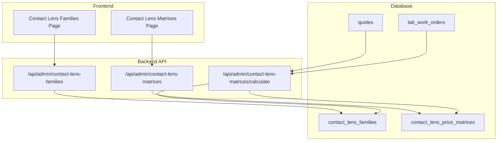
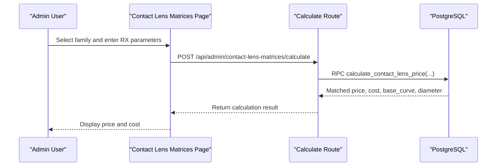
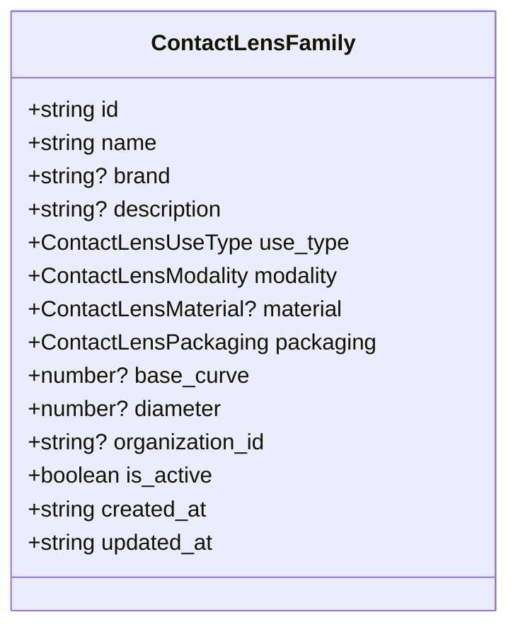
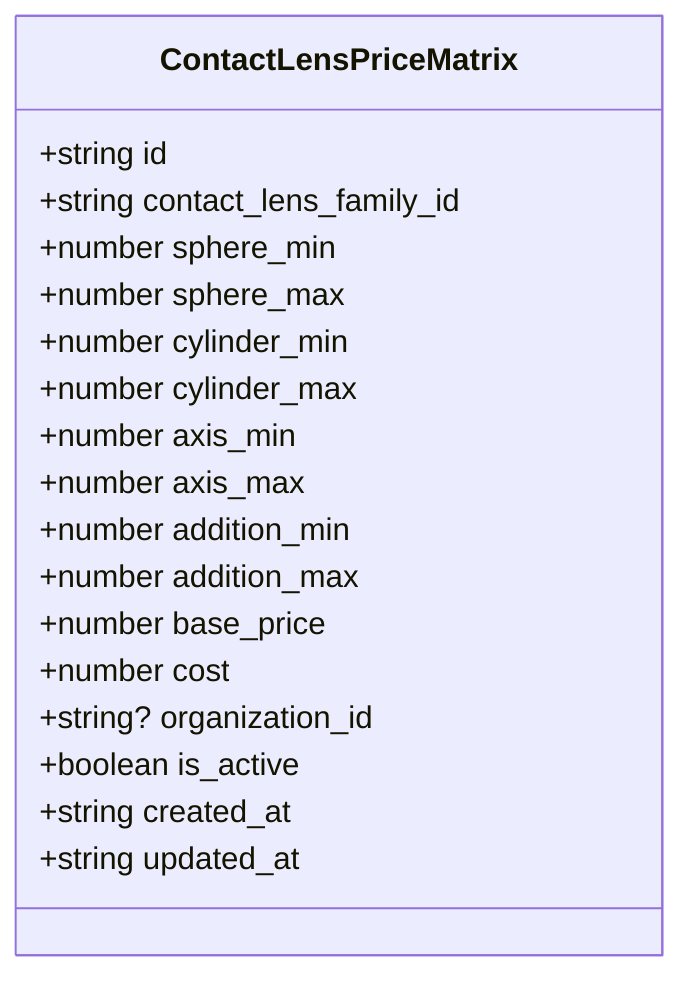
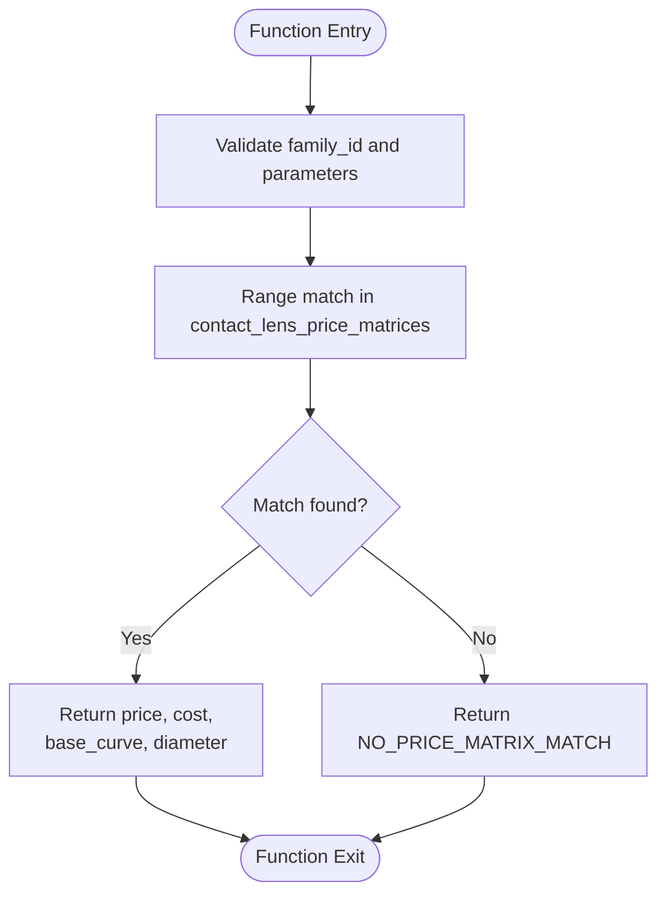
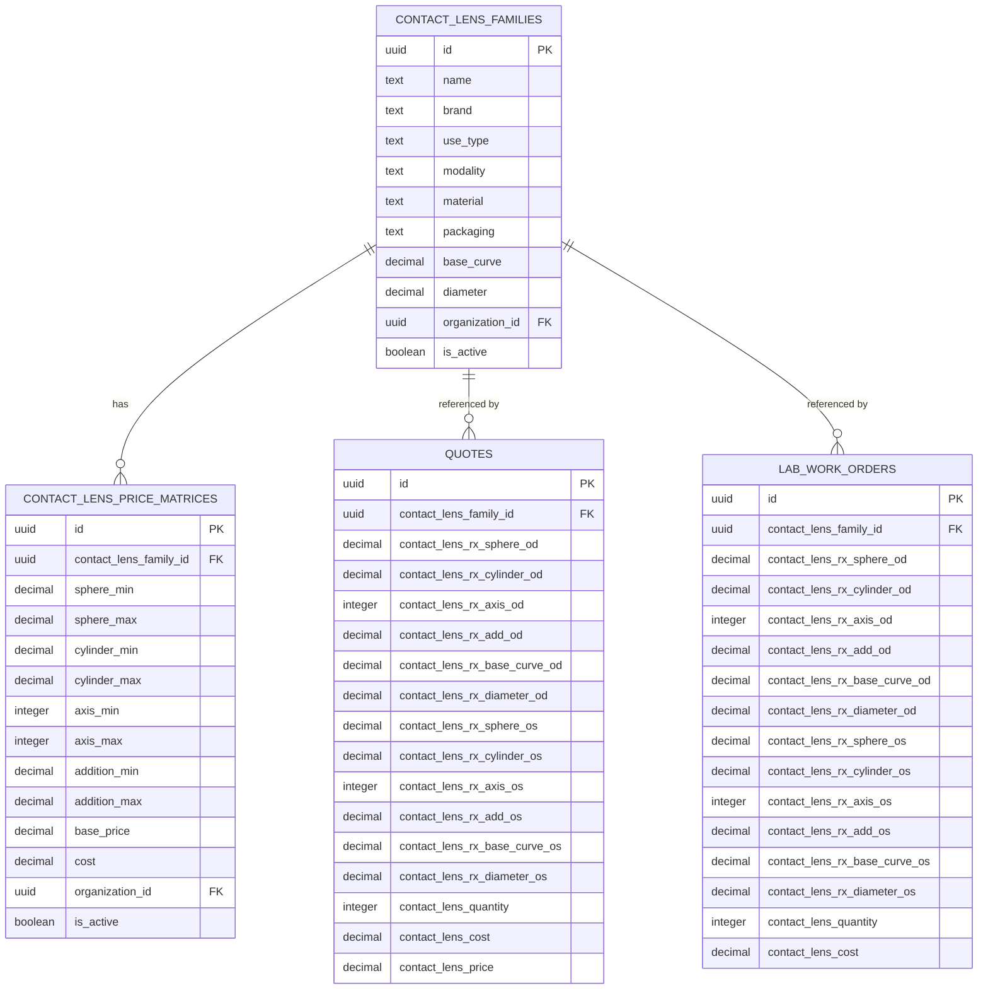
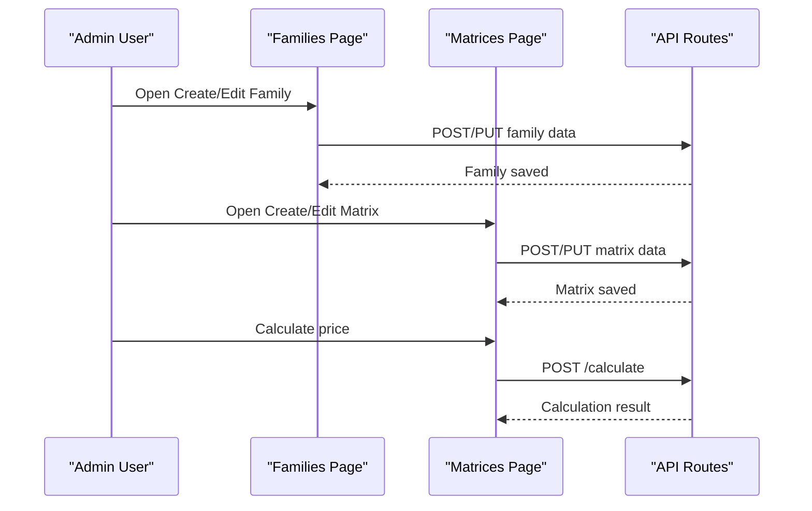
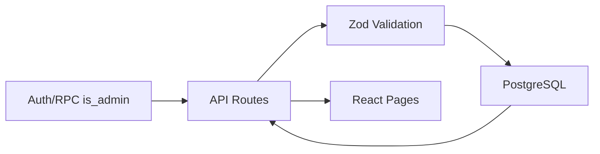

# Contact Lens Integration

<cite>
**Referenced Files in This Document**
- [CONTACT_LENSES_INTEGRATION_GUIDE.md](file://docs/CONTACT_LENSES_INTEGRATION_GUIDE.md)
- [LENS_FAMILIES_AND_MATRICES_SCHEMA.md](file://docs/LENS_FAMILIES_AND_MATRICES_SCHEMA.md)
- [LENS_PRICE_CALCULATION_SYSTEM.md](file://docs/LENS_PRICE_CALCULATION_SYSTEM.md)
- [contact-lens.ts](file://src/types/contact-lens.ts)
- [contact-lens-families page.tsx](file://src/app/admin/contact-lens-families/page.tsx)
- [contact-lens-matrices page.tsx](file://src/app/admin/contact-lens-matrices/page.tsx)
- [contact-lens-families route.ts](file://src/app/api/admin/contact-lens-families/route.ts)
- [contact-lens-matrices route.ts](file://src/app/api/admin/contact-lens-matrices/route.ts)
- [contact-lens-matrices calculate route.ts](file://src/app/api/admin/contact-lens-matrices/calculate/route.ts)
- [quotes contact lens migration.sql](file://supabase/migrations/20260131000006_add_contact_lens_fields_to_quotes_and_work_orders.sql)
- [quotes contact lens type migration.sql](file://supabase/migrations/20260203100000_allow_contact_lens_type_in_quotes.sql)
- [quotes load-to-pos route.ts](file://src/app/api/admin/quotes/[id]/load-to-pos/route.ts)
</cite>

## Table of Contents

1. [Introduction](#introduction)
2. [Project Structure](#project-structure)
3. [Core Components](#core-components)
4. [Architecture Overview](#architecture-overview)
5. [Detailed Component Analysis](#detailed-component-analysis)
6. [Dependency Analysis](#dependency-analysis)
7. [Performance Considerations](#performance-considerations)
8. [Troubleshooting Guide](#troubleshooting-guide)
9. [Conclusion](#conclusion)

## Introduction

This document describes the comprehensive contact lens integration system for Opttius, covering contact lens families, pricing matrices, automatic parameter calculations, and integration with optical prescriptions and quote generation. The system supports three major lens categories—soft lenses (daily, bi-weekly, monthly), rigid gas permeable (RGP) lenses, and specialty contact lenses (toric, multifocal, cosmetic)—with distinct parameter sets and pricing models.

## Project Structure

The contact lens integration spans three primary areas:

- Database schema with dedicated tables for families and price matrices
- Backend API routes for CRUD operations and price calculation
- Frontend pages for managing families and matrices, plus integration into quotes and POS

**Diagram sources**

- [contact-lens-families route.ts](file://src/app/api/admin/contact-lens-families/route.ts#L17-L94)
- [contact-lens-matrices route.ts](file://src/app/api/admin/contact-lens-matrices/route.ts#L14-L109)
- [contact-lens-matrices calculate route.ts](file://src/app/api/admin/contact-lens-matrices/calculate/route.ts#L17-L172)
- [contact-lens-families page.tsx](file://src/app/admin/contact-lens-families/page.tsx#L78-L142)
- [contact-lens-matrices page.tsx](file://src/app/admin/contact-lens-matrices/page.tsx#L67-L142)

**Section sources**

- [CONTACT_LENSES_INTEGRATION_GUIDE.md](file://docs/CONTACT_LENSES_INTEGRATION_GUIDE.md#L112-L304)
- [contact-lens.ts](file://src/types/contact-lens.ts#L9-L76)

## Core Components

- Contact Lens Families: Brand specifications, use type, modality, material, packaging, and fixed parameters (base curve/diameter) when applicable.
- Contact Lens Matrices: Price ranges by sphere, cylinder, axis, and addition with pricing and cost per box.
- Price Calculation Function: Automatic price lookup based on family and prescription parameters.
- Quote and Work Order Integration: Fields to capture contact lens family selection, bilateral prescriptions, quantities, and calculated totals.

Key capabilities:

- Parameter validation and range matching for toric (axis) and multifocal (addition) lenses
- Multi-tenancy isolation via organization_id
- Soft-delete enabled for active/inactive management
- Indexes optimized for range queries

**Section sources**

- [CONTACT_LENSES_INTEGRATION_GUIDE.md](file://docs/CONTACT_LENSES_INTEGRATION_GUIDE.md#L118-L304)
- [contact-lens.ts](file://src/types/contact-lens.ts#L25-L76)

## Architecture Overview

The system follows a layered architecture:

- Data Layer: PostgreSQL tables with GIST indexes for efficient range queries
- Service Layer: Next.js API routes enforcing authentication, admin checks, and validation
- Presentation Layer: React admin pages for configuration and management
- Integration Layer: Quote and work order tables extended with contact lens fields

**Diagram sources**

- [contact-lens-matrices page.tsx](file://src/app/admin/contact-lens-matrices/page.tsx#L187-L231)
- [contact-lens-matrices calculate route.ts](file://src/app/api/admin/contact-lens-matrices/calculate/route.ts#L17-L172)

## Detailed Component Analysis

### Contact Lens Family Configuration

Manages brand specifications, product categories, and packaging:

- Use types: daily, bi_weekly, monthly, extended_wear
- Modalities: spherical, toric, multifocal, cosmetic
- Materials: silicone_hydrogel, hydrogel, rigid_gas_permeable
- Packaging: box_30, box_6, box_3, bottle
- Fixed parameters: base_curve and diameter when applicable

**Diagram sources**

- [contact-lens.ts](file://src/types/contact-lens.ts#L25-L40)

**Section sources**

- [CONTACT_LENSES_INTEGRATION_GUIDE.md](file://docs/CONTACT_LENSES_INTEGRATION_GUIDE.md#L125-L173)
- [contact-lens.ts](file://src/types/contact-lens.ts#L9-L40)

### Contact Lens Matrix Management

Defines pricing ranges and calculates costs automatically:

- Ranges: sphere_min/sphere_max, cylinder_min/cylinder_max, axis_min/axis_max, addition_min/addition_max
- Pricing: base_price (sale price per box), cost (purchase price per box)
- Validation: inclusive range checks and constraints

**Diagram sources**

- [contact-lens.ts](file://src/types/contact-lens.ts#L42-L59)

**Section sources**

- [CONTACT_LENSES_INTEGRATION_GUIDE.md](file://docs/CONTACT_LENSES_INTEGRATION_GUIDE.md#L175-L250)
- [contact-lens.ts](file://src/types/contact-lens.ts#L42-L59)

### Automatic Parameter Calculations

The system computes prices using a stored procedure that:

- Matches family and validates parameters against configured ranges
- Returns price, cost, and physical parameters (base_curve/diameter) when available
- Supports toric (axis) and multifocal (addition) parameters

**Diagram sources**

- [contact-lens-matrices calculate route.ts](file://src/app/api/admin/contact-lens-matrices/calculate/route.ts#L17-L172)
- [CONTACT_LENSES_INTEGRATION_GUIDE.md](file://docs/CONTACT_LENSES_INTEGRATION_GUIDE.md#L312-L354)

**Section sources**

- [CONTACT_LENSES_INTEGRATION_GUIDE.md](file://docs/CONTACT_LENSES_INTEGRATION_GUIDE.md#L308-L354)
- [contact-lens-matrices calculate route.ts](file://src/app/api/admin/contact-lens-matrices/calculate/route.ts#L17-L172)

### Integration with Prescriptions and Quotes

Extends quotes and work orders with contact lens fields:

- Bilateral prescriptions (OD/OS) for sphere, cylinder, axis, addition, base_curve, diameter
- Quantity and calculated totals (price × quantity)
- Lens type indicator to distinguish optical lenses from contact lenses

**Diagram sources**

- [quotes contact lens migration.sql](file://supabase/migrations/20260131000006_add_contact_lens_fields_to_quotes_and_work_orders.sql#L7-L68)
- [contact-lens.ts](file://src/types/contact-lens.ts#L25-L59)

**Section sources**

- [quotes contact lens migration.sql](file://supabase/migrations/20260131000006_add_contact_lens_fields_to_quotes_and_work_orders.sql#L7-L68)
- [quotes contact lens type migration.sql](file://supabase/migrations/20260203100000_allow_contact_lens_type_in_quotes.sql#L22-L38)
- [quotes load-to-pos route.ts](file://src/app/api/admin/quotes/[id]/load-to-pos/route.ts#L180-L197)

### Contact Lens Family Wizard and Matrix Validation

The frontend provides guided configuration:

- Family creation/edit dialog with use type, modality, material, packaging, and optional fixed parameters
- Matrix creation/edit dialog with configurable ranges and pricing
- Real-time validation and filtering by family and status
- Pagination and search for efficient management

**Diagram sources**

- [contact-lens-families page.tsx](file://src/app/admin/contact-lens-families/page.tsx#L182-L233)
- [contact-lens-matrices page.tsx](file://src/app/admin/contact-lens-matrices/page.tsx#L187-L231)
- [contact-lens-matrices calculate route.ts](file://src/app/api/admin/contact-lens-matrices/calculate/route.ts#L17-L172)

**Section sources**

- [contact-lens-families page.tsx](file://src/app/admin/contact-lens-families/page.tsx#L78-L142)
- [contact-lens-matrices page.tsx](file://src/app/admin/contact-lens-matrices/page.tsx#L67-L142)

## Dependency Analysis

- Authentication and Authorization: All API routes check user authentication and admin role via RPC
- Multi-tenancy: Queries filter by organization_id; inserts populate organization_id from session
- Data Integrity: Constraints enforce valid ranges and enum values; GIST indexes optimize range queries
- Frontend-Backend Contracts: Strongly typed interfaces ensure consistent data exchange

**Diagram sources**

- [contact-lens-families route.ts](file://src/app/api/admin/contact-lens-families/route.ts#L17-L94)
- [contact-lens-matrices route.ts](file://src/app/api/admin/contact-lens-matrices/route.ts#L14-L109)
- [contact-lens-matrices calculate route.ts](file://src/app/api/admin/contact-lens-matrices/calculate/route.ts#L17-L172)

**Section sources**

- [contact-lens-families route.ts](file://src/app/api/admin/contact-lens-families/route.ts#L17-L94)
- [contact-lens-matrices route.ts](file://src/app/api/admin/contact-lens-matrices/route.ts#L14-L109)

## Performance Considerations

- Range Indexes: GIST indexes on numeric ranges enable fast matching during price calculation
- Soft Deletes: is_active flag allows filtering without physical deletion
- Organization Isolation: organization_id ensures tenant separation and targeted queries
- Efficient Matching: Stored procedure prioritizes active records and applies inclusive range comparisons

[No sources needed since this section provides general guidance]

## Troubleshooting Guide

Common issues and resolutions:

- No price matrix match: Verify family has configured matrices and RX parameters fall within defined ranges
- Parameter validation errors: Ensure numeric values are valid and axis is within 0–180
- Multi-tenancy access: Confirm organization_id is set and user belongs to the correct organization
- Migration completeness: Ensure contact lens fields are present in quotes and work orders tables

**Section sources**

- [contact-lens-matrices calculate route.ts](file://src/app/api/admin/contact-lens-matrices/calculate/route.ts#L142-L151)
- [LENS_PRICE_CALCULATION_SYSTEM.md](file://docs/LENS_PRICE_CALCULATION_SYSTEM.md#L504-L580)

## Conclusion

The contact lens integration system provides a robust framework for managing contact lens families, configuring pricing matrices, and seamlessly integrating with optical prescriptions and quote workflows. It supports diverse lens types and modalities while maintaining strong validation, multi-tenancy, and performance through optimized database indexing and stored procedures.
