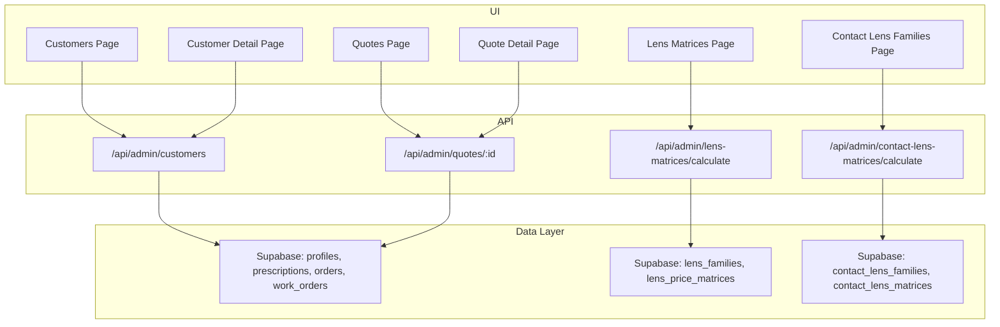
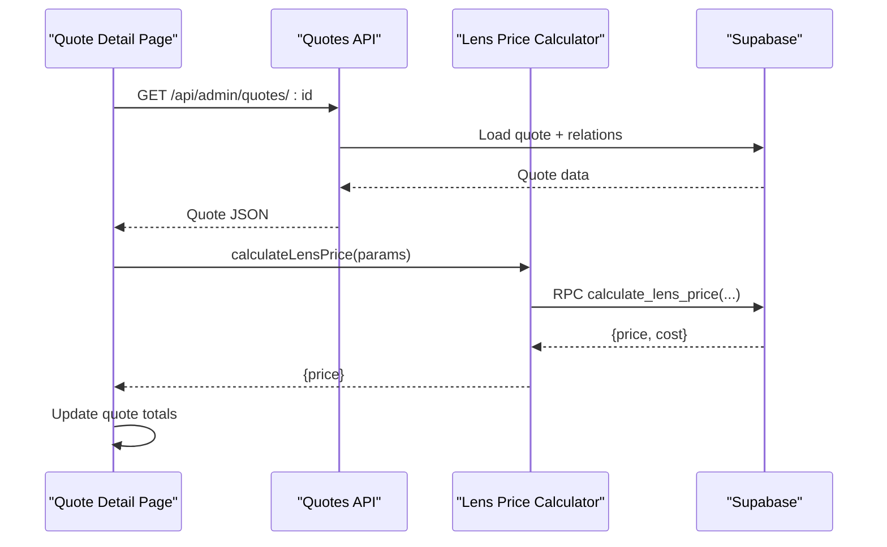
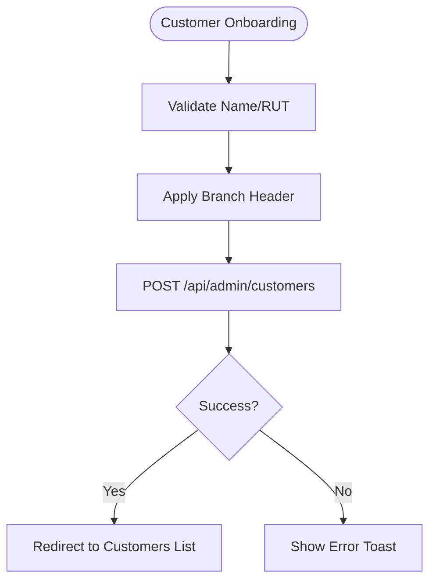
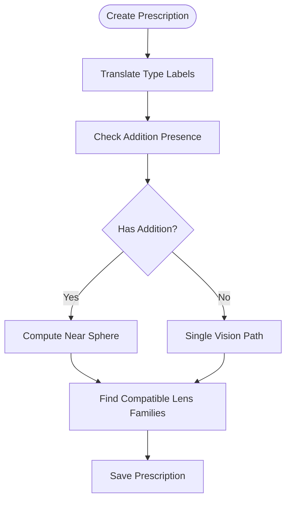
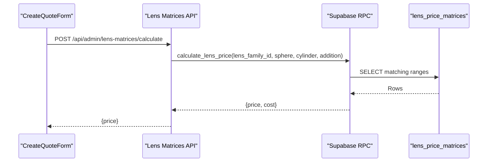
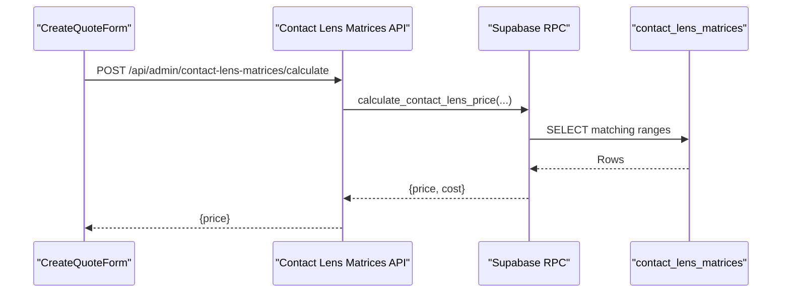
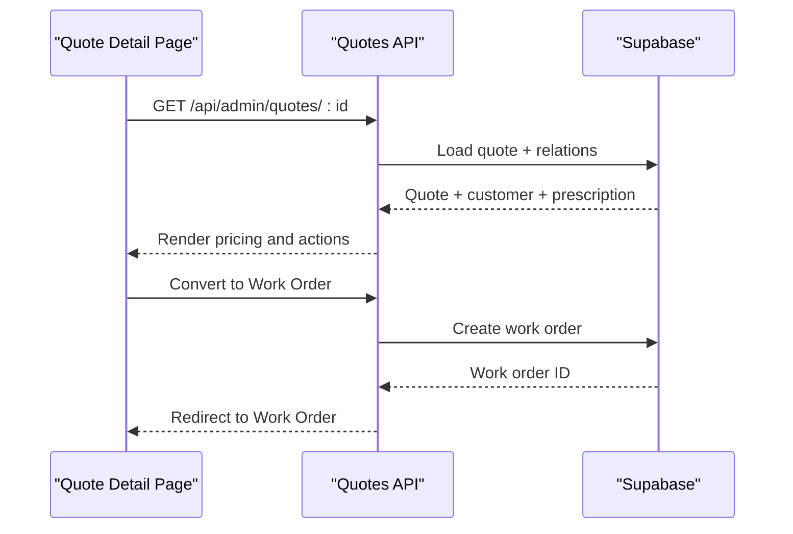
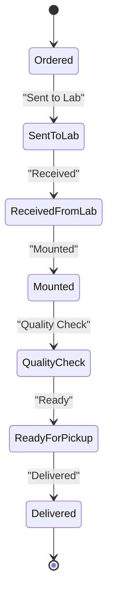
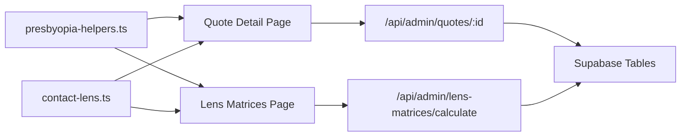

# Customer & Prescription Management

<cite>
**Referenced Files in This Document**
- [page.tsx](file://src/app/admin/customers/[id]/page.tsx)
- [page.tsx](file://src/app/admin/customers/new/page.tsx)
- [page.tsx](file://src/app/admin/customers/page.tsx)
- [page.tsx](file://src/app/admin/work-orders/[id]/page.tsx)
- [page.tsx](file://src/app/admin/quotes/[id]/page.tsx)
- [page.tsx](file://src/app/admin/quotes/settings/page.tsx)
- [page.tsx](file://src/app/admin/lens-matrices/page.tsx)
- [page.tsx](file://src/app/admin/contact-lens-families/page.tsx)
- [route.ts](file://src/app/api/admin/contact-lens-matrices/calculate/route.ts)
- [prescription-helpers.ts](file://src/lib/prescription-helpers.ts)
- [presbyopia-helpers.ts](file://src/lib/presbyopia-helpers.ts)
- [contact-lens.ts](file://src/types/contact-lens.ts)
- [20250123000000_adapt_customers_for_optical_shop.sql](file://supabase/migrations/20250123000000_adapt_customers_for_optical_shop.sql)
- [LENS_PRICE_CALCULATION_SYSTEM.md](file://docs/LENS_PRICE_CALCULATION_SYSTEM.md)
- [LENS_FAMILIES_AND_MATRICES_SCHEMA.md](file://docs/LENS_FAMILIES_AND_MATRICES_SCHEMA.md)
</cite>

## Table of Contents

1. [Introduction](#introduction)
2. [Project Structure](#project-structure)
3. [Core Components](#core-components)
4. [Architecture Overview](#architecture-overview)
5. [Detailed Component Analysis](#detailed-component-analysis)
6. [Dependency Analysis](#dependency-analysis)
7. [Performance Considerations](#performance-considerations)
8. [Troubleshooting Guide](#troubleshooting-guide)
9. [Conclusion](#conclusion)

## Introduction

This document describes the customer and prescription management system for optical patient care workflows. It covers customer profile management (medical history, appointment history, contact lens preferences), the prescription creation and validation process, optical parameter calculations, lens selection algorithms, and the quote generation workflow from prescription input to price calculation. It also documents integrations with laboratory work orders, and outlines the data models for customer records, prescription history, and lens family configurations.

## Project Structure

The system is organized around Next.js app routes and server actions, with Supabase-backed data models and TypeScript types. Key areas include:

- Customer management: onboarding, profiles, analytics, and relations
- Prescription management: creation, validation, and presbyopia handling
- Lens families and matrices: optical and contact lens pricing
- Quote generation: pricing breakdown, treatments, and conversion to work orders
- Laboratory integration: work order lifecycle and status tracking

**Diagram sources**

- [page.tsx](file://src/app/admin/customers/page.tsx#L75-L132)
- [page.tsx](file://src/app/admin/customers/[id]/page.tsx#L107-L160)
- [page.tsx](file://src/app/admin/quotes/[id]/page.tsx#L113-L179)
- [page.tsx](file://src/app/admin/lens-matrices/page.tsx#L88-L162)
- [page.tsx](file://src/app/admin/contact-lens-families/page.tsx#L78-L142)
- [route.ts](file://src/app/api/admin/contact-lens-matrices/calculate/route.ts#L122-L159)

**Section sources**

- [page.tsx](file://src/app/admin/customers/page.tsx#L75-L132)
- [page.tsx](file://src/app/admin/customers/[id]/page.tsx#L107-L160)
- [page.tsx](file://src/app/admin/quotes/[id]/page.tsx#L113-L179)
- [page.tsx](file://src/app/admin/lens-matrices/page.tsx#L88-L162)
- [page.tsx](file://src/app/admin/contact-lens-families/page.tsx#L78-L142)
- [route.ts](file://src/app/api/admin/contact-lens-matrices/calculate/route.ts#L122-L159)

## Core Components

- Customer Profile Management
  - Onboarding and editing flows with RUT validation and branch scoping
  - Medical history fields (conditions, allergies, medications), exam dates, and emergency contacts
  - Analytics and relations to orders, prescriptions, appointments, and quotes
- Prescription Management
  - Creation and validation with translation utilities and presbyopia helpers
  - Multi-faceted parameter handling (sphere, cylinder, axis, addition)
- Lens Family and Matrix Systems
  - Optical lens families and pricing matrices with range-based matching
  - Contact lens families and matrices with Rx-driven pricing
- Quote Generation Workflow
  - From prescription input to price calculation, treatments, and optional presbyopia solutions
  - Conversion to work orders and status tracking
- Laboratory Integration
  - Work order lifecycle with status transitions and lab metadata

**Section sources**

- [page.tsx](file://src/app/admin/customers/new/page.tsx#L31-L133)
- [page.tsx](file://src/app/admin/customers/[id]/page.tsx#L107-L160)
- [prescription-helpers.ts](file://src/lib/prescription-helpers.ts#L1-L38)
- [presbyopia-helpers.ts](file://src/lib/presbyopia-helpers.ts#L1-L169)
- [page.tsx](file://src/app/admin/lens-matrices/page.tsx#L88-L162)
- [page.tsx](file://src/app/admin/contact-lens-families/page.tsx#L78-L142)
- [page.tsx](file://src/app/admin/quotes/[id]/page.tsx#L113-L179)
- [page.tsx](file://src/app/admin/work-orders/[id]/page.tsx#L135-L198)

## Architecture Overview

The system follows a layered architecture:

- Presentation layer: Next.js app pages and components
- Business logic: helpers and hooks for prescriptions and presbyopia
- API layer: server routes for CRUD and calculations
- Data layer: Supabase tables with multitenant organization scoping

**Diagram sources**

- [page.tsx](file://src/app/admin/quotes/[id]/page.tsx#L113-L179)
- [LENS_PRICE_CALCULATION_SYSTEM.md](file://docs/LENS_PRICE_CALCULATION_SYSTEM.md#L53-L101)

**Section sources**

- [page.tsx](file://src/app/admin/quotes/[id]/page.tsx#L113-L179)
- [LENS_PRICE_CALCULATION_SYSTEM.md](file://docs/LENS_PRICE_CALCULATION_SYSTEM.md#L53-L101)

## Detailed Component Analysis

### Customer Profile Management

- Onboarding flow validates required fields (name, RUT) and supports branch scoping for super admins
- Customer detail page aggregates analytics, relations (orders, prescriptions, appointments, quotes), and medical history fields
- Medical history includes arrays for conditions, allergies, and medications, plus exam dates and emergency contacts

**Diagram sources**

- [page.tsx](file://src/app/admin/customers/new/page.tsx#L72-L133)

**Section sources**

- [page.tsx](file://src/app/admin/customers/new/page.tsx#L31-L133)
- [page.tsx](file://src/app/admin/customers/[id]/page.tsx#L107-L160)
- [20250123000000_adapt_customers_for_optical_shop.sql](file://supabase/migrations/20250123000000_adapt_customers_for_optical_shop.sql#L6-L26)

### Prescription Creation and Validation

- Prescription types are translated for display and stored with validated values
- Presbyopia helpers compute addition, near sphere, and compatible lens families
- Validation ensures presence of required fields and logical parameter ranges

**Diagram sources**

- [prescription-helpers.ts](file://src/lib/prescription-helpers.ts#L1-L38)
- [presbyopia-helpers.ts](file://src/lib/presbyopia-helpers.ts#L25-L146)

**Section sources**

- [prescription-helpers.ts](file://src/lib/prescription-helpers.ts#L1-L38)
- [presbyopia-helpers.ts](file://src/lib/presbyopia-helpers.ts#L25-L146)

### Optical Parameter Calculations and Lens Selection

- Lens families define type and material; matrices define pricing ranges for sphere, cylinder, and addition
- Calculation uses RPC with parameters and returns price/cost; fallback allows manual override
- Presbyopia solutions influence selection: progressive, bifocal, trifocal, or two separate lenses

**Diagram sources**

- [page.tsx](file://src/app/admin/lens-matrices/page.tsx#L138-L162)
- [LENS_PRICE_CALCULATION_SYSTEM.md](file://docs/LENS_PRICE_CALCULATION_SYSTEM.md#L53-L101)

**Section sources**

- [page.tsx](file://src/app/admin/lens-matrices/page.tsx#L88-L162)
- [LENS_PRICE_CALCULATION_SYSTEM.md](file://docs/LENS_PRICE_CALCULATION_SYSTEM.md#L53-L101)
- [LENS_FAMILIES_AND_MATRICES_SCHEMA.md](file://docs/LENS_FAMILIES_AND_MATRICES_SCHEMA.md#L455-L521)

### Contact Lens Families and Matrices Integration

- Contact lens families include use type, modality, material, packaging, and base curve/diameter
- Pricing uses Rx parameters (sphere, cylinder, axis, addition) matched against matrices
- API returns errors when no matrix matches the prescription parameters

**Diagram sources**

- [page.tsx](file://src/app/admin/contact-lens-families/page.tsx#L120-L142)
- [route.ts](file://src/app/api/admin/contact-lens-matrices/calculate/route.ts#L122-L159)
- [contact-lens.ts](file://src/types/contact-lens.ts#L25-L76)

**Section sources**

- [page.tsx](file://src/app/admin/contact-lens-families/page.tsx#L78-L142)
- [route.ts](file://src/app/api/admin/contact-lens-matrices/calculate/route.ts#L122-L159)
- [contact-lens.ts](file://src/types/contact-lens.ts#L25-L76)

### Quote Generation Workflow

- Quote detail displays customer, prescription, frame, lens, and pricing breakdown
- Supports presbyopia solutions and near frame configuration for two-separate setups
- Converts to work order and integrates with lab workflow

**Diagram sources**

- [page.tsx](file://src/app/admin/quotes/[id]/page.tsx#L113-L179)
- [page.tsx](file://src/app/admin/work-orders/[id]/page.tsx#L135-L198)

**Section sources**

- [page.tsx](file://src/app/admin/quotes/[id]/page.tsx#L113-L179)
- [page.tsx](file://src/app/admin/work-orders/[id]/page.tsx#L135-L198)

### Laboratory Work Orders Integration

- Work order lifecycle includes status transitions, lab metadata, and delivery
- Supports printing, sending, and deletion with proper error handling

**Diagram sources**

- [page.tsx](file://src/app/admin/work-orders/[id]/page.tsx#L430-L444)

**Section sources**

- [page.tsx](file://src/app/admin/work-orders/[id]/page.tsx#L135-L198)

## Dependency Analysis

- Helpers depend on TypeScript types for prescriptions and presbyopia solutions
- UI components depend on API routes for data persistence and calculations
- Supabase migrations define the schema for profiles, prescriptions, orders, and matrices

**Diagram sources**

- [presbyopia-helpers.ts](file://src/lib/presbyopia-helpers.ts#L1-L169)
- [contact-lens.ts](file://src/types/contact-lens.ts#L1-L76)
- [page.tsx](file://src/app/admin/quotes/[id]/page.tsx#L113-L179)
- [page.tsx](file://src/app/admin/lens-matrices/page.tsx#L88-L162)

**Section sources**

- [presbyopia-helpers.ts](file://src/lib/presbyopia-helpers.ts#L1-L169)
- [contact-lens.ts](file://src/types/contact-lens.ts#L1-L76)
- [page.tsx](file://src/app/admin/quotes/[id]/page.tsx#L113-L179)
- [page.tsx](file://src/app/admin/lens-matrices/page.tsx#L88-L162)

## Performance Considerations

- Debounce and minimal re-calculations for lens price updates
- Efficient filtering and pagination for customer lists and matrices
- RPC-based pricing reduces frontend complexity and ensures consistent rules

## Troubleshooting Guide

- Contact lens price calculation errors: when no matrix matches the Rx parameters, the API returns a 422 with details; verify family selection and Rx ranges
- Presbyopia solution mismatches: ensure lens family type aligns with computed solution; use compatible families for progressive, bifocal, trifocal, or two separate lenses
- Quote conversion to work order: verify customer and prescription linkage; ensure pricing is finalized before conversion

**Section sources**

- [route.ts](file://src/app/api/admin/contact-lens-matrices/calculate/route.ts#L141-L151)
- [presbyopia-helpers.ts](file://src/lib/presbyopia-helpers.ts#L121-L146)
- [page.tsx](file://src/app/admin/quotes/[id]/page.tsx#L181-L194)

## Conclusion

The system provides a comprehensive optical patient care workflow with robust customer management, validated prescription handling, flexible lens selection, and integrated quote-to-work order processes. The modular design, helper utilities, and RPC-based pricing ensure maintainability and scalability while supporting complex presbyopia scenarios and contact lens configurations.
