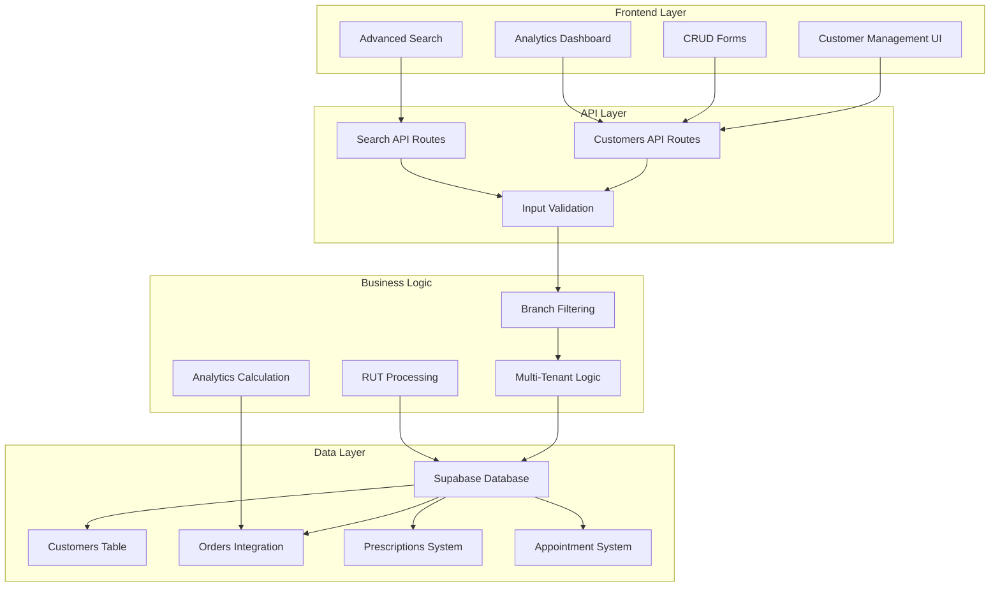
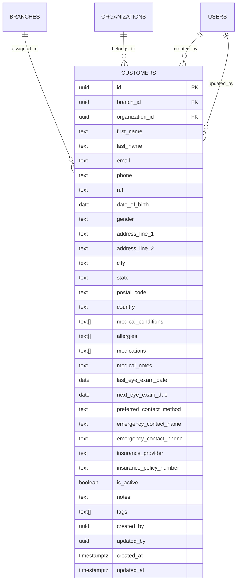
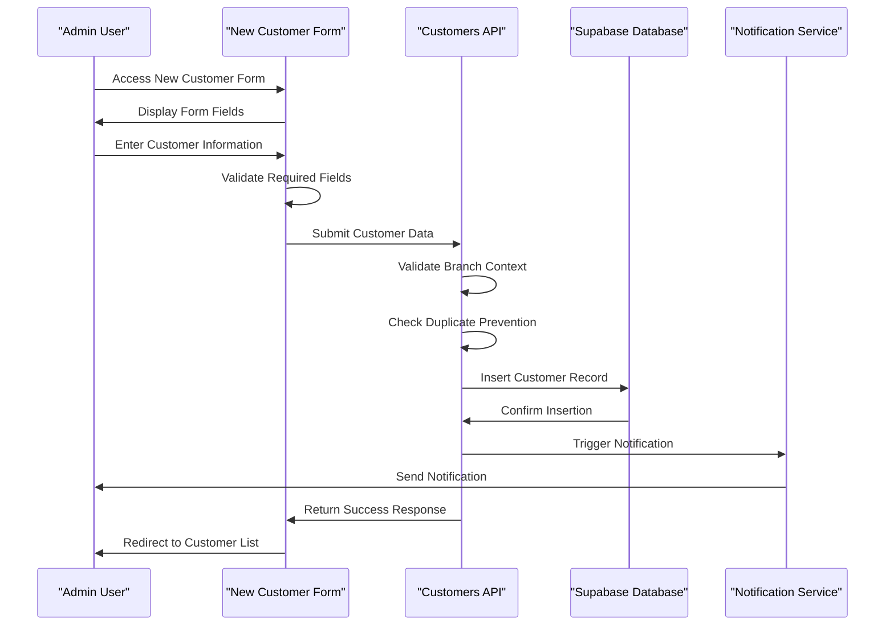
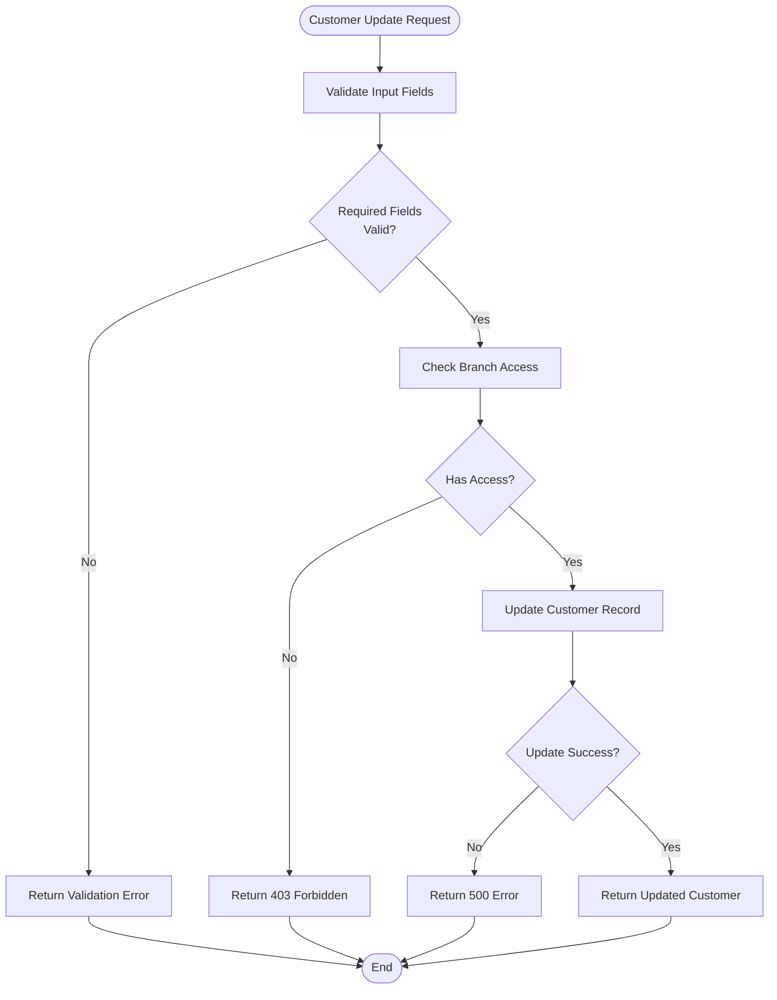
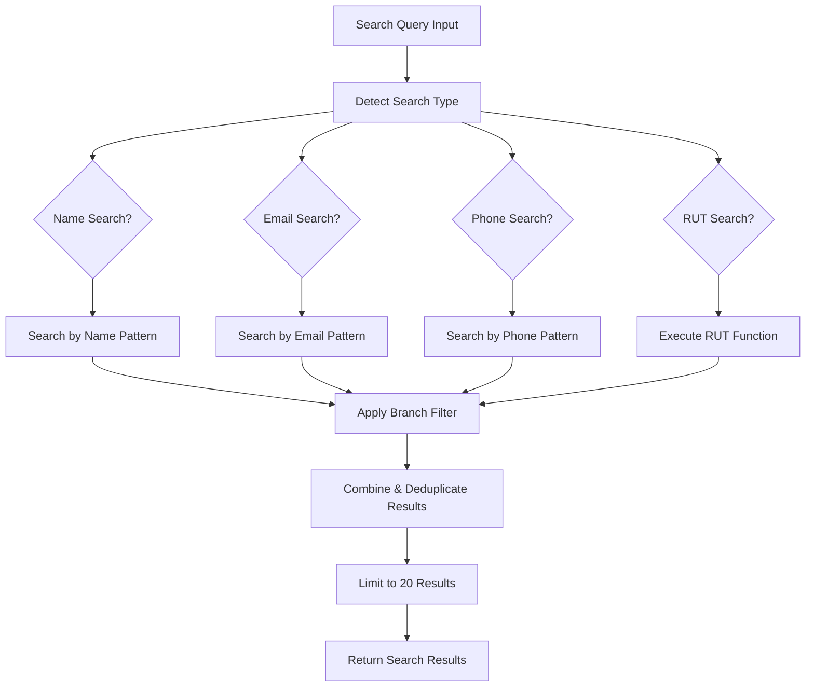
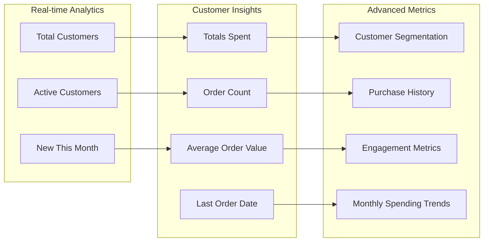
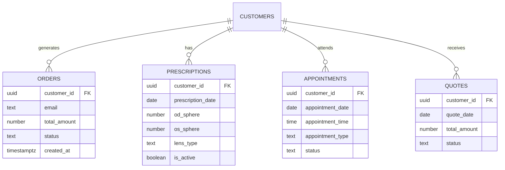
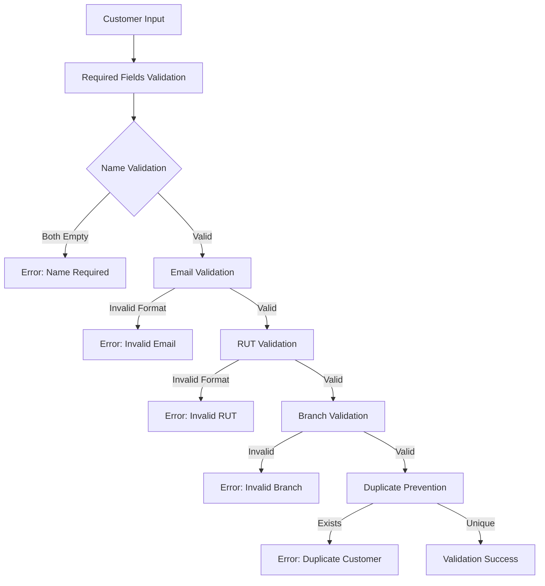
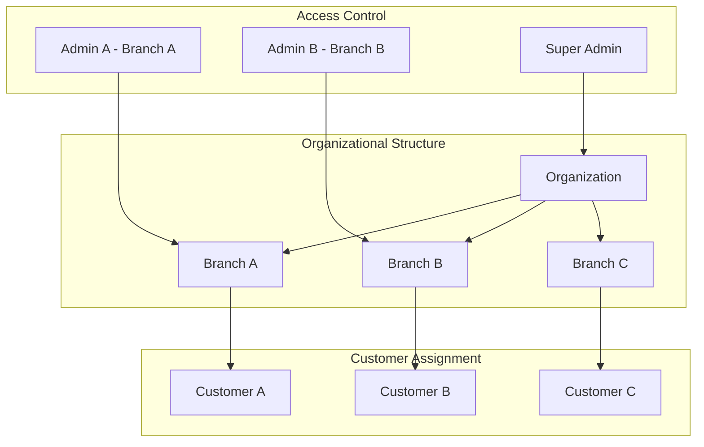
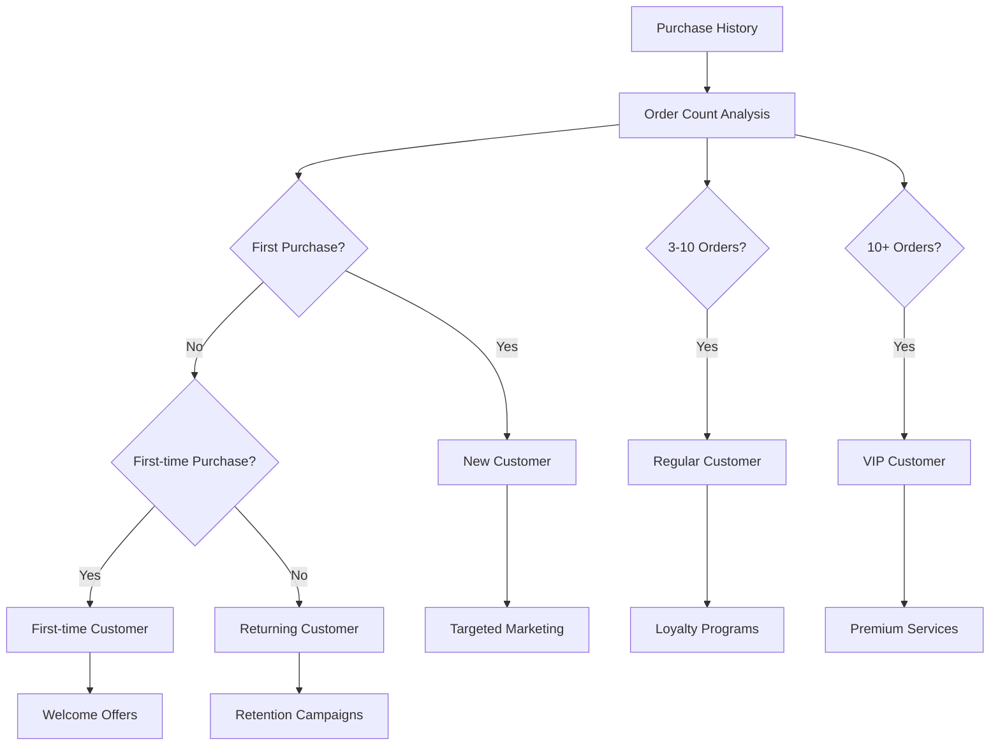

# Customer Profile Management

<cite>
**Referenced Files in This Document**
- [Customers Page](file://src/app/admin/customers/page.tsx)
- [New Customer Page](file://src/app/admin/customers/new/page.tsx)
- [Customer Detail Page](file://src/app/admin/customers/[id]/page.tsx)
- [Edit Customer Page](file://src/app/admin/customers/[id]/edit/page.tsx)
- [Customers API Route](file://src/app/api/admin/customers/route.ts)
- [Customer Detail API Route](file://src/app/api/admin/customers/[id]/route.ts)
- [Customer Search API Route](file://src/app/api/admin/customers/search/route.ts)
- [Customers Database Migration](file://supabase/migrations/20251218000000_separate_customers_from_users.sql)
- [Customer RUT Search Migration](file://supabase/migrations/20251219000000_update_rut_search_for_customers.sql)
- [Supabase Client](file://src/lib/supabase.ts)
- [RUT Utilities](file://src/lib/utils/rut.ts)
- [Customers API Tests](file://src/__tests__/integration/api/customers.test.ts)
</cite>

## Table of Contents

1. [Introduction](#introduction)
2. [System Architecture](#system-architecture)
3. [Core Components](#core-components)
4. [Customer Lifecycle Management](#customer-lifecycle-management)
5. [Customer Search and Discovery](#customer-search-and-discovery)
6. [Analytics and Reporting](#analytics-and-reporting)
7. [Integration with Business Systems](#integration-with-business-systems)
8. [Validation and Data Integrity](#validation-and-data-integrity)
9. [Multi-Branch Customer Assignment](#multi-branch-customer-assignment)
10. [Customer Segmentation](#customer-segmentation)
11. [Troubleshooting Guide](#troubleshooting-guide)
12. [Best Practices](#best-practices)

## Introduction

The Customer Profile Management system is a comprehensive solution for managing customer relationships in an optical retail environment. Built on Next.js and Supabase, this system provides complete customer lifecycle management including registration, profile updates, status management, and multi-branch assignment capabilities.

The system is designed specifically for optical shops, incorporating specialized fields for medical history, prescriptions, and eye care information alongside traditional customer management features. It supports multi-tenant architecture with branch-level isolation and provides robust search capabilities including advanced RUT (Rol Único Tributario) search functionality.

## System Architecture

The customer management system follows a modern Next.js architecture with server-side rendering and API routes:

**Diagram sources**

- [Customers API Route](file://src/app/api/admin/customers/route.ts#L1-L703)
- [Customer Detail API Route](file://src/app/api/admin/customers/[id]/route.ts#L1-L651)
- [Customers Database Migration](file://supabase/migrations/20251218000000_separate_customers_from_users.sql#L1-L157)

## Core Components

### Customer Data Model

The customer system uses a comprehensive data model optimized for optical retail environments:

**Diagram sources**

- [Customers Database Migration](file://supabase/migrations/20251218000000_separate_customers_from_users.sql#L6-L59)

### Frontend Components

The system provides four primary user interfaces:

1. **Customers List Page**: Comprehensive customer listing with filtering and analytics
2. **New Customer Form**: Complete customer registration with validation
3. **Customer Detail View**: Detailed customer profile with integrated business data
4. **Edit Customer Form**: Profile modification interface

**Section sources**

- [Customers Page](file://src/app/admin/customers/page.tsx#L48-L67)
- [New Customer Page](file://src/app/admin/customers/new/page.tsx#L38-L63)
- [Customer Detail Page](file://src/app/admin/customers/[id]/page.tsx#L92-L139)
- [Edit Customer Page](file://src/app/admin/customers/[id]/edit/page.tsx#L24-L40)

## Customer Lifecycle Management

### Registration Workflow

The customer registration process follows a structured workflow:

**Diagram sources**

- [New Customer Page](file://src/app/admin/customers/new/page.tsx#L72-L133)
- [Customers API Route](file://src/app/api/admin/customers/route.ts#L312-L595)

### Profile Update Workflow

Customer profile updates maintain data integrity while allowing flexible modifications:

**Diagram sources**

- [Edit Customer Page](file://src/app/admin/customers/[id]/edit/page.tsx#L132-L174)
- [Customer Detail API Route](file://src/app/api/admin/customers/[id]/route.ts#L353-L525)

**Section sources**

- [Customers API Route](file://src/app/api/admin/customers/route.ts#L312-L595)
- [Customer Detail API Route](file://src/app/api/admin/customers/[id]/route.ts#L353-L525)

## Customer Search and Discovery

### Advanced Search Capabilities

The system provides sophisticated search functionality supporting multiple criteria:

**Diagram sources**

- [Customer Search API Route](file://src/app/api/admin/customers/search/route.ts#L103-L347)

### RUT Search Enhancement

The system includes specialized RUT (Chilean Tax ID) search capabilities:

| Search Format    | Stored Format | Function Match | Standard Search |
| ---------------- | ------------- | -------------- | --------------- |
| 12.345.678-9     | 123456789     | ✓              | ✓               |
| 123456789        | 123456789     | ✓              | ✓               |
| 12345678-9       | 123456789     | ✓              | ✓               |
| 12345678         | 123456789     | ✗              | ✓               |
| Partial (123456) | 123456789     | ✓              | ✗               |

**Section sources**

- [Customer Search API Route](file://src/app/api/admin/customers/search/route.ts#L103-L347)
- [Customer RUT Search Migration](file://supabase/migrations/20251219000000_update_rut_search_for_customers.sql#L11-L34)

## Analytics and Reporting

### Customer Analytics Dashboard

The system provides comprehensive analytics through multiple data sources:

**Diagram sources**

- [Customers Page](file://src/app/admin/customers/page.tsx#L134-L159)
- [Customer Detail Page](file://src/app/admin/customers/[id]/page.tsx#L224-L329)

### Analytics Calculation Logic

The system calculates customer analytics through sophisticated aggregation:

| Metric              | Calculation Method        | Data Source             |
| ------------------- | ------------------------- | ----------------------- |
| Total Spent         | Sum of order amounts      | Orders table            |
| Order Count         | Count of orders           | Orders table            |
| Average Order Value | Total spent ÷ Order count | Calculated              |
| Last Order Date     | Most recent order date    | Orders table            |
| Customer Segment    | Based on order frequency  | Logic-based             |
| Lifetime Value      | Equal to total spent      | Orders table            |
| Favorite Products   | Top 5 by quantity         | Orders + Items          |
| Monthly Spending    | 12-month rolling          | Orders + Date filtering |

**Section sources**

- [Customer Detail API Route](file://src/app/api/admin/customers/[id]/route.ts#L224-L329)

## Integration with Business Systems

### Order System Integration

The customer system integrates seamlessly with the order management system:

**Diagram sources**

- [Customer Detail API Route](file://src/app/api/admin/customers/[id]/route.ts#L116-L222)

### Appointment System Integration

Customer profiles are deeply integrated with appointment scheduling:

- Automatic customer lookup during appointment creation
- Preset customer information for appointment forms
- Appointment history tracking within customer profiles
- Integration with prescription management system

### Quote and Work Order Integration

The system maintains comprehensive relationship with quoting and work order systems:

- Customer-specific pricing and discounts
- Quote history and conversion tracking
- Work order assignment and status updates
- Integration with lens purchase records

**Section sources**

- [Customer Detail Page](file://src/app/admin/customers/[id]/page.tsx#L766-L900)
- [Customer Detail API Route](file://src/app/api/admin/customers/[id]/route.ts#L18-L222)

## Validation and Data Integrity

### Input Validation Rules

The system implements comprehensive validation at multiple levels:

**Diagram sources**

- [New Customer Page](file://src/app/admin/customers/new/page.tsx#L77-L84)
- [Customers API Route](file://src/app/api/admin/customers/route.ts#L320-L362)

### Data Integrity Measures

The system implements several data integrity mechanisms:

1. **Multi-Tenant Isolation**: Customers are isolated by organization and branch
2. **Duplicate Prevention**: Automatic checking for duplicate emails, phones, and RUTs
3. **Branch Access Control**: Strict branch-level access permissions
4. **Audit Trail**: Complete tracking of customer modifications
5. **Data Normalization**: Consistent formatting for international customers

**Section sources**

- [Customers API Route](file://src/app/api/admin/customers/route.ts#L470-L506)
- [Customers Database Migration](file://supabase/migrations/20251218000000_separate_customers_from_users.sql#L76-L150)

## Multi-Branch Customer Assignment

### Branch Assignment Architecture

The system supports complex multi-branch customer management:

**Diagram sources**

- [Customers Database Migration](file://supabase/migrations/20251218000000_separate_customers_from_users.sql#L8-L9)

### Branch Access Control

The system implements granular branch-level access control:

| User Type           | Access Level         | Customer Visibility                 |
| ------------------- | -------------------- | ----------------------------------- |
| Regular Admin       | Selected Branch Only | Only customers from assigned branch |
| Super Admin         | Global View          | All customers across organization   |
| Platform Admin      | No Organization      | All customers system-wide           |
| Cross-Bridge Access | Specific Permission  | Limited cross-branch access         |

**Section sources**

- [Customers API Route](file://src/app/api/admin/customers/route.ts#L84-L126)
- [Customer Detail API Route](file://src/app/api/admin/customers/[id]/route.ts#L55-L88)

## Customer Segmentation

### Segmentation Criteria

The system automatically segments customers based on purchase behavior:

**Diagram sources**

- [Customer Detail API Route](file://src/app/api/admin/customers/[id]/route.ts#L234-L241)

### Segmentation Implementation

The segmentation logic considers multiple factors:

| Segment    | Criteria            | Description                            |
| ---------- | ------------------- | -------------------------------------- |
| New        | First purchase      | Customers with zero previous orders    |
| First-time | Single purchase     | Customers with exactly one order       |
| Regular    | 3-10 purchases      | Loyal customers with moderate activity |
| VIP        | 10+ purchases       | Premium customers with high engagement |
| At-risk    | No recent purchases | Customers showing decreased engagement |

**Section sources**

- [Customer Detail API Route](file://src/app/api/admin/customers/[id]/route.ts#L234-L241)
- [Customer Detail Page](file://src/app/admin/customers/[id]/page.tsx#L267-L313)

## Troubleshooting Guide

### Common Issues and Solutions

#### Customer Creation Failures

**Issue**: "Branch not found" error during customer creation
**Cause**: Super admin attempting to create customer without specifying branch
**Solution**: Ensure branch_id is provided in request body for super admin global view

**Issue**: "Customer already exists" error
**Cause**: Duplicate email, phone, or RUT in the same branch
**Solution**: Verify uniqueness or update existing customer record

#### Search Functionality Issues

**Issue**: RUT search not finding results
**Cause**: Different RUT formatting between search and stored data
**Solution**: Use the RUT normalization function or search with various formats

#### Access Control Problems

**Issue**: "Access denied" when viewing customer details
**Cause**: User lacks permission for customer's branch
**Solution**: Verify branch assignment or contact super admin for access

### Debugging Tools

The system provides comprehensive logging and debugging capabilities:

- **Request Logging**: Full request/response logging for API calls
- **Branch Context Logging**: Detailed branch filtering information
- **Validation Error Details**: Specific validation failure reasons
- **Database Query Logs**: SQL query execution details

**Section sources**

- [Customers API Route](file://src/app/api/admin/customers/route.ts#L216-L222)
- [Customer Detail API Route](file://src/app/api/admin/customers/[id]/route.ts#L344-L350)

## Best Practices

### Customer Data Management

1. **Data Quality**: Maintain accurate customer information with regular updates
2. **Privacy Compliance**: Handle sensitive medical information securely
3. **Duplicate Prevention**: Regularly audit for duplicate customer records
4. **Branch Assignment**: Assign customers to appropriate branches immediately

### Search Optimization

1. **RUT Standardization**: Use the RUT formatting utilities consistently
2. **Search Patterns**: Utilize partial matching for improved search results
3. **Index Usage**: Leverage database indexes for optimal search performance
4. **Result Limiting**: Always limit search results to prevent performance issues

### Security Considerations

1. **Branch Isolation**: Never bypass branch access controls
2. **Data Encryption**: Sensitive customer data should be encrypted at rest
3. **Audit Logging**: Maintain comprehensive logs of all customer modifications
4. **Permission Management**: Regularly review and update user permissions

### Performance Optimization

1. **Pagination**: Always use pagination for large customer lists
2. **Index Usage**: Ensure proper indexing on frequently searched fields
3. **Query Optimization**: Minimize database queries through efficient joins
4. **Caching**: Implement appropriate caching for frequently accessed data

The Customer Profile Management system provides a robust foundation for optical retail customer management, combining comprehensive functionality with strong security and scalability features. Its multi-branch architecture and advanced analytics capabilities make it suitable for growing optical businesses requiring sophisticated customer relationship management.
