# Prescription Validation System

<cite>
**Referenced Files in This Document**
- [prescription-helpers.ts](file://src/lib/prescription-helpers.ts)
- [presbyopia-helpers.ts](file://src/lib/presbyopia-helpers.ts)
- [contact-lens.ts](file://src/types/contact-lens.ts)
- [route.ts](file://src/app/api/admin/customers/[id]/prescriptions/route.ts)
- [route.ts](file://src/app/api/admin/customers/[id]/prescriptions/[prescriptionId]/route.ts)
- [route.ts](file://src/app/api/admin/lens-families/[id]/route.ts)
- [route.ts](file://src/app/api/admin/contact-lens-families/[id]/route.ts)
- [route.ts](file://src/app/api/admin/contact-lens-matrices/calculate/route.ts)
</cite>

## Table of Contents

1. [Introduction](#introduction)
2. [Project Structure](#project-structure)
3. [Core Components](#core-components)
4. [Architecture Overview](#architecture-overview)
5. [Detailed Component Analysis](#detailed-component-analysis)
6. [Dependency Analysis](#dependency-analysis)
7. [Performance Considerations](#performance-considerations)
8. [Troubleshooting Guide](#troubleshooting-guide)
9. [Conclusion](#conclusion)

## Introduction

This document describes the Prescription Validation System for optical prescription processing and validation within the Opttius application. It covers the complete workflow for creating, validating, and managing optical prescriptions, including spherical, cylindrical, axial, addition, and pupillary distance parameters. It also documents presbyopia calculation algorithms, multifocal lens parameter handling, validation rules for accuracy and medical appropriateness, contact lens prescription validation (including base curve, diameter, and brand specifications), integration with lens families and matrices for automatic parameter suggestions, and the end-to-end process for generating work orders for laboratory processing.

## Project Structure

The prescription system spans several layers:

- API routes for CRUD operations on prescriptions and lens families
- Business logic helpers for presbyopia calculations and prescription translations
- Type definitions for contact lens systems
- Validation and authorization middleware enforced at the API boundary

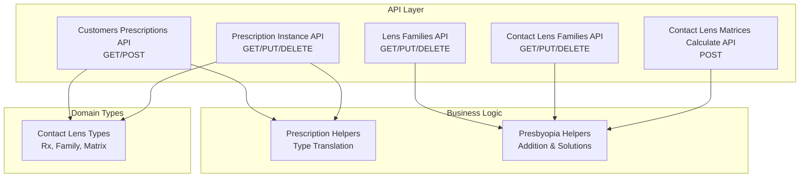

**Diagram sources**

- [route.ts](file://src/app/api/admin/customers/[id]/prescriptions/route.ts#L1-L167)
- [route.ts](file://src/app/api/admin/customers/[id]/prescriptions/[prescriptionId]/route.ts#L1-L231)
- [route.ts](file://src/app/api/admin/lens-families/[id]/route.ts#L1-L266)
- [route.ts](file://src/app/api/admin/contact-lens-families/[id]/route.ts)
- [route.ts](file://src/app/api/admin/contact-lens-matrices/calculate/route.ts)
- [prescription-helpers.ts](file://src/lib/prescription-helpers.ts#L1-L38)
- [presbyopia-helpers.ts](file://src/lib/presbyopia-helpers.ts#L1-L169)
- [contact-lens.ts](file://src/types/contact-lens.ts#L1-L76)

**Section sources**

- [route.ts](file://src/app/api/admin/customers/[id]/prescriptions/route.ts#L1-L167)
- [route.ts](file://src/app/api/admin/customers/[id]/prescriptions/[prescriptionId]/route.ts#L1-L231)
- [route.ts](file://src/app/api/admin/lens-families/[id]/route.ts#L1-L266)
- [route.ts](file://src/app/api/admin/contact-lens-families/[id]/route.ts)
- [route.ts](file://src/app/api/admin/contact-lens-matrices/calculate/route.ts)
- [prescription-helpers.ts](file://src/lib/prescription-helpers.ts#L1-L38)
- [presbyopia-helpers.ts](file://src/lib/presbyopia-helpers.ts#L1-L169)
- [contact-lens.ts](file://src/types/contact-lens.ts#L1-L76)

## Core Components

- Prescription API: Provides endpoints to list, create, update, and delete prescriptions for a customer, enforcing admin authorization and organization scoping.
- Presbyopia Helpers: Implements algorithms to detect addition, compute near sphere, and recommend compatible lens families based on presbyopia solutions.
- Prescription Helpers: Offers translation utilities for prescription types and enumerations.
- Contact Lens Types: Defines domain models for contact lens families, price matrices, and Rx parameters including base curve and diameter.
- Lens Families API: Manages optical lens families with organization-scoped access controls and validation.

Key responsibilities:

- Validate and normalize optical parameters (sphere, cylinder, axis, addition, PD).
- Enforce presbyopia-related logic and suggest appropriate lens types.
- Support contact lens validation with base curve and diameter constraints.
- Integrate with lens families and matrices for automatic parameter suggestions.

**Section sources**

- [route.ts](file://src/app/api/admin/customers/[id]/prescriptions/route.ts#L58-L166)
- [route.ts](file://src/app/api/admin/customers/[id]/prescriptions/[prescriptionId]/route.ts#L68-L171)
- [presbyopia-helpers.ts](file://src/lib/presbyopia-helpers.ts#L25-L116)
- [prescription-helpers.ts](file://src/lib/prescription-helpers.ts#L20-L37)
- [contact-lens.ts](file://src/types/contact-lens.ts#L25-L76)
- [route.ts](file://src/app/api/admin/lens-families/[id]/route.ts#L11-L86)

## Architecture Overview

The system follows a layered architecture:

- Presentation/API layer: Next.js routes handle HTTP requests and enforce authorization.
- Domain services: Helpers encapsulate business logic for presbyopia and translation.
- Data contracts: Strongly typed interfaces define optical and contact lens domains.

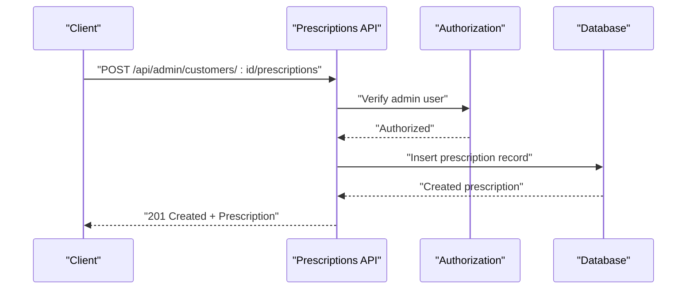

**Diagram sources**

- [route.ts](file://src/app/api/admin/customers/[id]/prescriptions/route.ts#L58-L166)

## Detailed Component Analysis

### Optical Prescription Creation Workflow

The optical prescription creation workflow supports:

- Sphere (right/left eye)
- Cylinder and axis (astigmatism)
- Addition (presbyopia)
- Pupillary distances (distance and near)
- Additional attributes: prism, tint, coatings, notes, and lens metadata

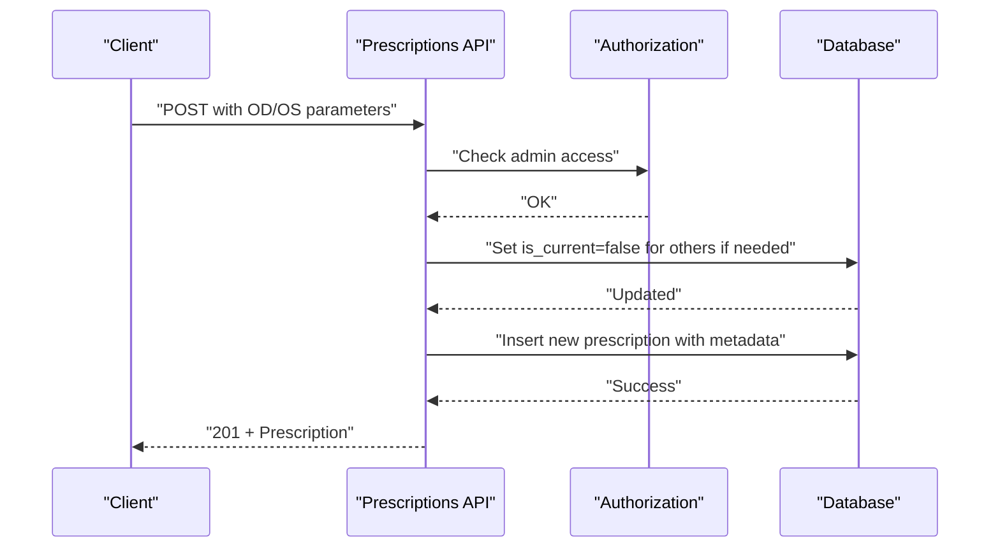

**Diagram sources**

- [route.ts](file://src/app/api/admin/customers/[id]/prescriptions/route.ts#L88-L148)

**Section sources**

- [route.ts](file://src/app/api/admin/customers/[id]/prescriptions/route.ts#L58-L166)

### Presbyopia Calculation Algorithms

Presbyopia helpers implement:

- Addition detection and averaging
- Near sphere computation from far sphere and addition
- Default presbyopia solution selection based on prescription type
- Compatibility checks between lens family types and presbyopia solutions

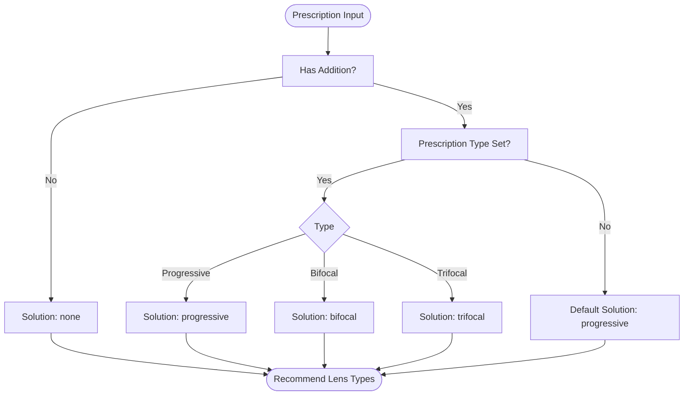

**Diagram sources**

- [presbyopia-helpers.ts](file://src/lib/presbyopia-helpers.ts#L25-L116)

**Section sources**

- [presbyopia-helpers.ts](file://src/lib/presbyopia-helpers.ts#L25-L116)

### Multifocal Lens Parameter Handling

The system supports multifocal parameters through:

- Addition field for presbyopia correction
- Near sphere derived from far sphere plus addition
- Recommended lens types aligned with presbyopia solutions

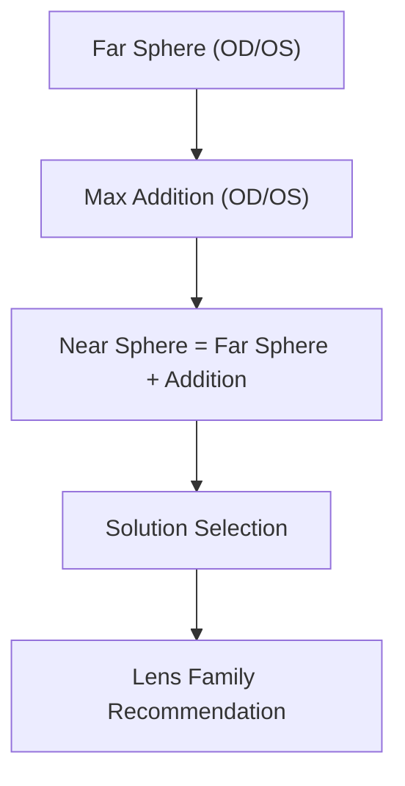

**Diagram sources**

- [presbyopia-helpers.ts](file://src/lib/presbyopia-helpers.ts#L88-L116)

**Section sources**

- [presbyopia-helpers.ts](file://src/lib/presbyopia-helpers.ts#L88-L116)

### Validation Rules for Prescription Accuracy and Medical Appropriateness

Current implementation validates:

- Authorization: Admin-only access enforced via RPC check.
- Organization scoping: Lens families and matrices are organization-scoped.
- Current prescription flag: When marking a prescription as current, other records are automatically cleared for the same customer.

Recommended enhancements for accuracy and appropriateness:

- Range validation for sphere (-20.00 to +20.00), cylinder (-6.00 to +6.00), axis (0 to 180), addition (0.00 to +6.00), and PD (40 to 80 mm).
- Axis validity: Axis must be within 0–180 degrees.
- Medical appropriateness: Addition should be consistent with age and prescription type; near sphere should not exceed safe limits.
- Cross-checks: Cylinder sign alignment with sphere; axis consistency across OD/OS.

Note: These validations are not currently implemented in the referenced files and should be added to the API request parsing and business logic layers.

**Section sources**

- [route.ts](file://src/app/api/admin/customers/[id]/prescriptions/route.ts#L90-L97)
- [route.ts](file://src/app/api/admin/lens-families/[id]/route.ts#L58-L77)

### Contact Lens Prescription Validation

Contact lens validation includes:

- Base curve and diameter constraints aligned with family specifications
- Rx parameters: sphere, cylinder, axis, addition
- Packaging and modality considerations (e.g., toric, multifocal)

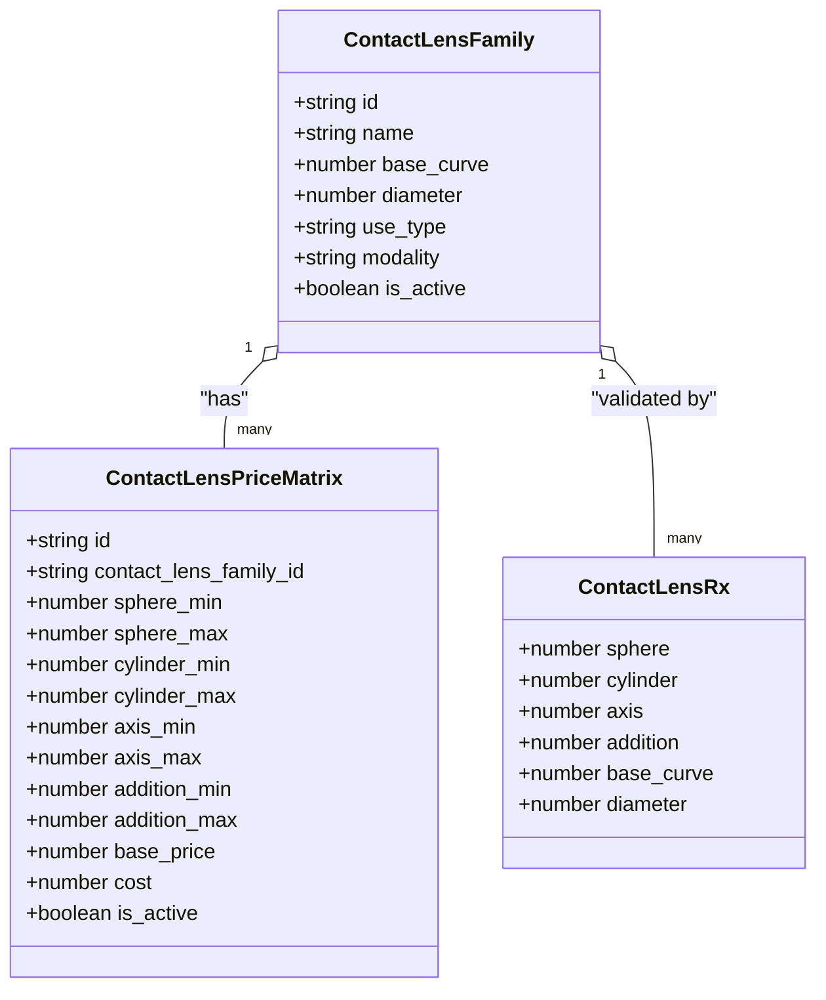

**Diagram sources**

- [contact-lens.ts](file://src/types/contact-lens.ts#L25-L76)

**Section sources**

- [contact-lens.ts](file://src/types/contact-lens.ts#L25-L76)

### Integration with Lens Families and Matrices

Integration points:

- Lens families define supported modalities and parameters (e.g., progressive, bifocal, trifocal).
- Matrices define acceptable ranges for sphere, cylinder, axis, and addition per family.
- Automatic parameter suggestions leverage presbyopia solutions and family compatibility.

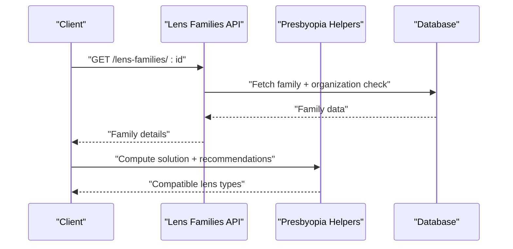

**Diagram sources**

- [route.ts](file://src/app/api/admin/lens-families/[id]/route.ts#L11-L86)
- [presbyopia-helpers.ts](file://src/lib/presbyopia-helpers.ts#L121-L146)

**Section sources**

- [route.ts](file://src/app/api/admin/lens-families/[id]/route.ts#L11-L86)
- [presbyopia-helpers.ts](file://src/lib/presbyopia-helpers.ts#L121-L146)

### Examples of Prescription Editing Workflows

Editing a prescription:

- Marking as current unsets other current prescriptions for the same customer.
- Updating OD/OS parameters while preserving non-specified fields.
- Maintaining organization and branch linkage for auditability.

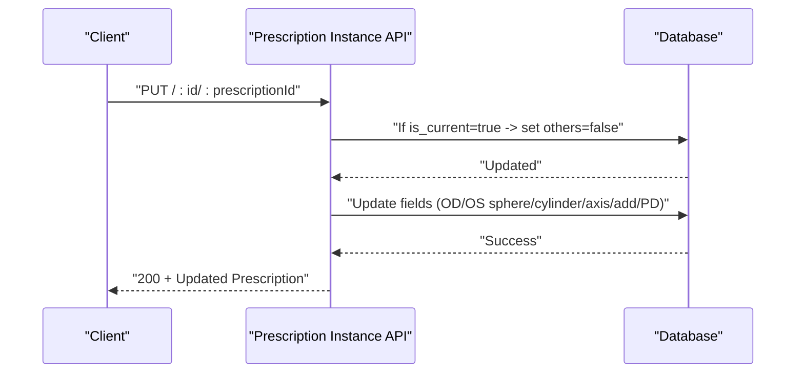

**Diagram sources**

- [route.ts](file://src/app/api/admin/customers/[id]/prescriptions/[prescriptionId]/route.ts#L98-L147)

**Section sources**

- [route.ts](file://src/app/api/admin/customers/[id]/prescriptions/[prescriptionId]/route.ts#L68-L171)

### Validation Error Handling

Common error scenarios and handling:

- Unauthorized access: Returns 401 or 403 depending on auth state.
- Not found: Returns 404 for missing resources.
- Internal errors: Returns 500 with logged details.

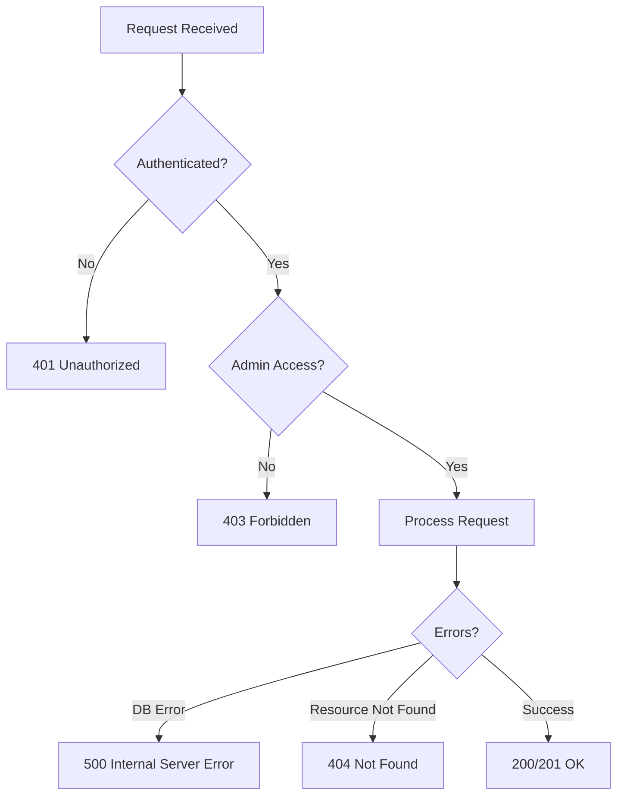

**Diagram sources**

- [route.ts](file://src/app/api/admin/customers/[id]/prescriptions/route.ts#L15-L32)
- [route.ts](file://src/app/api/admin/customers/[id]/prescriptions/[prescriptionId]/route.ts#L15-L32)

**Section sources**

- [route.ts](file://src/app/api/admin/customers/[id]/prescriptions/route.ts#L15-L32)
- [route.ts](file://src/app/api/admin/customers/[id]/prescriptions/[prescriptionId]/route.ts#L15-L32)

### Integration with Work Order Generation for Laboratory Processing

The system links prescriptions to work orders through:

- Organization and branch scoping for accurate routing.
- Lens family and matrix compatibility ensuring lab instructions are precise.
- Contact lens families enabling specialized contact lens orders.

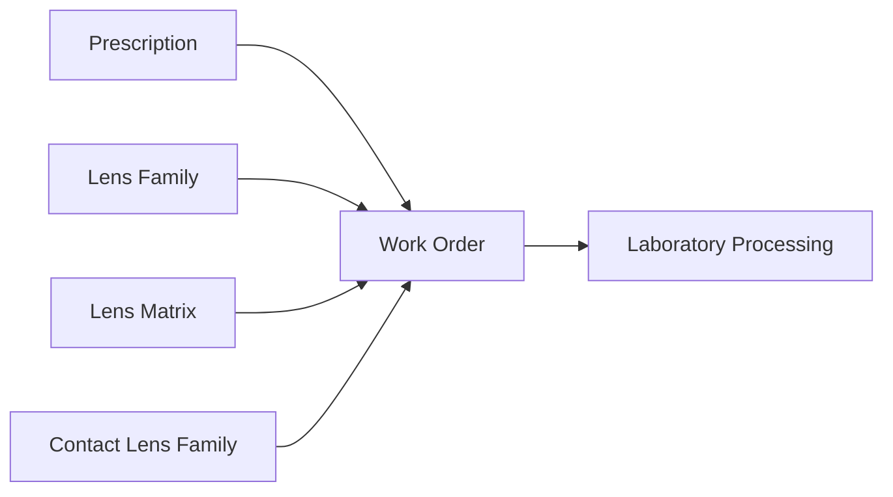

**Diagram sources**

- [route.ts](file://src/app/api/admin/customers/[id]/prescriptions/route.ts#L99-L112)
- [route.ts](file://src/app/api/admin/lens-families/[id]/route.ts#L58-L77)
- [contact-lens.ts](file://src/types/contact-lens.ts#L25-L40)

**Section sources**

- [route.ts](file://src/app/api/admin/customers/[id]/prescriptions/route.ts#L99-L112)
- [route.ts](file://src/app/api/admin/lens-families/[id]/route.ts#L58-L77)
- [contact-lens.ts](file://src/types/contact-lens.ts#L25-L40)

## Dependency Analysis

- API routes depend on Supabase clients for authentication and database operations.
- Presbyopia helpers depend on the Prescription interface for calculations.
- Contact lens types define the contract for Rx and matrix validation.
- Lens families API enforces organization scoping and validation.

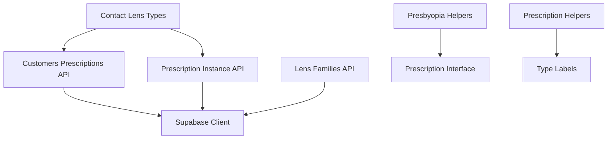

**Diagram sources**

- [route.ts](file://src/app/api/admin/customers/[id]/prescriptions/route.ts#L1-L10)
- [route.ts](file://src/app/api/admin/customers/[id]/prescriptions/[prescriptionId]/route.ts#L1-L5)
- [route.ts](file://src/app/api/admin/lens-families/[id]/route.ts#L1-L9)
- [presbyopia-helpers.ts](file://src/lib/presbyopia-helpers.ts#L12-L20)
- [prescription-helpers.ts](file://src/lib/prescription-helpers.ts#L5-L13)
- [contact-lens.ts](file://src/types/contact-lens.ts#L25-L40)

**Section sources**

- [route.ts](file://src/app/api/admin/customers/[id]/prescriptions/route.ts#L1-L10)
- [route.ts](file://src/app/api/admin/customers/[id]/prescriptions/[prescriptionId]/route.ts#L1-L5)
- [route.ts](file://src/app/api/admin/lens-families/[id]/route.ts#L1-L9)
- [presbyopia-helpers.ts](file://src/lib/presbyopia-helpers.ts#L12-L20)
- [prescription-helpers.ts](file://src/lib/prescription-helpers.ts#L5-L13)
- [contact-lens.ts](file://src/types/contact-lens.ts#L25-L40)

## Performance Considerations

- Minimize database roundtrips by batching updates (e.g., current prescription flag logic).
- Add indexes on frequently queried fields: customer_id, organization_id, branch_id, and is_current.
- Cache organization-scoped lens families for repeated access during validation.
- Use streaming responses for large result sets when listing prescriptions.

## Troubleshooting Guide

- Authentication failures: Verify admin user session and RPC is_admin result.
- Resource not found: Confirm organization membership and resource existence.
- Validation errors: Review request payload against expected fields and types.
- Current prescription conflicts: Ensure only one current prescription per customer.

**Section sources**

- [route.ts](file://src/app/api/admin/customers/[id]/prescriptions/route.ts#L15-L32)
- [route.ts](file://src/app/api/admin/customers/[id]/prescriptions/[prescriptionId]/route.ts#L15-L32)
- [route.ts](file://src/app/api/admin/lens-families/[id]/route.ts#L58-L77)

## Conclusion

The Prescription Validation System integrates optical prescription management with presbyopia-aware calculations and lens family compatibility. It provides a robust foundation for accurate optical and contact lens validation, with clear extension points for adding range checks, medical appropriateness rules, and enhanced integration with work order generation. The modular design ensures maintainability and scalability as validation requirements evolve.
