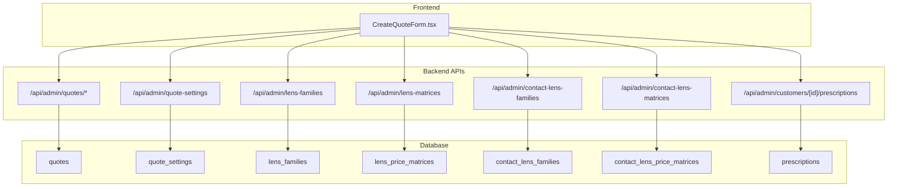
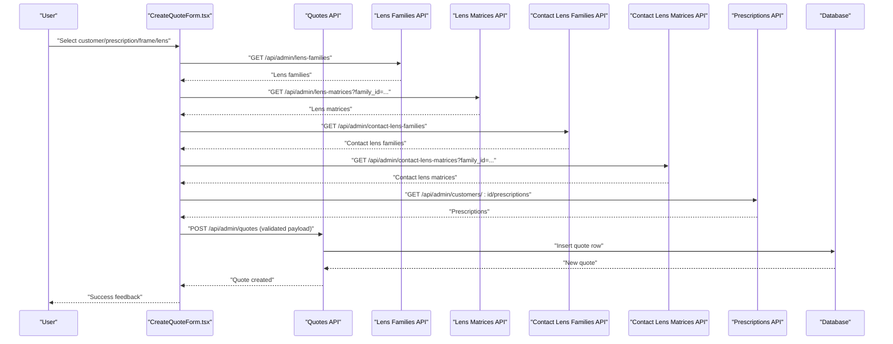
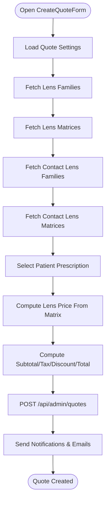
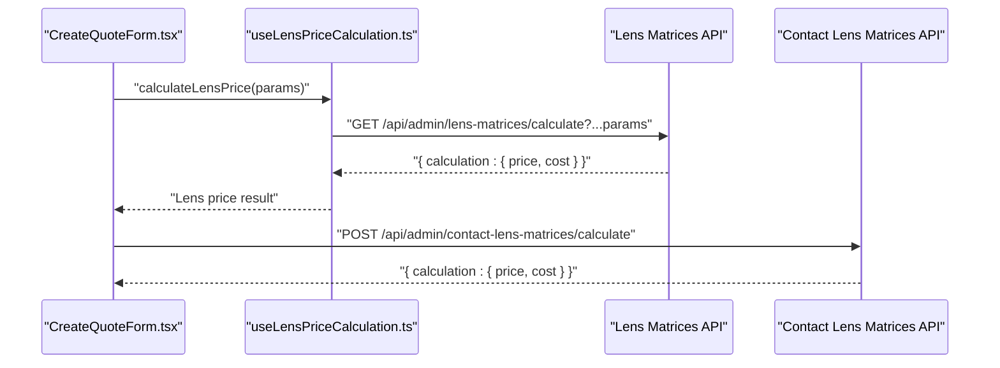
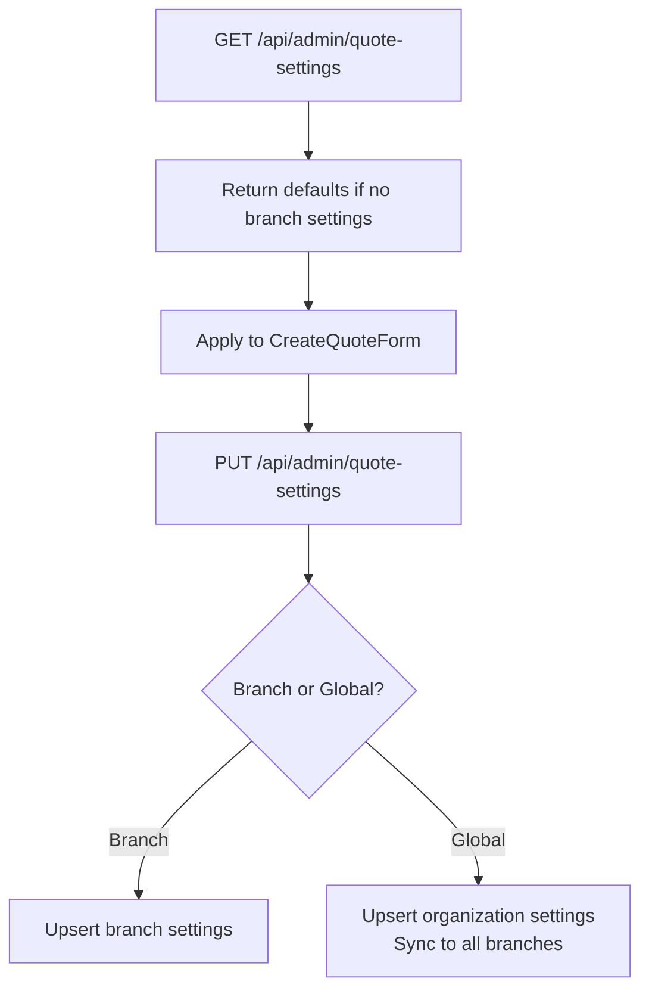
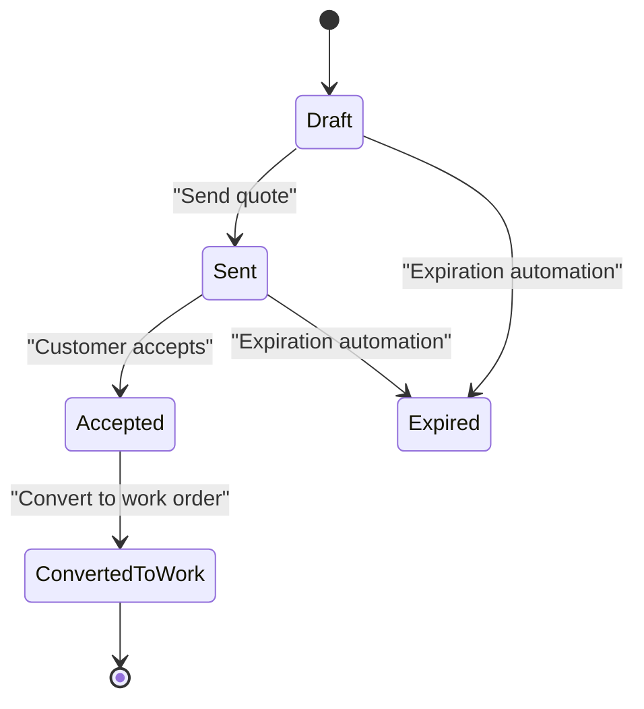
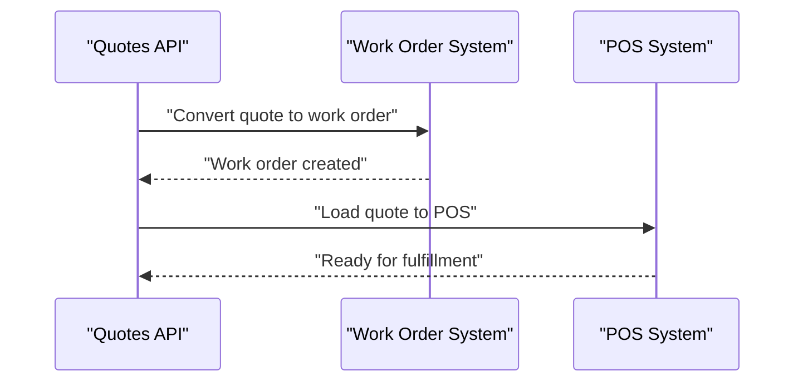
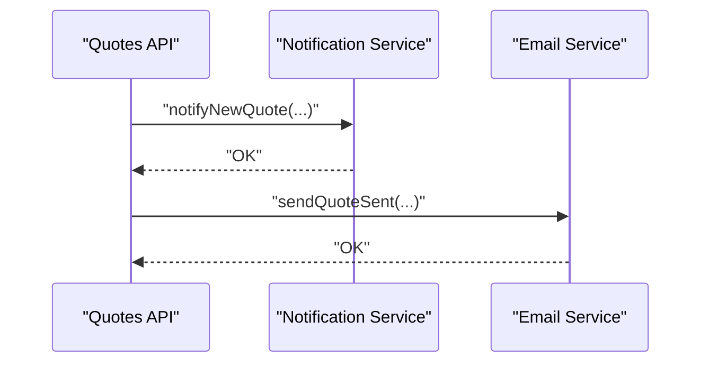
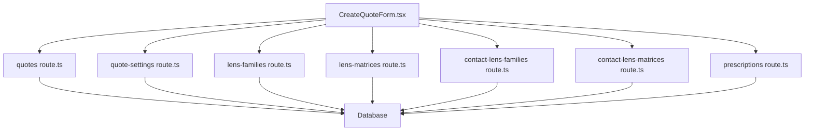

# Quote Generation Workflow

<cite>
**Referenced Files in This Document**
- [CreateQuoteForm.tsx](file://src/components/admin/CreateQuoteForm.tsx)
- [quotes route.ts](file://src/app/api/admin/quotes/route.ts)
- [quote-settings route.ts](file://src/app/api/admin/quote-settings/route.ts)
- [lens-families route.ts](file://src/app/api/admin/lens-families/route.ts)
- [lens-matrices route.ts](file://src/app/api/admin/lens-matrices/route.ts)
- [contact-lens-families route.ts](file://src/app/api/admin/contact-lens-families/route.ts)
- [contact-lens-matrices route.ts](file://src/app/api/admin/contact-lens-matrices/route.ts)
- [prescriptions route.ts](file://src/app/api/admin/customers/[id]/prescriptions/route.ts)
- [prescription-helpers.ts](file://src/lib/prescription-helpers.ts)
- [useLensPriceCalculation.ts](file://src/hooks/useLensPriceCalculation.ts)
</cite>

## Table of Contents

1. [Introduction](#introduction)
2. [Project Structure](#project-structure)
3. [Core Components](#core-components)
4. [Architecture Overview](#architecture-overview)
5. [Detailed Component Analysis](#detailed-component-analysis)
6. [Dependency Analysis](#dependency-analysis)
7. [Performance Considerations](#performance-considerations)
8. [Troubleshooting Guide](#troubleshooting-guide)
9. [Conclusion](#conclusion)

## Introduction

This document explains the complete quote generation workflow system, from customer prescriptions to quote creation, automatic pricing via lens families and matrices, quote settings configuration, status management, and conversion to work orders with POS integration. It also covers expiration automation, discount rules, tax handling, customer notifications, and historical tracking for customer service.

## Project Structure

The quote workflow spans frontend forms, backend APIs, and database entities:

- Frontend: CreateQuoteForm orchestrates customer/prescription/frame/lens selection, pricing calculation, and quote submission.
- Backend APIs: Manage quotes, quote settings, lens families/matrices, and prescriptions.
- Database: Stores quotes, quote settings, lens families, lens matrices, contact lens families/matrices, and prescriptions.

**Diagram sources**

- [CreateQuoteForm.tsx](file://src/components/admin/CreateQuoteForm.tsx#L1-L800)
- [quotes route.ts](file://src/app/api/admin/quotes/route.ts#L1-L552)
- [quote-settings route.ts](file://src/app/api/admin/quote-settings/route.ts#L1-L315)
- [lens-families route.ts](file://src/app/api/admin/lens-families/route.ts#L1-L222)
- [lens-matrices route.ts](file://src/app/api/admin/lens-matrices/route.ts#L1-L224)
- [contact-lens-families route.ts](file://src/app/api/admin/contact-lens-families/route.ts#L1-L176)
- [contact-lens-matrices route.ts](file://src/app/api/admin/contact-lens-matrices/route.ts#L1-L203)
- [prescriptions route.ts](file://src/app/api/admin/customers/[id]/prescriptions/route.ts#L1-L167)

**Section sources**

- [CreateQuoteForm.tsx](file://src/components/admin/CreateQuoteForm.tsx#L1-L800)
- [quotes route.ts](file://src/app/api/admin/quotes/route.ts#L1-L552)
- [quote-settings route.ts](file://src/app/api/admin/quote-settings/route.ts#L1-L315)
- [lens-families route.ts](file://src/app/api/admin/lens-families/route.ts#L1-L222)
- [lens-matrices route.ts](file://src/app/api/admin/lens-matrices/route.ts#L1-L224)
- [contact-lens-families route.ts](file://src/app/api/admin/contact-lens-families/route.ts#L1-L176)
- [contact-lens-matrices route.ts](file://src/app/api/admin/contact-lens-matrices/route.ts#L1-L203)
- [prescriptions route.ts](file://src/app/api/admin/customers/[id]/prescriptions/route.ts#L1-L167)

## Core Components

- CreateQuoteForm: Manages customer/prescription/frame/lens selection, calculates prices using lens families/matrices, applies quote settings, and submits quotes.
- Quotes API: Handles listing, creation, status updates, sending, conversion to work orders, and POS loading.
- Quote Settings API: Manages branch-specific or global defaults for labor costs, tax, expiration days, treatment prices, and inclusion flags.
- Lens Systems: Lens families and matrices define pricing rules; contact lens families/matrices support contact lens pricing.
- Prescriptions API: Retrieves and creates patient prescriptions linked to quotes.

Key capabilities:

- Automatic pricing via lens families/matrices with support for optical and contact lenses.
- Tax calculation and inclusion flags.
- Expiration automation and status transitions.
- Notifications and email dispatch for quote events.
- Multi-tenancy-aware queries and branch scoping.

**Section sources**

- [CreateQuoteForm.tsx](file://src/components/admin/CreateQuoteForm.tsx#L1-L800)
- [quotes route.ts](file://src/app/api/admin/quotes/route.ts#L1-L552)
- [quote-settings route.ts](file://src/app/api/admin/quote-settings/route.ts#L1-L315)
- [lens-families route.ts](file://src/app/api/admin/lens-families/route.ts#L1-L222)
- [lens-matrices route.ts](file://src/app/api/admin/lens-matrices/route.ts#L1-L224)
- [contact-lens-families route.ts](file://src/app/api/admin/contact-lens-families/route.ts#L1-L176)
- [contact-lens-matrices route.ts](file://src/app/api/admin/contact-lens-matrices/route.ts#L1-L203)
- [prescriptions route.ts](file://src/app/api/admin/customers/[id]/prescriptions/route.ts#L1-L167)

## Architecture Overview

The quote lifecycle integrates frontend selection with backend APIs and database persistence. Pricing is computed using lens families and matrices, while settings govern defaults and tax behavior.

**Diagram sources**

- [CreateQuoteForm.tsx](file://src/components/admin/CreateQuoteForm.tsx#L270-L313)
- [quotes route.ts](file://src/app/api/admin/quotes/route.ts#L275-L551)
- [lens-families route.ts](file://src/app/api/admin/lens-families/route.ts#L15-L94)
- [lens-matrices route.ts](file://src/app/api/admin/lens-matrices/route.ts#L12-L123)
- [contact-lens-families route.ts](file://src/app/api/admin/contact-lens-families/route.ts#L17-L93)
- [contact-lens-matrices route.ts](file://src/app/api/admin/contact-lens-matrices/route.ts#L14-L108)
- [prescriptions route.ts](file://src/app/api/admin/customers/[id]/prescriptions/route.ts#L7-L55)

## Detailed Component Analysis

### Quote Creation Workflow

- Inputs: Customer, prescription, frame, lens family/type/material, treatments, quantities, notes.
- Pricing: Uses lens families and matrices to compute lens costs; supports optical and contact lenses; manual override option.
- Settings: Loads defaults for labor cost, tax percentage, expiration days, and treatment prices.
- Submission: Validates payload, generates quote number, determines branch, computes expiration date, persists quote, and triggers notifications.

**Diagram sources**

- [CreateQuoteForm.tsx](file://src/components/admin/CreateQuoteForm.tsx#L337-L475)
- [quotes route.ts](file://src/app/api/admin/quotes/route.ts#L275-L551)
- [quote-settings route.ts](file://src/app/api/admin/quote-settings/route.ts#L7-L111)

**Section sources**

- [CreateQuoteForm.tsx](file://src/components/admin/CreateQuoteForm.tsx#L337-L475)
- [quotes route.ts](file://src/app/api/admin/quotes/route.ts#L275-L551)
- [quote-settings route.ts](file://src/app/api/admin/quote-settings/route.ts#L7-L111)

### Automatic Pricing Using Lens Families and Matrices

- Optical lenses: Selected lens family and prescription parameters (sphere, cylinder, addition) drive matrix lookup and pricing.
- Contact lenses: Selected contact lens family and prescription parameters (OD/OS sphere, cylinder, axis, addition) drive pricing.
- Hook integration: useLensPriceCalculation encapsulates matrix-based pricing requests.
- Fallback: Manual price entry supported when no matrix matches.

**Diagram sources**

- [CreateQuoteForm.tsx](file://src/components/admin/CreateQuoteForm.tsx#L388-L475)
- [useLensPriceCalculation.ts](file://src/hooks/useLensPriceCalculation.ts#L22-L74)
- [lens-matrices route.ts](file://src/app/api/admin/lens-matrices/route.ts#L1-L224)
- [contact-lens-matrices route.ts](file://src/app/api/admin/contact-lens-matrices/route.ts#L1-L203)

**Section sources**

- [CreateQuoteForm.tsx](file://src/components/admin/CreateQuoteForm.tsx#L388-L475)
- [useLensPriceCalculation.ts](file://src/hooks/useLensPriceCalculation.ts#L22-L74)
- [lens-matrices route.ts](file://src/app/api/admin/lens-matrices/route.ts#L1-L224)
- [contact-lens-matrices route.ts](file://src/app/api/admin/contact-lens-matrices/route.ts#L1-L203)

### Quote Settings Configuration

- Defaults: Labor cost, tax percentage, expiration days, margin percentage, currency, terms and conditions, notes template.
- Inclusion flags: Labor cost includes tax, lens cost includes tax, treatments cost includes tax.
- Treatment prices: Configurable per treatment; supports enable/disable and price values.
- Scope: Branch-specific or global (organization-wide) depending on user role and branch context.
- Update propagation: Global updates sync to all branches for the organization.

**Diagram sources**

- [quote-settings route.ts](file://src/app/api/admin/quote-settings/route.ts#L7-L111)
- [quote-settings route.ts](file://src/app/api/admin/quote-settings/route.ts#L113-L314)

**Section sources**

- [quote-settings route.ts](file://src/app/api/admin/quote-settings/route.ts#L7-L111)
- [quote-settings route.ts](file://src/app/api/admin/quote-settings/route.ts#L113-L314)

### Quote Lifecycle and Status Management

- Statuses: draft, sent, accepted, expired, converted_to_work (mapped to original_status when applicable).
- Expiration: Automated expiration checks occur before listing; expiration date computed from settings or provided date.
- Actions: Send quote (triggers email), update status, convert to work order, load to POS.

**Diagram sources**

- [quotes route.ts](file://src/app/api/admin/quotes/route.ts#L115-L118)
- [quotes route.ts](file://src/app/api/admin/quotes/route.ts#L250-L254)

**Section sources**

- [quotes route.ts](file://src/app/api/admin/quotes/route.ts#L115-L118)
- [quotes route.ts](file://src/app/api/admin/quotes/route.ts#L250-L254)

### Quote Conversion to Work Orders and POS Integration

- Conversion endpoint: Converts a quote to a work order record.
- POS integration: Loads a quote into POS for immediate fulfillment.
- This enables seamless handoff from quote to lab production and retail fulfillment.

**Diagram sources**

- [quotes route.ts](file://src/app/api/admin/quotes/[id]/convert/route.ts)
- [quotes route.ts](file://src/app/api/admin/quotes/[id]/load-to-pos/route.ts)

**Section sources**

- [quotes route.ts](file://src/app/api/admin/quotes/[id]/convert/route.ts)
- [quotes route.ts](file://src/app/api/admin/quotes/[id]/load-to-pos/route.ts)

### Customer Notification Workflows

- New quote notification: Non-blocking notification service invoked after creation.
- Email dispatch: When status is sent, email sent notification is triggered with branch and quote details.

**Diagram sources**

- [quotes route.ts](file://src/app/api/admin/quotes/route.ts#L490-L538)

**Section sources**

- [quotes route.ts](file://src/app/api/admin/quotes/route.ts#L490-L538)

### Examples and Use Cases

- Creating a quote from a customer prescription:
  - Select customer → Load prescriptions → Choose latest/current → Select frame → Choose lens family → Auto-calculate lens price → Submit quote.
- Bulk quote processing:
  - Use the quotes listing endpoint with filters (status, customer_id, customer_rut, customer_email) to identify candidates for bulk actions (e.g., re-send, update status).
- Integration with appointment scheduling:
  - Prescriptions are linked to patients; quotes can reference prescriptions to coordinate consultations and follow-ups.

**Section sources**

- [prescriptions route.ts](file://src/app/api/admin/customers/[id]/prescriptions/route.ts#L7-L55)
- [quotes route.ts](file://src/app/api/admin/quotes/route.ts#L17-L273)

### Quote Modification, Cancellation, and Historical Tracking

- Modification: Update quote fields (frame, lenses, treatments, notes) and resubmit; totals recomputed using settings and matrices.
- Cancellation: Use status updates to mark quotes canceled/expired; maintain original_status for audit trails.
- Historical tracking: Listing includes original_status mapping for converted quotes; branch and organization filters preserve multi-tenancy history visibility.

**Section sources**

- [quotes route.ts](file://src/app/api/admin/quotes/route.ts#L250-L254)
- [quotes route.ts](file://src/app/api/admin/quotes/route.ts#L115-L118)

## Dependency Analysis

- Frontend depends on:
  - Quote settings for defaults and tax behavior.
  - Lens families/matrices for pricing computation.
  - Prescriptions for patient data.
- Backend APIs depend on:
  - Supabase for authentication, authorization, and data access.
  - Branch middleware for multi-tenancy and branch scoping.
  - Notification and email services for customer communication.

**Diagram sources**

- [CreateQuoteForm.tsx](file://src/components/admin/CreateQuoteForm.tsx#L1-L800)
- [quote-settings route.ts](file://src/app/api/admin/quote-settings/route.ts#L1-L315)
- [lens-families route.ts](file://src/app/api/admin/lens-families/route.ts#L1-L222)
- [lens-matrices route.ts](file://src/app/api/admin/lens-matrices/route.ts#L1-L224)
- [contact-lens-families route.ts](file://src/app/api/admin/contact-lens-families/route.ts#L1-L176)
- [contact-lens-matrices route.ts](file://src/app/api/admin/contact-lens-matrices/route.ts#L1-L203)
- [prescriptions route.ts](file://src/app/api/admin/customers/[id]/prescriptions/route.ts#L1-L167)
- [quotes route.ts](file://src/app/api/admin/quotes/route.ts#L1-L552)

**Section sources**

- [CreateQuoteForm.tsx](file://src/components/admin/CreateQuoteForm.tsx#L1-L800)
- [quote-settings route.ts](file://src/app/api/admin/quote-settings/route.ts#L1-L315)
- [lens-families route.ts](file://src/app/api/admin/lens-families/route.ts#L1-L222)
- [lens-matrices route.ts](file://src/app/api/admin/lens-matrices/route.ts#L1-L224)
- [contact-lens-families route.ts](file://src/app/api/admin/contact-lens-families/route.ts#L1-L176)
- [contact-lens-matrices route.ts](file://src/app/api/admin/contact-lens-matrices/route.ts#L1-L203)
- [prescriptions route.ts](file://src/app/api/admin/customers/[id]/prescriptions/route.ts#L1-L167)
- [quotes route.ts](file://src/app/api/admin/quotes/route.ts#L1-L552)

## Performance Considerations

- Debounced matrix-based pricing: Calculation occurs after minimal input changes to avoid excessive API calls.
- Batched queries: Listing quotes fetches related customer/prescription/product data efficiently.
- Multi-tenancy filters: Organization and branch filters prevent scanning unnecessary data.
- Background expiration: RPC-based expiration check runs before listing to keep data consistent.

## Troubleshooting Guide

- Pricing not calculated:
  - Verify lens family selection and presence of matching matrices for the selected prescription parameters.
  - Check matrix calculation endpoint responses and error messages.
- Settings not applied:
  - Confirm branch context and that settings exist for the selected branch or global scope.
  - Ensure inclusion flags align with tax expectations.
- Quote not appearing:
  - Use listing filters (status, customer_id/RUT/email) to locate quotes across branches and organizations.
- Expiration issues:
  - Review expiration automation RPC and default expiration days setting.

**Section sources**

- [CreateQuoteForm.tsx](file://src/components/admin/CreateQuoteForm.tsx#L388-L475)
- [quote-settings route.ts](file://src/app/api/admin/quote-settings/route.ts#L7-L111)
- [quotes route.ts](file://src/app/api/admin/quotes/route.ts#L115-L118)

## Conclusion

The quote generation workflow integrates patient prescriptions, automated pricing via lens families and matrices, configurable quote settings, robust status management, and seamless conversion to work orders and POS fulfillment. Multi-tenancy and branch scoping ensure accurate data isolation, while notifications and email dispatch improve customer experience. The system supports modification, cancellation, and historical tracking for efficient customer service operations.
