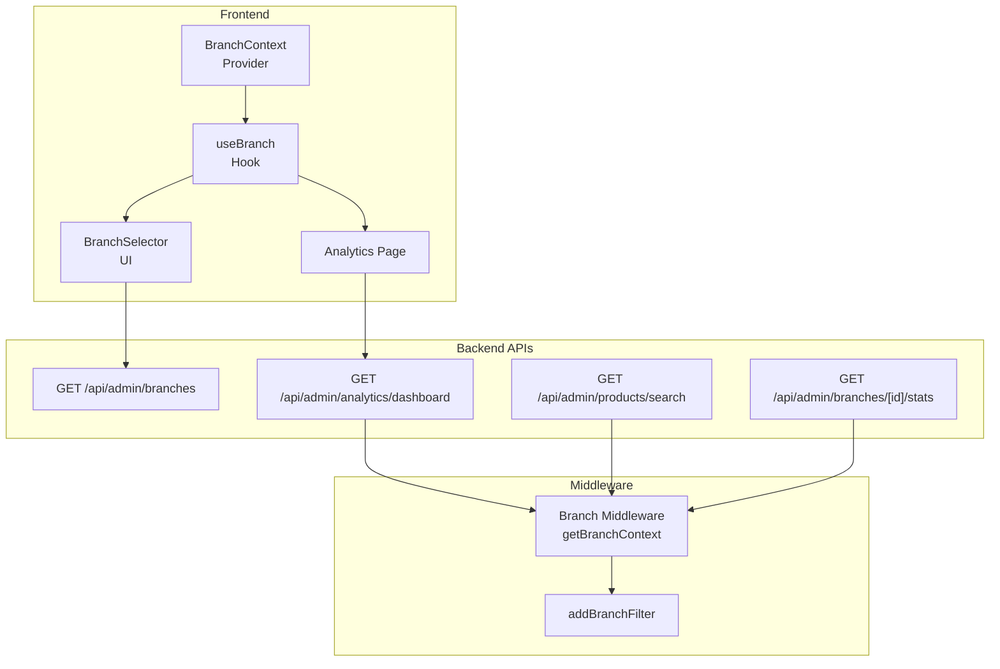
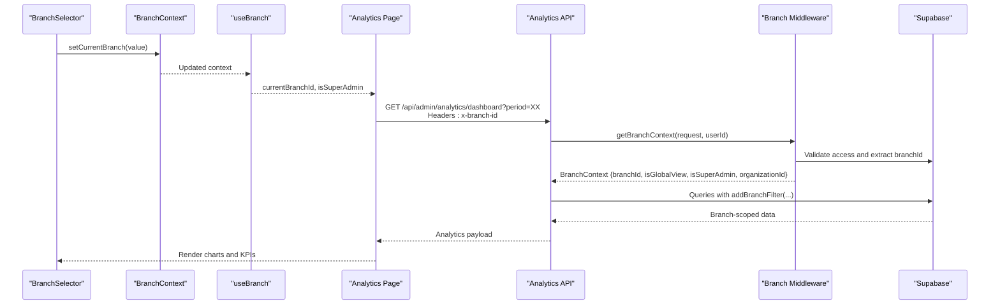
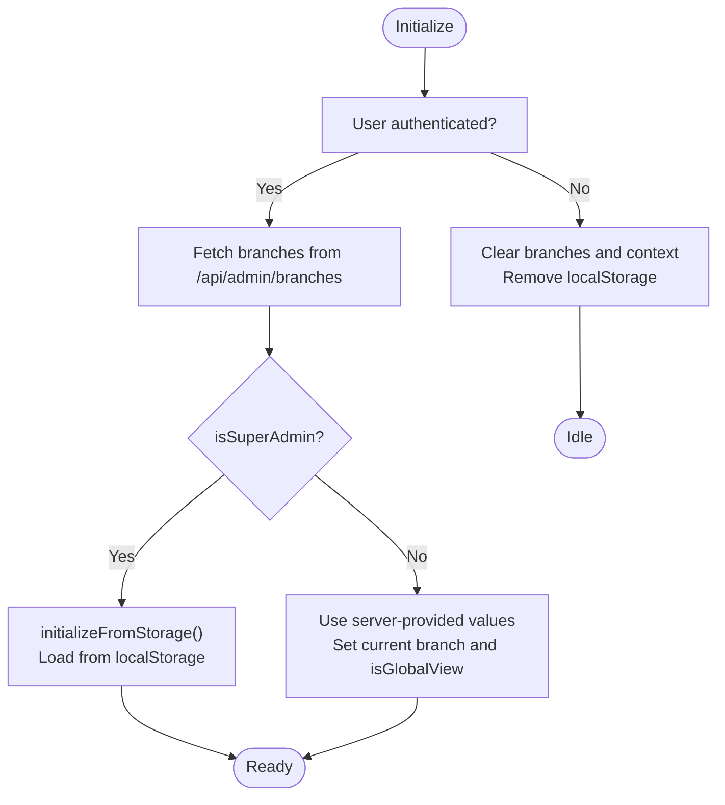
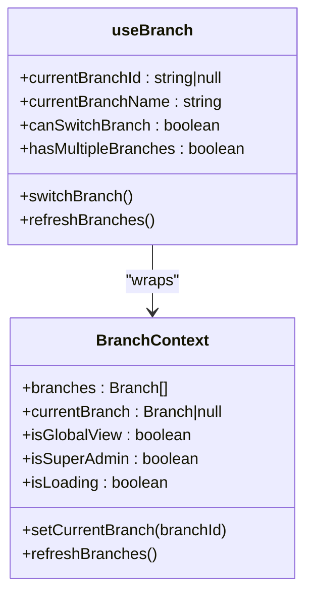
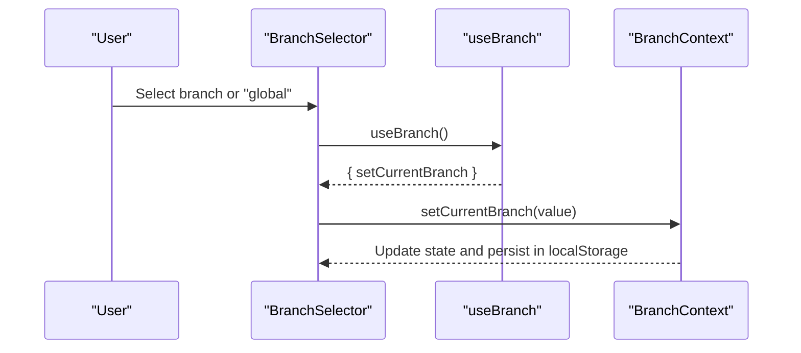
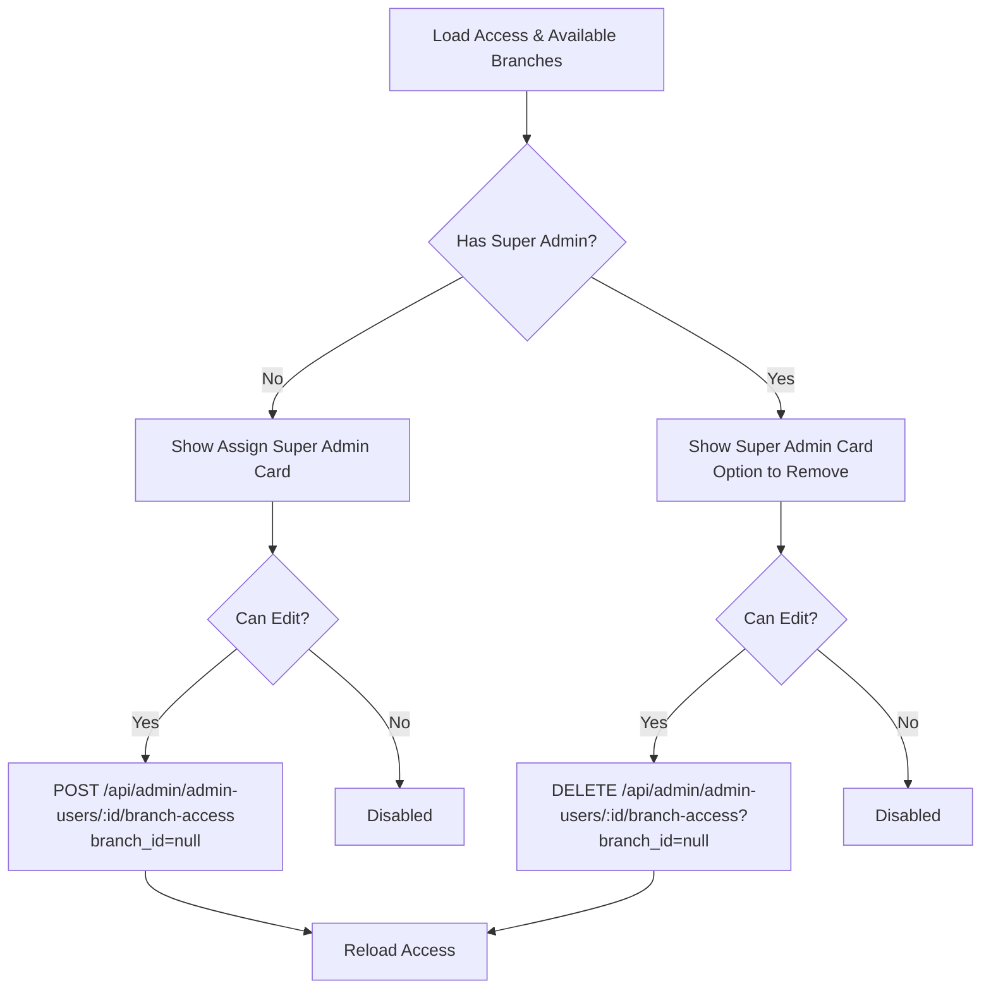
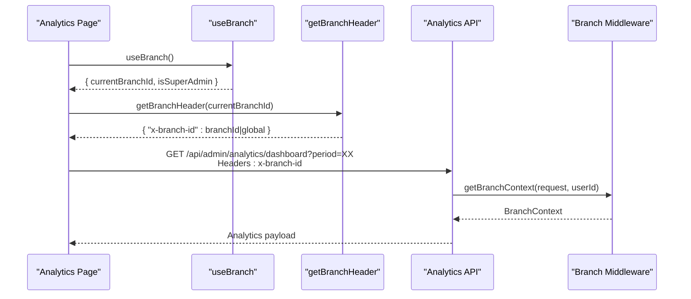
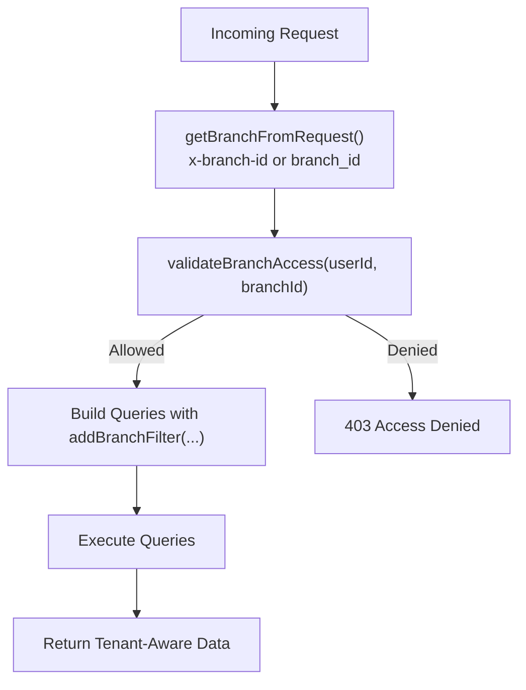
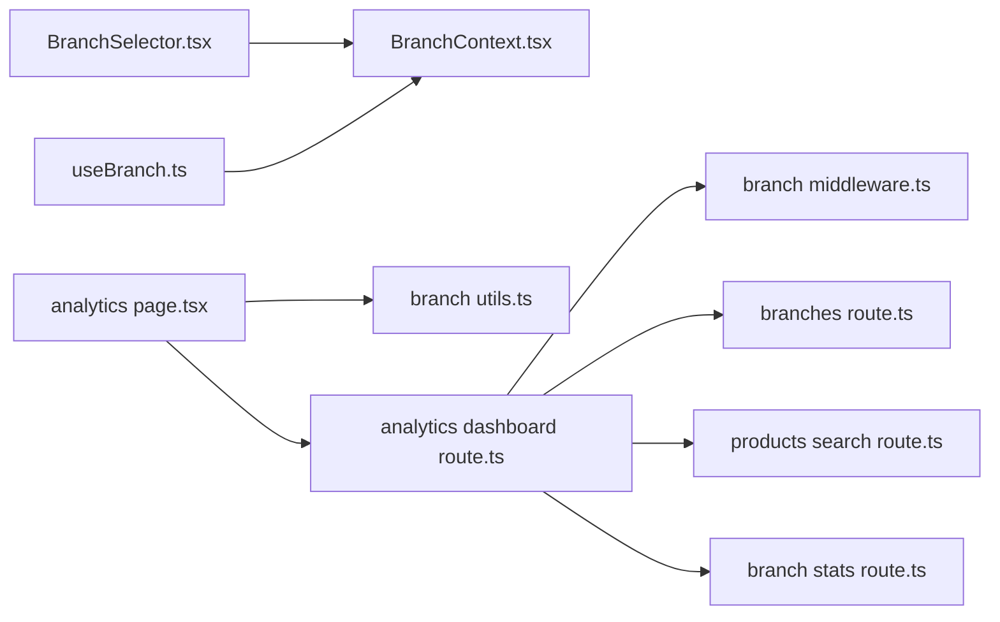

# Branch Analytics & Filtering

<cite>
**Referenced Files in This Document**
- [BranchContext.tsx](file://src/contexts/BranchContext.tsx)
- [useBranch.ts](file://src/hooks/useBranch.ts)
- [BranchSelector.tsx](file://src/components/admin/BranchSelector.tsx)
- [BranchAccessManager.tsx](file://src/components/admin/BranchAccessManager.tsx)
- [analytics page.tsx](file://src/app/admin/analytics/page.tsx)
- [analytics dashboard route.ts](file://src/app/api/admin/analytics/dashboard/route.ts)
- [branch middleware.ts](file://src/lib/api/branch-middleware.ts)
- [branch utils.ts](file://src/lib/utils/branch.ts)
- [branches route.ts](file://src/app/api/admin/branches/route.ts)
- [products search route.ts](file://src/app/api/admin/products/search/route.ts)
- [branch stats route.ts](file://src/app/api/admin/branches/[id]/stats/route.ts)
- [quotes convert route.ts](file://src/app/api/admin/quotes/[id]/convert/route.ts)
</cite>

## Table of Contents

1. [Introduction](#introduction)
2. [Project Structure](#project-structure)
3. [Core Components](#core-components)
4. [Architecture Overview](#architecture-overview)
5. [Detailed Component Analysis](#detailed-component-analysis)
6. [Dependency Analysis](#dependency-analysis)
7. [Performance Considerations](#performance-considerations)
8. [Troubleshooting Guide](#troubleshooting-guide)
9. [Conclusion](#conclusion)

## Introduction

This document explains the branch analytics and filtering system designed for multi-tenant data visualization and branch-level reporting. It covers branch context integration, super admin global view capabilities, and organization-based data isolation. The documentation details the branch selection UI, data filtering mechanisms, and tenant-aware API requests. It also describes the branch context provider, the useBranch hook functionality, and data scoping patterns, including branch-aware dashboard queries, permission-based data access, and multi-location analytics. Examples demonstrate branch switching, global reporting views, and tenant-specific data filtering, along with integration points to the branch management system and subscription-based access controls.

## Project Structure

The branch analytics system spans three main layers:

- Frontend context and UI: Branch context provider, useBranch hook, and branch selector UI
- Analytics dashboard: Branch-scoped analytics queries and visualization
- Backend middleware and APIs: Branch context extraction, filtering, and permission validation

**Diagram sources**

- [BranchContext.tsx](file://src/contexts/BranchContext.tsx#L38-L207)
- [useBranch.ts](file://src/hooks/useBranch.ts#L40-L52)
- [BranchSelector.tsx](file://src/components/admin/BranchSelector.tsx#L15-L106)
- [analytics page.tsx](file://src/app/admin/analytics/page.tsx#L134-L191)
- [analytics dashboard route.ts](file://src/app/api/admin/analytics/dashboard/route.ts#L8-L634)
- [branch middleware.ts](file://src/lib/api/branch-middleware.ts#L23-L40)
- [branches route.ts](file://src/app/api/admin/branches/route.ts#L83-L133)
- [products search route.ts](file://src/app/api/admin/products/search/route.ts#L1-L39)
- [branch stats route.ts](file://src/app/api/admin/branches/[id]/stats/route.ts#L1-L48)

**Section sources**

- [BranchContext.tsx](file://src/contexts/BranchContext.tsx#L38-L207)
- [useBranch.ts](file://src/hooks/useBranch.ts#L40-L52)
- [BranchSelector.tsx](file://src/components/admin/BranchSelector.tsx#L15-L106)
- [analytics page.tsx](file://src/app/admin/analytics/page.tsx#L134-L191)
- [analytics dashboard route.ts](file://src/app/api/admin/analytics/dashboard/route.ts#L8-L634)
- [branch middleware.ts](file://src/lib/api/branch-middleware.ts#L23-L40)
- [branches route.ts](file://src/app/api/admin/branches/route.ts#L83-L133)
- [products search route.ts](file://src/app/api/admin/products/search/route.ts#L1-L39)
- [branch stats route.ts](file://src/app/api/admin/branches/[id]/stats/route.ts#L1-L48)

## Core Components

- BranchContext provider: Manages available branches, current branch, global view flag, super admin status, and persistence via localStorage for super admins. It initializes from server data and supports switching between branches or global view.
- useBranch hook: Exposes convenient derived values (current branch ID/name, flags, and helpers) and wraps the context for UI components and queries.
- BranchSelector UI: Provides a dropdown to switch branches or enable global view for super admins, with loading states and disabled interactions during changes.
- BranchAccessManager: Allows assigning/removing super admin access and branch assignments for admin users, with real-time updates and validation.
- Analytics page: Fetches branch-scoped analytics data, displays KPIs and charts, and supports period selection and manual refresh.
- Branch middleware: Extracts branch context from requests (headers or query parameters), validates permissions, and applies branch filters to queries.
- Branch utilities: Provides helpers to format branch names, construct branch headers, and build branch query parameters for tenant-aware API calls.

**Section sources**

- [BranchContext.tsx](file://src/contexts/BranchContext.tsx#L12-L28)
- [useBranch.ts](file://src/hooks/useBranch.ts#L40-L52)
- [BranchSelector.tsx](file://src/components/admin/BranchSelector.tsx#L15-L106)
- [BranchAccessManager.tsx](file://src/components/admin/BranchAccessManager.tsx#L45-L341)
- [analytics page.tsx](file://src/app/admin/analytics/page.tsx#L134-L191)
- [branch middleware.ts](file://src/lib/api/branch-middleware.ts#L5-L18)
- [branch utils.ts](file://src/lib/utils/branch.ts#L40-L99)

## Architecture Overview

The system integrates frontend branch context with backend branch-aware APIs through a shared middleware. The analytics dashboard demonstrates the full lifecycle: UI selection → context update → tenant-aware API request → branch-filtered query → scoped analytics response.

**Diagram sources**

- [BranchSelector.tsx](file://src/components/admin/BranchSelector.tsx#L27-L36)
- [BranchContext.tsx](file://src/contexts/BranchContext.tsx#L157-L176)
- [useBranch.ts](file://src/hooks/useBranch.ts#L40-L52)
- [analytics page.tsx](file://src/app/admin/analytics/page.tsx#L164-L191)
- [analytics dashboard route.ts](file://src/app/api/admin/analytics/dashboard/route.ts#L59-L131)
- [branch middleware.ts](file://src/lib/api/branch-middleware.ts#L23-L40)

## Detailed Component Analysis

### Branch Context Provider

The BranchContext provider centralizes branch state and logic:

- Loads branches and determines super admin status from the server
- For super admins, initializes from localStorage to preserve selections across reloads
- For regular admins, selects a primary branch or falls back to the first available
- Supports switching to "global" view only for super admins
- Persists selections in localStorage for quick rehydration

**Diagram sources**

- [BranchContext.tsx](file://src/contexts/BranchContext.tsx#L73-L155)
- [BranchContext.tsx](file://src/contexts/BranchContext.tsx#L157-L176)

**Section sources**

- [BranchContext.tsx](file://src/contexts/BranchContext.tsx#L38-L207)

### useBranch Hook

The useBranch hook exposes:

- Core context values: branches, currentBranch, isGlobalView, isSuperAdmin, isLoading
- Derived convenience values: currentBranchId, currentBranchName, canSwitchBranch, hasMultipleBranches
- Actions: switchBranch (setCurrentBranch), refreshBranches (fetchBranches(true))

**Diagram sources**

- [BranchContext.tsx](file://src/contexts/BranchContext.tsx#L20-L28)
- [useBranch.ts](file://src/hooks/useBranch.ts#L40-L52)

**Section sources**

- [useBranch.ts](file://src/hooks/useBranch.ts#L40-L52)

### Branch Selector UI

The BranchSelector component:

- Reads current state from useBranch
- Shows "Vista Global" for super admins in global mode
- Displays branch names with optional primary indicators
- Disables while switching and shows loading states
- Calls setCurrentBranch on change

**Diagram sources**

- [BranchSelector.tsx](file://src/components/admin/BranchSelector.tsx#L15-L106)
- [BranchContext.tsx](file://src/contexts/BranchContext.tsx#L157-L176)

**Section sources**

- [BranchSelector.tsx](file://src/components/admin/BranchSelector.tsx#L15-L106)

### Branch Access Manager

The BranchAccessManager enables:

- Detecting super admin status from existing access records
- Assigning super admin (global access) or branch-specific roles
- Removing access for specific branches or global view
- Showing available branches that are not yet assigned

**Diagram sources**

- [BranchAccessManager.tsx](file://src/components/admin/BranchAccessManager.tsx#L57-L90)
- [BranchAccessManager.tsx](file://src/components/admin/BranchAccessManager.tsx#L92-L119)
- [BranchAccessManager.tsx](file://src/components/admin/BranchAccessManager.tsx#L121-L152)
- [BranchAccessManager.tsx](file://src/components/admin/BranchAccessManager.tsx#L154-L187)

**Section sources**

- [BranchAccessManager.tsx](file://src/components/admin/BranchAccessManager.tsx#L45-L341)

### Analytics Dashboard Queries

The analytics page:

- Uses useBranch to determine currentBranchId and isSuperAdmin
- Builds tenant-aware headers with getBranchHeader(currentBranchId)
- Calls GET /api/admin/analytics/dashboard with period parameter
- Renders KPI cards, charts, and tabbed sections
- Supports manual refresh and period selection

**Diagram sources**

- [analytics page.tsx](file://src/app/admin/analytics/page.tsx#L134-L191)
- [branch utils.ts](file://src/lib/utils/branch.ts#L92-L99)
- [analytics dashboard route.ts](file://src/app/api/admin/analytics/dashboard/route.ts#L59-L131)

**Section sources**

- [analytics page.tsx](file://src/app/admin/analytics/page.tsx#L134-L191)
- [branch utils.ts](file://src/lib/utils/branch.ts#L92-L99)
- [analytics dashboard route.ts](file://src/app/api/admin/analytics/dashboard/route.ts#L8-L634)

### Branch-Aware API Requests and Filtering

Backend branch middleware:

- Extracts branch context from x-branch-id header or branch_id query parameter
- Validates access against user permissions and accessible branches
- Applies branch filters to queries for all relevant entities (orders, customers, quotes, work orders, appointments, products)
- Supports global view for super admins by passing null branchId

**Diagram sources**

- [branch middleware.ts](file://src/lib/api/branch-middleware.ts#L23-L40)
- [analytics dashboard route.ts](file://src/app/api/admin/analytics/dashboard/route.ts#L112-L131)
- [branches route.ts](file://src/app/api/admin/branches/route.ts#L83-L104)
- [products search route.ts](file://src/app/api/admin/products/search/route.ts#L38-L39)
- [branch stats route.ts](file://src/app/api/admin/branches/[id]/stats/route.ts#L37-L46)

**Section sources**

- [branch middleware.ts](file://src/lib/api/branch-middleware.ts#L5-L18)
- [branch middleware.ts](file://src/lib/api/branch-middleware.ts#L23-L40)
- [analytics dashboard route.ts](file://src/app/api/admin/analytics/dashboard/route.ts#L112-L131)
- [branches route.ts](file://src/app/api/admin/branches/route.ts#L83-L104)
- [products search route.ts](file://src/app/api/admin/products/search/route.ts#L38-L39)
- [branch stats route.ts](file://src/app/api/admin/branches/[id]/stats/route.ts#L37-L46)

### Permission-Based Data Access and Organization Scoping

- Super admins can enable global view and access all branches; their selections are persisted locally
- Regular admins are restricted to assigned branches and cannot switch to global view
- Branch access is validated per request; unauthorized access attempts are rejected
- Organization scoping ensures global analytics remain within the user's organization boundaries

**Section sources**

- [BranchContext.tsx](file://src/contexts/BranchContext.tsx#L157-L176)
- [BranchContext.tsx](file://src/contexts/BranchContext.tsx#L180-L190)
- [branch middleware.ts](file://src/lib/api/branch-middleware.ts#L5-L18)
- [branch stats route.ts](file://src/app/api/admin/branches/[id]/stats/route.ts#L37-L46)

### Multi-Location Analytics and Subscription Controls

- Advanced analytics require the "advanced_analytics" feature flag for the organization; otherwise, the API returns a 403 with a specific error code
- The analytics API calculates KPIs, trends, and distributions scoped to the selected branch or global view for super admins
- Subscription tier validation occurs before building analytics queries

**Section sources**

- [analytics dashboard route.ts](file://src/app/api/admin/analytics/dashboard/route.ts#L35-L57)
- [analytics dashboard route.ts](file://src/app/api/admin/analytics/dashboard/route.ts#L59-L76)
- [analytics dashboard route.ts](file://src/app/api/admin/analytics/dashboard/route.ts#L549-L618)

## Dependency Analysis

The system exhibits clear separation of concerns:

- Frontend depends on BranchContext and useBranch for state and UI
- Analytics page depends on branch utilities for tenant headers
- Backend APIs depend on branch middleware for context extraction and filtering
- Branch routes provide the authoritative list of accessible branches and current selection

**Diagram sources**

- [BranchSelector.tsx](file://src/components/admin/BranchSelector.tsx#L15-L106)
- [BranchContext.tsx](file://src/contexts/BranchContext.tsx#L38-L207)
- [useBranch.ts](file://src/hooks/useBranch.ts#L40-L52)
- [analytics page.tsx](file://src/app/admin/analytics/page.tsx#L134-L191)
- [branch utils.ts](file://src/lib/utils/branch.ts#L92-L99)
- [analytics dashboard route.ts](file://src/app/api/admin/analytics/dashboard/route.ts#L8-L634)
- [branch middleware.ts](file://src/lib/api/branch-middleware.ts#L23-L40)
- [branches route.ts](file://src/app/api/admin/branches/route.ts#L83-L133)
- [products search route.ts](file://src/app/api/admin/products/search/route.ts#L1-L39)
- [branch stats route.ts](file://src/app/api/admin/branches/[id]/stats/route.ts#L1-L48)

**Section sources**

- [BranchSelector.tsx](file://src/components/admin/BranchSelector.tsx#L15-L106)
- [BranchContext.tsx](file://src/contexts/BranchContext.tsx#L38-L207)
- [useBranch.ts](file://src/hooks/useBranch.ts#L40-L52)
- [analytics page.tsx](file://src/app/admin/analytics/page.tsx#L134-L191)
- [branch utils.ts](file://src/lib/utils/branch.ts#L92-L99)
- [analytics dashboard route.ts](file://src/app/api/admin/analytics/dashboard/route.ts#L8-L634)
- [branch middleware.ts](file://src/lib/api/branch-middleware.ts#L23-L40)
- [branches route.ts](file://src/app/api/admin/branches/route.ts#L83-L133)
- [products search route.ts](file://src/app/api/admin/products/search/route.ts#L1-L39)
- [branch stats route.ts](file://src/app/api/admin/branches/[id]/stats/route.ts#L1-L48)

## Performance Considerations

- Client-side initialization: Super admins bypass server requests after the first load by initializing from localStorage, reducing latency and server load
- Batched queries: Analytics API uses Promise.all to fetch related datasets concurrently
- Minimal re-renders: useBranch consolidates context-derived values to avoid unnecessary prop drilling
- Local persistence: BranchContext persists selections to localStorage, enabling instant rehydration on subsequent visits

[No sources needed since this section provides general guidance]

## Troubleshooting Guide

Common issues and resolutions:

- Unauthorized access to analytics: Ensure the user is an admin and has the required subscription feature enabled
- Empty data for regular admins: Verify that the user has access to at least one branch; if not, the API returns empty sets for branch-scoped tables
- Global view not available: Only super admins can switch to global view; attempting to do so as a regular admin is blocked
- Branch switching does nothing: Confirm that the BranchContext is initialized and that the selected branch exists in the available branches list

**Section sources**

- [analytics dashboard route.ts](file://src/app/api/admin/analytics/dashboard/route.ts#L14-L33)
- [analytics dashboard route.ts](file://src/app/api/admin/analytics/dashboard/route.ts#L41-L57)
- [BranchContext.tsx](file://src/contexts/BranchContext.tsx#L157-L176)
- [BranchContext.tsx](file://src/contexts/BranchContext.tsx#L180-L190)

## Conclusion

The branch analytics and filtering system provides a robust, multi-tenant solution for branch-level reporting and global super admin oversight. Through a centralized BranchContext, a concise useBranch hook, and a branch-aware middleware, the system ensures secure, efficient, and scalable analytics. The UI components enable seamless branch switching and global view toggling, while backend APIs enforce permission-based access and organization scoping. Together, these patterns deliver accurate, isolated analytics across locations and plans.
