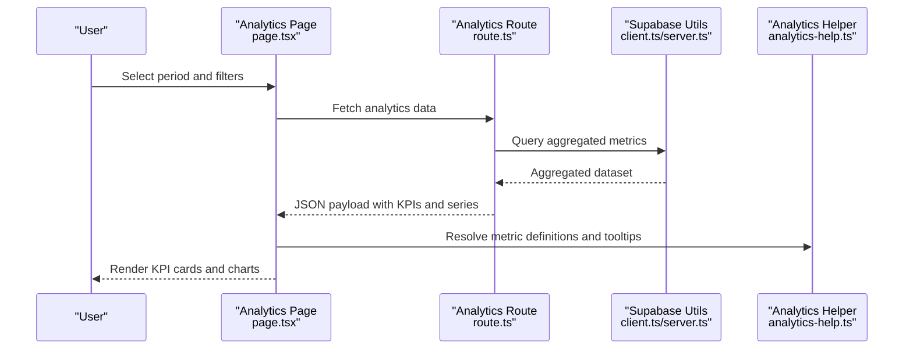
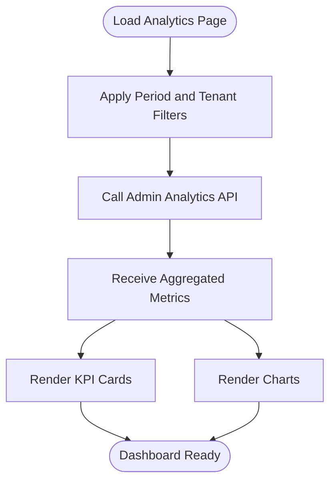
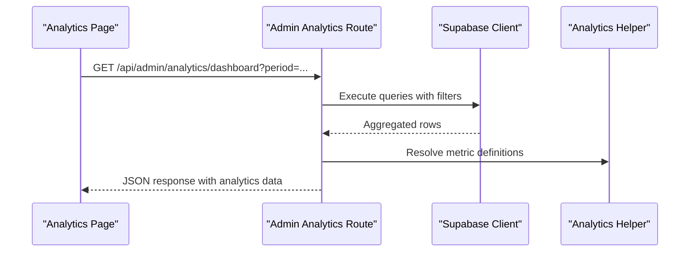
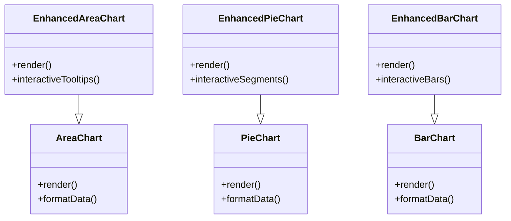
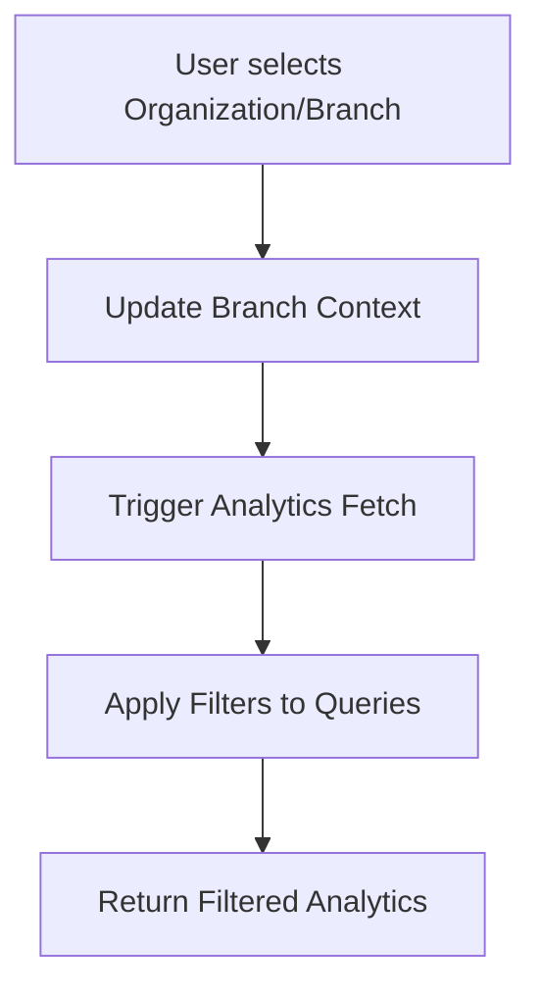
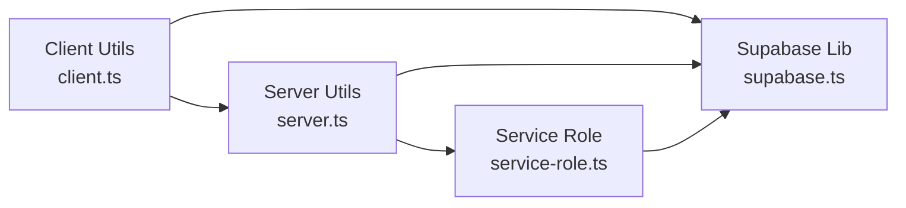
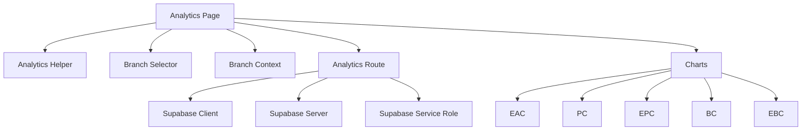

# Dashboard & Analytics

<cite>
**Referenced Files in This Document**
- [analytics-help.ts](file://src/lib/analytics-help.ts)
- [analytics-page.tsx](file://src/app/admin/analytics/page.tsx)
- [area-chart.tsx](file://src/components/admin/charts/AreaChart.tsx)
- [enhanced-area-chart.tsx](file://src/components/admin/charts/EnhancedAreaChart.tsx)
- [pie-chart.tsx](file://src/components/admin/charts/PieChart.tsx)
- [enhanced-pie-chart.tsx](file://src/components/admin/charts/EnhancedPieChart.tsx)
- [bar-chart.tsx](file://src/components/admin/charts/BarChart.tsx)
- [enhanced-bar-chart.tsx](file://src/components/admin/charts/EnhancedBarChart.tsx)
- [branch-selector.tsx](file://src/components/admin/BranchSelector.tsx)
- [branch-context.tsx](file://src/contexts/BranchContext.tsx)
- [supabase.ts](file://src/lib/supabase.ts)
- [client.ts](file://src/utils/supabase/client.ts)
- [server.ts](file://src/utils/supabase/server.ts)
- [service-role.ts](file://src/utils/supabase/service-role.ts)
- [analytics-dashboard-route.ts](file://src/app/api/admin/analytics/dashboard/route.ts)
- [analytics-endpoints.ts](file://src/app/api/admin/analytics/dashboard/index.ts)
- [business.ts](file://src/config/business.ts)
- [layout.tsx](file://src/app/admin/layout.tsx)
- [page.tsx](file://src/app/admin/page.tsx)
</cite>

## Table of Contents

1. [Introduction](#introduction)
2. [Project Structure](#project-structure)
3. [Core Components](#core-components)
4. [Architecture Overview](#architecture-overview)
5. [Detailed Component Analysis](#detailed-component-analysis)
6. [Dependency Analysis](#dependency-analysis)
7. [Performance Considerations](#performance-considerations)
8. [Troubleshooting Guide](#troubleshooting-guide)
9. [Conclusion](#conclusion)
10. [Appendices](#appendices)

## Introduction

This document describes the Opttius executive dashboard and analytics system, focusing on the integrated dashboard architecture that surfaces real-time KPI cards, revenue trends, appointment analytics, and operational metrics. It documents the multi-tenant filtering system across organizations, branches, and time periods, and explains the chart components used for visualizing business intelligence data. Implementation details include the dashboard API endpoints, data aggregation logic, and real-time updates via Supabase. Examples cover dashboard customization, branch-level analytics, and global organizational reporting. Finally, it outlines responsive design patterns, performance optimization techniques, and integration with business analytics helper functions.

## Project Structure

The dashboard and analytics system spans several layers:

- UI pages and routes under src/app/admin/analytics and related admin routes
- Business logic and helper utilities under src/lib
- Chart components under src/components/admin/charts
- Multi-tenant context and branch selector under src/contexts and src/components/admin
- Supabase utilities under src/lib and src/utils/supabase

```mermaid
graph TB
subgraph "Admin Pages"
AP["Analytics Page<br/>src/app/admin/analytics/page.tsx"]
AL["Admin Layout<br/>src/app/admin/layout.tsx"]
end
subgraph "Charts"
AC["AreaChart<br/>src/components/admin/charts/AreaChart.tsx"]
EAC["EnhancedAreaChart<br/>src/components/admin/charts/EnhancedAreaChart.tsx"]
PC["PieChart<br/>src/components/admin/charts/PieChart.tsx"]
EPC["EnhancedPieChart<br/>src/components/admin/charts/EnhancedPieChart.tsx"]
BC["BarChart<br/>src/components/admin/charts/BarChart.tsx"]
EBC["EnhancedBarChart<br/>src/components/admin/charts/EnhancedBarChart.tsx"]
end
subgraph "Business Logic"
AH["Analytics Helper<br/>src/lib/analytics-help.ts"]
BR["Branch Selector<br/>src/components/admin/BranchSelector.tsx"]
BCX["Branch Context<br/>src/contexts/BranchContext.tsx"]
end
subgraph "API Layer"
AR["Analytics Route<br/>src/app/api/admin/analytics/dashboard/route.ts"]
AE["Analytics Endpoints<br/>src/app/api/admin/analytics/dashboard/index.ts"]
end
subgraph "Supabase"
ST["Client Utils<br/>src/utils/supabase/client.ts"]
SS["Server Utils<br/>src/utils/supabase/server.ts"]
SR["Service Role<br/>src/utils/supabase/service-role.ts"]
SB["Supabase Lib<br/>src/lib/supabase.ts"]
end
AP --> AC
AP --> EAC
AP --> PC
AP --> EPC
AP --> BC
AP --> EBC
AP --> AH
AP --> BR
AP --> BCX
AP --> AR
AP --> AE
AR --> ST
AR --> SS
AR --> SR
AR --> SB
```

**Diagram sources**

- [analytics-page.tsx](file://src/app/admin/analytics/page.tsx#L1-L200)
- [area-chart.tsx](file://src/components/admin/charts/AreaChart.tsx#L1-L200)
- [enhanced-area-chart.tsx](file://src/components/admin/charts/EnhancedAreaChart.tsx#L1-L200)
- [pie-chart.tsx](file://src/components/admin/charts/PieChart.tsx#L1-L200)
- [enhanced-pie-chart.tsx](file://src/components/admin/charts/EnhancedPieChart.tsx#L1-L200)
- [bar-chart.tsx](file://src/components/admin/charts/BarChart.tsx#L1-L200)
- [enhanced-bar-chart.tsx](file://src/components/admin/charts/EnhancedBarChart.tsx#L1-L200)
- [analytics-help.ts](file://src/lib/analytics-help.ts#L1-L124)
- [branch-selector.tsx](file://src/components/admin/BranchSelector.tsx#L1-L200)
- [branch-context.tsx](file://src/contexts/BranchContext.tsx#L1-L200)
- [analytics-dashboard-route.ts](file://src/app/api/admin/analytics/dashboard/route.ts#L1-L200)
- [analytics-endpoints.ts](file://src/app/api/admin/analytics/dashboard/index.ts#L1-L200)
- [client.ts](file://src/utils/supabase/client.ts#L1-L200)
- [server.ts](file://src/utils/supabase/server.ts#L1-L200)
- [service-role.ts](file://src/utils/supabase/service-role.ts#L1-L200)
- [supabase.ts](file://src/lib/supabase.ts#L1-L200)

**Section sources**

- [analytics-page.tsx](file://src/app/admin/analytics/page.tsx#L1-L200)
- [analytics-help.ts](file://src/lib/analytics-help.ts#L1-L124)

## Core Components

- Executive KPI Cards: Rendered on the analytics page and driven by aggregated metrics returned by the analytics API endpoint. These include total revenue, revenue growth, total orders, total customers, conversion rate, sales trend, customer acquisition, and distribution metrics such as order status and category revenue.
- Chart Components:
  - Area charts for revenue trends over time
  - Pie charts for work order distributions and category revenue breakdowns
  - Bar charts for product performance ranking
- Multi-Tenant Filtering: Branch selector and branch context enable filtering across organizations, branches, and time periods.
- Real-Time Updates: Supabase utilities support real-time data synchronization and reactive UI updates.
- Business Analytics Helper: Centralized help text and metric definitions guide interpretation of KPIs and visualizations.

**Section sources**

- [analytics-page.tsx](file://src/app/admin/analytics/page.tsx#L140-L181)
- [analytics-help.ts](file://src/lib/analytics-help.ts#L1-L124)
- [branch-selector.tsx](file://src/components/admin/BranchSelector.tsx#L1-L200)
- [branch-context.tsx](file://src/contexts/BranchContext.tsx#L1-L200)

## Architecture Overview

The dashboard architecture follows a layered pattern:

- Presentation Layer: Next.js page component renders KPI cards and chart components.
- Business Logic Layer: Analytics helper defines metric semantics and formulas.
- API Layer: Admin analytics route aggregates data and returns structured responses.
- Data Access Layer: Supabase utilities encapsulate client/server/service role access patterns.
- Context Layer: Branch context and selector manage tenant-aware filtering.

**Diagram sources**

- [analytics-page.tsx](file://src/app/admin/analytics/page.tsx#L140-L181)
- [analytics-dashboard-route.ts](file://src/app/api/admin/analytics/dashboard/route.ts#L1-L200)
- [client.ts](file://src/utils/supabase/client.ts#L1-L200)
- [server.ts](file://src/utils/supabase/server.ts#L1-L200)
- [analytics-help.ts](file://src/lib/analytics-help.ts#L1-L124)

## Detailed Component Analysis

### Executive Overview Page

- Purpose: Hosts the executive dashboard with KPI cards and visualizations.
- Data Flow: Fetches analytics data from the admin analytics API endpoint and renders chart components.
- Filters: Integrates branch selector and branch context for multi-tenant filtering.

**Diagram sources**

- [analytics-page.tsx](file://src/app/admin/analytics/page.tsx#L140-L181)

**Section sources**

- [analytics-page.tsx](file://src/app/admin/analytics/page.tsx#L140-L181)

### Dashboard API Endpoints

- Endpoint: Admin analytics dashboard route handles requests for aggregated metrics.
- Responsibilities:
  - Validate and normalize filter parameters (organization, branch, time range).
  - Aggregate revenue, orders, customers, and product/category performance.
  - Return structured datasets for KPI cards and charts.
- Response Format: JSON payload containing analytics arrays and summary metrics.

**Diagram sources**

- [analytics-dashboard-route.ts](file://src/app/api/admin/analytics/dashboard/route.ts#L1-L200)
- [analytics-help.ts](file://src/lib/analytics-help.ts#L1-L124)
- [client.ts](file://src/utils/supabase/client.ts#L1-L200)

**Section sources**

- [analytics-dashboard-route.ts](file://src/app/api/admin/analytics/dashboard/route.ts#L1-L200)
- [analytics-endpoints.ts](file://src/app/api/admin/analytics/dashboard/index.ts#L1-L200)

### Chart Components

- Area Charts: Visualize revenue trends over time using time-series data.
- Pie Charts: Show distributions such as order status and category revenue.
- Bar Charts: Display top products by revenue or performance metrics.
- Enhanced Variants: Provide interactive features, tooltips, and responsive layouts.

**Diagram sources**

- [area-chart.tsx](file://src/components/admin/charts/AreaChart.tsx#L1-L200)
- [enhanced-area-chart.tsx](file://src/components/admin/charts/EnhancedAreaChart.tsx#L1-L200)
- [pie-chart.tsx](file://src/components/admin/charts/PieChart.tsx#L1-L200)
- [enhanced-pie-chart.tsx](file://src/components/admin/charts/EnhancedPieChart.tsx#L1-L200)
- [bar-chart.tsx](file://src/components/admin/charts/BarChart.tsx#L1-L200)
- [enhanced-bar-chart.tsx](file://src/components/admin/charts/EnhancedBarChart.tsx#L1-L200)

**Section sources**

- [area-chart.tsx](file://src/components/admin/charts/AreaChart.tsx#L1-L200)
- [enhanced-area-chart.tsx](file://src/components/admin/charts/EnhancedAreaChart.tsx#L1-L200)
- [pie-chart.tsx](file://src/components/admin/charts/PieChart.tsx#L1-L200)
- [enhanced-pie-chart.tsx](file://src/components/admin/charts/EnhancedPieChart.tsx#L1-L200)
- [bar-chart.tsx](file://src/components/admin/charts/BarChart.tsx#L1-L200)
- [enhanced-bar-chart.tsx](file://src/components/admin/charts/EnhancedBarChart.tsx#L1-L200)

### Multi-Tenant Dashboard Filtering

- Branch Selector: Allows users to choose organization and branch for tenant-aware analytics.
- Branch Context: Provides reactive context for branch selection and persistence across the dashboard.
- Filtering Logic: Applied in the analytics API to constrain datasets by organization, branch, and time window.

**Diagram sources**

- [branch-selector.tsx](file://src/components/admin/BranchSelector.tsx#L1-L200)
- [branch-context.tsx](file://src/contexts/BranchContext.tsx#L1-L200)
- [analytics-dashboard-route.ts](file://src/app/api/admin/analytics/dashboard/route.ts#L1-L200)

**Section sources**

- [branch-selector.tsx](file://src/components/admin/BranchSelector.tsx#L1-L200)
- [branch-context.tsx](file://src/contexts/BranchContext.tsx#L1-L200)

### Real-Time Updates via Supabase

- Supabase Utilities:
  - Client utilities for browser-side queries and subscriptions
  - Server utilities for secure server-side operations
  - Service role utilities for privileged operations
- Integration Pattern: Use client utilities to subscribe to real-time events and refresh dashboard data reactively.

**Diagram sources**

- [client.ts](file://src/utils/supabase/client.ts#L1-L200)
- [server.ts](file://src/utils/supabase/server.ts#L1-L200)
- [service-role.ts](file://src/utils/supabase/service-role.ts#L1-L200)
- [supabase.ts](file://src/lib/supabase.ts#L1-L200)

**Section sources**

- [client.ts](file://src/utils/supabase/client.ts#L1-L200)
- [server.ts](file://src/utils/supabase/server.ts#L1-L200)
- [service-role.ts](file://src/utils/supabase/service-role.ts#L1-L200)
- [supabase.ts](file://src/lib/supabase.ts#L1-L200)

### Business Intelligence Helper Functions

- Metric Definitions: Centralized help text and formulas for all analytics metrics.
- Empty States: Guidance messages for scenarios such as no orders, no products, no customers, and no categories.
- Usage: Integrated into the dashboard to provide tooltips and explanations for KPIs and visualizations.

**Section sources**

- [analytics-help.ts](file://src/lib/analytics-help.ts#L1-L124)

### Responsive Design Patterns

- Chart Components: Enhanced variants provide responsive layouts suitable for various screen sizes.
- Layout Composition: Admin layout and page composition ensure consistent spacing and alignment across devices.
- Context Awareness: Branch context and selector adapt to mobile and desktop experiences.

**Section sources**

- [enhanced-area-chart.tsx](file://src/components/admin/charts/EnhancedAreaChart.tsx#L1-L200)
- [enhanced-pie-chart.tsx](file://src/components/admin/charts/EnhancedPieChart.tsx#L1-L200)
- [enhanced-bar-chart.tsx](file://src/components/admin/charts/EnhancedBarChart.tsx#L1-L200)
- [layout.tsx](file://src/app/admin/layout.tsx#L1-L200)
- [page.tsx](file://src/app/admin/page.tsx#L1-L200)

### Performance Optimization Techniques

- Efficient Aggregation: API endpoint performs optimized SQL aggregations to minimize payload size.
- Lazy Loading: Chart components render only visible data series to reduce initial load.
- Debounced Filters: Branch selector and period controls debounce API calls to avoid excessive requests.
- Caching Strategies: Consider caching recent analytics data per user session to improve responsiveness.

[No sources needed since this section provides general guidance]

### Examples and Use Cases

- Dashboard Customization: Users can adjust the time period and branch filters to focus on specific segments.
- Branch-Level Analytics: Drill down into branch performance using the branch selector and branch context.
- Global Organizational Reporting: Combine organization-level filters with time windows to compare trends across locations.

**Section sources**

- [branch-selector.tsx](file://src/components/admin/BranchSelector.tsx#L1-L200)
- [branch-context.tsx](file://src/contexts/BranchContext.tsx#L1-L200)
- [analytics-dashboard-route.ts](file://src/app/api/admin/analytics/dashboard/route.ts#L1-L200)

## Dependency Analysis

The dashboard components depend on:

- Analytics helper for metric semantics
- Branch selector and context for multi-tenancy
- Supabase utilities for data access
- Chart components for visualization

**Diagram sources**

- [analytics-page.tsx](file://src/app/admin/analytics/page.tsx#L140-L181)
- [analytics-help.ts](file://src/lib/analytics-help.ts#L1-L124)
- [branch-selector.tsx](file://src/components/admin/BranchSelector.tsx#L1-L200)
- [branch-context.tsx](file://src/contexts/BranchContext.tsx#L1-L200)
- [analytics-dashboard-route.ts](file://src/app/api/admin/analytics/dashboard/route.ts#L1-L200)
- [client.ts](file://src/utils/supabase/client.ts#L1-L200)
- [server.ts](file://src/utils/supabase/server.ts#L1-L200)
- [service-role.ts](file://src/utils/supabase/service-role.ts#L1-L200)
- [area-chart.tsx](file://src/components/admin/charts/AreaChart.tsx#L1-L200)
- [enhanced-area-chart.tsx](file://src/components/admin/charts/EnhancedAreaChart.tsx#L1-L200)
- [pie-chart.tsx](file://src/components/admin/charts/PieChart.tsx#L1-L200)
- [enhanced-pie-chart.tsx](file://src/components/admin/charts/EnhancedPieChart.tsx#L1-L200)
- [bar-chart.tsx](file://src/components/admin/charts/BarChart.tsx#L1-L200)
- [enhanced-bar-chart.tsx](file://src/components/admin/charts/EnhancedBarChart.tsx#L1-L200)

**Section sources**

- [analytics-page.tsx](file://src/app/admin/analytics/page.tsx#L140-L181)
- [analytics-help.ts](file://src/lib/analytics-help.ts#L1-L124)
- [branch-selector.tsx](file://src/components/admin/BranchSelector.tsx#L1-L200)
- [branch-context.tsx](file://src/contexts/BranchContext.tsx#L1-L200)
- [analytics-dashboard-route.ts](file://src/app/api/admin/analytics/dashboard/route.ts#L1-L200)
- [client.ts](file://src/utils/supabase/client.ts#L1-L200)
- [server.ts](file://src/utils/supabase/server.ts#L1-L200)
- [service-role.ts](file://src/utils/supabase/service-role.ts#L1-L200)
- [area-chart.tsx](file://src/components/admin/charts/AreaChart.tsx#L1-L200)
- [enhanced-area-chart.tsx](file://src/components/admin/charts/EnhancedAreaChart.tsx#L1-L200)
- [pie-chart.tsx](file://src/components/admin/charts/PieChart.tsx#L1-L200)
- [enhanced-pie-chart.tsx](file://src/components/admin/charts/EnhancedPieChart.tsx#L1-L200)
- [bar-chart.tsx](file://src/components/admin/charts/BarChart.tsx#L1-L200)
- [enhanced-bar-chart.tsx](file://src/components/admin/charts/EnhancedBarChart.tsx#L1-L200)

## Performance Considerations

- Minimize Payload Size: Aggregate data server-side and return compact datasets.
- Debounce User Inputs: Reduce API calls by debouncing branch and period selections.
- Lazy Rendering: Render charts only after data is available to avoid blank UI states.
- Pagination and Limits: Apply reasonable limits for top lists and time-series to prevent large payloads.
- Caching: Cache recent analytics results per user session to improve perceived performance.

[No sources needed since this section provides general guidance]

## Troubleshooting Guide

- No Data Returned: Verify that the analytics API endpoint receives valid filters and returns aggregated data.
- Empty States: Use empty state messages to guide users when no orders, products, customers, or categories are available.
- Multi-Tenant Issues: Ensure branch context and selector are properly initialized and applied to queries.
- Real-Time Updates: Confirm Supabase client utilities are configured and subscribed to relevant channels.

**Section sources**

- [analytics-dashboard-route.ts](file://src/app/api/admin/analytics/dashboard/route.ts#L1-L200)
- [analytics-help.ts](file://src/lib/analytics-help.ts#L101-L124)
- [branch-context.tsx](file://src/contexts/BranchContext.tsx#L1-L200)
- [client.ts](file://src/utils/supabase/client.ts#L1-L200)

## Conclusion

The Opttius dashboard and analytics system integrates executive KPIs, multi-tenant filtering, and interactive visualizations powered by Supabase. The architecture separates concerns across presentation, business logic, API, and data access layers, enabling maintainability and scalability. By leveraging enhanced chart components, centralized analytics helper definitions, and robust filtering, the system supports both branch-level and global organizational reporting with real-time responsiveness.

## Appendices

- Business Configuration: Business-specific settings and constants can influence dashboard behavior and thresholds.
- Admin Navigation: The admin layout and page provide entry points to the analytics dashboard and related administrative features.

**Section sources**

- [business.ts](file://src/config/business.ts#L1-L200)
- [layout.tsx](file://src/app/admin/layout.tsx#L1-L200)
- [page.tsx](file://src/app/admin/page.tsx#L1-L200)
