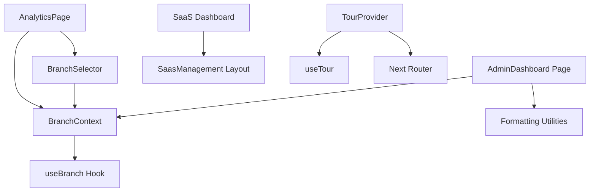

# Dashboard Overview

<cite>
**Referenced Files in This Document**
- [src/app/admin/page.tsx](file://src/app/admin/page.tsx)
- [src/app/admin/layout.tsx](file://src/app/admin/layout.tsx)
- [src/components/admin/DashboardSearch.tsx](file://src/components/admin/DashboardSearch.tsx)
- [src/components/admin/BranchSelector.tsx](file://src/components/admin/BranchSelector.tsx)
- [src/contexts/BranchContext.tsx](file://src/contexts/BranchContext.tsx)
- [src/hooks/useBranch.ts](file://src/hooks/useBranch.ts)
- [src/app/admin/analytics/page.tsx](file://src/app/admin/analytics/page.tsx)
- [src/app/admin/saas-management/dashboard/page.tsx](file://src/app/admin/saas-management/dashboard/page.tsx)
- [src/app/admin/saas-management/layout.tsx](file://src/app/admin/saas-management/layout.tsx)
- [src/components/onboarding/TourProvider.tsx](file://src/components/onboarding/TourProvider.tsx)
- [src/components/onboarding/TourButton.tsx](file://src/components/onboarding/TourButton.tsx)
- [src/lib/utils.ts](file://src/lib/utils.ts)
</cite>

## Table of Contents

1. [Introduction](#introduction)
2. [Project Structure](#project-structure)
3. [Core Components](#core-components)
4. [Architecture Overview](#architecture-overview)
5. [Detailed Component Analysis](#detailed-component-analysis)
6. [Dependency Analysis](#dependency-analysis)
7. [Performance Considerations](#performance-considerations)
8. [Troubleshooting Guide](#troubleshooting-guide)
9. [Conclusion](#conclusion)
10. [Appendices](#appendices)

## Introduction

This document provides a comprehensive overview of the Opttius executive dashboard, focusing on the main dashboard interface and user experience. It explains the dashboard architecture, including the responsive grid layout, real-time data loading states, and interactive elements. It documents the dashboard search functionality, branch selector integration, and multi-tenant data filtering capabilities. It also details loading states, error handling mechanisms, and user feedback systems, along with implementation details for dynamic imports, suspense boundaries, and performance optimization techniques. Examples of customization options, branch-level analytics display, and global organizational reporting are included, alongside tour integration, responsive design patterns, and accessibility features.

## Project Structure

The executive dashboard is implemented as a Next.js client-side page with supporting components and context providers. The main dashboard page orchestrates data fetching, rendering of KPI cards, charts, and interactive elements. Supporting components include a branch selector for multi-tenant filtering, a dashboard search for quick navigation, and an analytics page for deeper insights. The SaaS management dashboard provides global organizational reporting for root/dev users.

**Diagram sources**

- [src/app/admin/page.tsx](file://src/app/admin/page.tsx#L201-L800)
- [src/components/admin/BranchSelector.tsx](file://src/components/admin/BranchSelector.tsx#L15-L107)
- [src/components/admin/DashboardSearch.tsx](file://src/components/admin/DashboardSearch.tsx#L29-L197)
- [src/app/admin/analytics/page.tsx](file://src/app/admin/analytics/page.tsx#L134-L800)
- [src/contexts/BranchContext.tsx](file://src/contexts/BranchContext.tsx#L38-L216)
- [src/hooks/useBranch.ts](file://src/hooks/useBranch.ts#L40-L53)
- [src/app/admin/saas-management/layout.tsx](file://src/app/admin/saas-management/layout.tsx#L10-L38)
- [src/app/admin/saas-management/dashboard/page.tsx](file://src/app/admin/saas-management/dashboard/page.tsx#L42-L527)
- [src/components/onboarding/TourProvider.tsx](file://src/components/onboarding/TourProvider.tsx#L16-L318)
- [src/components/onboarding/TourButton.tsx](file://src/components/onboarding/TourButton.tsx#L8-L28)

**Section sources**

- [src/app/admin/page.tsx](file://src/app/admin/page.tsx#L201-L800)
- [src/app/admin/layout.tsx](file://src/app/admin/layout.tsx#L165-L800)
- [src/components/admin/BranchSelector.tsx](file://src/components/admin/BranchSelector.tsx#L15-L107)
- [src/components/admin/DashboardSearch.tsx](file://src/components/admin/DashboardSearch.tsx#L29-L197)
- [src/app/admin/analytics/page.tsx](file://src/app/admin/analytics/page.tsx#L134-L800)
- [src/contexts/BranchContext.tsx](file://src/contexts/BranchContext.tsx#L38-L216)
- [src/hooks/useBranch.ts](file://src/hooks/useBranch.ts#L40-L53)
- [src/app/admin/saas-management/layout.tsx](file://src/app/admin/saas-management/layout.tsx#L10-L38)
- [src/app/admin/saas-management/dashboard/page.tsx](file://src/app/admin/saas-management/dashboard/page.tsx#L42-L527)
- [src/components/onboarding/TourProvider.tsx](file://src/components/onboarding/TourProvider.tsx#L16-L318)
- [src/components/onboarding/TourButton.tsx](file://src/components/onboarding/TourButton.tsx#L8-L28)

## Core Components

- AdminDashboard Page: Orchestrates real-time data fetching, responsive grid layout, KPI cards, charts, and interactive elements. Implements loading states, error handling, and user feedback.
- BranchSelector: Multi-tenant selector enabling branch-level filtering and global view for super admins.
- DashboardSearch: Quick search component for customers and products with debounced search and result selection.
- Analytics Page: Comprehensive analytics and reporting with chart types, filters, and branch-aware data.
- BranchContext and useBranch: Context provider and hook managing branch state, initialization, and persistence.
- SaaS Management Dashboard: Global organizational reporting for root/dev users with SaaS-specific metrics and navigation.
- TourProvider and TourButton: Guided tour integration for onboarding with step-based overlays and progress indicators.

**Section sources**

- [src/app/admin/page.tsx](file://src/app/admin/page.tsx#L201-L800)
- [src/components/admin/BranchSelector.tsx](file://src/components/admin/BranchSelector.tsx#L15-L107)
- [src/components/admin/DashboardSearch.tsx](file://src/components/admin/DashboardSearch.tsx#L29-L197)
- [src/app/admin/analytics/page.tsx](file://src/app/admin/analytics/page.tsx#L134-L800)
- [src/contexts/BranchContext.tsx](file://src/contexts/BranchContext.tsx#L38-L216)
- [src/hooks/useBranch.ts](file://src/hooks/useBranch.ts#L40-L53)
- [src/app/admin/saas-management/dashboard/page.tsx](file://src/app/admin/saas-management/dashboard/page.tsx#L42-L527)
- [src/components/onboarding/TourProvider.tsx](file://src/components/onboarding/TourProvider.tsx#L16-L318)
- [src/components/onboarding/TourButton.tsx](file://src/components/onboarding/TourButton.tsx#L8-L28)

## Architecture Overview

The dashboard architecture follows a layered approach:

- Presentation Layer: AdminDashboard page and child components (KPI cards, charts, search, branch selector).
- Data Access Layer: Fetches dashboard and analytics data with branch-aware headers and handles real-time updates.
- Context Layer: BranchContext manages multi-tenant state and persistence; useBranch exposes convenient selectors.
- Onboarding Layer: TourProvider coordinates guided tours with step-based overlays and navigation.
- SaaS Layer: SaasManagement layout restricts access to root/dev; SaaS dashboard provides global metrics.

**Diagram sources**

- [src/app/admin/page.tsx](file://src/app/admin/page.tsx#L210-L244)
- [src/contexts/BranchContext.tsx](file://src/contexts/BranchContext.tsx#L73-L155)
- [src/app/admin/layout.tsx](file://src/app/admin/layout.tsx#L431-L499)

**Section sources**

- [src/app/admin/page.tsx](file://src/app/admin/page.tsx#L210-L244)
- [src/app/admin/layout.tsx](file://src/app/admin/layout.tsx#L431-L499)
- [src/contexts/BranchContext.tsx](file://src/contexts/BranchContext.tsx#L73-L155)

## Detailed Component Analysis

### AdminDashboard Page

The AdminDashboard page is the central executive interface:

- Data Fetching: Uses a branch-aware header to filter data per branch or globally for super admins. Implements periodic refresh every 30 seconds.
- Loading States: Skeleton loaders with animated pulses for initial load and empty states.
- Error Handling: Displays a friendly error card with retry action and graceful degradation.
- Interactive Elements: Quick action buttons, stock alert banner, and dynamic chart rendering.
- Dynamic Imports: Uses Next.js dynamic imports for heavy components with fallback spinners.

**Diagram sources**

- [src/app/admin/page.tsx](file://src/app/admin/page.tsx#L210-L244)
- [src/app/admin/page.tsx](file://src/app/admin/page.tsx#L316-L358)
- [src/app/admin/layout.tsx](file://src/app/admin/layout.tsx#L495-L499)

**Section sources**

- [src/app/admin/page.tsx](file://src/app/admin/page.tsx#L201-L800)

### Branch Selector and Multi-Tenant Filtering

The BranchSelector integrates with BranchContext to enable:

- Super admin global view toggle ("global" branch).
- Branch switching with optimistic UI and loading states.
- Persistent selection via localStorage for super admins.
- Branch-aware API requests using x-branch-id header.

**Diagram sources**

- [src/components/admin/BranchSelector.tsx](file://src/components/admin/BranchSelector.tsx#L27-L36)
- [src/contexts/BranchContext.tsx](file://src/contexts/BranchContext.tsx#L157-L176)
- [src/app/admin/page.tsx](file://src/app/admin/page.tsx#L214-L223)

**Section sources**

- [src/components/admin/BranchSelector.tsx](file://src/components/admin/BranchSelector.tsx#L15-L107)
- [src/contexts/BranchContext.tsx](file://src/contexts/BranchContext.tsx#L38-L216)
- [src/hooks/useBranch.ts](file://src/hooks/useBranch.ts#L40-L53)
- [src/app/admin/page.tsx](file://src/app/admin/page.tsx#L214-L223)

### Dashboard Search Functionality

The DashboardSearch component provides:

- Debounced search with a 300ms timeout to reduce API calls.
- Type-specific endpoints for customers and products.
- Modal dialog with live search results and loading indicators.
- Result selection navigates to the appropriate resource page.

**Diagram sources**

- [src/components/admin/DashboardSearch.tsx](file://src/components/admin/DashboardSearch.tsx#L36-L92)
- [src/components/admin/DashboardSearch.tsx](file://src/components/admin/DashboardSearch.tsx#L94-L103)

**Section sources**

- [src/components/admin/DashboardSearch.tsx](file://src/components/admin/DashboardSearch.tsx#L29-L197)

### Analytics Page and Branch-Level Reporting

The Analytics page supports:

- Period selection (7/30/90/365 days) with refresh controls.
- Branch-aware data via getBranchHeader and BranchSelector.
- Multiple chart types (column/line) for sales, work orders, and quotes.
- Status distribution charts and detailed metrics.

**Diagram sources**

- [src/app/admin/analytics/page.tsx](file://src/app/admin/analytics/page.tsx#L160-L191)
- [src/app/admin/analytics/page.tsx](file://src/app/admin/analytics/page.tsx#L321-L344)

**Section sources**

- [src/app/admin/analytics/page.tsx](file://src/app/admin/analytics/page.tsx#L134-L800)

### SaaS Management Dashboard

The SaaS dashboard provides:

- Global organizational metrics for root/dev users.
- Navigation to SaaS management sections.
- Security and backup status indicators.
- Revenue, growth, and tier distribution metrics.

**Diagram sources**

- [src/app/admin/saas-management/layout.tsx](file://src/app/admin/saas-management/layout.tsx#L10-L38)
- [src/app/admin/saas-management/dashboard/page.tsx](file://src/app/admin/saas-management/dashboard/page.tsx#L48-L68)

**Section sources**

- [src/app/admin/saas-management/layout.tsx](file://src/app/admin/saas-management/layout.tsx#L10-L38)
- [src/app/admin/saas-management/dashboard/page.tsx](file://src/app/admin/saas-management/dashboard/page.tsx#L42-L527)

### Tour Integration

The TourProvider coordinates guided tours:

- Auto-starts on first visit for eligible users.
- Navigates to required sections and waits for elements to appear.
- Renders overlay and step cards with progress.
- Handles skip and completion actions.

**Diagram sources**

- [src/components/onboarding/TourProvider.tsx](file://src/components/onboarding/TourProvider.tsx#L62-L98)
- [src/components/onboarding/TourProvider.tsx](file://src/components/onboarding/TourProvider.tsx#L100-L169)
- [src/components/onboarding/TourProvider.tsx](file://src/components/onboarding/TourProvider.tsx#L171-L241)

**Section sources**

- [src/components/onboarding/TourProvider.tsx](file://src/components/onboarding/TourProvider.tsx#L16-L318)
- [src/components/onboarding/TourButton.tsx](file://src/components/onboarding/TourButton.tsx#L8-L28)

## Dependency Analysis

The dashboard components exhibit clear separation of concerns:

- AdminDashboard depends on BranchContext for tenant state and on formatting utilities for display.
- BranchSelector depends on BranchContext and useBranch for state management.
- Analytics depends on BranchContext and BranchSelector for branch filtering.
- SaaS dashboard depends on SaasManagement layout for access control.
- TourProvider depends on useTour and routing for guided experiences.

**Diagram sources**

- [src/app/admin/page.tsx](file://src/app/admin/page.tsx#L63-L63)
- [src/lib/utils.ts](file://src/lib/utils.ts#L4-L6)
- [src/components/admin/BranchSelector.tsx](file://src/components/admin/BranchSelector.tsx#L15-L23)
- [src/contexts/BranchContext.tsx](file://src/contexts/BranchContext.tsx#L38-L44)
- [src/hooks/useBranch.ts](file://src/hooks/useBranch.ts#L40-L44)
- [src/app/admin/analytics/page.tsx](file://src/app/admin/analytics/page.tsx#L54-L56)
- [src/app/admin/saas-management/dashboard/page.tsx](file://src/app/admin/saas-management/dashboard/page.tsx#L42-L46)
- [src/app/admin/saas-management/layout.tsx](file://src/app/admin/saas-management/layout.tsx#L10-L38)
- [src/components/onboarding/TourProvider.tsx](file://src/components/onboarding/TourProvider.tsx#L16-L30)

**Section sources**

- [src/app/admin/page.tsx](file://src/app/admin/page.tsx#L63-L63)
- [src/lib/utils.ts](file://src/lib/utils.ts#L4-L6)
- [src/components/admin/BranchSelector.tsx](file://src/components/admin/BranchSelector.tsx#L15-L23)
- [src/contexts/BranchContext.tsx](file://src/contexts/BranchContext.tsx#L38-L44)
- [src/hooks/useBranch.ts](file://src/hooks/useBranch.ts#L40-L44)
- [src/app/admin/analytics/page.tsx](file://src/app/admin/analytics/page.tsx#L54-L56)
- [src/app/admin/saas-management/dashboard/page.tsx](file://src/app/admin/saas-management/dashboard/page.tsx#L42-L46)
- [src/app/admin/saas-management/layout.tsx](file://src/app/admin/saas-management/layout.tsx#L10-L38)
- [src/components/onboarding/TourProvider.tsx](file://src/components/onboarding/TourProvider.tsx#L16-L30)

## Performance Considerations

- Real-time Updates: The dashboard refreshes every 30 seconds to keep data current without manual intervention.
- Debounced Search: Search queries are debounced to minimize network requests.
- Dynamic Imports: Heavy components are dynamically imported with loading spinners to improve initial load performance.
- Branch Persistence: Super admins' branch selections are persisted in localStorage to avoid repeated server calls.
- Skeleton Loading: Animated skeleton loaders provide perceived performance during initial data fetch.
- Responsive Design: Grid layouts adapt to screen sizes, ensuring optimal viewing on desktop and mobile.

[No sources needed since this section provides general guidance]

## Troubleshooting Guide

Common issues and resolutions:

- Authentication/Authorization Failures: The admin layout performs admin checks with timeouts and redirects unauthorized users to login.
- Network Errors: Dashboard and analytics pages display error cards with retry actions; loading states prevent blank screens.
- Branch Switching Issues: BranchContext validates saved selections and falls back to global view if necessary.
- Tour Not Starting: TourProvider auto-starts only under specific conditions; users can manually trigger the tour via TourButton.

**Section sources**

- [src/app/admin/layout.tsx](file://src/app/admin/layout.tsx#L501-L732)
- [src/app/admin/page.tsx](file://src/app/admin/page.tsx#L335-L358)
- [src/contexts/BranchContext.tsx](file://src/contexts/BranchContext.tsx#L47-L71)
- [src/components/onboarding/TourButton.tsx](file://src/components/onboarding/TourButton.tsx#L8-L28)

## Conclusion

The Opttius executive dashboard delivers a responsive, real-time, and multi-tenant experience. It combines efficient data fetching, robust error handling, and intuitive interactive elements to support decision-making across branches and organizational levels. The integration of guided tours, branch filtering, and comprehensive analytics ensures a cohesive and accessible user experience.

[No sources needed since this section summarizes without analyzing specific files]

## Appendices

- Customization Options: Adjust branch filters, period ranges, and chart types to tailor views. Use the BranchSelector for branch-level analytics and the Analytics page for deeper insights.
- Accessibility: The dashboard leverages semantic HTML, focus management, and clear visual hierarchy. Icons and tooltips enhance usability without sacrificing accessibility.
- Formatting Utilities: Centralized formatting functions ensure consistent number, currency, and date displays across components.

**Section sources**

- [src/app/admin/analytics/page.tsx](file://src/app/admin/analytics/page.tsx#L193-L201)
- [src/lib/utils.ts](file://src/lib/utils.ts#L4-L6)
