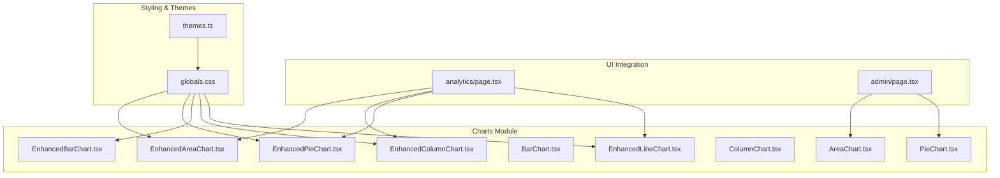
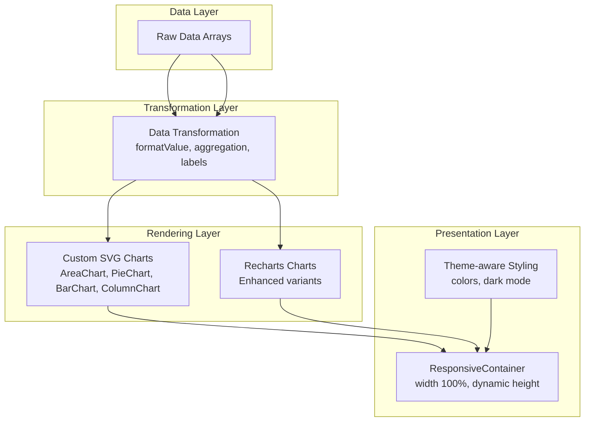
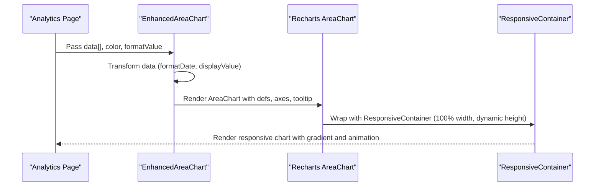
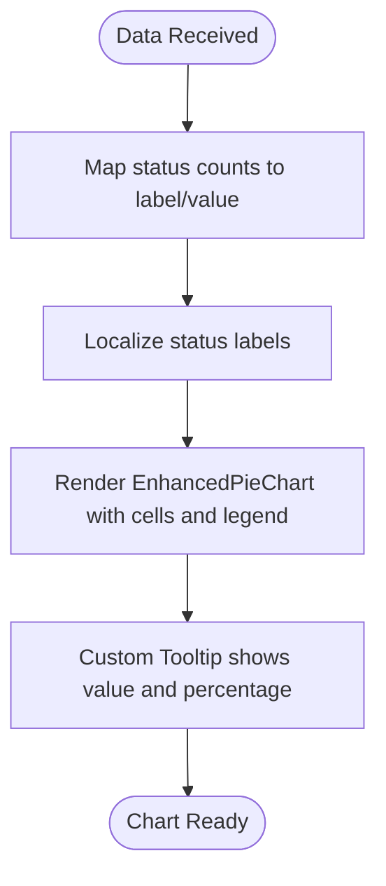
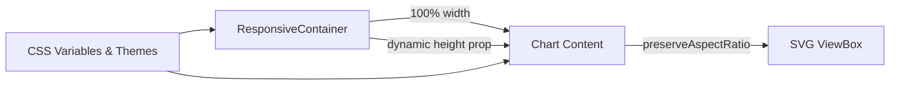
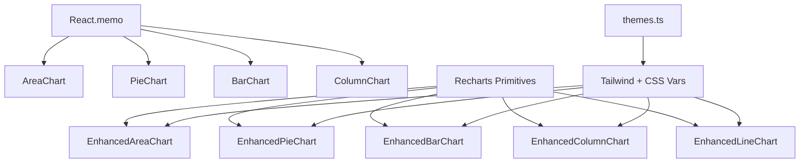

# Data Visualization & Charts

<cite>
**Referenced Files in This Document**
- [AreaChart.tsx](file://src/components/admin/charts/AreaChart.tsx)
- [EnhancedAreaChart.tsx](file://src/components/admin/charts/EnhancedAreaChart.tsx)
- [PieChart.tsx](file://src/components/admin/charts/PieChart.tsx)
- [EnhancedPieChart.tsx](file://src/components/admin/charts/EnhancedPieChart.tsx)
- [BarChart.tsx](file://src/components/admin/charts/BarChart.tsx)
- [EnhancedBarChart.tsx](file://src/components/admin/charts/EnhancedBarChart.tsx)
- [ColumnChart.tsx](file://src/components/admin/charts/ColumnChart.tsx)
- [EnhancedColumnChart.tsx](file://src/components/admin/charts/EnhancedColumnChart.tsx)
- [EnhancedLineChart.tsx](file://src/components/admin/charts/EnhancedLineChart.tsx)
- [themes.ts](file://src/config/themes.ts)
- [globals.css](file://src/app/globals.css)
- [analytics/page.tsx](file://src/app/admin/analytics/page.tsx)
- [admin/page.tsx](file://src/app/admin/page.tsx)
</cite>

## Table of Contents

1. [Introduction](#introduction)
2. [Project Structure](#project-structure)
3. [Core Components](#core-components)
4. [Architecture Overview](#architecture-overview)
5. [Detailed Component Analysis](#detailed-component-analysis)
6. [Dependency Analysis](#dependency-analysis)
7. [Performance Considerations](#performance-considerations)
8. [Troubleshooting Guide](#troubleshooting-guide)
9. [Conclusion](#conclusion)
10. [Appendices](#appendices)

## Introduction

This document explains the data visualization and chart system used for interactive dashboards. It focuses on:

- Revenue trend area chart showing 7-day performance
- Work order status distribution pie chart
- A responsive chart container system built on Recharts and custom SVG components
  It covers Recharts integration, custom color schemes, animations, data structures, tooltips, axes customization, gradients, and responsive behavior. It also includes examples of customization, data transformation, real-time update patterns, accessibility considerations, performance optimization, and mobile responsiveness.

## Project Structure

The chart system is organized under a dedicated charts module with both lightweight custom SVG charts and Recharts-powered enhanced variants. Themes and global CSS define consistent color palettes and responsive styles.

**Diagram sources**

- [AreaChart.tsx](file://src/components/admin/charts/AreaChart.tsx#L1-L279)
- [EnhancedAreaChart.tsx](file://src/components/admin/charts/EnhancedAreaChart.tsx#L1-L188)
- [PieChart.tsx](file://src/components/admin/charts/PieChart.tsx#L1-L173)
- [EnhancedPieChart.tsx](file://src/components/admin/charts/EnhancedPieChart.tsx#L1-L184)
- [BarChart.tsx](file://src/components/admin/charts/BarChart.tsx#L1-L137)
- [EnhancedBarChart.tsx](file://src/components/admin/charts/EnhancedBarChart.tsx#L1-L200)
- [ColumnChart.tsx](file://src/components/admin/charts/ColumnChart.tsx#L1-L155)
- [EnhancedColumnChart.tsx](file://src/components/admin/charts/EnhancedColumnChart.tsx#L1-L207)
- [EnhancedLineChart.tsx](file://src/components/admin/charts/EnhancedLineChart.tsx#L1-L175)
- [analytics/page.tsx](file://src/app/admin/analytics/page.tsx#L1-L1165)
- [admin/page.tsx](file://src/app/admin/page.tsx#L632-L812)
- [themes.ts](file://src/config/themes.ts#L1-L167)
- [globals.css](file://src/app/globals.css#L1-L519)

**Section sources**

- [AreaChart.tsx](file://src/components/admin/charts/AreaChart.tsx#L1-L279)
- [EnhancedAreaChart.tsx](file://src/components/admin/charts/EnhancedAreaChart.tsx#L1-L188)
- [PieChart.tsx](file://src/components/admin/charts/PieChart.tsx#L1-L173)
- [EnhancedPieChart.tsx](file://src/components/admin/charts/EnhancedPieChart.tsx#L1-L184)
- [BarChart.tsx](file://src/components/admin/charts/BarChart.tsx#L1-L137)
- [EnhancedBarChart.tsx](file://src/components/admin/charts/EnhancedBarChart.tsx#L1-L200)
- [ColumnChart.tsx](file://src/components/admin/charts/ColumnChart.tsx#L1-L155)
- [EnhancedColumnChart.tsx](file://src/components/admin/charts/EnhancedColumnChart.tsx#L1-L207)
- [EnhancedLineChart.tsx](file://src/components/admin/charts/EnhancedLineChart.tsx#L1-L175)
- [themes.ts](file://src/config/themes.ts#L1-L167)
- [globals.css](file://src/app/globals.css#L1-L519)
- [analytics/page.tsx](file://src/app/admin/analytics/page.tsx#L1-L1165)
- [admin/page.tsx](file://src/app/admin/page.tsx#L632-L812)

## Core Components

- AreaChart (custom SVG): Lightweight area chart with gradient fill, smooth curves, and summary statistics.
- EnhancedAreaChart (Recharts): Full-featured area chart with responsive container, gradients, tooltips, axes, and animations.
- PieChart (custom SVG): Donut-style pie chart with legend and percentages.
- EnhancedPieChart (Recharts): Advanced pie chart with custom labels, tooltips, legends, and animations.
- BarChart (custom SVG): Horizontal and vertical bar charts with optional value labels.
- EnhancedBarChart (Recharts): Responsive bar charts (horizontal and vertical) with tooltips, axes, and animations.
- ColumnChart (custom SVG): Weekly-aggregated column chart with hover tooltips and summary stats.
- EnhancedColumnChart (Recharts): Weekly-aggregated Recharts column chart with responsive container, axes, and animations.
- EnhancedLineChart (Recharts): Smooth line chart with tooltips, axes, and animations.

**Section sources**

- [AreaChart.tsx](file://src/components/admin/charts/AreaChart.tsx#L1-L279)
- [EnhancedAreaChart.tsx](file://src/components/admin/charts/EnhancedAreaChart.tsx#L1-L188)
- [PieChart.tsx](file://src/components/admin/charts/PieChart.tsx#L1-L173)
- [EnhancedPieChart.tsx](file://src/components/admin/charts/EnhancedPieChart.tsx#L1-L184)
- [BarChart.tsx](file://src/components/admin/charts/BarChart.tsx#L1-L137)
- [EnhancedBarChart.tsx](file://src/components/admin/charts/EnhancedBarChart.tsx#L1-L200)
- [ColumnChart.tsx](file://src/components/admin/charts/ColumnChart.tsx#L1-L155)
- [EnhancedColumnChart.tsx](file://src/components/admin/charts/EnhancedColumnChart.tsx#L1-L207)
- [EnhancedLineChart.tsx](file://src/components/admin/charts/EnhancedLineChart.tsx#L1-L175)

## Architecture Overview

The system integrates two chart families:

- Custom SVG charts for lightweight scenarios and fine-grained control
- Recharts-based charts for advanced interactivity, responsive containers, and standardized UX

**Diagram sources**

- [AreaChart.tsx](file://src/components/admin/charts/AreaChart.tsx#L1-L279)
- [EnhancedAreaChart.tsx](file://src/components/admin/charts/EnhancedAreaChart.tsx#L1-L188)
- [PieChart.tsx](file://src/components/admin/charts/PieChart.tsx#L1-L173)
- [EnhancedPieChart.tsx](file://src/components/admin/charts/EnhancedPieChart.tsx#L1-L184)
- [EnhancedColumnChart.tsx](file://src/components/admin/charts/EnhancedColumnChart.tsx#L1-L207)
- [EnhancedLineChart.tsx](file://src/components/admin/charts/EnhancedLineChart.tsx#L1-L175)
- [themes.ts](file://src/config/themes.ts#L1-L167)
- [globals.css](file://src/app/globals.css#L1-L519)

## Detailed Component Analysis

### Revenue Trend Area Chart (7-day performance)

- Purpose: Visualize daily revenue over the last 7 days with a smooth area and gradient fill.
- Implementation highlights:
  - Uses EnhancedAreaChart for responsive container, gradients, tooltips, and axes.
  - Data transformed to include formatted dates and display values.
  - Color scheme aligned with brand success color; gradient applied via linear gradient.
  - Animation enabled for area and line.
  - Summary statistics included below the chart.
- Example usage:
  - Integrated in analytics overview tab switching between column and line views.
  - In admin dashboard, a custom SVG AreaChart is embedded with a gradient definition.

**Diagram sources**

- [EnhancedAreaChart.tsx](file://src/components/admin/charts/EnhancedAreaChart.tsx#L33-L151)
- [analytics/page.tsx](file://src/app/admin/analytics/page.tsx#L625-L642)

**Section sources**

- [EnhancedAreaChart.tsx](file://src/components/admin/charts/EnhancedAreaChart.tsx#L1-L188)
- [analytics/page.tsx](file://src/app/admin/analytics/page.tsx#L625-L642)
- [admin/page.tsx](file://src/app/admin/page.tsx#L650-L740)

### Work Order Status Distribution Pie Chart

- Purpose: Show the distribution of work orders by status (pending, in-progress, completed).
- Implementation highlights:
  - Uses EnhancedPieChart with custom labels, tooltip, legend, and percentages.
  - Data mapped from status counts to label/value pairs with localized status labels.
  - Color palette selected from a predefined set; gradient-like appearance via individual cell fills.
  - Responsive container ensures consistent sizing across devices.
- Example usage:
  - Integrated in analytics overview tab for work orders and quotes distributions.

**Diagram sources**

- [EnhancedPieChart.tsx](file://src/components/admin/charts/EnhancedPieChart.tsx#L64-L170)
- [analytics/page.tsx](file://src/app/admin/analytics/page.tsx#L711-L730)

**Section sources**

- [EnhancedPieChart.tsx](file://src/components/admin/charts/EnhancedPieChart.tsx#L1-L184)
- [analytics/page.tsx](file://src/app/admin/analytics/page.tsx#L702-L731)

### Responsive Chart Container System

- Purpose: Provide consistent responsive behavior across all chart types.
- Implementation highlights:
  - Recharts ResponsiveContainer used in Enhanced variants to adapt to container width and height.
  - Custom SVG charts use percentage-based widths and preserveAspectRatio for scaling.
  - Tailwind and CSS variables ensure consistent spacing and typography.
  - Dark mode and theme-aware colors applied via CSS variables and theme definitions.

**Diagram sources**

- [EnhancedAreaChart.tsx](file://src/components/admin/charts/EnhancedAreaChart.tsx#L91-L151)
- [EnhancedColumnChart.tsx](file://src/components/admin/charts/EnhancedColumnChart.tsx#L118-L169)
- [EnhancedPieChart.tsx](file://src/components/admin/charts/EnhancedPieChart.tsx#L149-L170)
- [globals.css](file://src/app/globals.css#L1-L519)
- [themes.ts](file://src/config/themes.ts#L1-L167)

**Section sources**

- [EnhancedAreaChart.tsx](file://src/components/admin/charts/EnhancedAreaChart.tsx#L91-L151)
- [EnhancedColumnChart.tsx](file://src/components/admin/charts/EnhancedColumnChart.tsx#L118-L169)
- [EnhancedPieChart.tsx](file://src/components/admin/charts/EnhancedPieChart.tsx#L149-L170)
- [globals.css](file://src/app/globals.css#L1-L519)
- [themes.ts](file://src/config/themes.ts#L1-L167)

### Recharts Integration, Custom Color Schemes, and Animations

- Recharts integration:
  - EnhancedAreaChart, EnhancedColumnChart, EnhancedBarChart, EnhancedLineChart, EnhancedPieChart wrap Recharts primitives inside ResponsiveContainer.
  - Custom tooltips, legends, and axes formatting implemented per component.
- Custom color schemes:
  - Theme-aware color variables in CSS define primary, secondary, and admin-specific colors.
  - Components accept color props; default colors come from internal palettes or theme variables.
- Animations:
  - Components set animationDuration and animationEasing for smooth transitions.
  - Gradient fills use linear gradients for visual depth.

**Section sources**

- [EnhancedAreaChart.tsx](file://src/components/admin/charts/EnhancedAreaChart.tsx#L96-L149)
- [EnhancedColumnChart.tsx](file://src/components/admin/charts/EnhancedColumnChart.tsx#L154-L167)
- [EnhancedBarChart.tsx](file://src/components/admin/charts/EnhancedBarChart.tsx#L185-L194)
- [EnhancedLineChart.tsx](file://src/components/admin/charts/EnhancedLineChart.tsx#L127-L136)
- [EnhancedPieChart.tsx](file://src/components/admin/charts/EnhancedPieChart.tsx#L151-L166)
- [globals.css](file://src/app/globals.css#L1-L519)
- [themes.ts](file://src/config/themes.ts#L1-L167)

### Chart Data Structures, Tooltip Formatting, and Axis Customization

- Data structures:
  - Area/Column/Line: Array of objects with date, value, optional count.
  - Pie: Array of objects with label, value, optional color.
  - Bar: Array of objects with label, value.
- Tooltip formatting:
  - Custom tooltips show formatted values, optional counts, and localized labels.
  - Enhanced charts use dataKey mapping and payload inspection to render contextual info.
- Axis customization:
  - XAxis: Formatted dates, rotated labels, interval preservation.
  - YAxis: Tick formatter for thousands/millions, dark mode text color.
  - CartesianGrid toggled via showGrid prop.

**Section sources**

- [EnhancedAreaChart.tsx](file://src/components/admin/charts/EnhancedAreaChart.tsx#L60-L81)
- [EnhancedColumnChart.tsx](file://src/components/admin/charts/EnhancedColumnChart.tsx#L87-L108)
- [EnhancedBarChart.tsx](file://src/components/admin/charts/EnhancedBarChart.tsx#L62-L78)
- [EnhancedLineChart.tsx](file://src/components/admin/charts/EnhancedLineChart.tsx#L60-L81)
- [EnhancedPieChart.tsx](file://src/components/admin/charts/EnhancedPieChart.tsx#L91-L112)

### Implementation Details: Gradients and Responsive Containers

- Gradients:
  - Defined via <linearGradient> inside <defs>; applied to area and pie charts for depth.
  - Color stops configured for opacity gradients to emphasize depth.
- Responsive containers:
  - Recharts ResponsiveContainer ensures charts scale to parent width while maintaining aspect ratio.
  - Height passed as prop; default heights defined per component.

**Section sources**

- [EnhancedAreaChart.tsx](file://src/components/admin/charts/EnhancedAreaChart.tsx#L96-L107)
- [EnhancedPieChart.tsx](file://src/components/admin/charts/EnhancedPieChart.tsx#L151-L166)
- [EnhancedColumnChart.tsx](file://src/components/admin/charts/EnhancedColumnChart.tsx#L118-L169)

### Examples: Customization, Data Transformation, Real-time Updates

- Customization examples:
  - Change color via prop; override formatValue for currency/date formatting.
  - Toggle grid, adjust height, choose between column/line for trends.
- Data transformation:
  - Aggregation to weekly windows for dense time-series (EnhancedColumnChart).
  - Localized status labels and percentage calculations for pie charts.
- Real-time updates:
  - Analytics page fetches data on period change or refresh; re-renders charts with new datasets.
  - Admin dashboard triggers chart updates via state changes.

**Section sources**

- [EnhancedColumnChart.tsx](file://src/components/admin/charts/EnhancedColumnChart.tsx#L39-L77)
- [EnhancedPieChart.tsx](file://src/components/admin/charts/EnhancedPieChart.tsx#L72-L81)
- [analytics/page.tsx](file://src/app/admin/analytics/page.tsx#L160-L191)
- [admin/page.tsx](file://src/app/admin/page.tsx#L650-L740)

### Accessibility Features

- Focus and keyboard-friendly interactions via Recharts’ native focus management.
- Semantic labeling via aria-compatible props and titles.
- Color contrast maintained through theme-aware variables and dark mode support.
- Hover tooltips provide contextual information without relying solely on color.

**Section sources**

- [EnhancedAreaChart.tsx](file://src/components/admin/charts/EnhancedAreaChart.tsx#L138-L149)
- [EnhancedPieChart.tsx](file://src/components/admin/charts/EnhancedPieChart.tsx#L167-L169)
- [globals.css](file://src/app/globals.css#L1-L519)
- [themes.ts](file://src/config/themes.ts#L1-L167)

## Dependency Analysis

The chart components depend on:

- React.memo for performance (custom SVG charts)
- Recharts primitives for advanced rendering (enhanced charts)
- Tailwind and CSS variables for responsive and theme-aware styling
- Theme definitions for consistent color usage

**Diagram sources**

- [AreaChart.tsx](file://src/components/admin/charts/AreaChart.tsx#L277-L279)
- [PieChart.tsx](file://src/components/admin/charts/PieChart.tsx#L171-L173)
- [BarChart.tsx](file://src/components/admin/charts/BarChart.tsx#L116-L137)
- [ColumnChart.tsx](file://src/components/admin/charts/ColumnChart.tsx#L153-L155)
- [EnhancedAreaChart.tsx](file://src/components/admin/charts/EnhancedAreaChart.tsx#L1-L12)
- [EnhancedPieChart.tsx](file://src/components/admin/charts/EnhancedPieChart.tsx#L1-L10)
- [EnhancedBarChart.tsx](file://src/components/admin/charts/EnhancedBarChart.tsx#L1-L12)
- [EnhancedColumnChart.tsx](file://src/components/admin/charts/EnhancedColumnChart.tsx#L1-L12)
- [EnhancedLineChart.tsx](file://src/components/admin/charts/EnhancedLineChart.tsx#L1-L12)
- [themes.ts](file://src/config/themes.ts#L1-L167)
- [globals.css](file://src/app/globals.css#L1-L519)

**Section sources**

- [AreaChart.tsx](file://src/components/admin/charts/AreaChart.tsx#L277-L279)
- [PieChart.tsx](file://src/components/admin/charts/PieChart.tsx#L171-L173)
- [BarChart.tsx](file://src/components/admin/charts/BarChart.tsx#L116-L137)
- [ColumnChart.tsx](file://src/components/admin/charts/ColumnChart.tsx#L153-L155)
- [EnhancedAreaChart.tsx](file://src/components/admin/charts/EnhancedAreaChart.tsx#L1-L12)
- [EnhancedPieChart.tsx](file://src/components/admin/charts/EnhancedPieChart.tsx#L1-L10)
- [EnhancedBarChart.tsx](file://src/components/admin/charts/EnhancedBarChart.tsx#L1-L12)
- [EnhancedColumnChart.tsx](file://src/components/admin/charts/EnhancedColumnChart.tsx#L1-L12)
- [EnhancedLineChart.tsx](file://src/components/admin/charts/EnhancedLineChart.tsx#L1-L12)
- [themes.ts](file://src/config/themes.ts#L1-L167)
- [globals.css](file://src/app/globals.css#L1-L519)

## Performance Considerations

- Memoization:
  - Custom SVG charts use React.memo to avoid unnecessary re-renders.
  - Enhanced charts rely on React.memoization patterns and stable data references.
- Rendering optimization:
  - Use ResponsiveContainer to prevent layout thrashing during resize.
  - Prefer aggregated data for dense time-series (weekly aggregation).
- Animations:
  - Keep animationDuration reasonable; disable where not needed for heavy datasets.
- Theming:
  - Leverage CSS variables to minimize style recalculation across themes.

[No sources needed since this section provides general guidance]

## Troubleshooting Guide

- Empty/no data states:
  - Components render friendly placeholders when data is missing or empty.
- Misaligned axes or labels:
  - Verify data keys match Recharts props (dataKey, name, value).
  - Ensure date formatting matches XAxis expectations.
- Tooltip not appearing:
  - Confirm Tooltip component is included and content prop is set.
- Responsiveness issues:
  - Ensure parent container has explicit width/height or use ResponsiveContainer.
- Color contrast problems:
  - Switch to dark mode or adjust theme variables for improved contrast.

**Section sources**

- [AreaChart.tsx](file://src/components/admin/charts/AreaChart.tsx#L50-L59)
- [EnhancedAreaChart.tsx](file://src/components/admin/charts/EnhancedAreaChart.tsx#L49-L58)
- [EnhancedPieChart.tsx](file://src/components/admin/charts/EnhancedPieChart.tsx#L83-L89)
- [EnhancedColumnChart.tsx](file://src/components/admin/charts/EnhancedColumnChart.tsx#L79-L85)

## Conclusion

The chart system combines lightweight custom SVG charts with robust Recharts-based components to deliver responsive, accessible, and visually consistent data visualizations. It supports real-time updates, theme-aware styling, and advanced interactions like tooltips and legends. By leveraging aggregation, memoization, and responsive containers, the system balances performance and usability across desktop and mobile experiences.

[No sources needed since this section summarizes without analyzing specific files]

## Appendices

### Data Structures Reference

- Area/Column/Line: `{ date: string; value: number; count?: number }`
- Pie: `{ label: string; value: number; color?: string }`
- Bar: `{ label: string; value: number }`

**Section sources**

- [AreaChart.tsx](file://src/components/admin/charts/AreaChart.tsx#L5-L11)
- [EnhancedAreaChart.tsx](file://src/components/admin/charts/EnhancedAreaChart.tsx#L15-L22)
- [PieChart.tsx](file://src/components/admin/charts/PieChart.tsx#L5-L10)
- [EnhancedPieChart.tsx](file://src/components/admin/charts/EnhancedPieChart.tsx#L13-L20)
- [BarChart.tsx](file://src/components/admin/charts/BarChart.tsx#L5-L12)
- [EnhancedBarChart.tsx](file://src/components/admin/charts/EnhancedBarChart.tsx#L15-L23)

### Theme and Color Reference

- Theme variables define primary, secondary, and admin-specific colors.
- Components accept color props; defaults derived from theme or internal palettes.

**Section sources**

- [themes.ts](file://src/config/themes.ts#L1-L167)
- [globals.css](file://src/app/globals.css#L1-L519)
