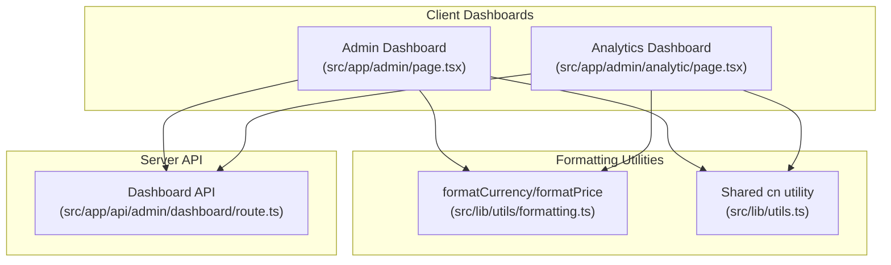
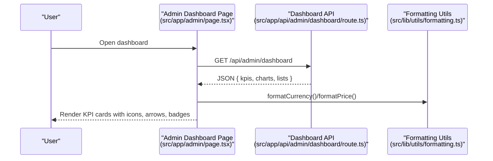
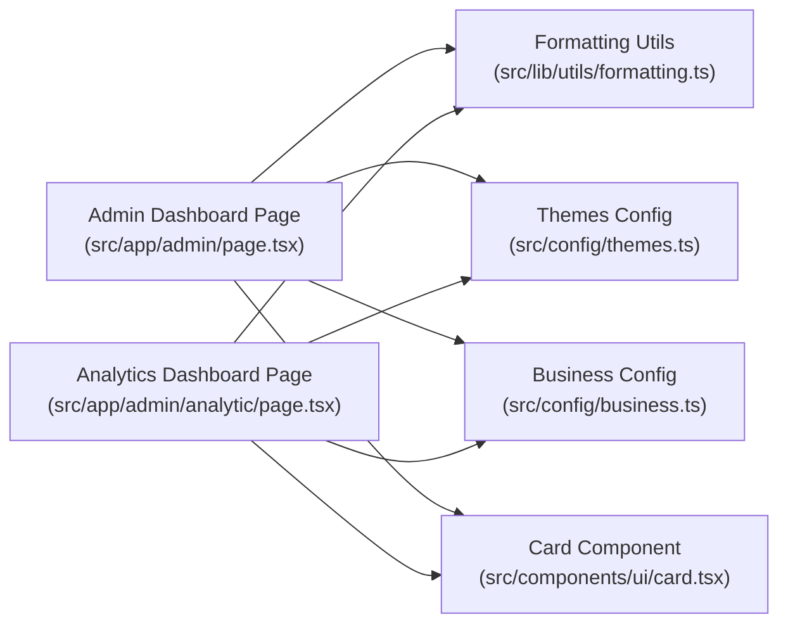

# KPI Cards & Metrics

<cite>
**Referenced Files in This Document**
- [src/app/admin/page.tsx](file://src/app/admin/page.tsx)
- [src/app/admin/analytic/page.tsx](file://src/app/admin/analytic/page.tsx)
- [src/app/api/admin/dashboard/route.ts](file://src/app/api/admin/dashboard/route.ts)
- [src/lib/utils.ts](file://src/lib/utils.ts)
- [src/lib/utils/formatting.ts](file://src/lib/utils/formatting.ts)
- [src/components/ui/card.tsx](file://src/components/ui/card.tsx)
- [src/config/themes.ts](file://src/config/themes.ts)
- [src/config/business.ts](file://src/config/business.ts)
</cite>

## Table of Contents

1. [Introduction](#introduction)
2. [Project Structure](#project-structure)
3. [Core Components](#core-components)
4. [Architecture Overview](#architecture-overview)
5. [Detailed Component Analysis](#detailed-component-analysis)
6. [Dependency Analysis](#dependency-analysis)
7. [Performance Considerations](#performance-considerations)
8. [Troubleshooting Guide](#troubleshooting-guide)
9. [Conclusion](#conclusion)

## Introduction

This document explains the KPI cards and metrics system powering the Opttius admin dashboards. It focuses on four main dashboard cards:

- Revenue performance card: monthly revenue with trend arrows and percentage change
- Daily appointment scheduling card: daily appointment counts with status badges
- Inventory management card: stock alerts and health indicators
- Customer acquisition card: growth metrics and new customer counts

It documents card design patterns, hover effects, visual indicators, data formatting functions, currency display, responsive typography, color schemes, iconography, customization examples, conditional rendering, and integration with business analytics helpers.

## Project Structure

The KPI system spans client-side pages, shared formatting utilities, and server-side analytics APIs:

- Client dashboards render KPI cards and integrate with chart components
- Shared formatting utilities provide consistent currency, number, and date formatting
- Server-side routes compute KPIs and return structured analytics data

**Diagram sources**

- [src/app/admin/page.tsx](file://src/app/admin/page.tsx#L444-L630)
- [src/app/admin/analytic/page.tsx](file://src/app/admin/analytic/page.tsx#L347-L576)
- [src/lib/utils/formatting.ts](file://src/lib/utils/formatting.ts#L192-L246)
- [src/lib/utils.ts](file://src/lib/utils.ts#L4-L6)
- [src/app/api/admin/dashboard/route.ts](file://src/app/api/admin/dashboard/route.ts#L17-L632)

**Section sources**

- [src/app/admin/page.tsx](file://src/app/admin/page.tsx#L444-L630)
- [src/app/admin/analytic/page.tsx](file://src/app/admin/analytic/page.tsx#L347-L576)
- [src/app/api/admin/dashboard/route.ts](file://src/app/api/admin/dashboard/route.ts#L17-L632)
- [src/lib/utils/formatting.ts](file://src/lib/utils/formatting.ts#L192-L246)
- [src/lib/utils.ts](file://src/lib/utils.ts#L4-L6)

## Core Components

- Revenue performance card (monthly): displays formatted currency, trend arrow, and percentage change
- Daily appointment scheduling card: shows today’s appointments, confirmed count, and a “Today” badge
- Inventory management card: shows total SKUs, low-stock alerts with animated pulse indicator, and status messaging
- Customer acquisition card: shows total customers and new customers this period with upward trend indicator

Each card uses:

- Consistent card container with hover elevation and subtle floating animations
- Iconography aligned to the metric domain
- Conditional visual indicators (trend arrows, badges, animated dots)
- Responsive typography and spacing
- Shared formatting utilities for currency and numbers

**Section sources**

- [src/app/admin/page.tsx](file://src/app/admin/page.tsx#L456-L627)
- [src/app/admin/analytic/page.tsx](file://src/app/admin/analytic/page.tsx#L349-L575)
- [src/components/ui/card.tsx](file://src/components/ui/card.tsx#L53-L78)

## Architecture Overview

The dashboards fetch analytics from the server, then render KPI cards with icons, trend indicators, and badges. Formatting utilities ensure consistent presentation across locales and currencies.

**Diagram sources**

- [src/app/admin/page.tsx](file://src/app/admin/page.tsx#L210-L244)
- [src/app/api/admin/dashboard/route.ts](file://src/app/api/admin/dashboard/route.ts#L17-L632)
- [src/lib/utils/formatting.ts](file://src/lib/utils/formatting.ts#L192-L246)

## Detailed Component Analysis

### Revenue Performance Card (Monthly Trends and Percentage Change)

- Purpose: Show current month revenue, previous month comparison, and percentage change with directional arrow
- Data source: API returns current and previous revenue plus computed change percentage
- Rendering:
  - Large numeric display using currency formatter
  - Trend arrow: up/down based on sign of change
  - Percentage change with positive/negative color classes
  - Sub-label indicating “vs previous period”
- Hover effect: card elevation and subtle background glow
- Icon: dollar sign inside a colored circle

Implementation highlights:

- Currency formatting via shared formatter
- Growth icon and color determined by change value
- Responsive typography for labels and values

**Section sources**

- [src/app/admin/analytic/page.tsx](file://src/app/admin/analytic/page.tsx#L349-L376)
- [src/app/admin/analytic/page.tsx](file://src/app/admin/analytic/page.tsx#L360-L368)
- [src/app/admin/analytic/page.tsx](file://src/app/admin/analytic/page.tsx#L203-L213)
- [src/app/admin/page.tsx](file://src/app/admin/page.tsx#L456-L503)
- [src/app/admin/page.tsx](file://src/app/admin/page.tsx#L489-L496)
- [src/lib/utils/formatting.ts](file://src/lib/utils/formatting.ts#L192-L246)

### Daily Appointment Scheduling Card (Daily Counts and Status Badges)

- Purpose: Show today’s appointments, confirmed count, and a “Today” badge
- Data source: API returns counts for today, scheduled, confirmed, pending
- Rendering:
  - Today’s appointment count with “Citas” suffix
  - “Confirmed” sub-label with clock icon
  - “Today” badge for emphasis
- Hover effect: card elevation and decorative icon overlay
- Icon: calendar inside a colored circle

Conditional rendering:

- Badge visibility and content adapt to current branch/global view

**Section sources**

- [src/app/admin/page.tsx](file://src/app/admin/page.tsx#L506-L541)
- [src/app/admin/page.tsx](file://src/app/admin/page.tsx#L524-L535)

### Inventory Management Card (Stock Alerts and Health Indicators)

- Purpose: Show total SKUs, low-stock alerts, and stock health status
- Data source: API returns total products, low-stock count, and out-of-stock count
- Rendering:
  - Total SKUs with “SKUs” suffix
  - Animated pulsing dot when low-stock items exist
  - Status text: “Alerts” or “Healthy stock”
  - Icon: package inside a colored circle
- Hover effect: card elevation and decorative icon overlay

Conditional rendering:

- Low-stock and out-of-stock counts drive presence of alerts and colorized status text

**Section sources**

- [src/app/admin/page.tsx](file://src/app/admin/page.tsx#L545-L593)
- [src/app/admin/page.tsx](file://src/app/admin/page.tsx#L551-L554)
- [src/app/admin/page.tsx](file://src/app/admin/page.tsx#L583-L587)

### Customer Acquisition Card (Growth Metrics)

- Purpose: Show total customers and new customers this period
- Data source: API returns total customers and new customer count (last 30 days)
- Rendering:
  - Total customer count
  - “+N New This Month” with upward trend indicator
- Hover effect: card elevation and decorative icon overlay
- Icon: users inside a colored circle

**Section sources**

- [src/app/admin/page.tsx](file://src/app/admin/page.tsx#L597-L627)
- [src/app/admin/page.tsx](file://src/app/admin/page.tsx#L612-L620)

### Card Design Patterns, Hover Effects, and Visual Indicators

- Card container:
  - Elevated shadow with hover enhancement
  - Soft background with subtle floating animation
  - Decorative translucent icon overlay that fades on hover
- Icons:
  - Domain-aligned Lucide icons inside colored circles
- Visual indicators:
  - Trend arrows: up/down/right for growth/decline/stable
  - Status badges: colored outlines with icons
  - Animated pulse dots for critical alerts
- Typography:
  - Caps uppercased labels with tight tracking
  - Numeric values with bold weights and tight letter-spacing
  - Sub-labels with smaller sizes and subdued colors

**Section sources**

- [src/app/admin/page.tsx](file://src/app/admin/page.tsx#L456-L503)
- [src/app/admin/page.tsx](file://src/app/admin/page.tsx#L506-L541)
- [src/app/admin/page.tsx](file://src/app/admin/page.tsx#L545-L593)
- [src/app/admin/page.tsx](file://src/app/admin/page.tsx#L597-L627)
- [src/components/ui/card.tsx](file://src/components/ui/card.tsx#L53-L78)

### Data Formatting Functions, Currency Display, and Responsive Typography

- Currency formatting:
  - Uses shared formatter with locale-specific options
  - Applied to revenue values in both dashboards
- Number formatting:
  - Thousands separators with configurable locales
- Responsive typography:
  - Small caps labels with tight tracking
  - Bold numeric values with reduced line heights
  - Sub-labels in smaller sizes with muted colors

**Section sources**

- [src/lib/utils/formatting.ts](file://src/lib/utils/formatting.ts#L192-L246)
- [src/app/admin/analytic/page.tsx](file://src/app/admin/analytic/page.tsx#L193-L198)
- [src/app/admin/page.tsx](file://src/app/admin/page.tsx#L489-L496)

### Color Schemes and Iconography

- Brand colors:
  - Primary, secondary, accent, success, warning, danger, info
- Card accents:
  - Green for revenue, blue for appointments, amber for inventory, teal for customers
- Iconography:
  - Lucide icons aligned to domain (dollar, calendar, package, users)
- Theme integration:
  - Tailwind CSS variables for consistent theming across light/dark/blue/green/red themes

**Section sources**

- [src/config/business.ts](file://src/config/business.ts#L16-L24)
- [src/config/themes.ts](file://src/config/themes.ts#L30-L161)
- [src/app/admin/page.tsx](file://src/app/admin/page.tsx#L77-L93)

### Examples of Card Customization and Conditional Rendering

- Conditional rendering:
  - Low-stock alert dot appears only when low-stock count > 0
  - “Healthy stock” vs “Alerts” status text based on thresholds
  - “Today” badge for appointment card
  - Growth badge with directional arrow and color based on change sign
- Customization hooks:
  - Replace icons by swapping Lucide imports
  - Adjust colors by modifying theme variables or inline styles
  - Swap currency formatter for different locales or currencies

**Section sources**

- [src/app/admin/page.tsx](file://src/app/admin/page.tsx#L551-L554)
- [src/app/admin/page.tsx](file://src/app/admin/page.tsx#L583-L587)
- [src/app/admin/page.tsx](file://src/app/admin/page.tsx#L512-L518)
- [src/app/admin/page.tsx](file://src/app/admin/page.tsx#L462-L481)

### Integration with Business Analytics Helpers

- API-driven data:
  - Server computes revenue, appointments, inventory, and customer metrics
  - Client renders cards with icons, arrows, and badges
- Formatting helpers:
  - Centralized formatting utilities ensure consistent display across dashboards
- Branch-aware queries:
  - API supports global, super admin, and branch-scoped views

**Section sources**

- [src/app/api/admin/dashboard/route.ts](file://src/app/api/admin/dashboard/route.ts#L17-L632)
- [src/app/admin/page.tsx](file://src/app/admin/page.tsx#L210-L244)
- [src/app/admin/analytic/page.tsx](file://src/app/admin/analytic/page.tsx#L164-L191)

## Dependency Analysis

The KPI cards depend on:

- Shared formatting utilities for currency and number formatting
- Theme and brand configuration for consistent colors and icons
- Card component variants for styling and hover effects

**Diagram sources**

- [src/app/admin/page.tsx](file://src/app/admin/page.tsx#L63-L63)
- [src/app/admin/analytic/page.tsx](file://src/app/admin/analytic/page.tsx#L4-L48)
- [src/lib/utils/formatting.ts](file://src/lib/utils/formatting.ts#L192-L246)
- [src/config/themes.ts](file://src/config/themes.ts#L30-L161)
- [src/config/business.ts](file://src/config/business.ts#L16-L24)
- [src/components/ui/card.tsx](file://src/components/ui/card.tsx#L53-L78)

**Section sources**

- [src/app/admin/page.tsx](file://src/app/admin/page.tsx#L63-L63)
- [src/app/admin/analytic/page.tsx](file://src/app/admin/analytic/page.tsx#L4-L48)
- [src/lib/utils/formatting.ts](file://src/lib/utils/formatting.ts#L192-L246)
- [src/config/themes.ts](file://src/config/themes.ts#L30-L161)
- [src/config/business.ts](file://src/config/business.ts#L16-L24)
- [src/components/ui/card.tsx](file://src/components/ui/card.tsx#L53-L78)

## Performance Considerations

- Prefer server-side computation for heavy aggregations (revenue, counts, statuses)
- Use memoized chart components and shared formatting utilities to reduce re-renders
- Lazy load heavy chart libraries to minimize initial bundle size
- Apply responsive breakpoints to avoid layout thrashing on small screens

## Troubleshooting Guide

Common issues and resolutions:

- Empty or stale KPI values:
  - Verify API endpoint availability and branch context headers
  - Check for network errors and retry logic in client pages
- Incorrect currency or number formatting:
  - Confirm locale and currency settings in formatting utilities
  - Ensure consistent use of shared formatter functions
- Missing icons or inconsistent colors:
  - Validate Lucide icon imports and theme variable usage
  - Confirm theme configuration matches expected palette

**Section sources**

- [src/app/admin/page.tsx](file://src/app/admin/page.tsx#L234-L240)
- [src/app/admin/analytic/page.tsx](file://src/app/admin/analytic/page.tsx#L184-L191)
- [src/lib/utils/formatting.ts](file://src/lib/utils/formatting.ts#L192-L246)

## Conclusion

The KPI cards system combines robust server-side analytics with consistent client-side rendering and formatting. By leveraging shared utilities, theme configurations, and domain-aligned visual indicators, the dashboards deliver clear, actionable insights with strong UX polish. Extending or customizing the cards involves adjusting data sources, icons, colors, and conditional rendering while preserving formatting and responsiveness.
